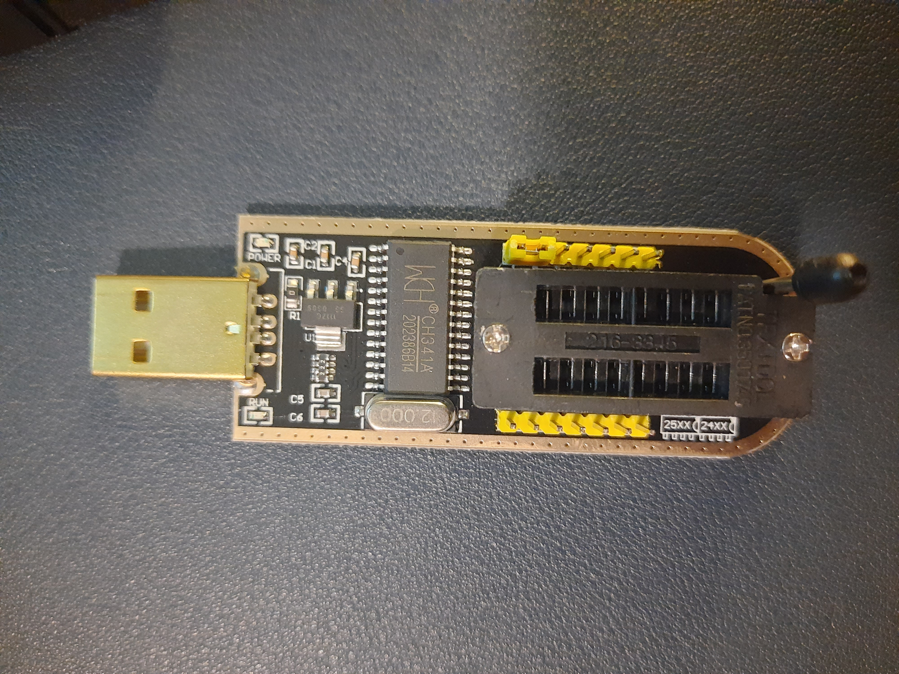

# SPI

{{#include ../../banners/hacktricks-training.md}}

## Основна інформація

SPI (Serial Peripheral Interface) - це синхронний послідовний комунікаційний протокол, що використовується в вбудованих системах для короткострокової комунікації між ІС (інтегральними схемами). Протокол комунікації SPI використовує архітектуру майстер-раб, яка координується годинниковим сигналом та сигналом вибору чіпа. Архітектура майстер-раб складається з майстра (зазвичай мікропроцесора), який керує зовнішніми периферійними пристроями, такими як EEPROM, датчики, контрольні пристрої тощо, які вважаються рабами.

До майстра можна підключити кілька рабів, але раби не можуть спілкуватися один з одним. Раби керуються двома виводами: годинником і вибором чіпа. Оскільки SPI є синхронним комунікаційним протоколом, вхідні та вихідні виводи слідують за годинниковими сигналами. Сигнал вибору чіпа використовується майстром для вибору раба та взаємодії з ним. Коли сигнал вибору чіпа високий, пристрій-раб не вибрано, тоді як коли він низький, чіп вибрано, і майстер взаємодіє з рабом.

MOSI (Master Out, Slave In) та MISO (Master In, Slave Out) відповідають за передачу та отримання даних. Дані надсилаються до пристрою-раба через вивід MOSI, поки сигнал вибору чіпа утримується на низькому рівні. Вхідні дані містять інструкції, адреси пам'яті або дані відповідно до технічного опису постачальника пристрою-раба. Після дійсного вводу вивід MISO відповідає за передачу даних до майстра. Вихідні дані надсилаються точно на наступному тактовому циклі після завершення вводу. Вивід MISO передає дані, поки дані повністю не передадуться або поки майстер не встановить сигнал вибору чіпа високим (в цьому випадку раб перестане передавати, і майстер не буде слухати після цього тактового циклу).

## Вивантаження прошивки з EEPROM

Вивантаження прошивки може бути корисним для аналізу прошивки та виявлення вразливостей у ній. Часто прошивка недоступна в Інтернеті або є нерелевантною через різні фактори, такі як номер моделі, версія тощо. Тому безпосереднє витягування прошивки з фізичного пристрою може бути корисним для конкретизації під час пошуку загроз.

Отримання серійної консолі може бути корисним, але часто трапляється, що файли є тільки для читання. Це обмежує аналіз з різних причин. Наприклад, інструменти, які потрібні для надсилання та отримання пакетів, можуть бути відсутніми в прошивці. Тому витягування бінарних файлів для реверс-інжинірингу є недоцільним. Отже, наявність всієї прошивки, вивантаженої на систему, та витягування бінарних файлів для аналізу може бути дуже корисним.

Крім того, під час червоного читання та отримання фізичного доступу до пристроїв, вивантаження прошивки може допомогти в модифікації файлів або інжекції шкідливих файлів, а потім повторного запису їх у пам'ять, що може бути корисним для впровадження бекдору в пристрій. Отже, існує безліч можливостей, які можна відкрити за допомогою вивантаження прошивки.

### CH341A Програматор та читач EEPROM

Цей пристрій є недорогим інструментом для вивантаження прошивок з EEPROM та повторного запису їх з файлами прошивки. Це був популярний вибір для роботи з чіпами BIOS комп'ютера (які є просто EEPROM). Цей пристрій підключається через USB і потребує мінімальних інструментів для початку. Крім того, він зазвичай виконує завдання швидко, тому може бути корисним і для фізичного доступу до пристроїв.



Підключіть пам'ять EEPROM до програматора CH341a та підключіть пристрій до комп'ютера. Якщо пристрій не виявляється, спробуйте встановити драйвери на комп'ютер. Також переконайтеся, що EEPROM підключено в правильній орієнтації (зазвичай, розмістіть вивід VCC у зворотній орієнтації до USB-роз'єму), інакше програмне забезпечення не зможе виявити чіп. За потреби зверніться до діаграми:

 

Нарешті, використовуйте програмне забезпечення, таке як flashrom, G-Flash (GUI) тощо, для вивантаження прошивки. G-Flash - це мінімальний GUI-інструмент, який швидкий і автоматично виявляє EEPROM. Це може бути корисним, якщо прошивку потрібно витягнути швидко, без зайвих маніпуляцій з документацією.


Після вивантаження прошивки аналіз можна провести на бінарних файлах. Інструменти, такі як strings, hexdump, xxd, binwalk тощо, можуть бути використані для витягнення великої кількості інформації про прошивку, а також про всю файлову систему.

Для витягнення вмісту з прошивки можна використовувати binwalk. Binwalk аналізує шістнадцяткові сигнатури та ідентифікує файли в бінарному файлі та здатний їх витягувати.
```
binwalk -e <filename>
```
Файли можуть бути .bin або .rom в залежності від використовуваних інструментів та конфігурацій.

> [!CAUTION]
> Зверніть увагу, що витягування прошивки є делікатним процесом і вимагає багато терпіння. Будь-яке неналежне поводження може потенційно пошкодити прошивку або навіть повністю її стерти, зробивши пристрій непридатним для використання. Рекомендується вивчити конкретний пристрій перед спробою витягти прошивку.

### Bus Pirate + flashrom

.png>)

Зверніть увагу, що навіть якщо PINOUT Pirate Bus вказує на контакти для **MOSI** та **MISO** для підключення до SPI, деякі SPI можуть вказувати контакти як DI та DO. **MOSI -> DI, MISO -> DO**

.png>)

У Windows або Linux ви можете використовувати програму [**`flashrom`**](https://www.flashrom.org/Flashrom) для скидання вмісту флеш-пам'яті, запустивши щось на зразок:
```bash
# In this command we are indicating:
# -VV Verbose
# -c <chip> The chip (if you know it better, if not, don'tindicate it and the program might be able to find it)
# -p <programmer> In this case how to contact th chip via the Bus Pirate
# -r <file> Image to save in the filesystem
flashrom -VV -c "W25Q64.V" -p buspirate_spi:dev=COM3 -r flash_content.img
```
{{#include ../../banners/hacktricks-training.md}}
