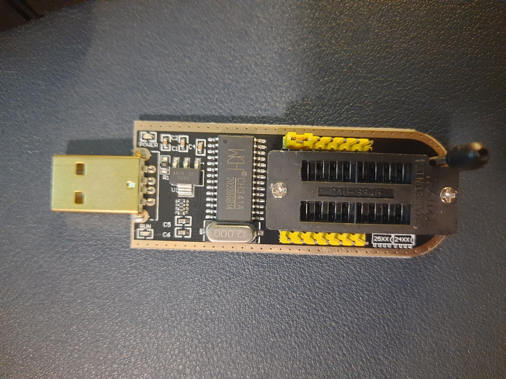
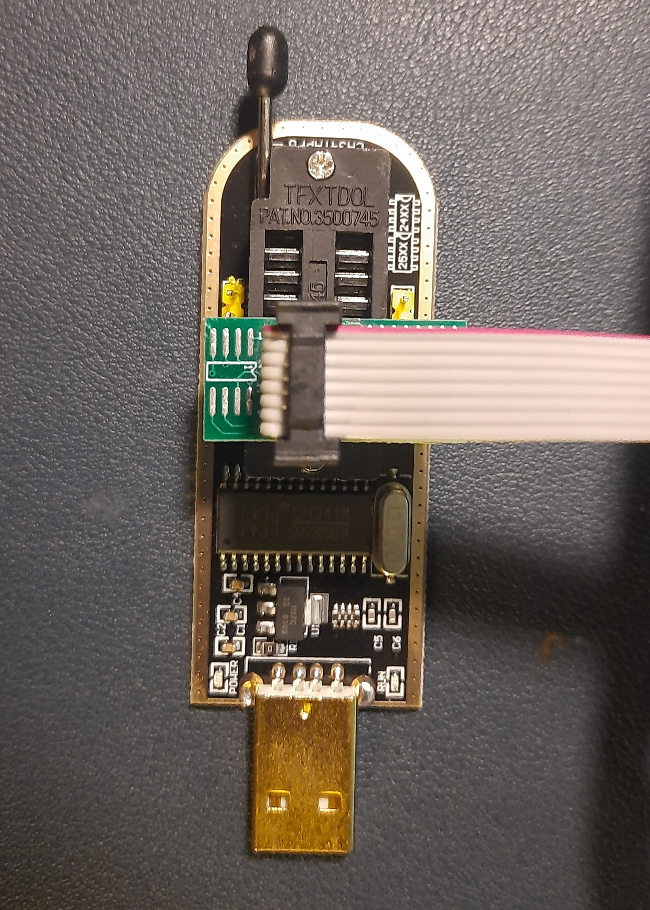
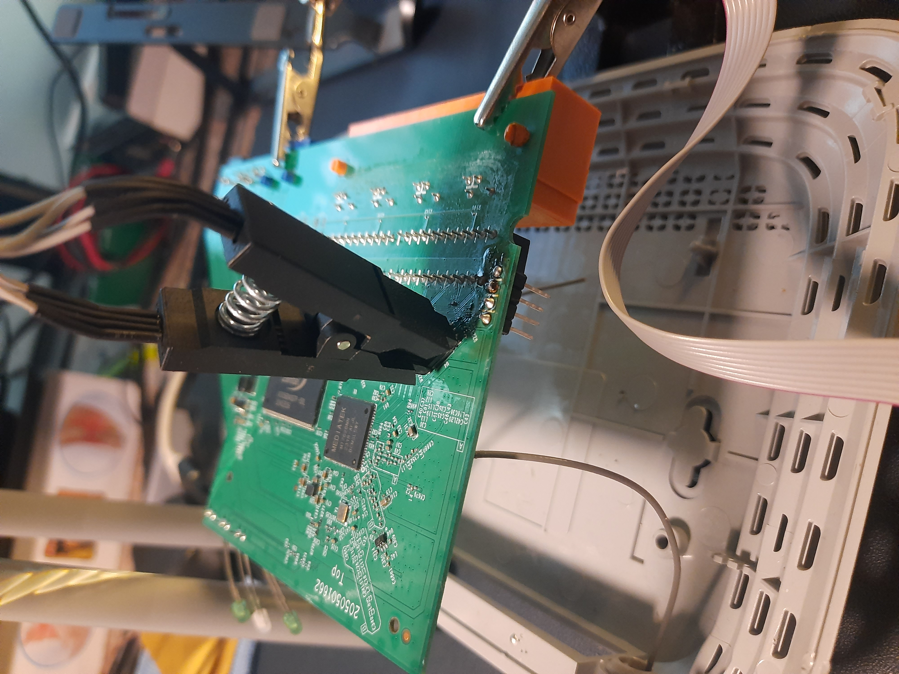
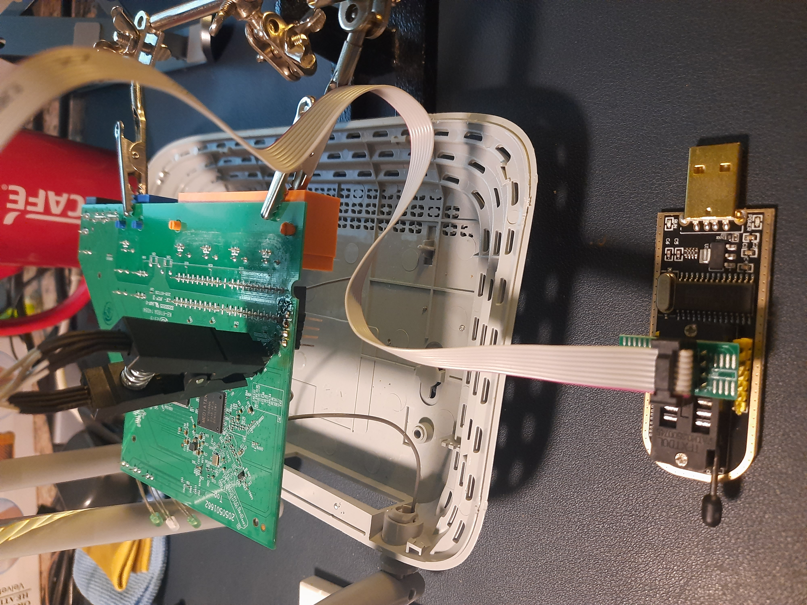

# SPI

{{#include ../../banners/hacktricks-training.md}}

## Basic Information

SPI (Serial Peripheral Interface) is a synchronous serial bus commonly used for short-distance communication between integrated circuits. A controller supplies the clock and selects a peripheral, such as an EEPROM, sensor, or control device, using a chip-select signal.<sup>[[1]](#references)</sup>

Multiple peripherals can share the clock and data lines, normally with a separate chip-select per peripheral. The controller orchestrates transfers; peripherals normally do not communicate directly with each other over the SPI bus. Chip-select polarity and timing are device-specific; active-low selection is common but not universal. SPI does not define discovery, addressing, commands, or a single maximum transfer length, so always consult the target datasheet.<sup>[[1]](#references)</sup>

MOSI/COPI carries controller-to-peripheral data and MISO/CIPO carries peripheral-to-controller data. Both directions can shift simultaneously. The relationship between a command, address, dummy cycles, and returned data is defined by the peripheral—not by SPI—and depends on clock polarity and phase (modes 0–3). Do not assume that output begins exactly one clock after input ends.<sup>[[1]](#references)</sup>

## Dumping Firmware from EEPROMs

Dumping firmware can be useful for analyzing it and finding vulnerabilities. The correct image may be unavailable online or differ by model, hardware revision, or version, so extracting it directly from the physical device provides an exact assessment target.

A serial console can help, but its filesystem may be read-only and the target may lack analysis tools, including utilities needed to send/receive test traffic or extract binaries conveniently. An offline image preserves the complete flash layout and permits filesystem extraction and reverse engineering without modifying the running target.

During an authorized physical assessment, a verified dump can also support controlled modification and reflashing tests. This includes changing files or injecting a test payload/backdoor to demonstrate firmware-level persistence. Preserve multiple matching reads and the original image before any write: an incorrect voltage, chip selection, layout, or image can brick the device.

### CH341A EEPROM Programmer and Reader

This inexpensive USB tool can dump and reflash compatible serial EEPROM and SPI flash devices. It is commonly used with the SPI NOR flash chips that store PC BIOS/UEFI firmware and is convenient during time-limited physical access.



Connect the flash memory to the CH341A and then connect the programmer to the computer. If the programmer itself is not detected, check the USB cable, OS permissions, and the appropriate CH341A driver before troubleshooting the target chip. Confirm the chip's voltage, pin 1, adapter wiring, and programmer output with the datasheets or a meter—do **not** rely on a rule such as placing VCC opposite the USB connector. Incorrect orientation or 5 V applied to a 3.3/1.8 V part can destroy it. In-circuit reads may also fail because the rest of the board loads or powers the bus.<sup>[[2]](#references)</sup>

 

Use software such as `flashrom` or G-Flash to read the chip. G-Flash is a minimal GUI and may auto-detect compatible devices, which can be convenient during quick acquisition, but confirm the detected model and voltage yourself. Specify the exact programmer and, when necessary, the exact chip model; perform at least two reads and compare their hashes before treating a dump as reliable.<sup>[[2]](#references)</sup>



After dumping the firmware, the analysis can be done on the binary files. Tools like strings, hexdump, xxd, binwalk, etc. can be used to extract a lot of information about the firmware as well as the whole file system too.

For initial triage, Binwalk can scan for known signatures and extract supported embedded content:

```
binwalk -e <filename>
```

The output file may use `.bin`, `.rom`, or another extension; the extension does not establish the format.

> [!CAUTION]
> Note that firmware extraction is a delicate process and requires a lot of patience. Any mishandling can potentially corrupt the firmware or even erase it completely and make the device unusable. It is recommended to study the specific device before attempting to extract the firmware.

### Bus Pirate + flashrom

.png>)

Some datasheets label the target pins `DI` and `DO`: for a conventional single-data-line flash connection, controller **MOSI/COPI connects to DI** and controller **MISO/CIPO connects to DO**. Verify the target datasheet because dual/quad I/O parts reuse pins in other modes.

.png>)

In Windows or Linux you can use the program [**`flashrom`**](https://www.flashrom.org/Flashrom) to dump the content of the flash memory running something like:

```bash
# In this command we are indicating:
# -VV Verbose
# -c <chip> Exact chip model (omit it to let flashrom probe candidates)
# -p <programmer> Programmer configuration; here, the Bus Pirate connection
# -r <file> Image to save in the filesystem
flashrom -VV -c "W25Q64.V" -p buspirate_spi:dev=COM3 -r flash_content.img
```

Recent Bus Pirate documentation also shows optional `serialspeed` and `spispeed` parameters. Start conservatively if long wires or in-circuit loading make reads unstable.<sup>[[3]](#references)</sup>

## References

- [1] [Analog Devices — Introduction to SPI Interface](https://www.analog.com/en/resources/analog-dialogue/articles/introduction-to-spi-interface.html)
- [2] [flashrom manual — CH341A SPI programmer and read/write options](https://flashrom.org/classic_cli_manpage.html)
- [3] [Bus Pirate documentation — flashrom](https://docs.buspirate.com/docs/software/flashrom/)

{{#include ../../banners/hacktricks-training.md}}
