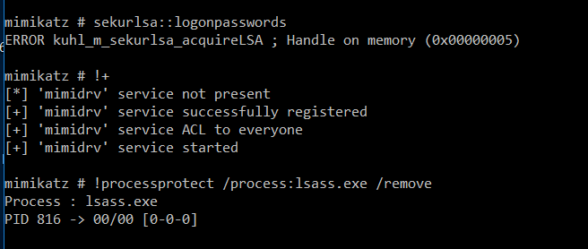

# Windows Credentials Protections

## Credentials Protections

{{#include ../../banners/hacktricks-training.md}}

## WDigest

The [WDigest](<https://technet.microsoft.com/pt-pt/library/cc778868(v=ws.10).aspx?f=255&MSPPError=-2147217396>) protocol, introduced with Windows XP, is designed for authentication via the HTTP Protocol and is **enabled by default on Windows XP through Windows 8.0 and Windows Server 2003 to Windows Server 2012**. This default setting results in **plain-text password storage in LSASS** (Local Security Authority Subsystem Service). An attacker can use Mimikatz to **extract these credentials** by executing:

```bash
sekurlsa::wdigest
```

To **toggle this feature off or on**, the _**UseLogonCredential**_ and _**Negotiate**_ registry keys within _**HKEY_LOCAL_MACHINE\System\CurrentControlSet\Control\SecurityProviders\WDigest**_ must be set to "1". If these keys are **absent or set to "0"**, WDigest is **disabled**:

```bash
reg query HKLM\SYSTEM\CurrentControlSet\Control\SecurityProviders\WDigest /v UseLogonCredential
```

## LSA Protection (PP & PPL protected processes)

**Protected Process (PP)** and **Protected Process Light (PPL)** are **Windows kernel-level protections** designed to prevent unauthorized access to sensitive processes like **LSASS**. Introduced in **Windows Vista**, the **PP model** was originally created for **DRM** enforcement and only allowed binaries signed with a **special media certificate** to be protected. A process marked as **PP** can only be accessed by other processes that are **also PP** and have an **equal or higher protection level**, and even then, **only with limited access rights** unless specifically allowed.

**PPL**, introduced in **Windows 8.1**, is a more flexible version of PP. It allows **broader use cases** (e.g., LSASS, Defender) by introducing **"protection levels"** based on the **digital signature’s EKU (Enhanced Key Usage)** field. The protection level is stored in the `EPROCESS.Protection` field, which is a `PS_PROTECTION` structure with:
- **Type** (`Protected` or `ProtectedLight`)
- **Signer** (e.g., `WinTcb`, `Lsa`, `Antimalware`, etc.)

This structure is packed into a single byte and determines **who can access whom**:
- **Higher signer values can access lower ones**
- **PPLs can’t access PPs**
- **Unprotected processes can't access any PPL/PP**
  
### What you need to know from an offensive perspective

- When **LSASS runs as a PPL**, attempts to open it using `OpenProcess(PROCESS_VM_READ | QUERY_INFORMATION)` from a normal admin context **fail with `0x5 (Access Denied)`**, even if `SeDebugPrivilege` is enabled.
- You can **check LSASS protection level** using tools like Process Hacker or programmatically by reading the `EPROCESS.Protection` value.
- LSASS will typically have `PsProtectedSignerLsa-Light` (`0x41`), which can be accessed **only by processes signed with a higher-level signer**, such as `WinTcb` (`0x61` or `0x62`).
- PPL is a **Userland-only restriction**; **kernel-level code can fully bypass it**.
- LSASS being PPL does **not prevent credential dumping if you can execute kernel shellcode** or **leverage a high-privileged process with proper access**.
- **Setting or removing PPL** requires reboot or **Secure Boot/UEFI settings**, which can persist the PPL setting even after registry changes are reversed.
  
**Bypass PPL protections options:**

If you want to dump LSASS despite PPL, you have 3 main options:
1. **Use a signed kernel driver (e.g., Mimikatz + mimidrv.sys)** to **remove LSASS’s protection flag**:



2. **Bring Your Own Vulnerable Driver (BYOVD)** to run custom kernel code and disable the protection. Tools like **PPLKiller**, **gdrv-loader**, or **kdmapper** make this feasible.
3. **Steal an existing LSASS handle** from another process that has it open (e.g., an AV process), then **duplicate it** into your process. This is the basis of the `pypykatz live lsa --method handledup` technique.
4. **Abuse some privileged process** that will allow you to load arbitrary code into its address space or inside another privileged process, effectively bypassing the PPL restrictions. You can check an example of this in [bypassing-lsa-protection-in-userland](https://blog.scrt.ch/2021/04/22/bypassing-lsa-protection-in-userland/) or [https://github.com/itm4n/PPLdump](https://github.com/itm4n/PPLdump).

**Check current status of LSA protection (PPL/PP) for LSASS**:

```bash
reg query HKEY_LOCAL_MACHINE\SYSTEM\CurrentControlSet\Control\LSA /v RunAsPPL
```

When you running **`mimikatz privilege::debug sekurlsa::logonpasswords`** it'll probably fail with the error code `0x00000005` becasue of this.

- For more information about this check [https://itm4n.github.io/lsass-runasppl/](https://itm4n.github.io/lsass-runasppl/)


## Credential Guard

**Credential Guard**, a feature exclusive to **Windows 10 (Enterprise and Education editions)**, enhances the security of machine credentials using **Virtual Secure Mode (VSM)** and **Virtualization Based Security (VBS)**. It leverages CPU virtualization extensions to isolate key processes within a protected memory space, away from the main operating system's reach. This isolation ensures that even the kernel cannot access the memory in VSM, effectively safeguarding credentials from attacks like **pass-the-hash**. The **Local Security Authority (LSA)** operates within this secure environment as a trustlet, while the **LSASS** process in the main OS acts merely as a communicator with the VSM's LSA.

By default, **Credential Guard** is not active and requires manual activation within an organization. It's critical for enhancing security against tools like **Mimikatz**, which are hindered in their ability to extract credentials. However, vulnerabilities can still be exploited through the addition of custom **Security Support Providers (SSP)** to capture credentials in clear text during login attempts.

To verify **Credential Guard**'s activation status, the registry key _**LsaCfgFlags**_ under _**HKLM\System\CurrentControlSet\Control\LSA**_ can be inspected. A value of "**1**" indicates activation with **UEFI lock**, "**2**" without lock, and "**0**" denotes it is not enabled. This registry check, while a strong indicator, is not the sole step for enabling Credential Guard. Detailed guidance and a PowerShell script for enabling this feature are available online.

```bash
reg query HKLM\System\CurrentControlSet\Control\LSA /v LsaCfgFlags
```

For a comprehensive understanding and instructions on enabling **Credential Guard** in Windows 10 and its automatic activation in compatible systems of **Windows 11 Enterprise and Education (version 22H2)**, visit [Microsoft's documentation](https://docs.microsoft.com/en-us/windows/security/identity-protection/credential-guard/credential-guard-manage).

Further details on implementing custom SSPs for credential capture are provided in [this guide](../active-directory-methodology/custom-ssp.md).

## RDP RestrictedAdmin Mode

**Windows 8.1 and Windows Server 2012 R2** introduced several new security features, including the _**Restricted Admin mode for RDP**_. This mode was designed to enhance security by mitigating the risks associated with [**pass the hash**](https://blog.ahasayen.com/pass-the-hash/) attacks.

Traditionally, when connecting to a remote computer via RDP, your credentials are stored on the target machine. This poses a significant security risk, especially when using accounts with elevated privileges. However, with the introduction of _**Restricted Admin mode**_, this risk is substantially reduced.

When initiating an RDP connection using the command **mstsc.exe /RestrictedAdmin**, authentication to the remote computer is performed without storing your credentials on it. This approach ensures that, in the event of a malware infection or if a malicious user gains access to the remote server, your credentials are not compromised, as they are not stored on the server.

It's important to note that in **Restricted Admin mode**, attempts to access network resources from the RDP session will not use your personal credentials; instead, the **machine's identity** is used.

This feature marks a significant step forward in securing remote desktop connections and protecting sensitive information from being exposed in case of a security breach.


For more detailed information on visit [this resource](https://blog.ahasayen.com/restricted-admin-mode-for-rdp/).

## Cached Credentials

Windows secures **domain credentials** through the **Local Security Authority (LSA)**, supporting logon processes with security protocols like **Kerberos** and **NTLM**. A key feature of Windows is its capability to cache the **last ten domain logins** to ensure users can still access their computers even if the **domain controller is offline**—a boon for laptop users often away from their company's network.

The number of cached logins is adjustable via a specific **registry key or group policy**. To view or change this setting, the following command is utilized:

```bash
reg query "HKEY_LOCAL_MACHINE\SOFTWARE\MICROSOFT\WINDOWS NT\CURRENTVERSION\WINLOGON" /v CACHEDLOGONSCOUNT
```

Access to these cached credentials is tightly controlled, with only the **SYSTEM** account having the necessary permissions to view them. Administrators needing to access this information must do so with SYSTEM user privileges. The credentials are stored at: `HKEY_LOCAL_MACHINE\SECURITY\Cache`

**Mimikatz** can be employed to extract these cached credentials using the command `lsadump::cache`.

For further details, the original [source](http://juggernaut.wikidot.com/cached-credentials) provides comprehensive information.

## Protected Users

Membership in the **Protected Users group** introduces several security enhancements for users, ensuring higher levels of protection against credential theft and misuse:

- **Credential Delegation (CredSSP)**: Even if the Group Policy setting for **Allow delegating default credentials** is enabled, plain text credentials of Protected Users will not be cached.
- **Windows Digest**: Starting from **Windows 8.1 and Windows Server 2012 R2**, the system will not cache plain text credentials of Protected Users, regardless of the Windows Digest status.
- **NTLM**: The system will not cache Protected Users' plain text credentials or NT one-way functions (NTOWF).
- **Kerberos**: For Protected Users, Kerberos authentication will not generate **DES** or **RC4 keys**, nor will it cache plain text credentials or long-term keys beyond the initial Ticket-Granting Ticket (TGT) acquisition.
- **Offline Sign-In**: Protected Users will not have a cached verifier created at sign-in or unlock, meaning offline sign-in is not supported for these accounts.

These protections are activated the moment a user, who is a member of the **Protected Users group**, signs into the device. This ensures that critical security measures are in place to safeguard against various methods of credential compromise.

For more detailed information, consult the official [documentation](https://docs.microsoft.com/en-us/windows-server/security/credentials-protection-and-management/protected-users-security-group).

**Table from** [**the docs**](https://docs.microsoft.com/en-us/windows-server/identity/ad-ds/plan/security-best-practices/appendix-c--protected-accounts-and-groups-in-active-directory)**.**

| Windows Server 2003 RTM | Windows Server 2003 SP1+ | <p>Windows Server 2012,<br>Windows Server 2008 R2,<br>Windows Server 2008</p> | Windows Server 2016          |
| ----------------------- | ------------------------ | ----------------------------------------------------------------------------- | ---------------------------- |
| Account Operators       | Account Operators        | Account Operators                                                             | Account Operators            |
| Administrator           | Administrator            | Administrator                                                                 | Administrator                |
| Administrators          | Administrators           | Administrators                                                                | Administrators               |
| Backup Operators        | Backup Operators         | Backup Operators                                                              | Backup Operators             |
| Cert Publishers         |                          |                                                                               |                              |
| Domain Admins           | Domain Admins            | Domain Admins                                                                 | Domain Admins                |
| Domain Controllers      | Domain Controllers       | Domain Controllers                                                            | Domain Controllers           |
| Enterprise Admins       | Enterprise Admins        | Enterprise Admins                                                             | Enterprise Admins            |
|                         |                          |                                                                               | Enterprise Key Admins        |
|                         |                          |                                                                               | Key Admins                   |
| Krbtgt                  | Krbtgt                   | Krbtgt                                                                        | Krbtgt                       |
| Print Operators         | Print Operators          | Print Operators                                                               | Print Operators              |
|                         |                          | Read-only Domain Controllers                                                  | Read-only Domain Controllers |
| Replicator              | Replicator               | Replicator                                                                    | Replicator                   |
| Schema Admins           | Schema Admins            | Schema Admins                                                                 | Schema Admins                |
| Server Operators        | Server Operators         | Server Operators                                                              | Server Operators             |

{{#include ../../banners/hacktricks-training.md}}


