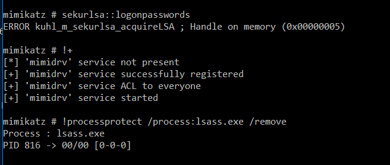
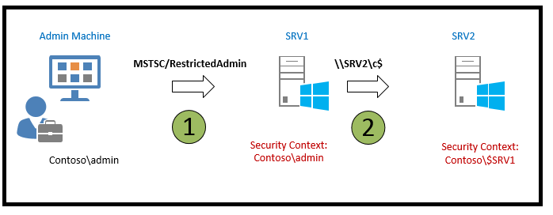

# Protections des identifiants Windows

{{#include ../../banners/hacktricks-training.md}}

## WDigest

Le protocole [WDigest](<https://technet.microsoft.com/pt-pt/library/cc778868(v=ws.10).aspx?f=255&MSPPError=-2147217396>), introduit avec Windows XP, est conçu pour l'authentification via le protocole HTTP et est **activé par défaut de Windows XP à Windows 8.0, ainsi que de Windows Server 2003 à Windows Server 2012**. Ce paramètre par défaut entraîne le **stockage des mots de passe en clair dans LSASS** (Local Security Authority Subsystem Service). Un attaquant peut utiliser Mimikatz pour **extraire ces identifiants** en exécutant :<sup>[[8]](#references)</sup>
```bash
sekurlsa::wdigest
```
Pour **activer ou désactiver cette fonctionnalité**, les clés de registre _**UseLogonCredential**_ et _**Negotiate**_ dans _**HKEY_LOCAL_MACHINE\System\CurrentControlSet\Control\SecurityProviders\WDigest**_ doivent être définies sur « 1 ». Si ces clés sont **absentes ou définies sur « 0 »**, WDigest est **désactivé** :
```bash
reg query HKLM\SYSTEM\CurrentControlSet\Control\SecurityProviders\WDigest /v UseLogonCredential
```
## LSA Protection (processus protégés PP et PPL)

**Protected Process (PP)** et **Protected Process Light (PPL)** sont des **protections au niveau du kernel Windows** conçues pour empêcher l’accès non autorisé aux processus sensibles comme **LSASS**. Introduit dans **Windows Vista**, le **modèle PP** a été créé à l’origine pour appliquer les règles de **DRM** et autorisait uniquement la protection des binaires signés avec un **certificat média spécial**. Un processus marqué comme **PP** ne peut être accessible que par d’autres processus qui sont **également PP** et possèdent un **niveau de protection égal ou supérieur**, et même dans ce cas, **uniquement avec des droits d’accès limités**, sauf autorisation spécifique.

**PPL**, introduit dans **Windows 8.1**, est une version plus flexible de PP. Il permet des **cas d’utilisation plus larges** (par exemple, LSASS et Defender) en introduisant des **« niveaux de protection »** basés sur le champ **EKU (Enhanced Key Usage)** de la **signature numérique**. Le niveau de protection est stocké dans le champ `EPROCESS.Protection`, qui est une structure `PS_PROTECTION` contenant :
- **Type** (`Protected` ou `ProtectedLight`)
- **Signer** (par exemple, `WinTcb`, `Lsa`, `Antimalware`, etc.)

Cette structure est empaquetée dans un seul octet et détermine **qui peut accéder à qui** :
- **Les valeurs de signer les plus élevées peuvent accéder aux valeurs inférieures**
- **Les PPL ne peuvent pas accéder aux PP**
- **Les processus non protégés ne peuvent accéder à aucun PPL/PP**

### Ce qu’il faut savoir d’un point de vue offensif

- Lorsque **LSASS s’exécute en tant que PPL**, les tentatives visant à l’ouvrir avec `OpenProcess(PROCESS_VM_READ | QUERY_INFORMATION)` depuis un contexte d’administrateur normal **échouent avec `0x5 (Access Denied)`**, même si `SeDebugPrivilege` est activé.
- Vous pouvez **vérifier le niveau de protection de LSASS** avec des outils comme Process Hacker ou programmatiquement en lisant la valeur `EPROCESS.Protection`.
- LSASS possède généralement `PsProtectedSignerLsa-Light` (`0x41`), auquel peuvent accéder **uniquement les processus signés avec un signer de niveau supérieur**, comme `WinTcb` (`0x61` ou `0x62`).
- PPL est une **restriction uniquement Userland** ; du **code au niveau du kernel peut la contourner complètement**.
- Le fait que LSASS soit un PPL **n’empêche pas le credential dumping si vous pouvez exécuter du shellcode kernel** ou **exploiter un processus hautement privilégié disposant des accès appropriés**.
- **La définition ou la suppression de PPL** nécessite un redémarrage ou des **paramètres Secure Boot/UEFI**, qui peuvent conserver le paramètre PPL même après l’annulation des modifications du registre.

### Créer un processus PPL au lancement (API documentée)

Windows fournit une méthode documentée pour demander un niveau Protected Process Light pour un processus enfant lors de sa création, au moyen de la liste d’attributs de démarrage étendue. Cela ne contourne pas les exigences de signature : l’image cible doit être signée pour la classe de signer demandée.

Flux minimal en C/C++ :
```c
// Request a PPL protection level for the child process at creation time
// Requires Windows 8.1+ and a properly signed image for the selected level
#include <windows.h>

int wmain(int argc, wchar_t **argv) {
STARTUPINFOEXW si = {0};
PROCESS_INFORMATION pi = {0};
si.StartupInfo.cb = sizeof(si);

SIZE_T attrSize = 0;
InitializeProcThreadAttributeList(NULL, 1, 0, &attrSize);
si.lpAttributeList = (PPROC_THREAD_ATTRIBUTE_LIST)HeapAlloc(GetProcessHeap(), 0, attrSize);
if (!si.lpAttributeList) return 1;

if (!InitializeProcThreadAttributeList(si.lpAttributeList, 1, 0, &attrSize)) return 1;

DWORD level = PROTECTION_LEVEL_ANTIMALWARE_LIGHT; // or WINDOWS_LIGHT/LSA_LIGHT/WINTCB_LIGHT
if (!UpdateProcThreadAttribute(
si.lpAttributeList, 0,
PROC_THREAD_ATTRIBUTE_PROTECTION_LEVEL,
&level, sizeof(level), NULL, NULL)) {
return 1;
}

DWORD flags = EXTENDED_STARTUPINFO_PRESENT;
if (!CreateProcessW(L"C\\Windows\\System32\\notepad.exe", NULL, NULL, NULL, FALSE,
flags, NULL, NULL, &si.StartupInfo, &pi)) {
// If the image isn't signed appropriately for the requested level,
// CreateProcess will fail with ERROR_INVALID_IMAGE_HASH (577).
return 1;
}

// cleanup
DeleteProcThreadAttributeList(si.lpAttributeList);
HeapFree(GetProcessHeap(), 0, si.lpAttributeList);
CloseHandle(pi.hThread);
CloseHandle(pi.hProcess);
return 0;
}
```
Notes et contraintes :
- Utilisez `STARTUPINFOEX` avec `InitializeProcThreadAttributeList` et `UpdateProcThreadAttribute(PROC_THREAD_ATTRIBUTE_PROTECTION_LEVEL, ...)`, puis transmettez `EXTENDED_STARTUPINFO_PRESENT` à `CreateProcess*`.<sup>[[2]](#references)[[3]](#references)[[4]](#references)</sup>
- Le `DWORD` de protection peut être défini avec des constantes telles que `PROTECTION_LEVEL_WINTCB_LIGHT`, `PROTECTION_LEVEL_WINDOWS`, `PROTECTION_LEVEL_WINDOWS_LIGHT`, `PROTECTION_LEVEL_ANTIMALWARE_LIGHT` ou `PROTECTION_LEVEL_LSA_LIGHT`.
- Le processus enfant ne démarre en tant que PPL que si son image est signée pour cette classe de signer ; sinon, la création du processus échoue, généralement avec `ERROR_INVALID_IMAGE_HASH (577)` / `STATUS_INVALID_IMAGE_HASH (0xC0000428)`.
- Il ne s’agit pas d’un bypass — c’est une API prise en charge, destinée aux images correctement signées. Utile pour renforcer les tools ou valider des configurations protégées par PPL.

Exemple de CLI utilisant un loader minimal :<sup>[[1]](#references)</sup>
- Signer antimalware : `CreateProcessAsPPL.exe 3 C:\Tools\agent.exe --svc`
- Signer LSA-light : `CreateProcessAsPPL.exe 4 C:\Windows\System32\notepad.exe`

**Options de bypass des protections PPL :**

Si vous voulez dumper LSASS malgré PPL, vous avez 3 options principales :
1. **Utiliser un kernel driver signé (par exemple, Mimikatz + mimidrv.sys)** pour **supprimer le flag de protection de LSASS** :



2. **Bring Your Own Vulnerable Driver (BYOVD)** pour exécuter du code kernel personnalisé et désactiver la protection. Des tools comme **PPLKiller**, **gdrv-loader** ou **kdmapper** rendent cela possible.
3. **Voler un handle LSASS existant** depuis un autre processus qui l’a ouvert (par exemple, un processus AV), puis le **dupliquer** dans votre processus. C’est la base de la technique `pypykatz live lsa --method handledup`.
4. **Abuser d’un processus privilégié** qui vous permettra de charger du code arbitraire dans son espace d’adressage ou dans un autre processus privilégié, contournant ainsi efficacement les restrictions PPL. Vous pouvez consulter un exemple dans [bypassing-lsa-protection-in-userland](https://blog.scrt.ch/2021/04/22/bypassing-lsa-protection-in-userland/) ou [https://github.com/itm4n/PPLdump](https://github.com/itm4n/PPLdump).

**Vérifier l’état actuel de la protection LSA (PPL/PP) pour LSASS** :
```bash
reg query HKEY_LOCAL_MACHINE\SYSTEM\CurrentControlSet\Control\LSA /v RunAsPPL
```
Lors de l’exécution de **`mimikatz privilege::debug sekurlsa::logonpasswords`**, celle-ci échouera probablement avec le code d’erreur `0x00000005` en raison de cette protection.

- Pour plus d’informations sur cette vérification : [https://itm4n.github.io/lsass-runasppl/](https://itm4n.github.io/lsass-runasppl/)<sup>[[5]](#references)</sup>


## Credential Guard

**Credential Guard**, une fonctionnalité exclusive à **Windows 10 (éditions Enterprise et Education)**, renforce la sécurité des credentials de la machine grâce à **Virtual Secure Mode (VSM)** et à **Virtualization Based Security (VBS)**. Elle exploite les extensions de virtualisation du processeur pour isoler les processus essentiels au sein d’un espace mémoire protégé, hors de portée du système d’exploitation principal. Cette isolation garantit que même le kernel ne peut pas accéder à la mémoire du VSM, protégeant ainsi efficacement les credentials contre des attaques telles que **pass-the-hash**. La **Local Security Authority (LSA)** s’exécute dans cet environnement sécurisé en tant que trustlet, tandis que le processus **LSASS** du système d’exploitation principal agit simplement comme intermédiaire avec la LSA du VSM.

Par défaut, **Credential Guard** n’est pas actif et nécessite une activation manuelle au sein de l’organisation. Il est essentiel pour renforcer la sécurité contre des outils comme **Mimikatz**, dont la capacité à extraire des credentials est limitée. Toutefois, des vulnérabilités peuvent toujours être exploitées en ajoutant des **Security Support Providers (SSP)** personnalisés afin de capturer les credentials en clair lors des tentatives de connexion.

Pour vérifier l’état d’activation de **Credential Guard**, il est possible d’inspecter la clé de registre _**LsaCfgFlags**_ sous _**HKLM\System\CurrentControlSet\Control\LSA**_. La valeur "**1**" indique une activation avec **UEFI lock**, "**2**" une activation sans verrouillage, et "**0**" indique que la fonctionnalité n’est pas activée. Cette vérification du registre, bien qu’elle constitue un indicateur fiable, n’est pas la seule étape nécessaire à l’activation de Credential Guard. Des instructions détaillées ainsi qu’un script PowerShell permettant d’activer cette fonctionnalité sont disponibles en ligne.
```bash
reg query HKLM\System\CurrentControlSet\Control\LSA /v LsaCfgFlags
```
Pour une compréhension complète et des instructions concernant l'activation de **Credential Guard** dans Windows 10 ainsi que son activation automatique sur les systèmes compatibles de **Windows 11 Enterprise et Education (version 22H2)**, consultez la [documentation de Microsoft](https://docs.microsoft.com/en-us/windows/security/identity-protection/credential-guard/credential-guard-manage).<sup>[[9]](#references)</sup>

De plus amples informations sur l'implémentation de SSP personnalisés pour la capture d'identifiants sont disponibles dans [ce guide](../active-directory-methodology/custom-ssp.md).

## Mode RDP RestrictedAdmin

**Windows 8.1 et Windows Server 2012 R2** ont introduit plusieurs nouvelles fonctionnalités de sécurité, notamment le _**mode Restricted Admin pour RDP**_. Ce mode a été conçu pour renforcer la sécurité en atténuant les risques associés aux attaques [**pass the hash**](https://blog.ahasayen.com/pass-the-hash/).

Traditionnellement, lors de la connexion à un ordinateur distant via RDP, vos identifiants sont stockés sur la machine cible. Cela représente un risque de sécurité important, en particulier lors de l'utilisation de comptes disposant de privilèges élevés. Cependant, avec l'introduction du _**mode Restricted Admin**_, ce risque est considérablement réduit.

Lors de l'initiation d'une connexion RDP à l'aide de la commande **mstsc.exe /RestrictedAdmin**, l'authentification auprès de l'ordinateur distant s'effectue sans y stocker vos identifiants. Cette approche garantit que, dans le cas d'une infection par un malware ou si un utilisateur malveillant accède au serveur distant, vos identifiants ne sont pas compromis, puisqu'ils ne sont pas stockés sur le serveur.

Il est important de noter qu'en **mode Restricted Admin**, les tentatives d'accès aux ressources réseau depuis la session RDP n'utilisent pas vos identifiants personnels ; c'est plutôt l'**identité de la machine** qui est utilisée.

Cette fonctionnalité constitue une avancée significative pour sécuriser les connexions de bureau à distance et protéger les informations sensibles contre toute exposition en cas de faille de sécurité.



Pour plus d'informations, consultez [cette ressource](https://blog.ahasayen.com/restricted-admin-mode-for-rdp/).<sup>[[6]](#references)</sup>

## Identifiants mis en cache

Windows sécurise les **identifiants de domaine** via la **Local Security Authority (LSA)**, qui prend en charge les processus d'ouverture de session avec des protocoles de sécurité tels que **Kerberos** et **NTLM**. Une fonctionnalité essentielle de Windows est sa capacité à mettre en cache les **dix dernières ouvertures de session de domaine**, afin que les utilisateurs puissent continuer à accéder à leur ordinateur même si le **contrôleur de domaine est hors ligne** — un avantage pour les utilisateurs d'ordinateurs portables souvent éloignés du réseau de leur entreprise.

Le nombre d'ouvertures de session mises en cache peut être ajusté via une **clé de registre ou une stratégie de groupe** spécifique. Pour afficher ou modifier ce paramètre, la commande suivante est utilisée :
```bash
reg query "HKEY_LOCAL_MACHINE\SOFTWARE\MICROSOFT\WINDOWS NT\CURRENTVERSION\WINLOGON" /v CACHEDLOGONSCOUNT
```
L’accès à ces identifiants mis en cache est strictement contrôlé, seul le compte **SYSTEM** disposant des permissions nécessaires pour les consulter. Les administrateurs qui doivent accéder à ces informations doivent le faire avec les privilèges de l’utilisateur SYSTEM. Les identifiants sont stockés à l’emplacement suivant : `HKEY_LOCAL_MACHINE\SECURITY\Cache`

**Mimikatz** peut être utilisé pour extraire ces identifiants mis en cache à l’aide de la commande `lsadump::cache`.

Pour plus de détails, la [source originale](http://juggernaut.wikidot.com/cached-credentials) fournit des informations complètes.<sup>[[7]](#references)</sup>

## Protected Users

L’appartenance au **Protected Users group** apporte plusieurs améliorations de sécurité aux utilisateurs, garantissant un niveau de protection plus élevé contre le vol et l’utilisation abusive d’identifiants :

- **Credential Delegation (CredSSP)** : même si le paramètre de Group Policy **Allow delegating default credentials** est activé, les identifiants en clair des membres de Protected Users ne seront pas mis en cache.
- **Windows Digest** : à partir de **Windows 8.1 et Windows Server 2012 R2**, le système ne mettra pas en cache les identifiants en clair des membres de Protected Users, quel que soit l’état de Windows Digest.
- **NTLM** : le système ne mettra pas en cache les identifiants en clair ni les fonctions à sens unique NT (NTOWF) des membres de Protected Users.
- **Kerberos** : pour les membres de Protected Users, l’authentification Kerberos ne générera pas de clés **DES** ou **RC4**, et ne mettra pas en cache les identifiants en clair ni les clés à long terme au-delà de l’acquisition initiale du Ticket-Granting Ticket (TGT).
- **Offline Sign-In** : aucun vérificateur mis en cache ne sera créé lors de la connexion ou du déverrouillage pour les membres de Protected Users ; la connexion hors ligne n’est donc pas prise en charge pour ces comptes.

Ces protections sont activées dès qu’un utilisateur membre du **Protected Users group** se connecte à l’appareil. Cela garantit la mise en place de mesures de sécurité essentielles pour se protéger contre différentes méthodes de compromission des identifiants.

Pour plus d’informations, consultez la [documentation officielle](https://docs.microsoft.com/en-us/windows-server/security/credentials-protection-and-management/protected-users-security-group).<sup>[[10]](#references)</sup>

**Tableau issu de** [**la documentation**](https://docs.microsoft.com/en-us/windows-server/identity/ad-ds/plan/security-best-practices/appendix-c--protected-accounts-and-groups-in-active-directory)**.**<sup>[[11]](#references)</sup>

| Windows Server 2003 RTM | Windows Server 2003 SP1+ | <p>Windows Server 2012,<br>Windows Server 2008 R2,<br>Windows Server 2008</p> | Windows Server 2016          |
| ----------------------- | ------------------------ | ----------------------------------------------------------------------------- | ---------------------------- |
| Account Operators       | Account Operators        | Account Operators                                                             | Account Operators            |
| Administrator           | Administrator            | Administrator                                                                 | Administrator                |
| Administrators          | Administrators           | Administrators                                                                | Administrators               |
| Backup Operators        | Backup Operators         | Backup Operators                                                              | Backup Operators             |
| Cert Publishers         |                          |                                                                               |                              |
| Domain Admins           | Domain Admins            | Domain Admins                                                                 | Domain Admins                |
| Domain Controllers      | Domain Controllers       | Domain Controllers                                                            | Domain Controllers           |
| Enterprise Admins       | Enterprise Admins        | Enterprise Admins                                                             | Enterprise Admins            |
|                         |                          |                                                                               | Enterprise Key Admins        |
|                         |                          |                                                                               | Key Admins                   |
| Krbtgt                  | Krbtgt                   | Krbtgt                                                                        | Krbtgt                       |
| Print Operators         | Print Operators          | Print Operators                                                               | Print Operators              |
|                         |                          | Read-only Domain Controllers                                                  | Read-only Domain Controllers |
| Replicator              | Replicator               | Replicator                                                                    | Replicator                   |
| Schema Admins           | Schema Admins            | Schema Admins                                                                 | Schema Admins                |
| Server Operators        | Server Operators         | Server Operators                                                              | Server Operators             |

## References

- [1] [CreateProcessAsPPL – lanceur de processus PPL minimal](https://github.com/2x7EQ13/CreateProcessAsPPL)
- [2] [Structure STARTUPINFOEX (Win32 API)](https://learn.microsoft.com/en-us/windows/win32/api/winbase/ns-winbase-startupinfoexw)
- [3] [InitializeProcThreadAttributeList (Win32 API)](https://learn.microsoft.com/en-us/windows/win32/api/processthreadsapi/nf-processthreadsapi-initializeprocthreadattributelist)
- [4] [UpdateProcThreadAttribute (Win32 API)](https://learn.microsoft.com/en-us/windows/win32/api/processthreadsapi/nf-processthreadsapi-updateprocthreadattribute)
- [5] [LSASS RunAsPPL – contexte et fonctionnement interne](https://itm4n.github.io/lsass-runasppl/)
- [6] [Restricted Admin Mode for RDP](https://blog.ahasayen.com/restricted-admin-mode-for-rdp/)
- [7] [Identifiants mis en cache - Juggernaut AppSec Wiki](http://juggernaut.wikidot.com/cached-credentials)
- [8] [Authentification WDigest (Microsoft TechNet)](<https://technet.microsoft.com/pt-pt/library/cc778868(v=ws.10).aspx?f=255&MSPPError=-2147217396>)
- [9] [Gérer Windows Defender Credential Guard (Microsoft Learn)](https://docs.microsoft.com/en-us/windows/security/identity-protection/credential-guard/credential-guard-manage)
- [10] [Protected Users Security Group (Microsoft Learn)](https://docs.microsoft.com/en-us/windows-server/security/credentials-protection-and-management/protected-users-security-group)
- [11] [Annexe C : comptes et groupes protégés dans Active Directory (Microsoft Learn)](https://docs.microsoft.com/en-us/windows-server/identity/ad-ds/plan/security-best-practices/appendix-c--protected-accounts-and-groups-in-active-directory)
{{#include ../../banners/hacktricks-training.md}}
