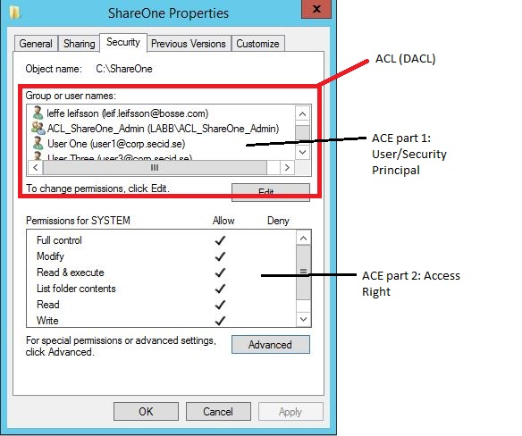

# ACLs - DACLs/SACLs/ACEs

{{#include ../../banners/hacktricks-training.md}}

## **Lista de Control de Acceso (ACL)**

Una Lista de Control de Acceso (ACL) consiste en un conjunto ordenado de Entradas de Control de Acceso (ACEs) que dictan las protecciones para un objeto y sus propiedades. En esencia, una ACL define qué acciones de qué principios de seguridad (usuarios o grupos) están permitidas o denegadas en un objeto dado.

Hay dos tipos de ACLs:

- **Lista de Control de Acceso Discrecional (DACL):** Especifica qué usuarios y grupos tienen o no tienen acceso a un objeto.
- **Lista de Control de Acceso del Sistema (SACL):** Regula la auditoría de los intentos de acceso a un objeto.

El proceso de acceso a un archivo implica que el sistema verifique el descriptor de seguridad del objeto contra el token de acceso del usuario para determinar si se debe conceder acceso y la extensión de ese acceso, basado en las ACEs.

### **Componentes Clave**

- **DACL:** Contiene ACEs que otorgan o deniegan permisos de acceso a usuarios y grupos para un objeto. Es esencialmente la ACL principal que dicta los derechos de acceso.
- **SACL:** Se utiliza para auditar el acceso a objetos, donde las ACEs definen los tipos de acceso que se registrarán en el Registro de Eventos de Seguridad. Esto puede ser invaluable para detectar intentos de acceso no autorizados o solucionar problemas de acceso.

### **Interacción del Sistema con las ACLs**

Cada sesión de usuario está asociada con un token de acceso que contiene información de seguridad relevante para esa sesión, incluyendo identidades de usuario, grupo y privilegios. Este token también incluye un SID de inicio de sesión que identifica de manera única la sesión.

La Autoridad de Seguridad Local (LSASS) procesa las solicitudes de acceso a objetos examinando la DACL en busca de ACEs que coincidan con el principio de seguridad que intenta acceder. El acceso se concede de inmediato si no se encuentran ACEs relevantes. De lo contrario, LSASS compara las ACEs con el SID del principio de seguridad en el token de acceso para determinar la elegibilidad de acceso.

### **Proceso Resumido**

- **ACLs:** Definen permisos de acceso a través de DACLs y reglas de auditoría a través de SACLs.
- **Token de Acceso:** Contiene información de usuario, grupo y privilegios para una sesión.
- **Decisión de Acceso:** Se toma comparando las ACEs de la DACL con el token de acceso; las SACLs se utilizan para auditoría.

### ACEs

Hay **tres tipos principales de Entradas de Control de Acceso (ACEs)**:

- **ACE de Acceso Denegado**: Esta ACE deniega explícitamente el acceso a un objeto para usuarios o grupos especificados (en una DACL).
- **ACE de Acceso Permitido**: Esta ACE otorga explícitamente acceso a un objeto para usuarios o grupos especificados (en una DACL).
- **ACE de Auditoría del Sistema**: Situada dentro de una Lista de Control de Acceso del Sistema (SACL), esta ACE es responsable de generar registros de auditoría ante intentos de acceso a un objeto por parte de usuarios o grupos. Documenta si se permitió o denegó el acceso y la naturaleza del acceso.

Cada ACE tiene **cuatro componentes críticos**:

1. El **Identificador de Seguridad (SID)** del usuario o grupo (o su nombre principal en una representación gráfica).
2. Una **bandera** que identifica el tipo de ACE (acceso denegado, permitido o auditoría del sistema).
3. **Banderas de herencia** que determinan si los objetos secundarios pueden heredar la ACE de su padre.
4. Un [**máscara de acceso**](https://docs.microsoft.com/en-us/openspecs/windows_protocols/ms-dtyp/7a53f60e-e730-4dfe-bbe9-b21b62eb790b?redirectedfrom=MSDN), un valor de 32 bits que especifica los derechos otorgados al objeto.

La determinación de acceso se lleva a cabo examinando secuencialmente cada ACE hasta que:

- Una **ACE de Acceso Denegado** deniega explícitamente los derechos solicitados a un fideicomisario identificado en el token de acceso.
- **ACE(s) de Acceso Permitido** otorgan explícitamente todos los derechos solicitados a un fideicomisario en el token de acceso.
- Al revisar todas las ACEs, si algún derecho solicitado **no ha sido explícitamente permitido**, el acceso se deniega implícitamente.

### Orden de ACEs

La forma en que se colocan las **ACEs** (reglas que dicen quién puede o no acceder a algo) en una lista llamada **DACL** es muy importante. Esto se debe a que una vez que el sistema concede o deniega acceso basado en estas reglas, deja de mirar el resto.

Hay una mejor manera de organizar estas ACEs, y se llama **"orden canónico."** Este método ayuda a asegurar que todo funcione de manera fluida y justa. Así es como se aplica para sistemas como **Windows 2000** y **Windows Server 2003**:

- Primero, coloca todas las reglas que están hechas **específicamente para este elemento** antes de las que provienen de otro lugar, como una carpeta padre.
- En esas reglas específicas, coloca las que dicen **"no" (denegar)** antes de las que dicen **"sí" (permitir)**.
- Para las reglas que provienen de otro lugar, comienza con las que vienen de la **fuente más cercana**, como la carpeta padre, y luego retrocede desde allí. Nuevamente, coloca **"no"** antes de **"sí."**

Esta configuración ayuda en dos grandes maneras:

- Asegura que si hay un **"no"** específico, se respete, sin importar qué otras reglas de **"sí"** existan.
- Permite que el propietario de un elemento tenga la **última palabra** sobre quién puede entrar, antes de que se apliquen las reglas de carpetas padres o más atrás.

Al hacer las cosas de esta manera, el propietario de un archivo o carpeta puede ser muy preciso sobre quién obtiene acceso, asegurando que las personas adecuadas puedan entrar y las incorrectas no.

Así que, este **"orden canónico"** se trata de asegurar que las reglas de acceso sean claras y funcionen bien, poniendo primero las reglas específicas y organizando todo de manera inteligente.

### Ejemplo de GUI

[**Ejemplo de aquí**](https://secureidentity.se/acl-dacl-sacl-and-the-ace/)

Esta es la pestaña de seguridad clásica de una carpeta que muestra la ACL, DACL y ACEs:

Si hacemos clic en el **botón Avanzado**, obtendremos más opciones como la herencia:

Y si agregas o editas un Principio de Seguridad:

Y por último, tenemos la SACL en la pestaña de Auditoría:

### Explicando el Control de Acceso de Manera Simplificada

Al gestionar el acceso a recursos, como una carpeta, utilizamos listas y reglas conocidas como Listas de Control de Acceso (ACLs) y Entradas de Control de Acceso (ACEs). Estas definen quién puede o no acceder a ciertos datos.

#### Denegando Acceso a un Grupo Específico

Imagina que tienes una carpeta llamada Cost, y quieres que todos tengan acceso a ella excepto al equipo de marketing. Al establecer las reglas correctamente, podemos asegurarnos de que al equipo de marketing se le deniegue explícitamente el acceso antes de permitir a todos los demás. Esto se hace colocando la regla para denegar el acceso al equipo de marketing antes de la regla que permite el acceso a todos.

#### Permitiendo Acceso a un Miembro Específico de un Grupo Denegado

Supongamos que Bob, el director de marketing, necesita acceso a la carpeta Cost, aunque el equipo de marketing en general no debería tener acceso. Podemos agregar una regla específica (ACE) para Bob que le otorgue acceso, y colocarla antes de la regla que deniega el acceso al equipo de marketing. De esta manera, Bob obtiene acceso a pesar de la restricción general sobre su equipo.

#### Entendiendo las Entradas de Control de Acceso

Las ACEs son las reglas individuales en una ACL. Identifican a los usuarios o grupos, especifican qué acceso se permite o se deniega, y determinan cómo se aplican estas reglas a los subelementos (herencia). Hay dos tipos principales de ACEs:

- **ACEs Genéricas**: Estas se aplican de manera amplia, afectando a todos los tipos de objetos o distinguiendo solo entre contenedores (como carpetas) y no contenedores (como archivos). Por ejemplo, una regla que permite a los usuarios ver el contenido de una carpeta pero no acceder a los archivos dentro de ella.
- **ACEs Específicas de Objeto**: Estas proporcionan un control más preciso, permitiendo establecer reglas para tipos específicos de objetos o incluso propiedades individuales dentro de un objeto. Por ejemplo, en un directorio de usuarios, una regla podría permitir a un usuario actualizar su número de teléfono pero no sus horas de inicio de sesión.

Cada ACE contiene información importante como a quién se aplica la regla (usando un Identificador de Seguridad o SID), qué permite o deniega la regla (usando una máscara de acceso), y cómo se hereda por otros objetos.

#### Diferencias Clave Entre Tipos de ACE

- **ACEs Genéricas** son adecuadas para escenarios simples de control de acceso, donde la misma regla se aplica a todos los aspectos de un objeto o a todos los objetos dentro de un contenedor.
- **ACEs Específicas de Objeto** se utilizan para escenarios más complejos, especialmente en entornos como Active Directory, donde podrías necesitar controlar el acceso a propiedades específicas de un objeto de manera diferente.

En resumen, las ACLs y ACEs ayudan a definir controles de acceso precisos, asegurando que solo los individuos o grupos correctos tengan acceso a información o recursos sensibles, con la capacidad de personalizar los derechos de acceso hasta el nivel de propiedades individuales o tipos de objetos.

### Diseño de Entrada de Control de Acceso

| Campo ACE   | Descripción                                                                                                                                                                                                                                                                                                                                                                                                                                                                                                     |
| ----------- | --------------------------------------------------------------------------------------------------------------------------------------------------------------------------------------------------------------------------------------------------------------------------------------------------------------------------------------------------------------------------------------------------------------------------------------------------------------------------------------------------------------- |
| Tipo        | Bandera que indica el tipo de ACE. Windows 2000 y Windows Server 2003 admiten seis tipos de ACE: Tres tipos de ACE genéricos que están adjuntos a todos los objetos asegurables. Tres tipos de ACE específicos de objeto que pueden ocurrir para objetos de Active Directory.                                                                                                                                                                                                                                                            |
| Banderas    | Conjunto de banderas de bits que controlan la herencia y la auditoría.                                                                                                                                                                                                                                                                                                                                                                                                                                                         |
| Tamaño      | Número de bytes de memoria que se asignan para la ACE.                                                                                                                                                                                                                                                                                                                                                                                                                                                       |
| Máscara de acceso | Valor de 32 bits cuyos bits corresponden a los derechos de acceso para el objeto. Los bits pueden estar activados o desactivados, pero el significado de la configuración depende del tipo de ACE. Por ejemplo, si el bit que corresponde al derecho a leer permisos está activado, y el tipo de ACE es Denegar, la ACE deniega el derecho a leer los permisos del objeto. Si el mismo bit está activado pero el tipo de ACE es Permitir, la ACE otorga el derecho a leer los permisos del objeto. Más detalles de la máscara de acceso aparecen en la siguiente tabla. |
| SID         | Identifica a un usuario o grupo cuyo acceso es controlado o monitoreado por esta ACE.                                                                                                                                                                                                                                                                                                                                                                                                                                 |

### Diseño de Máscara de Acceso

| Bit (Rango) | Significado                        | Descripción/Ejemplo                       |
| ----------- | ---------------------------------- | ----------------------------------------- |
| 0 - 15      | Derechos de Acceso Específicos del Objeto | Leer datos, Ejecutar, Agregar datos       |
| 16 - 22     | Derechos de Acceso Estándar       | Eliminar, Escribir ACL, Escribir Propietario |
| 23          | Puede acceder a la ACL de seguridad |                                           |
| 24 - 27     | Reservado                          |                                           |
| 28          | Genérico TODO (Leer, Escribir, Ejecutar) | Todo lo de abajo                          |
| 29          | Genérico Ejecutar                  | Todas las cosas necesarias para ejecutar un programa |
| 30          | Genérico Escribir                  | Todas las cosas necesarias para escribir en un archivo |
| 31          | Genérico Leer                      | Todas las cosas necesarias para leer un archivo |

## Referencias

- [https://www.ntfs.com/ntfs-permissions-acl-use.htm](https://www.ntfs.com/ntfs-permissions-acl-use.htm)
- [https://secureidentity.se/acl-dacl-sacl-and-the-ace/](https://secureidentity.se/acl-dacl-sacl-and-the-ace/)
- [https://www.coopware.in2.info/\_ntfsacl_ht.htm](https://www.coopware.in2.info/_ntfsacl_ht.htm)

{{#include ../../banners/hacktricks-training.md}}
