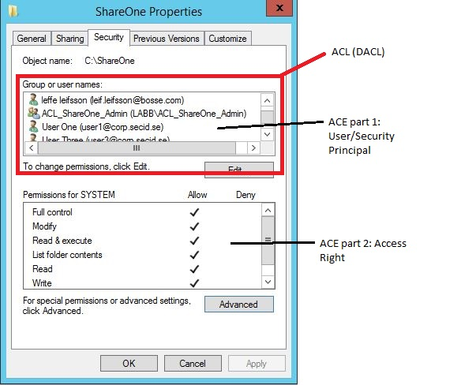
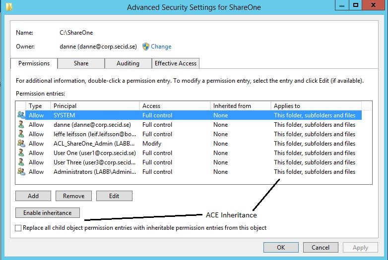
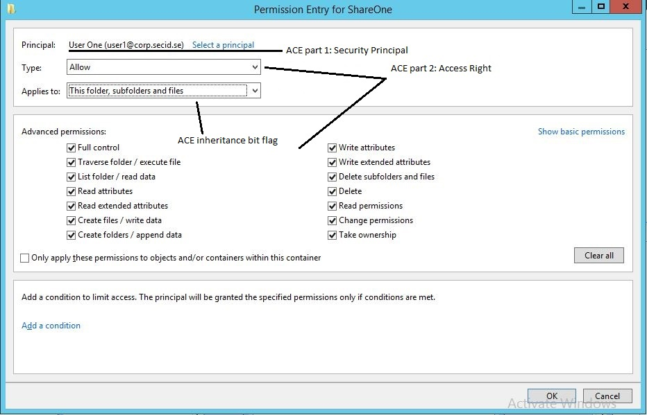
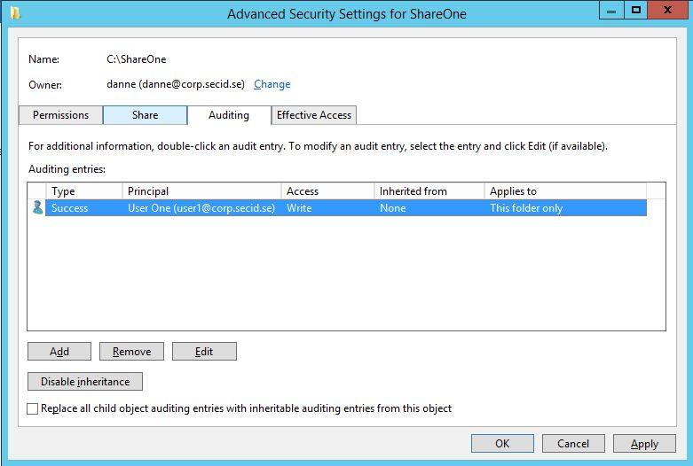

# ACLs - DACLs/SACLs/ACEs

{{#include ../../banners/hacktricks-training.md}}

## **Access Control List (ACL)**

Eine Access Control List (ACL) besteht aus einer geordneten Gruppe von Access Control Entries (ACEs), die den Schutz für ein Objekt und dessen Eigenschaften festlegen. Im Wesentlichen definiert eine ACL, welche Aktionen von welchen Security Principals (Benutzern oder Gruppen) für ein bestimmtes Objekt erlaubt oder verweigert werden.

Es gibt zwei Arten von ACLs:

- **Discretionary Access Control List (DACL):** Gibt an, welche Benutzer und Gruppen Zugriff auf ein Objekt haben oder nicht haben.
- **System Access Control List (SACL):** Regelt die Überwachung von Zugriffsversuchen auf ein Objekt.

Beim Zugriff auf eine Datei überprüft das System den Security Descriptor des Objekts anhand des Access Tokens des Benutzers, um anhand der ACEs zu bestimmen, ob der Zugriff gewährt werden soll und welchen Umfang dieser Zugriff hat.[[1]](#references)

### **Key Components**

- **DACL:** Enthält ACEs, die Benutzern und Gruppen Zugriffsberechtigungen für ein Objekt gewähren oder verweigern. Sie ist im Wesentlichen die zentrale ACL, die die Zugriffsrechte festlegt.
- **SACL:** Wird zur Überwachung des Zugriffs auf Objekte verwendet. Die ACEs definieren die Zugriffsarten, die im Security Event Log protokolliert werden sollen. Dies kann äußerst hilfreich sein, um nicht autorisierte Zugriffsversuche zu erkennen oder Zugriffsprobleme zu beheben.[[1]](#references)

### **System Interaction with ACLs**

Jede Benutzersitzung ist mit einem Access Token verknüpft, das sicherheitsrelevante Informationen für diese Sitzung enthält, darunter Benutzer- und Gruppenidentitäten sowie Privilegien. Dieses Token enthält außerdem eine Logon SID, die die Sitzung eindeutig identifiziert.

Die Local Security Authority (LSASS) verarbeitet Zugriffsanfragen auf Objekte, indem sie die DACL auf ACEs untersucht, die mit dem Security Principal übereinstimmen, der den Zugriff anfordert. Der Zugriff wird sofort gewährt, wenn keine relevanten ACEs gefunden werden. Andernfalls vergleicht LSASS die ACEs mit der SID des Security Principals im Access Token, um festzustellen, ob der Zugriff zulässig ist.[[1]](#references)

### **Summarized Process**

- **ACLs:** Definieren Zugriffsberechtigungen über DACLs und Audit-Regeln über SACLs.
- **Access Token:** Enthält Benutzer-, Gruppen- und Privilegieninformationen für eine Sitzung.
- **Access Decision:** Wird durch den Vergleich der DACL-ACEs mit dem Access Token getroffen; SACLs werden für Auditing verwendet.[[1]](#references)

### ACEs

Es gibt **drei Haupttypen von Access Control Entries (ACEs)**:[[1]](#references)

- **Access Denied ACE**: Diese ACE verweigert bestimmten Benutzern oder Gruppen ausdrücklich den Zugriff auf ein Objekt (in einer DACL).
- **Access Allowed ACE**: Diese ACE gewährt bestimmten Benutzern oder Gruppen ausdrücklich Zugriff auf ein Objekt (in einer DACL).
- **System Audit ACE**: Diese ACE befindet sich in einer System Access Control List (SACL) und erzeugt Audit-Logs, wenn Benutzer oder Gruppen versuchen, auf ein Objekt zuzugreifen. Sie dokumentiert, ob der Zugriff erlaubt oder verweigert wurde und um welche Zugriffsart es sich handelte.

Jede ACE besitzt **vier wichtige Komponenten**:[[1]](#references)

1. Den **Security Identifier (SID)** des Benutzers oder der Gruppe (oder deren Principal-Namen in einer grafischen Darstellung).
2. Ein **flag**, das den ACE-Typ identifiziert (access denied, allowed oder system audit).
3. **Inheritance flags**, die bestimmen, ob untergeordnete Objekte die ACE von ihrem übergeordneten Objekt erben können.
4. Eine [**access mask**](https://docs.microsoft.com/en-us/openspecs/windows_protocols/ms-dtyp/7a53f60e-e730-4dfe-bbe9-b21b62eb790b?redirectedfrom=MSDN), ein 32-Bit-Wert, der die gewährten Rechte des Objekts angibt.

Die Zugriffsbestimmung erfolgt durch die sequenzielle Prüfung jeder ACE, bis:[[1]](#references)

- Eine **Access-Denied-ACE** dem im Access Token identifizierten Trustee die angeforderten Rechte ausdrücklich verweigert.
- **Access-Allowed-ACE(s)** einem Trustee im Access Token ausdrücklich alle angeforderten Rechte gewähren.
- Nach der Prüfung aller ACEs ein angefordertes Recht nicht ausdrücklich erlaubt wurde; der Zugriff wird dann implizit **verweigert**.

### Order of ACEs

Die Reihenfolge, in der **ACEs** (Regeln, die festlegen, wer auf etwas zugreifen darf oder nicht) in einer Liste namens **DACL** angeordnet werden, ist sehr wichtig. Sobald das System den Zugriff anhand dieser Regeln gewährt oder verweigert, prüft es die übrigen Regeln nicht mehr.[[1]](#references)

Es gibt eine optimale Methode zur Organisation dieser ACEs, die als **„canonical order“** bezeichnet wird. Diese Methode stellt sicher, dass alles reibungslos und korrekt funktioniert. Für Systeme wie **Windows 2000** und **Windows Server 2003** gilt folgende Reihenfolge:

- Zuerst werden alle Regeln, die **speziell für dieses Objekt** erstellt wurden, vor den Regeln angeordnet, die von einem anderen Ort stammen, beispielsweise von einem übergeordneten Ordner.
- Innerhalb dieser spezifischen Regeln werden Regeln, die **„nein“ (deny)** sagen, vor Regeln angeordnet, die **„ja“ (allow)** sagen.
- Bei Regeln, die von einem anderen Ort stammen, werden zuerst die Regeln aus der **nächstgelegenen Quelle** angeordnet, beispielsweise vom übergeordneten Objekt, und anschließend die weiter entfernten. Auch hier werden **„nein“**-Regeln vor **„ja“**-Regeln angeordnet.

Diese Anordnung bietet zwei wichtige Vorteile:

- Sie stellt sicher, dass ein spezifisches **„nein“** unabhängig von anderen vorhandenen **„ja“**-Regeln berücksichtigt wird.
- Sie ermöglicht es dem Besitzer eines Objekts, abschließend festzulegen, wer Zugriff erhält, bevor Regeln aus übergeordneten Ordnern oder weiter entfernten Quellen greifen.

Auf diese Weise kann der Besitzer einer Datei oder eines Ordners sehr genau festlegen, wer Zugriff erhält, sodass die richtigen Personen zugreifen können und die falschen nicht.

Bei dieser **„canonical order“** geht es also darum, sicherzustellen, dass die Zugriffsregeln klar sind und korrekt funktionieren, indem spezifische Regeln zuerst stehen und alles sinnvoll angeordnet wird.

### GUI Example

[**Example from here**](https://secureidentity.se/acl-dacl-sacl-and-the-ace/)[[2]](#references)

Dies ist die klassische Registerkarte „Security“ eines Ordners, die die ACL, DACL und ACEs anzeigt:

Wenn wir auf die **Advanced-Schaltfläche** klicken, erhalten wir weitere Optionen wie die Vererbung:

Und wenn wir einen Security Principal hinzufügen oder bearbeiten:

Zuletzt sehen wir die SACL in der Registerkarte „Auditing“:

### Explaining Access Control in a Simplified Manner

Bei der Verwaltung des Zugriffs auf Ressourcen, beispielsweise einen Ordner, verwenden wir Listen und Regeln, die als Access Control Lists (ACLs) und Access Control Entries (ACEs) bezeichnet werden. Sie legen fest, wer auf bestimmte Daten zugreifen darf oder nicht.[[1]](#references)

#### Denying Access to a Specific Group

Angenommen, es gibt einen Ordner namens Cost, auf den alle zugreifen sollen, außer einem Marketingteam. Durch die korrekte Einrichtung der Regeln können wir sicherstellen, dass dem Marketingteam der Zugriff ausdrücklich verweigert wird, bevor allen anderen der Zugriff gewährt wird. Dazu wird die Regel, die den Zugriff für das Marketingteam verweigert, vor der Regel angeordnet, die allen den Zugriff erlaubt.

#### Allowing Access to a Specific Member of a Denied Group

Nehmen wir an, Bob, der Marketingdirektor, benötigt Zugriff auf den Ordner Cost, obwohl das Marketingteam im Allgemeinen keinen Zugriff haben soll. Wir können eine spezifische Regel (ACE) für Bob hinzufügen, die ihm Zugriff gewährt, und sie vor der Regel anordnen, die den Zugriff für das Marketingteam verweigert. Auf diese Weise erhält Bob trotz der allgemeinen Einschränkung für sein Team Zugriff.

#### Understanding Access Control Entries

ACEs sind die einzelnen Regeln innerhalb einer ACL. Sie identifizieren Benutzer oder Gruppen, legen fest, welcher Zugriff erlaubt oder verweigert wird, und bestimmen, wie diese Regeln auf untergeordnete Elemente angewendet werden (Vererbung). Es gibt zwei Haupttypen von ACEs:

- **Generic ACEs**: Diese gelten allgemein und wirken sich entweder auf alle Objekttypen aus oder unterscheiden lediglich zwischen Containern (beispielsweise Ordnern) und Nicht-Containern (beispielsweise Dateien). Eine Regel kann beispielsweise Benutzern erlauben, den Inhalt eines Ordners zu sehen, ohne ihnen den Zugriff auf die darin enthaltenen Dateien zu ermöglichen.
- **Object-Specific ACEs**: Diese bieten eine präzisere Kontrolle und ermöglichen Regeln für bestimmte Objekttypen oder sogar einzelne Eigenschaften innerhalb eines Objekts. In einem Benutzerverzeichnis könnte eine Regel beispielsweise einem Benutzer erlauben, seine Telefonnummer zu aktualisieren, nicht jedoch seine Anmeldezeiten.

Jede ACE enthält wichtige Informationen darüber, für wen die Regel gilt (mithilfe eines Security Identifiers oder einer SID), was die Regel erlaubt oder verweigert (mithilfe einer access mask) und wie sie von anderen Objekten geerbt wird.

#### Key Differences Between ACE Types

- **Generic ACEs** eignen sich für einfache Zugriffskontrollszenarien, in denen dieselbe Regel für alle Aspekte eines Objekts oder für alle Objekte innerhalb eines Containers gilt.
- **Object-Specific ACEs** werden für komplexere Szenarien verwendet, insbesondere in Umgebungen wie Active Directory, in denen der Zugriff auf bestimmte Eigenschaften eines Objekts unterschiedlich gesteuert werden muss.

Zusammenfassend helfen ACLs und ACEs dabei, präzise Zugriffskontrollen zu definieren. Dadurch wird sichergestellt, dass nur die richtigen Personen oder Gruppen Zugriff auf vertrauliche Informationen oder Ressourcen erhalten. Zugriffsrechte können dabei bis auf die Ebene einzelner Eigenschaften oder Objekttypen angepasst werden.

### Access Control Entry Layout

| ACE Field   | Description                                                                                                                                                                                                                                                                                                                                                                                                                                                                                                     |
| ----------- | --------------------------------------------------------------------------------------------------------------------------------------------------------------------------------------------------------------------------------------------------------------------------------------------------------------------------------------------------------------------------------------------------------------------------------------------------------------------------------------------------------------- |
| Type        | Flag, das den ACE-Typ angibt. Windows 2000 und Windows Server 2003 unterstützen sechs ACE-Typen: drei generische ACE-Typen, die an alle sicherbaren Objekte angehängt werden. Drei objektspezifische ACE-Typen, die bei Active-Directory-Objekten vorkommen können.                                                                                                                                                                                                                                                            |
| Flags       | Gruppe von Bit-Flags, die Vererbung und Auditing steuern.                                                                                                                                                                                                                                                                                                                                                                                                                                                         |
| Size        | Anzahl der Bytes im Speicher, die für die ACE reserviert sind.                                                                                                                                                                                                                                                                                                                                                                                                                                                       |
| Access mask | 32-Bit-Wert, dessen Bits den Zugriffsrechten für das Objekt entsprechen. Bits können ein- oder ausgeschaltet sein; die Bedeutung der Einstellung hängt jedoch vom ACE-Typ ab. Wenn beispielsweise das Bit für das Recht zum Lesen von Berechtigungen aktiviert ist und der ACE-Typ Deny lautet, verweigert die ACE das Recht, die Berechtigungen des Objekts zu lesen. Wenn dasselbe Bit aktiviert ist und der ACE-Typ Allow lautet, gewährt die ACE das Recht, die Berechtigungen des Objekts zu lesen. Weitere Einzelheiten zur Access mask finden sich in der nächsten Tabelle. |
| SID         | Identifiziert einen Benutzer oder eine Gruppe, deren Zugriff durch diese ACE kontrolliert oder überwacht wird.                                                                                                                                                                                                                                                                                                                                                                                                                                 |

### Access Mask Layout

| Bit (Range) | Meaning                            | Description/Example                       |
| ----------- | ---------------------------------- | ----------------------------------------- |
| 0 - 15      | Object Specific Access Rights      | Daten lesen, ausführen, Daten anhängen    |
| 16 - 22     | Standard Access Rights             | Löschen, ACL schreiben, Besitzer schreiben |
| 23          | Can access security ACL            |                                           |
| 24 - 27     | Reserved                           | Reserviert                                 |
| 28          | Generic ALL (Read, Write, Execute) | Alles Folgende                             |
| 29          | Generic Execute                    | Alles, was zum Ausführen eines Programms erforderlich ist |
| 30          | Generic Write                      | Alles, was zum Schreiben in eine Datei erforderlich ist |
| 31          | Generic Read                       | Alles, was zum Lesen einer Datei erforderlich ist |

## References

- [1] [How the System Uses ACLs - NTFS.com](https://www.ntfs.com/ntfs-permissions-acl-use.htm)
- [2] [ACL, DACL, SACL and the ACE - secureidentity.se](https://secureidentity.se/acl-dacl-sacl-and-the-ace/)

{{#include ../../banners/hacktricks-training.md}}
