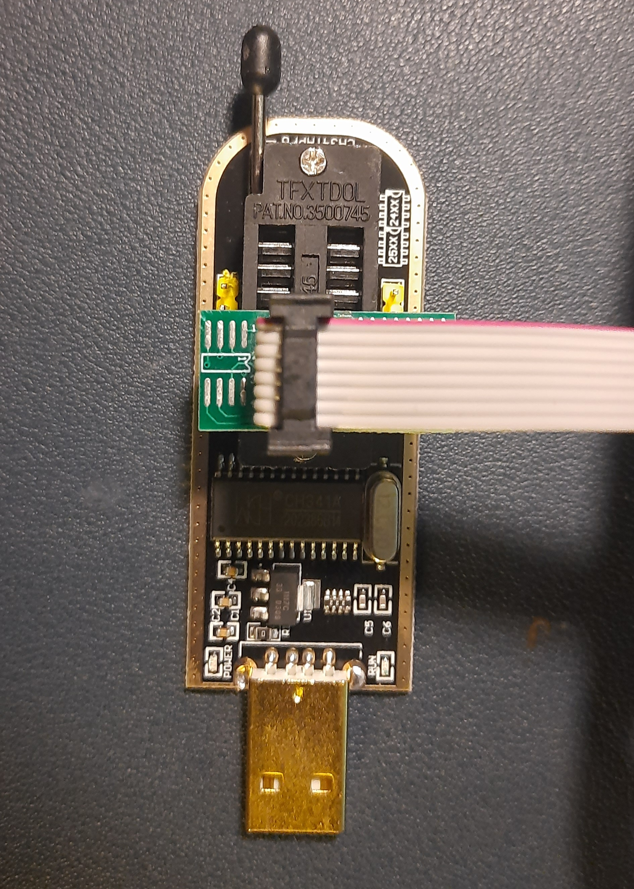
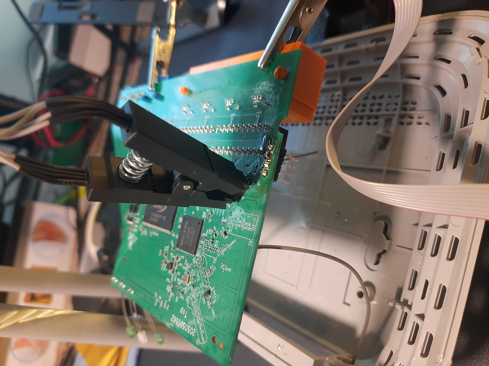
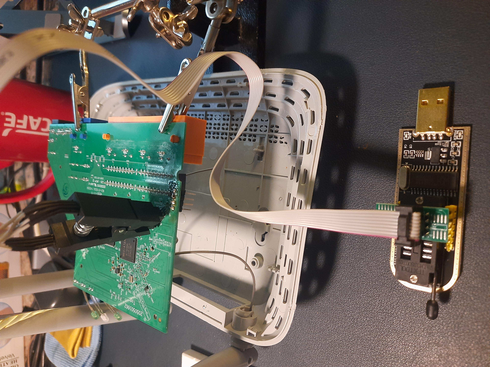

# SPI

<details>

<summary><strong>ゼロからヒーローまでAWSハッキングを学ぶ</strong> <a href="https://training.hacktricks.xyz/courses/arte"><strong>htARTE（HackTricks AWS Red Team Expert）</strong></a><strong>！</strong></summary>

HackTricksをサポートする他の方法：

- **HackTricksで企業を宣伝したい**または**HackTricksをPDFでダウンロードしたい**場合は、[**SUBSCRIPTION PLANS**](https://github.com/sponsors/carlospolop)をチェックしてください！
- [**公式PEASS＆HackTricksスワッグ**](https://peass.creator-spring.com)を手に入れる
- [**The PEASS Family**](https://opensea.io/collection/the-peass-family)を発見し、独占的な[**NFTs**](https://opensea.io/collection/the-peass-family)のコレクションを見つける
- **💬 [Discordグループ](https://discord.gg/hRep4RUj7f)**に参加するか、[telegramグループ](https://t.me/peass)に参加するか、**Twitter** 🐦 [**@carlospolopm**](https://twitter.com/hacktricks\_live)**をフォロー**する
- **ハッキングトリックを共有するには、**[**HackTricks**](https://github.com/carlospolop/hacktricks)と[**HackTricks Cloud**](https://github.com/carlospolop/hacktricks-cloud)のGitHubリポジトリにPRを送信してください。

</details>

## 基本情報

SPI（Serial Peripheral Interface）は、IC（組み込みシステムで使用される同期シリアル通信プロトコル）間の短距離通信のために使用される同期シリアル通信プロトコルです。SPI通信プロトコルは、クロックとチップ選択信号によってオーケストレートされるマスター-スレーブアーキテクチャを利用します。マスター-スレーブアーキテクチャには、マスター（通常はマイクロプロセッサ）がEEPROM、センサー、制御デバイスなどの外部ペリフェラルを管理するスレーブが含まれます。

複数のスレーブをマスターに接続できますが、スレーブ同士は通信できません。スレーブは、クロックとチップ選択の2つのピンによって管理されます。SPIは同期通信プロトコルであるため、入力および出力ピンはクロック信号に従います。チップ選択は、マスターがスレーブを選択してそれとやり取りするために使用されます。チップ選択が高い場合、スレーブデバイスは選択されておらず、低い場合はチップが選択され、マスターがスレーブとやり取りします。

MOSI（Master Out, Slave In）およびMISO（Master In, Slave Out）はデータの送信と受信に責任があります。データは、MOSIピンを介してスレーブデバイスに送信され、チップ選択が低い状態で保持されます。入力データには、スレーブデバイスのベンダーのデータシートに従った命令、メモリアドレス、またはデータが含まれます。有効な入力後、MISOピンはデータをマスターに送信する責任があります。出力データは、入力が終了した直後の次のクロックサイクルで送信されます。MISOピンは、データが完全に送信されるか、マスターがチップ選択ピンを高い状態に設定するまでデータを送信します（その場合、スレーブは送信を停止し、そのクロックサイクル以降、マスターはリッスンしません）。

## EEPROMからファームウェアをダンプする

ファームウェアをダンプすることは、ファームウェアを分析し、その中の脆弱性を見つけるのに役立ちます。ファームウェアがインターネット上で利用できないか、モデル番号、バージョンなどの要因の変化により関連性がない場合がよくあります。したがって、物理デバイスからファームウェアを直接抽出することは、脅威を探す際に特定されるのに役立ちます。

シリアルコンソールを取得することは役立ちますが、ファイルが読み取り専用であることがよくあります。これは、さまざまな理由により分析が制約される原因となります。たとえば、パッケージの送受信に必要なツールがファームウェアに含まれていない場合があります。そのため、バイナリを抽出してリバースエンジニアリングすることは実珵ではありません。したがって、ファームウェア全体をシステムにダンプし、分析のためにバイナリを抽出することは非常に役立ちます。

また、レッドチーム活動やデバイスへの物理アクセスを取得する際に、ファームウェアをダンプすることでファイルを変更したり、悪意のあるファイルを注入してから再度フラッシュすることができ、デバイスにバックドアを埋め込むのに役立ちます。したがって、ファームウェアのダンプによって解除される可能性がある数多くの可能性があります。

### CH341A EEPROMプログラマーおよびリーダー

このデバイスは、EEPROMからファームウェアをダンプし、ファームウェアファイルで再フラッシュするための安価なツールです。これは、コンピュータのBIOSチップ（単なるEEPROM）で作業するための人気のある選択肢でした。このデバイスはUSB経由で接続され、開始するのに最小限のツールが必要です。また、通常、タスクを迅速に完了するため、物理デバイスアクセスでも役立つことがあります。


EEPROMメモリをCH341aプログラマーに接続し、デバイスをコンピュータに接続します。デバイスが検出されない場合は、コンピュータにドライバをインストールしてみてください。また、EEPROMが適切な向きで接続されていることを確認してください（通常、VCCピンをUSBコネクタの逆向きに配置します）。そうでない場合、ソフトウェアはチップを検出できません。必要に応じて図を参照してください：





最後に、ファームウェアをダンプするためにflashrom、G-Flash（GUI）などのソフトウェアを使用します。G-Flashは、最小限のGUIツールで、高速に動作し、EEPROMを自動的に検出します。これは、ドキュメントをあまりいじらずに迅速にファームウェアを抽出する必要がある場合に役立ちます。



ファームウェアをダンプした後、バイナリファイルで分析を行うことができます。文字列、hexdump、xxd、binwalkなどのツールを使用して、ファームウェアに関する多くの情報やファイルシステム全体についても抽出することができます。

ファームウェアからコンテンツを抽出するには、binwalkを使用できます。Binwalkは16進数のシグネチャを分析し、バイナリファイル内のファイルを識別し、抽出することができます。
```
binwalk -e <filename>
```
<filename>は、使用されるツールや構成に応じて.binまたは.romのいずれかです。

ファームウェアの抽出は繊細なプロセスであり、多くの忍耐が必要です。誤った取り扱いはファームウェアを破損させる可能性があり、デバイスを完全に消去して使用不能にすることさえあります。ファームウェアを抽出しようとする前に、特定のデバイスを研究することをお勧めします。

### Bus Pirate + flashrom

.png>)

Pirate BusのPINOUTが**MOSI**と**MISO**のピンをSPIに接続するよう指示している場合でも、一部のSPIはピンをDIとDOとして示す場合があります。**MOSI -> DI, MISO -> DO**

.png>)

WindowsまたはLinuxでは、[**`flashrom`**](https://www.flashrom.org/Flashrom)プログラムを使用して、次のようなコマンドを実行してフラッシュメモリの内容をダンプできます。
```bash
# In this command we are indicating:
# -VV Verbose
# -c <chip> The chip (if you know it better, if not, don'tindicate it and the program might be able to find it)
# -p <programmer> In this case how to contact th chip via the Bus Pirate
# -r <file> Image to save in the filesystem
flashrom -VV -c "W25Q64.V" -p buspirate_spi:dev=COM3 -r flash_content.img
```
<details>

<summary><strong>AWSハッキングをゼロからヒーローまで学ぶ</strong> <a href="https://training.hacktricks.xyz/courses/arte"><strong>htARTE（HackTricks AWS Red Team Expert）</strong></a><strong>！</strong></summary>

HackTricksをサポートする他の方法:

* **HackTricksで企業を宣伝したい**または**HackTricksをPDFでダウンロードしたい**場合は、[**SUBSCRIPTION PLANS**](https://github.com/sponsors/carlospolop)をチェックしてください！
* [**公式PEASS＆HackTricksのグッズ**](https://peass.creator-spring.com)を入手する
* [**The PEASS Family**](https://opensea.io/collection/the-peass-family)を発見し、独占的な[**NFTs**](https://opensea.io/collection/the-peass-family)のコレクションを見つける
* **💬 [**Discordグループ**](https://discord.gg/hRep4RUj7f)に参加するか、[**telegramグループ**](https://t.me/peass)に参加するか、**Twitter** 🐦 [**@carlospolopm**](https://twitter.com/hacktricks\_live)をフォローする**
* **ハッキングトリックを共有するために、[**HackTricks**](https://github.com/carlospolop/hacktricks)と[**HackTricks Cloud**](https://github.com/carlospolop/hacktricks-cloud)のGitHubリポジトリにPRを提出する**

</details>
