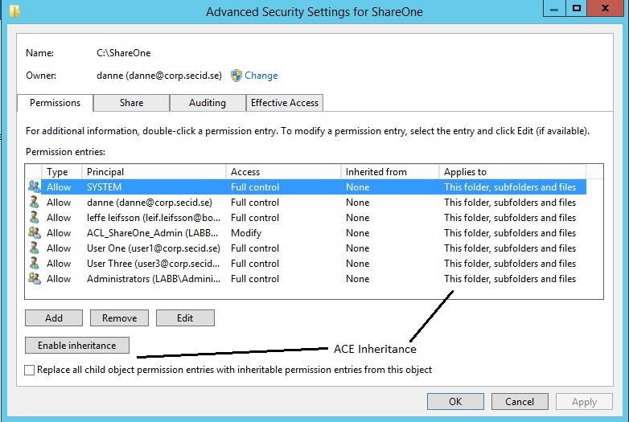
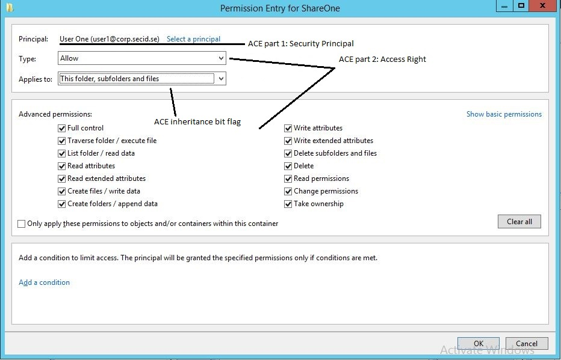
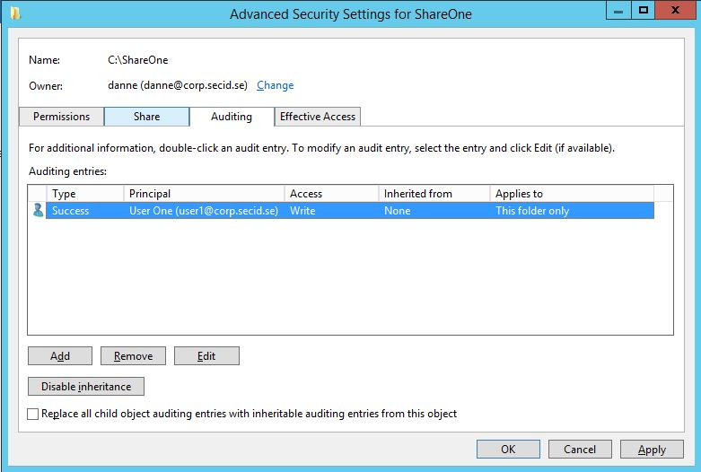

# ACLs - DACLs/SACLs/ACEs

<figure><figcaption></figcaption></figure>

\
Use [**Trickest**](https://trickest.com/?utm\_campaign=hacktrics\&utm\_medium=banner\&utm\_source=hacktricks) to easily build and **automate workflows** powered by the world's **most advanced** community tools.\
Get Access Today:



<a href="https://cloud.hacktricks.xyz/pentesting-cloud/pentesting-cloud-methodology"><strong>☁️ HackTricks Cloud ☁️</strong></a> -<a href="https://twitter.com/hacktricks_live"><strong>🐦 Twitter 🐦</strong></a> - <a href="https://www.twitch.tv/hacktricks_live/schedule"><strong>🎙️ Twitch 🎙️</strong></a> - <a href="https://www.youtube.com/@hacktricks_LIVE"><strong>🎥 Youtube 🎥</strong></a>

* Do you work in a **cybersecurity company**? Do you want to see your **company advertised in HackTricks**? or do you want to have access to the **latest version of the PEASS or download HackTricks in PDF**? Check the [**SUBSCRIPTION PLANS**](https://github.com/sponsors/carlospolop)!
* Discover [**The PEASS Family**](https://opensea.io/collection/the-peass-family), our collection of exclusive [**NFTs**](https://opensea.io/collection/the-peass-family)
* Get the [**official PEASS & HackTricks swag**](https://peass.creator-spring.com)
* **Join the** [**💬**](https://emojipedia.org/speech-balloon/) [**Discord group**](https://discord.gg/hRep4RUj7f) or the [**telegram group**](https://t.me/peass) or **follow** me on **Twitter** [**🐦**](https://github.com/carlospolop/hacktricks/tree/7af18b62b3bdc423e11444677a6a73d4043511e9/\[https:/emojipedia.org/bird/README.md)[**@carlospolopm**](https://twitter.com/hacktricks_live)**.**
* **Share your hacking tricks by submitting PRs to the [hacktricks repo](https://github.com/carlospolop/hacktricks) and [hacktricks-cloud repo](https://github.com/carlospolop/hacktricks-cloud)**.

## **Access Control List (ACL)**

An **ACL is an ordered list of ACEs** that define the protections that apply to an object and its properties. Each **ACE** identifies a security **principal** and specifies a **set of access** rights that are allowed, denied, or audited for that security principal.

An object’s security descriptor can contain **two ACLs**:

1. A **DACL** that **identifies** the **users** and **groups** that are **allowed** or **denied** access
2. A **SACL** that controls **how** access is **audited**

When a user tries to access a file, the Windows system runs an AccessCheck and compares the security descriptor with the users access token and evaluates if the user is granted access and what kind of access depending on the ACEs set.

### **Discretionary Access Control List (DACL)**

A DACL (often mentioned as the ACL) identify the users and groups that are assigned or denied access permissions on an object. It contains a list of paired ACEs (Account + Access Right) to the securable object.

### **System Access Control List (SACL)**

SACLs makes it possible to monitor access to secured objects. ACEs in a SACL determine **what types of access is logged in the Security Event Log**. With monitoring tools this could raise an alarm to the right people if malicious users tries to access the secured object, and in an incident scenario we can use the logs to trace the steps back in time. And last, you can enable logging for troubleshoot access issues.

## How the System Uses ACLs

Each **user logged** onto the system **holds an access token with security information** for that logon session. The system creates an access token when the user logs on. **Every process executed** on behalf of the user **has a copy of the access token**. The token identifies the user, the user's groups, and the user's privileges. A token also contains a logon SID (Security Identifier) that identifies the current logon session.

When a thread tries to access a securable object, the LSASS (Local Security Authority) either grants or denies access. To do this, the **LSASS searches the DACL** (Discretionary Access Control List) in the SDS data stream, looking for ACEs that apply to the thread.

**Each ACE in the object's DACL** specifies the access rights that are allowed or denied for a security principal or logon session. If the object's owner has not created any ACEs in the DACL for that object, the system grants access right away.

If the LSASS finds ACEs, it compares the trustee SID in each ACE to the trustee SIDs that are identified in the thread's access token.

### ACEs

There are **`three` main types of ACEs** that can be applied to all securable objects in AD:

| **ACE**                  | **Description**                                                                                                                                                            |
| ------------------------ | -------------------------------------------------------------------------------------------------------------------------------------------------------------------------- |
| **`Access denied ACE`**  | Used within a DACL to show that a user or group is explicitly denied access to an object                                                                                   |
| **`Access allowed ACE`** | Used within a DACL to show that a user or group is explicitly granted access to an object                                                                                  |
| **`System audit ACE`**   | Used within a SACL to generate audit logs when a user or group attempts to access an object. It records whether access was granted or not and what type of access occurred |

Each ACE is made up of the following `four` components:

1. The security identifier (SID) of the user/group that has access to the object (or principal name graphically)
2. A flag denoting the type of ACE (access denied, allowed, or system audit ACE)
3. A set of flags that specify whether or not child containers/objects can inherit the given ACE entry from the primary or parent object
4. An [access mask](https://docs.microsoft.com/en-us/openspecs/windows\_protocols/ms-dtyp/7a53f60e-e730-4dfe-bbe9-b21b62eb790b?redirectedfrom=MSDN) which is a 32-bit value that defines the rights granted to an object

The system examines each ACE in sequence until one of the following events occurs:

* **An access-denied ACE explicitly denies** any of the requested access rights to one of the trustees listed in the thread's access token.
* **One or more access-allowed ACEs** for trustees listed in the thread's access token explicitly grant all the requested access rights.
* All ACEs have been checked and there is still at least **one requested access** right that has **not been explicitly allowed**, in which case, access is implicitly **denied**.

### Order of ACEs

Because the **system stops checking ACEs when the requested access is explicitly granted or denied**, the order of ACEs in a DACL is important.

The preferred order of ACEs in a DACL is called the "canonical" order. For Windows 2000 and Windows Server 2003, the canonical order is the following:

1. All **explicit** ACEs are placed in a group **before** any **inherited** ACEs.
2. Within the group of **explicit** ACEs, **access-denied** ACEs are placed **before access-allowed** ACEs.
3. Within the **inherited** group, ACEs that are inherited from the **child object's parent come first**, and **then** ACEs inherited from the **grandparent**, **and so** on up the tree of objects. After that, **access-denied** ACEs are placed **before access-allowed** ACEs.

The following figure shows the canonical order of ACEs:

### Canonical order of ACEs

The canonical order ensures that the following takes place:

* An explicit **access-denied ACE is enforced regardless of any explicit access-allowed ACE**. This means that the object's owner can define permissions that allow access to a group of users and deny access to a subset of that group.
* All **explicit ACEs are processed before any inherited ACE**. This is consistent with the concept of discretionary access control: access to a child object (for example a file) is at the discretion of the child's owner, not the owner of the parent object (for example a folder). The owner of a child object can define permissions directly on the child. The result is that the effects of inherited permissions are modified.

<figure><figcaption></figcaption></figure>

\
Use [**Trickest**](https://trickest.com/?utm\_campaign=hacktrics\&utm\_medium=banner\&utm\_source=hacktricks) to easily build and **automate workflows** powered by the world's **most advanced** community tools.\
Get Access Today:



### GUI Example

This is the classic security tab of a folder showing the ACL, DACL and ACEs:

If we click the **Advanced button** we will get more options like inheritance:

And if you add or edit a Security Principal:

And last we have the SACL in the Auditing tab:

### Example: Explicit access-denied to a group

In this example, the access-allowed group is Everyone and the access-denied group is Marketing, a subset of Everyone.

You want to deny the Marketing group access to a Cost folder. If the Cost folder's ACEs are in canonical order, the ACE that denies Marketing comes before the ACE that allows Everyone.

During an access check, the operating system steps through the ACEs in the order in which they appear in the object's DACL, so that the deny ACE is processed before the allow ACE. As a result, users who are members of the Marketing group are denied access. Everyone else is allowed access to the object.

### Example: Explicit before inherited

In this example, the Cost folder has an inheritable ACE that denies access to Marketing (the parent object). In other words, all users who are members (or children) of the Marketing group are denied access by inheritance.

You want to allow access to Bob, who is the Marketing director. As a member of the Marketing group, Bob is denied access to the Cost folder by inheritance. The owner of the child object (user Bob) defines an explicit ACE that allows access to the Cost folder. If the child object's ACEs are in canonical order, the explicit ACE that allows Bob access comes before any inherited ACE, including the inherited ACE that denies access to the Marketing group.

During an access check, the operating system reaches the ACE that allows Bob access before it gets to the ACE that denies access to the Marketing group. As a result, Bob is allowed access to the object even though he is a member of the Marketing group. Other members of the Marketing group are denied access.

### Access Control Entries

As stated previously, an ACL (Access Control List) is an ordered list of ACEs (Access Control Entries). Each ACE contains the following:

* A SID (Security Identifier) that identifies a particular user or group.
* An access mask that specifies access rights.
* A set of bit flags that determine whether or not child objects can inherit the ACE.
* A flag that indicates the type of ACE.

ACEs are fundamentally alike. What sets them apart is the degree of control they offer over inheritance and object access. There are two types of ACE:

* Generic type that are attached to all securable objects.
* Object-specific type that can occur only in ACLs for Active Directory objects.

### Generic ACE

A generic ACE offers limited control over the kinds of child objects that can inherit them. Essentially, they can distinguish only between containers and noncontainers.

For example, the DACL (Discretionary Access Control List) on a Folder object in NTFS can include a generic ACE that allows a group of users to list the folder's contents. Because listing a folder's contents is an operation that can be performed only on a Container object, the ACE that allows the operation can be flagged as a CONTAINER\_INHERIT\_ACE. Only Container objects in the folder (that is, only other Folder objects) inherit the ACE. Noncontainer objects (that is, File objects) do not inherit the ACE of the parent object.

A generic ACE applies to an entire object. If a generic ACE gives a particular user Read access, the user can read all the information that is associated with the object — both data and properties. This is not a serious limitation for most object types. File objects, for example, have few properties, which are all used for describing characteristics of the object rather than for storing information. Most of the information in a File object is stored as object data; therefore, there is little need for separate controls on a file's properties.

### Object-specific ACE

An object-specific ACE offers a greater degree of control over the types of child objects that can inherit them.

For example, an OU (Organizational Unit) object's ACL can have an object-specific ACE that is marked for inheritance only by User objects. Other types of objects, such as Computer objects, will not inherit the ACE.

This capability is why object-specific ACEs are called object-specific. Their inheritance can be limited to specific types of child objects.

There are similar differences in how the two categories of ACE types control access to objects.

An object-specific ACE can apply to any individual property of an object or to a set of properties for that object. This type of ACE is used only in an ACL for Active Directory objects, which, unlike other object types, store most of their information in properties. It is often desirable to place independent controls on each property of an Active Directory object, and object-specific ACEs make that possible.

For example, when you define permissions for a User object, you can use one object-specific ACE to allow Principal Self (that is, the user) Write access to the Phone-Home-Primary (homePhone) property, and you can use other object-specific ACEs to deny Principal Self access to the Logon-Hours (logonHours) property and other properties that set restrictions on the user account.

The table below shows the layout of each ACE.

### Access Control Entry Layout

| ACE Field   | Description                                                                                                                                                                                                                                                                                                                                                                                                                                                                                                     |
| ----------- | --------------------------------------------------------------------------------------------------------------------------------------------------------------------------------------------------------------------------------------------------------------------------------------------------------------------------------------------------------------------------------------------------------------------------------------------------------------------------------------------------------------- |
| Type        | Flag that indicates the type of ACE. Windows 2000 and Windows Server 2003 support six types of ACE: Three generic ACE types that are attached to all securable objects. Three object-specific ACE types that can occur for Active Directory objects.                                                                                                                                                                                                                                                            |
| Flags       | Set of bit flags that control inheritance and auditing.                                                                                                                                                                                                                                                                                                                                                                                                                                                         |
| Size        | Number of bytes of memory that are allocated for the ACE.                                                                                                                                                                                                                                                                                                                                                                                                                                                       |
| Access mask | 32-bit value whose bits correspond to access rights for the object. Bits can be set either on or off, but the setting's meaning depends on the ACE type. For example, if the bit that corresponds to the right to read permissions is turned on, and the ACE type is Deny, the ACE denies the right to read the object's permissions. If the same bit is set on but the ACE type is Allow, the ACE grants the right to read the object's permissions. More details of the Access mask appear in the next table. |
| SID         | Identifies a user or group whose access is controlled or monitored by this ACE.                                                                                                                                                                                                                                                                                                                                                                                                                                 |

### Access Mask Layout

| Bit (Range) | Meaning                            | Description/Example                       |
| ----------- | ---------------------------------- | ----------------------------------------- |
| 0 - 15      | Object Specific Access Rights      | Read data, Execute, Append data           |
| 16 - 22     | Standard Access Rights             | Delete, Write ACL, Write Owner            |
| 23          | Can access security ACL            |                                           |
| 24 - 27     | Reserved                           |                                           |
| 28          | Generic ALL (Read, Write, Execute) | Everything below                          |
| 29          | Generic Execute                    | All things necessary to execute a program |
| 30          | Generic Write                      | All things necessary to write to a file   |
| 31          | Generic Read                       | All things necessary to read a file       |

## References

* [https://www.ntfs.com/ntfs-permissions-acl-use.htm](https://www.ntfs.com/ntfs-permissions-acl-use.htm)
* [https://secureidentity.se/acl-dacl-sacl-and-the-ace/](https://secureidentity.se/acl-dacl-sacl-and-the-ace/)

<a href="https://cloud.hacktricks.xyz/pentesting-cloud/pentesting-cloud-methodology"><strong>☁️ HackTricks Cloud ☁️</strong></a> -<a href="https://twitter.com/hacktricks_live"><strong>🐦 Twitter 🐦</strong></a> - <a href="https://www.twitch.tv/hacktricks_live/schedule"><strong>🎙️ Twitch 🎙️</strong></a> - <a href="https://www.youtube.com/@hacktricks_LIVE"><strong>🎥 Youtube 🎥</strong></a>

* Do you work in a **cybersecurity company**? Do you want to see your **company advertised in HackTricks**? or do you want to have access to the **latest version of the PEASS or download HackTricks in PDF**? Check the [**SUBSCRIPTION PLANS**](https://github.com/sponsors/carlospolop)!
* Discover [**The PEASS Family**](https://opensea.io/collection/the-peass-family), our collection of exclusive [**NFTs**](https://opensea.io/collection/the-peass-family)
* Get the [**official PEASS & HackTricks swag**](https://peass.creator-spring.com)
* **Join the** [**💬**](https://emojipedia.org/speech-balloon/) [**Discord group**](https://discord.gg/hRep4RUj7f) or the [**telegram group**](https://t.me/peass) or **follow** me on **Twitter** [**🐦**](https://github.com/carlospolop/hacktricks/tree/7af18b62b3bdc423e11444677a6a73d4043511e9/\[https:/emojipedia.org/bird/README.md)[**@carlospolopm**](https://twitter.com/hacktricks_live)**.**
* **Share your hacking tricks by submitting PRs to the [hacktricks repo](https://github.com/carlospolop/hacktricks) and [hacktricks-cloud repo](https://github.com/carlospolop/hacktricks-cloud)**.

<figure><figcaption></figcaption></figure>

\
Use [**Trickest**](https://trickest.com/?utm\_campaign=hacktrics\&utm\_medium=banner\&utm\_source=hacktricks) to easily build and **automate workflows** powered by the world's **most advanced** community tools.\
Get Access Today:


