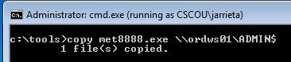
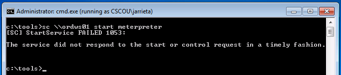
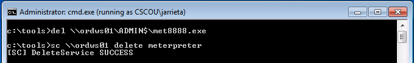

# PsExec/Winexec/ScExec

## How do they work

1. Copy a service binary to the ADMIN$ share over SMB
2. Create a service on the remote machine pointing to the binary
3. Remotely start the service
4. When exited, stop the service and delete the binary

## **Manually PsExec'ing**

First let's assume we have a payload executable we generated with msfvenom and obfuscated with Veil \(so AV doesn't flag it\). In this case, I created a meterpreter reverse\_http payload and called it 'met8888.exe'

**Copy the binary**. From our "jarrieta" command prompt, simply copy the binary to the ADMIN$. Really though, it could be copied and hidden anywhere on the filesystem.

**Create a service**. The Windows `sc` command is used to query, create, delete, etc Windows services and can be used remotely. Read more about it [here](https://technet.microsoft.com/en-us/library/bb490995.aspx). From our command prompt, we'll remotely create a service called "meterpreter" that points to our uploaded binary:

**Start the service**. The last step is to start the service and execute the binary. _Note:_ when the service starts it will "time-out" and generate an error. That's because our meterpreter binary isn't an actual service binary and won't return the expected response code. That's fine because we just need it to execute once to fire:

If we look at our Metasploit listener, we'll see the session has been opened.

**Clean the service.**

Extracted from here: [https://blog.ropnop.com/using-credentials-to-own-windows-boxes-part-2-psexec-and-services/](https://blog.ropnop.com/using-credentials-to-own-windows-boxes-part-2-psexec-and-services/)

**You could also use the Windows Sysinternals binary PsExec.exe:**

